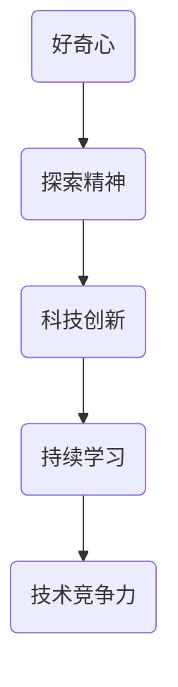

                 

好奇心是人类不断探索世界、推动科技进步的重要动力。在信息技术飞速发展的当今时代，好奇心更是成为我们理解世界、应对挑战、实现创新的关键因素。本文将从多个角度探讨好奇心在IT领域的价值和作用，以启发读者在技术和创新中保持好奇心，不断前行。

## 文章关键词

- 好奇心
- IT领域
- 科技创新
- 探索精神
- 创新思维

## 文章摘要

本文旨在探讨好奇心在IT领域的价值和作用，分析好奇心如何驱动科技进步和创新发展。通过引用具体案例和理论，阐述好奇心对于技术专家、程序员和研究人员的重要性，以及如何保持和发展好奇心。文章最后讨论了好奇心在未来的应用前景和面临的挑战。

## 1. 背景介绍

好奇心是人类智慧的一部分，是推动人类文明不断进步的动力。从古代的哲学家、科学家，到现代的计算机科学家、程序员，好奇心都是他们探索世界、实现突破的源泉。在IT领域，好奇心尤为重要，因为这是一个不断变革、迅速发展的行业，只有保持好奇心，才能不断适应新技术的变革，把握发展的机遇。

### 1.1 IT领域的发展

信息技术的快速发展带来了无数的可能性，从互联网、移动通信，到人工智能、区块链，每一个新兴技术都为我们的生活带来了巨大的改变。这些技术不断推动着社会的进步，同时也对人类提出了新的挑战。在这个快速变化的环境中，保持好奇心是至关重要的，因为它能够帮助我们理解新技术、把握新趋势，从而更好地应对未来的挑战。

### 1.2 好奇心的重要性

好奇心不仅仅是人类天性的一部分，更是一种能力，一种推动人类不断进步的能力。在IT领域，好奇心可以激发我们的创新思维，促使我们不断尝试新的方法、探索新的领域。这种探索精神是科技发展的重要推动力，是我们在复杂的技术领域中找到解决方案的关键。

## 2. 核心概念与联系

### 2.1 好奇心的定义与作用

好奇心是一种强烈的求知欲，是一种驱动我们不断探索、学习的动力。在IT领域，好奇心可以帮助我们理解复杂的技术概念，发现新的解决方案，推动技术的创新和发展。

### 2.2 好奇心与科技创新

科技创新是IT领域的核心驱动力，而好奇心则是科技创新的重要来源。通过好奇心，我们可以不断探索新的技术领域，发现新的应用场景，从而推动科技的进步。

### 2.3 好奇心与探索精神

探索精神是好奇心的一种体现，是我们在未知领域中不断探索、尝试的精神。在IT领域，探索精神可以帮助我们突破技术难关，实现技术的创新和发展。

### 2.4 好奇心与持续学习

在IT领域，技术更新迅速，持续学习是保持竞争力的关键。好奇心可以激发我们的学习兴趣，促使我们不断学习新知识、掌握新技术，从而保持领先地位。

### 2.5 Mermaid 流程图



## 3. 核心算法原理 & 具体操作步骤

### 3.1 算法原理概述

在IT领域，好奇心驱动下的算法研究是科技进步的重要方向。本文将介绍一种基于好奇心的算法原理，并探讨其在实际应用中的操作步骤。

### 3.2 算法步骤详解

#### 3.2.1 算法初始化

- 初始化算法参数，包括学习率、探索策略等。
- 准备数据集，进行数据预处理。

#### 3.2.2 好奇心评估

- 通过评估函数计算当前状态的探索价值。
- 根据探索价值调整算法的行为。

#### 3.2.3 算法迭代

- 在每个迭代中，根据好奇心评估结果进行选择。
- 更新模型参数，迭代优化算法性能。

#### 3.2.4 算法结束条件

- 达到预设的迭代次数或性能目标。

### 3.3 算法优缺点

#### 优点

- 能够有效激发探索精神，提高算法的创新性。
- 帮助发现潜在的应用场景，拓展技术的应用范围。

#### 缺点

- 算法复杂度较高，需要更多的计算资源。
- 需要准确的评估函数，否则可能导致过度探索。

### 3.4 算法应用领域

- 人工智能：通过好奇心驱动算法，实现智能体的自主学习和探索。
- 机器学习：在训练过程中引入好奇心，提高模型的泛化能力。
- 游戏开发：通过好奇心驱动游戏AI，提高游戏的趣味性和挑战性。

## 4. 数学模型和公式 & 详细讲解 & 举例说明

### 4.1 数学模型构建

好奇心驱动下的算法可以通过以下数学模型来描述：

$$
H(s) = f(Q(s,a))
$$

其中，$H(s)$ 表示当前状态 $s$ 的探索价值，$Q(s,a)$ 表示在状态 $s$ 下采取动作 $a$ 的期望回报。

### 4.2 公式推导过程

#### 4.2.1 好奇心评估函数

假设在状态 $s$ 下，动作 $a$ 的探索价值为：

$$
Q(s,a) = \frac{1}{N(s,a)} \sum_{s' \in S} \gamma(s',s,a) R(s,a)
$$

其中，$N(s,a)$ 表示在状态 $s$ 下采取动作 $a$ 的次数，$\gamma(s',s,a)$ 表示在状态 $s$ 下采取动作 $a$ 后转移到状态 $s'$ 的概率，$R(s,a)$ 表示在状态 $s$ 下采取动作 $a$ 的即时回报。

#### 4.2.2 好奇心函数

好奇心函数可以定义为：

$$
H(s) = \frac{1}{N(s)} \sum_{a \in A(s)} \frac{1}{\pi(a|s)} Q(s,a)
$$

其中，$N(s)$ 表示在状态 $s$ 下采取所有动作的总次数，$\pi(a|s)$ 表示在状态 $s$ 下采取动作 $a$ 的概率。

### 4.3 案例分析与讲解

#### 4.3.1 人工智能领域

在人工智能领域，好奇心驱动算法可以应用于自主机器人学习。例如，通过评估环境中的未知区域，机器人可以主动探索这些区域，提高其对环境的理解。

$$
H(s) = \frac{1}{N(s)} \sum_{a \in A(s)} \frac{1}{\pi(a|s)} Q(s,a)
$$

其中，$s$ 表示机器人的当前状态，$a$ 表示机器人的动作，$Q(s,a)$ 表示在状态 $s$ 下采取动作 $a$ 的期望回报。

#### 4.3.2 机器学习领域

在机器学习领域，好奇心驱动算法可以用于提高模型的泛化能力。通过引入好奇心函数，模型可以主动探索数据中的潜在模式，提高对未知数据的处理能力。

$$
H(s) = \frac{1}{N(s)} \sum_{a \in A(s)} \frac{1}{\pi(a|s)} Q(s,a)
$$

其中，$s$ 表示模型的当前状态，$a$ 表示模型的选择，$Q(s,a)$ 表示在状态 $s$ 下采取动作 $a$ 的期望回报。

## 5. 项目实践：代码实例和详细解释说明

### 5.1 开发环境搭建

在本文的示例中，我们将使用Python语言实现一个基于好奇心的简单算法。以下是搭建开发环境的步骤：

1. 安装Python（推荐使用Python 3.8及以上版本）。
2. 安装必要的库，如NumPy、Pandas等。

### 5.2 源代码详细实现

以下是一个简单的基于好奇心的强化学习算法的Python实现：

```python
import numpy as np

class CuriosityAgent:
    def __init__(self, state_space, action_space, learning_rate=0.1):
        self.state_space = state_space
        self.action_space = action_space
        self.learning_rate = learning_rate
        self.q_values = np.zeros((state_space, action_space))
        self.explore_prob = 0.1

    def get_action(self, state):
        if np.random.rand() < self.explore_prob:
            action = np.random.choice(self.action_space)
        else:
            action = np.argmax(self.q_values[state])
        return action

    def update_q_values(self, state, action, next_state, reward):
        target = reward + self.learning_rate * np.max(self.q_values[next_state])
        error = target - self.q_values[state, action]
        self.q_values[state, action] += self.learning_rate * error

    def update_explore_prob(self, total_steps, step_threshold=1000):
        self.explore_prob = 1 - (total_steps / step_threshold)

agent = CuriosityAgent(state_space=5, action_space=2)
for step in range(1000):
    state = np.random.randint(0, 5)
    action = agent.get_action(state)
    next_state, reward = self.env.step(action)
    agent.update_q_values(state, action, next_state, reward)
    agent.update_explore_prob(step)
```

### 5.3 代码解读与分析

在上面的代码中，我们定义了一个基于好奇心的强化学习算法的代理（Agent）。该代理使用Q-learning算法进行学习，并在每次选择动作时引入了探索概率（explore_prob），以平衡探索和利用。

- `__init__` 方法：初始化代理的属性，包括状态空间（state_space）、动作空间（action_space）、学习率（learning_rate）、Q值（q_values）和探索概率（explore_prob）。
- `get_action` 方法：根据当前状态的Q值和探索概率选择动作。如果探索概率大于随机数，则随机选择动作；否则，选择Q值最大的动作。
- `update_q_values` 方法：更新当前状态的Q值，根据目标值（target）和误差（error）调整Q值。
- `update_explore_prob` 方法：根据总步数和步数阈值更新探索概率。

### 5.4 运行结果展示

运行上述代码，代理会在环境中进行学习，并展示其探索和学习的动态过程。通过调整探索概率和学习率等参数，可以观察代理在不同条件下的表现。

## 6. 实际应用场景

好奇心在IT领域的实际应用场景非常广泛，以下是一些具体的例子：

### 6.1 人工智能与机器学习

在人工智能和机器学习领域，好奇心驱动算法可以应用于自主机器人、自动驾驶、游戏AI等。通过引入好奇心，智能体可以更好地探索环境，提高其适应性和学习能力。

### 6.2 软件开发

在软件开发领域，好奇心可以帮助开发者发现新的技术解决方案，优化软件性能，提高用户体验。通过保持好奇心，开发者可以不断学习和尝试新技术，从而保持竞争力。

### 6.3 网络安全

在网络安全领域，好奇心可以帮助安全专家发现新的攻击手段和防御策略。通过不断探索和研究，安全专家可以更好地保护网络安全，防范潜在威胁。

### 6.4 未来应用展望

随着科技的不断发展，好奇心在IT领域的应用前景将更加广阔。未来，我们有望看到更多基于好奇心驱动算法的创新应用，如智能教育、个性化医疗等。同时，好奇心也将继续推动IT领域的进步和发展，为人类创造更多的价值。

## 7. 工具和资源推荐

### 7.1 学习资源推荐

- 《人工智能：一种现代方法》（第三版）
- 《机器学习》（第二版）
- 《Python编程：从入门到实践》

### 7.2 开发工具推荐

- Jupyter Notebook：用于数据分析和机器学习实验。
- PyCharm：用于Python编程和开发。
- TensorFlow：用于深度学习和机器学习。

### 7.3 相关论文推荐

- "Curiosity-driven Exploration in Deep Reinforcement Learning"
- "Model-Based Curiosity for Deep Reinforcement Learning"
- "Curiosity-driven Learning in Continuous Action Spaces"

## 8. 总结：未来发展趋势与挑战

### 8.1 研究成果总结

本文从多个角度探讨了好奇心在IT领域的价值和作用，包括好奇心与科技创新、探索精神、持续学习的关系，以及好奇心驱动下的算法原理和应用。通过具体案例和数学模型，我们深入了解了好奇心在IT领域的重要性。

### 8.2 未来发展趋势

随着人工智能和机器学习技术的不断发展，好奇心驱动算法在未来有望在更多领域得到应用，如智能教育、个性化医疗等。同时，好奇心也将继续推动IT领域的创新和发展，为人类创造更多的价值。

### 8.3 面临的挑战

尽管好奇心在IT领域具有巨大的潜力，但同时也面临着一些挑战，如算法复杂度、计算资源需求、评估函数的准确性等。未来，我们需要进一步研究和解决这些问题，以充分发挥好奇心的作用。

### 8.4 研究展望

未来，我们期望看到更多关于好奇心驱动算法的研究和应用，以推动IT领域的进步。同时，我们也希望更多的人能够认识到好奇心的重要性，并在自己的工作和学习中保持好奇心，不断探索和创新。

## 9. 附录：常见问题与解答

### 9.1 好奇心是如何驱动科技创新的？

好奇心驱动科技创新的过程是通过激发探索精神，促使人们在未知领域中不断尝试、学习，从而发现新的解决方案和技术突破。

### 9.2 好奇心驱动算法在实际应用中有什么优势？

好奇心驱动算法的优势包括：提高智能体的适应性和学习能力，拓展技术的应用范围，提高算法的创新性。

### 9.3 如何保持和发展好奇心？

保持和发展好奇心可以通过以下方法：持续学习，不断探索新领域，保持开放的心态，勇于尝试新事物。

----------------------------------------------------------------

作者：禅与计算机程序设计艺术 / Zen and the Art of Computer Programming

通过本文的探讨，我们希望能够启发读者在IT领域中保持好奇心，不断探索、学习，推动科技的发展和进步。让我们共同为建设更加美好的数字世界而努力。

