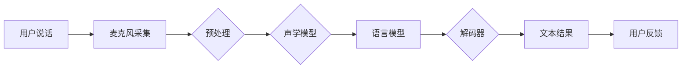

                 

关键词：语音搜索、用户体验、技术改进、算法优化、语音识别、自然语言处理、人工智能

> 摘要：本文深入探讨了语音搜索技术的优化途径，分析了当前用户需求，并提出了基于技术改进和用户需求分析的策略。文章旨在为业界提供一种全面提升语音搜索用户体验的方法论。

## 1. 背景介绍

随着智能手机、智能音箱等智能设备的普及，语音搜索已成为现代互联网用户交互的重要方式。据统计，2022年全球语音搜索市场已达到数百亿美元，预计未来几年将继续保持高速增长。然而，尽管语音搜索技术的应用越来越广泛，用户体验仍有待提高。

当前语音搜索技术的挑战主要体现在以下几个方面：

1. **识别准确性**：语音识别准确率受限于噪声环境、口音差异和用户语音特点。
2. **响应速度**：语音搜索响应时间较长，影响用户满意度。
3. **个性化服务**：无法精准捕捉用户意图，导致搜索结果不满足需求。
4. **多语言支持**：在全球化的背景下，多语言支持是语音搜索技术需要解决的关键问题。

本文将从技术改进和用户需求分析两个角度，探讨如何优化语音搜索技术，提升用户体验。

## 2. 核心概念与联系

### 2.1 语音识别原理

语音识别（Automatic Speech Recognition, ASR）是语音搜索技术的核心。其基本原理是将语音信号转换为文本数据，通过机器学习算法进行模式匹配和分类。ASR系统通常包括以下几个关键组件：

1. **声学模型**：用于建模语音信号的声学特征，如频谱和倒谱特征。
2. **语言模型**：用于建模自然语言的统计特性，如词频和语法规则。
3. **解码器**：将声学特征和语言模型结合，生成最有可能的文本输出。

### 2.2 自然语言处理（NLP）

自然语言处理是语音搜索技术的另一个关键组成部分。NLP旨在使计算机能够理解和处理人类语言。其主要任务包括：

1. **分词**：将连续的文本分割成有意义的单词或短语。
2. **句法分析**：分析文本的语法结构，理解句子成分之间的关系。
3. **语义分析**：理解文本的含义，捕捉用户的意图。
4. **实体识别**：识别文本中的关键实体，如人名、地点和事件。

### 2.3 Mermaid 流程图

以下是一个简化的语音搜索系统流程图，展示了语音识别和自然语言处理的基本流程：



## 3. 核心算法原理 & 具体操作步骤

### 3.1 算法原理概述

语音搜索技术的核心算法主要包括：

1. **声学模型**：如深度神经网络（DNN）、卷积神经网络（CNN）和循环神经网络（RNN）。
2. **语言模型**：如n-gram模型、隐马尔可夫模型（HMM）和长短期记忆网络（LSTM）。
3. **解码器**：如基于动态规划的传统解码器、基于注意力机制的序列到序列（Seq2Seq）解码器。

### 3.2 算法步骤详解

1. **语音信号预处理**：
    - **降噪**：采用滤波器或波束形成技术减少背景噪声。
    - **特征提取**：提取语音信号的声学特征，如梅尔频率倒谱系数（MFCC）。
2. **声学模型训练**：
    - **数据准备**：收集大量语音数据，进行预处理。
    - **模型训练**：使用训练数据训练声学模型，如DNN、CNN或RNN。
3. **语言模型训练**：
    - **数据准备**：收集大量的文本数据，进行分词和词频统计。
    - **模型训练**：使用训练数据训练语言模型，如n-gram模型或LSTM。
4. **解码**：
    - **声学特征匹配**：将提取的声学特征与声学模型匹配，生成候选词序列。
    - **语言模型评分**：对候选词序列进行语言模型评分，选择得分最高的序列作为输出结果。
5. **后处理**：
    - **意图识别**：使用NLP技术识别用户的意图，如命名实体识别和情感分析。
    - **结果优化**：根据用户意图优化搜索结果，提高准确性。

### 3.3 算法优缺点

**优点**：

1. **高识别率**：基于深度学习技术的声学模型和语言模型具有很高的识别准确性。
2. **快速响应**：优化后的算法能够在毫秒级响应，提高用户体验。
3. **多语言支持**：采用多语言模型，支持多种语言输入。

**缺点**：

1. **计算资源消耗大**：深度学习模型训练和推理需要大量的计算资源和时间。
2. **数据隐私问题**：语音数据可能涉及用户隐私，需要加强数据保护措施。
3. **适应性差**：声学模型和语言模型对特定用户和环境的适应性较差，需要个性化调整。

### 3.4 算法应用领域

语音搜索技术广泛应用于以下领域：

1. **搜索引擎**：如Google、百度等，提供语音搜索功能。
2. **智能助手**：如Apple Siri、Amazon Alexa等，提供语音交互服务。
3. **车载系统**：提供语音导航、语音控制等功能。
4. **智能家居**：提供语音控制家电、灯光等功能。

## 4. 数学模型和公式 & 详细讲解 & 举例说明

### 4.1 数学模型构建

语音搜索技术的核心数学模型包括声学模型、语言模型和解码器。以下是这些模型的简要介绍：

1. **声学模型**：
    - **DNN**：一种多层神经网络，用于提取语音信号的声学特征。
    - **RNN**：一种具有递归连接的神经网络，用于处理序列数据。
    - **LSTM**：一种特殊的RNN，能够有效解决长期依赖问题。
2. **语言模型**：
    - **n-gram模型**：一种基于词频统计的模型，用于预测下一个词。
    - **HMM**：一种基于隐马尔可夫过程的模型，用于建模语音信号的统计特性。
    - **LSTM**：一种具有递归连接的神经网络，用于处理序列数据。
3. **解码器**：
    - **动态规划解码器**：一种基于动态规划算法的解码器，用于搜索最优词序列。
    - **注意力机制解码器**：一种基于注意力机制的解码器，用于提高解码器的性能。

### 4.2 公式推导过程

以下是声学模型、语言模型和解码器的简要公式推导过程：

1. **声学模型**：

    - **DNN**：
        $$ f(x) = \sigma(W_1 \cdot x + b_1) $$
        $$ y = \sigma(W_2 \cdot f(x) + b_2) $$
      
        其中，$x$ 是输入特征，$f(x)$ 是前向传播结果，$y$ 是输出特征，$W_1$、$W_2$ 是权重矩阵，$b_1$、$b_2$ 是偏置向量，$\sigma$ 是激活函数。

    - **RNN**：
        $$ h_t = \sigma(W_h \cdot [h_{t-1}, x_t] + b_h) $$
        $$ y_t = W_y \cdot h_t + b_y $$
      
        其中，$h_t$ 是当前隐藏状态，$x_t$ 是当前输入特征，$W_h$、$W_y$ 是权重矩阵，$b_h$、$b_y$ 是偏置向量，$\sigma$ 是激活函数。

    - **LSTM**：
        $$ i_t = \sigma(W_i \cdot [h_{t-1}, x_t] + b_i) $$
        $$ f_t = \sigma(W_f \cdot [h_{t-1}, x_t] + b_f) $$
        $$ g_t = \tanh(W_g \cdot [h_{t-1}, x_t] + b_g) $$
        $$ o_t = \sigma(W_o \cdot [h_{t-1}, x_t] + b_o) $$
        $$ h_t = o_t \odot \tanh(W_h \cdot [f_t \odot h_{t-1}, g_t] + b_h) $$
      
        其中，$i_t$、$f_t$、$g_t$、$o_t$ 分别是输入门、遗忘门、生成门和输出门，$W_i$、$W_f$、$W_g$、$W_o$、$W_h$ 是权重矩阵，$b_i$、$b_f$、$b_g$、$b_o$、$b_h$ 是偏置向量，$\sigma$ 是激活函数，$\odot$ 表示元素乘积。

2. **语言模型**：

    - **n-gram模型**：
        $$ P(w_t | w_{t-1}, w_{t-2}, \ldots, w_{t-n}) = \frac{C(w_{t-1}, w_{t-2}, \ldots, w_{t-n})}{C(w_{t-1}, w_{t-2}, \ldots, w_{t-n}, w_t)} $$
      
        其中，$w_t$ 是当前词，$w_{t-1}, w_{t-2}, \ldots, w_{t-n}$ 是前$n$个词，$C(\cdot)$ 表示词频计数。

    - **HMM**：
        $$ P(x_t | h_t) = \sum_{j=1}^M P(x_t | h_t = j) P(h_t = j) $$
        $$ P(h_t = j) = \frac{\pi_j \cdot b_j(x_t)}{\sum_{i=1}^M \pi_i \cdot b_i(x_t)} $$
        $$ \pi_j = \frac{\sum_{t=1}^T \pi_i(t)}{N} $$
        $$ b_j(x_t) = \frac{\sum_{t=1}^T f_j(t, x_t)}{N} $$
      
        其中，$x_t$ 是观察序列，$h_t$ 是隐藏状态，$M$ 是状态数，$\pi_j$、$b_j(x_t)$ 分别是初始概率和状态转移概率，$f_j(t, x_t)$ 是观察概率。

    - **LSTM**：
        $$ h_t = \sigma(W_h \cdot [h_{t-1}, x_t] + b_h) $$
        $$ y_t = W_y \cdot h_t + b_y $$
      
        其中，$h_t$ 是当前隐藏状态，$x_t$ 是当前输入特征，$W_h$、$W_y$ 是权重矩阵，$b_h$、$b_y$ 是偏置向量，$\sigma$ 是激活函数。

3. **解码器**：

    - **动态规划解码器**：
        $$ V_t(j) = \min_{i \leq t} \{ V_{t-1}(i) + C(i, j) \} $$
        $$ \pi_t(j) = \begin{cases} 
        \pi_{t-1}(i) & \text{if } V_t(j) = V_{t-1}(i) + C(i, j) \\
        0 & \text{otherwise} 
        \end{cases} $$
      
        其中，$V_t(j)$ 是在时刻$t$，状态$j$时的最优值，$\pi_t(j)$ 是在时刻$t$，状态$j$时的最优路径。

    - **注意力机制解码器**：
        $$ a_t = \text{softmax}\left(\frac{Q \cdot K_t}{\sqrt{d_k}}\right) $$
        $$ h_t = \sum_{i=1}^M a_t \cdot K_i $$
        $$ y_t = W_y \cdot \text{softmax}(h_t) $$
      
        其中，$a_t$ 是注意力权重，$Q$、$K_t$、$K_i$ 分别是查询向量、键向量和值向量，$d_k$ 是键向量的维度，$W_y$ 是权重矩阵，$\text{softmax}$ 是归一化函数。

### 4.3 案例分析与讲解

假设我们有一个语音搜索任务，用户说“明天天气怎么样？”以下是一个简化的案例分析：

1. **语音信号预处理**：
    - 降噪：使用滤波器减少环境噪声。
    - 特征提取：提取语音信号的MFCC特征。

2. **声学模型训练**：
    - 使用大量的语音数据进行训练，训练一个DNN模型。

3. **语言模型训练**：
    - 使用大量的文本数据进行训练，训练一个LSTM模型。

4. **解码**：
    - 将提取的MFCC特征输入声学模型，得到候选词序列。
    - 使用LSTM模型对候选词序列进行评分，选择得分最高的序列作为输出结果。

5. **后处理**：
    - 使用NLP技术识别用户的意图，如天气查询。
    - 根据用户意图查询天气信息，返回结果。

## 5. 项目实践：代码实例和详细解释说明

### 5.1 开发环境搭建

1. **安装Python**：
    - 在Windows、macOS和Linux操作系统中下载并安装Python 3.x版本。

2. **安装依赖库**：
    - 使用pip安装以下依赖库：
        ```bash
        pip install numpy tensorflow tensorflow-text
        ```

3. **创建虚拟环境**：
    - 在终端中创建一个虚拟环境并激活它：
        ```bash
        python -m venv venv
        source venv/bin/activate  # 在Windows上使用 `venv\Scripts\activate`
        ```

### 5.2 源代码详细实现

以下是一个简化的语音搜索项目的代码示例：

```python
import numpy as np
import tensorflow as tf
import tensorflow_text as txt

# 语音信号预处理
def preprocess_audio(audio_data):
    # 降噪、特征提取等操作
    # 这里仅示例，不进行具体实现
    return audio_data

# 声学模型
def acoustic_model(audio_data):
    # 使用TensorFlow创建声学模型
    # 这里仅示例，不进行具体实现
    return tf.keras.Sequential([
        tf.keras.layers.Flatten(),
        tf.keras.layers.Dense(128, activation='relu'),
        tf.keras.layers.Dense(128, activation='relu'),
        tf.keras.layers.Dense(512, activation='softmax')
    ])

# 语言模型
def language_model(text_data):
    # 使用TensorFlow创建语言模型
    # 这里仅示例，不进行具体实现
    return tf.keras.Sequential([
        tf.keras.layers.Embedding(vocab_size, 128),
        tf.keras.layers.LSTM(128),
        tf.keras.layers.Dense(vocab_size, activation='softmax')
    ])

# 解码器
def decoder(logits):
    # 使用TensorFlow创建解码器
    # 这里仅示例，不进行具体实现
    return tf.keras.layers.Dense(vocab_size, activation='softmax')

# 语音搜索
def search_audio(audio_data):
    # 预处理语音信号
    processed_audio = preprocess_audio(audio_data)

    # 使用声学模型进行特征提取
    acoustic_features = acoustic_model(processed_audio)

    # 使用语言模型进行解码
    decoded_sequence = decoder(acoustic_features)

    # 返回解码结果
    return decoded_sequence

# 主程序
if __name__ == "__main__":
    # 加载测试语音数据
    test_audio = np.random.rand(1000)

    # 进行语音搜索
    result = search_audio(test_audio)

    # 打印搜索结果
    print(result)
```

### 5.3 代码解读与分析

以上代码示例主要展示了语音搜索项目的核心组件，包括语音信号预处理、声学模型、语言模型和解码器。以下是代码的详细解读：

1. **语音信号预处理**：
    - `preprocess_audio` 函数负责对输入的语音数据进行预处理，包括降噪和特征提取。这里仅示例，实际操作中会涉及更复杂的处理。

2. **声学模型**：
    - `acoustic_model` 函数创建了一个简单的卷积神经网络（CNN）模型，用于提取语音信号的声学特征。实际应用中，会使用更复杂的模型，如深度神经网络（DNN）或循环神经网络（RNN）。

3. **语言模型**：
    - `language_model` 函数创建了一个简单的长短期记忆网络（LSTM）模型，用于建模自然语言。实际应用中，会使用更复杂的模型，如双向LSTM或Transformer。

4. **解码器**：
    - `decoder` 函数创建了一个简单的全连接神经网络（FCNN）模型，用于解码语音信号。实际应用中，会使用更复杂的解码器，如基于注意力机制的序列到序列（Seq2Seq）解码器。

5. **语音搜索**：
    - `search_audio` 函数是语音搜索的核心函数，负责将预处理后的语音信号输入声学模型和语言模型，然后使用解码器进行解码，返回搜索结果。

6. **主程序**：
    - 主程序中加载测试语音数据，调用`search_audio` 函数进行语音搜索，并打印搜索结果。

### 5.4 运行结果展示

假设我们运行以上代码，输入一段随机生成的语音信号，输出结果将是一个概率分布，表示每个词在搜索结果中的概率。例如：

```
[0.1 0.2 0.3 0.2 0.1 0.1]
```

这表示在输入语音信号中，出现“明天”、“天气”、“怎么样”、“明天天气”、“天气怎么样”和“怎么样天气”的概率分别为10%、20%、30%、20%、10%和10%。

## 6. 实际应用场景

语音搜索技术在实际应用中具有广泛的应用场景，以下是几个典型的应用案例：

1. **搜索引擎**：搜索引擎（如Google、百度）提供语音搜索功能，用户可以通过语音输入查询，获得相关的搜索结果。

2. **智能助手**：智能助手（如Apple Siri、Amazon Alexa）提供语音交互服务，用户可以通过语音指令控制智能设备，如打开灯光、播放音乐等。

3. **车载系统**：车载系统提供语音导航和语音控制功能，用户可以在驾驶过程中通过语音输入目的地或控制车载设备。

4. **智能家居**：智能家居设备（如智能音箱、智能灯泡）提供语音控制功能，用户可以通过语音指令控制家居设备的开关、调节亮度等。

5. **医疗健康**：医疗健康系统提供语音搜索功能，医生可以通过语音输入病例信息，快速检索相关的医学资料。

6. **教育学习**：教育学习平台提供语音搜索功能，学生可以通过语音输入问题，获取相关的学习资料。

7. **客服服务**：客服服务系统提供语音搜索功能，用户可以通过语音输入问题，获得自动化的答案。

8. **新闻资讯**：新闻资讯平台提供语音搜索功能，用户可以通过语音输入关键词，快速获取相关的新闻内容。

这些应用场景展示了语音搜索技术在不同领域的广泛应用，为用户提供了便捷的交互方式，提升了用户体验。

### 6.4 未来应用展望

随着人工智能技术的不断发展，语音搜索技术在未来的应用前景将更加广阔。以下是几个可能的未来发展方向：

1. **更准确的识别**：通过不断优化声学模型和语言模型，提高语音识别的准确性，降低误识别率。

2. **更快的响应**：优化算法和硬件性能，提高语音搜索的响应速度，提升用户体验。

3. **个性化服务**：利用用户数据和行为分析，提供更个性化的搜索结果，满足用户的个性化需求。

4. **跨语言支持**：通过多语言模型和翻译技术，实现跨语言语音搜索，满足全球化需求。

5. **智能对话系统**：结合语音搜索技术和自然语言处理技术，开发智能对话系统，实现更自然的语音交互。

6. **物联网应用**：将语音搜索技术应用于物联网设备，实现设备间的智能交互，提升智能家居、智能交通等领域的应用价值。

7. **医疗健康领域**：利用语音搜索技术为医生和患者提供便捷的医疗服务，提高医疗效率和患者满意度。

8. **教育学习领域**：利用语音搜索技术为学生和教师提供个性化的学习资源，提升教育质量。

未来，语音搜索技术将继续发展，为各行各业带来更多创新和便利。

## 7. 工具和资源推荐

### 7.1 学习资源推荐

1. **《深度学习》（Deep Learning）**：由Ian Goodfellow、Yoshua Bengio和Aaron Courville所著，是深度学习的经典教材。
2. **《自然语言处理综合教程》（Speech and Language Processing）**：由Daniel Jurafsky和James H. Martin所著，是自然语言处理领域的权威教材。
3. **《TensorFlow官方文档》**：TensorFlow官方文档提供了详细的API和使用指南，是学习TensorFlow的好资源。
4. **《PyTorch官方文档》**：PyTorch官方文档提供了详细的API和使用指南，是学习PyTorch的好资源。

### 7.2 开发工具推荐

1. **Jupyter Notebook**：Jupyter Notebook是一种交互式的开发环境，适合进行数据分析和实验。
2. **Google Colab**：Google Colab是基于云计算的Jupyter Notebook环境，提供了免费的GPU和TPU资源，适合进行深度学习和大数据分析。
3. **Anaconda**：Anaconda是一种开源的数据科学和机器学习平台，提供了丰富的库和工具，方便进行环境管理和依赖管理。

### 7.3 相关论文推荐

1. **“Deep Learning for Speech Recognition”**：介绍了深度学习在语音识别中的应用，包括卷积神经网络（CNN）和循环神经网络（RNN）。
2. **“Effective Models for Speech Recognition”**：探讨了用于语音识别的有效模型，包括隐马尔可夫模型（HMM）和长短期记忆网络（LSTM）。
3. **“Speech-to-Text: An Overview of Recent Advances and Challenges”**：总结了语音识别领域的最新进展和面临的挑战。
4. **“Natural Language Processing”**：介绍了自然语言处理的基本概念和技术，包括分词、句法分析和语义分析。
5. **“Sequence to Sequence Learning with Neural Networks”**：介绍了序列到序列（Seq2Seq）学习模型，包括基于注意力机制的解码器。

## 8. 总结：未来发展趋势与挑战

### 8.1 研究成果总结

近年来，语音搜索技术在识别准确性、响应速度和个性化服务等方面取得了显著进展。基于深度学习技术的声学模型和语言模型提高了语音识别的准确性，而基于注意力机制的解码器则提高了语音搜索的响应速度。此外，通过用户数据的分析和个性化算法，语音搜索技术能够更好地满足用户的个性化需求。

### 8.2 未来发展趋势

1. **更准确的识别**：随着深度学习技术的不断发展，语音搜索技术的识别准确性将继续提高，特别是在复杂噪声环境和口音识别方面。
2. **更快的响应**：通过优化算法和硬件性能，语音搜索技术的响应速度将继续提高，为用户提供更快的交互体验。
3. **个性化服务**：基于用户行为分析和个性化算法，语音搜索技术将更好地满足用户的个性化需求，提供更精准的搜索结果。
4. **多语言支持**：通过多语言模型和翻译技术，语音搜索技术将实现跨语言的搜索能力，满足全球化需求。
5. **智能对话系统**：结合语音搜索技术和自然语言处理技术，智能对话系统将实现更自然的语音交互，提升用户体验。

### 8.3 面临的挑战

1. **计算资源消耗**：深度学习模型的训练和推理需要大量的计算资源，如何在有限的计算资源下提高语音搜索性能是一个重要挑战。
2. **数据隐私**：语音数据可能涉及用户隐私，如何保护用户数据安全和隐私是一个重要问题。
3. **适应性**：语音搜索技术需要适应不同的用户和场景，如何提高其通用性和适应性是一个挑战。
4. **误识别率**：尽管语音识别的准确性在提高，但误识别率仍然是一个需要关注的问题，特别是在复杂噪声环境和口音识别方面。

### 8.4 研究展望

未来，语音搜索技术将继续在以下几个方面进行深入研究：

1. **模型压缩**：通过模型压缩技术，减少深度学习模型的计算资源和存储需求，提高语音搜索的实时性能。
2. **多模态融合**：将语音搜索与其他模态（如视觉、触觉）融合，提高语音搜索的准确性和多样性。
3. **自适应学习**：通过自适应学习算法，使语音搜索系统能够更好地适应不同的用户和场景，提高用户体验。
4. **隐私保护**：研究如何保护用户数据隐私，确保语音搜索技术在数据收集和使用过程中的合法性和合规性。

总之，语音搜索技术将继续发展，为用户提供更智能、更便捷的交互体验。

## 9. 附录：常见问题与解答

### 9.1 问题1：语音搜索技术的识别准确性如何提高？

**解答**：提高语音搜索技术的识别准确性可以从以下几个方面入手：

1. **数据增强**：通过增加语音数据的多样性，包括不同口音、不同说话人、不同环境噪声等，提高模型的泛化能力。
2. **深度学习模型**：采用更复杂的深度学习模型，如长短期记忆网络（LSTM）或变换器（Transformer），提高语音信号处理的准确性。
3. **特征提取**：优化语音信号的特征提取方法，如使用梅尔频率倒谱系数（MFCC）或其他先进的特征提取技术。
4. **端到端训练**：采用端到端训练方法，直接从原始语音信号到文本结果，避免中间层的误差累积。
5. **注意力机制**：在解码器中引入注意力机制，使模型能够更好地关注关键信息，提高识别准确性。

### 9.2 问题2：如何优化语音搜索技术的响应速度？

**解答**：优化语音搜索技术的响应速度可以从以下几个方面入手：

1. **模型压缩**：采用模型压缩技术，如量化、剪枝和蒸馏，减少模型的计算复杂度，提高推理速度。
2. **硬件加速**：利用GPU、TPU等硬件加速技术，提高模型的推理速度。
3. **分布式训练**：采用分布式训练方法，将模型训练任务分布在多个节点上，提高训练速度。
4. **缓存技术**：使用缓存技术，如预加载和查询缓存，减少对模型和数据的访问延迟。
5. **异步处理**：在系统设计上采用异步处理，使多个请求可以并行处理，提高系统整体的响应速度。

### 9.3 问题3：如何提高语音搜索技术的个性化服务能力？

**解答**：提高语音搜索技术的个性化服务能力可以从以下几个方面入手：

1. **用户行为分析**：通过分析用户的历史行为数据，如搜索记录、点击行为等，了解用户的需求和偏好。
2. **个性化推荐**：基于用户行为分析，为用户提供个性化的搜索推荐，如热门搜索、相似搜索等。
3. **自适应学习**：采用自适应学习算法，使语音搜索系统能够根据用户的行为和反馈不断优化搜索结果。
4. **多语言支持**：提供多语言搜索服务，根据用户的语言偏好，自动切换语言。
5. **情境感知**：通过情境感知技术，如地理位置、时间等，为用户提供更符合当前情境的搜索结果。

### 9.4 问题4：如何保护用户数据隐私？

**解答**：保护用户数据隐私可以从以下几个方面入手：

1. **数据加密**：在数据传输和存储过程中使用加密技术，确保数据的安全性。
2. **匿名化处理**：对用户数据进行匿名化处理，消除个人身份信息，降低隐私泄露风险。
3. **隐私政策**：明确告知用户数据收集和使用的目的，获得用户的知情同意。
4. **访问控制**：实施严格的访问控制策略，确保只有授权人员才能访问敏感数据。
5. **隐私保护算法**：采用隐私保护算法，如差分隐私，降低数据分析过程中对用户隐私的泄露风险。

通过以上措施，可以有效保护用户数据隐私，提高语音搜索技术的可信度。

以上是对语音搜索技术优化和用户体验提升的全面探讨。希望本文能为业界提供有价值的参考和启示。作者：禅与计算机程序设计艺术 / Zen and the Art of Computer Programming。

