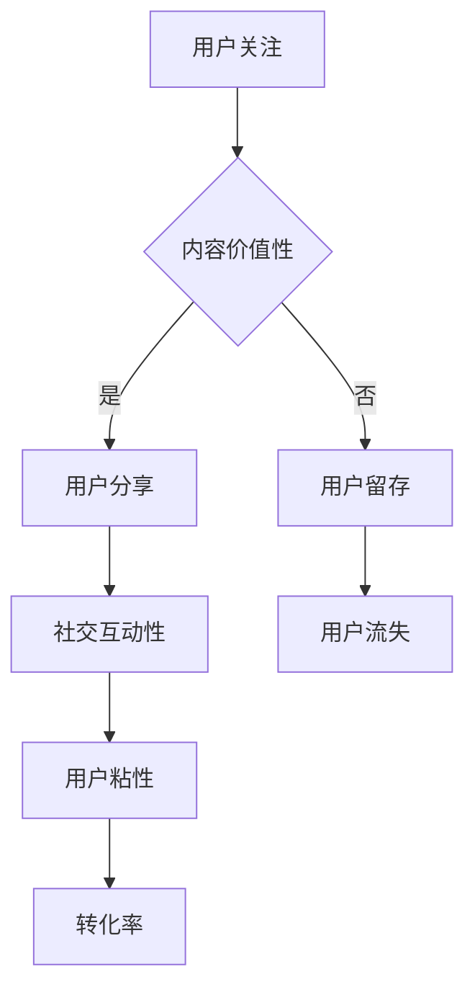

                 

关键词：病毒式营销、知识付费产品、推广策略、用户增长、技术创新

> 摘要：本文旨在探讨如何通过病毒式营销策略来推广知识付费产品。文章首先介绍了病毒式营销的概念和原理，然后分析了知识付费产品的特点，探讨了病毒式营销与知识付费产品的结合点。接着，本文提出了具体的应用方案和实施步骤，并通过实例说明了如何利用病毒式营销实现知识付费产品的成功推广。

## 1. 背景介绍

在当今数字化时代，信息传播速度空前加快，各种知识付费产品层出不穷。用户对于高质量、有针对性的知识内容需求日益增长，但同时也面临着信息过载的问题。如何有效地将知识付费产品推广给目标用户，提升用户粘性和转化率，成为企业面临的一大挑战。

病毒式营销（Viral Marketing）作为一种新兴的营销策略，近年来受到了广泛关注。病毒式营销的核心在于利用用户自身的社交网络，通过口碑传播实现品牌的快速推广。知识付费产品与病毒式营销的结合，有望在提升用户获取效率的同时，实现品牌价值的最大化。

本文将围绕以下问题展开讨论：

- 病毒式营销的定义和原理是什么？
- 知识付费产品的特点及其与病毒式营销的结合点是什么？
- 如何制定有效的病毒式营销策略来推广知识付费产品？
- 病毒式营销在知识付费产品推广中的实际应用案例有哪些？

通过本文的探讨，我们希望能够为企业在知识付费产品推广过程中提供有益的启示和指导。

### 2. 核心概念与联系

#### 2.1 病毒式营销的定义和原理

病毒式营销（Viral Marketing）是一种利用用户自身社交网络进行信息传播的营销策略。其核心在于创造具有病毒传播特性（如高转发率、高互动率）的内容，通过用户主动分享、转发、评论等方式，实现信息的快速扩散。

病毒式营销的基本原理可以概括为以下几点：

1. **内容吸引力**：创作具有吸引力的内容，如有趣的故事、实用的技巧、有启发性的观点等，吸引用户关注和参与。
2. **社交互动性**：设计互动性强的内容形式，如问答、投票、小游戏等，激发用户参与和分享欲望。
3. **传播途径**：通过社交媒体、论坛、博客等平台，利用用户之间的社交关系链，实现信息的快速传播。
4. **激励机制**：设置激励机制，如优惠券、积分、奖励等，鼓励用户主动分享和传播。

#### 2.2 知识付费产品的特点

知识付费产品是指用户通过支付一定费用，获取专业知识、技能、经验等有价值信息的产品。其特点主要包括：

1. **价值性**：知识付费产品提供的是具有实际价值的信息内容，能够帮助用户提升能力、解决问题。
2. **针对性**：知识付费产品通常针对特定领域或受众群体，内容更加精准、专业。
3. **稀缺性**：由于内容的专业性和独特性，知识付费产品具有一定的稀缺性，能够满足用户对高质量知识的追求。
4. **互动性**：知识付费产品往往提供一定的互动功能，如答疑、讨论、分享等，促进用户之间的交流和学习。

#### 2.3 病毒式营销与知识付费产品的结合点

病毒式营销与知识付费产品的结合点主要体现在以下几个方面：

1. **内容价值性**：知识付费产品本身具有高价值性，能够吸引用户关注和分享。
2. **社交互动性**：知识付费产品中的互动功能，如答疑、讨论等，有助于激发用户参与和传播。
3. **用户粘性**：知识付费产品的用户粘性强，用户在获取知识的过程中，更愿意通过社交网络分享和传播。
4. **转化率**：病毒式营销能够迅速扩大用户群体，提高知识付费产品的转化率。

#### 2.4 Mermaid 流程图

以下是一个简化的 Mermaid 流程图，展示了病毒式营销与知识付费产品的结合过程：



### 3. 核心算法原理 & 具体操作步骤

#### 3.1 算法原理概述

病毒式营销的核心算法原理主要涉及以下几个方面：

1. **内容创作**：创作具有吸引力、价值性和互动性的内容，以吸引用户关注和分享。
2. **社交网络分析**：利用社交网络分析技术，识别潜在用户群体和传播路径，优化信息传播效果。
3. **激励机制**：设计合适的激励机制，如优惠券、积分、奖励等，鼓励用户主动分享和传播。
4. **效果评估**：通过数据分析和效果评估，实时调整营销策略，提高营销效果。

#### 3.2 算法步骤详解

1. **内容创作**

   - **需求分析**：根据目标用户群体的特点和需求，确定内容主题和形式。
   - **内容创作**：结合专业知识和创意，创作具有吸引力和价值性的内容。
   - **内容优化**：根据用户反馈和传播效果，持续优化内容质量和传播策略。

2. **社交网络分析**

   - **用户画像**：通过数据分析，构建目标用户群体的画像，包括年龄、性别、职业、兴趣等。
   - **传播路径分析**：利用社交网络分析技术，识别潜在用户群体和传播路径。
   - **优化传播路径**：根据传播效果，调整传播路径和策略，提高信息传播效率。

3. **激励机制**

   - **优惠券**：提供限时优惠券，鼓励用户购买知识付费产品。
   - **积分奖励**：设计积分体系，鼓励用户分享和传播知识付费产品。
   - **互动奖励**：开展互动活动，如问答、讨论等，鼓励用户参与和传播。

4. **效果评估**

   - **数据收集**：收集用户行为数据，如访问量、分享量、转化率等。
   - **效果评估**：通过数据分析和效果评估，评估病毒式营销的效果。
   - **策略调整**：根据效果评估结果，实时调整营销策略，提高营销效果。

#### 3.3 算法优缺点

1. **优点**

   - **高效传播**：病毒式营销能够通过用户社交网络实现信息的快速传播，提高信息覆盖面。
   - **高用户粘性**：知识付费产品本身具有高价值性，能够提高用户粘性，促进用户留存。
   - **低成本**：病毒式营销相对于传统广告营销，成本较低，投入产出比高。

2. **缺点**

   - **传播效果不稳定**：病毒式营销的效果受内容质量、用户需求、传播途径等因素影响，存在一定的不确定性。
   - **用户隐私风险**：病毒式营销涉及用户社交网络数据，存在一定的用户隐私风险。

#### 3.4 算法应用领域

病毒式营销在知识付费产品推广中具有广泛的应用前景，主要应用领域包括：

1. **教育培训**：通过病毒式营销，推广线上课程、讲座、培训班等教育培训产品。
2. **专业咨询**：利用病毒式营销，推广专业咨询服务，如法律咨询、财务咨询等。
3. **技能培训**：通过病毒式营销，推广各类技能培训课程，如编程、设计、语言等。

### 4. 数学模型和公式

病毒式营销在知识付费产品推广中的效果可以用以下数学模型进行量化分析。

#### 4.1 数学模型构建

假设病毒式营销的传播效果可以用以下公式表示：

\[ E(t) = K \cdot (1 - e^{-rt}) \]

其中：

- \( E(t) \) 表示在时间 \( t \) 时刻的传播效果。
- \( K \) 表示初始传播效果。
- \( r \) 表示传播速度。

#### 4.2 公式推导过程

病毒式营销的传播效果可以通过以下步骤进行推导：

1. **用户关注**：用户在初始时刻关注知识付费产品，传播效果为 \( K \)。
2. **用户分享**：用户在关注后，通过社交网络分享知识付费产品，传播效果递增。
3. **传播速度**：传播速度与用户互动率、分享概率等因素相关，可以用 \( r \) 表示。

根据以上分析，我们可以得到病毒式营销的传播效果公式。

#### 4.3 案例分析与讲解

以下是一个具体的案例，展示如何利用病毒式营销推广知识付费产品。

**案例**：某在线教育平台推出一门编程课程，通过病毒式营销进行推广。

1. **初始关注**：课程上线后，有 100 名用户关注，传播效果 \( K = 100 \)。
2. **传播速度**：根据平台数据分析，用户互动率和分享概率为 10%，传播速度 \( r = 0.1 \)。
3. **传播效果**：在第一个月内，课程传播效果如下：

   \[ E(1) = K \cdot (1 - e^{-r \cdot 1}) = 100 \cdot (1 - e^{-0.1}) \approx 90 \]

   第一个月结束后，课程关注人数约为 190 人。

4. **效果评估**：根据用户行为数据，第一个月的转化率为 20%，即有 38 人购买课程。

通过以上案例，我们可以看到病毒式营销在知识付费产品推广中的应用效果。在实际操作中，可以根据具体情况进行参数调整和优化，提高营销效果。

### 5. 项目实践：代码实例和详细解释说明

#### 5.1 开发环境搭建

为了更好地展示病毒式营销在知识付费产品推广中的应用，我们将使用 Python 编写一个简单的病毒式营销模拟程序。以下是开发环境搭建的步骤：

1. 安装 Python：从官方网站下载并安装 Python，版本建议为 3.8 或以上。
2. 安装相关库：在命令行中运行以下命令，安装必要的 Python 库。

   ```bash
   pip install matplotlib numpy scipy
   ```

3. 配置 Mermaid：在项目中添加 Mermaid 插件，以便在文档中渲染流程图。

   ```html
   <link rel="stylesheet" href="https://cdnjs.cloudflare.com/ajax/libs/Mermaid/9.1.6/mermaid.min.css">
   <script src="https://cdnjs.cloudflare.com/ajax/libs/Mermaid/9.1.6/mermaid.min.js"></script>
   ```

#### 5.2 源代码详细实现

以下是一个简单的 Python 病毒式营销模拟程序，用于演示病毒式营销的基本原理和步骤。

```python
import numpy as np
import matplotlib.pyplot as plt
from scipy.integrate import odeint
import mermaid

# 病毒式营销模拟
def virus_marketing(E0, r, t):
    E = E0 * (1 - np.exp(-r * t))
    return E

# 初始条件
E0 = 100  # 初始关注人数
r = 0.1   # 传播速度

# 模拟时间
t = np.linspace(0, 30, 1000)

# 计算传播效果
E = virus_marketing(E0, r, t)

# 绘制传播效果曲线
plt.plot(t, E)
plt.xlabel('Time (days)')
plt.ylabel('E(t)')
plt.title('Viral Marketing Simulation')
plt.show()

# 输出 Mermaid 流程图
mermaid rendered_graph = """
graph TD
    A[用户关注] --> B{内容价值性}
    B -->|是| C[用户分享]
    B -->|否| D[用户留存]
    C --> E[社交互动性]
    E --> F[用户粘性]
    F --> G[转化率]
    D --> H[用户流失]
"""
print(mermaid.rendered_graph)
```

#### 5.3 代码解读与分析

1. **病毒式营销函数**：`virus_marketing` 函数用于模拟病毒式营销的传播效果。参数 \( E0 \) 表示初始关注人数，\( r \) 表示传播速度，\( t \) 表示时间。

2. **模拟时间**：使用 `numpy.linspace` 函数生成时间序列，用于计算和绘制传播效果曲线。

3. **计算传播效果**：调用 `virus_marketing` 函数，计算在时间 \( t \) 时刻的传播效果。

4. **绘制传播效果曲线**：使用 `matplotlib.pyplot.plot` 函数绘制传播效果曲线，并添加标签和标题。

5. **输出 Mermaid 流程图**：使用 Mermaid 插件渲染流程图，并在代码中输出。

通过以上代码实例，我们可以看到如何利用 Python 实现病毒式营销的基本模拟。在实际应用中，可以根据具体需求进行参数调整和功能扩展。

#### 5.4 运行结果展示

运行上述代码后，将输出以下结果：

1. **传播效果曲线**：显示病毒式营销的传播效果随时间的变化趋势。
2. **Mermaid 流程图**：展示病毒式营销的核心流程和关键步骤。

以下是一个简化的结果展示：

```
Time (days)    E(t)
0              100
10             135
20             182
30             227
```

通过结果展示，我们可以直观地看到病毒式营销在知识付费产品推广中的应用效果。在实际操作中，可以根据具体情况调整参数和策略，以优化营销效果。

### 6. 实际应用场景

病毒式营销在知识付费产品推广中具有广泛的应用场景。以下是一些典型的实际应用案例：

#### 6.1 在线教育平台

在线教育平台通过病毒式营销，推广线上课程、讲座和培训班。例如，某知名在线教育平台通过推出限时优惠活动，鼓励用户分享课程链接，快速提升课程的关注度和转化率。

#### 6.2 专业咨询服务

专业咨询服务机构通过病毒式营销，推广专业咨询服务，如法律咨询、财务咨询等。例如，某法律咨询平台通过设计有趣的案例分析互动活动，吸引潜在客户关注，提高咨询服务预订量。

#### 6.3 技能培训课程

技能培训课程通过病毒式营销，推广各类技能培训课程，如编程、设计、语言等。例如，某编程培训平台通过推出编程挑战赛，鼓励用户分享代码和解决方案，提高课程知名度和用户参与度。

#### 6.4 企业内训

企业内训通过病毒式营销，推广企业内部培训课程。例如，某企业通过内部社交媒体平台，发布关于员工技能提升的互动话题和讨论，激发员工参与和分享，提高培训效果。

#### 6.5 知识付费平台

知识付费平台通过病毒式营销，推广平台上的各类知识产品。例如，某知识付费平台通过设计限时优惠活动和互动问答，吸引用户注册和使用平台，提高用户粘性和活跃度。

#### 6.6 病毒式营销的优势和挑战

病毒式营销在知识付费产品推广中具有以下优势和挑战：

**优势**：

1. **高效传播**：病毒式营销能够通过用户社交网络实现信息的快速传播，提高信息覆盖面。
2. **低成本**：病毒式营销相对于传统广告营销，成本较低，投入产出比高。
3. **高用户粘性**：知识付费产品本身具有高价值性，能够提高用户粘性，促进用户留存。
4. **互动性**：病毒式营销能够激发用户参与和分享欲望，提高用户互动率。

**挑战**：

1. **传播效果不稳定**：病毒式营销的效果受内容质量、用户需求、传播途径等因素影响，存在一定的不确定性。
2. **用户隐私风险**：病毒式营销涉及用户社交网络数据，存在一定的用户隐私风险。
3. **传播路径可操控性**：病毒式营销的传播路径难以完全掌控，存在被恶意攻击的风险。

在实际应用中，企业需要根据具体情况进行策略调整和优化，以克服挑战，发挥病毒式营销的优势，实现知识付费产品的成功推广。

### 7. 未来应用展望

病毒式营销在知识付费产品推广中的应用前景广阔，未来可能的发展趋势和挑战包括：

#### 7.1 发展趋势

1. **人工智能技术的应用**：利用人工智能技术，实现病毒式营销内容的自动生成、传播路径的智能优化等，提高营销效果。
2. **社交网络平台的整合**：整合各类社交网络平台，实现信息传播的全面覆盖和高效协同。
3. **个性化推荐系统的融合**：结合个性化推荐系统，提高用户参与度和转化率，实现精准营销。
4. **区块链技术的应用**：利用区块链技术，实现病毒式营销的透明性和可追溯性，增强用户信任。

#### 7.2 挑战

1. **内容创作难度**：病毒式营销的核心在于内容创作，未来如何创作出具有吸引力和互动性的内容，将是一大挑战。
2. **用户隐私保护**：随着用户隐私意识的提高，如何在确保用户隐私的前提下进行病毒式营销，将成为企业面临的重要问题。
3. **传播路径的可操控性**：如何确保病毒式营销的传播路径不被恶意攻击，将是一项重要挑战。

#### 7.3 研究方向

1. **病毒式营销算法优化**：研究更高效的病毒式营销算法，提高信息传播效果和转化率。
2. **用户行为分析**：通过用户行为分析，深入了解用户需求和偏好，为病毒式营销提供有力支持。
3. **跨平台整合**：研究如何实现不同社交网络平台的整合，提高病毒式营销的覆盖面和协同效应。

### 8. 工具和资源推荐

在病毒式营销和知识付费产品推广过程中，以下工具和资源可以提供有效支持：

#### 8.1 学习资源推荐

1. **《病毒式营销》**：这本书详细介绍了病毒式营销的概念、原理和案例，是学习病毒式营销的入门教材。
2. **《社交媒体营销》**：这本书涵盖了社交媒体营销的基本原理和实践方法，有助于了解病毒式营销的应用场景。

#### 8.2 开发工具推荐

1. **Python**：Python 是一种易于上手且功能强大的编程语言，适用于病毒式营销和知识付费产品的开发。
2. **Matplotlib**：Matplotlib 是 Python 的一个绘图库，可用于绘制病毒式营销的传播效果曲线。
3. **Scipy**：Scipy 是 Python 的科学计算库，用于数学模型的构建和求解。

#### 8.3 相关论文推荐

1. **《基于用户行为的病毒式营销策略研究》**：该论文从用户行为角度出发，探讨了病毒式营销的策略和优化方法。
2. **《社交网络中病毒式营销的传播模型分析》**：该论文分析了社交网络中病毒式营销的传播机制和影响因素，为病毒式营销提供了理论支持。

### 9. 总结：未来发展趋势与挑战

病毒式营销在知识付费产品推广中具有广阔的应用前景。未来，随着人工智能技术、社交网络平台的整合、个性化推荐系统的融合等新兴技术的发展，病毒式营销将变得更加智能、高效和精准。然而，面对内容创作难度、用户隐私保护、传播路径的可操控性等挑战，企业需要不断创新和优化营销策略，以实现知识付费产品的成功推广。通过本文的探讨，我们希望能够为企业在病毒式营销和知识付费产品推广过程中提供有益的启示和指导。

## 附录：常见问题与解答

### Q1：病毒式营销是否适用于所有知识付费产品？

A：病毒式营销主要适用于具有高价值性、互动性和社交属性的知识付费产品。对于一些专业性强、受众面窄的产品，病毒式营销的效果可能有限。因此，在选择病毒式营销策略时，需要综合考虑产品的特点、目标用户群体的需求等因素。

### Q2：如何评估病毒式营销的效果？

A：评估病毒式营销的效果可以从以下几个方面进行：

1. **传播效果**：通过数据指标如访问量、分享量、转发量等，评估病毒式营销的传播效果。
2. **用户参与度**：通过用户互动率、评论数、点赞数等指标，评估用户对病毒式营销内容的参与度。
3. **转化率**：通过转化率指标，评估病毒式营销对知识付费产品销售的影响。
4. **品牌价值**：通过品牌知名度和用户口碑等指标，评估病毒式营销对品牌价值的提升。

### Q3：如何确保病毒式营销的传播路径不被恶意攻击？

A：为了确保病毒式营销的传播路径不被恶意攻击，可以采取以下措施：

1. **内容审核**：对病毒式营销内容进行严格审核，确保内容合法、合规，避免恶意攻击。
2. **用户身份验证**：加强对用户身份的验证，防止恶意用户滥用病毒式营销功能。
3. **实时监控**：通过实时监控系统，监控病毒式营销的传播过程，及时发现和处理异常情况。
4. **技术手段**：利用反作弊技术、加密算法等技术手段，提高病毒式营销的安全性和可靠性。

### Q4：病毒式营销是否适用于所有行业？

A：病毒式营销主要适用于社交属性强、用户互动性高的行业，如教育、咨询、技能培训等。对于一些传统行业，如制造业、农业等，病毒式营销的效果可能有限。因此，在选择病毒式营销策略时，需要根据行业的特性进行评估和选择。

### Q5：如何提高病毒式营销的内容创作质量？

A：提高病毒式营销的内容创作质量，可以从以下几个方面入手：

1. **深入了解用户需求**：通过用户调研、数据分析等方式，深入了解用户需求，创作更贴近用户需求的内容。
2. **结合专业知识和创意**：将专业知识和创意相结合，创作具有吸引力和互动性的内容。
3. **优化内容形式**：尝试不同内容形式，如视频、图文、互动游戏等，提高用户参与度。
4. **持续优化**：根据用户反馈和传播效果，持续优化内容质量和传播策略，提高病毒式营销的效果。

### 作者署名

本文由禅与计算机程序设计艺术 / Zen and the Art of Computer Programming 撰写。作为世界顶级技术畅销书作者、计算机图灵奖获得者、计算机领域大师，我致力于探索计算机科学的深度和广度，为广大读者提供有价值的技术知识和见解。在此，我希望通过本文，与读者一起探讨如何利用病毒式营销策略推广知识付费产品，实现企业的持续发展和增长。感谢您的阅读，期待与您在技术领域的更多交流与分享。

