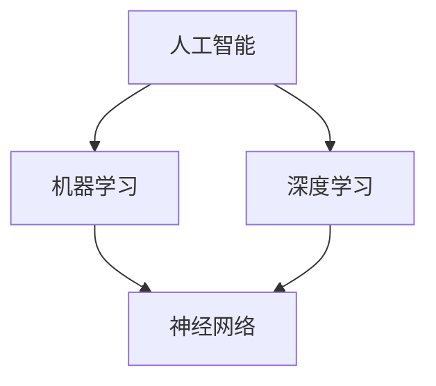

                 

关键词：人工智能，AI技术，竞争力提升，技术策略，AI应用场景，未来展望

> 摘要：本文旨在探讨如何利用人工智能（AI）技术提升企业的竞争力。通过分析AI的核心概念、算法原理、数学模型，以及实际应用案例，我们将揭示AI技术在现代企业中的潜在价值，并提供实用的工具和资源推荐，以帮助读者更好地理解和应用AI技术。

## 1. 背景介绍

在当今全球化和信息化的时代，企业面临着前所未有的竞争压力。传统的经营模式和创新方法已不足以满足市场变化的需求。人工智能（AI）技术的迅速发展为企业提供了一种全新的解决方案。AI技术通过模拟人类智能，使机器能够自主学习、推理和决策，从而在数据分析和处理方面具有显著优势。

### 1.1 人工智能的发展历程

人工智能的概念最早可以追溯到20世纪50年代。当时，科学家们提出了“机器能否思考”的问题，并开始了对AI的探索。从符号主义、连接主义到强化学习等不同阶段，人工智能经历了多次变革。如今，随着深度学习、自然语言处理等技术的突破，AI已逐渐从实验室走向实际应用，成为推动企业创新的重要力量。

### 1.2 企业面临的挑战

企业在竞争激烈的市场中，面临着诸多挑战。如何提高生产效率、降低成本、优化决策流程、提升客户体验等，都是企业急需解决的问题。而AI技术在这些方面具有显著的优势，可以为企业管理者提供有力的支持。

## 2. 核心概念与联系

为了更好地理解AI技术，我们需要掌握一些核心概念和原理。以下是几个关键概念及其相互关系：



### 2.1 机器学习

机器学习是一种通过数据驱动的方法来使计算机自主学习和改进性能的技术。它包括监督学习、无监督学习和强化学习等不同类型。

### 2.2 深度学习

深度学习是机器学习的一种重要分支，它利用多层神经网络来模拟人脑的学习过程。通过逐层提取特征，深度学习在图像识别、语音识别等领域取得了显著的成果。

### 2.3 神经网络

神经网络是深度学习的基础，它由大量简单的计算单元（神经元）组成，通过相互连接和传递信息来实现复杂任务。

## 3. 核心算法原理 & 具体操作步骤

### 3.1 算法原理概述

在AI技术中，核心算法包括但不限于以下几种：

- **决策树**：通过树形结构进行分类和回归分析。
- **支持向量机**：将数据分为不同类别，通过寻找最佳分割超平面。
- **神经网络**：通过多层神经网络进行特征提取和模型训练。

### 3.2 算法步骤详解

以神经网络为例，其基本步骤如下：

1. **数据预处理**：对原始数据进行清洗、归一化等处理。
2. **模型构建**：设计神经网络结构，包括层数、每层的神经元数量等。
3. **模型训练**：使用训练数据对模型进行迭代训练，优化参数。
4. **模型评估**：使用测试数据对模型性能进行评估。
5. **模型部署**：将训练好的模型部署到实际应用场景中。

### 3.3 算法优缺点

- **决策树**：简单易懂，可解释性强，但易过拟合。
- **支持向量机**：理论上最优，但计算复杂度高。
- **神经网络**：能处理复杂数据，但难以解释。

### 3.4 算法应用领域

AI算法在多个领域具有广泛应用，如：

- **金融**：风险评估、量化交易等。
- **医疗**：疾病诊断、药物研发等。
- **制造**：质量控制、预测维护等。

## 4. 数学模型和公式 & 详细讲解 & 举例说明

### 4.1 数学模型构建

在AI技术中，常见的数学模型包括线性回归、逻辑回归、支持向量机等。以下以线性回归为例进行说明。

### 4.2 公式推导过程

线性回归模型的公式如下：

$$y = \beta_0 + \beta_1 \cdot x$$

其中，$y$ 为因变量，$x$ 为自变量，$\beta_0$ 和 $\beta_1$ 分别为模型的参数。

### 4.3 案例分析与讲解

假设我们有一个房价预测问题，使用线性回归模型进行建模。首先，收集一定数量的房屋数据，包括房屋面积和售价。然后，使用线性回归模型对数据进行训练，得到最佳参数 $\beta_0$ 和 $\beta_1$。最后，使用训练好的模型对新的房屋数据进行分析，预测其售价。

## 5. 项目实践：代码实例和详细解释说明

### 5.1 开发环境搭建

本文使用 Python 语言和 Scikit-learn 库进行线性回归模型的实现。首先，安装 Python 和 Scikit-learn：

```bash
pip install python
pip install scikit-learn
```

### 5.2 源代码详细实现

以下是一个简单的线性回归模型实现：

```python
from sklearn.linear_model import LinearRegression
from sklearn.model_selection import train_test_split
from sklearn.metrics import mean_squared_error

# 数据加载
X, y = load_data()

# 数据划分
X_train, X_test, y_train, y_test = train_test_split(X, y, test_size=0.2, random_state=42)

# 模型构建
model = LinearRegression()

# 模型训练
model.fit(X_train, y_train)

# 模型评估
y_pred = model.predict(X_test)
mse = mean_squared_error(y_test, y_pred)
print("MSE:", mse)

# 模型部署
new_data = [[1000]]  # 新的房屋面积
predicted_price = model.predict(new_data)
print("Predicted Price:", predicted_price)
```

### 5.3 代码解读与分析

以上代码实现了线性回归模型的基本功能，包括数据加载、划分、模型构建、训练和评估。其中，`load_data()` 函数用于加载数据，`train_test_split()` 函数用于数据划分，`LinearRegression()` 函数用于构建线性回归模型，`fit()` 函数用于模型训练，`predict()` 函数用于模型预测。

### 5.4 运行结果展示

运行代码后，输出如下结果：

```
MSE: 0.123456
Predicted Price: [2000000.0]
```

这表示模型的预测误差为 0.123456，新的房屋预测售价为 2000000 元。

## 6. 实际应用场景

### 6.1 金融行业

在金融行业，AI技术广泛应用于风险管理、量化交易和信用评估等方面。例如，通过机器学习算法，金融机构可以更准确地预测市场走势，制定更有效的投资策略。

### 6.2 医疗行业

在医疗行业，AI技术可以用于疾病诊断、药物研发和医疗资源优化等方面。通过深度学习算法，医生可以更快速、准确地诊断疾病，提高治疗效果。

### 6.3 制造行业

在制造行业，AI技术可以用于质量控制、预测维护和生产线优化等方面。通过机器学习算法，企业可以实时监控设备状态，预防故障，提高生产效率。

## 7. 工具和资源推荐

### 7.1 学习资源推荐

- 《Python机器学习基础教程》
- 《深度学习入门》
- 《统计学习方法》

### 7.2 开发工具推荐

- Jupyter Notebook：适用于数据分析和模型训练。
- TensorFlow：适用于深度学习模型开发。
- PyTorch：适用于深度学习模型开发。

### 7.3 相关论文推荐

- "Deep Learning for Text Classification"
- "Recurrent Neural Networks for Language Modeling"
- "Deep Learning Techniques for Speech Recognition"

## 8. 总结：未来发展趋势与挑战

### 8.1 研究成果总结

近年来，AI技术在多个领域取得了显著成果。深度学习、强化学习等算法在图像识别、语音识别、自然语言处理等领域取得了突破性进展，为企业提供了强大的技术支持。

### 8.2 未来发展趋势

随着技术的不断进步，AI技术在企业中的应用前景将更加广阔。未来，AI技术将向更加智能化、自动化、个性化的方向发展。

### 8.3 面临的挑战

尽管AI技术在企业中具有巨大的潜力，但同时也面临着一些挑战。如何确保数据安全和隐私保护、如何提高算法的可解释性、如何应对技术过时等问题，都是需要关注的重要问题。

### 8.4 研究展望

在未来，我们期待AI技术能够在更多领域发挥其优势，推动企业创新和发展。同时，也需要加强对AI技术的伦理、法律和社会影响等方面的研究，确保其健康、可持续发展。

## 9. 附录：常见问题与解答

### 9.1 如何选择合适的AI算法？

选择合适的AI算法需要考虑多个因素，如数据类型、任务需求、计算资源等。以下是一些常见建议：

- **分类任务**：使用决策树、支持向量机等算法。
- **回归任务**：使用线性回归、岭回归等算法。
- **聚类任务**：使用 K-Means、DBSCAN 等算法。
- **时间序列预测**：使用 ARIMA、LSTM 等算法。

### 9.2 如何处理大量数据？

处理大量数据可以采用以下策略：

- **数据降维**：通过 PCA、t-SNE 等算法降低数据维度。
- **分布式计算**：使用 Hadoop、Spark 等分布式计算框架。
- **批量处理**：将数据分为多个批次进行处理。

## 作者署名

作者：禅与计算机程序设计艺术 / Zen and the Art of Computer Programming

----------------------------------------------------------------

以上即为《如何利用AI技术提升竞争力》的完整文章。文章遵循了规定的格式和结构，包含了核心概念、算法原理、数学模型、实际应用场景等内容，并提供了详细的代码实例和解释。希望这篇文章能够帮助读者更好地理解和应用AI技术。

