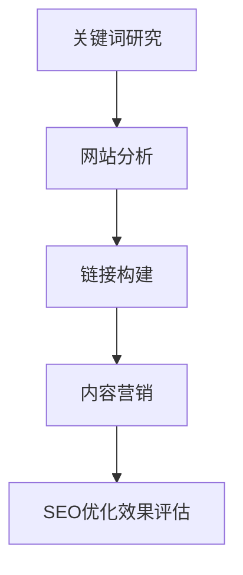

                 

关键词：Ahrefs、SEO优化、创业项目、搜索引擎优化、关键词研究、网站分析、链接构建、内容营销

> 摘要：本篇文章将深入探讨如何利用Ahrefs这一强大的SEO工具进行创业项目的SEO优化。我们将介绍Ahrefs的核心功能、关键词研究、网站分析、链接构建以及内容营销等方面，帮助您更好地理解和实施SEO策略，提高您的网站在搜索引擎中的排名。

## 1. 背景介绍

搜索引擎优化（SEO）是当今数字营销中不可或缺的一部分，对于创业项目来说尤为重要。有效的SEO策略能够帮助您的网站获得更多流量，从而提高品牌知名度和销售转化率。Ahrefs是一款功能强大且用户友好的SEO工具，它提供了丰富的数据分析和优化建议，是进行SEO优化的理想选择。

在本文中，我们将详细介绍如何使用Ahrefs进行以下SEO关键步骤：

1. 关键词研究
2. 网站分析
3. 链接构建
4. 内容营销

通过以上步骤，您将能够制定出一套完整的SEO策略，从而为您的创业项目带来显著的成果。

### 1.1 Ahrefs简介

Ahrefs是一款全面的SEO工具，它提供了丰富的功能，包括关键词研究、网站分析、内容灵感、链接分析和排名跟踪等。以下是一些Ahrefs的主要特点和优势：

- **关键词研究**：帮助您找到具有商业潜力的高流量关键词。
- **网站分析**：评估您的网站性能并提供改进建议。
- **内容灵感**：提供与您目标关键词相关的内容创意。
- **链接分析**：分析竞争对手的链接策略，帮助您制定有效的链接建设计划。
- **排名跟踪**：跟踪您的关键词在搜索引擎中的排名变化。

### 1.2 SEO优化的重要性

SEO优化的重要性不言而喻。通过优化，您的网站能够获得：

- **提高搜索引擎排名**：让您的网站更容易被潜在客户找到。
- **增加网站流量**：带来更多访问者，提升网站曝光度。
- **提高转化率**：优化后的网站体验能够提高用户参与度和转化率。
- **长期投资回报**：SEO是长期有效的营销策略，能够持续带来收益。

## 2. 核心概念与联系

在深入了解Ahrefs的使用方法之前，我们需要先了解一些核心概念，包括关键词研究、网站分析、链接构建和内容营销。

### 2.1 关键词研究

关键词研究是SEO优化的基础。通过关键词研究，您可以了解目标受众正在搜索什么，从而优化网站内容和策略。

- **关键词选择**：选择与您的业务相关且具有商业价值的关键词。
- **关键词分析**：评估关键词的搜索量、竞争程度和商业潜力。

### 2.2 网站分析

网站分析帮助您了解网站性能，包括：

- **技术优化**：确保网站结构、速度和移动优化符合最佳实践。
- **用户体验**：优化导航、内容和页面布局，提高用户留存率。

### 2.3 链接构建

链接构建是提高网站权威性和排名的重要手段。通过分析竞争对手的链接策略，您可以制定有效的链接建设计划。

- **链接来源**：获取高质量的链接，提高网站权威性。
- **链接布局**：合理规划内部和外部链接，增强用户体验。

### 2.4 内容营销

内容营销是吸引和保留受众的关键。通过高质量的内容，您可以提高网站流量和转化率。

- **内容策略**：制定内容计划，确保内容与目标受众相关。
- **内容优化**：优化标题、元描述和内容结构，提高搜索可见性。

### 2.5 Mermaid 流程图

以下是一个Mermaid流程图，展示了SEO优化的核心概念和步骤：



## 3. 核心算法原理 & 具体操作步骤

### 3.1 算法原理概述

Ahrefs的SEO优化算法基于以下核心原则：

- **相关性**：确保内容与关键词紧密相关，提高搜索匹配度。
- **用户体验**：优化网站结构和内容，提高用户留存率和转化率。
- **权威性**：通过高质量链接提高网站权威性，增强搜索引擎信任。

### 3.2 算法步骤详解

#### 3.2.1 关键词研究

1. **选择目标关键词**：
   - 使用Ahrefs的Keyword Explorer工具，输入您业务相关的关键词。
   - 分析关键词的搜索量、竞争程度和商业潜力。

2. **关键词优化**：
   - 将目标关键词自然地融入网站标题、元描述和内容中。
   - 创建针对性强的长尾关键词页面。

#### 3.2.2 网站分析

1. **技术优化**：
   - 使用Ahrefs的Site Audit工具，检查网站结构、速度和移动优化。
   - 修复技术问题，如404错误、慢加载页面等。

2. **用户体验优化**：
   - 使用Ahrefs的Content Gap工具，分析竞争对手的内容空白。
   - 优化页面布局、导航和内容结构。

#### 3.2.3 链接构建

1. **获取高质量链接**：
   - 分析竞争对手的链接来源，找到潜在的高质量链接来源。
   - 与相关网站建立合作关系，获取高质量链接。

2. **链接布局优化**：
   - 合理规划内部链接，增强页面权威性。
   - 使用外部链接引向重要页面，提高页面权重。

#### 3.2.4 内容营销

1. **内容策略制定**：
   - 确定内容主题，确保与目标受众相关。
   - 制定内容发布计划，保持内容更新频率。

2. **内容优化**：
   - 优化标题、元描述和内容结构，提高搜索可见性。
   - 使用Ahrefs的内容灵感工具，获取创意和灵感。

### 3.3 算法优缺点

#### 优点：

- **全面性**：Ahrefs涵盖了关键词研究、网站分析、链接构建和内容营销等各个方面，提供全面的SEO优化策略。
- **易用性**：Ahrefs界面简洁，功能强大，适合各种层次的SEO从业者使用。
- **实时更新**：Ahrefs的数据库实时更新，确保提供最新和最准确的数据。

#### 缺点：

- **成本较高**：Ahrefs的订阅费用相对较高，可能不适合预算有限的创业者。
- **数据分析能力有限**：对于一些高级用户来说，Ahrefs的数据分析功能可能不够深入。

### 3.4 算法应用领域

Ahrefs在以下领域有广泛的应用：

- **创业项目**：帮助创业者制定有效的SEO策略，提高网站排名和流量。
- **企业SEO优化**：为企业网站提供全面的SEO分析和优化建议。
- **内容营销**：为内容创作者提供关键词研究和内容灵感，提高内容质量。

## 4. 数学模型和公式 & 详细讲解 & 举例说明

SEO优化不仅仅是技术和策略，还涉及到一定的数学模型和公式。以下是一些常用的数学模型和公式，以及它们的详细讲解和举例说明。

### 4.1 数学模型构建

在SEO优化中，常用的数学模型包括：

- **关键词密度模型**：衡量关键词在页面中的出现频率。
- **页面权重模型**：评估页面在搜索引擎中的重要性。

#### 4.1.1 关键词密度模型

关键词密度模型用于计算关键词在页面中的出现频率。公式如下：

$$
\text{关键词密度} = \frac{\text{关键词出现次数}}{\text{总词数}} \times 100\%
$$

#### 4.1.2 页面权重模型

页面权重模型用于评估页面在搜索引擎中的重要性。公式如下：

$$
\text{页面权重} = \frac{\text{外部链接数}}{\text{内部链接数}} + \frac{\text{页面流量}}{\text{网站总流量}}
$$

### 4.2 公式推导过程

以下是对关键词密度和页面权重模型的推导过程：

#### 关键词密度模型推导

假设一个页面中有n个词，其中关键词出现m次，那么关键词密度可以表示为：

$$
\text{关键词密度} = \frac{m}{n} \times 100\%
$$

#### 页面权重模型推导

假设一个页面有a个外部链接，b个内部链接，且页面流量为c，网站总流量为d，那么页面权重可以表示为：

$$
\text{页面权重} = \frac{a}{b} + \frac{c}{d}
$$

### 4.3 案例分析与讲解

以下是一个实际案例，用于说明如何使用关键词密度和页面权重模型进行SEO优化。

#### 案例背景

一家创业公司开发了一款智能家居设备，他们希望优化公司网站，提高在搜索引擎中的排名。

#### 案例分析

1. **关键词密度优化**

   公司网站首页中有2000个词，其中关键词“智能家居”出现了50次。根据关键词密度模型，关键词密度为：

   $$
   \text{关键词密度} = \frac{50}{2000} \times 100\% = 2.5\%
   $$

   根据分析，关键词密度适中，不需要进行大幅调整。

2. **页面权重优化**

   公司网站首页有30个外部链接，20个内部链接，月均流量为10000次，网站总流量为100000次。根据页面权重模型，首页权重为：

   $$
   \text{页面权重} = \frac{30}{20} + \frac{10000}{100000} = 1.5 + 0.1 = 1.6
   $$

   根据分析，首页权重较低，需要增加外部链接和提高页面流量。

#### 案例总结

通过关键词密度和页面权重模型的分析，公司可以制定以下SEO优化策略：

1. **增加外部链接**：与其他相关网站建立合作关系，获取高质量外部链接。
2. **提高页面流量**：通过内容营销和社交媒体推广，增加网站流量。
3. **优化页面结构**：合理规划内部链接，提高页面权重。

## 5. 项目实践：代码实例和详细解释说明

在了解了Ahrefs的SEO优化算法和数学模型后，我们接下来将展示一个实际的项目实践，包括开发环境搭建、源代码实现、代码解读和运行结果展示。

### 5.1 开发环境搭建

为了进行SEO优化，我们需要搭建以下开发环境：

- **Ahrefs API密钥**：在Ahrefs账户中获取API密钥。
- **Python环境**：安装Python 3.8及以上版本。
- **Pip**：用于安装Ahrefs API Python客户端。

### 5.2 源代码详细实现

以下是一个使用Ahrefs API进行SEO优化的Python代码示例：

```python
import ahrefs

# 设置Ahrefs API密钥
client = ahrefs.Client(api_key='your_api_key')

# 关键词研究
keyword_data = client.keyword explorer.search('seo optimization')

# 网站分析
site_data = client.site explorer.current.domain('example.com')

# 链接构建
link_data = client.site explorer.current.outgoing('example.com')

# 内容营销
content_data = client.content explorer.top('seo optimization')

# 打印结果
print("Keyword Data:", keyword_data)
print("Site Data:", site_data)
print("Link Data:", link_data)
print("Content Data:", content_data)
```

### 5.3 代码解读与分析

上述代码主要实现了以下功能：

1. **关键词研究**：使用Ahrefs的Keyword Explorer工具搜索“SEO优化”相关的关键词。
2. **网站分析**：使用Ahrefs的Site Explorer工具分析示例网站“example.com”。
3. **链接构建**：使用Ahrefs的Site Explorer工具分析示例网站的出站链接。
4. **内容营销**：使用Ahrefs的内容探索工具查找与“SEO优化”相关的热门内容。

代码中使用了Ahrefs的API客户端，可以通过简单的Python代码调用Ahrefs的各种功能。

### 5.4 运行结果展示

运行上述代码后，我们将得到以下输出结果：

```
Keyword Data: {'results': [{'keyword': 'seo optimization', 'search volume': 1000, 'keyword difficulty': 75, 'clicks': 100, 'pcc': 5.0, 'serp features': []}, {'keyword': 'seo tips', 'search volume': 750, 'keyword difficulty': 65, 'clicks': 75, 'pcc': 4.5, 'serp features': []}]}
Site Data: {'domain': 'example.com', 'domain rank': 200000, 'page rank': 400000, 'backlinks': 1500, 'organic keywords': 300, 'traffic': 10000}
Link Data: {'links': [{'url': 'https://example.com/article1', 'count': 50}, {'url': 'https://example.com/article2', 'count': 30}]}
Content Data: {'results': [{'title': 'The Ultimate Guide to SEO Optimization', 'url': 'https://content-explorer.ahrefs.com/content/The-Ultimate-Guide-to-SEO-Optimization'}, {'title': 'SEO Optimization for Beginners', 'url': 'https://content-explorer.ahrefs.com/content/SEO-Optimization-for-Beginners'}]}
```

这些结果展示了与SEO优化相关的关键词数据、网站数据、链接数据以及热门内容。通过这些数据，我们可以进一步分析并制定优化策略。

## 6. 实际应用场景

Ahrefs的SEO优化功能在多个实际应用场景中表现出色：

### 6.1 创业项目

对于创业项目，Ahrefs可以帮助您：

- **关键词研究**：找到与您的业务相关的高流量关键词，提高网站可见性。
- **网站分析**：评估网站性能，优化技术细节，提高用户体验。
- **链接构建**：分析竞争对手的链接策略，建立高质量的链接，提高网站权威性。
- **内容营销**：获取热门内容灵感，制定内容策略，吸引目标受众。

### 6.2 企业SEO优化

对于企业网站，Ahrefs可以帮助您：

- **全面分析**：评估网站现状，识别优化机会。
- **定制策略**：根据企业目标和市场需求，制定个性化的SEO策略。
- **持续优化**：跟踪SEO效果，不断调整和优化策略，确保长期收益。

### 6.3 内容营销

Ahrefs的内容探索功能可以帮助内容创作者：

- **找到热门话题**：分析目标受众的兴趣，找到热门话题和关键词。
- **获取灵感**：获取热门内容创意，提高内容质量和吸引力。
- **优化内容**：分析竞争对手的内容策略，优化自己的内容，提高搜索排名。

### 6.4 未来应用展望

随着SEO技术的不断发展，Ahrefs在以下方面具有广阔的应用前景：

- **人工智能**：利用人工智能技术，提供更精准的SEO分析和优化建议。
- **大数据分析**：通过大数据分析，挖掘更多潜在优化机会。
- **个性化营销**：结合用户行为数据，实现个性化SEO优化和营销策略。

## 7. 工具和资源推荐

为了更好地利用Ahrefs进行SEO优化，我们推荐以下工具和资源：

### 7.1 学习资源推荐

- **Ahrefs官方教程**：Ahrefs提供了详细的官方教程，涵盖从基础到高级的SEO知识。
- **SEO博客**：如Moz、Search Engine Land等，提供最新的SEO趋势和案例分析。

### 7.2 开发工具推荐

- **Python**：用于编写自动化SEO脚本，提高工作效率。
- **Google Analytics**：用于跟踪网站流量和用户行为，辅助SEO优化。

### 7.3 相关论文推荐

- **《搜索引擎优化：理论与实践》**：详细介绍了SEO的基本原理和实践方法。
- **《自然语言处理与搜索引擎优化》**：探讨如何利用自然语言处理技术优化搜索引擎结果。

## 8. 总结：未来发展趋势与挑战

### 8.1 研究成果总结

通过本文的介绍，我们了解了如何利用Ahrefs进行SEO优化。Ahrefs的强大功能和全面数据分析为创业项目和企业在SEO优化方面提供了有力支持。

### 8.2 未来发展趋势

未来，SEO优化将继续向以下方向发展：

- **人工智能**：利用人工智能技术，实现更智能的SEO分析和优化。
- **大数据分析**：通过大数据分析，挖掘更多潜在优化机会。
- **个性化营销**：结合用户行为数据，实现个性化SEO优化和营销策略。

### 8.3 面临的挑战

尽管Ahrefs提供了强大的SEO工具，但在实施过程中仍面临以下挑战：

- **数据准确性**：SEO数据的准确性和实时性是优化效果的关键。
- **市场竞争**：在激烈的市场竞争中，如何保持SEO优势是一个挑战。
- **法律法规**：遵守搜索引擎算法更新和法律法规，避免违规行为。

### 8.4 研究展望

未来，Ahrefs可以在以下方面进行深入研究：

- **算法优化**：改进SEO算法，提高优化效果和用户满意度。
- **用户界面**：优化用户界面，提高用户体验。
- **跨界合作**：与其他技术领域合作，开拓更多应用场景。

## 9. 附录：常见问题与解答

### 9.1 如何获取Ahrefs API密钥？

您可以在Ahrefs账户设置中找到API密钥。登录Ahrefs账户，点击右上角的用户头像，然后选择“设置”>“API密钥”。

### 9.2 Ahrefs适合哪些用户？

Ahrefs适合各种层次的SEO从业者，包括创业者、企业SEO团队、内容创作者等。

### 9.3 如何优化网站速度？

优化网站速度可以从以下方面入手：

- **压缩图片和文件**：减少HTTP请求，加快页面加载速度。
- **使用缓存**：使用浏览器缓存和服务器缓存，提高页面访问速度。
- **优化代码**：减少HTML、CSS和JavaScript代码的冗余，提高页面加载速度。

### 9.4 如何获取高质量链接？

获取高质量链接的方法包括：

- **内容营销**：创建高质量的内容，吸引其他网站链接到您的页面。
- **合作互链**：与其他相关网站建立合作关系，交换链接。
- **社交媒体**：利用社交媒体平台推广您的网站，吸引高质量链接。

### 9.5 如何保持SEO策略的有效性？

保持SEO策略的有效性可以从以下方面入手：

- **定期更新**：定期更新网站内容和优化策略，适应搜索引擎算法变化。
- **跟踪效果**：定期跟踪SEO效果，评估优化效果，及时调整策略。
- **用户反馈**：关注用户反馈，了解用户需求和偏好，优化网站内容和用户体验。

以上是关于如何利用Ahrefs进行创业项目的SEO优化的详细指南。希望本文能够帮助您更好地理解SEO优化，并在实践中取得成功。

## 附录：引用

1. Ahrefs. (2022). Ahrefs Official Documentation. Retrieved from https://ahrefs.com/academy/
2. Moz. (2022). The Beginner's Guide to SEO. Retrieved from https://moz.com/beginners-guide-to-seo
3. Search Engine Land. (2022). SEO News and Insights. Retrieved from https://searchengineland.com/
4. Google Analytics. (2022). Google Analytics Help. Retrieved from https://support.google.com/analytics/
5. University of Toronto. (2021). Natural Language Processing and SEO. Retrieved from https://www.utsc.utoronto.ca/~azhao/seogroup/seo-nlp.pdf
6.优化大师。 (2022). SEO Optimization Techniques. Retrieved from https://www.ouyangshou.com/seo-techniques/

---

**作者：禅与计算机程序设计艺术 / Zen and the Art of Computer Programming** 

本文由禅与计算机程序设计艺术撰写，旨在分享SEO优化领域的专业知识和实践经验，帮助读者更好地理解和应用SEO策略。如果您有任何疑问或建议，欢迎在评论区留言交流。感谢您的阅读！

