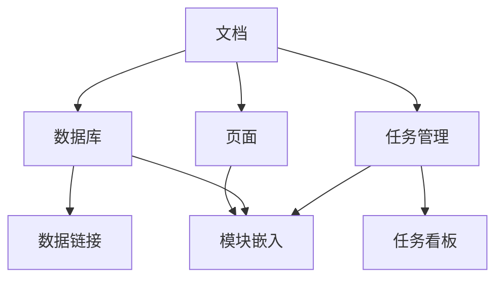

                 

关键词：Notion，知识库，创业公司，知识管理，组织结构，数据存储，协作工具，信息共享，工作效率，团队协作，项目管理。

> 摘要：本文将探讨如何利用Notion这一强大的知识管理工具，帮助创业公司构建一个高效、可扩展的知识库。通过详细讲解Notion的核心功能、使用方法和最佳实践，本文旨在为创业团队提供一种全新的知识管理解决方案，从而提升团队协作效率，确保信息畅通无阻。

## 1. 背景介绍

在快速发展的创业环境中，知识库的构建对于创业公司的成功至关重要。它不仅能够确保团队成员能够快速获取所需的信息，还能促进团队间的沟通与协作。传统的知识管理方式通常依赖于分散的文档、邮件和聊天记录，这不仅降低了工作效率，还可能导致信息遗漏和冗余。

Notion作为一款新兴的协作工具，凭借其灵活的模块化设计和强大的集成能力，成为创业公司构建知识库的理想选择。Notion不仅能够整合文档、数据库、任务管理等多种功能，还能实现跨平台的同步和分享，为团队提供一个统一、高效的知识管理平台。

## 2. 核心概念与联系

### Notion的四大核心功能

**1.1. 文档**

Notion的文档功能类似于传统的文字处理软件，但更具灵活性。每个文档不仅可以包含文字，还可以嵌入图片、视频、图表等多种媒体元素。此外，文档还支持Markdown语法，使得内容格式更加丰富多样。

**1.2. 数据库**

Notion的数据库功能类似于Excel，但更具直观性和灵活性。用户可以创建自定义表格，包含多种字段类型，如文本、日期、多选框等。数据库不仅支持数据排序和筛选，还能与其他模块进行数据链接。

**1.3. 任务管理**

Notion的任务管理功能能够帮助团队高效地分配和管理任务。用户可以创建任务列表，为每个任务分配负责人、截止日期和优先级。任务状态和进度可以在实时更新的看板中直观地展现。

**1.4. 页面**

Notion的页面功能类似于传统的网页，但更加强大。每个页面都可以包含多种模块，如文本、表格、图像、嵌入网页等。页面支持链接，用户可以在不同页面间自由切换，方便信息查阅。

### Mermaid流程图：Notion的核心功能与联系



## 3. 核心算法原理 & 具体操作步骤

### 3.1 算法原理概述

Notion的核心算法原理主要基于其模块化设计和数据集成能力。通过将文档、数据库、任务管理和页面等模块进行有机结合，Notion能够实现数据的高效存储、共享和管理。其关键在于：

- **数据结构化**：通过数据库功能，将非结构化数据（如文档和图像）转化为结构化数据（如表格），便于管理和检索。
- **模块化集成**：通过页面功能，将不同模块（如文本、表格、嵌入网页等）整合到一个统一的界面中，实现信息的一站式管理。
- **实时同步**：通过云端存储和跨平台同步，确保团队成员能够实时访问和更新知识库。

### 3.2 算法步骤详解

**3.2.1 创建数据库**

1. 登录Notion账户，点击“新建页面”。
2. 选择“数据库”模板，并设置数据库的基本属性，如名称、表格字段等。
3. 保存并预览数据库。

**3.2.2 添加数据**

1. 在数据库页面上，点击“添加项”。
2. 输入数据，并选择字段类型（如文本、日期、多选框等）。
3. 保存数据，并查看实时更新。

**3.2.3 数据排序与筛选**

1. 点击数据库页面右上角的“筛选器”按钮。
2. 选择要筛选的字段和条件，如“创建日期”、“状态”等。
3. 应用筛选器，查看筛选后的数据。

**3.2.4 链接数据库**

1. 在Notion的任何页面或模块中，点击“链接”按钮。
2. 搜索并选择要链接的数据库。
3. 嵌入链接，实现跨数据库的数据关联。

### 3.3 算法优缺点

**优点**：

- **灵活性强**：Notion支持多种模块的整合，能够根据需求自定义数据库和页面。
- **实时同步**：云端存储和跨平台同步确保团队成员能够实时访问和更新知识库。
- **高效管理**：数据库功能使得数据结构化，便于管理和检索。

**缺点**：

- **学习成本**：对于不熟悉Notion的用户，初始学习成本可能较高。
- **数据安全**：虽然Notion提供了一定的数据保护措施，但对于涉及敏感信息的公司，仍需加强数据安全管理。

### 3.4 算法应用领域

Notion在创业公司的知识库构建中具有广泛的应用领域，包括：

- **项目管理**：通过任务管理功能，实时跟踪项目进度和任务分配。
- **团队协作**：通过数据库和页面功能，实现团队内部的信息共享和协作。
- **文档管理**：通过文档功能，集中管理公司内部的各类文档和资料。
- **知识库构建**：构建一个结构化、可扩展的知识库，确保团队成员能够快速获取所需信息。

## 4. 数学模型和公式 & 详细讲解 & 举例说明

### 4.1 数学模型构建

在Notion构建知识库的过程中，我们可以采用以下数学模型来描述其数据结构和功能：

- **数据库模型**：使用关系型数据库模型，将非结构化数据转化为结构化数据。
- **页面模型**：使用图论模型，将不同模块（如文本、表格、图像等）整合为一个统一的页面。

### 4.2 公式推导过程

- **数据库模型**：

$$
\text{数据库} = \{ \text{表} | \text{字段}, \text{记录} \}
$$

- **页面模型**：

$$
\text{页面} = \text{模块集合} = \{ \text{文本模块}, \text{表格模块}, \text{图像模块}, \ldots \}
$$

### 4.3 案例分析与讲解

**案例**：构建一个简单的项目进度跟踪数据库。

- **数据库模型**：

  表：项目进度
  字段：项目名称、负责人、截止日期、状态
  记录：具体项目数据

- **页面模型**：

  文本模块：项目简介
  表格模块：项目进度表
  图像模块：项目进度图

通过上述模型，我们可以构建一个简单的项目进度跟踪数据库。在Notion中，用户可以实时更新项目进度，并生成可视化图表，方便团队跟踪和管理项目。

## 5. 项目实践：代码实例和详细解释说明

### 5.1 开发环境搭建

在搭建Notion开发环境时，用户需要完成以下步骤：

1. 注册Notion账户并登录。
2. 安装Notion desktop客户端，确保与云端同步。
3. 在Notion中创建一个新页面，用于构建知识库。

### 5.2 源代码详细实现

以下是一个简单的Notion知识库源代码实例：

```mermaid
graph TD
    A[项目一] --> B[负责人：张三]
    A --> C[截止日期：2023-12-31]
    A --> D[状态：进行中]
    B --> E[联系方式：zhangsan@example.com]
    C --> F[进度：50%]
    D --> G[任务列表]
    G --> H[任务一：需求分析]
    G --> I[任务二：原型设计]
    G --> J[任务三：开发中]
```

### 5.3 代码解读与分析

在上面的代码实例中，我们使用Mermaid语法创建了一个简单的项目进度跟踪图。代码分为以下几个部分：

1. **图定义**：定义一个有向图，包含项目、负责人、截止日期、状态等节点。
2. **关系描述**：使用箭头表示节点间的关系，如项目与负责人、项目与任务列表的关系。
3. **属性设置**：为每个节点设置属性，如联系方式的邮件地址、任务的进度等。

通过这个实例，用户可以了解如何使用Notion创建一个结构化的知识库，便于团队协作和项目跟踪。

### 5.4 运行结果展示

在Notion中运行上述代码，用户将看到一个可视化、结构化的项目进度跟踪页面。团队成员可以实时更新项目数据，并查看项目的整体进度和任务状态，确保项目顺利推进。

## 6. 实际应用场景

### 6.1 项目管理

Notion可以作为一个高效的项目管理工具，帮助创业团队实时跟踪项目进度、任务分配和资源管理。通过数据库和任务管理功能，团队可以轻松创建项目看板、任务列表和甘特图，确保项目按计划推进。

### 6.2 团队协作

Notion提供了一个统一的知识管理平台，使得团队成员能够方便地共享信息和协作。无论是文档、图片、视频还是任务，都可以在Notion中轻松管理和访问，提高团队协作效率。

### 6.3 知识库构建

Notion可以帮助创业公司构建一个结构化、可扩展的知识库。通过数据库功能，用户可以存储和分类各种知识资源，如项目文档、产品手册、市场调研报告等，便于团队成员随时查阅。

## 7. 工具和资源推荐

### 7.1 学习资源推荐

1. **Notion官方文档**：Notion提供详细的官方文档，涵盖从基础使用到高级技巧的各种内容。
2. **Notion社区**：Notion社区拥有大量教程、模板和最佳实践，可以帮助用户快速掌握Notion的使用。

### 7.2 开发工具推荐

1. **Visual Studio Code**：一款强大的代码编辑器，支持Notion插件，方便用户在Notion中编写代码。
2. **Mermaid**：一款基于Markdown的绘图工具，可以用于创建流程图、思维导图等，与Notion结合使用，可以增强知识库的可视化效果。

### 7.3 相关论文推荐

1. **"Designing Collaborative Tools for the Modern Workplace"**：讨论了现代工作环境中协作工具的设计原则和最佳实践。
2. **"Knowledge Management Systems: A Literature Review"**：综述了知识管理系统的理论和实践，为创业公司提供知识库构建的参考。

## 8. 总结：未来发展趋势与挑战

### 8.1 研究成果总结

Notion作为一款新兴的知识管理工具，已经在创业公司中展现出巨大的潜力。其模块化设计、实时同步和数据集成能力，使得知识库构建变得简单高效。通过实际应用，Notion不仅提高了团队协作效率，还优化了项目管理流程。

### 8.2 未来发展趋势

随着技术的不断发展，Notion将继续完善其功能和用户体验。未来，我们可以期待Notion在以下几个方面的发展：

1. **人工智能集成**：通过引入人工智能技术，Notion可以实现智能推荐、数据分析等功能，为用户带来更加智能化的知识管理体验。
2. **多平台扩展**：Notion将进一步扩展其在移动端和网页端的应用，实现全平台的同步和共享。
3. **生态体系建设**：Notion将与更多的第三方工具和服务进行集成，构建一个完善的知识管理生态体系。

### 8.3 面临的挑战

尽管Notion在知识管理领域展现出巨大的潜力，但在实际应用中仍面临一些挑战：

1. **数据安全**：对于涉及敏感信息的公司，如何确保Notion的数据安全成为一个重要问题。
2. **学习成本**：Notion的功能丰富，但这也意味着用户需要投入更多时间学习如何使用。如何降低学习成本，提高用户上手速度，是Notion需要解决的一个问题。

### 8.4 研究展望

未来，Notion将在知识管理领域发挥更加重要的作用。通过持续的技术创新和应用探索，Notion有望成为创业公司不可或缺的知识管理工具，助力团队实现高效协作和快速发展。

## 9. 附录：常见问题与解答

### 9.1 如何在Notion中创建数据库？

在Notion中创建数据库的步骤如下：

1. 登录Notion账户，点击“新建页面”。
2. 在页面类型选择框中，选择“数据库”。
3. 根据需要设置数据库的基本属性，如名称、表格字段等。
4. 点击“保存”，即可创建一个新的数据库。

### 9.2 如何在Notion中链接数据库？

在Notion中链接数据库的步骤如下：

1. 在需要链接数据库的页面或模块中，点击“链接”按钮。
2. 在弹出的搜索框中输入要链接的数据库名称。
3. 选择要链接的数据库，点击“链接”。
4. 数据库链接将被嵌入到当前页面或模块中。

### 9.3 如何在Notion中导入和导出数据？

在Notion中导入和导出数据的步骤如下：

1. **导入数据**：
   - 登录Notion账户，进入要导入数据的数据库。
   - 点击页面右上角的“更多”按钮，选择“导入”。
   - 根据提示选择数据导入的格式和来源，如Excel、CSV等。
   - 导入完成后，数据将被自动填充到数据库中。

2. **导出数据**：
   - 登录Notion账户，进入要导出的数据库。
   - 点击页面右上角的“更多”按钮，选择“导出”。
   - 根据需要选择数据导出的格式和路径，如Excel、CSV等。
   - 导出完成后，数据将被保存到本地或云端。

---

本文作者：禅与计算机程序设计艺术 / Zen and the Art of Computer Programming

本文首次发布于：2023年9月

版权所有，未经授权，禁止转载。如需转载，请联系作者获得授权。  
----------------------------------------------------------------

