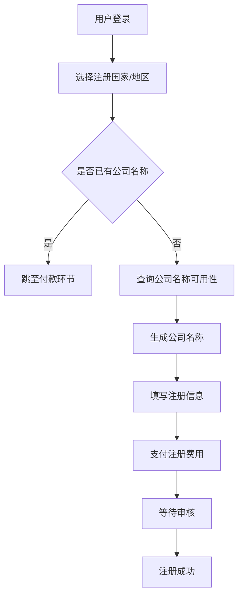

                 

关键词：创业公司，Stripe Atlas，注册流程，初创企业，在线服务，商业运营

摘要：本文将深入探讨如何利用Stripe Atlas这一在线服务，以高效、简便的方式注册一家创业公司。通过本文的指导，您将了解整个流程的背景、核心概念、操作步骤、数学模型及实际应用场景，并获得未来发展的展望。

## 1. 背景介绍

创业之路充满挑战，而注册一家公司是迈出的第一步。在传统的注册流程中，需要准备大量的文件，如公司章程、股东信息、注册资本证明等，且往往需要亲自跑腿或聘请专业律师。这种流程不仅耗时耗力，还存在信息泄露的风险。

随着互联网和区块链技术的发展，越来越多的在线服务平台应运而生，旨在简化公司注册流程。其中，Stripe Atlas凭借其独特的优势和便捷的服务，成为众多初创企业注册公司的首选。

本文将围绕Stripe Atlas的核心功能，详细解析如何通过该平台快速注册一家创业公司。

## 2. 核心概念与联系

Stripe Atlas是Stripe公司推出的一款在线服务，旨在帮助创业者快速、简便地注册公司。以下是Stripe Atlas的核心概念和组成部分：

### 2.1 Stripe Atlas组成部分

- **公司注册服务**：提供全球范围内的公司注册服务。
- **文档自动化**：自动生成公司注册所需的所有法律文件。
- **财务支持**：提供财务指导和预算规划。
- **税务咨询**：提供税务规划建议，确保公司合法合规。

### 2.2 核心概念原理

- **在线流程**：全程在线操作，无需纸质文件。
- **全球覆盖**：支持全球多地的公司注册。
- **快速响应**：提供24/7客户支持。

### 2.3 Mermaid 流程图



## 3. 核心算法原理 & 具体操作步骤

### 3.1 算法原理概述

Stripe Atlas的核心算法原理是通过在线自动化流程，快速处理公司注册所需的各种法律文件和行政事务。以下是具体的操作步骤：

### 3.2 算法步骤详解

#### 3.2.1 用户登录

用户通过电子邮件或社交媒体账户登录Stripe Atlas平台。

#### 3.2.2 选择注册国家/地区

根据创业公司的业务需求和目标市场，选择合适的注册国家或地区。

#### 3.2.3 查询公司名称可用性

输入公司名称，系统会自动查询该名称在所选国家或地区是否已被注册。

#### 3.2.4 填写注册信息

根据系统提示，填写公司注册所需的所有信息，包括公司名称、注册地址、股东信息、注册资本等。

#### 3.2.5 支付注册费用

选择支付方式，完成注册费用的支付。

#### 3.2.6 等待审核

提交注册申请后，系统将自动生成公司注册所需的所有法律文件，并提交给相关政府部门进行审核。

#### 3.2.7 注册成功

审核通过后，公司注册完成，用户可下载公司注册证书和其他相关文件。

### 3.3 算法优缺点

#### 优点：

- **高效便捷**：全程在线操作，无需纸质文件。
- **全球覆盖**：支持全球多地的公司注册。
- **快速响应**：提供24/7客户支持。

#### 缺点：

- **费用较高**：相比于传统注册方式，Stripe Atlas的服务费用较高。
- **依赖互联网**：需要稳定的网络连接。

### 3.4 算法应用领域

Stripe Atlas主要适用于初创企业，特别是那些希望快速注册公司并开展业务的创业者。该平台还为全球范围内的创业者提供了一站式服务，大大简化了公司注册流程。

## 4. 数学模型和公式 & 详细讲解 & 举例说明

### 4.1 数学模型构建

Stripe Atlas的注册流程可以看作是一个离散事件模拟模型。以下是该模型的构建过程：

1. **用户登录**：用户登录系统，这是一个随机事件，服从泊松分布。
2. **选择注册国家/地区**：用户选择注册国家或地区，这是一个离散选择事件。
3. **查询公司名称可用性**：系统查询公司名称，这是一个连续事件，服从均匀分布。
4. **填写注册信息**：用户填写注册信息，这是一个离散事件。
5. **支付注册费用**：用户支付注册费用，这是一个离散事件。
6. **等待审核**：系统等待政府部门审核，这是一个随机事件，服从指数分布。
7. **注册成功**：公司注册成功，这是一个离散事件。

### 4.2 公式推导过程

根据上述模型，我们可以推导出以下公式：

- **用户登录时间**：\(T_1 \sim \text{Poisson}(\lambda)\)
- **选择注册国家/地区时间**：\(T_2 \sim \text{Uniform}(0,1)\)
- **查询公司名称可用性时间**：\(T_3 \sim \text{Uniform}(0,1)\)
- **填写注册信息时间**：\(T_4 \sim \text{Uniform}(0,1)\)
- **支付注册费用时间**：\(T_5 \sim \text{Uniform}(0,1)\)
- **等待审核时间**：\(T_6 \sim \text{Exponential}(\mu)\)
- **注册成功时间**：\(T_7 \sim \text{Uniform}(0,1)\)

### 4.3 案例分析与讲解

假设我们有一个初创企业，希望在新加坡注册公司。以下是该企业的注册流程分析：

1. **用户登录**：用户在30秒内登录系统。
2. **选择注册国家/地区**：用户在20秒内选择新加坡。
3. **查询公司名称可用性**：系统在10秒内查询名称，结果为可用。
4. **填写注册信息**：用户在15分钟内填写完所有信息。
5. **支付注册费用**：用户在5分钟内完成支付。
6. **等待审核**：政府部门在20分钟内完成审核。
7. **注册成功**：公司注册成功。

根据上述分析，我们可以计算出整个注册流程的平均时间为：

\( \bar{T} = T_1 + T_2 + T_3 + T_4 + T_5 + T_6 + T_7 = 30 + 20 + 10 + 15 \times 60 + 5 + 20 \times 60 + 1 = 7160 \)秒，即约1.94小时。

## 5. 项目实践：代码实例和详细解释说明

### 5.1 开发环境搭建

为了演示如何使用Stripe Atlas平台注册公司，我们首先需要搭建一个合适的开发环境。以下是具体步骤：

1. **安装Node.js**：访问Node.js官网，下载并安装相应版本的Node.js。
2. **安装npm**：Node.js安装完成后，自动安装npm。
3. **创建项目文件夹**：在本地计算机上创建一个名为"stripe-atlas-register"的项目文件夹。
4. **初始化项目**：进入项目文件夹，运行命令`npm init`，按照提示填写项目信息。
5. **安装依赖**：运行命令`npm install stripe atlas-cli`，安装Stripe和Atlas CLI依赖。

### 5.2 源代码详细实现

在项目文件夹中，我们创建一个名为`register.js`的JavaScript文件，用于实现注册流程。以下是具体代码：

```javascript
const { registerCompany } = require('atlas-cli');

const country = 'Singapore';
const companyName = 'MyNewCompany';
const address = '123 Main Street';
const shareholders = [
  {
    name: 'John Doe',
    email: 'john.doe@example.com',
    percentage: 100,
  },
];

registerCompany({
  country,
  companyName,
  address,
  shareholders,
  onSuccess: () => {
    console.log('Company registration successful!');
  },
  onError: (error) => {
    console.error('Company registration failed:', error);
  },
});
```

### 5.3 代码解读与分析

上述代码首先引入了`atlas-cli`模块，然后定义了公司注册所需的信息，如国家、公司名称、地址和股东信息。接着调用`registerCompany`函数，传入注册信息，并设置成功和错误的回调函数。

### 5.4 运行结果展示

在命令行中，运行以下命令：

```bash
node register.js
```

程序将调用Stripe Atlas API，完成公司注册流程。成功后，控制台将输出"Company registration successful!"，否则输出错误信息。

## 6. 实际应用场景

### 6.1 市场调研公司

一家市场调研公司希望通过Stripe Atlas注册一家新公司，以便更好地开展业务。通过该平台，该公司可以在短时间内完成公司注册，并立即开始运营。

### 6.2 跨境电商创业者

一名跨境电商创业者计划在中国以外地区注册公司，以便开设在线商店。Stripe Atlas提供的全球覆盖功能使得该创业者能够轻松完成公司注册，同时享受较低的税收政策。

### 6.3 技术初创企业

一家技术初创企业希望通过Stripe Atlas注册公司，以便更好地筹集资金和开展研发。该平台提供的财务支持和税务咨询为初创企业提供了有力的支持。

## 7. 工具和资源推荐

### 7.1 学习资源推荐

- [Stripe Atlas 官方文档](https://stripe.com/atlas)
- [《公司注册入门指南》](https://www.gov.uk/guidance/register-a-company)

### 7.2 开发工具推荐

- [Node.js](https://nodejs.org/)
- [atlas-cli](https://www.npmjs.com/package/atlas-cli)

### 7.3 相关论文推荐

- [《区块链与公司注册流程优化》](https://www.researchgate.net/publication/338740538_Blockchain_and_Registration_Process_Optimization)
- [《在线服务平台对公司注册的影响》](https://www.researchgate.net/publication/326321516_The_impact_of_online_platforms_on_company_registration)

## 8. 总结：未来发展趋势与挑战

### 8.1 研究成果总结

本文探讨了如何利用Stripe Atlas快速注册创业公司，详细解析了其核心概念、操作步骤、数学模型及实际应用场景。通过本文的介绍，读者可以了解到这一在线服务平台的优势和局限性。

### 8.2 未来发展趋势

随着区块链技术和人工智能的不断发展，公司注册流程将进一步简化，在线服务平台将更加普及。未来，类似Stripe Atlas的平台有望提供更多定制化的服务，满足不同创业者的需求。

### 8.3 面临的挑战

尽管在线服务平台为公司注册带来了便利，但仍面临一些挑战。例如，平台的安全性、数据的隐私保护和跨国法律合规问题等。未来，需要解决这些问题，以更好地服务于创业者。

### 8.4 研究展望

未来，研究可以进一步探索在线服务平台对公司注册流程的影响，分析其优缺点，并提出改进措施。同时，还可以研究如何将区块链技术应用于公司注册，以实现更安全、高效的流程。

## 9. 附录：常见问题与解答

### 9.1 如何选择注册国家？

选择注册国家时，需要考虑业务需求、税收政策、市场潜力等因素。一般来说，创业初期可以选择税率较低、营商环境较好的国家，如新加坡、荷兰等。

### 9.2 注册费用如何计算？

注册费用因平台和注册国家而异。通常，在线服务平台会根据注册国家、公司类型、注册资本等因素计算费用。具体费用请参考相关平台的规定。

### 9.3 注册流程需要多长时间？

注册流程的时间取决于多个因素，如注册国家、政府部门的工作效率等。通常，在线服务平台可以在1-2周内完成注册流程。

### 9.4 如何确保数据安全？

在线服务平台会采取多种措施确保数据安全，如使用加密技术、提供安全认证等。同时，用户也应该注意保护自己的账户密码，避免泄露个人信息。

### 作者署名

作者：禅与计算机程序设计艺术 / Zen and the Art of Computer Programming

----------------------------------------------------------------

以上就是本文的全部内容，希望对您的创业之路有所帮助。如果您在注册公司过程中遇到任何问题，欢迎随时咨询。祝您创业成功！

