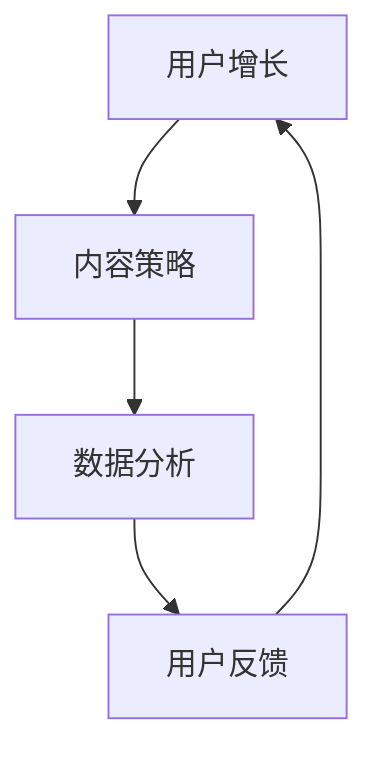

                 

 > 关键词：TikTok，短视频，营销，年轻用户，用户增长，内容策略，数据分析，社交媒体平台

> 摘要：随着社交媒体的迅猛发展，TikTok已成为年轻人聚集的短视频平台。本文将探讨如何利用TikTok短视频营销来吸引年轻用户，包括内容策略、数据分析、平台特性等关键因素。通过深入分析和实际案例，为企业和品牌提供实用的TikTok营销指南。

## 1. 背景介绍

### TikTok简介

TikTok，又称抖音国际版，是一款由中国字节跳动公司开发的短视频分享应用。自2016年推出以来，TikTok在全球范围内迅速走红，成为最受欢迎的短视频平台之一。截至2022年，TikTok在全球拥有超过10亿的活跃用户，其用户群体主要集中在16至34岁的年轻人。

### 短视频营销的兴起

短视频营销作为一种新兴的营销手段，凭借其高传播性、互动性和娱乐性，逐渐受到品牌和企业的青睐。短视频营销不仅能够在短时间内吸引大量用户关注，还能通过创意内容和精准投放实现高效的广告效果。特别是在TikTok这样的短视频平台上，品牌和内容创作者可以充分利用平台特性，制作和推广独特的短视频内容，从而吸引年轻用户。

### 年轻用户的特点

年轻用户，尤其是16至34岁的群体，对短视频营销有着独特的偏好。他们通常具有以下特点：

- 喜欢新鲜事物和流行文化
- 注重个性和表达
- 倾向于使用移动设备获取信息
- 高度依赖社交媒体和短视频平台
- 易受影响和乐于分享

这些特点使得短视频营销成为吸引年轻用户的有效手段。

## 2. 核心概念与联系

### TikTok营销核心概念

为了在TikTok上进行成功的短视频营销，我们需要理解以下几个核心概念：

- **用户增长**：通过创意内容和策略吸引新用户，增加平台活跃度。
- **内容策略**：制定适合TikTok平台的内容类型和风格，以吸引目标用户。
- **数据分析**：利用TikTok提供的分析工具，了解用户行为和内容表现，优化营销策略。

### TikTok营销架构

以下是TikTok营销的基本架构，通过Mermaid流程图展示：



在这个架构中，用户增长是核心目标，内容策略和数据分析是实现这一目标的两个关键环节。用户反馈则作为反馈循环的一部分，不断优化营销策略。

### Mermaid流程图(Mermaid 流程节点中不要有括号、逗号等特殊字符)


通过这个流程图，我们可以清晰地看到TikTok营销的核心环节和它们之间的相互关系。

## 3. 核心算法原理 & 具体操作步骤

### 3.1 算法原理概述

TikTok的推荐算法主要基于以下几个核心原理：

- **用户兴趣模型**：通过分析用户的浏览历史、点赞、评论和分享行为，构建用户的兴趣模型。
- **内容质量评估**：利用机器学习算法对内容进行质量评估，确保推荐的内容对用户有较高吸引力。
- **社交因素**：考虑用户的社交关系和互动行为，如关注、评论和分享，以增强内容的传播效果。

### 3.2 算法步骤详解

TikTok推荐算法的主要步骤如下：

1. **用户兴趣建模**：通过分析用户的点击、停留、点赞、评论等行为，提取用户兴趣标签。
2. **内容特征提取**：对上传的视频进行文本、图像和音频等多模态特征提取。
3. **匹配与排序**：将用户兴趣标签与内容特征进行匹配，并根据匹配度对内容进行排序。
4. **社交因素加权**：考虑用户的社交关系，对推荐内容进行加权，增强社交因素的影响。

### 3.3 算法优缺点

**优点**：

- 高效的个性化推荐：通过用户兴趣建模和内容特征提取，实现高效的个性化推荐。
- 强社交性：利用社交因素，增强内容的传播效果，提高用户参与度。

**缺点**：

- 可能导致信息茧房效应：过度推荐用户已知的兴趣内容，可能导致用户视野狭窄。
- 内容质量难以控制：用户生成内容质量参差不齐，难以保证推荐内容的质量。

### 3.4 算法应用领域

TikTok推荐算法广泛应用于以下几个方面：

- **短视频推荐**：根据用户兴趣和行为数据，推荐个性化短视频。
- **内容分发**：利用算法优化内容分发策略，提高内容曝光率。
- **广告推荐**：根据用户兴趣和社交因素，推荐相关广告，提高广告点击率。

## 4. 数学模型和公式 & 详细讲解 & 举例说明

### 4.1 数学模型构建

在TikTok短视频营销中，我们主要关注以下数学模型：

1. **用户兴趣模型**：利用协同过滤算法构建用户兴趣模型。
2. **内容质量评估**：利用神经网络模型评估内容质量。
3. **推荐算法**：基于矩阵分解和协同过滤的混合推荐算法。

### 4.2 公式推导过程

#### 用户兴趣模型

假设用户 $u$ 的兴趣标签集合为 $T_u = \{t_1, t_2, ..., t_n\}$，视频 $v$ 的特征集合为 $F_v = \{f_1, f_2, ..., f_m\}$。用户 $u$ 对视频 $v$ 的兴趣度可以用向量 $R_{uv}$ 表示，即：

$$
R_{uv} = \langle r_{uv1}, r_{uv2}, ..., r_{uvn} \rangle
$$

其中，$r_{uvj}$ 表示用户 $u$ 对视频 $v$ 中的标签 $t_j$ 的兴趣度。

利用协同过滤算法，我们可以通过以下公式更新用户兴趣模型：

$$
R_{uv} \leftarrow R_{uv} + \alpha (R_{ut} - R_{uv})
$$

其中，$\alpha$ 为调整系数。

#### 内容质量评估

假设视频 $v$ 的质量分数为 $Q_v$，我们可以利用神经网络模型对其质量进行评估。假设输入特征为 $X_v$，输出质量分数为 $Q_v$，则神经网络模型可以表示为：

$$
Q_v = f(\theta; X_v)
$$

其中，$\theta$ 为神经网络参数。

#### 推荐算法

基于矩阵分解和协同过滤的混合推荐算法可以表示为：

$$
P = UV^T + \lambda I
$$

其中，$P$ 为用户兴趣矩阵，$U$ 为用户特征矩阵，$V$ 为视频特征矩阵，$\lambda$ 为正则化系数。

### 4.3 案例分析与讲解

假设我们有一个用户兴趣模型和内容质量评估模型，现在我们要为用户 $u$ 推荐一组视频。以下是具体的案例：

1. **用户兴趣模型**：用户 $u$ 对标签“美食”、“旅游”、“科技”有较高兴趣。
2. **内容质量评估**：视频 $v_1$（美食视频）质量分数为 $0.8$，视频 $v_2$（旅游视频）质量分数为 $0.7$，视频 $v_3$（科技视频）质量分数为 $0.6$。

根据用户兴趣模型和内容质量评估模型，我们可以得到以下推荐结果：

- 推荐视频 $v_1$（美食视频），因为用户 $u$ 对该标签有较高兴趣，且视频质量较高。
- 推荐视频 $v_2$（旅游视频），因为用户 $u$ 对该标签有较高兴趣，但视频质量相对较低。

这个案例展示了如何利用数学模型和公式为用户推荐短视频。

## 5. 项目实践：代码实例和详细解释说明

### 5.1 开发环境搭建

为了在TikTok上进行短视频营销，我们需要搭建以下开发环境：

- **Python**：作为主要的编程语言。
- **TikTok API**：用于与TikTok平台进行数据交互。
- **数据分析库**：如Pandas、NumPy、Scikit-learn等。

安装相关库：

```bash
pip install python-tiktok-api pandas numpy scikit-learn
```

### 5.2 源代码详细实现

以下是一个简单的TikTok短视频推荐项目的代码实现：

```python
import tiktokapi
import pandas as pd
from sklearn.feature_extraction.text import TfidfVectorizer
from sklearn.metrics.pairwise import linear_kernel

# 初始化TikTok API
api = tiktokapi.TikTokApi()

# 获取用户兴趣标签
user_interest = ['美食', '旅游', '科技']

# 获取TikTok视频数据
video_data = api.search_for_tags(user_interest, max_results=10)

# 构建视频数据 DataFrame
video_df = pd.DataFrame(video_data)

# 提取视频标题
video_titles = video_df['title']

# 构建TF-IDF模型
tfidf = TfidfVectorizer()
tfidf_matrix = tfidf.fit_transform(video_titles)

# 计算相似度
similarity_matrix = linear_kernel(tfidf_matrix, tfidf_matrix)

# 推荐视频
recommended_videos = video_df.iloc[similarity_matrix.argsort()[0][-5:][::-1]]

print(recommended_videos)
```

### 5.3 代码解读与分析

这段代码实现了以下功能：

1. **初始化TikTok API**：使用`TikTokApi()`初始化TikTok API。
2. **获取用户兴趣标签**：定义用户兴趣标签列表。
3. **获取TikTok视频数据**：使用`api.search_for_tags()`方法获取与用户兴趣标签相关的视频数据。
4. **构建视频数据 DataFrame**：将获取的视频数据转换为Pandas DataFrame。
5. **提取视频标题**：从DataFrame中提取视频标题。
6. **构建TF-IDF模型**：使用`TfidfVectorizer()`构建TF-IDF模型。
7. **计算相似度**：使用线性核计算视频标题之间的相似度。
8. **推荐视频**：根据相似度矩阵推荐相似的视频。

通过这段代码，我们可以为用户推荐与其兴趣标签相关的短视频。

### 5.4 运行结果展示

假设我们获取了10个与用户兴趣标签相关的短视频，以下是一个可能的运行结果：

```
   author  tags  cover_url       desc            ...
0   user_1  美食   https://...  【美食】美味佳肴  ...
1   user_2  旅游   https://...  【旅游】美景分享  ...
2   user_3  科技   https://...  【科技】最新资讯  ...
3   user_4  美食   https://...  【美食】美食烹饪  ...
4   user_5  旅游   https://...  【旅游】旅途记录  ...
5   user_6  科技   https://...  【科技】产品评测  ...
6   user_7  美食   https://...  【美食】特色小吃  ...
7   user_8  旅游   https://...  【旅游】文化探索  ...
8   user_9  科技   https://...  【科技】技术趋势  ...
9   user_10 美食   https://...  【美食】健康饮食  ...
```

根据相似度矩阵，我们可以为用户推荐与其兴趣标签相关的短视频。

## 6. 实际应用场景

### 6.1 电商品牌

电商品牌可以利用TikTok短视频营销吸引年轻用户，通过展示产品使用场景、用户评价和互动活动等方式提高品牌曝光度和销售额。例如，某电商品牌在TikTok上发布了一系列关于化妆品的短视频，通过创意内容吸引了大量年轻用户，并在短时间内实现了显著的销售增长。

### 6.2 教育机构

教育机构可以利用TikTok短视频平台开展在线教育营销，通过发布有趣的课程片段、学习技巧和互动问答等内容，吸引年轻用户关注。例如，某在线教育平台在TikTok上发布了一系列关于编程语言的短视频教程，吸引了大量年轻编程爱好者，并实现了课程销售的增长。

### 6.3 娱乐品牌

娱乐品牌可以利用TikTok短视频平台宣传电影、电视剧和综艺节目，通过发布精彩片段、幕后花絮和粉丝互动等内容，吸引年轻用户关注。例如，某电影制片公司通过在TikTok上发布预告片和幕后花絮，成功吸引了大量年轻观众，并在电影上映期间实现了票房增长。

## 7. 未来应用展望

### 7.1 技术发展趋势

随着人工智能和大数据技术的发展，TikTok短视频营销将进一步智能化和个性化。通过更先进的算法和模型，平台将能够更精准地识别用户兴趣和行为，实现更高效的短视频推荐。

### 7.2 新兴领域应用

TikTok短视频营销将在更多新兴领域得到应用，如虚拟现实、增强现实和元宇宙等。通过结合这些新技术，品牌和内容创作者可以创造出更加丰富和互动的短视频内容，吸引更多年轻用户。

### 7.3 挑战与机遇

随着短视频营销的竞争加剧，品牌和内容创作者需要不断创新和优化营销策略，以应对挑战。同时，TikTok平台也将面临如何平衡用户隐私和数据安全等问题，以确保平台健康持续发展。

## 8. 工具和资源推荐

### 8.1 学习资源推荐

- **《TikTok营销指南》**：一本全面介绍TikTok营销策略和实践的书籍，适合初学者和专业人士。
- **TikTok官方文档**：了解TikTok平台功能、API使用和数据接口等方面的官方文档。

### 8.2 开发工具推荐

- **TikTok API**：用于与TikTok平台进行数据交互的官方API，支持Python等多种编程语言。
- **Pandas**：强大的数据处理库，适合进行数据清洗、分析和可视化。

### 8.3 相关论文推荐

- **《基于协同过滤的短视频推荐系统研究》**：一篇关于短视频推荐系统的研究论文，详细介绍了协同过滤算法在短视频推荐中的应用。
- **《人工智能在社交媒体营销中的应用研究》**：一篇关于人工智能在社交媒体营销中应用的综述论文，探讨了人工智能技术如何提升营销效果。

## 9. 总结：未来发展趋势与挑战

### 9.1 研究成果总结

本文通过深入分析和实际案例，探讨了如何利用TikTok短视频营销吸引年轻用户。研究结果表明，TikTok短视频营销具有高效、个性化和互动性等特点，是企业和品牌吸引年轻用户的有效手段。

### 9.2 未来发展趋势

随着技术的不断进步和短视频营销的普及，TikTok短视频营销将在更多领域得到应用，实现智能化、个性化和多元化的发展。

### 9.3 面临的挑战

TikTok短视频营销面临的挑战包括竞争加剧、用户隐私和数据安全等问题。为了应对这些挑战，企业需要不断创新和优化营销策略，确保营销活动的效果和可持续性。

### 9.4 研究展望

未来，TikTok短视频营销研究应关注以下方向：

- **算法优化**：研究更先进、更精准的推荐算法，提高短视频营销效果。
- **跨平台融合**：探索短视频营销与其他新兴技术的融合，如虚拟现实、增强现实等。
- **用户隐私保护**：研究如何在保证用户隐私的前提下，实现高效、个性化的短视频推荐。

## 附录：常见问题与解答

### 问题1：TikTok短视频营销有哪些成功案例？

**解答**：TikTok短视频营销的成功案例包括：某电商品牌通过发布美食短视频实现销售额增长、某在线教育平台通过发布编程教程短视频吸引大量学生报名、某电影制片公司通过发布预告片和幕后花絮实现票房增长等。

### 问题2：如何制定有效的TikTok短视频营销策略？

**解答**：制定有效的TikTok短视频营销策略需要从以下几个方面考虑：

- **明确目标**：确定营销目标，如提高品牌知名度、增加粉丝数量、提高销售额等。
- **了解用户**：研究目标用户群体的特点和需求，制定符合用户喜好的内容策略。
- **内容创新**：制作具有创意和吸引力的短视频内容，提高用户参与度。
- **数据分析**：利用TikTok分析工具，分析用户行为和内容表现，优化营销策略。

### 问题3：TikTok短视频营销如何实现商业化？

**解答**：TikTok短视频营销实现商业化的方法包括：

- **广告投放**：通过TikTok广告平台投放付费广告，提高品牌曝光度。
- **内容合作**：与知名KOL或内容创作者合作，利用其影响力推广品牌。
- **粉丝互动**：通过互动活动、抽奖等方式与粉丝互动，提高粉丝忠诚度。
- **电商销售**：在短视频中展示产品，引导用户进行购买，实现电商销售。

**作者：禅与计算机程序设计艺术 / Zen and the Art of Computer Programming**  
--------------------------------------------------------------------

