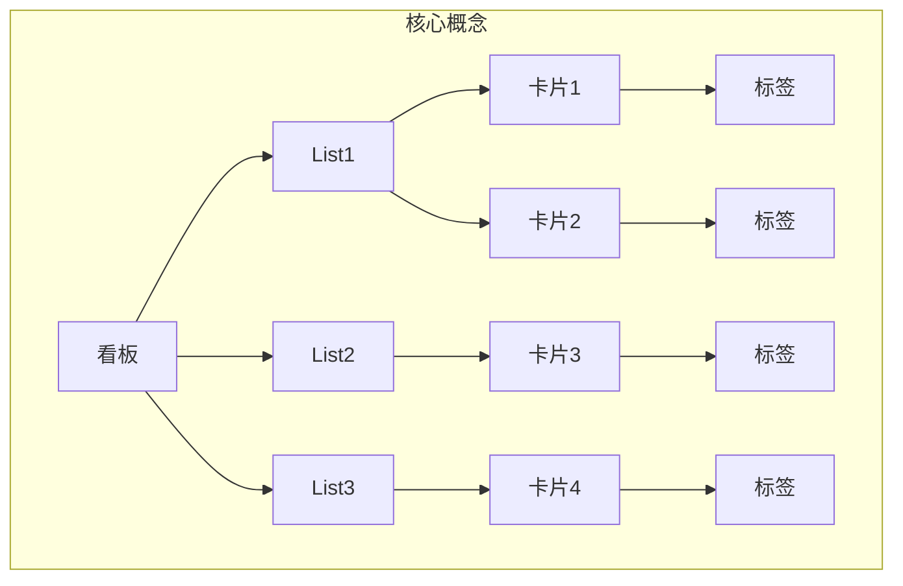

                 

在当今快速发展的创业环境中，有效的任务管理是确保项目成功的关键因素之一。Trello，作为一个流行的项目管理工具，以其直观的看板界面和灵活的任务管理功能，成为了众多创业团队的优先选择。本文将深入探讨如何利用Trello进行创业项目的任务管理，旨在帮助创业者提高工作效率，优化项目管理流程。

> **关键词：**Trello，任务管理，项目管理，创业，敏捷开发，敏捷流程

> **摘要：**本文将详细介绍Trello在创业项目任务管理中的优势和应用，通过案例分析和具体操作步骤，帮助读者掌握Trello的使用技巧，从而实现高效的项目管理。

## 1. 背景介绍

随着互联网经济的蓬勃发展，创业项目如雨后春笋般涌现。然而，创业过程充满了不确定性和复杂性，如何在有限的资源下高效管理项目任务成为创业者面临的重大挑战。传统的任务管理方法往往依赖于电子邮件和文档，这种方式容易导致信息散乱、沟通不畅、进度难以追踪。因此，需要一个高效、可视化的项目管理工具来协助创业者更好地组织和管理任务。

Trello，作为一个基于看板的项目管理工具，自2011年成立以来，凭借其简单易用、灵活多变的特点，迅速在全球范围内获得了广泛的认可。Trello的看板界面将任务分解为卡片、列表和标签，用户可以通过拖放操作轻松管理任务，极大地提高了工作效率。此外，Trello还提供了多种集成服务，如Google Drive、Slack等，使得团队成员之间的协作更加顺畅。

## 2. 核心概念与联系

在深入探讨Trello如何用于任务管理之前，我们先来了解几个核心概念：

### 2.1. 看板（Kanban）

看板是一种源于日本丰田汽车公司的生产管理方法，它通过限制在流程中的任务数量，以减少浪费和提高效率。在Trello中，看板是一个大的工作区域，包含多个列表和卡片。

### 2.2. 列表（List）

列表是看板中的垂直划分，用于分类和排列任务。例如，一个项目可以划分为“待办”、“进行中”和“已完成”三个列表。

### 2.3. 卡片（Card）

卡片是任务的具体体现，包含了任务名称、描述、截止日期、标签和评论等信息。用户可以通过拖放操作来调整卡片的位置，从而反映任务的进度。

### 2.4. 标签（Label）

标签用于给卡片分类，如红色代表紧急任务，蓝色代表普通任务。标签可以帮助用户快速识别任务的重要性和优先级。

下面是一个简单的Mermaid流程图，展示Trello中看板、列表、卡片和标签之间的关系：



## 3. 核心算法原理 & 具体操作步骤

### 3.1 算法原理概述

Trello的任务管理基于看板方法（Kanban），其核心算法原理是通过限制在流程中的任务数量，确保团队成员专注于当前任务，从而提高工作效率。具体操作步骤如下：

### 3.2 算法步骤详解

1. **创建看板（Board）**

   登录Trello，点击“创建看板”按钮，输入看板名称，如“创业项目任务管理”。

2. **添加列表（Lists）**

   在看板中添加多个列表，用于分类和排列任务。例如，可以添加“待办”、“进行中”和“已完成”三个列表。

3. **创建卡片（Cards）**

   在每个列表中添加卡片，每个卡片代表一个任务。在卡片上填写任务名称、描述、截止日期等信息。

4. **设置标签（Labels）**

   根据任务的重要性和优先级，为卡片添加标签。例如，红色标签表示紧急任务，蓝色标签表示普通任务。

5. **拖放任务（Drag and Drop）**

   通过拖放操作，将卡片从一个列表拖到另一个列表，以反映任务的进度。例如，将卡片从“待办”列表拖到“进行中”列表，表示任务已经开始。

6. **添加评论（Comments）**

   在卡片下方添加评论，用于团队成员之间的沟通和协作。

7. **设置提醒（Reminders）**

   为任务设置提醒，确保在截止日期前完成任务。

### 3.3 算法优缺点

**优点：**

- **直观易用**：Trello的看板界面简单直观，用户可以快速上手。
- **灵活多变**：用户可以根据项目需求自定义列表、卡片和标签。
- **提高效率**：通过限制任务数量和明确的任务进度，提高团队成员的工作效率。
- **协作顺畅**：Trello支持团队成员之间的实时协作，提高沟通效率。

**缺点：**

- **数据存储限制**：免费版本的数据存储空间有限，可能无法满足大型项目需求。
- **个性化不足**：Trello的界面和功能相对固定，可能无法满足特定用户的需求。

### 3.4 算法应用领域

Trello广泛应用于各种领域的任务管理，包括软件开发、市场营销、产品管理、团队协作等。以下是几个典型的应用场景：

- **软件开发**：用于项目管理、任务分配、进度跟踪等。
- **市场营销**：用于广告投放、活动策划、客户管理等。
- **产品管理**：用于需求收集、产品规划、功能迭代等。
- **团队协作**：用于跨部门沟通、任务分配、进度汇报等。

## 4. 数学模型和公式 & 详细讲解 & 举例说明

### 4.1 数学模型构建

在Trello的任务管理中，我们可以构建一个简单的数学模型来衡量任务完成率和工作效率。假设有一个任务集合 \( T \)，每个任务 \( t \) 有一个完成度 \( C(t) \)，我们可以通过以下公式计算任务完成率 \( R \)：

$$
R = \frac{1}{|T|} \sum_{t \in T} C(t)
$$

其中， \( |T| \) 表示任务集合中的任务总数。

### 4.2 公式推导过程

为了推导上述公式，我们首先定义任务完成度 \( C(t) \) 为一个介于 0 和 1 之间的值，表示任务 \( t \) 的完成百分比。假设 \( t \) 完全未完成时 \( C(t) = 0 \)，完全完成时 \( C(t) = 1 \)。

对于每个任务 \( t \)，我们有：

$$
C(t) = \frac{p(t)}{d(t)}
$$

其中，\( p(t) \) 表示任务 \( t \) 已完成的进度，\( d(t) \) 表示任务 \( t \) 的总进度。

将 \( C(t) \) 代入任务完成率的定义中，我们得到：

$$
R = \frac{1}{|T|} \sum_{t \in T} \frac{p(t)}{d(t)}
$$

### 4.3 案例分析与讲解

假设一个创业项目包含三个任务，任务 A、任务 B 和任务 C，每个任务的完成度和总进度如下表所示：

| 任务 | 完成度 \( C(t) \) | 总进度 \( d(t) \) | 已完成的进度 \( p(t) \) |
|------|----------------|------------------|------------------------|
| 任务 A | 0.5 | 100 | 50 |
| 任务 B | 0.8 | 100 | 80 |
| 任务 C | 0.3 | 100 | 30 |

根据上述公式，我们可以计算任务完成率 \( R \)：

$$
R = \frac{1}{3} \times (0.5 + 0.8 + 0.3) = \frac{1.6}{3} \approx 0.5333
$$

因此，项目的任务完成率大约为 53.33%。

这个案例展示了如何使用Trello中的任务完成度数据来计算项目的整体完成情况。通过定期更新任务完成度，创业者可以实时掌握项目进度，为后续决策提供数据支持。

## 5. 项目实践：代码实例和详细解释说明

### 5.1 开发环境搭建

为了更好地展示Trello在任务管理中的应用，我们将使用Python编写一个简单的Trello API客户端，用于创建看板、添加列表、创建卡片和设置标签。首先，确保你的系统上安装了Python和Trello API的Python包。可以使用以下命令安装Trello API包：

```bash
pip install trello
```

### 5.2 源代码详细实现

以下是一个简单的Python脚本，用于演示如何使用Trello API进行任务管理：

```python
import trello
import os

# 设置Trello API密钥和令牌
trello_api_key = os.environ['TRELLO_API_KEY']
trello_token = os.environ['TRELLO_TOKEN']

# 初始化Trello客户端
client = trello.TrelloClient(api_key=trello_api_key, token=trello_token)

# 创建一个新看板
board = client.create_board('创业项目任务管理')

# 添加列表
todo_list = board.add_list('待办')
in_progress_list = board.add_list('进行中')
done_list = board.add_list('已完成')

# 添加卡片
task_a = todo_list.add_card('任务A - 产品需求分析')
task_b = todo_list.add_card('任务B - UI设计')
task_c = todo_list.add_card('任务C - 前端开发')

# 设置标签
task_a.set_labels(['高优先级'])
task_b.set_labels(['中等优先级'])
task_c.set_labels(['低优先级'])

# 更新卡片描述
task_a.set_description('任务A详细描述：完成产品需求分析文档。')

# 移动卡片到进行中列表
task_a.move(in_progress_list)

# 设置提醒
task_a.set_reminder('2023-12-31 18:00:00')

# 打印看板信息
print(board)
```

### 5.3 代码解读与分析

上述脚本首先导入了Trello库，并设置了Trello API的密钥和令牌。然后，初始化了Trello客户端，并创建了一个新的看板。接下来，添加了三个列表，分别代表任务的三个阶段：“待办”、“进行中”和“已完成”。

接着，脚本添加了三个卡片，每个卡片代表一个任务，并为每个任务设置了不同的标签，以反映任务的优先级。此外，脚本还为任务 A 更新了描述信息，并将其移动到“进行中”列表。最后，脚本为任务 A 设置了一个提醒，确保在截止日期前完成任务。

通过这个简单的脚本，我们可以看到如何使用Trello API进行任务管理的基本操作。在实际应用中，开发者可以根据具体需求扩展和定制Trello API的功能。

### 5.4 运行结果展示

当运行上述脚本时，Trello上会出现一个名为“创业项目任务管理”的看板，其中包括“待办”、“进行中”和“已完成”三个列表。每个列表下都有对应的卡片，例如“任务A - 产品需求分析”等。此外，任务 A 的描述信息会更新为“任务A详细描述：完成产品需求分析文档。”，并且会在 2023-12-31 18:00:00 发送提醒。

## 6. 实际应用场景

Trello在创业项目的任务管理中有着广泛的应用场景。以下是一些实际案例和场景：

### 6.1 软件开发

在一个软件开发项目中，Trello可以用于管理需求收集、UI设计、前端开发和后端开发等各个阶段的任务。开发者可以创建多个列表，每个列表代表一个开发阶段，并将任务卡片从一个列表拖放到下一个列表，以反映开发进度。

### 6.2 市场营销

在市场营销项目中，Trello可以用于管理广告投放、活动策划、客户管理等任务。例如，创建一个“广告投放”看板，包括“待投放”、“投放中”和“已完成”三个列表，每个列表下分别添加相应的任务卡片。

### 6.3 产品管理

在产品管理项目中，Trello可以用于管理产品需求、产品规划、功能迭代等任务。产品经理可以创建一个“产品规划”看板，将不同的产品功能分解为任务卡片，并根据优先级和截止日期进行管理。

### 6.4 团队协作

在跨部门协作项目中，Trello可以用于沟通、任务分配和进度汇报。例如，在市场部和技术部之间的协作中，可以创建一个“项目协作”看板，让团队成员可以实时查看任务进度和沟通进展。

## 7. 工具和资源推荐

### 7.1 学习资源推荐

- **Trello官方文档**：提供了丰富的教程和操作指南，帮助用户深入了解Trello的功能和应用。
- **《Trello实战：高效团队协作指南》**：一本关于Trello实战应用的书籍，涵盖了很多实用的案例和技巧。
- **Trello社区**：一个活跃的用户社区，可以在这里交流使用经验，获取最新动态。

### 7.2 开发工具推荐

- **Postman**：用于测试和调用Trello API的利器，可以帮助开发者快速构建Trello应用。
- **Trello Power-Up**：Trello集成服务的一部分，提供了多种扩展功能，如Google Drive、Slack等。

### 7.3 相关论文推荐

- **《Kanban：成功的关键》**：一篇关于看板方法的详细介绍，对Trello的任务管理理念有着深刻的启示。
- **《敏捷项目管理方法研究》**：探讨了敏捷开发方法在项目管理中的应用，为Trello的实践提供了理论支持。

## 8. 总结：未来发展趋势与挑战

### 8.1 研究成果总结

Trello作为一款基于看板方法的项目管理工具，已经广泛应用于各种创业项目的任务管理中。通过Trello，创业者可以直观地跟踪任务进度，提高工作效率，优化项目管理流程。同时，Trello还提供了丰富的集成服务，如Google Drive、Slack等，使得团队成员之间的协作更加顺畅。

### 8.2 未来发展趋势

随着互联网技术的不断发展，Trello有望在以下几个方面实现创新：

- **智能推荐**：利用人工智能技术，为用户提供任务优先级和完成时间的智能推荐，提高任务管理的效率。
- **可视化分析**：通过数据可视化技术，为用户提供更直观的任务进度和效率分析，帮助用户更好地掌握项目状况。
- **跨平台支持**：进一步扩展Trello在移动设备上的应用，满足用户随时随地管理的需求。

### 8.3 面临的挑战

然而，Trello也面临一些挑战：

- **数据存储限制**：免费版本的数据存储空间有限，可能无法满足大型项目的需求。
- **个性化不足**：Trello的界面和功能相对固定，可能无法满足特定用户的需求。
- **用户体验优化**：在快速发展的市场中，Trello需要不断优化用户体验，以保持竞争优势。

### 8.4 研究展望

未来的研究可以重点关注以下几个方面：

- **数据安全与隐私保护**：确保用户数据的安全和隐私，提高用户信任度。
- **人工智能集成**：探索如何更好地利用人工智能技术，为用户提供更智能的任务管理服务。
- **跨平台兼容性**：提高Trello在移动设备上的兼容性和用户体验。

## 9. 附录：常见问题与解答

### 9.1 如何创建Trello看板？

答：登录Trello官网，点击右上角的“+”按钮，选择“创建看板”，输入看板名称，点击“创建”即可。

### 9.2 如何添加任务列表？

答：在创建好的看板中，点击左侧的“+”按钮，选择“添加列表”，输入列表名称，点击“添加”即可。

### 9.3 如何创建任务卡片？

答：在列表中点击“+”按钮，选择“添加卡片”，输入卡片名称，点击“添加”即可。

### 9.4 如何为任务设置标签？

答：在卡片上点击标签按钮，选择一个标签颜色，即可为任务设置标签。

### 9.5 如何设置任务提醒？

答：在卡片上点击“设置”按钮，选择“提醒”，输入提醒时间，即可为任务设置提醒。

# 作者署名

作者：禅与计算机程序设计艺术 / Zen and the Art of Computer Programming

