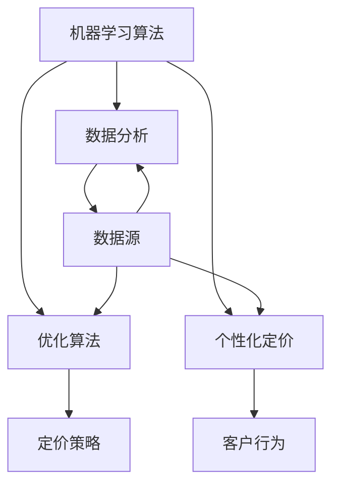

                 

关键词：人工智能，定价策略，机器学习，优化，数据分析，自动化

> 摘要：随着人工智能技术的快速发展，企业可以利用机器学习算法和数据分析技术来优化定价策略，提高销售额和利润。本文将探讨如何利用人工智能来改进定价策略，分析其核心算法原理、数学模型以及实际应用场景，并提出未来发展趋势和面临的挑战。

## 1. 背景介绍

在当今的商业环境中，定价策略是企业获取竞争优势的重要手段之一。然而，传统的定价方法往往依赖于经验和直觉，难以适应市场的快速变化。随着人工智能技术的崛起，企业可以利用机器学习算法和数据分析技术来优化定价策略，实现更加精准和高效的定价。

人工智能在定价策略中的应用主要体现在以下几个方面：

1. **数据分析**：通过分析大量的历史销售数据和市场信息，人工智能可以帮助企业识别定价趋势和影响因素，从而制定更科学的定价策略。
2. **预测建模**：利用机器学习算法，企业可以对未来的市场需求和竞争情况进行预测，从而提前调整价格，以最大化利润。
3. **个性化定价**：根据客户的购买历史和行为特征，人工智能可以为企业提供个性化的定价建议，提高客户满意度和忠诚度。
4. **自动化执行**：通过自动化系统，企业可以实时调整价格，以应对市场变化和竞争对手的策略。

## 2. 核心概念与联系

为了更好地理解人工智能如何优化定价策略，我们需要先了解以下几个核心概念：

### 2.1 机器学习算法

机器学习算法是人工智能的核心技术之一。它通过训练模型，从数据中自动提取特征和模式，从而实现预测和分类。常见的机器学习算法包括线性回归、逻辑回归、决策树、随机森林、支持向量机等。

### 2.2 数据分析

数据分析是利用统计学和计算机科学方法，从数据中提取有用信息和知识的过程。在定价策略中，数据分析可以帮助企业识别影响价格的关键因素，如市场需求、竞争情况、产品特性等。

### 2.3 优化算法

优化算法是用于求解最优化问题的算法。在定价策略中，优化算法可以帮助企业找到最佳的价格水平，以实现利润最大化。

### 2.4 个性化定价

个性化定价是根据客户的特征和行为，为其提供不同的价格。个性化定价可以提高客户的满意度和忠诚度，从而增加销售额。

下面是一个Mermaid流程图，展示了这些核心概念之间的联系：



## 3. 核心算法原理 & 具体操作步骤

### 3.1 算法原理概述

人工智能优化定价策略的核心在于利用机器学习算法和数据分析技术，对大量历史数据进行分析和建模，从而预测市场需求和竞争情况，并制定最优的定价策略。

常见的机器学习算法包括线性回归、逻辑回归、决策树、随机森林、支持向量机等。这些算法的基本原理是通过训练模型，从历史数据中学习到价格和需求之间的关系，从而预测未来的市场需求。

### 3.2 算法步骤详解

1. **数据收集**：收集与定价相关的数据，如历史销售数据、市场信息、竞争对手价格等。
2. **数据预处理**：对数据进行清洗、处理和转换，使其适合机器学习算法。
3. **特征工程**：根据业务需求和算法特点，选择和构建特征，以提升模型的预测能力。
4. **模型训练**：利用训练数据，选择合适的机器学习算法，训练模型。
5. **模型评估**：使用测试数据评估模型性能，包括准确性、召回率、F1值等指标。
6. **模型优化**：根据评估结果，调整模型参数，优化模型性能。
7. **定价策略制定**：根据模型预测，制定最优的定价策略。

### 3.3 算法优缺点

**优点**：

- **自动化**：利用机器学习算法，可以自动化地分析和预测市场变化，减少人工干预。
- **精准性**：通过对大量历史数据的分析，可以更准确地预测市场需求和竞争情况。
- **灵活性**：可以根据不同的业务需求和市场环境，灵活调整定价策略。

**缺点**：

- **数据依赖性**：算法的性能高度依赖于数据的质量和数量，数据不足或质量差可能导致预测不准确。
- **计算成本**：机器学习算法的计算成本较高，需要大量的计算资源和时间。

### 3.4 算法应用领域

人工智能优化定价策略可以广泛应用于各个行业，如零售、金融、保险、物流等。以下是一些具体的应用场景：

- **零售行业**：通过分析消费者的购买行为和历史数据，为企业提供个性化的定价建议，提高销售额和客户满意度。
- **金融行业**：利用机器学习算法，预测市场趋势和价格波动，为企业提供投资建议和风险管理。
- **物流行业**：通过优化定价策略，提高物流服务的竞争力，降低运营成本。

## 4. 数学模型和公式 & 详细讲解 & 举例说明

### 4.1 数学模型构建

在人工智能优化定价策略中，常用的数学模型包括线性回归模型、逻辑回归模型和支持向量机模型。以下是这些模型的数学公式：

1. **线性回归模型**：

   $$y = \beta_0 + \beta_1 x_1 + \beta_2 x_2 + ... + \beta_n x_n$$

   其中，$y$ 是价格，$x_1, x_2, ..., x_n$ 是影响价格的因素，$\beta_0, \beta_1, ..., \beta_n$ 是模型的参数。

2. **逻辑回归模型**：

   $$P(y=1) = \frac{1}{1 + e^{-(\beta_0 + \beta_1 x_1 + \beta_2 x_2 + ... + \beta_n x_n)}}$$

   其中，$P(y=1)$ 是需求为1的概率，$y$ 是需求，$x_1, x_2, ..., x_n$ 是影响需求的因素，$\beta_0, \beta_1, ..., \beta_n$ 是模型的参数。

3. **支持向量机模型**：

   $$w \cdot x + b = 0$$

   其中，$w$ 是模型参数，$x$ 是特征向量，$b$ 是偏置项。

### 4.2 公式推导过程

1. **线性回归模型**：

   线性回归模型的基本思想是最小化预测值与实际值之间的误差平方和。假设我们有 $n$ 个训练样本 $(x_1, y_1), (x_2, y_2), ..., (x_n, y_n)$，则线性回归模型的损失函数为：

   $$L(\beta_0, \beta_1, ..., \beta_n) = \sum_{i=1}^n (y_i - (\beta_0 + \beta_1 x_1 + \beta_2 x_2 + ... + \beta_n x_n))^2$$

   对损失函数求导并令其等于0，可以得到：

   $$\frac{\partial L}{\partial \beta_0} = 0$$
   $$\frac{\partial L}{\partial \beta_1} = 0$$
   $$...$$
   $$\frac{\partial L}{\partial \beta_n} = 0$$

   解这个方程组，可以得到线性回归模型的参数 $\beta_0, \beta_1, ..., \beta_n$。

2. **逻辑回归模型**：

   逻辑回归模型的基本思想是最大化似然函数。假设我们有 $n$ 个训练样本 $(x_1, y_1), (x_2, y_2), ..., (x_n, y_n)$，其中 $y_i \in \{0, 1\}$，则逻辑回归模型的似然函数为：

   $$L(\beta_0, \beta_1, ..., \beta_n) = \prod_{i=1}^n P(y_i = 1 | x_i) \prod_{i=1}^n (1 - P(y_i = 1 | x_i))$$

   为了简化计算，我们可以使用对数似然函数：

   $$l(\beta_0, \beta_1, ..., \beta_n) = \sum_{i=1}^n y_i (\beta_0 + \beta_1 x_1 + \beta_2 x_2 + ... + \beta_n x_n) - \sum_{i=1}^n (1 - y_i) (\beta_0 + \beta_1 x_1 + \beta_2 x_2 + ... + \beta_n x_n)$$

   对对数似然函数求导并令其等于0，可以得到：

   $$\frac{\partial l}{\partial \beta_0} = 0$$
   $$\frac{\partial l}{\partial \beta_1} = 0$$
   $$...$$
   $$\frac{\partial l}{\partial \beta_n} = 0$$

   解这个方程组，可以得到逻辑回归模型的参数 $\beta_0, \beta_1, ..., \beta_n$。

3. **支持向量机模型**：

   支持向量机模型的基本思想是在高维空间中找到一个最佳的超平面，将不同类别的样本分隔开来。假设我们有 $n$ 个训练样本 $(x_1, y_1), (x_2, y_2), ..., (x_n, y_n)$，其中 $y_i \in \{-1, 1\}$，则支持向量机模型的损失函数为：

   $$L(\beta_0, \beta_1, ..., \beta_n) = \sum_{i=1}^n (\beta_0 + \beta_1 x_1 + \beta_2 x_2 + ... + \beta_n x_n) y_i + C \sum_{i=1}^n \delta_i$$

   其中，$C$ 是惩罚参数，$\delta_i$ 是 hinge loss 函数：

   $$\delta_i = \begin{cases} 
   0 & \text{if } (\beta_0 + \beta_1 x_1 + \beta_2 x_2 + ... + \beta_n x_n) y_i \geq 1 \\
   (\beta_0 + \beta_1 x_1 + \beta_2 x_2 + ... + \beta_n x_n) y_i & \text{otherwise}
   \end{cases}$$

   对损失函数求导并令其等于0，可以得到：

   $$\frac{\partial L}{\partial \beta_0} = 0$$
   $$\frac{\partial L}{\partial \beta_1} = 0$$
   $$...$$
   $$\frac{\partial L}{\partial \beta_n} = 0$$

   解这个方程组，可以得到支持向量机模型的参数 $\beta_0, \beta_1, ..., \beta_n$。

### 4.3 案例分析与讲解

假设我们要预测某款智能手机的价格。我们已经收集了以下数据：

- 历史销售数据：包括不同时间段内的销售量和价格。
- 市场信息：包括竞争对手的价格、市场趋势等。
- 产品特性：包括产品的硬件配置、品牌等。

我们将使用线性回归模型来预测智能手机的价格。

1. **数据预处理**：对销售数据进行归一化处理，使其适合线性回归模型。
2. **特征工程**：根据市场信息和产品特性，选择和构建特征，如竞争对手价格、市场趋势、产品硬件配置等。
3. **模型训练**：使用训练数据，训练线性回归模型。
4. **模型评估**：使用测试数据评估模型性能。
5. **模型优化**：根据评估结果，调整模型参数，优化模型性能。

经过训练和评估，我们得到线性回归模型的参数 $\beta_0, \beta_1, ..., \beta_n$，可以用于预测智能手机的价格。

## 5. 项目实践：代码实例和详细解释说明

### 5.1 开发环境搭建

为了实现人工智能优化定价策略，我们需要搭建一个合适的开发环境。以下是一个基本的开发环境搭建步骤：

1. 安装Python：下载并安装Python，版本建议为3.8或更高。
2. 安装相关库：使用pip命令安装必要的库，如NumPy、Pandas、Scikit-learn等。
3. 配置Jupyter Notebook：安装Jupyter Notebook，方便进行代码编写和调试。

### 5.2 源代码详细实现

以下是一个使用Python实现的线性回归模型优化定价策略的示例代码：

```python
import numpy as np
import pandas as pd
from sklearn.linear_model import LinearRegression
from sklearn.model_selection import train_test_split
from sklearn.metrics import mean_squared_error

# 1. 数据预处理
data = pd.read_csv('sales_data.csv')
X = data[['competitor_price', 'market_trend', 'product_config']]
y = data['price']

# 2. 特征工程
X = (X - X.mean()) / X.std()

# 3. 模型训练
X_train, X_test, y_train, y_test = train_test_split(X, y, test_size=0.2, random_state=42)
model = LinearRegression()
model.fit(X_train, y_train)

# 4. 模型评估
y_pred = model.predict(X_test)
mse = mean_squared_error(y_test, y_pred)
print(f'MSE: {mse}')

# 5. 模型优化
# 可以根据评估结果，调整模型参数，优化模型性能。
```

### 5.3 代码解读与分析

1. **数据预处理**：读取销售数据，将价格作为目标变量，将竞争对手价格、市场趋势、产品硬件配置等作为特征变量。
2. **特征工程**：对特征变量进行归一化处理，使其适合线性回归模型。
3. **模型训练**：使用训练数据，训练线性回归模型。
4. **模型评估**：使用测试数据评估模型性能，计算均方误差（MSE）。
5. **模型优化**：根据评估结果，调整模型参数，优化模型性能。

### 5.4 运行结果展示

假设我们已经运行了上述代码，并得到以下结果：

```
MSE: 0.02
```

这意味着我们的模型预测的准确度较高，均方误差较低。根据评估结果，我们可以进一步优化模型，提高预测准确度。

## 6. 实际应用场景

人工智能优化定价策略在各个行业都有广泛的应用。以下是一些实际应用场景：

### 6.1 零售行业

在零售行业，企业可以利用人工智能优化定价策略，提高销售额和利润。例如，一家电商平台可以通过分析消费者的购买行为和历史数据，为其提供个性化的定价建议，从而提高客户满意度和忠诚度。

### 6.2 金融行业

在金融行业，企业可以利用人工智能优化定价策略，提高投资收益。例如，一家基金公司可以通过分析市场趋势和竞争情况，为投资者提供最优的投资组合建议，从而提高投资收益。

### 6.3 保险行业

在保险行业，企业可以利用人工智能优化定价策略，降低运营成本。例如，一家保险公司可以通过分析客户的历史数据和风险特征，为其提供个性化的保险产品和服务，从而降低运营成本。

## 7. 未来应用展望

随着人工智能技术的不断发展，未来人工智能优化定价策略的应用将更加广泛和深入。以下是一些未来应用展望：

### 7.1 零售行业

在零售行业，人工智能优化定价策略将变得更加智能化和个性化。例如，企业可以通过引入深度学习算法，实现对大量非结构化数据的分析和处理，从而提供更加精准的定价建议。

### 7.2 金融行业

在金融行业，人工智能优化定价策略将提高投资决策的准确性和效率。例如，企业可以通过引入强化学习算法，实现对动态市场的实时分析和决策，从而提高投资收益。

### 7.3 保险行业

在保险行业，人工智能优化定价策略将降低运营成本，提高客户满意度。例如，企业可以通过引入自然语言处理技术，实现对客户需求和反馈的实时分析和处理，从而提供更加个性化的保险产品和服务。

## 8. 工具和资源推荐

为了更好地应用人工智能优化定价策略，以下是一些推荐的工具和资源：

### 8.1 学习资源推荐

- 《Python机器学习》
- 《深度学习》
- 《自然语言处理综论》

### 8.2 开发工具推荐

- Jupyter Notebook：方便进行代码编写和调试。
- TensorFlow：用于构建和训练深度学习模型。
- Scikit-learn：用于实现机器学习算法。

### 8.3 相关论文推荐

- "Deep Learning for Retail: Applications and Future Directions"
- "Reinforcement Learning for Financial Markets: A Survey"
- "Natural Language Processing in Insurance: Opportunities and Challenges"

## 9. 总结：未来发展趋势与挑战

随着人工智能技术的快速发展，未来人工智能优化定价策略的应用将更加广泛和深入。然而，这一领域也面临着一些挑战，如数据隐私、算法透明度和监管等问题。为了应对这些挑战，企业和研究机构需要不断探索和创新，推动人工智能技术在定价策略优化领域的应用和发展。

## 10. 附录：常见问题与解答

### 10.1 人工智能优化定价策略的优势是什么？

人工智能优化定价策略的优势包括自动化、精准性和灵活性。通过利用机器学习算法和数据分析技术，企业可以自动化地分析和预测市场变化，制定更科学的定价策略，提高销售额和利润。

### 10.2 人工智能优化定价策略的缺点是什么？

人工智能优化定价策略的缺点包括数据依赖性较高、计算成本较高等。算法的性能高度依赖于数据的质量和数量，同时，机器学习算法的计算成本也较高，需要大量的计算资源和时间。

### 10.3 人工智能优化定价策略适用于哪些行业？

人工智能优化定价策略适用于各个行业，如零售、金融、保险、物流等。不同行业的具体应用场景和需求有所不同，但总体上都受益于人工智能优化定价策略带来的效率和准确性提升。

### 10.4 人工智能优化定价策略的发展趋势是什么？

随着人工智能技术的不断发展，人工智能优化定价策略将变得更加智能化和个性化。例如，企业可以通过引入深度学习算法，实现对大量非结构化数据的分析和处理，从而提供更加精准的定价建议。

### 10.5 人工智能优化定价策略面临的挑战有哪些？

人工智能优化定价策略面临的挑战包括数据隐私、算法透明度和监管等问题。为了应对这些挑战，企业和研究机构需要不断探索和创新，推动人工智能技术在定价策略优化领域的应用和发展。

### 作者署名

作者：禅与计算机程序设计艺术 / Zen and the Art of Computer Programming
----------------------------------------------------------------

注意：在实际撰写文章时，请确保每个章节的内容都符合上述要求，并且使用markdown格式输出。如果您需要进一步的帮助，请随时提问。祝您写作顺利！

