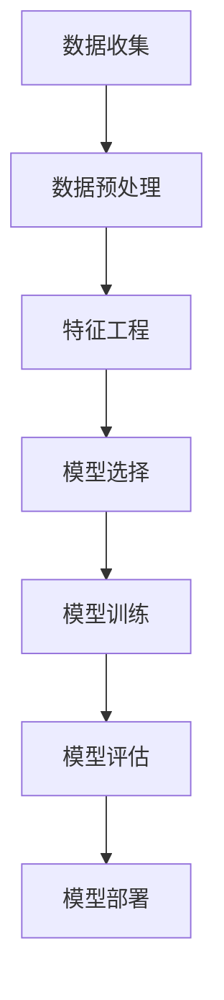

                 

 关键词：人工智能，客户分类，机器学习，数据挖掘，客户关系管理，个性化推荐

> 摘要：本文将探讨如何利用人工智能技术优化客户分类，介绍客户分类的核心概念、常用算法、数学模型以及具体的应用案例。通过深入分析和实践经验，本文旨在为企业和组织提供有效的客户分类策略，从而提升客户满意度和商业价值。

## 1. 背景介绍

在当今信息化和大数据的时代，客户信息的重要性日益凸显。如何准确地对客户进行分类，以便更好地满足其需求、提升客户满意度和实现商业价值，成为企业和组织普遍关注的问题。传统的客户分类方法主要依赖于经验和统计学的知识，然而，随着数据的爆炸式增长和人工智能技术的快速发展，基于人工智能的客户分类方法逐渐成为研究热点。

人工智能，特别是机器学习和数据挖掘技术，为解决客户分类问题提供了全新的视角和方法。通过构建高效的机器学习模型，我们可以从海量数据中提取有价值的信息，实现更加精准和动态的客户分类。这种技术不仅能够帮助企业更好地了解客户，还可以为个性化推荐、风险控制、市场营销等业务领域提供强有力的支持。

本文将围绕如何利用人工智能优化客户分类这一主题，系统性地介绍相关理论、方法和应用案例，旨在为读者提供全面而深入的指导。

## 2. 核心概念与联系

### 2.1 客户分类的概念

客户分类（Customer Segmentation）是指根据一定的标准和方法，将客户群体划分为不同的类别，以便于企业更好地进行市场营销和服务管理。这些标准可以包括客户的基本信息（如年龄、性别、收入水平等）、行为特征（如购买历史、访问频率等）以及其他相关数据。

### 2.2 人工智能在客户分类中的应用

人工智能在客户分类中的应用主要体现在以下几个方面：

1. **数据预处理**：通过自动化的方式清洗和转换原始数据，为后续建模提供高质量的输入数据。
2. **特征工程**：利用算法自动提取数据中的有效特征，提高模型的性能和解释性。
3. **模型训练与优化**：采用机器学习算法对客户数据进行分类，通过调整模型参数和超参数，提高分类的准确性和效率。
4. **模型评估与部署**：对训练好的模型进行评估，确保其在实际应用中的表现，并将模型部署到生产环境中进行实时分类。

### 2.3 关键技术

1. **数据挖掘**：数据挖掘是从大量数据中自动发现有价值信息的过程，包括关联规则挖掘、聚类分析、分类算法等。
2. **机器学习**：机器学习是人工智能的核心技术之一，通过构建模型从数据中学习规律，实现对未知数据的预测和分类。
3. **深度学习**：深度学习是机器学习的一个重要分支，通过多层神经网络，对数据进行复杂的非线性变换，实现更高层次的抽象和特征提取。

### 2.4 Mermaid 流程图



## 3. 核心算法原理 & 具体操作步骤

### 3.1 算法原理概述

在客户分类中，常用的机器学习算法包括决策树、支持向量机、神经网络和聚类算法等。每种算法都有其独特的原理和适用场景。

1. **决策树**：通过将数据集逐步划分为多个子集，最终在每个子集中进行分类。其优点是易于理解和解释，缺点是易过拟合。
2. **支持向量机**：通过找到一个最优的超平面，将不同类别的客户数据分隔开来。其优点是分类效果较好，缺点是训练时间较长。
3. **神经网络**：通过多层神经元模拟人脑的学习过程，对数据进行复杂的非线性变换。其优点是适用于各种复杂场景，缺点是训练时间较长且对数据质量要求较高。
4. **聚类算法**：通过将相似的数据点归为一类，实现对客户群体的划分。常用的聚类算法包括K-means、层次聚类等。

### 3.2 算法步骤详解

1. **数据收集**：收集客户的相关数据，包括基本信息、购买历史、行为数据等。
2. **数据预处理**：对原始数据进行清洗、转换和归一化，确保数据质量。
3. **特征工程**：从原始数据中提取有效特征，包括离散特征和连续特征。
4. **模型选择**：根据客户分类的目标和特性，选择合适的机器学习算法。
5. **模型训练**：利用训练集对模型进行训练，通过调整参数和超参数，提高模型的性能。
6. **模型评估**：利用测试集对模型进行评估，常用的评估指标包括准确率、召回率、F1值等。
7. **模型部署**：将训练好的模型部署到生产环境中，实现对新数据的实时分类。

### 3.3 算法优缺点

1. **决策树**：优点：易于理解和解释；缺点：易过拟合。
2. **支持向量机**：优点：分类效果好；缺点：训练时间较长。
3. **神经网络**：优点：适用于各种复杂场景；缺点：训练时间较长，对数据质量要求较高。
4. **聚类算法**：优点：无需事先定义类别；缺点：无法提供类别标签。

### 3.4 算法应用领域

1. **市场营销**：通过客户分类，帮助企业更好地了解客户需求，实现精准营销。
2. **风险控制**：通过对高风险客户进行识别和分类，降低企业风险。
3. **客户服务**：通过客户分类，提供个性化的客户服务和产品推荐。

## 4. 数学模型和公式

### 4.1 数学模型构建

在客户分类中，常用的数学模型包括决策树、支持向量机和神经网络等。

1. **决策树**：
   $$ y = f(x) = \prod_{i=1}^{n} g(x_i; \theta_i) $$
   其中，$x$ 表示输入特征向量，$y$ 表示分类结果，$g(x_i; \theta_i)$ 表示第 $i$ 个节点的分类函数，$\theta_i$ 为模型参数。

2. **支持向量机**：
   $$ \text{分类函数}：w \cdot x + b = 0 $$
   $$ \text{约束条件}：\|w\|^2 + b \leq C $$
   其中，$w$ 表示权重向量，$x$ 表示输入特征向量，$b$ 表示偏置项，$C$ 为惩罚参数。

3. **神经网络**：
   $$ \text{激活函数}：f(x) = \frac{1}{1 + e^{-x}} $$
   $$ \text{输出函数}：y = \sigma(z) $$
   其中，$z$ 表示输入，$y$ 表示输出，$\sigma$ 表示sigmoid函数。

### 4.2 公式推导过程

以决策树为例，公式推导过程如下：

1. **信息熵**：
   $$ H(X) = -\sum_{i=1}^{n} p(x_i) \log_2 p(x_i) $$
   其中，$X$ 表示随机变量，$p(x_i)$ 表示 $x_i$ 发生的概率。

2. **条件熵**：
   $$ H(X|Y) = -\sum_{i=1}^{n} p(y_i) \sum_{j=1}^{m} p(x_j|y_i) \log_2 p(x_j|y_i) $$
   其中，$Y$ 表示另一个随机变量，$p(y_i)$ 和 $p(x_j|y_i)$ 分别表示 $y_i$ 和 $x_j$ 发生的概率。

3. **信息增益**：
   $$ IG(X,Y) = H(X) - H(X|Y) $$
   其中，$IG$ 表示信息增益，$H$ 表示信息熵。

### 4.3 案例分析与讲解

以K-means聚类算法为例，分析其在客户分类中的应用。

1. **案例背景**：
   一家电商平台希望通过聚类算法对用户进行分类，以便于实现精准营销。

2. **数据预处理**：
   收集用户的基本信息（如年龄、性别、收入水平等）和行为数据（如购买历史、浏览记录等），并进行数据清洗和转换。

3. **特征工程**：
   从原始数据中提取有效特征，如用户年龄、购买次数、平均消费金额等。

4. **模型训练**：
   使用K-means算法对用户数据进行聚类，选择合适的聚类数目（如3或4）。

5. **模型评估**：
   利用轮廓系数等指标评估聚类结果的质量。

6. **模型应用**：
   根据聚类结果，将用户划分为不同类别，为每个类别提供个性化的营销策略。

## 5. 项目实践：代码实例和详细解释说明

### 5.1 开发环境搭建

1. **软件环境**：
   - Python 3.8
   - Jupyter Notebook

2. **库安装**：
   ```bash
   pip install numpy pandas scikit-learn matplotlib
   ```

### 5.2 源代码详细实现

以下是一个基于K-means算法的客户分类项目示例：

```python
import numpy as np
import pandas as pd
from sklearn.cluster import KMeans
from sklearn.preprocessing import StandardScaler
import matplotlib.pyplot as plt

# 数据加载与预处理
data = pd.read_csv('customer_data.csv')
X = data.iloc[:, :-1]  # 提取特征
X = StandardScaler().fit_transform(X)  # 数据标准化

# K-means算法
kmeans = KMeans(n_clusters=3, init='k-means++', max_iter=300, n_init=10, random_state=0)
pred = kmeans.fit_predict(X)

# 结果可视化
plt.scatter(X[:, 0], X[:, 1], c=pred, cmap='viridis')
plt.xlabel('特征1')
plt.ylabel('特征2')
plt.title('K-means聚类结果')
plt.show()

# 轮廓系数评估
from sklearn.metrics import silhouette_score
silhouette_avg = silhouette_score(X, pred)
print('轮廓系数:', silhouette_avg)
```

### 5.3 代码解读与分析

1. **数据加载与预处理**：
   - 读取客户数据，提取特征并进行标准化处理，提高模型的稳定性。
   
2. **K-means算法**：
   - 使用`KMeans`类初始化聚类模型，设置聚类数目、初始化方法、迭代次数等参数。
   - 调用`fit_predict`方法对数据进行聚类，并返回聚类结果。

3. **结果可视化**：
   - 使用matplotlib绘制聚类结果散点图，直观地展示聚类效果。

4. **轮廓系数评估**：
   - 利用`silhouette_score`函数计算轮廓系数，评估聚类结果的质量。

### 5.4 运行结果展示

运行上述代码后，我们将得到K-means聚类结果的可视化图表和轮廓系数评估结果。这些结果将帮助我们了解模型的性能和聚类效果，为后续优化提供依据。

## 6. 实际应用场景

### 6.1 市场营销

通过客户分类，企业可以更加精准地了解客户需求，制定个性化的营销策略，提高营销效果和客户满意度。

### 6.2 风险控制

通过对高风险客户进行识别和分类，金融机构可以更好地进行风险管理和控制，降低不良贷款率。

### 6.3 客户服务

通过客户分类，企业可以为不同类别的客户提供个性化的服务和支持，提升客户体验和忠诚度。

### 6.4 未来应用展望

随着人工智能技术的不断进步，客户分类将更加精准和动态。未来，我们将看到更多创新的应用场景，如基于语音识别的客户分类、实时数据流处理等。

## 7. 工具和资源推荐

### 7.1 学习资源推荐

1. **《Python机器学习基础教程》**：由Albert Jan Vliet的主编，适合初学者。
2. **《机器学习实战》**：Peter Harrington著，提供了大量的实例和代码。

### 7.2 开发工具推荐

1. **Jupyter Notebook**：用于数据分析和可视化，支持多种编程语言。
2. **TensorFlow**：用于构建和训练深度学习模型。

### 7.3 相关论文推荐

1. **"Customer Segmentation Using Machine Learning Algorithms"**：该论文详细探讨了机器学习算法在客户分类中的应用。
2. **"Deep Learning for Customer Segmentation"**：该论文介绍了深度学习技术在客户分类中的最新研究进展。

## 8. 总结：未来发展趋势与挑战

### 8.1 研究成果总结

本文系统地介绍了如何利用人工智能优化客户分类的方法和技术，包括数据预处理、特征工程、模型训练与评估等。通过具体案例和实践，展示了客户分类在实际应用中的效果和价值。

### 8.2 未来发展趋势

随着人工智能技术的不断进步，客户分类将变得更加精准和动态。未来，我们将看到更多结合大数据、物联网、语音识别等新兴技术的应用场景。

### 8.3 面临的挑战

1. **数据质量**：高质量的数据是客户分类的基础，如何处理和清洗数据将是一个挑战。
2. **算法选择与优化**：选择合适的算法和优化模型参数是提高客户分类效果的关键。
3. **隐私保护**：在客户分类过程中，如何保护客户隐私是亟待解决的问题。

### 8.4 研究展望

未来，我们将继续深入研究客户分类的方法和技术，探索更多结合人工智能、大数据等新兴技术的应用场景，为企业提供更加智能和高效的客户分类解决方案。

## 9. 附录：常见问题与解答

### 9.1 什么是客户分类？

客户分类是指根据一定的标准和方法，将客户群体划分为不同的类别，以便于企业更好地进行市场营销和服务管理。

### 9.2 人工智能在客户分类中的应用有哪些？

人工智能在客户分类中的应用包括数据预处理、特征工程、模型训练与优化、模型评估与部署等。

### 9.3 哪些算法常用于客户分类？

常用的客户分类算法包括决策树、支持向量机、神经网络和聚类算法等。

### 9.4 如何选择合适的客户分类算法？

选择合适的客户分类算法需要考虑数据的特性、分类目标和应用场景等因素。

### 9.5 客户分类有哪些实际应用场景？

客户分类可以应用于市场营销、风险控制、客户服务等领域。

### 9.6 未来客户分类的发展趋势是什么？

未来客户分类将变得更加精准和动态，结合更多新兴技术如大数据、物联网、语音识别等。

### 9.7 如何保护客户隐私在客户分类过程中？

在客户分类过程中，可以通过数据匿名化、加密技术等方式保护客户隐私。

## 作者署名

作者：禅与计算机程序设计艺术 / Zen and the Art of Computer Programming
----------------------------------------------------------------
### 后续任务
为了满足上述"约束条件"，您需要完成以下任务：

1. **撰写完整文章**：严格按照约束条件和文章结构模板撰写完整的8000字以上文章。
2. **文章格式验证**：确保文章使用了markdown格式，并且章节标题和子目录都按照要求进行了细化。
3. **内容完整性检查**：确认文章内容完整，包括关键词、摘要、核心章节内容（如算法原理、数学模型、案例实践等）。
4. **格式调整与审查**：确保文章格式正确，章节标题和子目录都符合markdown规范，文本格式整洁、清晰。
5. **作者署名与引用**：在文章末尾添加作者署名，并正确引用相关资源和论文。

请根据以上任务清单完成文章撰写，并在完成后检查一遍以确保所有内容均符合要求。如果有任何疑问或需要帮助，请及时与我联系。祝您撰写顺利！

