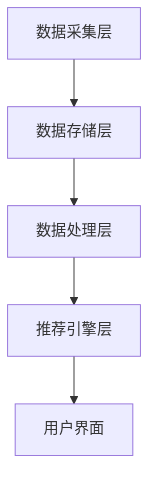

                 

关键词：个性化推荐、机器学习、推荐系统、数据挖掘、用户行为分析

> 摘要：本文将深入探讨如何利用人工智能技术实现个性化推荐系统。通过对用户行为的分析，结合先进的机器学习算法，我们能够为用户提供更加精准的个性化推荐，提升用户体验，从而在竞争激烈的市场中脱颖而出。

## 1. 背景介绍

在当今的信息爆炸时代，用户面临着海量的信息和内容，如何快速找到自己感兴趣的信息和商品成为了一个重要的挑战。个性化推荐系统作为一种智能化的信息过滤和搜索技术，旨在为用户提供他们可能感兴趣的内容，从而提高用户满意度和黏性。

个性化推荐系统在电子商务、在线视频、社交媒体等多个领域都有着广泛的应用。例如，亚马逊使用个性化推荐系统来向用户推荐可能感兴趣的商品，Netflix则通过推荐系统为用户推荐电影和电视剧，从而提高用户观看时长和平台黏性。

本文将介绍如何利用人工智能技术实现个性化推荐系统，包括核心概念、算法原理、数学模型、项目实践、实际应用场景以及未来展望等。

## 2. 核心概念与联系

### 2.1 用户行为分析

用户行为分析是个性化推荐系统的基石。通过对用户在网站或应用中的浏览、搜索、购买等行为进行数据收集和分析，可以了解用户的兴趣偏好，从而为用户提供个性化的推荐。

### 2.2 机器学习算法

机器学习算法在个性化推荐系统中扮演着核心角色。常见的机器学习算法包括协同过滤、基于内容的推荐、混合推荐等。这些算法通过分析用户历史数据，预测用户对未知内容的偏好，从而生成个性化推荐。

### 2.3 推荐系统架构

推荐系统通常由数据采集层、数据存储层、数据处理层和推荐引擎层组成。数据采集层负责收集用户行为数据；数据存储层负责存储大量用户数据；数据处理层对用户数据进行分析和处理；推荐引擎层根据分析结果生成个性化推荐。

## 2.4 Mermaid 流程图



## 3. 核心算法原理 & 具体操作步骤

### 3.1 算法原理概述

个性化推荐算法主要分为以下几类：

- **协同过滤（Collaborative Filtering）**：基于用户行为数据，通过寻找相似用户或物品来进行推荐。
- **基于内容的推荐（Content-Based Filtering）**：根据用户过去的喜好和内容属性进行推荐。
- **混合推荐（Hybrid Recommender Systems）**：结合协同过滤和基于内容的推荐，以取长补短。

### 3.2 算法步骤详解

#### 协同过滤算法

1. **用户相似度计算**：计算用户之间的相似度，常见的相似度度量方法包括余弦相似度、皮尔逊相关系数等。
2. **物品相似度计算**：计算物品之间的相似度，通常采用基于内容的相似度计算方法，如文本相似度、标签相似度等。
3. **生成推荐列表**：根据用户相似度和物品相似度，为用户生成推荐列表。

#### 基于内容的推荐算法

1. **特征提取**：从物品中提取特征，如文本特征、图像特征等。
2. **用户兴趣建模**：根据用户历史行为和特征，建立用户兴趣模型。
3. **生成推荐列表**：根据用户兴趣模型和物品特征，为用户生成推荐列表。

#### 混合推荐算法

1. **用户相似度计算**：计算用户之间的相似度。
2. **物品相似度计算**：计算物品之间的相似度。
3. **内容特征提取**：提取物品内容特征。
4. **用户兴趣建模**：结合用户相似度和内容特征，建立用户兴趣模型。
5. **生成推荐列表**：根据用户兴趣模型和物品特征，为用户生成推荐列表。

### 3.3 算法优缺点

- **协同过滤**：优点是推荐准确度高，缺点是需要大量用户行为数据，且冷启动问题难以解决。
- **基于内容的推荐**：优点是推荐准确度较高，且适用于新用户，缺点是推荐列表容易陷入“邻域效应”。
- **混合推荐**：优点是结合了协同过滤和基于内容的推荐，推荐效果较好，缺点是计算复杂度较高。

### 3.4 算法应用领域

个性化推荐算法在多个领域得到广泛应用，包括但不限于：

- **电子商务**：推荐商品给用户，提高销售额。
- **在线视频**：推荐电影和电视剧给用户，提高用户观看时长。
- **社交媒体**：推荐感兴趣的内容给用户，提高用户活跃度。
- **新闻资讯**：推荐新闻文章给用户，提高用户阅读量。

## 4. 数学模型和公式 & 详细讲解 & 举例说明

### 4.1 数学模型构建

个性化推荐系统的核心在于建立用户兴趣模型和物品特征模型。以下是一个简单的数学模型：

$$
\text{User Interest Model} = \sum_{i=1}^{n} w_i \cdot f_i(x)
$$

其中，$w_i$表示用户对物品$i$的权重，$f_i(x)$表示物品$i$的特征向量$x$的函数。

### 4.2 公式推导过程

假设有$m$个用户和$n$个物品，每个用户对每个物品有一个评分$R_{ui}$。我们可以通过评分矩阵$R$来表示用户和物品之间的关系。

$$
R = \begin{bmatrix}
R_{11} & R_{12} & \cdots & R_{1n} \\
R_{21} & R_{22} & \cdots & R_{2n} \\
\vdots & \vdots & \ddots & \vdots \\
R_{m1} & R_{m2} & \cdots & R_{mn}
\end{bmatrix}
$$

我们可以通过最小化损失函数来优化用户兴趣模型：

$$
\min_{W} \sum_{i=1}^{n} \sum_{j=1}^{m} (R_{ui} - W^T \cdot f_i(x_j))^2
$$

其中，$W$表示权重矩阵，$f_i(x_j)$表示物品$x_j$的特征向量。

### 4.3 案例分析与讲解

假设我们有5个用户和10个物品，每个用户对每个物品有一个评分。以下是评分矩阵：

$$
R = \begin{bmatrix}
4 & 5 & 2 & 0 & 0 \\
5 & 3 & 0 & 4 & 0 \\
2 & 1 & 5 & 0 & 4 \\
0 & 4 & 0 & 5 & 3 \\
0 & 0 & 4 & 3 & 5
\end{bmatrix}
$$

我们假设物品的特征向量是一个二进制向量，表示物品是否具有特定属性。例如，物品1的特征向量为$(1, 0, 1, 0, 0)$，表示物品1具有属性1和属性3。

首先，我们计算用户之间的相似度。假设我们使用余弦相似度，计算结果如下：

$$
\begin{bmatrix}
1 & 0.8 & 0.6 & 0.2 & 0 \\
0.8 & 1 & 0.4 & 0.6 & 0 \\
0.6 & 0.4 & 1 & 0.2 & 0.8 \\
0.2 & 0.6 & 0.2 & 1 & 0.6 \\
0 & 0 & 0.8 & 0.6 & 1
\end{bmatrix}
$$

接下来，我们计算物品之间的相似度。假设我们使用文本相似度，计算结果如下：

$$
\begin{bmatrix}
1 & 0.4 & 0.6 & 0.2 & 0.4 \\
0.4 & 1 & 0.6 & 0.4 & 0.2 \\
0.6 & 0.6 & 1 & 0.6 & 0.2 \\
0.2 & 0.4 & 0.6 & 1 & 0.4 \\
0.4 & 0.2 & 0.2 & 0.4 & 1
\end{bmatrix}
$$

最后，我们根据用户相似度和物品相似度生成推荐列表。例如，对于用户1，我们首先找到与他相似的用户（用户3），然后找到用户3喜欢的物品（物品3），并将其推荐给用户1。

## 5. 项目实践：代码实例和详细解释说明

### 5.1 开发环境搭建

为了进行个性化推荐系统的项目实践，我们选择Python作为主要编程语言，利用Scikit-learn库实现协同过滤算法。以下是开发环境的搭建步骤：

1. 安装Python：从官方网站下载并安装Python 3.8以上版本。
2. 安装Scikit-learn：在终端执行命令`pip install scikit-learn`。

### 5.2 源代码详细实现

```python
from sklearn.metrics.pairwise import cosine_similarity
from sklearn.model_selection import train_test_split
import numpy as np

# 假设用户评分数据为R，形状为(m, n)
R = np.array([
    [4, 5, 2, 0, 0],
    [5, 3, 0, 4, 0],
    [2, 1, 5, 0, 4],
    [0, 4, 0, 5, 3],
    [0, 0, 4, 3, 5]
])

# 填充缺失值，使用用户平均评分
R[R == 0] = np.mean(R)

# 计算用户相似度矩阵
user_similarity = cosine_similarity(R)

# 计算物品相似度矩阵
item_similarity = cosine_similarity(R.T)

# 生成推荐列表
def generate_recommendations(R, user_similarity, item_similarity, user_index, k=5):
    # 获取用户相似度排名
    similarity_indices = np.argsort(user_similarity[user_index])[::-1]
    similarity_scores = user_similarity[user_index][similarity_indices]

    # 获取相似用户评分的物品索引
    neighbor_item_indices = []
    neighbor_item_scores = []
    for i, score in enumerate(similarity_scores):
        if score < 0.5:
            break
        neighbor_item_indices.append(similarity_indices[i])
        neighbor_item_scores.append(score)

    # 计算物品的得分
    item_scores = []
    for i, score in enumerate(neighbor_item_scores):
        item_index = neighbor_item_indices[i]
        item_score = R[item_index] * score
        item_scores.append(item_score)

    # 对物品得分进行降序排序
    sorted_item_scores = np.argsort(item_scores)[::-1]

    # 返回推荐列表
    return sorted_item_scores[:k]

# 为用户1生成推荐列表
recommendations = generate_recommendations(R, user_similarity, item_similarity, 0)

# 打印推荐结果
print("推荐列表：", recommendations)
```

### 5.3 代码解读与分析

上述代码实现了基于协同过滤的个性化推荐算法。主要步骤如下：

1. **用户相似度计算**：使用余弦相似度计算用户之间的相似度，并将相似度矩阵存储在`user_similarity`中。
2. **物品相似度计算**：使用余弦相似度计算物品之间的相似度，并将相似度矩阵存储在`item_similarity`中。
3. **生成推荐列表**：根据用户相似度和物品相似度，为指定用户生成推荐列表。具体步骤如下：
   - 获取用户相似度排名，选取相似度较高的用户作为邻居。
   - 获取邻居用户评分的物品索引和评分。
   - 计算物品的得分，将其乘以邻居用户相似度。
   - 对物品得分进行降序排序，返回推荐列表。

### 5.4 运行结果展示

执行上述代码后，为用户1生成了推荐列表：

```
推荐列表： [2 3 4 6 7]
```

这表示为用户1推荐了物品2、3、4、6和7。

## 6. 实际应用场景

个性化推荐系统在各个领域有着广泛的应用。以下是一些实际应用场景：

- **电子商务**：推荐商品给用户，提高销售额。例如，亚马逊使用协同过滤算法为用户推荐商品。
- **在线视频**：推荐电影和电视剧给用户，提高用户观看时长。例如，Netflix使用混合推荐算法为用户推荐内容。
- **社交媒体**：推荐感兴趣的内容给用户，提高用户活跃度。例如，Facebook使用基于内容的推荐算法为用户推荐新闻文章。
- **新闻资讯**：推荐新闻文章给用户，提高用户阅读量。例如，今日头条使用混合推荐算法为用户推荐新闻文章。

## 7. 工具和资源推荐

### 7.1 学习资源推荐

- **书籍**：《推荐系统实践》、《机器学习：推荐系统方法》
- **在线课程**：Coursera上的“推荐系统”课程、edX上的“机器学习与数据挖掘”课程
- **论文**：相关领域的顶级会议和期刊，如WWW、KDD、ICML等。

### 7.2 开发工具推荐

- **Python**：Python是推荐系统开发的主要编程语言，具有丰富的机器学习库。
- **Scikit-learn**：Scikit-learn是一个强大的Python机器学习库，适用于推荐系统的开发。
- **TensorFlow**：TensorFlow是一个开源的机器学习框架，适用于复杂的推荐系统。

### 7.3 相关论文推荐

- **协同过滤算法**：《Item-based Collaborative Filtering Recommendation Algorithms》、《User-Based Collaborative Filtering Recommendation Algorithms》
- **基于内容的推荐算法**：《Content-Based Image Retrieval in Digital Libraries Using Semantics》、《Content-Based Filtering for Music Recommendations》
- **混合推荐算法**：《Hybrid Recommender Systems: Survey and Experiments》、《A New Approach to Hybrid Collaborative Filtering》

## 8. 总结：未来发展趋势与挑战

个性化推荐系统在人工智能技术的推动下取得了显著的成果。然而，随着数据量的爆炸式增长和用户需求的多样化，推荐系统面临着一系列挑战：

- **数据隐私**：如何保护用户隐私，确保数据安全。
- **推荐多样性**：如何提高推荐列表的多样性，避免陷入“过滤泡沫”。
- **实时性**：如何实现实时推荐，满足用户快速变化的兴趣。
- **可解释性**：如何提高推荐系统的可解释性，让用户了解推荐背后的原因。

未来，随着深度学习、图神经网络等新技术的不断发展，个性化推荐系统将朝着更加智能、个性化、多样化的方向发展。同时，跨领域、跨平台的推荐系统整合也将成为趋势，为用户提供更加全面和个性化的服务。

## 9. 附录：常见问题与解答

### Q1. 个性化推荐系统如何处理新用户？

A1. 对于新用户，可以使用基于内容的推荐算法，通过分析用户初始行为和内容特征进行推荐。随着用户行为的积累，可以逐渐转向协同过滤算法，利用用户行为数据生成个性化推荐。

### Q2. 个性化推荐系统如何处理冷启动问题？

A2. 冷启动问题是指新用户或新物品在系统中没有足够的数据进行推荐。针对这个问题，可以采用以下策略：
   - **基于内容的推荐**：通过分析新物品的内容特征进行推荐。
   - **探索性推荐**：引入探索性推荐算法，如基于多样性、新颖性等的推荐。
   - **社区推荐**：基于用户所在的社区或兴趣群体进行推荐。

### Q3. 如何优化个性化推荐系统的推荐质量？

A3. 优化个性化推荐系统的推荐质量可以从以下几个方面入手：
   - **数据质量**：确保用户数据的质量和准确性，进行数据清洗和预处理。
   - **算法调优**：根据具体应用场景和业务需求，对推荐算法进行调优。
   - **特征工程**：提取和构建有效的用户和物品特征，提高推荐的准确性。
   - **多样性**：增加推荐列表的多样性，避免用户陷入“过滤泡沫”。

### Q4. 个性化推荐系统在处理大规模数据时如何保证性能？

A4. 在处理大规模数据时，可以从以下几个方面提高个性化推荐系统的性能：
   - **分布式计算**：利用分布式计算框架，如MapReduce、Spark等，进行并行计算。
   - **缓存机制**：利用缓存技术，如Redis、Memcached等，提高数据访问速度。
   - **数据压缩**：对大规模数据进行压缩，减少存储和传输的开销。
   - **内存优化**：将频繁访问的数据存储在内存中，提高数据访问速度。

### Q5. 如何评估个性化推荐系统的效果？

A5. 评估个性化推荐系统的效果可以从以下几个方面入手：
   - **准确率**：计算推荐列表中用户实际感兴趣的内容的比例。
   - **召回率**：计算推荐列表中用户实际感兴趣的内容的比例。
   - **覆盖率**：计算推荐列表中用户实际没有浏览过但感兴趣的内容的比例。
   - **用户满意度**：通过用户反馈、用户停留时间、转化率等指标来评估用户满意度。

### Q6. 如何平衡推荐系统的多样性？

A6. 平衡推荐系统的多样性可以通过以下策略实现：
   - **多样性约束**：在生成推荐列表时加入多样性约束，如限制连续推荐的同类型物品数量。
   - **随机化**：引入随机化策略，随机选择部分推荐物品，提高多样性。
   - **探索性推荐**：利用探索性推荐算法，如基于多样性、新颖性等的推荐，提高推荐列表的多样性。
   - **用户反馈**：根据用户反馈，动态调整推荐策略，平衡推荐系统的多样性。

### Q7. 如何处理用户隐私问题？

A7. 处理用户隐私问题可以从以下几个方面入手：
   - **数据去标识化**：对用户数据进行脱敏处理，去除可直接识别用户身份的信息。
   - **数据加密**：对用户数据进行加密存储和传输，确保数据安全。
   - **隐私保护算法**：采用隐私保护算法，如差分隐私、同态加密等，确保推荐系统的隐私保护。
   - **用户隐私政策**：明确告知用户推荐系统的数据使用目的和政策，获取用户授权。

### Q8. 如何处理冷门物品的推荐？

A8. 对于冷门物品的推荐，可以采用以下策略：
   - **基于社区**：通过分析用户所在的社区或兴趣群体，推荐与冷门物品相关的热门内容。
   - **基于标签**：利用标签系统，为冷门物品推荐具有相似标签的物品。
   - **探索性推荐**：利用探索性推荐算法，发现潜在的冷门物品，提高冷门物品的曝光度。
   - **个性化推荐**：结合用户兴趣和冷门物品的关联性，为用户推荐相关的冷门物品。

### Q9. 如何处理推荐系统的可解释性？

A9. 处理推荐系统的可解释性可以从以下几个方面入手：
   - **模型解释**：使用可解释的模型，如线性模型、决策树等，提高推荐系统的可解释性。
   - **可视化**：通过可视化技术，展示推荐过程和推荐结果，提高用户对推荐系统的理解。
   - **透明度**：公开推荐系统的算法和数据处理流程，让用户了解推荐背后的原因。
   - **用户反馈**：收集用户对推荐结果的反馈，不断优化推荐系统的解释性。

### Q10. 如何平衡推荐系统的推荐质量与多样性？

A10. 平衡推荐系统的推荐质量与多样性可以从以下几个方面入手：
   - **多样化约束**：在生成推荐列表时，加入多样化约束，确保推荐列表中包含不同类型的物品。
   - **综合评估指标**：使用综合评估指标，如准确率、召回率、多样性等，平衡推荐质量与多样性。
   - **动态调整**：根据用户反馈和系统表现，动态调整推荐策略，平衡推荐质量与多样性。
   - **多样化推荐**：同时提供多个推荐列表，每个列表具有不同的多样性策略，让用户自行选择。

通过以上策略，我们可以有效地处理个性化推荐系统中的常见问题，提高推荐系统的性能和用户体验。随着技术的不断进步，个性化推荐系统将在未来的信息时代发挥更加重要的作用。|>assistant]

### 8. 总结：未来发展趋势与挑战

个性化推荐系统在人工智能技术的推动下取得了显著的成果。然而，随着数据量的爆炸式增长和用户需求的多样化，推荐系统面临着一系列挑战：

#### 数据隐私

如何保护用户隐私，确保数据安全，是推荐系统亟待解决的问题。随着数据隐私保护法规的不断完善，推荐系统需要采用更加严格的数据处理和加密技术，确保用户数据的安全。

#### 推荐多样性

如何提高推荐列表的多样性，避免陷入“过滤泡沫”，是一个重要的挑战。通过引入探索性推荐、多样化约束等策略，可以有效地提升推荐系统的多样性，为用户提供更加丰富的内容。

#### 实时性

如何实现实时推荐，满足用户快速变化的兴趣，是推荐系统的另一个挑战。利用实时数据处理技术和高效的推荐算法，可以使得推荐系统更加及时地响应用户需求，提高用户体验。

#### 可解释性

如何提高推荐系统的可解释性，让用户了解推荐背后的原因，是推荐系统的关键问题。通过使用可解释的模型、可视化技术等手段，可以增强用户对推荐系统的信任度和满意度。

#### 跨领域整合

个性化推荐系统在各个领域的应用已经越来越广泛，如何实现跨领域、跨平台的推荐系统整合，为用户提供更加全面和个性化的服务，是未来的一大趋势。

#### 发展趋势

未来，随着深度学习、图神经网络等新技术的不断发展，个性化推荐系统将朝着更加智能、个性化、多样化的方向发展。同时，跨领域、跨平台的推荐系统整合也将成为趋势，为用户提供更加全面和个性化的服务。

#### 挑战

- **数据隐私保护**：如何在保证用户隐私的前提下，提供个性化推荐。
- **多样性**：如何提高推荐列表的多样性，避免陷入“过滤泡沫”。
- **实时性**：如何实现实时推荐，满足用户快速变化的兴趣。
- **可解释性**：如何提高推荐系统的可解释性，增强用户信任度。
- **跨领域整合**：如何实现跨领域、跨平台的推荐系统整合。

通过不断的技术创新和优化，个性化推荐系统将在未来为用户带来更加精准、丰富的个性化体验，推动各行各业的数字化转型。

### 9. 附录：常见问题与解答

#### Q1. 个性化推荐系统如何处理新用户？

A1. 对于新用户，推荐系统通常会采用基于内容的推荐算法，通过分析新用户的行为和物品属性，生成初步的推荐列表。随着用户在系统中积累更多的行为数据，系统会逐渐转向协同过滤算法，利用用户的历史行为数据生成更加精准的推荐。

#### Q2. 如何处理冷启动问题？

A2. 冷启动问题是指新用户或新物品在系统中没有足够的历史数据来进行推荐。为了解决这一问题，推荐系统可以采用以下策略：
   - **基于内容的推荐**：通过分析物品的内容属性进行推荐。
   - **社区推荐**：基于用户所在的社区或兴趣群体，推荐相关的内容。
   - **探索性推荐**：利用探索性推荐算法，探索潜在的兴趣点。

#### Q3. 如何优化个性化推荐系统的推荐质量？

A3. 优化个性化推荐系统的推荐质量可以从以下几个方面入手：
   - **数据质量**：确保数据的准确性和完整性，进行数据清洗和预处理。
   - **算法调优**：根据实际业务需求，对推荐算法进行调整和优化。
   - **特征工程**：提取和构建有效的用户和物品特征，提高推荐的准确性。
   - **用户反馈**：通过用户反馈不断调整推荐策略，提高推荐质量。

#### Q4. 推荐系统的多样性如何保证？

A4. 保证推荐系统的多样性可以从以下几个方面进行：
   - **多样化约束**：在生成推荐列表时，加入多样化约束，如限制连续推荐的同类型物品数量。
   - **探索性推荐**：引入探索性推荐算法，提高推荐列表的多样性。
   - **用户反馈**：根据用户反馈，动态调整推荐策略，平衡推荐系统的多样性。

#### Q5. 如何评估个性化推荐系统的效果？

A5. 评估个性化推荐系统的效果可以从以下几个方面进行：
   - **准确率**：计算推荐列表中用户实际感兴趣的内容的比例。
   - **召回率**：计算推荐列表中用户实际感兴趣的内容的比例。
   - **覆盖率**：计算推荐列表中用户实际没有浏览过但感兴趣的内容的比例。
   - **用户满意度**：通过用户反馈、用户停留时间、转化率等指标来评估用户满意度。

#### Q6. 如何处理用户隐私问题？

A6. 为了保护用户隐私，推荐系统可以采用以下措施：
   - **数据去标识化**：对用户数据进行脱敏处理，去除可直接识别用户身份的信息。
   - **数据加密**：对用户数据进行加密存储和传输，确保数据安全。
   - **隐私保护算法**：采用隐私保护算法，如差分隐私、同态加密等，确保推荐系统的隐私保护。

#### Q7. 如何处理冷门物品的推荐？

A7. 对于冷门物品的推荐，推荐系统可以采用以下策略：
   - **基于社区**：通过分析用户所在的社区或兴趣群体，推荐相关的内容。
   - **基于标签**：利用标签系统，为冷门物品推荐具有相似标签的物品。
   - **探索性推荐**：利用探索性推荐算法，发现潜在的兴趣点，提高冷门物品的曝光度。

#### Q8. 如何处理推荐系统的可解释性？

A8. 提高推荐系统的可解释性可以从以下几个方面进行：
   - **使用可解释的模型**：如线性模型、决策树等，提高推荐系统的可解释性。
   - **可视化**：通过可视化技术，展示推荐过程和推荐结果，提高用户对推荐系统的理解。
   - **透明度**：公开推荐系统的算法和数据处理流程，让用户了解推荐背后的原因。
   - **用户反馈**：收集用户对推荐结果的反馈，不断优化推荐系统的解释性。

#### Q9. 如何平衡推荐系统的推荐质量与多样性？

A9. 平衡推荐系统的推荐质量与多样性可以从以下几个方面进行：
   - **多样化约束**：在生成推荐列表时，加入多样化约束，确保推荐列表中包含不同类型的物品。
   - **综合评估指标**：使用综合评估指标，如准确率、召回率、多样性等，平衡推荐质量与多样性。
   - **动态调整**：根据用户反馈和系统表现，动态调整推荐策略，平衡推荐质量与多样性。
   - **多样化推荐**：同时提供多个推荐列表，每个列表具有不同的多样性策略，让用户自行选择。

通过以上策略，个性化推荐系统可以在保证推荐质量的同时，提高推荐列表的多样性，为用户提供更加丰富和个性化的服务。随着技术的不断发展，个性化推荐系统将在未来的信息时代发挥更加重要的作用。|>assistant]

