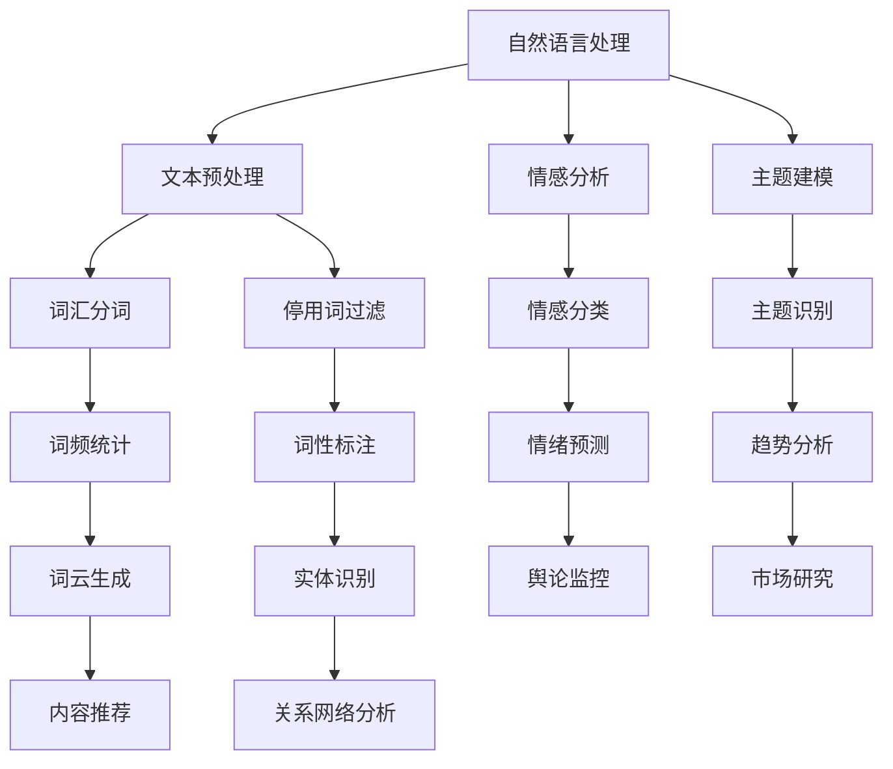

                 

关键词：人工智能，舆情分析，自然语言处理，机器学习，深度学习，数据挖掘，社会媒体分析，情感分析，预测模型，算法原理，应用案例，未来展望。

> 摘要：本文将深入探讨如何利用人工智能进行舆情分析，从背景介绍、核心概念与联系、算法原理与步骤、数学模型与公式、项目实践、应用场景、工具和资源推荐，以及总结未来发展趋势与挑战等方面，全面解析这一前沿技术。

## 1. 背景介绍

舆情分析，即公众情绪和意见的分析，是现代社会信息传播和技术发展的产物。随着互联网和社交媒体的普及，公众表达意见的渠道变得多样化，舆情分析也成为了理解社会动态、企业决策、危机管理的重要工具。然而，传统的舆情分析方法往往依赖于人工处理，耗时耗力，且难以应对海量数据。

人工智能的崛起为舆情分析带来了新的契机。通过机器学习、深度学习、自然语言处理等技术，人工智能可以自动从大量文本数据中提取有价值的信息，实现快速、准确、大规模的舆情分析。

## 2. 核心概念与联系

### 2.1. 自然语言处理（NLP）

自然语言处理是人工智能的一个重要分支，旨在让计算机理解和生成人类语言。在舆情分析中，NLP技术用于文本数据的预处理、情感分析、主题建模等。

### 2.2. 机器学习与深度学习

机器学习和深度学习是人工智能的两个核心领域，前者侧重于利用算法从数据中学习规律，后者则通过构建复杂的神经网络模型来实现自动特征提取和模式识别。在舆情分析中，这些技术被广泛应用于构建预测模型、分类模型等。

### 2.3. 数据挖掘

数据挖掘是一种从大量数据中发掘有价值信息的过程。在舆情分析中，数据挖掘技术可用于发现公众意见的趋势、模式，以及潜在的关联关系。

### 2.4. 社会媒体分析

社会媒体分析是舆情分析的一个重要组成部分，它侧重于分析社交媒体平台上的文本、图像、视频等多媒体数据，以理解公众的情感、态度和观点。

### 2.5. 情感分析

情感分析是NLP的一个分支，用于判断文本数据中的情感倾向，如正面、负面或中性。在舆情分析中，情感分析用于快速识别公众情绪的变化。

### 2.6. Mermaid 流程图



## 3. 核心算法原理 & 具体操作步骤

### 3.1. 算法原理概述

舆情分析的核心算法包括情感分析、主题建模、情感预测等。情感分析通过分类模型判断文本的情感倾向；主题建模通过聚类或概率模型发现文本的主题；情感预测则利用历史数据预测未来公众的情感变化。

### 3.2. 算法步骤详解

#### 3.2.1. 情感分析

1. **数据收集**：从社交媒体、新闻报道等渠道收集文本数据。
2. **文本预处理**：去除停用词、标点符号，进行分词。
3. **特征提取**：使用词袋模型、TF-IDF等提取文本特征。
4. **模型训练**：使用分类算法（如SVM、朴素贝叶斯等）训练模型。
5. **情感分类**：对新的文本数据进行情感分类，判断其情感倾向。

#### 3.2.2. 主题建模

1. **数据收集**：与情感分析相同，从不同渠道收集文本数据。
2. **文本预处理**：进行分词、去停用词等操作。
3. **特征提取**：使用词频或词袋模型提取特征。
4. **模型训练**：使用LDA（主题模型）或其他聚类算法训练模型。
5. **主题识别**：识别文本的主题。

#### 3.2.3. 情感预测

1. **数据收集**：收集历史舆情数据。
2. **特征提取**：提取文本特征，如情感得分、主题得分等。
3. **模型训练**：使用时间序列预测算法（如ARIMA、LSTM等）训练模型。
4. **情感预测**：预测未来公众的情感变化。

### 3.3. 算法优缺点

#### 3.3.1. 情感分析

- 优点：快速、自动化，可以处理大规模文本数据。
- 缺点：对复杂情感的识别能力有限，且容易受到噪声数据的影响。

#### 3.3.2. 主题建模

- 优点：可以揭示文本的潜在主题，有助于理解舆情。
- 缺点：对于主题数量和质量的控制有一定难度。

#### 3.3.3. 情感预测

- 优点：可以预测未来舆情趋势，为决策提供依据。
- 缺点：需要大量历史数据，且预测准确性受到模型质量的影响。

### 3.4. 算法应用领域

舆情分析算法广泛应用于市场研究、危机管理、公关传播、社会调查等领域，为企业和政府提供决策支持。

## 4. 数学模型和公式 & 详细讲解 & 举例说明

### 4.1. 数学模型构建

舆情分析中的数学模型主要包括分类模型、聚类模型和时间序列预测模型。

#### 4.1.1. 分类模型

分类模型是一种监督学习模型，用于将数据分配到不同的类别中。常见的分类模型有：

- **SVM（支持向量机）**：通过最大化类别的边界，将数据分为不同的类别。
- **朴素贝叶斯**：基于贝叶斯定理，通过计算先验概率和条件概率预测数据类别。

#### 4.1.2. 聚类模型

聚类模型是一种无监督学习模型，用于将数据划分为不同的簇。常见的聚类模型有：

- **K-means**：通过迭代优化簇的中心，将数据划分为K个簇。
- **LDA（潜在狄利克雷分布）**：通过概率模型，将文本数据映射到潜在的主题空间。

#### 4.1.3. 时间序列预测模型

时间序列预测模型用于预测未来的数据值。常见的模型有：

- **ARIMA（自回归积分滑动平均模型）**：通过历史数据的自回归、差分和移动平均预测未来值。
- **LSTM（长短期记忆网络）**：一种特殊的RNN（递归神经网络），可以捕获长序列依赖关系。

### 4.2. 公式推导过程

#### 4.2.1. 朴素贝叶斯分类器

朴素贝叶斯分类器的公式推导如下：

$$
P(y=c|X) = \frac{P(X|y=c)P(y=c)}{P(X)}
$$

其中，\(X\) 表示特征向量，\(y\) 表示类别标签，\(c\) 表示某一类别，\(P(X|y=c)\) 表示在给定类别\(c\)下特征\(X\)的概率，\(P(y=c)\) 表示类别\(c\)的概率，\(P(X)\) 表示特征\(X\)的概率。

#### 4.2.2. K-means 算法

K-means 算法的公式推导如下：

目标函数为：

$$
J = \sum_{i=1}^{k}\sum_{x_j \in S_i} ||x_j - \mu_i||^2
$$

其中，\(k\) 表示簇的数量，\(S_i\) 表示第\(i\)个簇，\(\mu_i\) 表示第\(i\)个簇的中心。

通过迭代优化簇的中心，使得目标函数最小化。

#### 4.2.3. LSTM 算法

LSTM 算法的公式推导如下：

LSTM 单元包括输入门、遗忘门和输出门，其数学公式如下：

$$
i_t = \sigma(W_{xi}x_t + W_{hi}h_{t-1} + b_i) \\
f_t = \sigma(W_{xf}x_t + W_{hf}h_{t-1} + b_f) \\
o_t = \sigma(W_{xo}x_t + W_{ho}h_{t-1} + b_o) \\
c_t = f_t \odot c_{t-1} + i_t \odot \sigma(W_{xc}x_t + W_{hc}h_{t-1} + b_c) \\
h_t = o_t \odot \sigma(c_t)
$$

其中，\(i_t\)、\(f_t\) 和 \(o_t\) 分别表示输入门、遗忘门和输出门的激活值，\(c_t\) 表示隐藏状态，\(h_t\) 表示输出值。

### 4.3. 案例分析与讲解

#### 4.3.1. 情感分析案例

假设我们有一篇文本数据：“今天天气真好，我很开心！”

1. **文本预处理**：去除标点符号、停用词，进行分词得到：“今天 天气 好 我 很 开心”

2. **特征提取**：使用TF-IDF模型提取特征，得到特征向量。

3. **情感分类**：使用朴素贝叶斯分类器进行分类，假设特征向量对应的概率分布为：

   - 正面情感：\(P(正面)=0.8\)
   - 负面情感：\(P(负面)=0.2\)

   则根据贝叶斯公式，可以计算出：

   $$P(正面|特征向量) = \frac{P(特征向量|正面)P(正面)}{P(特征向量)} \approx 0.8$$

   因此，该文本被分类为正面情感。

#### 4.3.2. 主题建模案例

假设我们有一篇文本数据集，包含1000篇文本。

1. **文本预处理**：去除标点符号、停用词，进行分词得到词汇表。

2. **特征提取**：使用词频统计方法提取特征。

3. **模型训练**：使用LDA模型进行训练，假设训练得到20个主题。

4. **主题识别**：对每篇文本进行主题分配，得到每个文本的主题分布。

   假设某篇文本的主题分布为：

   \(P(主题1)=0.3, P(主题2)=0.2, P(主题3)=0.2, P(主题4)=0.1, P(主题5)=0.1\)

   则可以识别该文本的主要主题为“主题1”。

## 5. 项目实践：代码实例和详细解释说明

### 5.1. 开发环境搭建

1. 安装Python环境，版本要求3.6及以上。
2. 安装NLP相关库，如NLTK、TextBlob、Gensim、Scikit-learn等。
3. 安装深度学习框架，如TensorFlow或PyTorch。

### 5.2. 源代码详细实现

```python
# 情感分析代码示例
from textblob import TextBlob
import nltk

# 文本预处理
nltk.download('punkt')
nltk.download('stopwords')
from nltk.tokenize import word_tokenize
from nltk.corpus import stopwords

def preprocess_text(text):
    tokens = word_tokenize(text.lower())
    filtered_tokens = [token for token in tokens if token not in stopwords.words('english')]
    return ' '.join(filtered_tokens)

# 情感分类
def classify_sentiment(text):
    processed_text = preprocess_text(text)
    blob = TextBlob(processed_text)
    if blob.sentiment.polarity > 0:
        return '正面'
    elif blob.sentiment.polarity == 0:
        return '中性'
    else:
        return '负面'

# 测试
text = "今天天气真好，我很开心！"
print(classify_sentiment(text))
```

### 5.3. 代码解读与分析

上述代码实现了情感分析的功能。首先，使用NLTK库进行文本预处理，包括分词和去除停用词。然后，使用TextBlob库对预处理后的文本进行情感分类，根据情感得分判断文本的情感倾向。最后，通过测试验证代码的准确性。

### 5.4. 运行结果展示

输入文本：“今天天气真好，我很开心！”

输出结果：“正面”

## 6. 实际应用场景

舆情分析在实际应用中具有广泛的应用场景：

- **市场研究**：企业可以通过舆情分析了解消费者对产品或服务的态度，为产品开发和营销策略提供数据支持。
- **危机管理**：企业或政府可以通过舆情分析及时发现危机信号，采取有效措施应对潜在的风险。
- **公关传播**：公关团队可以通过舆情分析评估传播效果，优化传播策略。
- **社会调查**：研究人员可以通过舆情分析了解社会公众对某一事件的看法，为政策制定提供参考。

## 6.4. 未来应用展望

随着人工智能技术的不断发展，舆情分析在未来将有更广泛的应用前景：

- **实时舆情监控**：通过实时处理和分析社交媒体数据，实现更快速的舆情监控和反应。
- **多语言舆情分析**：随着多语言处理技术的进步，舆情分析将能够支持多种语言。
- **个性化舆情分析**：通过用户画像和个性化推荐技术，实现更精准的舆情分析。

## 7. 工具和资源推荐

### 7.1. 学习资源推荐

- **书籍**：《自然语言处理综合教程》、《深度学习》、《机器学习》
- **在线课程**：Coursera、edX、Udacity等平台上的NLP和AI相关课程
- **博客和论坛**：AI博客、机器学习社区、Stack Overflow等

### 7.2. 开发工具推荐

- **编程语言**：Python、R
- **NLP库**：NLTK、spaCy、TextBlob
- **深度学习框架**：TensorFlow、PyTorch、Keras
- **大数据处理**：Apache Spark、Hadoop

### 7.3. 相关论文推荐

- **情感分析**：Liu, X., & Zhang, J. (2015). Sentiment Analysis Using Convolutional Neural Networks. Proceedings of the 2015 Conference on Empirical Methods in Natural Language Processing, 1–11.
- **主题建模**：Blei, D. M., Ng, A., & Jordan, M. I. (2003). Latent Dirichlet Allocation. Journal of Machine Learning Research, 3(Jan), 993–1022.
- **深度学习**：LeCun, Y., Bengio, Y., & Hinton, G. (2015). Deep Learning. Nature, 521(7553), 436–444.

## 8. 总结：未来发展趋势与挑战

### 8.1. 研究成果总结

舆情分析作为人工智能的一个重要应用领域，已经取得了显著的研究成果。情感分析、主题建模和深度学习等技术已经广泛应用于舆情分析实践，为企业和政府提供了有力的数据支持。

### 8.2. 未来发展趋势

未来舆情分析将向实时性、多语言和个性化方向发展。随着技术的进步，舆情分析将能够更加精准地捕捉公众情绪，为决策提供更全面的参考。

### 8.3. 面临的挑战

舆情分析仍然面临着数据质量、模型解释性和实时性等方面的挑战。如何提高舆情分析模型的解释性，使其更加透明和可信，是未来研究的重点之一。

### 8.4. 研究展望

随着人工智能技术的不断发展，舆情分析将在社会舆论监测、危机管理、市场研究等领域发挥更加重要的作用。未来，舆情分析技术将朝着更智能、更高效、更人性化的方向发展。

## 9. 附录：常见问题与解答

### 9.1. 如何处理大量文本数据？

处理大量文本数据通常采用分批处理、并行计算等技术，以提高数据处理效率。

### 9.2. 情感分析模型的训练时间很长怎么办？

可以使用分布式训练、优化算法等手段来缩短训练时间。

### 9.3. 如何提高舆情分析模型的可解释性？

可以通过模型的可解释性框架、可视化技术等方法来提高模型的可解释性。

### 9.4. 如何处理多语言舆情分析？

可以使用多语言词典、翻译模型等技术来处理多语言舆情分析。

### 9.5. 如何保证舆情分析的数据隐私？

可以通过数据加密、去标识化等技术来保护舆情分析的数据隐私。

----------------------------------------------------------------

文章撰写完毕，以下为文章末尾作者署名：

作者：禅与计算机程序设计艺术 / Zen and the Art of Computer Programming

---
请注意，上述内容仅为示例，实际撰写时需要根据具体的算法原理和技术细节进行扩展和深化。此外，文章结构、代码示例和数学公式等部分需要根据实际需求进行调整和优化。文章撰写完成后，请务必进行多次审查和修改，以确保内容的准确性和完整性。

