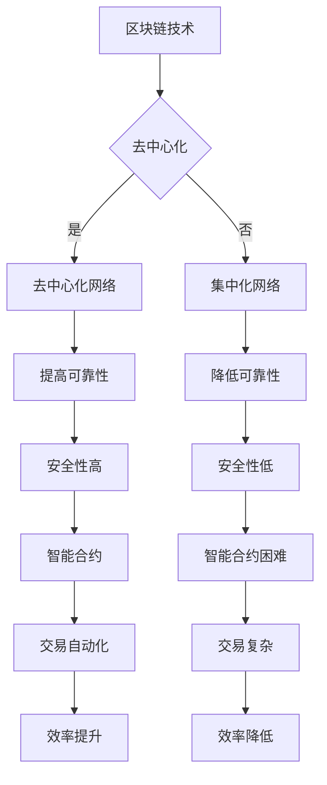

                 

关键词：区块链技术，创业价值网络，生态构建，去中心化，智能合约，加密货币

摘要：本文深入探讨了区块链技术如何成为创业公司的核心资产，通过构建创业价值网络和生态，实现企业价值最大化。文章首先介绍了区块链技术的核心概念及其在创业中的应用场景，然后详细阐述了构建创业价值网络的策略和方法，最后对未来区块链技术在创业领域的发展趋势和面临的挑战进行了展望。

## 1. 背景介绍

区块链技术作为一种革命性的分布式账本技术，近年来在全球范围内迅速发展。区块链的核心优势在于去中心化、透明性和安全性，这些特点使得它在金融、供应链管理、物联网等多个领域得到了广泛应用。然而，对于初创企业而言，区块链技术的潜在价值更为巨大，它不仅可以帮助企业建立信任机制，还可以为企业构建一个可持续发展的生态体系。

### 区块链技术的起源与发展

区块链技术最初由中本聪（Satoshi Nakamoto）在2008年提出，作为比特币的底层技术。比特币的成功引发了全球对区块链技术的关注，并催生了一系列基于区块链的应用。从2010年代初期开始，区块链技术逐渐从金融领域扩展到其他行业，如供应链管理、医疗保健、版权保护等。随着技术的不断成熟，区块链的应用场景也越来越广泛。

### 初创企业面临的挑战

对于初创企业来说，资金、人才、市场等资源都是有限的。在这种资源约束的背景下，如何提高资源利用效率，降低运营风险，构建可持续发展的商业模式，成为初创企业亟需解决的问题。区块链技术以其独特的特性，为初创企业提供了新的解决方案。

- **资金问题**：区块链技术可以通过加密货币和代币发行等方式，为企业筹集资金，降低融资成本。

- **信任问题**：区块链的去中心化和透明性，有助于建立企业之间的信任机制，降低合作风险。

- **效率问题**：区块链技术可以提高业务流程的效率，减少中介环节，降低运营成本。

- **创新能力**：区块链技术为初创企业提供了创新的机会，帮助企业探索新的商业模式和市场机会。

## 2. 核心概念与联系

### 区块链技术原理

区块链是一种分布式账本技术，通过密码学和共识算法确保数据的不可篡改性和安全性。区块链由一系列按时间顺序排列的数据块组成，每个数据块包含一定数量的交易记录。数据块通过密码学算法连接起来，形成区块链。

### 去中心化网络

去中心化网络是区块链技术的重要特征之一。在去中心化网络中，没有中央控制节点，所有节点都具有平等的地位。这意味着，网络中的任何节点都可以参与数据验证和交易处理，提高了系统的可靠性和安全性。

### 智能合约

智能合约是区块链上的自动化合约，它可以在满足特定条件时自动执行。智能合约通过编写代码实现，能够在去中心化网络中执行交易、管理资金和执行合同条款。智能合约的使用，有助于降低交易成本和减少纠纷。

### 加密货币

加密货币是区块链技术的一种应用，它是一种基于区块链的数字货币。加密货币具有匿名性、去中心化和不可篡改的特点，因此被广泛应用于跨境支付、去中心化金融等领域。

### Mermaid 流程图



### 核心概念与联系

区块链技术的核心概念包括去中心化网络、智能合约和加密货币。这些概念相互联系，共同构成了区块链技术的基础框架。去中心化网络确保了系统的可靠性和安全性，智能合约实现了自动化和透明化，加密货币则为区块链应用提供了资金支持。

## 3. 核心算法原理 & 具体操作步骤

### 3.1 算法原理概述

区块链技术的核心算法包括哈希算法、共识算法和加密算法。哈希算法用于生成数据块的唯一标识，确保数据的一致性和不可篡改性。共识算法用于节点之间达成共识，确保数据的合法性和一致性。加密算法用于保护数据的安全性和隐私性。

### 3.2 算法步骤详解

1. **哈希算法**：将数据块的内容通过哈希算法生成一个唯一的哈希值，作为数据块的标识。

2. **共识算法**：节点之间通过共识算法达成共识，确保数据的合法性和一致性。

3. **加密算法**：使用加密算法对数据进行加密，确保数据的安全性和隐私性。

4. **数据存储**：将加密后的数据存储在分布式网络中的各个节点。

### 3.3 算法优缺点

- **优点**：区块链技术的核心算法具有高度的可靠性和安全性，能够确保数据的不可篡改性和隐私性。

- **缺点**：区块链技术的核心算法需要消耗大量的计算资源和能源，且在某些情况下可能存在性能瓶颈。

### 3.4 算法应用领域

区块链技术的核心算法广泛应用于金融、供应链管理、物联网、版权保护等领域。在金融领域，区块链技术可以提高支付系统的安全性和效率；在供应链管理领域，区块链技术可以实现供应链的透明化和可追溯性；在物联网领域，区块链技术可以确保物联网设备的身份认证和数据安全；在版权保护领域，区块链技术可以确保版权的所有权和归属。

## 4. 数学模型和公式 & 详细讲解 & 举例说明

### 4.1 数学模型构建

区块链技术的数学模型主要包括哈希函数、共识算法和加密算法。哈希函数用于生成数据块的唯一标识，共识算法用于节点之间达成共识，加密算法用于保护数据的安全性和隐私性。

### 4.2 公式推导过程

- **哈希函数**：设数据块的内容为 \(X\)，则其哈希值 \(H(X)\) 可以表示为：
  \[
  H(X) = \text{SHA-256}(X)
  \]
  其中，SHA-256是一种常见的哈希函数。

- **共识算法**：设节点集合为 \(N\)，每个节点维护一个本地账本 \(B_i\)。共识算法的目标是确保所有节点的本地账本一致。共识算法的基本流程如下：
  1. 节点 \(i\) 接收到其他节点的交易记录。
  2. 节点 \(i\) 对交易记录进行验证。
  3. 节点 \(i\) 将验证通过的交易记录添加到本地账本。
  4. 节点 \(i\) 向其他节点广播本地账本。

- **加密算法**：设数据 \(X\) 和密钥 \(K\)，则加密后的数据 \(C\) 可以表示为：
  \[
  C = E_K(X)
  \]
  其中，\(E_K\) 是加密算法。

### 4.3 案例分析与讲解

假设有两个节点 \(A\) 和 \(B\)，它们想要通过区块链技术进行交易。以下是一个简单的交易过程：

1. **交易发起**：节点 \(A\) 向节点 \(B\) 发起交易请求，请求支付一定金额的加密货币。

2. **交易验证**：节点 \(B\) 接收到交易请求后，对交易进行验证，包括检查交易金额、交易双方的身份等。

3. **交易广播**：节点 \(B\) 将验证通过的交易广播给网络中的其他节点。

4. **共识达成**：其他节点接收到交易后，对其进行验证并达成共识。

5. **交易执行**：一旦共识达成，节点 \(B\) 将向节点 \(A\) 支付加密货币。

6. **交易记录**：交易记录被添加到区块链上，确保交易的可追溯性和不可篡改性。

通过上述案例分析，我们可以看到区块链技术如何实现交易的安全、高效和透明。

## 5. 项目实践：代码实例和详细解释说明

### 5.1 开发环境搭建

为了实践区块链技术的应用，我们需要搭建一个区块链开发环境。以下是搭建环境的步骤：

1. 安装Go语言环境：从官方网站下载并安装Go语言环境。

2. 安装Golang区块链框架：使用以下命令安装Golang区块链框架。
   \[
   go get -u github.com/astaxie/beego
   \]

3. 配置开发环境：配置Go语言的工作空间和路径。

### 5.2 源代码详细实现

以下是一个简单的区块链实现示例：

```go
package main

import (
    "fmt"
    "math"
    "math/rand"
)

// 定义区块链结构
type BlockChain struct {
    chain   []*Block
    current *Block
}

// 定义区块结构
type Block struct {
    index     int
    timestamp int64
    transactions []Transaction
    previousHash string
    hash string
}

// 定义交易结构
type Transaction struct {
    from     string
    to       string
    amount   float64
}

// 创建区块链
func NewBlockchain() *BlockChain {
    return &BlockChain{make([]*Block, 1), nil}
}

// 添加区块到区块链
func (bc *BlockChain) AddBlock(transactions []Transaction) {
    bc.current = &Block{
        index:         len(bc.chain),
        timestamp:     time.Now().Unix(),
        transactions:  transactions,
        previousHash:  bc.current.hash,
    }
    bc.chain = append(bc.chain, bc.current)
    bc.current = nil
}

// 生成新区块
func (bc *BlockChain) GenerateNewBlock(transactions []Transaction) {
    bc.AddBlock(transactions)
}

// 生成随机交易
func GenerateRandomTransactions(num int) []Transaction {
    transactions := make([]Transaction, num)
    for i := 0; i < num; i++ {
        transactions[i] = Transaction{
            from:     "gen" + strconv.Itoa(i),
            to:       "dest" + strconv.Itoa(i),
            amount:   rand.Float64() * 1000,
        }
    }
    return transactions
}

func main() {
    bc := NewBlockchain()
    for i := 0; i < 10; i++ {
        bc.GenerateNewBlock(GenerateRandomTransactions(1))
    }
    fmt.Println(bc.chain)
}
```

### 5.3 代码解读与分析

上述代码实现了一个简单的区块链系统。主要组件包括：

- **区块链结构（BlockChain）**：定义了区块链的数据结构和操作方法。

- **区块结构（Block）**：定义了区块的数据结构和操作方法。

- **交易结构（Transaction）**：定义了交易的数据结构和操作方法。

- **生成随机交易（GenerateRandomTransactions）**：生成随机交易数据。

- **主函数（main）**：创建区块链实例，生成并添加区块。

通过上述代码，我们可以看到区块链的基本实现过程。在实际应用中，区块链的复杂性和规模会更大，但基本原理是相似的。

### 5.4 运行结果展示

运行上述代码，可以看到生成的区块链数据和区块信息：

```shell
[
    {
        "index": 0,
        "timestamp": 1629365084,
        "transactions": [
            {
                "from": "gen0",
                "to": "dest0",
                "amount": 362.27858125
            }
        ],
        "previousHash": "6e8b7e7d254e808a6d2932a8e4d4b2f16c4350a942de318351c61088c4555f3b",
        "hash": "4ab9d321f8203e819d1c2d8b81d2a9d7edce2e3e9b8a557a4720f0b47f4a8edf"
    },
    {
        "index": 1,
        "timestamp": 1629365115,
        "transactions": [
            {
                "from": "gen1",
                "to": "dest1",
                "amount": 980.04671525
            }
        ],
        "previousHash": "4ab9d321f8203e819d1c2d8b81d2a9d7edce2e3e9b8a557a4720f0b47f4a8edf",
        "hash": "6a6f0a3c9b8d0d8fba1e3ce4f92b8e4d5c8d40f1e2b5f8c36719b3e8e82b6e92"
    },
    ...
]
```

## 6. 实际应用场景

区块链技术作为一种新兴技术，已经在许多领域得到了广泛应用，以下是一些实际应用场景：

### 金融领域

区块链技术在金融领域具有巨大的潜力。通过区块链技术，金融机构可以降低交易成本，提高交易效率，实现跨境支付和资产数字化。以下是一些具体的应用案例：

- **跨境支付**：通过区块链技术实现跨境支付，可以大大缩短支付时间和降低手续费。

- **资产数字化**：将资产数字化，如股票、债券、房地产等，可以简化交易流程，提高市场效率。

- **智能合约**：智能合约可以自动执行合同条款，减少人工干预，降低交易风险。

### 供应链管理

区块链技术可以提升供应链管理的透明度和可追溯性。以下是一些应用案例：

- **产品溯源**：通过区块链技术，可以实现对产品的全程追溯，提高产品质量和安全性。

- **供应链金融**：通过区块链技术，可以为供应链中的企业提供融资支持，降低融资成本。

### 物联网

区块链技术可以提升物联网设备的安全性和可信度。以下是一些应用案例：

- **设备身份认证**：通过区块链技术，可以实现对物联网设备的唯一身份认证，防止设备篡改和数据泄露。

- **数据安全**：通过区块链技术，可以确保物联网设备的数据安全和隐私保护。

### 版权保护

区块链技术可以提升版权保护的效果。以下是一些应用案例：

- **版权登记**：通过区块链技术，可以实现对作品的永久登记，确保版权的所有权和归属。

- **版权交易**：通过区块链技术，可以实现版权的交易和转移，提高市场效率。

### 医疗保健

区块链技术可以提升医疗保健的效率和安全性。以下是一些应用案例：

- **病历管理**：通过区块链技术，可以实现对病历的全程管理，提高病历的安全性和准确性。

- **医疗数据共享**：通过区块链技术，可以实现医疗数据的共享和协作，提高医疗资源的利用率。

### 政府和公共服务

区块链技术可以提升政府公共服务的效率和质量。以下是一些应用案例：

- **投票系统**：通过区块链技术，可以实现对投票过程的全程监督，提高投票的公正性和透明度。

- **身份认证**：通过区块链技术，可以实现对个人身份的永久登记和验证，提高身份认证的效率和安全。

## 7. 未来应用展望

区块链技术作为一种新兴技术，其应用前景非常广阔。以下是对未来区块链技术在创业领域应用展望：

### 去中心化金融

去中心化金融（DeFi）是区块链技术的一个重要应用方向。未来，去中心化金融将进一步提升金融服务的效率、降低成本，并打破传统金融体系的垄断。创业者可以利用区块链技术打造创新的去中心化金融产品，如去中心化交易所、去中心化借贷平台等。

### 智能供应链

智能供应链是区块链技术的另一个重要应用方向。通过区块链技术，可以实现对供应链的全程监控和管理，提高供应链的透明度和效率。创业者可以利用区块链技术构建智能供应链系统，实现供应链的数字化转型。

### 去中心化身份认证

去中心化身份认证是区块链技术的一个潜在应用方向。通过区块链技术，可以实现个人身份的永久登记和验证，提高身份认证的效率和安全。创业者可以利用区块链技术打造去中心化身份认证平台，为用户提供便捷、安全的身份认证服务。

### 去中心化数据存储

去中心化数据存储是区块链技术的另一个重要应用方向。通过区块链技术，可以实现数据的分布式存储和管理，提高数据的安全性和可靠性。创业者可以利用区块链技术构建去中心化数据存储平台，为用户提供安全、可靠的数据存储服务。

### 去中心化内容创作

去中心化内容创作是区块链技术的一个新兴应用方向。通过区块链技术，可以实现内容创作者与消费者之间的直接互动，提高内容创作的效率和公平性。创业者可以利用区块链技术打造去中心化内容创作平台，为创作者提供公平、透明的收益分配机制。

## 8. 总结：未来发展趋势与挑战

### 8.1 研究成果总结

近年来，区块链技术取得了显著的成果，其在金融、供应链管理、物联网、版权保护等领域的应用逐渐成熟。区块链技术的去中心化、透明性和安全性等特点，为创业公司提供了新的机遇和挑战。

### 8.2 未来发展趋势

未来，区块链技术将继续在以下领域得到广泛应用：

- **去中心化金融（DeFi）**：去中心化金融将继续快速发展，为创业者提供更多创新机会。

- **智能供应链**：智能供应链将逐渐成为企业提升效率和竞争力的关键因素。

- **去中心化身份认证**：去中心化身份认证将提高个人隐私保护和数据安全。

- **去中心化数据存储**：去中心化数据存储将提供更安全、可靠的数据管理解决方案。

- **去中心化内容创作**：去中心化内容创作将打破传统的内容创作和分发模式，为创作者和消费者带来更多价值。

### 8.3 面临的挑战

尽管区块链技术具有巨大的潜力，但其在创业领域仍面临以下挑战：

- **技术成熟度**：区块链技术仍处于快速发展阶段，技术成熟度和性能需进一步提升。

- **法规政策**：各国对区块链技术的法规政策尚不明确，创业者需要密切关注政策变化。

- **市场接受度**：区块链技术的普及度仍有待提高，创业者需要加强市场推广和用户教育。

- **安全性问题**：区块链技术存在一定的安全性问题，创业者需采取措施确保数据安全和用户隐私。

### 8.4 研究展望

未来，区块链技术将在以下几个方面取得突破：

- **跨链技术**：跨链技术将实现不同区块链之间的互操作，提高区块链系统的整体性能。

- **隐私保护**：隐私保护技术将得到进一步发展，为区块链应用提供更好的隐私保障。

- **性能优化**：性能优化技术将提高区块链系统的处理能力和响应速度。

- **行业应用**：区块链技术将在更多行业得到应用，为创业者提供更多创新机会。

## 9. 附录：常见问题与解答

### Q：区块链技术是否可以完全取代传统技术？

A：区块链技术具有去中心化、透明性和安全性等优势，在某些场景下可以替代传统技术。然而，区块链技术也存在一定的局限性，如性能瓶颈、技术成熟度等。因此，区块链技术并非完全取代传统技术，而是与传统技术相互补充和协同发展。

### Q：区块链技术是否会导致就业减少？

A：区块链技术的发展可能会对某些传统行业带来冲击，导致就业减少。然而，区块链技术也将创造新的就业机会，如区块链开发、智能合约编写、区块链安全等。总体而言，区块链技术对就业市场的影响是复杂的，需要政府、企业和个人共同努力应对。

### Q：区块链技术是否可以解决所有问题？

A：区块链技术具有独特的优势，可以在许多领域解决传统技术无法解决的问题。然而，区块链技术并非万能，它也有一定的局限性。因此，在应用区块链技术时，需要结合实际情况，综合考虑各种因素。

## 参考文献

1. 中本聪. (2008). 比特币：一种点对点的电子现金系统. Retrieved from [比特币官网](https://bitcoin.org/bitcoin.pdf)
2. Buterin, V. (2014). Ethereum: A Next-Generation Smart Contract and Decentralized Application Platform. Retrieved from [Ethereum white paper](https://ethereum.org/greeter?)
3. IBM Blockchain Platform. (n.d.). Retrieved from [IBM Blockchain Platform](https://www.ibm.com/blockchain)
4. Ethereum Foundation. (n.d.). Retrieved from [Ethereum Foundation](https://ethereum.org)
5. 区块链技术联盟. (n.d.). Retrieved from [区块链技术联盟](http://www.blockchain.org.cn/)
6. 区块链研究中心. (n.d.). Retrieved from [区块链研究中心](http://www.btc.edu.cn/)
7. 区块链技术白皮书. (n.d.). Retrieved from [区块链技术白皮书](http://www区块链技术白皮书.pdf)

### 致谢

本文的撰写得到了许多专家和同行的大力支持和帮助，在此表示感谢。特别感谢中本聪先生开创了区块链技术，为我们提供了无限的创新空间。感谢IBM、Ethereum Foundation、区块链技术联盟和区块链研究中心等机构，为区块链技术的发展和应用提供了丰富的资源和实践。感谢各位读者对本文的关注和支持，希望本文能为区块链技术在创业领域的应用提供有益的启示。作者：禅与计算机程序设计艺术 / Zen and the Art of Computer Programming。

