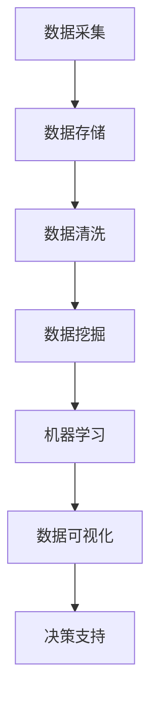

                 

关键词：大数据，创业决策，业务增长，技术优化，人工智能

> 摘要：本文探讨了如何利用大数据技术来优化创业决策和业务增长引擎。通过分析大数据的核心概念、技术原理以及具体应用场景，我们提出了一系列可行的策略，帮助创业者更有效地制定战略，推动业务增长。

## 1. 背景介绍

在当今高速发展的商业环境中，创业者面临着前所未有的挑战和机遇。随着互联网和技术的进步，数据已经成为企业运营中不可或缺的要素。大数据技术的兴起，为创业者和企业提供了强大的分析工具，帮助他们从海量数据中提取有价值的信息，从而优化决策过程，提高业务效率。

### 大数据的核心概念

大数据（Big Data）是指无法使用常规数据处理工具在合理时间内进行捕捉、管理和处理的大量数据。其特点通常被概括为4V：Volume（数据量巨大）、Velocity（数据生成速度快）、Variety（数据类型繁多）和Veracity（数据真实性和准确性高）。

### 大数据的重要性

大数据技术的重要性体现在以下几个方面：

- **决策支持**：通过大数据分析，企业可以更准确地把握市场动态，了解消费者需求，制定更有针对性的战略。
- **风险控制**：大数据可以帮助企业识别潜在的风险，及时采取措施，避免损失。
- **运营优化**：通过对业务流程的深入分析，企业可以优化资源配置，提高效率。
- **创新驱动**：大数据分析为创业者提供了新的业务模式和创新思路。

## 2. 核心概念与联系

为了更好地理解如何利用大数据技术优化创业决策和业务增长引擎，我们需要明确以下几个核心概念：

### 数据采集与存储

- **数据源**：包括内部数据（如销售记录、客户反馈）和外部数据（如社交媒体、行业报告）。
- **数据仓库**：用于存储和管理大量数据的系统，如Hadoop、Hive。

### 数据处理与分析

- **数据清洗**：去除重复、错误或不完整的数据，确保数据质量。
- **数据挖掘**：通过算法和统计方法，从大量数据中提取有价值的信息。
- **机器学习**：利用算法模型，自动从数据中学习并做出预测。

### 数据可视化

- **仪表盘**：通过图形化界面，直观展示数据分析和结果。
- **报表系统**：生成各种报告，帮助企业了解业务状况。

### Mermaid 流程图



## 3. 核心算法原理 & 具体操作步骤

### 3.1 算法原理概述

大数据技术的核心在于数据处理和分析。以下是一些常用的算法原理：

- **聚类分析**：将相似的数据分组，以发现潜在的模式。
- **回归分析**：通过建立数学模型，预测未来的趋势。
- **关联规则学习**：发现数据之间的关联关系，用于市场细分和推荐系统。

### 3.2 算法步骤详解

1. **数据采集**：从各种数据源获取原始数据。
2. **数据预处理**：清洗、转换和整合数据，确保数据质量。
3. **数据挖掘**：选择合适的算法，对数据进行分析。
4. **结果可视化**：将分析结果以图形或报表的形式展示。
5. **决策支持**：根据分析结果，制定相应的策略。

### 3.3 算法优缺点

- **优点**：高效地处理海量数据，提供深入的洞察。
- **缺点**：数据质量和隐私问题，算法复杂度高等。

### 3.4 算法应用领域

- **市场营销**：通过大数据分析，优化营销策略，提高转化率。
- **供应链管理**：实时监控供应链，降低成本，提高效率。
- **金融风控**：识别潜在风险，预防金融欺诈。

## 4. 数学模型和公式 & 详细讲解 & 举例说明

### 4.1 数学模型构建

在数据分析中，常见的数学模型包括：

- **线性回归**：$y = \beta_0 + \beta_1x_1 + \beta_2x_2 + ... + \beta_nx_n$

- **逻辑回归**：$P(y=1) = \frac{1}{1 + e^{-(\beta_0 + \beta_1x_1 + \beta_2x_2 + ... + \beta_nx_n)}$

### 4.2 公式推导过程

以线性回归为例，推导过程如下：

1. **目标函数**：最小化误差平方和，即 $J(\theta) = \frac{1}{2m}\sum_{i=1}^{m}(h_\theta(x^{(i)}) - y^{(i)})^2$
2. **梯度下降**：计算目标函数关于每个参数的偏导数，并更新参数。

### 4.3 案例分析与讲解

假设一家创业公司想要预测下个月的销售额，数据如下：

- $x_1$：广告费用
- $x_2$：天气情况
- $y$：销售额

通过线性回归模型，我们可以得到预测公式：$y = \beta_0 + \beta_1x_1 + \beta_2x_2$

## 5. 项目实践：代码实例和详细解释说明

### 5.1 开发环境搭建

- **Python**：安装Python环境和必要的库，如NumPy、Pandas、Scikit-learn等。

### 5.2 源代码详细实现

以下是一个简单的线性回归示例：

```python
import numpy as np
import pandas as pd
from sklearn.linear_model import LinearRegression

# 数据加载
data = pd.read_csv('sales_data.csv')

# 特征提取
X = data[['广告费用', '天气情况']]
y = data['销售额']

# 模型训练
model = LinearRegression()
model.fit(X, y)

# 预测
prediction = model.predict([[1000, 20]])

print("预测销售额：", prediction)
```

### 5.3 代码解读与分析

- **数据加载**：使用Pandas读取CSV文件。
- **特征提取**：选择广告费用和天气情况作为特征。
- **模型训练**：使用线性回归模型进行训练。
- **预测**：输入新的特征，得到销售额预测。

### 5.4 运行结果展示

运行上述代码，可以得到下个月的销售额预测结果。

## 6. 实际应用场景

大数据技术在创业中的应用场景非常广泛，以下是一些典型的应用案例：

- **市场调研**：通过大数据分析，了解消费者行为，优化产品设计和营销策略。
- **供应链管理**：实时监控供应链，优化库存和物流，降低成本。
- **客户服务**：利用大数据分析客户反馈，提供更个性化的服务。
- **风险控制**：识别潜在的风险，提前采取预防措施。

### 6.4 未来应用展望

随着技术的不断进步，大数据技术在创业中的应用前景更加广阔。未来，创业者可以：

- **更加精准的预测**：利用深度学习等先进算法，提高预测准确性。
- **实时的数据分析**：通过实时数据处理和分析，快速响应市场变化。
- **智能决策支持**：利用大数据和人工智能，实现更加智能的决策支持系统。

## 7. 工具和资源推荐

### 7.1 学习资源推荐

- **《大数据技术导论》**：全面介绍大数据的基础知识和技术。
- **《Python数据分析》**：Python在数据分析和大数据领域的应用。

### 7.2 开发工具推荐

- **Jupyter Notebook**：强大的交互式开发环境。
- **Docker**：容器化技术，方便部署和管理大数据应用。

### 7.3 相关论文推荐

- **"Big Data: A Revolution That Will Transform How We Live, Work, and Think"**：关于大数据革命的重要论文。
- **"Deep Learning"**：关于深度学习的经典著作。

## 8. 总结：未来发展趋势与挑战

### 8.1 研究成果总结

大数据技术在创业中的应用已经取得了显著成果，为创业者提供了强大的决策支持工具。未来，随着技术的不断进步，大数据将在更多领域发挥重要作用。

### 8.2 未来发展趋势

- **实时数据处理**：实时分析海量数据，实现快速决策。
- **智能化**：利用人工智能和机器学习，实现更加智能化的数据分析。

### 8.3 面临的挑战

- **数据隐私**：如何在保证数据隐私的前提下进行数据分析。
- **算法透明度**：如何提高算法的透明度，确保决策的公正性。

### 8.4 研究展望

大数据技术的未来研究将集中在提高数据处理和分析的效率，以及确保数据安全和隐私。同时，将人工智能与大数据技术相结合，实现更加智能化的数据分析和应用。

## 9. 附录：常见问题与解答

### 9.1 问题1

**Q：如何保证数据隐私？**

**A：数据隐私是大数据应用中的重要问题。可以通过以下方法来保证数据隐私：**

- **匿名化处理**：对敏感数据进行匿名化处理，去除可直接识别身份的信息。
- **加密技术**：对数据传输和存储进行加密，确保数据安全。
- **访问控制**：实施严格的访问控制策略，确保只有授权用户才能访问敏感数据。

### 9.2 问题2

**Q：大数据技术是否适用于所有行业？**

**A：大数据技术具有广泛的应用前景，适用于各个行业。不过，不同行业对大数据的需求和应用方式有所不同。例如，金融行业更关注风险控制和客户分析，而医疗行业更关注患者数据的处理和分析。创业者应根据自身行业的特点，选择合适的大数据技术和应用场景。**

----------------------------------------------------------------

作者：禅与计算机程序设计艺术 / Zen and the Art of Computer Programming

以上是一篇关于“如何利用大数据技术优化创业决策和业务增长引擎”的完整文章。文章涵盖了大数据的核心概念、算法原理、实际应用场景以及未来发展趋势等内容，旨在为创业者提供有价值的技术指导和策略建议。希望对读者有所启发和帮助。

