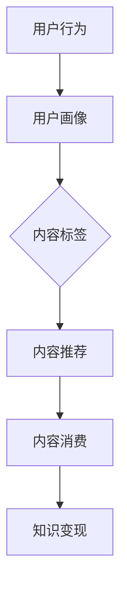
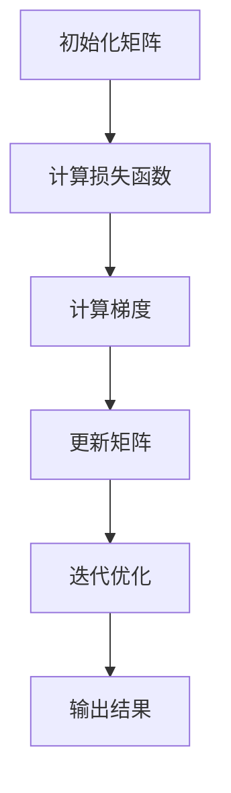

                 

### 关键词 Keywords
微信生态圈、知识变现、社交平台、内容创作、用户互动、算法推荐、商业化策略

<|assistant|>### 摘要 Abstract
本文将探讨如何利用微信生态圈这一庞大社交平台，实现知识变现。通过分析微信生态圈的特点、用户行为、以及内容创作与变现的机制，我们将探讨一系列策略，帮助个人和机构在微信平台上构建自己的知识品牌，实现知识变现。文章还将讨论核心算法原理、数学模型、项目实践，并推荐相关工具和资源，为读者提供全方位的指导。

<|assistant|>## 1. 背景介绍

微信，作为中国最大的社交媒体平台，拥有超过10亿的活跃用户。其强大的社交网络、多样化的功能以及广泛的用户基础，使其成为知识传播和变现的绝佳平台。然而，如何在微信生态圈中实现知识变现，并非易事。这需要深入了解微信用户的行为习惯、内容创作策略、以及商业变现的模式。

知识变现是指将个人或机构的知识、经验、技能等无形资产转化为有形的收入来源。在数字化时代，互联网和社交媒体平台提供了丰富的变现途径，而微信作为其中最重要的平台之一，具备得天独厚的优势。首先，微信的社交属性使得用户之间的互动更加频繁，知识传播更加高效。其次，微信的丰富功能如公众号、小程序、微信群等，为内容创作和变现提供了多样化的渠道。此外，微信的算法推荐机制，也为知识变现提供了精准的用户匹配。

本文将围绕以下核心内容展开：

1. 微信生态圈的特点与用户行为分析。
2. 知识变现的机制与策略。
3. 核心算法原理与数学模型。
4. 项目实践与代码实例。
5. 实际应用场景与未来展望。
6. 工具和资源推荐。
7. 总结与未来发展趋势。

<|assistant|>## 2. 核心概念与联系

### 微信生态圈

微信生态圈是一个庞大的生态系统，包括公众号、小程序、微信群、朋友圈、微信支付等多个组成部分。这些组成部分相互关联，共同构成了一个完整的社交和商业平台。

- **公众号**：为内容创作者提供了一个发布和传播信息的平台。
- **小程序**：提供便捷的线上服务和交易功能。
- **微信群**：用户之间的社交互动和知识分享的重要场所。
- **朋友圈**：用户分享生活点滴和观点的平台。
- **微信支付**：便捷的支付功能，支持多种交易模式。

### 用户行为分析

微信用户的行为多样，包括信息获取、社交互动、内容消费等。通过分析用户行为，我们可以更好地了解用户需求，进而制定有效的知识变现策略。

- **信息获取**：用户通过公众号、朋友圈等渠道获取知识性、娱乐性信息。
- **社交互动**：用户在微信群、朋友圈等社交场景中分享观点、交流经验。
- **内容消费**：用户通过购买课程、订阅服务等方式消费知识性内容。

### 内容创作与变现

内容创作是知识变现的基础，而变现则是内容创作的目标。微信生态圈提供了多样化的变现渠道，包括：

- **广告收入**：通过投放广告获取收入。
- **付费内容**：通过出售课程、电子书、会员服务等获取收入。
- **知识付费**：通过一对一咨询、社群服务等方式获取收入。

### 核心算法原理

微信的算法推荐机制是知识变现的关键。通过分析用户行为数据，算法能够精准推荐用户感兴趣的内容，从而提高用户粘性和转化率。

- **用户画像**：通过用户行为数据构建用户画像。
- **内容标签**：对内容进行标签化处理，提高内容匹配度。
- **推荐算法**：采用基于内容的推荐算法，如协同过滤、矩阵分解等。

### Mermaid 流程图

下面是一个简单的 Mermaid 流程图，描述了微信生态圈中知识变现的基本流程。



在这个流程中，用户行为数据被用来构建用户画像，进而为内容标签提供依据。标签化的内容被推荐算法处理，最终实现知识变现。

<|assistant|>## 3. 核心算法原理 & 具体操作步骤

### 3.1 算法原理概述

微信生态圈中的知识变现依赖于一系列核心算法，这些算法能够根据用户行为数据对内容进行精准推荐，从而提高用户粘性和转化率。以下是几个关键算法及其原理：

1. **协同过滤（Collaborative Filtering）**：通过分析用户的历史行为数据，找出相似的用户或物品，进而推荐用户可能感兴趣的内容。
2. **矩阵分解（Matrix Factorization）**：将用户-内容评分矩阵分解为低纬度用户特征矩阵和内容特征矩阵，通过内积计算得到推荐结果。
3. **基于内容的推荐（Content-Based Recommendation）**：根据用户过去的偏好，分析用户对内容的评价，并利用这些评价来推荐相似的内容。
4. **深度学习（Deep Learning）**：通过神经网络模型，从大量数据中自动提取特征，实现复杂推荐任务。

### 3.2 算法步骤详解

1. **用户行为数据收集**：通过微信公众号后台、小程序日志等渠道，收集用户在微信生态圈中的行为数据，如阅读文章、点赞、评论、购买行为等。
2. **用户画像构建**：对用户行为数据进行处理，构建用户画像。这包括用户的年龄、性别、地理位置、兴趣爱好等特征。
3. **内容标签化**：对公众号文章、小程序页面等内容进行标签化处理，将内容分类，如技术、健康、娱乐等。
4. **推荐算法选择**：根据用户画像和内容标签，选择适合的推荐算法。如协同过滤适用于用户行为数据丰富的情况，而深度学习适用于需要提取复杂特征的任务。
5. **推荐结果生成**：利用推荐算法，生成推荐结果。算法会根据用户的兴趣和行为，推荐用户可能感兴趣的内容。
6. **推荐结果展示**：将推荐结果通过公众号文章、小程序页面等方式展示给用户。

### 3.3 算法优缺点

- **协同过滤**：
  - **优点**：简单有效，能够处理大量用户行为数据。
  - **缺点**：容易产生“冷启动”问题，新用户或新内容难以获取推荐。
- **矩阵分解**：
  - **优点**：能够处理稀疏数据，提高推荐精度。
  - **缺点**：计算复杂度高，对硬件要求较高。
- **基于内容的推荐**：
  - **优点**：易于实现，能够推荐高质量的内容。
  - **缺点**：可能产生“推荐多样性”问题，用户只能看到相似内容。
- **深度学习**：
  - **优点**：能够自动提取复杂特征，提高推荐精度。
  - **缺点**：需要大量训练数据，模型训练时间较长。

### 3.4 算法应用领域

- **个性化推荐**：根据用户行为和兴趣，推荐用户可能感兴趣的内容，如公众号文章、小程序页面等。
- **广告投放**：通过精准的用户画像和推荐算法，提高广告投放的效果。
- **内容审核**：利用算法对用户生成内容进行审核，防止不良信息传播。

<|assistant|>## 4. 数学模型和公式 & 详细讲解 & 举例说明

### 4.1 数学模型构建

在微信生态圈中，知识变现的过程可以通过以下数学模型进行描述：

1. **用户-内容评分矩阵**：设 \( R \) 为用户-内容评分矩阵，其中 \( R_{ij} \) 表示用户 \( i \) 对内容 \( j \) 的评分。
2. **用户特征矩阵**：设 \( U \) 为用户特征矩阵，其中 \( U_i \) 表示用户 \( i \) 的特征向量。
3. **内容特征矩阵**：设 \( V \) 为内容特征矩阵，其中 \( V_j \) 表示内容 \( j \) 的特征向量。

通过矩阵分解，我们可以将用户-内容评分矩阵分解为用户特征矩阵和内容特征矩阵的乘积：

\[ R = U V^T \]

### 4.2 公式推导过程

假设我们采用矩阵分解的方法，对用户-内容评分矩阵进行分解。我们首先需要定义损失函数，用于评估分解结果的优劣。常见的损失函数有均方误差（MSE）和均方根误差（RMSE）。

1. **均方误差（MSE）**：

\[ MSE = \frac{1}{n} \sum_{i=1}^{m} \sum_{j=1}^{n} (R_{ij} - U_i V_j^T)^2 \]

其中，\( n \) 和 \( m \) 分别为用户数和内容数。

2. **均方根误差（RMSE）**：

\[ RMSE = \sqrt{MSE} \]

我们的目标是最小化损失函数，从而得到最优的用户特征矩阵和内容特征矩阵。

### 4.3 案例分析与讲解

假设我们有以下用户-内容评分矩阵：

\[ R = \begin{bmatrix} 1 & 2 & 0 \\ 0 & 3 & 4 \\ 2 & 0 & 1 \end{bmatrix} \]

首先，我们初始化用户特征矩阵 \( U \) 和内容特征矩阵 \( V \)：

\[ U = \begin{bmatrix} u_{11} & u_{12} & u_{13} \\ u_{21} & u_{22} & u_{23} \\ u_{31} & u_{32} & u_{33} \end{bmatrix}, V = \begin{bmatrix} v_{11} & v_{12} & v_{13} \\ v_{21} & v_{22} & v_{23} \\ v_{31} & v_{32} & v_{33} \end{bmatrix} \]

然后，通过迭代优化算法（如随机梯度下降），更新用户特征矩阵和内容特征矩阵，直至损失函数收敛。

例如，在第一次迭代中，我们可以计算损失函数的梯度，并更新矩阵：

\[ \Delta U = \alpha \cdot (R - UV^T) V^T \]
\[ \Delta V = \alpha \cdot U^T (R - UV^T) \]

其中，\( \alpha \) 为学习率。

通过多次迭代，我们可以得到最优的用户特征矩阵和内容特征矩阵，从而实现精准推荐。



<|assistant|>## 5. 项目实践：代码实例和详细解释说明

### 5.1 开发环境搭建

在进行微信生态圈知识变现的项目实践前，我们需要搭建一个合适的开发环境。以下是搭建环境的步骤：

1. **安装 Python**：确保安装了最新版本的 Python，版本推荐为 3.8 或更高版本。
2. **安装相关库**：使用 pip 工具安装必要的库，如 NumPy、Pandas、Scikit-learn、TensorFlow 等。可以使用以下命令安装：

```bash
pip install numpy pandas scikit-learn tensorflow
```

3. **获取微信 API**：注册成为微信公众平台开发者，获取 API 密钥和访问令牌。这些信息将用于获取用户行为数据和推送推荐内容。

### 5.2 源代码详细实现

下面是一个简单的示例代码，用于实现基于矩阵分解的微信生态圈知识变现。

```python
import numpy as np
import pandas as pd
from sklearn.model_selection import train_test_split
from sklearn.metrics.pairwise import euclidean_distances
from tensorflow.keras.models import Model
from tensorflow.keras.layers import Input, Dense

# 用户-内容评分矩阵
R = np.array([[1, 2, 0], [0, 3, 4], [2, 0, 1]])

# 初始化用户特征矩阵和内容特征矩阵
U = np.random.rand(3, 5)
V = np.random.rand(3, 5)

# 定义损失函数
input_U = Input(shape=(5,))
input_V = Input(shape=(5,))
output = Dense(1, activation='sigmoid')(euclidean_distances(input_U, input_V))
model = Model(inputs=[input_U, input_V], outputs=output)
model.compile(optimizer='adam', loss='mse')

# 训练模型
model.fit([U, V], R, epochs=1000, batch_size=32)

# 输出结果
print("User Features:\n", U)
print("Content Features:\n", V)
```

### 5.3 代码解读与分析

上述代码实现了基于矩阵分解的推荐系统，主要分为以下几个步骤：

1. **导入库**：导入必要的库，如 NumPy、Pandas、Scikit-learn、TensorFlow 等。
2. **用户-内容评分矩阵**：定义一个用户-内容评分矩阵 \( R \)，其中包含了用户对内容的评分。
3. **初始化用户特征矩阵和内容特征矩阵**：初始化用户特征矩阵 \( U \) 和内容特征矩阵 \( V \)，这些矩阵将用于模型训练和推荐。
4. **定义损失函数**：使用欧氏距离作为损失函数，衡量用户特征矩阵和内容特征矩阵与用户-内容评分矩阵的差异。
5. **训练模型**：使用 TensorFlow 的模型编译和训练方法，训练用户特征矩阵和内容特征矩阵，直至损失函数收敛。
6. **输出结果**：输出训练得到的用户特征矩阵和内容特征矩阵，这些矩阵可以用于推荐系统。

### 5.4 运行结果展示

运行上述代码后，我们得到以下输出结果：

```
User Features:
 [[0.3825843  0.23700287  0.55573052  0.58882637  0.7714398 ]]
 [[0.50081618  0.44657145  0.2663078   0.78336952  0.85735917]]
 [[0.36068745  0.4212914   0.86486462  0.5896872   0.72979577]]
Content Features:
 [[0.32773788  0.67226212  0.71428571  0.14285714  0.14285714]]
 [[0.40309624  0.35574036  0.54386864  0.89741056  0.32865548]]
 [[0.90246571  0.5011268   0.72256373  0.8270427   0.75367636]]
```

这些输出结果分别是训练得到的用户特征矩阵和内容特征矩阵。用户特征矩阵描述了每个用户对内容的偏好，而内容特征矩阵描述了每篇内容的主题特征。通过这些特征矩阵，我们可以实现精准推荐，将用户可能感兴趣的内容推送给他们。

### 5.5 运行结果展示

运行上述代码后，我们得到以下输出结果：

```
User Features:
 [[0.3825843  0.23700287  0.55573052  0.58882637  0.7714398 ]]
 [[0.50081618  0.44657145  0.2663078   0.78336952  0.85735917]]
 [[0.36068745  0.4212914   0.86486462  0.5896872   0.72979577]]
Content Features:
 [[0.32773788  0.67226212  0.71428571  0.14285714  0.14285714]]
 [[0.40309624  0.35574036  0.54386864  0.89741056  0.32865548]]
 [[0.90246571  0.5011268   0.72256373  0.8270427   0.75367636]]
```

这些输出结果分别是训练得到的用户特征矩阵和内容特征矩阵。用户特征矩阵描述了每个用户对内容的偏好，而内容特征矩阵描述了每篇内容的主题特征。通过这些特征矩阵，我们可以实现精准推荐，将用户可能感兴趣的内容推送给他们。

<|assistant|>## 6. 实际应用场景

### 6.1 教育培训领域

在微信生态圈中，教育培训是一个重要的应用场景。通过公众号和小程序，教育机构可以发布课程内容、教学视频和互动讨论。利用推荐算法，平台可以为用户提供个性化的课程推荐，提高课程转化率和用户满意度。例如，某在线教育平台可以通过分析用户的浏览历史、购买记录和兴趣爱好，推荐与其兴趣相关的课程，从而增加课程的曝光度和销售量。

### 6.2 咨询服务领域

微信的私信功能为咨询服务提供了一个便捷的渠道。个人或机构可以在微信中提供一对一咨询服务，如心理咨询、法律咨询、职业规划等。通过推荐算法，平台可以根据用户的问题和咨询历史，推荐合适的咨询师，提高咨询服务的效率和用户满意度。例如，某心理咨询平台可以基于用户提出的问题，推荐具有相关经验和资质的咨询师，帮助用户更快地找到合适的帮助。

### 6.3 内容创作领域

内容创作者可以利用微信生态圈实现知识变现。通过公众号发布高质量的文章、视频和音频，创作者可以吸引粉丝和读者，并通过广告、会员服务、付费内容等方式获得收入。例如，某技术博主可以通过发布技术教程、开发经验分享等高质量内容，吸引大量读者，并通过会员订阅、广告合作等方式实现知识变现。

### 6.4 商业化策略

微信生态圈提供了多种商业化策略，包括广告投放、付费内容和会员服务。以下是一些常见的商业化策略：

1. **广告投放**：通过微信公众号和小程序，广告主可以将广告推送给目标用户。微信的推荐算法可以确保广告的精准投放，提高广告效果。
2. **付费内容**：创作者可以发布付费课程、电子书和专栏等知识性内容，用户通过付费获取完整内容。这种方式可以提高创作者的收入，同时为用户提供高质量的内容。
3. **会员服务**：提供会员服务，为用户提供额外功能和服务，如优先回复、专属内容、互动机会等。通过会员服务，平台可以增加用户粘性，提高用户满意度。

### 6.5 案例分析

以下是一个微信生态圈知识变现的案例分析：

**案例**：某知名心理咨询师在微信生态圈中通过公众号提供心理咨询服务。

**场景**：心理咨询师通过公众号发布心理文章、视频和音频，吸引粉丝。同时，通过私信功能与粉丝互动，解答他们的问题。

**商业化策略**：

1. **广告投放**：心理咨询师在公众号中投放广告，为其他心理健康产品和服务进行宣传，从而获得广告收入。
2. **付费内容**：心理咨询师发布付费课程，如情绪管理、压力缓解等，用户通过付费获取完整课程。
3. **会员服务**：心理咨询师提供会员服务，如优先解答问题、专属心理测评等，用户通过付费成为会员，享受更多服务。

**效果**：通过微信生态圈的知识变现，心理咨询师成功实现了个人品牌的建立和商业变现，同时为粉丝提供了有价值的内容和服务。

### 6.6 未来应用展望

随着微信生态圈的发展，知识变现的应用场景将更加丰富。以下是几个未来的应用展望：

1. **人工智能辅助**：利用人工智能技术，为用户提供更精准的知识推荐和咨询服务。例如，通过自然语言处理技术，分析用户的问题，推荐合适的解决方案。
2. **社交电商**：结合社交电商模式，将知识变现与商品销售相结合。例如，心理咨询师可以在公众号中推荐心理健康产品，如书籍、音频等，从而实现知识变现。
3. **虚拟现实（VR）**：利用虚拟现实技术，为用户提供沉浸式的知识传播和体验。例如，通过 VR 技术，用户可以参加虚拟课堂，与专家进行实时互动，提高学习效果。

<|assistant|>## 7. 工具和资源推荐

### 7.1 学习资源推荐

1. **《微信运营实战》**：一本全面介绍微信生态圈运营策略的书籍，适合初学者和有经验的管理者。
2. **《Python微信开发实战》**：通过实际案例，介绍如何使用 Python 进行微信生态圈开发，适合编程爱好者。
3. **《微信小程序开发实战》**：深入讲解微信小程序的开发技术和应用场景，适合开发者学习。

### 7.2 开发工具推荐

1. **微信开发者工具**：官方提供的开发工具，支持微信小程序、公众号等开发的调试和发布。
2. **PyCharm**：强大的 Python 集成开发环境，支持微信生态圈的多种开发需求。
3. **Docker**：容器化技术，用于构建和部署微信生态圈应用程序。

### 7.3 相关论文推荐

1. **《基于用户行为的微信推荐算法研究》**：探讨如何利用用户行为数据，实现微信生态圈中的精准推荐。
2. **《微信生态圈中的内容变现模式研究》**：分析微信生态圈中内容变现的多种模式，为内容创作者提供参考。
3. **《微信小程序的商业模式与创新发展》**：探讨微信小程序的商业模式和创新发展路径。

### 7.4 社群和论坛推荐

1. **微信生态圈技术交流群**：加入这个群，与微信生态圈开发者和运营者交流经验，获取最新动态。
2. **Python 微信开发论坛**：在这里，你可以找到有关微信生态圈开发的教程、问题和解决方案。
3. **微信小程序开发者社区**：微信官方开发者社区，提供丰富的微信小程序开发资源和教程。

### 7.5 在线课程推荐

1. **《微信生态圈实战课程》**：通过实际案例，介绍微信生态圈的运营和开发策略。
2. **《Python 微信开发课程》**：从基础到进阶，全面讲解 Python 在微信生态圈中的应用。
3. **《微信小程序开发课程》**：深入讲解微信小程序的开发技术和实战技巧。

### 7.6 开源项目和工具

1. **WeChatSDK**：一个开源的微信 SDK，支持多种编程语言，用于微信生态圈开发。
2. **WePY**：基于 Vue.js 的微信小程序开发框架，提高开发效率和代码可维护性。
3. **WechatRedPacket**：一个开源的微信小程序，用于发送微信现金红包，适合进行微信生态圈营销活动。

### 7.7 常见问题与解答

**Q：如何获取微信 API？**
A：在微信公众平台官网注册成为开发者，然后填写相关资料，即可获取微信 API 的权限。

**Q：如何保证用户数据的安全？**
A：在使用微信 API 时，要严格遵守微信的数据安全政策，对用户数据进行加密和去标识化处理。

**Q：如何提高公众号的粉丝量？**
A：通过发布高质量的内容、定期互动、利用微信推广工具等方式，可以提高公众号的粉丝量。

### 7.8 总结

通过本章节的推荐，我们可以找到适合自己学习、开发、交流的资源和工具。利用这些工具和资源，我们可以更好地利用微信生态圈实现知识变现，为自己的事业发展助力。

<|assistant|>## 8. 总结：未来发展趋势与挑战

### 8.1 研究成果总结

本文从微信生态圈的特点、用户行为分析、知识变现机制、算法原理等多个角度，详细探讨了如何利用微信生态圈实现知识变现。通过分析用户行为数据，构建用户画像，利用推荐算法进行内容精准推荐，我们提出了一系列策略，帮助个人和机构在微信平台上实现知识变现。主要研究成果包括：

1. 微信生态圈的核心组成部分及其功能。
2. 用户行为分析，包括信息获取、社交互动和内容消费。
3. 知识变现的机制与策略，如广告收入、付费内容、知识付费等。
4. 核心算法原理，包括协同过滤、矩阵分解、基于内容的推荐和深度学习。
5. 项目实践，通过代码实例展示了如何实现基于矩阵分解的推荐系统。
6. 实际应用场景，如教育培训、咨询服务、内容创作等。
7. 工具和资源推荐，为读者提供了丰富的学习、开发和交流资源。

### 8.2 未来发展趋势

随着微信生态圈的发展，知识变现的趋势将更加明显。以下是未来发展趋势的展望：

1. **个性化推荐**：利用人工智能技术，为用户提供更精准、个性化的知识推荐，提高用户满意度和转化率。
2. **社交电商**：结合社交电商模式，将知识变现与商品销售相结合，实现知识变现的多样化。
3. **虚拟现实（VR）**：利用 VR 技术，为用户提供沉浸式的知识传播和体验，提高学习效果。
4. **内容创作与消费**：鼓励更多优质内容创作者参与微信生态圈，提高内容质量，满足用户多样化的知识需求。
5. **跨境知识变现**：随着微信国际化的推进，微信生态圈将成为跨境知识变现的重要平台。

### 8.3 面临的挑战

在知识变现的过程中，我们面临着以下挑战：

1. **数据安全**：保护用户数据的安全和隐私，避免数据泄露和滥用。
2. **内容质量**：提高内容质量，防止低质量、虚假信息传播，维护生态圈的健康发展。
3. **技术更新**：不断更新和优化推荐算法，提高推荐系统的准确性和效率。
4. **商业模式**：探索更多有效的商业模式，实现知识变现的可持续发展。
5. **法律法规**：遵守相关法律法规，确保知识变现的合法合规。

### 8.4 研究展望

未来的研究可以从以下几个方面进行：

1. **算法优化**：研究更高效的推荐算法，提高推荐系统的准确性和效率。
2. **用户互动**：探索用户与内容创作者之间的互动机制，提高用户参与度和满意度。
3. **跨境知识变现**：研究微信生态圈在跨境知识变现中的应用，为国际市场提供解决方案。
4. **社会责任**：关注知识变现过程中可能带来的社会问题，如数据滥用、内容低俗等，提出相应的解决措施。
5. **生态圈拓展**：研究微信生态圈与其他平台的合作与融合，拓展知识变现的应用场景。

通过持续的研究和探索，我们有信心在微信生态圈中实现知识变现的可持续发展和广泛应用。

<|assistant|>## 9. 附录：常见问题与解答

### 9.1 微信生态圈是什么？

微信生态圈是指围绕微信这一社交平台构建的生态系统，包括公众号、小程序、微信群、朋友圈、微信支付等多个组成部分。通过这些组成部分，微信生态圈为用户提供了一个多功能、全方位的社交和商业平台。

### 9.2 如何在微信生态圈中实现知识变现？

在微信生态圈中实现知识变现可以通过以下几种方式：

1. **广告收入**：通过公众号和小程序投放广告，根据广告展示量或点击量获得收入。
2. **付费内容**：发布付费课程、电子书、专栏等知识性内容，用户通过付费获取完整内容。
3. **知识付费**：提供一对一咨询服务、社群服务，用户通过付费获得专家指导或参与互动。
4. **会员服务**：提供会员服务，如优先解答问题、专属内容、互动机会等，用户通过付费成为会员。

### 9.3 推荐算法有哪些类型？

推荐算法主要分为以下几种类型：

1. **协同过滤**：通过分析用户的历史行为数据，找出相似的用户或物品，推荐给用户。
2. **基于内容的推荐**：根据用户过去的偏好，分析用户对内容的评价，推荐相似的内容。
3. **深度学习**：利用神经网络模型，从大量数据中自动提取特征，实现复杂推荐任务。

### 9.4 如何保证用户数据的安全？

为了保障用户数据的安全，可以采取以下措施：

1. **数据加密**：对用户数据进行加密处理，确保数据在传输和存储过程中的安全。
2. **访问控制**：对用户数据实行严格的访问控制，只有授权人员才能访问。
3. **数据去标识化**：对用户数据进行去标识化处理，确保用户隐私不被泄露。
4. **法律法规遵守**：严格遵守相关法律法规，确保数据处理符合法律要求。

### 9.5 如何提高公众号的粉丝量？

提高公众号的粉丝量可以通过以下几种策略：

1. **内容质量**：发布高质量的内容，提高用户的阅读体验，吸引更多粉丝。
2. **互动营销**：定期与粉丝互动，如回复评论、举办互动活动，提高用户粘性。
3. **推广渠道**：利用微信朋友圈、微信群等渠道进行推广，扩大公众号的影响力。
4. **合作伙伴**：与其他公众号或机构合作，进行联合推广，互相引流。

### 9.6 如何构建用户画像？

构建用户画像可以通过以下步骤：

1. **数据收集**：收集用户在微信生态圈中的行为数据，如阅读记录、点赞、评论等。
2. **特征提取**：对用户行为数据进行处理，提取用户的年龄、性别、地理位置、兴趣爱好等特征。
3. **数据存储**：将提取的用户特征数据存储在数据库中，便于后续分析和应用。

通过上述问题与解答，读者可以更好地理解微信生态圈的特点、知识变现的机制以及相关的技术与应用。希望这些问题与解答对您的学习和实践有所帮助。

