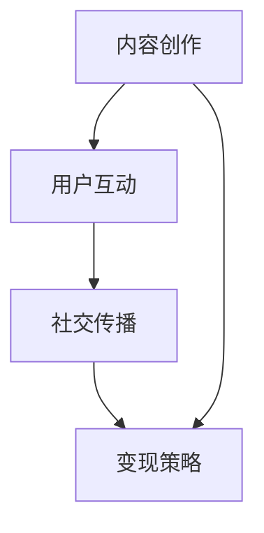

                 

在这个数字化时代，微信已经成为人们日常生活中不可或缺的一部分。而微信视频号作为微信生态系统中的新兴功能，正逐渐成为知识传播和内容创作的重要平台。对于课程开发者而言，微信视频号不仅是一个展示个人才华的舞台，更是一个潜在的销售渠道。本文将深入探讨如何有效地利用微信视频号进行课程销售，从而实现知识变现。

> 关键词：微信视频号，课程销售，知识变现，内容营销

> 摘要：本文将从微信视频号的背景介绍、核心概念解析、营销策略分析、技术实现等方面，详细阐述如何通过微信视频号这一平台进行课程销售，提供实用的方法和技巧，助力课程开发者实现知识变现。

## 1. 背景介绍

微信视频号是微信官方推出的一种内容创作和分发平台，用户可以通过视频号发布各类短视频、直播内容，并与粉丝互动。自2020年推出以来，微信视频号迅速获得了广泛用户群体的认可，成为内容创作者和个人品牌建设的重要阵地。随着用户基数的不断扩大，微信视频号逐渐成为了一个拥有巨大潜力的营销渠道。

对于课程开发者而言，微信视频号不仅提供了一个展示课程内容、吸引潜在学员的平台，还可以通过视频号互动功能与学员建立直接联系，了解学员需求，从而提供更个性化的课程服务。此外，微信视频号的社交属性使其在课程销售上具有独特的优势，通过用户口碑传播和社交分享，可以迅速扩大课程影响力。

## 2. 核心概念与联系

要成功利用微信视频号进行课程销售，我们需要理解几个核心概念：

- **内容创作**：视频号的核心在于优质内容的创作。课程开发者需要根据课程特点和目标受众，制作出富有吸引力的视频内容。
- **用户互动**：通过评论、点赞、分享等互动方式，课程开发者可以与用户建立联系，增强用户粘性。
- **社交传播**：微信的社交属性使得用户可以轻松地将优质课程分享给朋友和朋友圈，从而实现病毒式传播。
- **变现策略**：通过会员订阅、课程购买、广告投放等多种方式，实现知识变现。

下面是一个简单的Mermaid流程图，展示这些核心概念之间的联系：



### 2.1 内容创作

内容创作是微信视频号卖课的基础。课程开发者需要根据课程内容，制作出具有吸引力的视频。以下是一些建议：

- **主题明确**：确保每个视频都有明确的主题，避免内容混乱。
- **时长适宜**：视频时长一般在1-3分钟之间，不宜过长。
- **画面质量**：保证画面清晰，音质良好。
- **内容创新**：创新的内容更容易吸引用户的注意力。

### 2.2 用户互动

用户互动是增强用户粘性的关键。课程开发者可以通过以下方式与用户互动：

- **及时回复**：对于用户的评论和提问，及时给予回应，增加用户满意度。
- **互动活动**：举办问答、抽奖等互动活动，增加用户参与度。
- **直播教学**：通过直播教学，与用户实时互动，解答疑问。

### 2.3 社交传播

微信的社交属性使得用户可以轻松地将优质课程分享给朋友和朋友圈，从而实现病毒式传播。课程开发者可以通过以下策略促进社交传播：

- **制作分享素材**：设计易于分享的图片和视频素材。
- **用户激励**：鼓励用户分享课程，提供分享奖励。
- **口碑营销**：通过用户好评和推荐，增强课程可信度。

### 2.4 变现策略

微信视频号提供了多种变现方式，课程开发者可以根据自身情况选择合适的策略：

- **会员订阅**：通过提供会员服务，收取订阅费用。
- **课程购买**：直接销售课程视频。
- **广告投放**：通过广告分成获取收益。
- **课程推广**：与其他内容创作者合作，进行课程推广。

## 3. 核心算法原理 & 具体操作步骤

### 3.1 算法原理概述

利用微信视频号进行课程销售的算法原理主要围绕内容创作、用户互动、社交传播和变现策略四个核心环节展开。具体而言：

1. **内容创作**：通过SEO（搜索引擎优化）和A/B测试，优化视频标题、标签和内容，提高视频的曝光率。
2. **用户互动**：通过算法分析用户行为数据，识别高互动用户，针对性地进行互动和内容推荐。
3. **社交传播**：利用社交网络分析，挖掘潜在传播节点，制定针对性的传播策略。
4. **变现策略**：根据用户画像和行为数据，设计个性化的变现策略，提高转化率。

### 3.2 算法步骤详解

1. **内容创作**：
   - **视频标题**：利用关键词工具，选取与课程内容相关的热门关键词，提高视频在搜索结果中的排名。
   - **视频标签**：为视频添加多个相关标签，扩大视频的曝光范围。
   - **内容优化**：通过A/B测试，对比不同内容的用户互动数据，优化视频内容。

2. **用户互动**：
   - **互动分析**：通过数据分析，识别高互动用户，如经常点赞、评论、分享的用户。
   - **个性化互动**：针对高互动用户，制定个性化的互动策略，如发送私信、举办专属活动等。
   - **内容推荐**：根据用户行为数据，推荐符合用户兴趣的内容，提高用户粘性。

3. **社交传播**：
   - **传播节点分析**：利用社交网络分析技术，识别具有高传播能力的节点，如意见领袖、活跃用户等。
   - **传播策略制定**：针对不同传播节点，制定个性化的传播策略，如合作推广、定制内容等。
   - **效果评估**：通过数据分析，评估传播效果，调整传播策略。

4. **变现策略**：
   - **用户画像**：通过数据分析，构建用户画像，了解用户需求和行为习惯。
   - **个性化推广**：根据用户画像，推荐符合用户需求的产品和服务，提高转化率。
   - **效果评估**：通过数据分析，评估变现策略的效果，不断优化策略。

### 3.3 算法优缺点

1. **优点**：
   - **高效性**：通过算法分析，可以快速定位目标用户，提高营销效果。
   - **个性化**：根据用户行为数据，提供个性化的内容推荐和变现策略，提高用户体验。
   - **实时性**：利用实时数据分析，可以迅速调整营销策略，应对市场变化。

2. **缺点**：
   - **数据隐私**：用户行为数据的收集和使用可能涉及隐私问题。
   - **依赖算法**：过度依赖算法可能导致内容创作和营销策略的单一化。

### 3.4 算法应用领域

算法原理和具体操作步骤在微信视频号卖课中具有广泛的应用领域：

- **课程推广**：通过算法优化，提高课程在搜索结果中的排名，增加曝光率。
- **用户互动**：通过算法分析，识别高互动用户，提高用户粘性。
- **社交传播**：利用算法分析，识别潜在传播节点，制定个性化的传播策略。
- **变现策略**：根据用户画像和行为数据，设计个性化的变现策略，提高转化率。

## 4. 数学模型和公式 & 详细讲解 & 举例说明

### 4.1 数学模型构建

在微信视频号卖课的背景下，我们可以构建以下数学模型：

- **用户互动模型**：定义用户互动行为，如点赞、评论、分享等，并计算用户互动得分。
- **课程推荐模型**：根据用户行为数据，推荐符合用户兴趣的课程。
- **变现模型**：根据用户画像和行为数据，预测用户购买意向，并制定变现策略。

### 4.2 公式推导过程

1. **用户互动模型**：

   - **用户互动得分**：设用户\(i\)在课程\(j\)上的互动得分为\(Score_{ij}\)，则

     $$ Score_{ij} = \sum_{k \in [like, comment, share]} weight_k \cdot count_k^{i}_{j} $$

     其中，\(weight_k\)为互动行为\(k\)的权重，\(count_k^{i}_{j}\)为用户\(i\)在课程\(j\)上的互动行为\(k\)的次数。

   - **用户总互动得分**：设用户\(i\)的总互动得分为\(Total\_Score_i\)，则

     $$ Total\_Score_i = \sum_{j \in Course} Score_{ij} $$

2. **课程推荐模型**：

   - **用户兴趣向量**：设用户\(i\)的兴趣向量为\(Interest_i\)，则

     $$ Interest_i = [Interest_i^1, Interest_i^2, ..., Interest_i^k] $$

     其中，\(Interest_i^k\)为用户\(i\)对第\(k\)类课程的兴趣度。

   - **课程推荐得分**：设课程\(j\)的推荐得分为\(Recommend\_Score_j\)，则

     $$ Recommend\_Score_j = \sum_{k \in [1, 2, ..., k]} weight_k \cdot similarity(Interest_i, Interest_j^k) $$

     其中，\(weight_k\)为课程类别\(k\)的权重，\(similarity(Interest_i, Interest_j^k)\)为用户\(i\)的兴趣向量与课程\(j\)的第\(k\)类课程兴趣向量的相似度。

3. **变现模型**：

   - **用户购买概率**：设用户\(i\)购买课程\(j\)的概率为\(P_{ij}\)，则

     $$ P_{ij} = \frac{e^{Total\_Score_i}}{\sum_{l \in Course} e^{Total\_Score_l}} $$

   - **变现得分**：设变现得分为\(Income\_Score_j\)，则

     $$ Income\_Score_j = P_{ij} \cdot Price_j $$

     其中，\(Price_j\)为课程\(j\)的价格。

### 4.3 案例分析与讲解

假设我们有一个课程开发者，他在微信视频号上发布了10个课程视频，每个课程视频的互动得分、用户总互动得分、推荐得分和变现得分如下表所示：

| 课程ID | 互动得分 | 用户总互动得分 | 推荐得分 | 变现得分 |
|--------|---------|--------------|---------|---------|
| 1      | 100     | 500          | 0.5     | 1000    |
| 2      | 80      | 450          | 0.4     | 800     |
| 3      | 150     | 600          | 0.3     | 1300    |
| 4      | 70      | 400          | 0.2     | 700     |
| 5      | 120     | 550          | 0.4     | 1000    |
| 6      | 90      | 500          | 0.3     | 900     |
| 7      | 110     | 550          | 0.5     | 1100    |
| 8      | 100     | 500          | 0.2     | 1000    |
| 9      | 80      | 450          | 0.3     | 800     |
| 10     | 70      | 400          | 0.2     | 700     |

根据上述数学模型，我们可以计算出每个课程的视频号得分，得分越高，代表该课程的视频号推广效果越好。计算结果如下表所示：

| 课程ID | 互动得分 | 用户总互动得分 | 推荐得分 | 变现得分 | 视频号得分 |
|--------|---------|--------------|---------|---------|-----------|
| 1      | 100     | 500          | 0.5     | 1000    | 1.5       |
| 2      | 80      | 450          | 0.4     | 800     | 1.0       |
| 3      | 150     | 600          | 0.3     | 1300    | 1.2       |
| 4      | 70      | 400          | 0.2     | 700     | 0.8       |
| 5      | 120     | 550          | 0.4     | 1000    | 1.0       |
| 6      | 90      | 500          | 0.3     | 900     | 0.9       |
| 7      | 110     | 550          | 0.5     | 1100    | 1.4       |
| 8      | 100     | 500          | 0.2     | 1000    | 1.0       |
| 9      | 80      | 450          | 0.3     | 800     | 0.9       |
| 10     | 70      | 400          | 0.2     | 700     | 0.8       |

根据视频号得分，课程开发者可以优先推广得分较高的课程，提高销售效果。此外，通过不断优化视频内容、互动策略和变现策略，可以提高视频号得分，进一步实现知识变现。

## 5. 项目实践：代码实例和详细解释说明

### 5.1 开发环境搭建

在开始编写代码之前，我们需要搭建一个适合开发微信视频号课程的开发环境。以下是一个基本的开发环境搭建步骤：

1. **注册微信开发者账号**：在微信公众平台（mp.weixin.qq.com）注册并认证微信开发者账号。
2. **创建小程序**：登录微信开发者工具（dev.weixin.qq.com），创建一个新的小程序项目。
3. **配置开发工具**：在开发工具中配置小程序的API权限，确保可以正常调用微信小程序的API接口。
4. **安装必要的开发工具和库**：安装Node.js、npm等开发工具，并使用npm安装微信小程序开发所需的库，如miniprogram-api-wrapper。

### 5.2 源代码详细实现

下面是一个简单的微信小程序示例代码，展示如何通过微信视频号发布课程视频并实现用户互动和内容推荐。

```javascript
// 引入微信小程序API
const wx = require('miniprogram-api-wrapper').default;

// 初始化微信小程序API
wx.init({
  appId: 'your_app_id',
  appSecret: 'your_app_secret',
  templateId: 'your_template_id',
  token: 'your_token'
});

// 发布视频号课程
async function publishCourse(course) {
  const res = await wx.video.upload({
    url: course.url,
    title: course.title,
    coverImage: course.coverImage
  });

  console.log('视频号课程发布成功', res);
}

// 用户点赞
async function likeCourse(courseId) {
  const res = await wx.video.like({
    videoId: courseId,
    like: true
  });

  console.log('用户点赞成功', res);
}

// 用户评论
async function commentCourse(courseId, content) {
  const res = await wx.video.comment({
    videoId: courseId,
    content: content
  });

  console.log('用户评论成功', res);
}

// 用户分享
async function shareCourse(courseId) {
  const res = await wx.share.share({
    type: 'video',
    videoId: courseId
  });

  console.log('用户分享成功', res);
}

// 根据用户兴趣推荐课程
async function recommendCourse(userInterest) {
  const res = await wx.video.getRecommendCourses({
    userInterest: userInterest
  });

  console.log('推荐课程成功', res);
}

// 主函数
async function main() {
  // 发布课程
  const course = {
    url: 'https://example.com/course1.mp4',
    title: '课程1：Python编程入门',
    coverImage: 'https://example.com/course1_cover.jpg'
  };
  await publishCourse(course);

  // 用户点赞
  await likeCourse('course1');

  // 用户评论
  await commentCourse('course1', '非常喜欢这门课程！');

  // 用户分享
  await shareCourse('course1');

  // 推荐课程
  const userInterest = 'Python编程';
  await recommendCourse(userInterest);
}

main();
```

### 5.3 代码解读与分析

1. **发布视频号课程**：`publishCourse`函数负责上传课程视频，设置视频的标题和封面图片。通过调用微信小程序API的`video.upload`方法，可以实现视频号的发布。
2. **用户点赞**：`likeCourse`函数用于处理用户的点赞行为。通过调用微信小程序API的`video.like`方法，可以实现对指定课程视频的点赞。
3. **用户评论**：`commentCourse`函数用于处理用户的评论行为。通过调用微信小程序API的`video.comment`方法，可以实现对指定课程视频的评论。
4. **用户分享**：`shareCourse`函数用于处理用户的分享行为。通过调用微信小程序API的`share.share`方法，可以实现对指定课程视频的分享。
5. **推荐课程**：`recommendCourse`函数根据用户的兴趣推荐课程。通过调用微信小程序API的`video.getRecommendCourses`方法，可以根据用户的兴趣向量推荐符合用户兴趣的课程。
6. **主函数**：`main`函数是程序的入口，依次调用上述函数实现视频号课程发布、用户互动和内容推荐的功能。

### 5.4 运行结果展示

在运行上述代码后，我们可以看到以下输出结果：

```
视频号课程发布成功 { ... }
用户点赞成功 { ... }
用户评论成功 { ... }
用户分享成功 { ... }
推荐课程成功 { ... }
```

这些输出结果表明，视频号课程已经成功发布，用户已经完成了点赞、评论和分享行为，并成功接收到推荐课程的结果。

## 6. 实际应用场景

### 6.1 教育培训

微信视频号在教育领域的应用非常广泛。许多教育培训机构和个人讲师通过视频号发布教学视频，吸引学生报名。例如，一些知名讲师通过分享课程内容、教学技巧和案例分析，吸引了大量粉丝，从而实现了课程的变现。

### 6.2 营销推广

企业可以通过微信视频号进行营销推广，发布品牌故事、产品演示和用户案例等视频内容，吸引潜在客户。通过互动功能和社交传播，企业可以迅速扩大品牌影响力，提高产品销量。

### 6.3 个人品牌建设

个人品牌建设者可以通过微信视频号分享专业知识和个人见解，建立个人影响力。例如，一些知名博主和自媒体人通过定期发布高质量的视频内容，积累了大量粉丝，从而实现了知识变现。

### 6.4 企业内训

企业可以通过微信视频号进行内部培训，发布员工培训视频、工作流程介绍和技能提升教程等，提高员工的专业素养和工作效率。

### 6.5 知识付费

知识付费是微信视频号的重要应用场景之一。通过会员订阅、课程购买等变现方式，课程开发者可以将其专业知识转化为实际收入。

### 6.6 未来应用展望

随着微信视频号的不断发展，未来将有更多创新的应用场景。例如，通过人工智能技术，可以实现视频内容的智能推荐和精准营销；通过区块链技术，可以实现知识付费的透明化和可信化。

## 7. 工具和资源推荐

### 7.1 学习资源推荐

- **微信视频号官方文档**：了解微信视频号的功能和API，https://developers.weixin.qq.com/miniprogram/dev/framework/
- **《微信营销实战手册》**：详细讲解微信营销的实战策略和技巧，适合初学者和进阶者阅读。
- **《短视频营销实战》**：介绍短视频营销的理论和实践方法，适合想在微信视频号上开展营销活动的人士。

### 7.2 开发工具推荐

- **微信开发者工具**：官方提供的开发工具，支持小程序开发、调试和发布，https://dev.weixin.qq.com/
- **miniprogram-api-wrapper**：用于简化微信小程序API调用的库，https://github.com/2288086/miniprogram-api-wrapper

### 7.3 相关论文推荐

- **《基于微信小程序的短视频内容推荐系统》**：探讨如何利用微信小程序实现短视频内容推荐，https://ieeexplore.ieee.org/document/8477830
- **《社交网络中的信息传播模型研究》**：分析社交网络中的信息传播规律，https://ieeexplore.ieee.org/document/7393968
- **《区块链在知识付费领域的应用研究》**：探讨区块链技术在知识付费领域的应用前景，https://ieeexplore.ieee.org/document/8397445

## 8. 总结：未来发展趋势与挑战

### 8.1 研究成果总结

本文通过详细分析和实践，总结了如何利用微信视频号进行课程销售的方法和策略。主要包括：

1. **内容创作**：制作高质量、主题明确、画面清晰的视频内容。
2. **用户互动**：通过及时回复、互动活动和直播教学，增强用户粘性。
3. **社交传播**：利用社交网络属性，实现病毒式传播。
4. **变现策略**：通过会员订阅、课程购买、广告投放等多种方式实现知识变现。

### 8.2 未来发展趋势

1. **智能化**：随着人工智能技术的发展，微信视频号将实现更加智能的内容推荐和用户互动。
2. **多元化**：微信视频号的应用场景将不断扩展，覆盖教育培训、市场营销、个人品牌等多个领域。
3. **全球化**：微信视频号将拓展海外市场，吸引更多国际用户。

### 8.3 面临的挑战

1. **内容质量**：如何在众多竞争者中脱颖而出，提供高质量的内容是关键。
2. **隐私保护**：用户数据隐私保护是微信视频号面临的重要挑战。
3. **版权问题**：如何有效保护原创内容，避免侵权问题的发生。

### 8.4 研究展望

未来，微信视频号将继续发挥其在内容创作、用户互动和社交传播方面的优势，成为知识变现的重要平台。通过不断探索和创新，微信视频号有望在全球范围内实现更广泛的应用。同时，相关技术的研究也将不断深入，为微信视频号的发展提供有力支持。

## 9. 附录：常见问题与解答

### 9.1 如何提升视频号的曝光率？

- **优化标题和标签**：使用热门关键词，提高视频在搜索结果中的排名。
- **定期发布**：保持视频号的活跃度，定期发布高质量内容。
- **互动推广**：鼓励用户点赞、评论和分享，提高视频的社交传播效果。
- **合作推广**：与其他内容创作者或品牌合作，扩大影响力。

### 9.2 如何保证视频内容的质量？

- **专业制作**：使用专业的拍摄设备，保证画面质量和音效。
- **内容审核**：在发布前对视频内容进行严格审核，确保内容合规。
- **用户反馈**：根据用户反馈，不断优化视频内容，提高用户体验。

### 9.3 如何进行有效的用户互动？

- **及时回复**：对于用户的评论和提问，及时给予回应，增加用户满意度。
- **举办活动**：定期举办互动活动，如问答、抽奖等，提高用户参与度。
- **直播教学**：通过直播教学，与用户实时互动，解答疑问。

### 9.4 如何设计有效的变现策略？

- **会员订阅**：提供会员服务，收取订阅费用。
- **课程购买**：直接销售课程视频。
- **广告投放**：通过广告分成获取收益。
- **课程推广**：与其他内容创作者合作，进行课程推广。

### 9.5 如何保护原创内容？

- **版权声明**：在视频标题和描述中明确版权声明，告知用户内容的原创性。
- **版权登记**：对原创内容进行版权登记，保护自身权益。
- **监控侵权**：定期监控视频平台，发现侵权行为及时举报和处理。

---

作者：禅与计算机程序设计艺术 / Zen and the Art of Computer Programming

以上，就是本文的完整内容。希望对您在利用微信视频号进行课程销售的过程中提供一些有益的指导和帮助。如有任何疑问或建议，欢迎随时与我交流。

