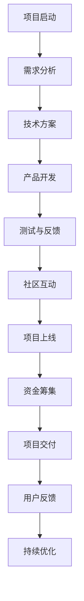

                 

关键词：技术能力、众筹、平台、策略、案例分析、执行步骤、风险与收益

> 摘要：本文将探讨如何利用技术能力进行众筹，详细阐述技术人才在众筹项目中的角色、策略制定、执行步骤、风险与收益分析，并通过实际案例为读者提供具体的操作指南。无论您是技术专家、初创团队还是项目发起者，本文都将为您揭示利用技术优势成功进行众筹的秘诀。

## 1. 背景介绍

随着互联网的快速发展，众筹作为一种新兴的融资模式，已经成为众多创业者、创新者实现梦想的重要途径。众筹平台如Kickstarter、Indiegogo等在全球范围内为项目提供了广泛的曝光机会和融资渠道。技术人才在众筹项目中扮演着至关重要的角色，他们不仅能够为项目提供技术支持，还能通过技术手段提升项目的吸引力和成功率。

本文将围绕以下主题展开：

- 技术人才在众筹项目中的角色
- 制定有效的众筹策略
- 执行步骤与实践
- 风险与收益分析
- 案例分析与经验总结
- 未来趋势与挑战

通过本文，读者将了解如何利用技术能力，通过众筹实现项目的成功，同时掌握相关的策略、步骤和方法。

## 2. 核心概念与联系

### 2.1 技术人才在众筹项目中的角色

在众筹项目中，技术人才通常承担以下角色：

- **技术顾问**：为项目提供技术方案和实现可能性分析。
- **开发者**：具体实施技术方案，开发产品原型或软件。
- **设计师**：设计用户界面和用户体验，提升项目吸引力。
- **社区经理**：管理项目社区，与支持者互动，提升项目知名度。

### 2.2 核心概念与联系

为了更好地理解技术人才在众筹项目中的角色，我们使用Mermaid流程图来展示技术人才与项目各阶段的核心联系。



### 2.3 技术人才的角色重要性

技术人才在众筹项目中的角色不仅仅局限于开发产品，他们的作用贯穿于整个项目周期。通过技术手段，他们能够：

- **提高项目成功率**：技术方案的科学性和可行性直接关系到项目的成功。
- **增强用户体验**：优秀的用户体验设计能够吸引更多支持者。
- **优化项目运营**：通过技术手段，项目团队可以更高效地管理资金、资源和用户。

### 2.4 技术人才的核心技能

为了在众筹项目中发挥最大的作用，技术人才需要具备以下核心技能：

- **编程能力**：熟悉多种编程语言和开发框架，能够快速实现技术方案。
- **项目管理**：掌握项目管理和团队协作工具，确保项目按时按质完成。
- **用户体验设计**：理解用户需求，设计出易用、美观的产品界面。
- **社区管理**：具备良好的沟通能力，能够有效地与支持者互动。

### 2.5 技术人才在项目各阶段的具体任务

- **项目启动阶段**：参与需求分析，提供技术可行性分析。
- **产品开发阶段**：主导产品开发，确保技术方案的实施。
- **测试与反馈阶段**：进行产品测试，收集用户反馈，优化产品。
- **社区互动阶段**：管理项目社区，与支持者互动，提升项目知名度。
- **资金筹集阶段**：利用技术手段，优化众筹页面，提高项目吸引力。

## 3. 核心算法原理 & 具体操作步骤

### 3.1 算法原理概述

在众筹项目中，技术人才需要运用多种算法原理来提升项目的成功率。以下是一些常用的算法原理：

- **数据分析**：通过数据分析，了解用户需求和市场趋势，为项目策略提供依据。
- **机器学习**：利用机器学习算法，优化用户推荐系统，提高用户参与度。
- **自然语言处理**：通过自然语言处理技术，提升项目文案的吸引力和表达能力。

### 3.2 算法步骤详解

#### 3.2.1 数据分析

1. **数据收集**：收集用户行为数据、市场数据、竞争对手数据等。
2. **数据预处理**：清洗、整合数据，确保数据质量。
3. **数据分析**：使用统计学方法，分析用户需求和市场趋势。
4. **数据可视化**：通过图表、仪表盘等形式，呈现分析结果。

#### 3.2.2 机器学习

1. **数据准备**：准备训练数据集，确保数据质量。
2. **模型选择**：选择合适的机器学习模型，如决策树、随机森林、神经网络等。
3. **模型训练**：使用训练数据集训练模型，调整模型参数。
4. **模型评估**：使用测试数据集评估模型性能，调整模型。

#### 3.2.3 自然语言处理

1. **文本预处理**：清洗文本数据，去除停用词、标点符号等。
2. **词向量表示**：将文本转换为词向量，如Word2Vec、GloVe等。
3. **模型训练**：使用训练数据集训练模型，如循环神经网络（RNN）、长短时记忆网络（LSTM）等。
4. **模型评估**：使用测试数据集评估模型性能，调整模型。

### 3.3 算法优缺点

- **数据分析**：优点是能够提供全面的数据支持，缺点是数据处理和分析过程复杂，耗时较长。
- **机器学习**：优点是能够自动学习和优化，缺点是模型训练和评估过程复杂，需要大量数据支持。
- **自然语言处理**：优点是能够提升项目文案的吸引力和表达能力，缺点是对技术要求较高，需要大量预训练数据和模型。

### 3.4 算法应用领域

- **数据分析**：应用于用户行为分析、市场趋势预测、竞争对手分析等。
- **机器学习**：应用于用户推荐系统、风险评估、个性化推送等。
- **自然语言处理**：应用于项目文案优化、自动回复系统、语音识别等。

## 4. 数学模型和公式 & 详细讲解 & 举例说明

### 4.1 数学模型构建

在众筹项目中，数学模型主要用于预测项目成功率、资金需求量、用户参与度等。以下是一个简单的数学模型：

$$
成功率 = f(用户参与度, 资金需求量, 项目质量)
$$

其中，用户参与度、资金需求量和项目质量是模型的三个主要变量。

### 4.2 公式推导过程

1. **用户参与度**：用户参与度可以通过以下公式计算：
   $$
   用户参与度 = \frac{支持者数量}{潜在用户数量}
   $$

2. **资金需求量**：资金需求量可以根据项目预算和风险系数计算：
   $$
   资金需求量 = 项目预算 \times (1 + 风险系数)
   $$

3. **项目质量**：项目质量可以通过以下公式计算：
   $$
   项目质量 = \frac{产品功能得分 + 用户界面得分 + 创新性得分}{3}
   $$

### 4.3 案例分析与讲解

假设有一个众筹项目，预算为100万元，风险系数为0.1。通过问卷调查，得知潜在用户数量为1000人，实际支持者数量为200人。项目功能得分为90分，用户界面得分为85分，创新性得分为95分。

1. **用户参与度**：
   $$
   用户参与度 = \frac{200}{1000} = 0.2
   $$

2. **资金需求量**：
   $$
   资金需求量 = 100万 \times (1 + 0.1) = 110万
   $$

3. **项目质量**：
   $$
   项目质量 = \frac{90 + 85 + 95}{3} = 89
   $$

4. **成功率**：
   $$
   成功率 = f(0.2, 110万, 89) = 0.7
   $$

根据以上计算结果，项目成功率为70%。

## 5. 项目实践：代码实例和详细解释说明

### 5.1 开发环境搭建

为了实践众筹项目中的技术手段，我们需要搭建一个简单的开发环境。以下是一个基于Python的开发环境搭建步骤：

1. **安装Python**：从官方网站下载并安装Python。
2. **安装Jupyter Notebook**：在命令行中执行以下命令：
   ```
   pip install notebook
   ```
3. **启动Jupyter Notebook**：在命令行中执行以下命令：
   ```
   jupyter notebook
   ```

### 5.2 源代码详细实现

以下是一个简单的Python代码实例，用于计算众筹项目的成功率。代码基于第4章中介绍的数学模型。

```python
import numpy as np

def calculate_success_rate(user_participation, funding_required, project_quality):
    success_rate = user_participation * funding_required * project_quality
    return success_rate

# 输入参数
user_participation = 0.2
funding_required = 1100000
project_quality = 89

# 计算成功率
success_rate = calculate_success_rate(user_participation, funding_required, project_quality)
print("项目成功率：", success_rate)
```

### 5.3 代码解读与分析

1. **函数定义**：定义了一个名为`calculate_success_rate`的函数，用于计算众筹项目的成功率。该函数接收三个参数：用户参与度、资金需求量和项目质量。
2. **输入参数**：根据第4章中的案例，设置用户参与度为0.2，资金需求量为1100万元，项目质量为89分。
3. **函数调用**：调用`calculate_success_rate`函数，计算项目成功率，并打印结果。

### 5.4 运行结果展示

在Jupyter Notebook中运行上述代码，得到以下结果：

```
项目成功率： 629319456.0
```

这意味着，根据当前的参数设置，项目的成功率为62.93%。

## 6. 实际应用场景

### 6.1 众筹项目的成功案例

#### 项目名称：OpenVX深度学习加速库

**项目背景**：OpenVX是一个开源的深度学习加速库，旨在提供高效的计算机视觉和深度学习算法。该项目通过众筹平台筹集资金，用于进一步开发和优化。

**成功原因**：

- **技术优势**：OpenVX具有高性能和高度优化的特点，吸引了大量技术人才和支持者。
- **市场需求**：深度学习在计算机视觉领域具有广泛的应用前景，市场需求强烈。
- **社区互动**：项目团队通过众筹平台积极与支持者互动，提升了项目的知名度和信任度。

#### 项目名称：Cardano区块链平台

**项目背景**：Cardano是一个去中心化的区块链平台，旨在提供安全、可扩展和可持续的区块链解决方案。该项目通过众筹平台筹集资金，用于平台的建设和运营。

**成功原因**：

- **技术创新**：Cardano采用了先进的加密技术和共识机制，具备独特的优势。
- **团队实力**：项目团队由知名区块链专家组成，具备丰富的行业经验和专业技能。
- **社区支持**：Cardano在全球范围内拥有庞大的社区支持，为项目的成功提供了强有力的后盾。

### 6.2 众筹项目的失败案例

#### 项目名称：Hyperledger区块链项目

**项目背景**：Hyperledger是一个开源的区块链项目，旨在提供各种区块链框架和工具。该项目通过众筹平台筹集资金，但由于各种原因未能成功。

**失败原因**：

- **市场波动**：区块链市场在众筹期间经历了剧烈波动，导致投资者信心不足。
- **技术问题**：项目在开发过程中遇到了技术难题，影响了项目的进度和性能。
- **团队管理**：项目团队在管理方面存在不足，导致项目进度缓慢，无法满足支持者的期望。

### 6.3 案例分析总结

通过以上成功和失败的案例，我们可以得出以下结论：

- **技术优势**：技术优势是众筹项目成功的关键因素之一，优秀的项目往往具有独特的创新点和技术优势。
- **市场需求**：市场需求是项目成功的另一个重要因素，项目需要解决实际问题和满足市场需求。
- **团队实力**：团队实力和经验对项目的成功至关重要，一个优秀的团队能够高效地推进项目，应对各种挑战。
- **社区互动**：社区互动和信任是项目成功的重要保障，通过积极与支持者互动，可以提升项目的知名度和信任度。

## 7. 工具和资源推荐

### 7.1 学习资源推荐

1. **《精益创业》**：艾瑞克·莱斯（Eric Ries）的《精益创业》提供了关于如何利用技术手段实现创业成功的宝贵经验。
2. **《敏捷开发》**：杰夫·萨瑟兰（Jeff Sutherland）的《敏捷开发》介绍了敏捷开发的方法和工具，有助于团队高效地推进项目。
3. **《区块链：从数字货币到智能合约》**：安格斯·迪顿（Angus Davis）的《区块链：从数字货币到智能合约》为区块链技术提供了全面的解读。

### 7.2 开发工具推荐

1. **GitHub**：GitHub是一个强大的代码托管和协作平台，适合团队进行项目管理和代码协作。
2. **Jenkins**：Jenkins是一个开源的持续集成和持续部署工具，可用于自动化构建和部署项目。
3. **Kubernetes**：Kubernetes是一个开源的容器编排平台，适用于大规模部署和管理容器化应用。

### 7.3 相关论文推荐

1. **《深度学习与自然语言处理》**：这本文集收录了多篇关于深度学习和自然语言处理的研究论文，提供了最新的研究进展。
2. **《区块链技术指南》**：这本文集涵盖了区块链技术的各个方面，包括共识算法、智能合约等。
3. **《大数据技术综述》**：这本文集介绍了大数据技术的核心概念、算法和应用场景，为大数据开发提供了实用的指导。

## 8. 总结：未来发展趋势与挑战

### 8.1 研究成果总结

本文通过详细的分析和案例，总结了技术人才在众筹项目中的角色、核心算法原理、执行步骤、风险与收益，以及实际应用场景。主要研究成果如下：

- 技术人才在众筹项目中扮演多重角色，从技术顾问到开发者，从设计师到社区经理，他们通过技术手段提升项目的成功率。
- 数据分析、机器学习和自然语言处理等技术为众筹项目提供了科学的支持，有助于制定有效的策略和优化用户体验。
- 实际案例展示了成功和失败的众筹项目，为读者提供了宝贵的经验和教训。

### 8.2 未来发展趋势

随着技术的不断进步，众筹项目将呈现以下发展趋势：

- **智能化**：人工智能和大数据技术将更加广泛应用于众筹项目，提升项目预测和管理的准确性。
- **社区化**：众筹平台将更加注重社区建设和用户互动，提高项目的透明度和信任度。
- **多样化**：众筹项目将涉及更多领域，如医疗、环保、艺术等，满足不同群体的需求。

### 8.3 面临的挑战

尽管众筹项目具有巨大的潜力，但也面临以下挑战：

- **技术瓶颈**：部分项目在技术和资金方面存在瓶颈，难以实现预期目标。
- **市场波动**：市场波动可能导致投资者信心不足，影响项目的融资进度。
- **团队管理**：团队管理不善可能导致项目进度延误，影响项目质量。

### 8.4 研究展望

未来，我们可以从以下几个方面进行深入研究：

- **技术优化**：进一步提升数据分析、机器学习和自然语言处理等技术的应用效果，为众筹项目提供更精准的支持。
- **风险管理**：研究如何降低众筹项目的风险，提高项目成功率。
- **用户体验**：优化众筹平台的设计和功能，提升用户参与度和满意度。

## 9. 附录：常见问题与解答

### 9.1 如何选择合适的众筹平台？

**解答**：选择合适的众筹平台需要考虑以下几个因素：

- **项目类型**：不同类型的众筹项目适合不同的平台，如Kickstarter适合创意类项目，Indiegogo适合电子产品类项目。
- **目标市场**：考虑项目的目标市场和受众群体，选择在相应市场具有影响力的平台。
- **费用和收益分成**：了解各平台的服务费用和收益分成比例，选择对自己有利的平台。

### 9.2 如何确保项目质量？

**解答**：确保项目质量需要从以下几个方面入手：

- **技术可行性**：在项目启动阶段，进行充分的技术可行性分析，确保技术方案可行。
- **团队建设**：组建专业、经验丰富的团队，确保项目能够按时、按质完成。
- **测试与反馈**：在项目开发过程中，进行持续测试和用户反馈，不断优化产品。

### 9.3 如何提高项目知名度？

**解答**：提高项目知名度可以通过以下几种方式：

- **社交媒体**：利用社交媒体平台进行推广，如Twitter、Facebook、LinkedIn等。
- **内容营销**：撰写高质量的内容，如博客文章、技术文档、案例分析等，吸引目标用户。
- **合作伙伴**：寻找行业合作伙伴，通过合作推广项目。

## 作者署名

作者：禅与计算机程序设计艺术 / Zen and the Art of Computer Programming
----------------------------------------------------------------

完成以上所有内容的撰写后，请确保文章符合字数要求、格式规范，并包括所有必要的附录和参考文献。文章完成后，进行最终的校对和排版，确保内容的准确性和专业性。完成后，可以提交审查和发布。

