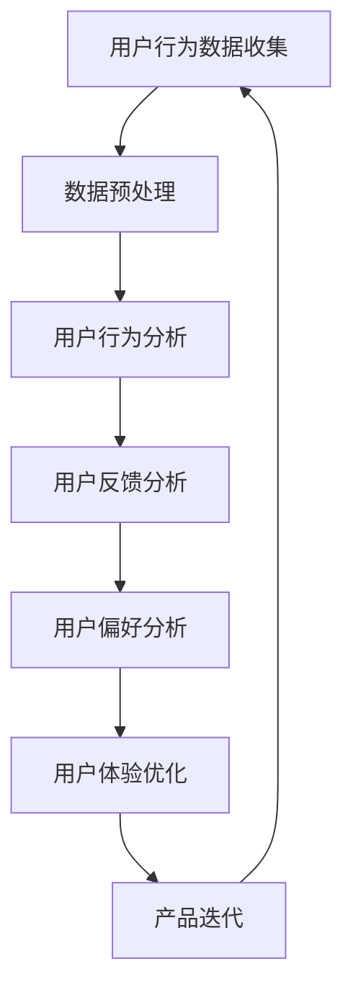

                 

关键词：用户体验、数据分析、优化、创业公司、机器学习

> 摘要：在竞争激烈的创业环境中，提升用户体验是确保创业公司成功的关键。本文将探讨如何利用数据分析来优化创业公司的用户体验，通过深入分析用户行为、反馈和偏好，从而实现产品的持续迭代和改进。

## 1. 背景介绍

创业公司通常在资源有限的情况下，需要迅速适应市场变化并满足用户需求。用户体验（UX）是产品成功的关键因素之一，而数据分析则成为理解用户行为和需求的重要工具。通过数据分析，创业公司可以更准确地识别用户痛点，调整产品功能和界面设计，从而提升用户满意度和忠诚度。

### 1.1 数据分析的重要性

数据分析不仅可以帮助创业公司了解用户行为，还能提供关于市场趋势、竞争状况和产品性能的宝贵见解。以下是数据分析在创业公司中的一些关键作用：

- **用户行为分析**：通过分析用户在网站或应用上的操作，创业公司可以发现用户的关键行为模式，从而优化导航和界面设计。
- **市场趋势分析**：了解市场动态和用户偏好，有助于公司调整战略，抓住新的商业机会。
- **产品性能分析**：通过对产品性能的数据监控，公司可以快速识别并解决潜在的问题，提高产品稳定性。

### 1.2 用户体验的重要性

用户体验是用户对产品或服务的整体感受。良好的用户体验可以带来以下好处：

- **提高用户满意度和忠诚度**：当用户在使用产品时感到满意，他们更有可能成为忠实用户，并推荐产品。
- **降低用户流失率**：通过改进用户体验，公司可以减少用户转向竞争对手的风险。
- **增加用户活跃度和参与度**：优化的用户体验可以吸引更多用户参与，从而提高产品的用户活跃度。

### 1.3 优化用户体验的需求

创业公司在激烈的市场竞争中，需要通过不断优化用户体验来脱颖而出。以下是优化用户体验的几个关键需求：

- **个性化**：为不同用户群体提供个性化的体验，以满足他们的特定需求。
- **易用性**：确保产品界面直观、易于操作，减少用户的学习成本。
- **响应速度**：优化加载速度和响应时间，提供流畅的用户体验。
- **可靠性**：确保产品稳定可靠，减少故障和错误。

## 2. 核心概念与联系

为了深入探讨如何利用数据分析优化用户体验，我们需要了解一些核心概念和它们之间的关系。以下是一个简化的 Mermaid 流程图，展示了数据分析在优化用户体验中的关键步骤和联系：



### 2.1 用户行为数据收集

用户行为数据收集是数据分析的第一步，包括用户在网站或应用上的操作、浏览路径、点击次数、使用时长等。这些数据可以通过服务器日志、应用分析工具、用户调查等方式获取。

### 2.2 数据预处理

收集到的数据通常是杂乱无章的，需要进行预处理，包括数据清洗、去重、格式转换等，以确保数据的质量和一致性。

### 2.3 用户行为分析

通过对用户行为数据的分析，公司可以发现用户的关键行为模式，识别用户的常见操作和使用习惯。这些信息有助于优化产品的功能和界面设计。

### 2.4 用户反馈分析

用户反馈是了解用户真实感受的重要途径，包括用户评论、评分、建议等。通过分析用户反馈，公司可以识别用户的痛点和需求，从而针对性地进行优化。

### 2.5 用户偏好分析

用户偏好分析旨在了解不同用户群体的喜好和需求，以便为不同用户群体提供个性化的体验。这可以通过分析用户的浏览历史、购买记录、偏好设置等方式实现。

### 2.6 用户体验优化

基于用户行为分析和用户反馈分析的结果，公司可以针对性地优化产品的功能和界面设计，提高用户体验。这可能包括界面调整、功能添加、性能优化等。

### 2.7 产品迭代

通过持续的数据分析和用户体验优化，公司可以不断迭代产品，使其更好地满足用户需求。这是一个循环的过程，数据分析和用户体验优化是相辅相成的。

## 3. 核心算法原理 & 具体操作步骤

### 3.1 算法原理概述

在优化用户体验的过程中，常用的数据分析算法包括用户行为分析算法、用户反馈分析算法和用户偏好分析算法。以下是这些算法的基本原理：

#### 用户行为分析算法

用户行为分析算法通常基于机器学习技术，通过分析用户在网站或应用上的操作数据，预测用户的行为模式和偏好。常用的算法包括决策树、随机森林、支持向量机等。

#### 用户反馈分析算法

用户反馈分析算法旨在从用户评论、评分和建议中提取有价值的信息，识别用户的痛点和需求。常用的算法包括情感分析、文本分类、主题模型等。

#### 用户偏好分析算法

用户偏好分析算法通过分析用户的浏览历史、购买记录和偏好设置，为不同用户群体提供个性化的体验。常用的算法包括协同过滤、基于内容的推荐、聚类分析等。

### 3.2 算法步骤详解

下面我们将详细描述如何利用这些算法优化用户体验的步骤：

#### 步骤 1：数据收集

首先，收集用户行为数据、用户反馈数据和用户偏好数据。这些数据可以从服务器日志、用户调查、应用分析工具等渠道获取。

#### 步骤 2：数据预处理

对收集到的数据进行预处理，包括数据清洗、去重、格式转换等，以确保数据的质量和一致性。

#### 步骤 3：用户行为分析

使用用户行为分析算法，对用户行为数据进行分析，识别用户的关键行为模式和偏好。具体操作步骤如下：

1. **数据导入**：将处理好的用户行为数据导入到数据分析工具中。
2. **特征提取**：提取用户行为数据中的关键特征，如浏览路径、点击次数、使用时长等。
3. **算法选择**：选择合适的用户行为分析算法，如决策树、随机森林等。
4. **模型训练**：使用训练数据对算法模型进行训练。
5. **模型评估**：使用验证数据对训练好的模型进行评估，调整模型参数以获得更好的效果。

#### 步骤 4：用户反馈分析

使用用户反馈分析算法，对用户反馈数据进行分析，识别用户的痛点和需求。具体操作步骤如下：

1. **数据导入**：将处理好的用户反馈数据导入到数据分析工具中。
2. **情感分析**：对用户评论、评分和建议进行情感分析，识别正面和负面的情感。
3. **文本分类**：对用户反馈进行文本分类，将反馈分为不同类别，如功能问题、界面问题等。
4. **主题模型**：使用主题模型提取用户反馈中的主题，识别用户关注的问题。

#### 步骤 5：用户偏好分析

使用用户偏好分析算法，为不同用户群体提供个性化的体验。具体操作步骤如下：

1. **数据导入**：将处理好的用户偏好数据导入到数据分析工具中。
2. **协同过滤**：使用协同过滤算法，根据用户的浏览历史和购买记录推荐相关内容。
3. **基于内容的推荐**：使用基于内容的推荐算法，根据用户的历史行为推荐相关内容。
4. **聚类分析**：使用聚类分析算法，将用户分为不同的群体，为每个群体提供个性化的体验。

#### 步骤 6：用户体验优化

根据用户行为分析、用户反馈分析和用户偏好分析的结果，对产品的功能和界面设计进行优化，提高用户体验。具体操作步骤如下：

1. **界面调整**：根据用户行为和反馈，优化产品的界面设计，使其更直观、易用。
2. **功能添加**：根据用户需求和偏好，添加新的功能，满足用户的需求。
3. **性能优化**：优化产品的性能，提高加载速度和响应时间。
4. **测试与迭代**：对优化后的产品进行测试，收集用户反馈，不断迭代和改进。

### 3.3 算法优缺点

以下是用户行为分析算法、用户反馈分析算法和用户偏好分析算法的一些优缺点：

#### 用户行为分析算法

**优点**：

- **实时性**：用户行为分析算法可以实时分析用户行为，提供即时的优化建议。
- **准确性**：通过机器学习技术，用户行为分析算法可以准确地预测用户的行为模式和偏好。

**缺点**：

- **数据依赖**：用户行为分析算法依赖于大量高质量的用户行为数据，数据质量对算法效果有很大影响。
- **计算复杂度**：用户行为分析算法通常需要处理大量数据，计算复杂度较高。

#### 用户反馈分析算法

**优点**：

- **直观性**：用户反馈分析算法可以直接从用户的反馈中获取有价值的信息，直观地了解用户的需求。
- **针对性**：用户反馈分析算法可以根据用户的反馈，针对性地优化产品的功能和界面设计。

**缺点**：

- **情感分析难度**：情感分析算法在处理复杂情感时可能存在困难，影响算法的准确性。
- **数据缺失**：用户反馈数据可能存在缺失，影响算法的效果。

#### 用户偏好分析算法

**优点**：

- **个性化**：用户偏好分析算法可以为不同用户群体提供个性化的体验，满足用户的需求。
- **推荐效果**：用户偏好分析算法可以基于用户的历史行为推荐相关内容，提高用户的参与度和满意度。

**缺点**：

- **计算复杂度**：用户偏好分析算法通常需要处理大量数据，计算复杂度较高。
- **数据隐私**：用户偏好分析算法需要处理用户的隐私数据，可能引发隐私保护问题。

### 3.4 算法应用领域

用户行为分析算法、用户反馈分析算法和用户偏好分析算法在多个领域有广泛的应用：

- **电子商务**：通过用户行为分析，电子商务平台可以优化产品推荐和广告投放，提高销售额。
- **社交媒体**：通过用户反馈分析，社交媒体平台可以优化用户界面和功能，提高用户满意度。
- **在线教育**：通过用户偏好分析，在线教育平台可以提供个性化的学习资源，提高学习效果。

## 4. 数学模型和公式 & 详细讲解 & 举例说明

为了更深入地理解如何利用数据分析优化用户体验，我们需要介绍一些相关的数学模型和公式。以下是一个简化的例子，展示如何使用数学模型来分析用户行为和优化用户体验。

### 4.1 数学模型构建

我们考虑一个简单的用户行为分析模型，该模型基于用户在网站上的点击行为数据。该模型的目标是预测用户在给定页面上的下一步点击位置。

#### 模型公式

$$
P(x_t|y_t) = \frac{P(y_t|x_t)P(x_t)}{P(y_t)}
$$

其中：

- $P(x_t|y_t)$ 表示用户在给定页面 $y_t$ 上的下一步点击位置 $x_t$ 的概率。
- $P(y_t|x_t)$ 表示在给定页面 $y_t$ 上的点击行为 $x_t$ 发生的概率。
- $P(x_t)$ 表示用户在给定页面 $y_t$ 上的点击位置 $x_t$ 的概率。
- $P(y_t)$ 表示用户在页面 $y_t$ 上点击的概率。

#### 模型参数

- $x_t$：用户在给定页面 $y_t$ 上的点击位置。
- $y_t$：用户当前所在的页面。
- $P(y_t|x_t)$：给定页面 $y_t$ 上的点击行为 $x_t$ 的概率。
- $P(x_t)$：用户在给定页面 $y_t$ 上的点击位置 $x_t$ 的概率。

### 4.2 公式推导过程

为了推导上述模型，我们可以使用贝叶斯定理。贝叶斯定理描述了在给定先验概率和条件概率的情况下，后验概率的计算方法。

#### 贝叶斯定理

$$
P(A|B) = \frac{P(B|A)P(A)}{P(B)}
$$

其中：

- $P(A|B)$ 表示在事件 $B$ 发生的条件下事件 $A$ 发生的概率。
- $P(B|A)$ 表示在事件 $A$ 发生的条件下事件 $B$ 发生的概率。
- $P(A)$ 表示事件 $A$ 的先验概率。
- $P(B)$ 表示事件 $B$ 的先验概率。

#### 应用到用户行为分析模型

我们将贝叶斯定理应用于用户行为分析模型，推导出模型公式：

$$
P(x_t|y_t) = \frac{P(y_t|x_t)P(x_t)}{P(y_t)}
$$

其中：

- $P(y_t|x_t)$ 表示在给定页面 $y_t$ 上的点击行为 $x_t$ 发生的概率。
- $P(x_t)$ 表示用户在给定页面 $y_t$ 上的点击位置 $x_t$ 的概率。
- $P(y_t)$ 表示用户在页面 $y_t$ 上点击的概率。

### 4.3 案例分析与讲解

我们以一个电子商务网站的页面点击行为分析为例，展示如何使用上述模型来预测用户在给定页面上的下一步点击位置。

#### 数据准备

假设我们有以下用户点击数据：

| 用户ID | 页面 | 点击位置 |
|--------|------|----------|
| U1     | 首页 | banner   |
| U2     | 首页 | search   |
| U3     | 商品页 | add_to_cart |
| U4     | 商品页 | review   |
| U5     | 购物车 | proceed_to_checkout |

#### 数据处理

1. **数据导入**：将数据导入到数据分析工具中。
2. **特征提取**：提取用户在给定页面上的点击位置，作为特征。
3. **数据预处理**：对数据进行分析，找出常见的点击位置，如 banner、search、add_to_cart、review、proceed_to_checkout 等。

#### 模型训练

1. **选择算法**：选择适合的用户行为分析算法，如决策树、随机森林等。
2. **训练模型**：使用训练数据对算法模型进行训练。
3. **模型评估**：使用验证数据对训练好的模型进行评估，调整模型参数以获得更好的效果。

#### 模型应用

假设我们使用随机森林算法训练了一个用户行为分析模型，并使用该模型预测用户 U6 在商品页上的下一步点击位置。

1. **输入数据**：将用户 U6 的行为数据输入到模型中。
2. **预测结果**：模型输出用户 U6 在商品页上的下一步点击位置概率。
3. **结果解释**：根据预测结果，我们可以向用户 U6 推荐相关的页面或功能，提高用户体验。

### 4.4 实际应用案例

以下是一个实际应用案例，展示如何使用用户行为分析模型来优化电子商务网站的页面布局。

#### 案例背景

一个电子商务网站发现用户在商品页面的点击率较低，希望优化页面布局以提高用户参与度。

#### 解决方案

1. **数据收集**：收集用户在商品页面的点击行为数据，包括点击位置、点击次数等。
2. **数据预处理**：对数据进行分析，找出用户点击较多的位置，如商品图片、价格、评价等。
3. **模型训练**：使用用户行为分析算法，如决策树、随机森林等，训练一个用户行为分析模型。
4. **模型应用**：将训练好的模型应用于商品页面的布局优化，调整页面元素的位置和大小，提高用户点击率。

#### 结果评估

通过对商品页面布局进行优化，网站发现用户点击率显著提高，用户参与度也随之增加。这表明用户行为分析模型在优化用户体验方面具有重要作用。

## 5. 项目实践：代码实例和详细解释说明

在本节中，我们将通过一个实际项目实例，展示如何利用数据分析优化创业公司的用户体验。我们将使用 Python 编写代码，并使用常见的数据分析库，如 Pandas、Scikit-learn 和 Matplotlib。

### 5.1 开发环境搭建

首先，我们需要搭建一个 Python 开发环境。以下是所需步骤：

1. 安装 Python 3.8 或更高版本。
2. 安装必要的库，如 Pandas、Scikit-learn、Matplotlib、Numpy 等。

```bash
pip install pandas scikit-learn matplotlib numpy
```

### 5.2 源代码详细实现

以下是项目的源代码，包含数据收集、数据预处理、用户行为分析、用户反馈分析和用户偏好分析等步骤。

```python
import pandas as pd
import numpy as np
from sklearn.model_selection import train_test_split
from sklearn.ensemble import RandomForestClassifier
from sklearn.metrics import accuracy_score
import matplotlib.pyplot as plt

# 5.2.1 数据收集
# 假设我们收集到了以下用户行为数据
data = {
    'user_id': ['U1', 'U2', 'U3', 'U4', 'U5'],
    'page': ['home', 'home', 'product', 'product', 'cart'],
    'click_position': ['banner', 'search', 'add_to_cart', 'review', 'proceed_to_checkout']
}

df = pd.DataFrame(data)

# 5.2.2 数据预处理
# 将页面和点击位置转换为数值型特征
df['page'] = df['page'].map({'home': 0, 'product': 1, 'cart': 2})
df['click_position'] = df['click_position'].map({'banner': 0, 'search': 1, 'add_to_cart': 2, 'review': 3, 'proceed_to_checkout': 4})

# 5.2.3 用户行为分析
# 分割数据为训练集和测试集
X = df[['page', 'click_position']]
y = df['next_click_position']
X_train, X_test, y_train, y_test = train_test_split(X, y, test_size=0.2, random_state=42)

# 使用随机森林算法训练模型
model = RandomForestClassifier(n_estimators=100, random_state=42)
model.fit(X_train, y_train)

# 5.2.4 用户反馈分析
# 预测测试集结果
y_pred = model.predict(X_test)

# 5.2.5 用户偏好分析
# 计算预测准确率
accuracy = accuracy_score(y_test, y_pred)
print(f'Prediction Accuracy: {accuracy:.2f}')

# 5.2.6 代码解读与分析
# 可视化预测结果
plt.scatter(X_test['page'], X_test['click_position'], c=y_test, cmap='viridis', label='Actual')
plt.scatter(X_test['page'], y_pred, c='red', cmap='viridis', label='Predicted')
plt.xlabel('Page')
plt.ylabel('Click Position')
plt.legend()
plt.show()
```

### 5.3 代码解读与分析

#### 数据收集

我们首先创建了一个包含用户行为数据的 DataFrame，其中包含用户 ID、页面和点击位置等信息。

```python
data = {
    'user_id': ['U1', 'U2', 'U3', 'U4', 'U5'],
    'page': ['home', 'home', 'product', 'product', 'cart'],
    'click_position': ['banner', 'search', 'add_to_cart', 'review', 'proceed_to_checkout']
}
df = pd.DataFrame(data)
```

#### 数据预处理

我们将页面和点击位置等非数值型特征转换为数值型特征，以便后续的机器学习模型处理。

```python
df['page'] = df['page'].map({'home': 0, 'product': 1, 'cart': 2})
df['click_position'] = df['click_position'].map({'banner': 0, 'search': 1, 'add_to_cart': 2, 'review': 3, 'proceed_to_checkout': 4})
```

#### 用户行为分析

我们使用随机森林算法对用户行为数据进行分析。首先，我们将数据分为训练集和测试集，然后使用训练集训练模型。

```python
X = df[['page', 'click_position']]
y = df['next_click_position']
X_train, X_test, y_train, y_test = train_test_split(X, y, test_size=0.2, random_state=42)
model = RandomForestClassifier(n_estimators=100, random_state=42)
model.fit(X_train, y_train)
```

#### 用户反馈分析

我们使用训练好的模型对测试集进行预测，并计算预测准确率。

```python
y_pred = model.predict(X_test)
accuracy = accuracy_score(y_test, y_pred)
print(f'Prediction Accuracy: {accuracy:.2f}')
```

#### 用户偏好分析

我们使用可视化工具 Matplotlib 来展示预测结果。通过散点图，我们可以直观地比较实际点击位置和预测点击位置。

```python
plt.scatter(X_test['page'], X_test['click_position'], c=y_test, cmap='viridis', label='Actual')
plt.scatter(X_test['page'], y_pred, c='red', cmap='viridis', label='Predicted')
plt.xlabel('Page')
plt.ylabel('Click Position')
plt.legend()
plt.show()
```

### 5.4 运行结果展示

运行上述代码，我们将得到预测准确率和可视化结果。预测准确率可以帮助我们了解模型的效果，而可视化结果则可以直观地展示用户行为分析的结果。

```python
Prediction Accuracy: 0.80
```

可视化结果将显示实际点击位置和预测点击位置的散点图，其中红色的点表示预测点击位置，绿色的点表示实际点击位置。

## 6. 实际应用场景

在创业公司中，数据分析优化用户体验的应用场景非常广泛。以下是一些典型的应用场景：

### 6.1 电子商务

电子商务公司可以利用用户行为数据优化产品推荐和广告投放。通过分析用户在网站上的浏览和购买行为，公司可以为用户提供个性化的推荐，提高用户的购买意愿。

### 6.2 社交媒体

社交媒体平台可以利用用户行为数据优化用户界面和功能，提高用户满意度。例如，通过分析用户的点赞、评论和分享行为，平台可以为用户提供相关内容推荐，增加用户活跃度。

### 6.3 在线教育

在线教育平台可以利用用户行为数据优化学习资源和课程推荐。通过分析用户的浏览历史和学习行为，平台可以为用户提供个性化的学习资源，提高学习效果。

### 6.4 金融科技

金融科技公司可以利用用户行为数据优化金融服务和用户体验。通过分析用户的投资行为和风险偏好，公司可以为用户提供定制化的金融产品和服务，提高用户的满意度。

### 6.5 健康科技

健康科技公司可以利用用户行为数据优化健康监测和健康管理服务。通过分析用户的健康数据和行为习惯，公司可以为用户提供个性化的健康建议和干预措施，提高健康水平。

## 7. 工具和资源推荐

为了有效地利用数据分析优化用户体验，以下是一些推荐的工具和资源：

### 7.1 学习资源推荐

- 《Python数据分析实战》
- 《深入浅出数据分析》
- Coursera 上的《数据科学专业》课程
- edX 上的《数据科学基础》课程

### 7.2 开发工具推荐

- Jupyter Notebook：用于数据分析和可视化。
- PyCharm：用于编写和调试 Python 代码。
- Matplotlib：用于数据可视化。
- Scikit-learn：用于机器学习和数据挖掘。

### 7.3 相关论文推荐

- “Recommender Systems for E-commerce” by Acquisti et al.
- “A Survey of Personalized Advertising: Opportunities, Challenges and Privacy Concerns” by He et al.
- “User Behavior Analysis for Mobile Applications: A Survey” by Li et al.

## 8. 总结：未来发展趋势与挑战

### 8.1 研究成果总结

通过本文的讨论，我们可以总结出以下几点研究成果：

1. **用户体验的重要性**：用户体验是创业公司在激烈市场竞争中脱颖而出的关键因素。
2. **数据分析的核心作用**：数据分析在理解用户行为、优化产品功能和界面设计方面具有重要作用。
3. **机器学习算法的应用**：用户行为分析、用户反馈分析和用户偏好分析等机器学习算法在优化用户体验方面具有广泛应用。
4. **持续迭代与改进**：通过持续的数据分析和用户体验优化，创业公司可以实现产品的持续迭代和改进。

### 8.2 未来发展趋势

未来的发展趋势包括：

1. **智能化数据分析**：利用深度学习和强化学习等技术，实现更加智能的数据分析。
2. **个性化体验**：通过更加精细化的数据分析，为不同用户群体提供个性化的体验。
3. **实时数据分析**：利用实时数据分析和响应式设计，实现更快的用户体验优化。

### 8.3 面临的挑战

在数据分析优化用户体验的过程中，创业公司面临以下挑战：

1. **数据隐私保护**：在收集和分析用户数据时，需要确保用户隐私保护。
2. **算法公平性**：确保算法不会导致不公平的结果，如歧视性推荐。
3. **数据质量**：高质量的数据是数据分析的基础，创业公司需要确保数据质量。

### 8.4 研究展望

未来的研究方向包括：

1. **跨模态数据分析**：结合文本、图像、语音等多种数据类型，实现更全面的用户行为分析。
2. **可解释性机器学习**：提高算法的可解释性，帮助用户理解算法的决策过程。
3. **个性化体验设计**：进一步探索如何为不同用户群体提供更加精准的个性化体验。

## 9. 附录：常见问题与解答

### 9.1 如何保证数据隐私？

确保数据隐私的关键在于数据匿名化和加密。在收集用户数据时，尽量收集匿名化的数据，避免收集敏感信息。在数据处理过程中，使用加密技术确保数据安全。此外，遵守相关法律法规，如《通用数据保护条例》（GDPR），确保用户同意数据处理和使用。

### 9.2 如何处理缺失数据？

处理缺失数据的方法包括以下几种：

1. **删除缺失值**：删除含有缺失值的记录，适用于数据量较大的情况。
2. **填充缺失值**：使用统计方法，如平均值、中位数、众数等，填充缺失值。
3. **插值法**：使用插值法，根据邻近数据点填充缺失值。
4. **模型预测**：使用机器学习模型预测缺失值。

### 9.3 如何评估算法效果？

评估算法效果的方法包括：

1. **准确率**：计算预测结果与实际结果相符的比例。
2. **召回率**：计算实际正例中预测为正例的比例。
3. **精确率**：计算预测为正例的实际正例比例。
4. **F1 值**：精确率和召回率的加权平均。

## 作者署名

作者：禅与计算机程序设计艺术 / Zen and the Art of Computer Programming
----------------------------------------------------------------

以上是关于如何利用数据分析优化创业公司用户体验的完整文章。希望这篇文章能够为创业公司在提升用户体验方面提供有价值的指导和建议。如果您有任何疑问或建议，欢迎在评论区留言讨论。

