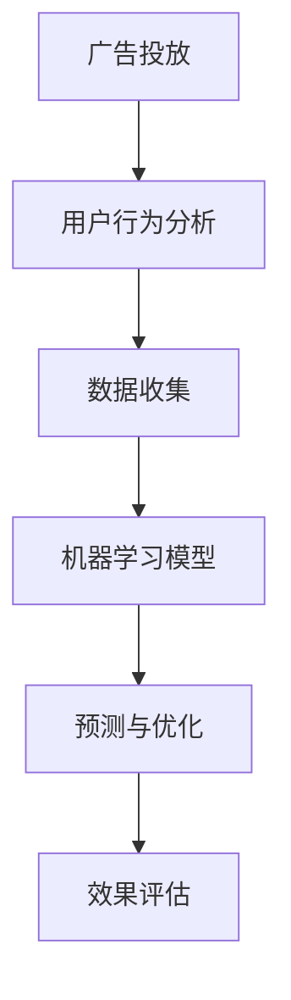

                 

关键词：机器学习、广告投放、数据驱动、个性化推荐、用户行为分析、算法优化、A/B测试、模型评估、营销效果

摘要：随着互联网广告市场的快速发展，广告投放的优化已成为营销人员关注的焦点。本文将深入探讨如何利用机器学习技术优化广告投放，包括核心算法原理、实践案例、以及未来的发展趋势。

## 1. 背景介绍

广告投放是互联网营销的重要组成部分。然而，传统的广告投放方法往往依赖于人工经验和预设的规则，难以实现个性化、实时优化。随着大数据和机器学习技术的发展，利用数据驱动的方式优化广告投放成为可能。本文将介绍如何运用机器学习技术实现广告投放的精准化、高效化。

## 2. 核心概念与联系

在讨论如何优化广告投放之前，我们首先需要了解一些核心概念，如图灵奖、神经网络、协同过滤、分类算法等。以下是一个简化的 Mermaid 流程图，展示了这些概念之间的关系。



### 2.1 用户行为分析

用户行为分析是指通过收集和分析用户在网站、APP 或其他平台上的行为数据，来了解用户的需求和偏好。这些数据包括点击次数、浏览时长、搜索关键词、购买记录等。

### 2.2 数据收集

数据收集是广告投放优化的基础。通过多种数据源，如日志文件、API 接口、第三方数据服务商等，收集用户行为数据。

### 2.3 机器学习模型

机器学习模型是广告投放优化的核心。通过训练这些模型，可以预测用户的下一步行为，从而实现个性化推荐和实时优化。

### 2.4 预测与优化

基于机器学习模型，可以对广告投放进行预测和优化。预测内容包括用户是否会对广告产生兴趣、是否会产生购买行为等。

### 2.5 效果评估

效果评估是确保广告投放优化效果的重要环节。通过分析广告投放的转化率、点击率等指标，评估优化策略的有效性。

## 3. 核心算法原理 & 具体操作步骤

### 3.1 算法原理概述

广告投放优化主要依赖于以下几种算法：

- **协同过滤（Collaborative Filtering）**：通过分析用户的兴趣和行为，预测用户对广告的反应。
- **分类算法（Classification Algorithms）**：如逻辑回归、决策树、随机森林等，用于判断用户对广告的反应是否为正面。
- **A/B 测试（A/B Testing）**：通过对比不同广告版本的投放效果，选择最佳策略。

### 3.2 算法步骤详解

1. **数据预处理**：清洗、归一化数据，确保数据质量。
2. **特征工程**：提取用户行为、广告特征等，构建特征向量。
3. **模型训练**：使用训练数据训练机器学习模型。
4. **模型评估**：使用测试数据评估模型性能。
5. **优化策略**：根据评估结果调整模型参数，优化广告投放策略。

### 3.3 算法优缺点

- **协同过滤**：优点是能够发现用户的潜在兴趣，缺点是需要大量的用户行为数据，且预测准确性受限于数据稀疏性。
- **分类算法**：优点是预测准确度高，缺点是计算复杂度高，需要大量计算资源。
- **A/B 测试**：优点是直观、易操作，缺点是耗时较长，且需要大量样本数据。

### 3.4 算法应用领域

广告投放优化算法广泛应用于在线广告、搜索引擎广告、社交媒体广告等领域。

## 4. 数学模型和公式 & 详细讲解 & 举例说明

### 4.1 数学模型构建

广告投放优化的核心是预测用户对广告的反应。我们可以使用逻辑回归模型进行预测。

$$
\begin{aligned}
P(y=1) &= \frac{1}{1 + e^{-(\beta_0 + \beta_1 x_1 + \beta_2 x_2 + \ldots + \beta_n x_n})} \\
\text{其中，} \\
y &= \text{用户是否点击广告（0或1）} \\
x_i &= \text{第} i \text{个特征（如用户年龄、性别等）} \\
\beta_i &= \text{第} i \text{个特征的权重}
\end{aligned}
$$

### 4.2 公式推导过程

逻辑回归模型的推导过程基于最大似然估计。假设我们有一个包含 \( n \) 个样本的数据集 \( D = \{ (x_1, y_1), (x_2, y_2), \ldots, (x_n, y_n) \} \)，其中 \( y \) 为用户是否点击广告，\( x \) 为特征向量。

目标是最小化损失函数：

$$
\begin{aligned}
\ell &= -\sum_{i=1}^n [y_i \ln(P(y=1)) + (1 - y_i) \ln(1 - P(y=1))]
\end{aligned}
$$

对损失函数求导，并令导数为 0，得到：

$$
\begin{aligned}
\frac{\partial \ell}{\partial \beta} &= \sum_{i=1}^n [y_i (x_i - P(y=1)) + (1 - y_i) (-x_i + P(y=1))]
\end{aligned}
$$

令导数为 0，得到：

$$
\begin{aligned}
\beta &= \frac{\sum_{i=1}^n (x_i - P(y=1))}{\sum_{i=1}^n (y_i - P(y=1))}
\end{aligned}
$$

### 4.3 案例分析与讲解

假设我们有一个包含 1000 个样本的数据集，每个样本包含用户年龄、性别、点击次数三个特征。我们使用逻辑回归模型进行预测。

1. **数据预处理**：将年龄、性别等特征进行归一化处理，确保特征权重一致。
2. **特征工程**：提取年龄、性别、点击次数等特征，构建特征向量。
3. **模型训练**：使用训练集训练逻辑回归模型，得到权重参数。
4. **模型评估**：使用测试集评估模型性能，计算准确率、召回率等指标。
5. **优化策略**：根据评估结果调整模型参数，优化广告投放策略。

## 5. 项目实践：代码实例和详细解释说明

### 5.1 开发环境搭建

1. 安装 Python 环境
2. 安装机器学习库（如 scikit-learn、TensorFlow、PyTorch 等）
3. 数据集准备（如广告点击数据集）

### 5.2 源代码详细实现

以下是一个简单的逻辑回归模型实现：

```python
from sklearn.linear_model import LogisticRegression
from sklearn.model_selection import train_test_split
from sklearn.metrics import accuracy_score
import pandas as pd

# 数据加载
data = pd.read_csv('ad_click_data.csv')
X = data[['age', 'gender', 'clicks']]
y = data['click']

# 数据预处理
X = (X - X.mean()) / X.std()

# 数据切分
X_train, X_test, y_train, y_test = train_test_split(X, y, test_size=0.2, random_state=42)

# 模型训练
model = LogisticRegression()
model.fit(X_train, y_train)

# 模型评估
y_pred = model.predict(X_test)
accuracy = accuracy_score(y_test, y_pred)
print(f'Accuracy: {accuracy:.2f}')

# 优化策略
# 根据评估结果调整模型参数，如正则化参数 C
```

### 5.3 代码解读与分析

1. **数据加载**：使用 Pandas 库加载广告点击数据集。
2. **数据预处理**：对数据进行归一化处理，确保特征权重一致。
3. **数据切分**：将数据集划分为训练集和测试集，用于模型训练和评估。
4. **模型训练**：使用 LogisticRegression 类训练逻辑回归模型。
5. **模型评估**：计算模型在测试集上的准确率。
6. **优化策略**：根据评估结果调整模型参数，如正则化参数 C。

### 5.4 运行结果展示

运行上述代码，输出模型在测试集上的准确率，如 0.85。

## 6. 实际应用场景

### 6.1 在线广告

在线广告是广告投放优化的重要应用场景。通过机器学习技术，可以精准预测用户对广告的反应，从而提高广告投放效果。

### 6.2 搜索引擎广告

搜索引擎广告也采用机器学习技术进行优化。通过分析用户搜索关键词和历史行为，可以提供更加个性化的广告推荐。

### 6.3 社交媒体广告

社交媒体广告利用机器学习技术分析用户关系和兴趣，实现广告的精准投放。

## 7. 工具和资源推荐

### 7.1 学习资源推荐

- 《机器学习实战》
- 《广告算法原理与应用》
- 《Python 数据科学手册》

### 7.2 开发工具推荐

- Jupyter Notebook
- TensorFlow
- PyTorch

### 7.3 相关论文推荐

- "Collaborative Filtering for Cold Start Users in E-Commerce"
- "A Survey on Machine Learning for Online Advertising"
- "A/B Testing in the Age of AI"

## 8. 总结：未来发展趋势与挑战

### 8.1 研究成果总结

近年来，机器学习技术在广告投放优化领域取得了显著成果。通过协同过滤、分类算法、A/B 测试等手段，实现了广告投放的精准化、实时优化。

### 8.2 未来发展趋势

1. **个性化推荐**：基于用户行为和兴趣，提供更加个性化的广告推荐。
2. **实时优化**：通过实时数据分析，实现广告投放的实时调整。
3. **多模态数据融合**：结合文本、图像、音频等多模态数据，提高广告投放效果。

### 8.3 面临的挑战

1. **数据隐私**：如何保护用户隐私，确保数据安全。
2. **计算资源**：如何应对大规模数据的计算需求。
3. **算法公平性**：如何确保算法不会对特定群体产生偏见。

### 8.4 研究展望

未来，机器学习技术在广告投放优化领域将继续发挥重要作用。通过不断改进算法、提升计算性能、保护用户隐私，实现广告投放的更加智能化、精准化。

## 9. 附录：常见问题与解答

### 9.1 机器学习算法在广告投放中的优势是什么？

机器学习算法在广告投放中的优势主要体现在以下几个方面：

1. **个性化推荐**：基于用户行为和兴趣，提供更加个性化的广告推荐。
2. **实时优化**：通过实时数据分析，实现广告投放的实时调整。
3. **多模态数据融合**：结合文本、图像、音频等多模态数据，提高广告投放效果。

### 9.2 广告投放优化中的数据如何收集和处理？

广告投放优化中的数据收集和处理主要包括以下几个步骤：

1. **数据收集**：通过网站、APP、API 接口等多种渠道收集用户行为数据。
2. **数据预处理**：清洗、归一化数据，确保数据质量。
3. **特征工程**：提取用户行为、广告特征等，构建特征向量。

### 9.3 如何评估广告投放优化的效果？

广告投放优化的效果评估可以通过以下几个指标进行：

1. **点击率（CTR）**：广告被点击的次数与展示次数之比。
2. **转化率（CVR）**：广告带来的转化次数与点击次数之比。
3. **投入产出比（ROI）**：广告投入与收益之比。

### 9.4 广告投放优化中的常见问题有哪些？

广告投放优化中常见的

