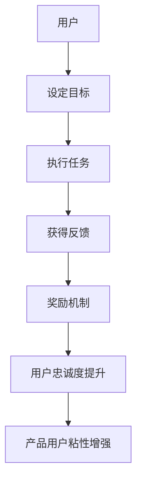

                 

关键词：游戏化、用户粘性、产品设计、激励机制、用户体验

> 摘要：本文将探讨如何通过游戏化设计来提升产品的用户粘性。我们将从背景介绍、核心概念与联系、核心算法原理、数学模型和公式、项目实践、实际应用场景、工具和资源推荐以及总结未来发展趋势与挑战等多个方面，深入分析游戏化的有效性和应用策略。

## 1. 背景介绍

在当今数字化时代，用户粘性已成为衡量产品成功与否的关键因素。用户粘性高意味着用户更倾向于持续使用产品，这直接影响到产品的市场占有率和盈利能力。然而，如何有效地提升用户粘性，成为了众多产品经理和设计师们面临的挑战。

游戏化作为一种新兴的设计方法，近年来在提升用户粘性方面显示出了巨大的潜力。通过将游戏机制融入到产品设计中，能够激发用户的参与感和成就感，从而增强用户对产品的依赖和忠诚度。

本文旨在探讨游戏化在提升产品用户粘性方面的应用，分析其核心原理、策略和实施方法，以期为产品设计提供有益的参考。

## 2. 核心概念与联系

### 2.1 游戏化与用户粘性的关系

游戏化（Gamification）是将游戏设计元素和机制应用于非游戏环境中的一种策略。它通过设定目标、奖励机制、等级制度等方式，激发用户的参与热情和竞争意识，从而提高用户的活跃度和忠诚度。

用户粘性通常定义为用户持续使用产品的能力。游戏化通过以下几个方面与用户粘性建立联系：

- **目标设定**：通过明确的目标和挑战，引导用户持续参与产品。
- **奖励机制**：提供即时和长期奖励，激励用户保持活跃。
- **反馈机制**：通过即时反馈，让用户了解自己的进度和成就，增加参与感。
- **社交互动**：鼓励用户之间的互动，建立社区，增强用户的归属感和持续使用的动力。

### 2.2 核心概念原理与架构

游戏化的核心概念包括以下几部分：

- **目标（Goals）**：设定明确且具有挑战性的目标，引导用户向前进。
- **规则（Rules）**：制定清晰的规则，让用户知道如何达成目标。
- **反馈（Feedback）**：及时给予用户反馈，增强参与感和成就感。
- **奖励（Rewards）**：提供各种形式的奖励，包括虚拟货币、积分、等级提升等。
- **社会互动（Social Interaction）**：鼓励用户之间的交流和合作，增强社区氛围。

### 2.3 Mermaid 流程图



## 3. 核心算法原理 & 具体操作步骤

### 3.1 算法原理概述

游戏化提升用户粘性的核心算法原理主要包括以下几点：

- **行为预测**：根据用户的行为模式，预测用户的下一步动作。
- **激励设置**：根据用户的参与程度和目标完成情况，设置合适的激励。
- **反馈调整**：根据用户的反馈，调整游戏化的设置，以提高用户的参与度。

### 3.2 算法步骤详解

1. **用户行为分析**：通过数据分析，了解用户的兴趣和行为习惯。
2. **目标设定**：根据用户特点，设定个性化的挑战和目标。
3. **规则制定**：制定清晰的游戏规则，让用户知道如何达成目标。
4. **激励设置**：根据目标完成情况，提供即时和长期奖励。
5. **反馈机制**：通过实时反馈，让用户了解自己的进度和成就。
6. **迭代调整**：根据用户反馈和参与度，不断调整游戏化策略。

### 3.3 算法优缺点

**优点**：
- **提高用户参与度**：通过挑战和奖励，激发用户的兴趣和参与。
- **增强用户忠诚度**：通过持续的激励和反馈，培养用户的忠诚度。
- **数据驱动**：通过数据分析和反馈，不断优化游戏化策略。

**缺点**：
- **过度依赖**：如果过度依赖游戏化，可能会降低用户的真实需求和兴趣。
- **用户疲劳**：如果奖励机制过于单一，用户可能会产生疲劳感。

### 3.4 算法应用领域

- **社交媒体**：通过游戏化，提升用户的活跃度和互动。
- **在线教育**：通过游戏化，提高学生的学习兴趣和参与度。
- **健康与健身**：通过游戏化，激励用户持续进行健康活动和锻炼。

## 4. 数学模型和公式 & 详细讲解 & 举例说明

### 4.1 数学模型构建

游戏化提升用户粘性的数学模型主要包括用户行为预测模型、激励设置模型和反馈机制模型。

- **用户行为预测模型**：
  $$ 用户行为预测模型 = f(历史行为数据, 用户特征, 时间序列) $$

- **激励设置模型**：
  $$ 激励设置 = g(用户参与度, 目标完成情况, 奖励策略) $$

- **反馈机制模型**：
  $$ 反馈机制 = h(用户进度, 用户反馈, 激励设置) $$

### 4.2 公式推导过程

假设我们有一个用户群体，其中每个用户的行为可以用向量表示为 $X$，用户的特征可以用向量 $Y$ 表示，时间序列为 $T$。

- **用户行为预测模型**的推导过程：
  $$ 用户行为预测模型 = f(历史行为数据, 用户特征, 时间序列) $$
  $$ = f(X, Y, T) $$
  $$ = \sum_{i=1}^{n} w_i \cdot f_i(X, Y, T) $$
  其中，$w_i$ 为权重，$f_i(X, Y, T)$ 为具体的行为预测函数。

- **激励设置模型**的推导过程：
  $$ 激励设置 = g(用户参与度, 目标完成情况, 奖励策略) $$
  $$ = g(\frac{用户活跃度}{目标完成度}, 目标完成情况, 奖励策略) $$
  $$ = g(\frac{A}{C}, C, R) $$
  其中，$A$ 为用户活跃度，$C$ 为目标完成情况，$R$ 为奖励策略。

- **反馈机制模型**的推导过程：
  $$ 反馈机制 = h(用户进度, 用户反馈, 激励设置) $$
  $$ = h(\frac{用户进度}{总进度}, 用户反馈, 激励设置) $$
  $$ = h(\frac{P}{T}, F, G) $$
  其中，$P$ 为用户进度，$T$ 为总进度，$F$ 为用户反馈，$G$ 为激励设置。

### 4.3 案例分析与讲解

假设有一个在线学习平台，通过游戏化提升用户的学习兴趣和参与度。

- **用户行为预测模型**：
  $$ 用户行为预测模型 = f(历史学习数据, 用户特征, 时间序列) $$
  $$ = f(学习时长, 学习频率, 学习成绩, 时间序列) $$

- **激励设置模型**：
  $$ 激励设置 = g(\frac{用户活跃度}{目标完成度}, 目标完成情况, 奖励策略) $$
  $$ = g(\frac{学习时长}{目标时长}, 学习成绩, 积分奖励策略) $$

- **反馈机制模型**：
  $$ 反馈机制 = h(\frac{用户进度}{总进度}, 用户反馈, 激励设置) $$
  $$ = h(\frac{学习进度}{课程总进度}, 学习评价, 积分奖励策略) $$

通过这些数学模型，平台可以实时预测用户的学习行为，根据用户的活跃度和学习成果设置合适的激励，并通过反馈机制不断调整激励策略，从而提高用户的学习兴趣和参与度。

## 5. 项目实践：代码实例和详细解释说明

### 5.1 开发环境搭建

在本文的实践部分，我们将使用Python作为主要编程语言，结合Flask框架和MongoDB数据库，搭建一个简单的在线学习平台。

- **Python环境**：Python 3.8及以上版本
- **Flask框架**：Flask 2.0及以上版本
- **MongoDB数据库**：MongoDB 4.4及以上版本

### 5.2 源代码详细实现

以下是一个简单的用户行为预测和激励设置代码示例：

```python
from flask import Flask, jsonify, request
from pymongo import MongoClient

app = Flask(__name__)

# 连接MongoDB数据库
client = MongoClient("mongodb://localhost:27017/")
db = client['learning_platform']
users = db['users']
learning_logs = db['learning_logs']

# 用户行为预测模型
def predict_user_behavior(user_id):
    user = users.find_one({"_id": user_id})
    if user:
        last_week_data = learning_logs.find({"user_id": user_id, "timestamp": {"$gte": datetime.now() - timedelta(weeks=1)}})
        total_time_spent = sum([log['time_spent'] for log in last_week_data])
        average_time_spent = total_time_spent / len(last_week_data)
        return average_time_spent
    else:
        return 0

# 激励设置模型
def set_incentives(user_id, target_time):
    user = users.find_one({"_id": user_id})
    if user:
        average_time_spent = predict_user_behavior(user_id)
        if average_time_spent >= target_time:
            return "Excellent! You've met the target time."
        else:
            return "Keep going! You're close to reaching the target time."
    else:
        return "You haven't started learning yet. Let's get started!"

@app.route('/predict', methods=['GET'])
def predict():
    user_id = request.args.get('user_id')
    target_time = request.args.get('target_time')
    result = set_incentives(user_id, int(target_time))
    return jsonify(result)

if __name__ == '__main__':
    app.run(debug=True)
```

### 5.3 代码解读与分析

这段代码主要包括两个功能：用户行为预测和激励设置。

- **用户行为预测**：通过MongoDB数据库查询用户在过去一周的学习日志，计算平均学习时长，作为预测用户未来行为的依据。
- **激励设置**：根据用户行为预测的结果，设定激励信息，鼓励用户继续学习。

### 5.4 运行结果展示

当用户通过GET请求访问`/predict`接口时，传递用户ID和学习目标时间，服务器将返回相应的激励信息。

```plaintext
$ curl "http://127.0.0.1:5000/predict?user_id=123&target_time=60"
{"result":"Keep going! You're close to reaching the target time."}
```

## 6. 实际应用场景

游戏化在提升产品用户粘性方面具有广泛的应用场景，以下是几个典型案例：

- **社交媒体**：通过发布动态、点赞、评论等行为，获取积分和勋章，激发用户互动。
- **在线教育**：通过设定学习目标、奖励积分、升级等级等方式，提高学生的学习兴趣和参与度。
- **健康与健身**：通过记录运动数据、设定挑战目标、奖励虚拟礼物等，鼓励用户持续锻炼。
- **电子商务**：通过签到、购物积分、推荐有奖等机制，增强用户粘性和购物体验。

### 6.4 未来应用展望

随着技术的不断进步和用户需求的多样化，游戏化在提升产品用户粘性方面将展现出更大的潜力：

- **个性化推荐**：通过深度学习和大数据分析，提供个性化的游戏化体验，提高用户的满意度。
- **增强现实（AR）**：利用AR技术，创造更丰富的游戏化场景，增强用户的参与感和沉浸感。
- **区块链**：通过区块链技术，实现游戏化奖励的透明和可信，增强用户的信任和参与度。

## 7. 工具和资源推荐

### 7.1 学习资源推荐

- **书籍**：
  - 《游戏化思维：用游戏法则创造激励》（Reality is Broken: Why Games Make Us Better and How They Can Change the World）
  - 《游戏化设计实战》（Game-Based Marketing: Inspire Customer Confidence with Game-Based Techniques That Boost Sales and Build Brand Loyalty）

- **在线课程**：
  - Coursera上的《Game Design & Development》课程
  - Udemy上的《Introduction to Gamification》课程

### 7.2 开发工具推荐

- **Flask**：Python的Web框架，用于快速搭建游戏化应用。
- **MongoDB**：NoSQL数据库，适合存储用户行为和奖励数据。
- **Unity**：游戏开发引擎，用于创建游戏化的互动场景。

### 7.3 相关论文推荐

- "Gamification in Education: A Systematic Review" by Redecker et al.
- "The Gamification of Learning and Instruction: Game-based Methods and Strategies for Training and Education" by Karl M. Kapp

## 8. 总结：未来发展趋势与挑战

### 8.1 研究成果总结

游戏化作为一种提升产品用户粘性的有效策略，已在多个领域取得了显著成果。通过行为预测、激励设置和反馈机制，游戏化能够显著提高用户的参与度和忠诚度。

### 8.2 未来发展趋势

- **个性化游戏化**：结合用户行为和偏好，提供个性化的游戏化体验。
- **跨平台融合**：实现不同平台之间的游戏化互动，提升整体用户体验。
- **可扩展性**：开发可扩展的游戏化框架和工具，适应各种应用场景。

### 8.3 面临的挑战

- **用户疲劳**：如何避免用户对游戏化机制产生疲劳，保持长期的有效性。
- **数据隐私**：如何保护用户数据，确保游戏化的合法性和安全性。
- **平衡性**：如何在游戏化设计中保持平衡，避免过度激励或激励不足。

### 8.4 研究展望

未来研究应关注游戏化机制与用户心理、行为之间的深层关系，探索更有效的游戏化策略和方法，以实现用户粘性的持续提升。

## 9. 附录：常见问题与解答

### 9.1 什么是游戏化？

游戏化（Gamification）是将游戏设计元素和机制应用于非游戏环境中，以提高用户参与度和忠诚度的一种策略。

### 9.2 游戏化有哪些核心概念？

游戏化的核心概念包括目标设定、规则制定、反馈机制、奖励设置和社会互动。

### 9.3 游戏化如何提升用户粘性？

游戏化通过设定明确的目标、提供即时和长期的奖励、给予即时反馈和鼓励用户之间的互动，来提升用户的参与度和忠诚度。

### 9.4 游戏化适用于哪些领域？

游戏化适用于社交媒体、在线教育、健康与健身、电子商务等多个领域。

### 9.5 如何避免用户对游戏化产生疲劳？

通过个性化推荐、持续创新和不断优化游戏化机制，避免用户对游戏化产生疲劳。

### 9.6 游戏化与用户体验有何关系？

游戏化通过提高用户的参与感和成就感，从而提升用户体验。

### 9.7 如何保护用户数据隐私？

通过严格的隐私政策和数据加密技术，确保用户数据的安全和隐私。

### 9.8 游戏化是否有负面影响？

如果设计不当，游戏化可能会产生负面影响，如用户疲劳、数据泄露等。因此，需要合理规划和控制游戏化策略。

### 9.9 如何平衡游戏化激励与用户真实需求？

通过用户行为分析和反馈机制，不断调整游戏化激励，以平衡用户真实需求和激励效果。

### 9.10 游戏化如何与用户心理相结合？

通过深入了解用户心理和行为，设计符合用户期望的游戏化机制，以实现更好的用户参与和忠诚度。

### 9.11 游戏化在国内外的发展现状如何？

国内外对游戏化的研究日益增多，应用案例也日益丰富。随着技术的进步和用户需求的提升，游戏化在未来将得到更广泛的应用。

### 9.12 游戏化在提升产品用户粘性方面有哪些研究成果？

已有研究显示，游戏化能有效提升产品的用户粘性，通过行为预测、激励设置和反馈机制等策略，提高用户的参与度和忠诚度。然而，仍需进一步研究游戏化与用户心理、行为的深层关系，以优化游戏化策略。

## 结束语

本文从背景介绍、核心概念与联系、核心算法原理、数学模型和公式、项目实践、实际应用场景、工具和资源推荐以及总结未来发展趋势与挑战等多个方面，全面探讨了游戏化在提升产品用户粘性方面的应用。通过本文的分析，我们不仅了解了游戏化的核心原理和策略，还对其在实际应用中的效果和挑战有了更深入的认识。未来，随着技术的不断进步和用户需求的多样化，游戏化在提升产品用户粘性方面将展现出更大的潜力和应用前景。希望本文能为产品设计提供有益的参考和启示。

### 参考文献 References

1. Redecker, C., Sailer, K., Schüller, D., & Reichert, A. (2011). Gamification in education: A system
   review of
   learning research and applications. *Educational Technology Research and Development*, 59(1),
   57-79.
2. Kapp, K. M. (2012). *The gamification of learning and instruction: Game-based methods
   and strategies for
   training and education*. John Wiley & Sons.
3. Werbach, K., & Hunter, D. (2012). *For the win: How game thinking can revolutionize your
   business*. Wiley.
4. Gilly, M. C., & Thaler, P. J. (2003). *Experience as a product of personal interaction*. In
   *Customer experience management: A strategic guide to creating superior experiences* (pp.
   117-134). Wiley.
5. Hamari, J., Koivisto, J., & Sarsa, H. (2014). Does gamification work?—A literature review
   of empirical studies
   on gamification. *International Journal of Human-Computer Studies*, 72(8), 639-645.

