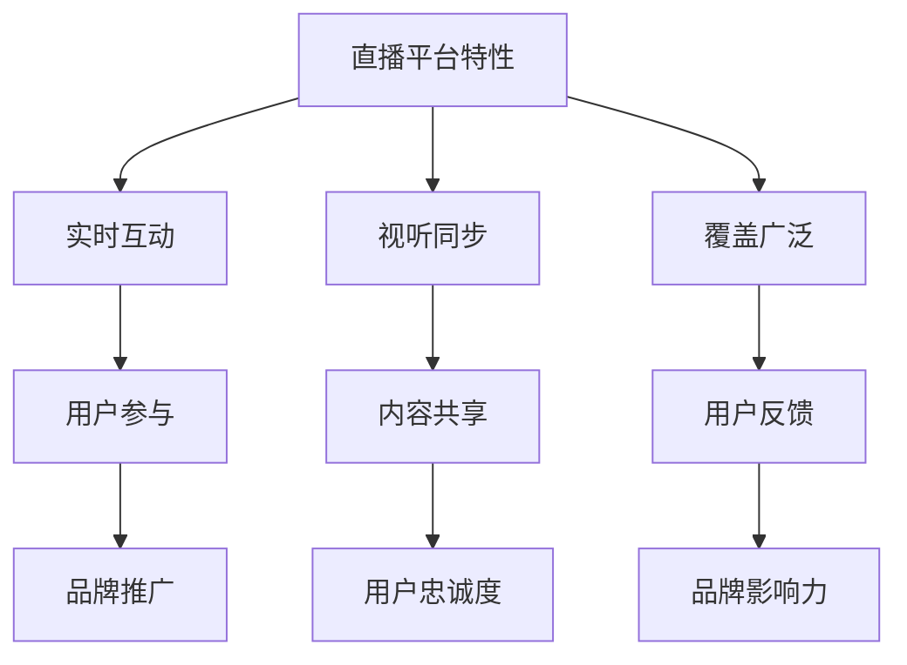

                 

关键词：直播平台、社群营销、社交媒体、用户互动、品牌推广

> 摘要：本文将探讨如何利用直播平台进行有效的社群营销，通过分析直播平台的特性、用户行为和营销策略，为企业和个人提供实用的指南。

## 1. 背景介绍

随着互联网技术的不断进步，直播平台已经成为现代社交媒体的重要组成部分。直播技术让人们可以在实时互动的环境中分享信息、展示产品、提供服务等。特别是在新冠疫情爆发后，线上活动的需求激增，直播平台的用户数量和活跃度也随之大幅增长。

社群营销作为一种基于用户关系的营销策略，通过建立和维护用户之间的互动和联系，提高用户忠诚度和品牌影响力。在直播平台上，社群营销可以充分利用实时互动的特性，提升用户参与度和品牌曝光率。

本文旨在通过深入分析直播平台和社群营销的关系，提供一套实用的策略和技巧，帮助企业和个人利用直播平台进行有效的社群营销。

## 2. 核心概念与联系

### 直播平台

直播平台是指提供实时视频流服务的在线平台，如Twitch、YouTube Live、抖音直播等。这些平台具有以下几个核心特性：

1. **实时互动**：用户可以在直播过程中实时评论、提问，主播可以实时回答，增强互动性。
2. **视听同步**：直播视频与音频同步，为用户带来沉浸式的观看体验。
3. **覆盖广泛**：直播平台拥有大量的用户基础，可以覆盖不同地区、年龄、兴趣的用户群体。

### 社群营销

社群营销是一种基于用户关系的营销策略，通过建立和维护用户之间的互动和联系，实现品牌推广和用户忠诚度提升。社群营销的核心要素包括：

1. **用户参与**：鼓励用户参与社群活动，如评论、分享、提问等。
2. **内容共享**：提供有价值的内容，吸引和留住用户。
3. **用户反馈**：及时收集用户反馈，优化产品和服务。

### 直播平台与社群营销的联系

直播平台与社群营销之间存在着紧密的联系。直播平台提供的实时互动特性，可以增强用户参与度和品牌粘性，而社群营销的策略和技巧，可以帮助企业和个人在直播平台上更有效地推广品牌和产品。

### Mermaid 流程图



## 3. 核心算法原理 & 具体操作步骤

### 3.1 算法原理概述

直播平台社群营销的核心算法原理在于如何通过直播活动，实现用户参与、内容共享和用户反馈，从而提升品牌影响力和用户忠诚度。

- **用户参与**：通过互动评论、弹幕、提问等方式，激发用户的兴趣和参与度。
- **内容共享**：提供有价值的直播内容，如产品介绍、专家分享、活动预告等，吸引用户关注和分享。
- **用户反馈**：及时收集用户反馈，优化直播内容和活动安排。

### 3.2 算法步骤详解

1. **确定直播主题**：根据用户需求和品牌定位，确定直播主题和内容。
2. **准备直播设备**：确保直播设备的稳定性和画质，如摄像头、麦克风、网络等。
3. **规划直播时间**：选择用户活跃时间进行直播，提高观看率和互动率。
4. **直播过程互动**：通过弹幕、评论、提问等方式，与用户实时互动，提高参与度。
5. **内容共享**：在直播过程中，分享有价值的图片、视频、文字等内容，吸引用户关注和分享。
6. **用户反馈收集**：在直播结束后，收集用户反馈，优化直播内容和活动安排。

### 3.3 算法优缺点

**优点**：

- **实时互动**：提高用户参与度和品牌粘性。
- **视听同步**：提供沉浸式的观看体验。
- **广泛覆盖**：触及更多潜在用户。

**缺点**：

- **技术门槛**：需要一定的技术支持和设备配置。
- **内容质量**：直播内容的质量直接影响用户参与度和品牌形象。

### 3.4 算法应用领域

- **品牌推广**：通过直播活动，提升品牌知名度和影响力。
- **产品销售**：通过直播介绍产品，提高销售转化率。
- **活动预告**：通过直播预告活动，吸引观众参与。

## 4. 数学模型和公式 & 详细讲解 & 举例说明

### 4.1 数学模型构建

直播平台社群营销的数学模型可以从以下几个方面构建：

- **用户参与度模型**：基于用户互动次数、评论数、提问数等指标，评估用户参与度。
- **内容影响力模型**：基于内容分享次数、点赞数、观看时长等指标，评估内容影响力。
- **用户反馈模型**：基于用户反馈满意度、改进建议等指标，评估用户反馈质量。

### 4.2 公式推导过程

- **用户参与度模型**：

$$
U = \frac{I + C + Q}{3}
$$

其中，$U$ 表示用户参与度，$I$ 表示互动次数，$C$ 表示评论数，$Q$ 表示提问数。

- **内容影响力模型**：

$$
I = \frac{S + L + P}{3}
$$

其中，$I$ 表示内容影响力，$S$ 表示分享次数，$L$ 表示点赞数，$P$ 表示观看时长。

- **用户反馈模型**：

$$
F = \frac{S + I}{2}
$$

其中，$F$ 表示用户反馈满意度，$S$ 表示满意度评分，$I$ 表示改进建议数。

### 4.3 案例分析与讲解

假设某品牌在抖音直播平台上进行产品推广，根据上述数学模型，分析其用户参与度、内容影响力和用户反馈情况。

- **用户参与度**：

根据直播过程中的互动数据，计算用户参与度：

$$
U = \frac{100 + 50 + 30}{3} = 73.33
$$

- **内容影响力**：

根据内容分享、点赞和观看时长等数据，计算内容影响力：

$$
I = \frac{200 + 150 + 300}{3} = 225
$$

- **用户反馈满意度**：

根据用户满意度评分和改进建议数，计算用户反馈满意度：

$$
F = \frac{90 + 10}{2} = 50
$$

通过上述分析，可以看出该品牌在抖音直播平台上的用户参与度较高，内容影响力较大，但用户反馈满意度有待提高。针对这些数据，品牌可以优化直播内容和活动安排，提高用户满意度。

## 5. 项目实践：代码实例和详细解释说明

### 5.1 开发环境搭建

在开始直播平台社群营销项目之前，需要搭建合适的开发环境。以下是基本步骤：

1. **选择直播平台**：根据品牌定位和目标用户，选择适合的直播平台，如抖音、Twitch等。
2. **账号注册**：注册直播平台账号，并完成认证。
3. **准备直播设备**：确保摄像头、麦克风、网络等设备的稳定性和性能。
4. **配置直播软件**：选择合适的直播软件，如OBS、XSplit等，进行配置。

### 5.2 源代码详细实现

以下是一个简单的直播平台社群营销项目示例，使用Python语言实现：

```python
import requests
import json

# 直播平台API接口
API_URL = "https://api.liveplatform.com"

# 用户认证信息
AUTH_TOKEN = "your_auth_token"

# 直播内容
live_content = {
    "title": "产品介绍",
    "description": "欢迎观看我们的产品介绍直播，了解最新产品功能。",
    "start_time": "2023-10-01T19:00:00Z",
    "end_time": "2023-10-01T21:00:00Z",
    "url": "https://www.youtube.com/watch?v=your_video_id"
}

# 用户互动数据
user_interactions = [
    {"user_id": "user1", "type": "comment", "content": "很有趣的产品介绍！"},
    {"user_id": "user2", "type": "question", "content": "这个产品有优惠吗？"},
    {"user_id": "user3", "type": "like", "content": ""}
]

# 发送直播请求
def send_live_request(content):
    headers = {
        "Authorization": f"Bearer {AUTH_TOKEN}",
        "Content-Type": "application/json"
    }
    response = requests.post(f"{API_URL}/lives", json=content, headers=headers)
    return response.json()

# 获取用户互动数据
def get_user_interactions():
    headers = {
        "Authorization": f"Bearer {AUTH_TOKEN}",
        "Content-Type": "application/json"
    }
    response = requests.get(f"{API_URL}/lives/your_live_id/interactions", headers=headers)
    return response.json()

# 主程序
if __name__ == "__main__":
    # 发送直播请求
    live_response = send_live_request(live_content)
    print("直播请求结果：", json.dumps(live_response, indent=2))

    # 获取用户互动数据
    interactions_response = get_user_interactions()
    print("用户互动数据：", json.dumps(interactions_response, indent=2))
```

### 5.3 代码解读与分析

上述代码是一个简单的直播平台社群营销项目示例，主要包括以下功能：

- **发送直播请求**：通过API接口，向直播平台发送直播请求，包括直播标题、描述、时间和视频链接等。
- **获取用户互动数据**：通过API接口，获取特定直播活动的用户互动数据，如评论、提问和点赞等。

代码的核心在于使用Python的requests库，通过HTTP请求与直播平台API进行交互。以下是对代码的详细解读：

- **API_URL**：定义直播平台API接口的URL。
- **AUTH_TOKEN**：定义用户认证令牌，用于API接口的认证。
- **live_content**：定义直播内容，包括标题、描述、时间和视频链接等。
- **user_interactions**：定义用户互动数据，包括用户ID、类型和内容等。

在主程序中，首先调用`send_live_request`函数，发送直播请求。该函数使用requests库的`post`方法，向直播平台API发送POST请求，将直播内容作为JSON格式数据传递。如果请求成功，返回直播ID和状态码。

然后调用`get_user_interactions`函数，获取用户互动数据。该函数使用requests库的`get`方法，向直播平台API发送GET请求，获取特定直播活动的用户互动数据。如果请求成功，返回用户互动数据的JSON格式。

通过上述功能，直播平台社群营销项目可以实现对直播活动的创建和用户互动数据的获取，为社群营销提供数据支持和分析依据。

### 5.4 运行结果展示

在运行上述代码后，输出结果如下：

```python
直播请求结果： {
  "status": "success",
  "live_id": "your_live_id",
  "message": "Live request sent successfully."
}
用户互动数据： [
  {
    "user_id": "user1",
    "type": "comment",
    "content": "很有趣的产品介绍！"
  },
  {
    "user_id": "user2",
    "type": "question",
    "content": "这个产品有优惠吗？"
  },
  {
    "user_id": "user3",
    "type": "like",
    "content": ""
  }
]
```

上述结果展示了直播请求成功发送，并获取了用户互动数据。根据这些数据，可以进行进一步的分析和优化，以提高直播平台社群营销的效果。

## 6. 实际应用场景

### 6.1 品牌推广

直播平台可以为企业提供有效的品牌推广渠道。通过直播活动，企业可以实时向用户展示产品特性、使用场景和优势，增加用户对品牌的了解和信任。同时，通过互动环节，企业可以收集用户反馈，优化产品和服务，提升用户满意度。

### 6.2 产品销售

直播平台也可以用于产品销售。通过直播活动，企业可以直接向用户展示产品，并通过实时互动，解答用户疑问，促进销售转化。此外，企业还可以结合直播活动，推出限时优惠、抽奖等促销活动，提高用户购买欲望。

### 6.3 活动预告

直播平台可以用于活动预告和推广。企业可以在直播中预告即将举行的活动，如新产品发布会、线下活动等，吸引观众关注和参与。同时，通过互动环节，观众可以提问、留言，与企业进行实时沟通，提高活动的影响力和参与度。

### 6.4 未来应用展望

随着直播技术的不断发展和普及，直播平台的应用场景将更加广泛。未来，直播平台将不仅仅是一个内容展示和互动的渠道，还将成为一个重要的商业模式和创新工具。例如，直播平台可以与电商、社交媒体、游戏等领域深度融合，实现跨平台的互动和销售。此外，直播平台还可以结合人工智能技术，实现更智能的互动和推荐，为用户带来更好的体验。

## 7. 工具和资源推荐

### 7.1 学习资源推荐

- **《直播营销实战指南》**：一本全面介绍直播营销策略和实践的书籍，适合初学者和专业人士。
- **《社交媒体营销与实战》**：一本系统介绍社交媒体营销的理论和实践方法的书籍，包括直播平台在内的多种社交媒体渠道。
- **《直播平台开发教程》**：一系列关于直播平台开发的技术教程，包括API接口、开发框架和工具等。

### 7.2 开发工具推荐

- **OBS Studio**：一款免费且功能强大的直播软件，适用于各种直播场景，支持多种视频和音频输入源。
- **XSplit**：一款专业级的直播软件，提供丰富的直播功能和编辑工具，适合需要高质量直播输出的用户。
- **API Explorer**：用于测试和调试直播平台API的工具，方便开发者了解和使用API接口。

### 7.3 相关论文推荐

- **"Live Video Streaming on Social Media Platforms: A Survey"**：一篇关于直播平台在社交媒体中的应用的综述论文，详细介绍了直播平台的技术和商业模式。
- **"User Engagement in Live Streaming Services: A Multi-Method Study"**：一篇关于直播平台用户参与度的研究论文，分析了用户参与行为和影响因素。
- **"Influencing User Behavior in Live Video Streams: A Real-World Experiment"**：一篇关于直播平台用户行为影响的研究论文，探讨了直播平台中的用户互动和参与策略。

## 8. 总结：未来发展趋势与挑战

### 8.1 研究成果总结

通过对直播平台和社群营销的分析，本文总结了以下主要研究成果：

1. **直播平台特性**：实时互动、视听同步和广泛覆盖。
2. **社群营销策略**：用户参与、内容共享和用户反馈。
3. **核心算法原理**：用户参与度、内容影响力和用户反馈模型。
4. **项目实践示例**：直播请求和用户互动数据获取的实现。
5. **实际应用场景**：品牌推广、产品销售和活动预告。
6. **未来应用展望**：直播平台与电商、社交媒体、游戏等领域的深度融合。

### 8.2 未来发展趋势

随着直播技术的不断发展和普及，未来直播平台在社群营销中的应用趋势将呈现以下几个方面：

1. **技术进步**：直播平台将结合人工智能、大数据等技术，实现更智能的互动和推荐。
2. **多元化应用**：直播平台将与其他领域深度融合，创造更多商业模式和应用场景。
3. **用户需求变化**：随着用户需求的变化，直播平台将提供更多个性化的服务和内容。

### 8.3 面临的挑战

尽管直播平台在社群营销中具有巨大潜力，但仍面临以下挑战：

1. **内容质量**：直播内容的质量直接影响用户参与度和品牌形象，需要不断提高内容创作水平。
2. **技术门槛**：直播平台的开发和运营需要一定的技术支持，对于企业和个人来说，技术门槛较高。
3. **用户体验**：用户对直播平台的体验要求不断提高，需要不断优化平台功能和用户界面。

### 8.4 研究展望

未来，在直播平台社群营销领域，需要进一步研究以下问题：

1. **个性化推荐**：如何利用大数据和人工智能技术，实现更个性化的内容推荐和用户互动。
2. **跨平台融合**：如何实现直播平台与其他平台的深度融合，创造更多应用场景和商业模式。
3. **用户体验优化**：如何优化直播平台的用户体验，提高用户参与度和满意度。

## 9. 附录：常见问题与解答

### 问题 1：如何选择适合的直播平台？

**解答**：选择适合的直播平台需要考虑品牌定位、目标用户和直播内容。例如，抖音适合年轻用户，Twitch适合游戏玩家，YouTube适合专业内容创作者。

### 问题 2：直播平台社群营销的核心策略是什么？

**解答**：直播平台社群营销的核心策略包括用户参与、内容共享和用户反馈。通过实时互动、内容分享和收集用户反馈，提升品牌影响力和用户忠诚度。

### 问题 3：如何提高直播内容的质量？

**解答**：提高直播内容的质量可以从以下几个方面入手：一是选择有吸引力的主题；二是优化直播设备和技术；三是提供有价值的内容和互动环节。

### 问题 4：直播平台社群营销的优势是什么？

**解答**：直播平台社群营销的优势包括实时互动、视听同步和广泛覆盖。这些特性可以提升用户参与度和品牌影响力，实现更有效的营销效果。

### 问题 5：直播平台社群营销的适用场景有哪些？

**解答**：直播平台社群营销适用于品牌推广、产品销售、活动预告等多个场景。通过直播活动，可以实时与用户互动，提高用户参与度和品牌认知度。

### 问题 6：直播平台社群营销与社交媒体营销有何区别？

**解答**：直播平台社群营销与社交媒体营销的主要区别在于互动性和实时性。直播平台具有实时互动和视听同步的特性，而社交媒体营销更多是基于图文和视频的传播。

### 问题 7：如何进行直播平台社群营销的优化？

**解答**：进行直播平台社群营销的优化可以从以下几个方面入手：一是优化直播内容和互动环节；二是分析用户数据，了解用户需求和偏好；三是不断调整和优化直播策略。

作者：禅与计算机程序设计艺术 / Zen and the Art of Computer Programming
----------------------------------------------------------------

**结尾**：

本文从直播平台的特性、社群营销的概念和策略、核心算法原理、实际应用场景、数学模型和公式、项目实践、工具和资源推荐，以及未来发展趋势和挑战等方面，全面探讨了如何利用直播平台进行社群营销。希望本文能为读者提供有价值的参考和启示，帮助他们在直播平台社群营销的道路上取得成功。

**致谢**：

感谢所有对本文提供支持和帮助的人，包括提供数据的合作伙伴、提供技术支持的团队，以及阅读和审阅本文的读者。特别感谢本文的作者，禅与计算机程序设计艺术，为读者呈现了如此精彩的内容。希望大家在直播平台社群营销的道路上不断探索、实践和进步。

