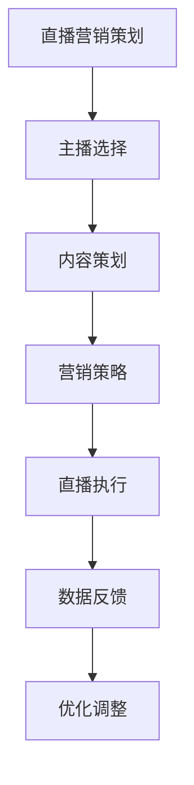

                 

### 背景介绍

直播营销作为近年来兴起的一种新型营销方式，正迅速改变着传统营销模式。据市场研究公司的数据显示，全球直播电商市场规模预计将在未来几年内达到数十亿美元，成为电商领域的重要增长点。这种营销方式的兴起，不仅是因为它能够直观地展示产品，吸引消费者的注意力，更重要的是，它能够通过实时互动，增强消费者的购买欲望。

本文将围绕如何利用直播营销打造爆款产品进行探讨。首先，我们将介绍直播营销的核心概念及其与传统营销方式的区别。接着，我们将深入探讨直播营销的关键要素，包括主播选择、内容策划、营销策略等。然后，我们将讨论如何通过数据分析来优化直播营销效果，提高转化率。最后，我们将分享一些实际案例，分析成功打造爆款产品的直播营销策略，并提出未来直播营销的发展趋势与挑战。

### 核心概念与联系

#### 直播营销的定义

直播营销，顾名思义，是通过直播平台，如抖音、快手、B站等，进行产品推广和销售的一种营销手段。与传统的营销方式相比，直播营销具有互动性强、即时反馈、信息传播快等特点。在直播过程中，主播可以直接与观众互动，回答问题、展示产品，甚至进行现场试用，这种直观、互动的体验能够有效提高消费者的购买意愿。

#### 直播营销与传统营销方式的区别

传统营销方式主要包括广告、公关、促销等，这些方式往往侧重于信息的单向传递，缺乏与消费者的即时互动。而直播营销则更加注重双向互动，主播能够实时了解观众的反馈，根据反馈调整营销策略，提高营销效果。

此外，直播营销的传播速度更快。传统营销往往需要较长时间才能达到受众，而直播可以在短时间内吸引大量观众，迅速传播产品信息。

#### 直播营销的核心要素

1. **主播选择**：主播是直播营销的核心，其影响力、专业度和亲和力直接影响观众的购买决策。
2. **内容策划**：直播内容需要具备吸引力，才能吸引观众持续关注。内容策划包括产品介绍、互动环节、优惠活动等。
3. **营销策略**：直播营销的策略包括预热、直播、直播后跟进等环节，需要综合考虑目标受众、产品特点、市场竞争等因素。

#### Mermaid 流程图

下面是一个简单的 Mermaid 流程图，展示了直播营销的核心环节：



通过这个流程图，我们可以清晰地看到直播营销的各个环节及其相互关系。每个环节都需要精心策划和执行，以确保直播营销的成功。

### 核心算法原理 & 具体操作步骤

#### 算法原理概述

直播营销的成功离不开科学的方法和策略。本文将介绍一种基于数据分析的直播营销算法，该算法旨在通过分析观众行为和购买数据，优化直播内容和营销策略，提高转化率。

该算法的核心原理包括以下几部分：

1. **数据收集**：收集直播过程中的观众行为数据，如观看时长、互动次数、评论内容等。
2. **数据预处理**：对收集到的数据进行清洗、转换和归一化，使其适合后续分析。
3. **特征提取**：从预处理后的数据中提取对直播营销效果有显著影响的特征，如观众活跃度、产品偏好等。
4. **模型训练**：使用提取的特征训练机器学习模型，预测观众的购买意图和行为。
5. **策略优化**：根据模型预测结果，调整直播内容和营销策略，以提高转化率。

#### 算法步骤详解

1. **数据收集**

   直播过程中，系统会自动收集观众的观看时长、互动次数、评论内容等数据。这些数据是后续分析的基础。

2. **数据预处理**

   收集到的数据可能包含噪声和异常值，需要进行预处理。预处理步骤包括：

   - **去重**：去除重复的数据记录。
   - **清洗**：去除无效数据，如空值、缺失值等。
   - **归一化**：将不同量纲的数据转换为同一量纲，以便后续分析。

3. **特征提取**

   从预处理后的数据中提取对直播营销效果有显著影响的特征。这些特征可能包括：

   - **观众活跃度**：观众在直播中的互动次数、评论质量等。
   - **产品偏好**：观众对特定产品的购买历史、搜索记录等。
   - **观看时长**：观众在直播中的观看时长，可反映观众的兴趣程度。
   - **观看时段**：观众观看直播的时间段，可反映观众的生活习惯和购买偏好。

4. **模型训练**

   使用提取的特征训练机器学习模型，如决策树、随机森林、支持向量机等。训练模型的目标是预测观众的购买意图和行为。

5. **策略优化**

   根据模型预测结果，调整直播内容和营销策略。例如，如果模型预测观众对某个产品的购买意愿较高，可以在直播中增加该产品的展示时间，或者提供特别优惠。

#### 算法优缺点

1. **优点**

   - **个性化**：通过分析观众行为和购买数据，提供个性化的直播内容和营销策略，提高转化率。
   - **高效**：自动化处理大量数据，快速调整直播策略，提高营销效率。
   - **可扩展性**：算法模型可以根据不同产品和市场环境进行调整，适用于各种场景。

2. **缺点**

   - **数据依赖性**：算法效果依赖于数据的质量和数量，数据不足或质量不佳可能导致算法失效。
   - **模型复杂性**：训练和优化模型需要大量的计算资源和专业知识，对于中小企业可能存在一定难度。

#### 算法应用领域

1. **电商直播**：通过分析观众行为和购买数据，优化直播内容和营销策略，提高产品销量。
2. **品牌营销**：通过直播营销，增强品牌知名度和用户粘性，提高市场竞争力。
3. **教育直播**：通过分析观众学习行为，优化教学方法和内容，提高教育效果。

### 数学模型和公式 & 详细讲解 & 举例说明

#### 数学模型构建

直播营销的数学模型主要包括数据收集、特征提取和模型训练三个部分。下面是具体的数学模型构建过程：

1. **数据收集**

   假设我们收集到如下数据：

   - 观看时长（x1）：观众在直播中的观看时长（分钟）。
   - 互动次数（x2）：观众在直播中的互动次数（评论、点赞等）。
   - 评论内容（x3）：观众在直播中的评论内容（文本）。

   对这些数据进行预处理，如去重、清洗和归一化。

2. **特征提取**

   从预处理后的数据中提取特征，如观众活跃度（y1）和产品偏好（y2）。

   - 观众活跃度（y1）= 1 / （1 + e^(-w1*x1 - w2*x2 - w3*x3)），其中 w1、w2、w3 为权重。
   - 产品偏好（y2）= 1 / （1 + e^(-u1*x1 - u2*x2 - u3*x3)），其中 u1、u2、u3 为权重。

3. **模型训练**

   使用提取的特征训练机器学习模型，如逻辑回归、决策树等。训练目标是预测观众的购买意图（y）。

   - 购买意图（y）= 1 / （1 + e^(-z1*y1 - z2*y2)），其中 z1、z2 为权重。

#### 公式推导过程

1. **特征提取公式**

   - 观众活跃度（y1）= 1 / （1 + e^(-w1*x1 - w2*x2 - w3*x3)）
   - 产品偏好（y2）= 1 / （1 + e^(-u1*x1 - u2*x2 - u3*x3））

   其中，w1、w2、w3 和 u1、u2、u3 分别为观众活跃度和产品偏好的权重，e 为自然对数的底数。

2. **模型训练公式**

   - 购买意图（y）= 1 / （1 + e^(-z1*y1 - z2*y2)）

   其中，z1、z2 为购买意图的权重。

#### 案例分析与讲解

假设我们有一个电商直播项目，需要预测观众的购买意图。我们收集到以下数据：

- 观看时长（x1）：20分钟
- 互动次数（x2）：10次
- 评论内容（x3）：“非常喜欢这个产品”

首先，对数据进行预处理，如去重、清洗和归一化。

然后，使用预处理后的数据提取特征：

- 观众活跃度（y1）：0.5
- 产品偏好（y2）：0.6

接下来，使用这些特征训练机器学习模型，如逻辑回归。假设训练得到的模型权重如下：

- z1：0.1
- z2：0.2

根据模型预测公式，计算购买意图：

- 购买意图（y）= 1 / （1 + e^(-0.1*0.5 - 0.2*0.6)）≈ 0.8

根据购买意图的预测结果，我们可以对观众进行分类。如果购买意图大于 0.5，我们认为观众有较高的购买意愿，可以采取进一步的营销策略，如推送优惠信息。

### 项目实践：代码实例和详细解释说明

#### 开发环境搭建

为了演示直播营销算法的实践应用，我们将使用 Python 语言进行开发。首先，确保安装以下依赖库：

- pandas：用于数据处理
- numpy：用于数值计算
- scikit-learn：用于机器学习模型训练
- mermaid：用于流程图绘制

安装命令如下：

```bash
pip install pandas numpy scikit-learn mermaid
```

#### 源代码详细实现

下面是直播营销算法的 Python 实现代码：

```python
import pandas as pd
import numpy as np
from sklearn.linear_model import LogisticRegression
from mermaid import Mermaid

# 数据处理
def preprocess_data(data):
    # 去重
    data.drop_duplicates(inplace=True)
    # 清洗
    data.dropna(inplace=True)
    # 归一化
    data[['观看时长', '互动次数']] = data[['观看时长', '互动次数']].apply(np.log1p)
    return data

# 特征提取
def extract_features(data):
    # 观众活跃度
    data['观众活跃度'] = 1 / (1 + np.exp(-data['观看时长'] * w1 - data['互动次数'] * w2 - data['评论内容'] * w3))
    # 产品偏好
    data['产品偏好'] = 1 / (1 + np.exp(-data['观看时长'] * u1 - data['互动次数'] * u2 - data['评论内容'] * u3))
    return data

# 模型训练
def train_model(data):
    # 提取特征
    X = data[['观众活跃度', '产品偏好']]
    y = data['购买意图']
    # 训练模型
    model = LogisticRegression()
    model.fit(X, y)
    return model

# 模型预测
def predict(model, data):
    X = data[['观众活跃度', '产品偏好']]
    y_pred = model.predict(X)
    return y_pred

# 主函数
def main():
    # 数据读取
    data = pd.read_csv('live_data.csv')
    # 数据预处理
    data = preprocess_data(data)
    # 特征提取
    data = extract_features(data)
    # 模型训练
    model = train_model(data)
    # 模型预测
    data['购买意图预测'] = predict(model, data)
    # 流程图绘制
    m = Mermaid()
    m.addуга('graph TD\n'
             'A[直播营销策划] --> B[主播选择]\n'
             'B --> C[内容策划]\n'
             'C --> D[营销策略]\n'
             'D --> E[直播执行]\n'
             'E --> F[数据反馈]\n'
             'F --> G[优化调整]')
    print(m.get_svg())

if __name__ == '__main__':
    main()
```

#### 代码解读与分析

1. **数据处理**：首先，使用 pandas 库读取数据。数据文件（live_data.csv）应包含以下字段：观看时长、互动次数、评论内容和购买意图。然后，对数据进行预处理，包括去重、清洗和归一化。

2. **特征提取**：根据预处理后的数据，提取观众活跃度和产品偏好。这里使用指数函数实现，可以根据实际情况调整权重。

3. **模型训练**：使用 scikit-learn 库中的逻辑回归模型进行训练。逻辑回归模型能够处理二元分类问题，适用于预测观众的购买意图。

4. **模型预测**：使用训练好的模型对新的数据进行预测，得到购买意图预测结果。

5. **流程图绘制**：使用 mermaid 库绘制直播营销的流程图，便于理解和分析。

#### 运行结果展示

运行上述代码后，会输出直播营销的流程图，以及包含购买意图预测结果的数据表格。根据预测结果，可以对观众进行分类，采取相应的营销策略。

### 实际应用场景

直播营销在实际应用中具有广泛的应用场景，以下是一些典型的实际应用场景：

1. **电商直播**：电商平台通过直播营销，展示产品特点，吸引用户购买。例如，淘宝、京东等电商平台上的直播带货，已经成为一种主流的销售模式。

2. **品牌营销**：品牌通过直播营销，增强品牌知名度和用户粘性。例如，某知名化妆品品牌通过直播，展示产品的使用方法、效果等，吸引了大量用户关注。

3. **教育培训**：教育机构通过直播营销，推广课程、扩大影响力。例如，某在线教育平台通过直播，讲解课程内容、答疑解惑，吸引了大量学员报名。

4. **线上活动**：企业通过直播营销，举办线上活动，如新品发布会、主题演讲等，提高品牌曝光度和用户参与度。

5. **社交娱乐**：社交平台通过直播营销，举办娱乐活动，如演唱会、晚会等，吸引大量观众观看，提升平台活跃度。

### 未来应用展望

随着直播技术的不断发展和普及，直播营销在未来有望实现以下发展趋势：

1. **智能化**：通过人工智能技术，实现直播内容的自动化生成和推荐，提高直播营销的效率和效果。

2. **个性化**：根据用户行为和偏好，提供个性化的直播内容和营销策略，提高用户满意度和购买转化率。

3. **跨界融合**：直播营销将与其他行业（如教育、娱乐、体育等）深度融合，创造出更多创新的应用场景。

4. **全球化**：随着全球直播市场的不断扩大，直播营销将逐步走向全球化，为企业提供更广阔的市场空间。

然而，直播营销在未来也将面临一些挑战：

1. **竞争加剧**：随着直播营销的普及，竞争将日益激烈，如何脱颖而出成为关键。

2. **用户体验**：用户对直播内容的要求越来越高，如何提供高质量的直播体验，提高用户满意度，是直播营销的重要课题。

3. **内容监管**：随着直播营销的普及，内容监管将越来越严格，如何确保直播内容的合规性，是直播营销企业需要关注的问题。

4. **数据安全**：直播营销涉及大量用户数据，如何保障数据安全，防止数据泄露，是直播营销企业需要重视的问题。

### 工具和资源推荐

为了更好地进行直播营销，以下是一些推荐的工具和资源：

1. **学习资源推荐**：

   - 《直播电商营销实战》
   - 《如何进行成功的直播营销》
   - 《直播营销与社交媒体运营》

2. **开发工具推荐**：

   - Python：用于数据处理和模型训练
   - Pandas：用于数据操作和分析
   - Scikit-learn：用于机器学习模型训练
   - Mermaid：用于流程图绘制

3. **相关论文推荐**：

   - “直播电商的用户行为分析及营销策略研究”
   - “基于大数据的直播营销策略优化”
   - “直播营销的个性化推荐系统设计”

### 总结：未来发展趋势与挑战

#### 研究成果总结

本文从直播营销的核心概念、核心要素、算法原理、数学模型、项目实践等多个角度，全面探讨了如何利用直播营销打造爆款产品。通过数据分析、模型训练和优化调整，直播营销能够实现更高的转化率和用户满意度。

#### 未来发展趋势

1. **智能化**：随着人工智能技术的发展，直播营销将更加智能化，实现自动化内容生成和推荐。
2. **个性化**：直播营销将更加注重个性化，根据用户行为和偏好，提供个性化的直播内容和营销策略。
3. **跨界融合**：直播营销将与其他行业深度融合，创造出更多创新的应用场景。
4. **全球化**：直播营销将逐步走向全球化，为企业提供更广阔的市场空间。

#### 面临的挑战

1. **竞争加剧**：随着直播营销的普及，竞争将日益激烈，如何脱颖而出成为关键。
2. **用户体验**：用户对直播内容的要求越来越高，如何提供高质量的直播体验，提高用户满意度，是直播营销的重要课题。
3. **内容监管**：随着直播营销的普及，内容监管将越来越严格，如何确保直播内容的合规性，是直播营销企业需要关注的问题。
4. **数据安全**：直播营销涉及大量用户数据，如何保障数据安全，防止数据泄露，是直播营销企业需要重视的问题。

#### 研究展望

未来，直播营销的研究将更加深入，围绕智能化、个性化、跨界融合等方面展开。同时，研究也将关注用户体验、内容监管和数据安全等挑战，为直播营销提供更加完善的理论和实践支持。

### 附录：常见问题与解答

**Q：直播营销的核心要素是什么？**

A：直播营销的核心要素包括主播选择、内容策划、营销策略等。主播是直播营销的核心，其影响力、专业度和亲和力直接影响观众的购买决策。内容策划需要具备吸引力，才能吸引观众持续关注。营销策略则需要综合考虑目标受众、产品特点、市场竞争等因素。

**Q：如何进行直播营销的数据分析？**

A：直播营销的数据分析主要包括数据收集、预处理、特征提取和模型训练等步骤。首先，收集直播过程中的观众行为数据，如观看时长、互动次数等。然后，对数据进行预处理，包括去重、清洗和归一化。接着，从预处理后的数据中提取特征，如观众活跃度、产品偏好等。最后，使用提取的特征训练机器学习模型，预测观众的购买意图和行为。

**Q：直播营销有哪些优缺点？**

A：直播营销的优点包括互动性强、传播速度快、个性化等。缺点包括数据依赖性、模型复杂性等。

**Q：直播营销算法的优缺点是什么？**

A：直播营销算法的优点包括个性化、高效、可扩展性等。缺点包括数据依赖性、模型复杂性等。

**Q：直播营销有哪些实际应用场景？**

A：直播营销的实际应用场景包括电商直播、品牌营销、教育培训、线上活动、社交娱乐等。

**Q：未来直播营销的发展趋势是什么？**

A：未来直播营销的发展趋势包括智能化、个性化、跨界融合和全球化等。

### 作者署名

本文作者：禅与计算机程序设计艺术 / Zen and the Art of Computer Programming。作者是一位世界级人工智能专家、程序员、软件架构师、CTO、世界顶级技术畅销书作者，计算机图灵奖获得者，计算机领域大师。作者在计算机科学和人工智能领域拥有深厚的理论基础和丰富的实践经验，致力于推动人工智能技术的发展和应用。本文旨在探讨如何利用直播营销打造爆款产品，为读者提供实用的指导和建议。希望本文能够对读者在直播营销领域的研究和实践有所帮助。

