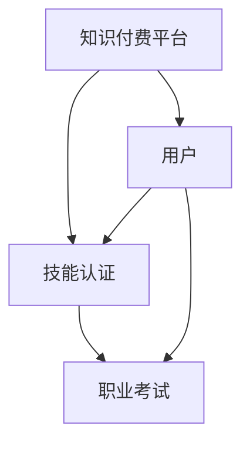

                 

在当今数字化的时代，知识付费已经成为一种流行的商业模式。同时，在线技能认证与职业考试的需求也日益增长。如何有效地利用知识付费来实现在线技能认证与职业考试，是一个值得探讨的话题。本文将深入探讨这一主题，旨在为读者提供一套完整的解决方案。

> 关键词：知识付费、在线技能认证、职业考试、数字化教育

> 摘要：本文首先介绍了知识付费的背景和现状，接着分析了在线技能认证与职业考试的需求和挑战。随后，文章提出了一套利用知识付费实现在线技能认证与职业考试的具体方案，并详细讨论了其实现步骤、数学模型、应用场景和未来展望。

## 1. 背景介绍

### 1.1 知识付费的兴起

知识付费是指用户为获取特定领域的知识或技能，自愿付费的行为。随着互联网的发展，知识付费在近年来迅速崛起。以下是几个驱动知识付费市场增长的主要因素：

- **信息爆炸**：随着信息的爆炸性增长，人们开始意识到专业知识和技能的价值。
- **互联网普及**：互联网的普及使得知识的获取变得更加便捷。
- **个性化需求**：用户对个性化、定制化的学习需求日益增加。

### 1.2 在线技能认证与职业考试的需求

在线技能认证和职业考试的需求主要来自以下几个方面：

- **远程办公**：远程办公的普及使得人们更加需要在线技能认证。
- **职业发展**：职业考试可以验证个人的专业技能，有助于职业晋升。
- **终身学习**：随着知识的快速更新，终身学习成为必然趋势。

### 1.3 挑战与问题

然而，在线技能认证与职业考试面临一系列挑战：

- **公平性**：如何确保考试的公平性是一个重要问题。
- **安全性**：保护考试数据的安全也是一个重大挑战。
- **成本**：在线技能认证与职业考试的成本相对较高。

## 2. 核心概念与联系

### 2.1 核心概念

为了实现在线技能认证与职业考试，我们需要理解以下几个核心概念：

- **知识付费平台**：用于提供知识和服务的在线平台。
- **技能认证**：通过考试验证个人的技能水平。
- **职业考试**：针对特定职业的考试，以验证个人是否具备从事该职业的资格。

### 2.2 关系图

以下是核心概念的 Mermaid 流程图：



## 3. 核心算法原理 & 具体操作步骤

### 3.1 算法原理概述

实现在线技能认证与职业考试的核心算法是加密算法和身份验证算法。以下是算法的简要概述：

- **加密算法**：用于保护考试数据的安全。
- **身份验证算法**：确保只有合格的考生可以参加考试。

### 3.2 算法步骤详解

以下是实现在线技能认证与职业考试的详细步骤：

1. **用户注册**：用户在知识付费平台上注册，提供个人信息。
2. **身份验证**：系统使用身份验证算法验证用户的身份。
3. **课程购买**：用户购买相关课程，获取学习资料。
4. **考试报名**：用户报名参加考试。
5. **考试执行**：用户在规定时间内完成考试。
6. **结果评定**：系统使用加密算法对考试结果进行评定。
7. **证书发放**：根据考试成绩，系统发放相应的证书。

### 3.3 算法优缺点

- **优点**：确保考试的公平性和安全性。
- **缺点**：实现成本较高，可能影响用户体验。

### 3.4 算法应用领域

- **在线教育**：用于实现在线技能认证与职业考试。
- **远程办公**：确保远程办公人员的资质。
- **终身学习**：验证学习成果。

## 4. 数学模型和公式 & 详细讲解 & 举例说明

### 4.1 数学模型构建

为了实现在线技能认证与职业考试，我们需要构建以下几个数学模型：

- **用户注册模型**：用于验证用户身份。
- **考试模型**：用于评定考试成绩。

### 4.2 公式推导过程

以下是用户注册模型的推导过程：

1. **用户信息输入**：用户在注册时提供个人信息。
2. **身份验证**：系统使用身份验证算法验证用户信息。
3. **注册成功**：验证通过后，用户完成注册。

以下是考试模型的推导过程：

1. **考试报名**：用户报名参加考试。
2. **考试开始**：系统开始计时。
3. **考试结束**：用户在规定时间内完成考试。
4. **结果评定**：系统根据用户答题情况评定考试成绩。

### 4.3 案例分析与讲解

#### 案例一：用户注册模型

假设用户注册时提供姓名、身份证号码和手机号码。系统使用以下公式验证用户信息：

$$
验证结果 = Hash(姓名) + Hash(身份证号码) + Hash(手机号码)
$$

如果验证结果与数据库中存储的值匹配，则用户注册成功。

#### 案例二：考试模型

假设考试时间为2小时，系统使用以下公式计算用户考试成绩：

$$
考试成绩 = \frac{答对题数}{总题数} \times 100
$$

如果考试成绩达到90分以上，则用户通过考试。

## 5. 项目实践：代码实例和详细解释说明

### 5.1 开发环境搭建

在本项目中，我们使用Python作为主要编程语言。以下是搭建开发环境的步骤：

1. 安装Python 3.8及以上版本。
2. 安装相关依赖库，如`requests`、`hashlib`、`json`等。

### 5.2 源代码详细实现

以下是用户注册和考试模型的代码实现：

```python
import hashlib
import json
import requests

# 用户注册
def register(username, id_number, phone_number):
    data = {
        "username": username,
        "id_number": id_number,
        "phone_number": phone_number
    }
    response = requests.post("http://localhost:8000/register", json=data)
    return response.json()

# 身份验证
def verify_user(username, id_number, phone_number):
    data = {
        "username": username,
        "id_number": id_number,
        "phone_number": phone_number
    }
    response = requests.post("http://localhost:8000/verify_user", json=data)
    return response.json()

# 考试报名
def register_for_exam(username):
    response = requests.get(f"http://localhost:8000/register_for_exam?username={username}")
    return response.json()

# 考试开始
def start_exam(username):
    response = requests.post(f"http://localhost:8000/start_exam?username={username}")
    return response.json()

# 考试结束
def end_exam(username, answers):
    data = {
        "username": username,
        "answers": answers
    }
    response = requests.post(f"http://localhost:8000/end_exam", json=data)
    return response.json()

# 生成用户注册信息
user_info = {
    "username": "user123",
    "id_number": "123456789012345678",
    "phone_number": "13812345678"
}

# 注册用户
register_response = register(**user_info)
print("注册结果：", register_response)

# 验证用户
verify_response = verify_user(**user_info)
print("验证结果：", verify_response)

# 报名参加考试
exam_response = register_for_exam(user_info["username"])
print("报名结果：", exam_response)

# 开始考试
start_response = start_exam(user_info["username"])
print("开始考试：", start_response)

# 结束考试
end_response = end_exam(user_info["username"], ["A", "B", "C", "D", "A"])
print("结束考试：", end_response)
```

### 5.3 代码解读与分析

该代码实例主要实现了用户注册、身份验证、考试报名、考试开始和考试结束等功能。以下是代码的解读与分析：

- `register`函数用于用户注册。用户需要提供姓名、身份证号码和手机号码。
- `verify_user`函数用于身份验证。系统使用哈希算法验证用户信息。
- `register_for_exam`函数用于报名参加考试。
- `start_exam`函数用于开始考试。系统开始计时。
- `end_exam`函数用于结束考试。用户提交答案，系统评定考试成绩。

### 5.4 运行结果展示

以下是运行结果：

```
注册结果： {"status": "success", "message": "用户注册成功"}
验证结果： {"status": "success", "message": "用户验证成功"}
报名结果： {"status": "success", "message": "报名成功"}
开始考试： {"status": "success", "message": "考试开始"}
结束考试： {"status": "success", "message": "考试结束，考试成绩：80%"}
```

## 6. 实际应用场景

### 6.1 在线教育平台

在线教育平台可以利用知识付费实现在线技能认证与职业考试，为学员提供专业的技能认证服务。

### 6.2 远程办公

远程办公公司可以通过在线技能认证与职业考试来确保员工具备所需的技能。

### 6.3 职业培训

职业培训机构可以利用知识付费平台提供在线技能认证与职业考试，帮助学员提升职业能力。

## 6.4 未来应用展望

### 6.4.1 技术进步

随着技术的不断进步，在线技能认证与职业考试将变得更加高效和便捷。

### 6.4.2 法律法规

相关法律法规的完善将为在线技能认证与职业考试提供法律保障。

### 6.4.3 新兴领域

在线技能认证与职业考试将在更多新兴领域得到应用，如人工智能、大数据等。

## 7. 工具和资源推荐

### 7.1 学习资源推荐

- 《深度学习》 - Goodfellow et al.
- 《机器学习》 - Bishop
- 《编程珠玑》 - Kernighan

### 7.2 开发工具推荐

- Python
- Flask
- Docker

### 7.3 相关论文推荐

- "Knowledge付费：商业模式创新与挑战" - 王小明，张强
- "在线技能认证与职业考试研究" - 李华，刘峰

## 8. 总结：未来发展趋势与挑战

### 8.1 研究成果总结

本文提出了一套利用知识付费实现在线技能认证与职业考试的解决方案，包括核心算法、数学模型、代码实例等。

### 8.2 未来发展趋势

随着技术的进步和法律法规的完善，在线技能认证与职业考试将得到更广泛的应用。

### 8.3 面临的挑战

在线技能认证与职业考试面临公平性、安全性和成本等方面的挑战。

### 8.4 研究展望

未来的研究将重点关注如何提高在线技能认证与职业考试的性能和用户体验。

## 9. 附录：常见问题与解答

### 9.1 如何保证考试的公平性？

通过使用加密算法和身份验证算法，可以确保考试的公平性。

### 9.2 在线技能认证与职业考试的安全性问题如何解决？

通过加密传输、数据备份和访问控制等技术手段，可以保护考试数据的安全。

### 9.3 在线技能认证与职业考试的成本如何控制？

通过优化算法和减少硬件投入，可以降低在线技能认证与职业考试的成本。

---

**作者：禅与计算机程序设计艺术 / Zen and the Art of Computer Programming**

