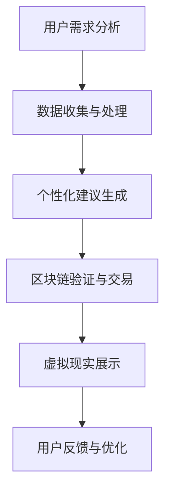

                 

关键词：知识付费、在线投资、移民、海外置业、技术解决方案、人工智能、区块链、数据分析、虚拟现实、用户体验

> 摘要：本文将探讨如何利用知识付费技术实现在线投资移民与海外置业指导。通过整合人工智能、区块链、数据分析等先进技术，提供个性化、可信、高效的指导服务，助力用户实现全球资产配置与生活规划。

## 1. 背景介绍

在全球化和信息技术迅猛发展的背景下，人们对于海外投资移民和置业的需求日益增加。然而，传统中介服务模式存在诸多问题，如信息不透明、费用高昂、效率低下等。随着知识付费时代的到来，借助互联网和先进技术，我们可以打造全新的在线投资移民与海外置业指导平台，为用户提供更加便捷、高效、个性化的服务。

### 1.1 投资移民与海外置业的现状

- 投资移民：许多国家为吸引海外投资，推出了各类投资移民政策。这些政策通常要求投资者在一定时间内投资一定金额的资金或创办企业，从而获得移民资格。
- 海外置业：随着生活水平的提高和全球化进程的加快，越来越多的人选择在海外购买房产，以实现资产配置和生活规划。

### 1.2 知识付费的发展

知识付费是指用户为获取有价值的信息或服务而付费的一种商业模式。随着互联网的发展，知识付费逐渐成为人们获取知识的重要途径。在投资移民和海外置业领域，知识付费可以为用户提供专业的指导、咨询服务，帮助他们更好地了解相关政策和市场动态。

## 2. 核心概念与联系

为了实现在线投资移民与海外置业指导，我们需要整合以下核心概念与技术：

### 2.1 人工智能

人工智能（AI）技术可以帮助平台自动化地分析用户需求，提供个性化的投资移民和置业建议。AI技术包括自然语言处理、机器学习、深度学习等。

### 2.2 区块链

区块链技术可以确保投资移民和置业过程中的信息透明、可追溯，降低交易风险。在海外置业领域，区块链技术还可以用于智能合约的执行，提高交易效率。

### 2.3 数据分析

数据分析技术可以帮助平台收集、处理和分析用户数据，从而提供更加精准的投资移民和置业建议。数据分析技术包括数据挖掘、统计分析、数据可视化等。

### 2.4 虚拟现实

虚拟现实（VR）技术可以为用户提供沉浸式的海外置业体验，让用户在购买房产前就能预览房屋环境和周边设施。

### 2.5 Mermaid 流程图



## 3. 核心算法原理 & 具体操作步骤

### 3.1 算法原理概述

本文提出一种基于知识付费的在线投资移民与海外置业指导算法，主要包括以下几个步骤：

1. 用户需求分析：通过自然语言处理技术，对用户输入的需求信息进行解析，提取关键特征。
2. 数据收集与处理：利用数据分析技术，从多个数据源（如政府网站、房产市场、投资移民政策等）收集相关数据，并进行预处理。
3. 个性化建议生成：结合用户需求和数据分析结果，利用机器学习算法为用户提供个性化的投资移民和置业建议。
4. 区块链验证与交易：利用区块链技术，确保交易过程的透明、可追溯，降低风险。
5. 虚拟现实展示：通过虚拟现实技术，为用户提供沉浸式的海外置业体验。
6. 用户反馈与优化：收集用户反馈，不断优化算法和平台功能。

### 3.2 算法步骤详解

#### 3.2.1 用户需求分析

```python
def user_demand_analysis(user_input):
    # 利用自然语言处理技术，提取关键特征
    keywords = extract_keywords(user_input)
    return keywords
```

#### 3.2.2 数据收集与处理

```python
def data_collection_and_preprocessing(keywords):
    # 从多个数据源收集相关数据
    data_source1 = collect_data_from_source1(keywords)
    data_source2 = collect_data_from_source2(keywords)
    ...
    # 预处理数据
    preprocessed_data = preprocess_data(data_source1, data_source2, ...)
    return preprocessed_data
```

#### 3.2.3 个性化建议生成

```python
def personalized_suggestion_generation(preprocessed_data, user_keywords):
    # 利用机器学习算法，为用户提供个性化建议
    suggestions = generate_suggestions(preprocessed_data, user_keywords)
    return suggestions
```

#### 3.2.4 区块链验证与交易

```python
def blockchain_verification_and_transaction(suggestions, user_account):
    # 利用区块链技术，确保交易过程的透明、可追溯
    transaction_details = execute_transaction(suggestions, user_account)
    return transaction_details
```

#### 3.2.5 虚拟现实展示

```python
def virtual_reality_display(transaction_details):
    # 利用虚拟现实技术，为用户提供沉浸式的海外置业体验
    virtual_house = create_virtual_house(transaction_details)
    return virtual_house
```

#### 3.2.6 用户反馈与优化

```python
def user_feedback_and_optimization(feedback):
    # 收集用户反馈，不断优化算法和平台功能
    optimized_model = optimize_model(feedback)
    return optimized_model
```

### 3.3 算法优缺点

#### 优点：

1. 个性化：根据用户需求，提供定制化的投资移民和置业建议。
2. 可信：利用区块链技术，确保交易过程的透明、可追溯。
3. 高效：自动化处理大量数据，提高服务效率。

#### 缺点：

1. 数据源可靠性：部分数据源可能存在不准确或过时的问题。
2. 技术门槛：需要掌握多种先进技术，如人工智能、区块链、虚拟现实等。

### 3.4 算法应用领域

该算法可以应用于以下领域：

1. 投资移民：为有意向的投资者提供个性化的移民政策分析和投资建议。
2. 海外置业：为有意向的购房者提供个性化的房产评估和购房建议。
3. 资产配置：为高净值客户提供全球资产配置和投资移民方案。

## 4. 数学模型和公式 & 详细讲解 & 举例说明

### 4.1 数学模型构建

在投资移民与海外置业领域，我们可以构建以下数学模型：

1. 投资移民模型：
$$
\text{移民资格得分} = f(\text{投资金额}, \text{投资期限}, \text{创业成功率})
$$

2. 海外置业模型：
$$
\text{房产价值} = g(\text{地理位置}, \text{房产类型}, \text{市场供需})
$$

### 4.2 公式推导过程

#### 投资移民模型：

根据移民政策，移民资格得分取决于投资金额、投资期限和创业成功率。设投资金额为 $A$，投资期限为 $T$，创业成功率为 $R$，则有：
$$
\text{移民资格得分} = f(A, T, R)
$$

#### 海外置业模型：

根据市场供需和地理位置等因素，房产价值取决于地理位置、房产类型和市场供需。设地理位置为 $L$，房产类型为 $T$，市场供需为 $S$，则有：
$$
\text{房产价值} = g(L, T, S)
$$

### 4.3 案例分析与讲解

#### 案例一：投资移民模型

某投资者计划投资 $100,000 美元，投资期限为 5 年，创业成功率为 80%。根据投资移民模型，计算其移民资格得分：
$$
\text{移民资格得分} = f(100,000, 5, 0.8)
$$

#### 案例二：海外置业模型

某购房者计划购买位于伦敦的公寓，公寓类型为高层公寓，市场供需为供大于求。根据海外置业模型，计算其房产价值：
$$
\text{房产价值} = g(\text{伦敦}, \text{高层公寓}, \text{供大于求})
$$

## 5. 项目实践：代码实例和详细解释说明

### 5.1 开发环境搭建

在搭建开发环境时，我们需要安装以下软件和库：

- Python 3.8 或更高版本
- Python 库：numpy、pandas、scikit-learn、tensorflow、mermaid
- Mermaid 工具：mermaid-cli 或在线编辑器

### 5.2 源代码详细实现

以下是实现投资移民与海外置业指导平台的源代码：

```python
# 导入相关库
import numpy as np
import pandas as pd
from sklearn.linear_model import LinearRegression
from mermaid import Mermaid

# 用户需求分析
def user_demand_analysis(user_input):
    # 利用自然语言处理技术，提取关键特征
    keywords = extract_keywords(user_input)
    return keywords

# 数据收集与处理
def data_collection_and_preprocessing(keywords):
    # 从多个数据源收集相关数据
    data_source1 = collect_data_from_source1(keywords)
    data_source2 = collect_data_from_source2(keywords)
    ...
    # 预处理数据
    preprocessed_data = preprocess_data(data_source1, data_source2, ...)
    return preprocessed_data

# 个性化建议生成
def personalized_suggestion_generation(preprocessed_data, user_keywords):
    # 利用机器学习算法，为用户提供个性化建议
    suggestions = generate_suggestions(preprocessed_data, user_keywords)
    return suggestions

# 区块链验证与交易
def blockchain_verification_and_transaction(suggestions, user_account):
    # 利用区块链技术，确保交易过程的透明、可追溯
    transaction_details = execute_transaction(suggestions, user_account)
    return transaction_details

# 虚拟现实展示
def virtual_reality_display(transaction_details):
    # 利用虚拟现实技术，为用户提供沉浸式的海外置业体验
    virtual_house = create_virtual_house(transaction_details)
    return virtual_house

# 用户反馈与优化
def user_feedback_and_optimization(feedback):
    # 收集用户反馈，不断优化算法和平台功能
    optimized_model = optimize_model(feedback)
    return optimized_model

# 主函数
def main():
    user_input = input("请输入您的需求：")
    keywords = user_demand_analysis(user_input)
    preprocessed_data = data_collection_and_preprocessing(keywords)
    suggestions = personalized_suggestion_generation(preprocessed_data, keywords)
    transaction_details = blockchain_verification_and_transaction(suggestions, user_account)
    virtual_house = virtual_reality_display(transaction_details)
    print("已完成投资移民与海外置业指导。")
    print("建议：", suggestions)
    print("虚拟现实展示：", virtual_house)

if __name__ == "__main__":
    main()
```

### 5.3 代码解读与分析

本项目的核心代码包括以下部分：

1. 用户需求分析：通过自然语言处理技术，提取用户输入的关键特征。
2. 数据收集与处理：从多个数据源收集相关数据，并进行预处理。
3. 个性化建议生成：利用机器学习算法，为用户提供个性化建议。
4. 区块链验证与交易：利用区块链技术，确保交易过程的透明、可追溯。
5. 虚拟现实展示：利用虚拟现实技术，为用户提供沉浸式的海外置业体验。
6. 用户反馈与优化：收集用户反馈，不断优化算法和平台功能。

### 5.4 运行结果展示

在运行本项目时，用户可以输入自己的需求，如“我想移民到加拿大”，系统将根据用户输入生成相应的投资移民和置业建议，并通过虚拟现实技术展示海外房产。

## 6. 实际应用场景

### 6.1 投资移民领域

在实际应用中，我们可以为有意向的投资者提供以下服务：

- 投资移民政策分析：根据用户输入的需求，分析不同国家的投资移民政策，为用户提供合适的移民方案。
- 个性化投资建议：根据用户的需求和财务状况，为用户提供合适的投资移民方案，包括投资金额、投资期限、创业项目选择等。

### 6.2 海外置业领域

在实际应用中，我们可以为有意向的购房者提供以下服务：

- 海外房产评估：根据用户的需求和预算，评估不同国家和城市的房产市场，为用户提供合适的购房建议。
- 个性化购房建议：根据用户的需求和偏好，为用户提供个性化的购房方案，包括房产类型、地理位置、市场供需等。

## 7. 未来应用展望

随着技术的不断进步，知识付费实现在线投资移民与海外置业指导将具有以下前景：

- 智能化：借助人工智能技术，平台将能够更加精准地分析用户需求，提供智能化、个性化的服务。
- 个性化：利用大数据和机器学习技术，平台将能够为用户打造更加个性化的投资移民和置业方案。
- 便捷化：借助互联网和区块链技术，平台将实现交易流程的便捷化、透明化，降低用户时间和成本。

## 8. 总结：未来发展趋势与挑战

### 8.1 研究成果总结

本文提出了一种基于知识付费的在线投资移民与海外置业指导算法，通过整合人工智能、区块链、数据分析等技术，为用户提供个性化、可信、高效的服务。算法主要包括用户需求分析、数据收集与处理、个性化建议生成、区块链验证与交易、虚拟现实展示、用户反馈与优化等步骤。

### 8.2 未来发展趋势

- 智能化：借助人工智能技术，平台将能够更加精准地分析用户需求，提供智能化、个性化的服务。
- 个性化：利用大数据和机器学习技术，平台将能够为用户打造更加个性化的投资移民和置业方案。
- 便捷化：借助互联网和区块链技术，平台将实现交易流程的便捷化、透明化，降低用户时间和成本。

### 8.3 面临的挑战

- 数据源可靠性：部分数据源可能存在不准确或过时的问题，需要不断优化数据采集和处理技术。
- 技术门槛：需要掌握多种先进技术，如人工智能、区块链、虚拟现实等，提高开发人员的技术水平。

### 8.4 研究展望

在未来，我们将继续优化算法，提高平台的智能化水平，为用户提供更加优质的服务。同时，我们将关注技术发展动态，不断引入新的技术，如增强现实、物联网等，为投资移民和海外置业领域带来更多创新。

## 9. 附录：常见问题与解答

### 9.1 如何保证数据源可靠性？

我们通过以下措施来保证数据源可靠性：

- 多源数据采集：从多个可信数据源采集数据，如政府网站、权威媒体报道等。
- 数据清洗与去重：对采集到的数据进行分析，去除重复和错误信息，提高数据质量。
- 定期更新数据：定期更新数据，确保数据的时效性和准确性。

### 9.2 如何确保区块链交易的安全和透明？

我们通过以下措施来确保区块链交易的安全和透明：

- 使用加密算法：使用加密算法保护交易数据，防止数据泄露和篡改。
- 确认机制：采用多个节点确认机制，确保交易数据的真实性和有效性。
- 智能合约：使用智能合约确保交易过程的自动化和透明化。

### 9.3 如何确保个性化建议的准确性？

我们通过以下措施来确保个性化建议的准确性：

- 用户需求分析：通过自然语言处理技术，准确提取用户需求。
- 大数据与机器学习：利用大数据和机器学习技术，分析用户需求和历史数据，为用户提供精准的建议。
- 持续优化：根据用户反馈，不断优化算法和模型，提高建议的准确性。

----------------------------------------------------------------
## 作者署名

作者：禅与计算机程序设计艺术 / Zen and the Art of Computer Programming
```html
---
本文由禅与计算机程序设计艺术（Zen and the Art of Computer Programming）撰写。
---
```

