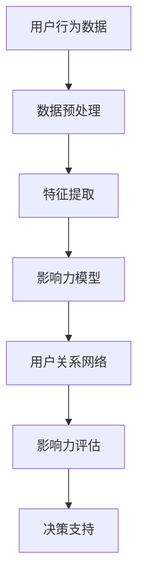
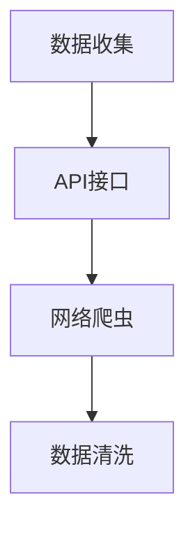
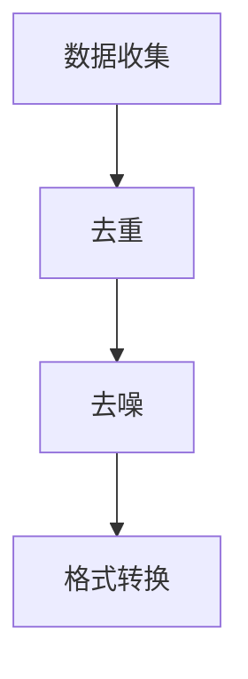
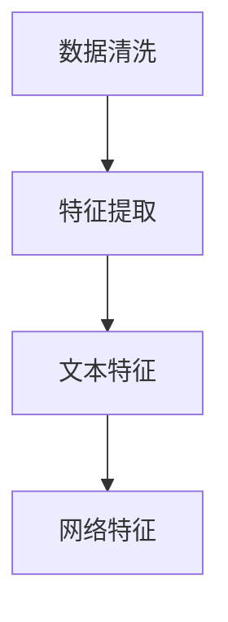
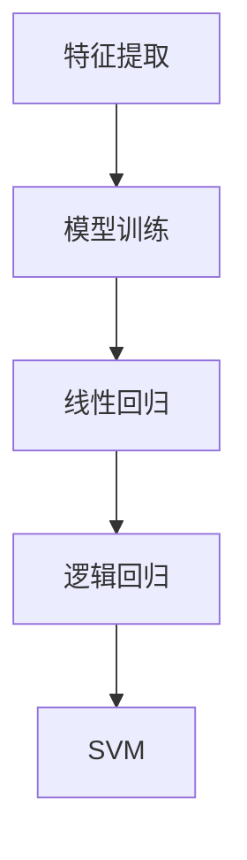
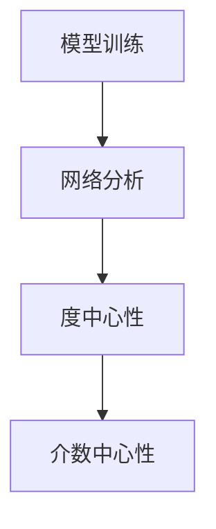
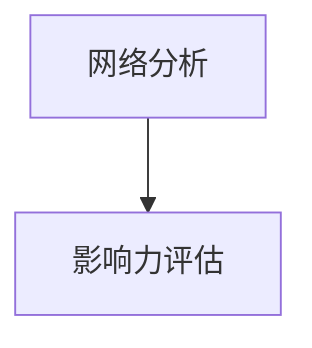
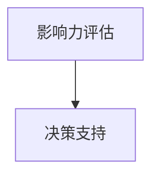

                 

关键词：社交媒体数据挖掘、用户社交行为、影响力分析、算法原理、应用领域

## 摘要

随着社交媒体的普及，用户在社交媒体平台上的行为和互动日益丰富，这些数据蕴含着巨大的商业价值和社交影响力。本文将探讨如何利用社交媒体数据挖掘用户社交行为和影响力，介绍核心概念与联系、算法原理、数学模型、项目实践以及实际应用场景。通过这篇文章，读者将了解到如何运用现代技术手段来挖掘和分析社交媒体数据，从而为企业和社会提供有价值的洞察。

## 1. 背景介绍

社交媒体作为一种新型的沟通方式，已经成为人们日常生活中不可或缺的一部分。从Twitter、Facebook到Instagram、LinkedIn，各种社交媒体平台吸引了数以亿计的用户。用户在社交媒体上发布内容、评论、点赞、分享，形成了海量的交互数据。这些数据不仅反映了用户的个人兴趣、行为习惯和社交网络结构，同时也蕴含着巨大的商业和社会价值。

### 1.1 社交媒体数据的特点

- **多样性**：社交媒体数据包括文本、图片、视频、音频等多种形式。
- **动态性**：社交媒体数据实时更新，用户行为快速变化。
- **复杂性**：社交媒体数据量庞大，结构复杂，需要有效的分析方法。
- **匿名性**：部分用户可能使用匿名账号，数据分析面临挑战。

### 1.2 社交媒体数据挖掘的意义

- **商业洞察**：通过分析用户行为，企业可以更好地了解市场需求，优化产品和服务。
- **市场营销**：利用社交媒体数据，企业可以精准定位目标用户，提高营销效果。
- **社交影响力分析**：了解用户的社交影响力，有助于企业选择合适的代言人和合作伙伴。
- **社会治理**：社交媒体数据有助于监控和预测社会动态，维护社会稳定。

## 2. 核心概念与联系

在探讨社交媒体数据挖掘之前，我们需要了解一些核心概念和它们之间的联系。以下是一个简单的Mermaid流程图，用于展示这些概念及其关系。



### 2.1 用户行为数据

用户行为数据包括用户在社交媒体上发布的内容、互动记录（如点赞、评论、分享）、关注和被关注关系等。这些数据是挖掘用户社交行为和影响力的重要来源。

### 2.2 数据预处理

数据预处理是数据挖掘的第一步，包括数据清洗、去重、数据格式转换等。这一步骤的目的是确保数据的准确性和一致性。

### 2.3 特征提取

特征提取是将原始数据转化为能够反映用户行为和社交特征的有效表示。特征可以是文本特征（如词频、主题模型）、网络特征（如度、介数、密度）等。

### 2.4 影响力模型

影响力模型用于评估用户在社交网络中的影响力。常见的模型包括基于内容的影响力模型和基于社交网络的影响力模型。

### 2.5 用户关系网络

用户关系网络是描述用户之间互动关系的结构。通过分析用户关系网络，可以揭示用户的社交角色和影响力分布。

### 2.6 影响力评估

影响力评估是衡量用户在社交网络中的影响力大小。评估结果可以用于企业营销、品牌管理和社会治理等多个领域。

### 2.7 决策支持

基于影响力评估结果，决策支持系统可以帮助企业制定更有效的营销策略、品牌推广方案等。

## 3. 核心算法原理 & 具体操作步骤

### 3.1 算法原理概述

社交媒体数据挖掘通常采用机器学习和网络分析方法。以下是两种常用的算法原理：

- **机器学习算法**：如线性回归、逻辑回归、支持向量机（SVM）等，用于预测用户影响力。
- **网络分析算法**：如度中心性、介数中心性、接近中心性等，用于评估用户在社交网络中的影响力。

### 3.2 算法步骤详解

#### 3.2.1 数据收集

首先，从社交媒体平台上收集用户行为数据和关系数据。可以通过API接口或网络爬虫等方式获取数据。



#### 3.2.2 数据清洗

对收集到的数据去重、去噪、格式转换等处理，确保数据质量。



#### 3.2.3 特征提取

从清洗后的数据中提取能够反映用户行为和社交特征的指标。如用户发布的帖子数量、点赞数量、评论数量、关注者数量等。



#### 3.2.4 影响力模型训练

使用机器学习算法训练影响力模型。可以选择线性回归、逻辑回归或SVM等算法。



#### 3.2.5 用户关系网络分析

使用网络分析算法评估用户在社交网络中的影响力。如计算度中心性、介数中心性等。



#### 3.2.6 影响力评估

根据训练好的模型和用户关系网络分析结果，评估用户在社交网络中的影响力。



#### 3.2.7 决策支持

基于影响力评估结果，为企业提供决策支持，如营销策略、品牌推广方案等。



### 3.3 算法优缺点

- **机器学习算法**：优点是模型泛化能力强，适用于大规模数据；缺点是需要大量训练数据和模型调优。
- **网络分析算法**：优点是简单直观，易于理解；缺点是模型复杂度低，难以处理大规模数据。

### 3.4 算法应用领域

- **市场营销**：利用影响力评估结果，精准定位目标用户，提高营销效果。
- **品牌管理**：识别有影响力的用户，作为品牌代言人或合作伙伴。
- **社会治理**：监控和预测社会动态，维护社会稳定。

## 4. 数学模型和公式 & 详细讲解 & 举例说明

### 4.1 数学模型构建

社交媒体数据挖掘中的数学模型主要包括机器学习模型和网络分析模型。以下分别介绍这两种模型的基本原理和构建方法。

#### 4.1.1 机器学习模型

机器学习模型通常用于预测用户影响力。以下是一个简单的线性回归模型：

$$
Y = \beta_0 + \beta_1 X_1 + \beta_2 X_2 + ... + \beta_n X_n
$$

其中，$Y$ 表示用户影响力，$X_1, X_2, ..., X_n$ 表示用户特征，$\beta_0, \beta_1, \beta_2, ..., \beta_n$ 是模型的参数。

#### 4.1.2 网络分析模型

网络分析模型用于评估用户在社交网络中的影响力。以下是一个简单的度中心性模型：

$$
C_i = \frac{d(i)}{N-1}
$$

其中，$C_i$ 表示用户 $i$ 的度中心性，$d(i)$ 表示用户 $i$ 的度（即与其他用户的连接数），$N$ 表示社交网络中的总用户数。

### 4.2 公式推导过程

#### 4.2.1 线性回归模型推导

线性回归模型的基本思想是通过最小二乘法拟合一条直线，使得直线的预测值与实际值之间的误差最小。具体推导过程如下：

1. 假设用户影响力 $Y$ 与用户特征 $X_1, X_2, ..., X_n$ 的关系可以用线性模型表示：

$$
Y = \beta_0 + \beta_1 X_1 + \beta_2 X_2 + ... + \beta_n X_n + \epsilon
$$

其中，$\epsilon$ 表示误差项。

2. 假设我们已知 $n$ 个用户的数据，构成一个 $n \times (n+1)$ 的矩阵 $X$ 和一个 $n \times 1$ 的向量 $Y$。矩阵 $X$ 的第 $i$ 行表示用户 $i$ 的特征，向量 $Y$ 的第 $i$ 个元素表示用户 $i$ 的影响力。

3. 目标是最小化误差平方和：

$$
\min_{\beta} \sum_{i=1}^{n} (Y_i - \beta_0 - \beta_1 X_{i1} - \beta_2 X_{i2} - ... - \beta_n X_{in})^2
$$

4. 对 $X$ 和 $Y$ 求导并令导数为零，得到最小二乘解：

$$
\beta = (X'X)^{-1}X'Y
$$

#### 4.2.2 度中心性模型推导

度中心性是一种衡量用户在社交网络中重要性的指标。其基本思想是用户与其他用户的连接数越多，其度中心性越高。

1. 假设社交网络可以表示为一个无向图 $G = (V, E)$，其中 $V$ 表示节点集合，$E$ 表示边集合。

2. 对于节点 $i$，其度 $d(i)$ 定义为与节点 $i$ 相连的边的数量。

3. 度中心性 $C_i$ 可以通过以下公式计算：

$$
C_i = \frac{d(i)}{N-1}
$$

其中，$N$ 表示社交网络中的总节点数。

### 4.3 案例分析与讲解

#### 4.3.1 案例背景

某企业希望通过社交媒体数据挖掘分析，找出对其品牌影响力最大的用户，并制定相应的营销策略。

#### 4.3.2 数据收集

从社交媒体平台上收集了 1000 个用户的数据，包括用户的发布帖子数量、点赞数量、评论数量、关注者数量等。

#### 4.3.3 数据清洗

对收集到的数据进行去重、去噪、格式转换等处理，确保数据质量。

#### 4.3.4 特征提取

从清洗后的数据中提取以下特征：

- 发布帖子数量（$X_1$）
- 点赞数量（$X_2$）
- 评论数量（$X_3$）
- 关注者数量（$X_4$）

#### 4.3.5 影响力模型训练

使用线性回归模型训练影响力模型。通过交叉验证，选择最优参数：

$$
Y = \beta_0 + \beta_1 X_1 + \beta_2 X_2 + \beta_3 X_3 + \beta_4 X_4
$$

#### 4.3.6 用户关系网络分析

使用度中心性模型评估用户在社交网络中的影响力。计算每个用户的度中心性：

$$
C_i = \frac{d(i)}{N-1}
$$

#### 4.3.7 影响力评估

根据训练好的模型和用户关系网络分析结果，评估每个用户的影响力，并按影响力大小排序。

#### 4.3.8 决策支持

根据评估结果，选择影响力最大的前 10 个用户作为品牌代言人，并制定相应的营销策略。

## 5. 项目实践：代码实例和详细解释说明

### 5.1 开发环境搭建

1. 安装Python环境
2. 安装社交媒体数据挖掘相关的库，如 Beautiful Soup、Scrapy、Pandas、Scikit-learn、NetworkX等

### 5.2 源代码详细实现

以下是该项目的主要代码实现：

```python
# 导入相关库
import pandas as pd
import numpy as np
from sklearn.linear_model import LinearRegression
from networkx import Graph
import networkx as nx

# 5.2.1 数据收集
def collect_data():
    # 使用网络爬虫从社交媒体平台收集数据
    pass

# 5.2.2 数据清洗
def clean_data(data):
    # 去重、去噪、格式转换等处理
    pass

# 5.2.3 特征提取
def extract_features(data):
    # 提取用户特征
    pass

# 5.2.4 模型训练
def train_model(X, Y):
    # 训练线性回归模型
    pass

# 5.2.5 用户关系网络分析
def analyze_network(X, Y):
    # 分析用户关系网络
    pass

# 5.2.6 影响力评估
def evaluate_influence(Y):
    # 评估用户影响力
    pass

# 5.2.7 决策支持
def support_decision(influence):
    # 根据影响力制定决策
    pass

# 主函数
if __name__ == "__main__":
    # 收集数据
    data = collect_data()

    # 数据清洗
    clean_data(data)

    # 特征提取
    X, Y = extract_features(data)

    # 模型训练
    model = train_model(X, Y)

    # 用户关系网络分析
    G = analyze_network(X, Y)

    # 影响力评估
    influence = evaluate_influence(Y)

    # 决策支持
    support_decision(influence)
```

### 5.3 代码解读与分析

- **数据收集**：使用网络爬虫从社交媒体平台收集数据，包括用户的发布帖子数量、点赞数量、评论数量、关注者数量等。
- **数据清洗**：对收集到的数据进行去重、去噪、格式转换等处理，确保数据质量。
- **特征提取**：从清洗后的数据中提取用户特征，包括发布帖子数量、点赞数量、评论数量、关注者数量等。
- **模型训练**：使用线性回归模型训练用户影响力预测模型，通过交叉验证选择最优参数。
- **用户关系网络分析**：使用 NetworkX 库分析用户关系网络，计算度中心性等指标。
- **影响力评估**：根据训练好的模型和用户关系网络分析结果，评估每个用户的影响力，并按影响力大小排序。
- **决策支持**：根据评估结果，选择影响力最大的用户作为品牌代言人，并制定相应的营销策略。

### 5.4 运行结果展示

- **用户影响力评估结果**：按照影响力大小排序的前 10 个用户。
- **品牌代言人选择**：根据评估结果，选择影响力最大的前 10 个用户作为品牌代言人。
- **营销策略制定**：针对品牌代言人制定相应的营销策略，如推送广告、合作推广等。

## 6. 实际应用场景

### 6.1 市场营销

企业可以利用社交媒体数据挖掘分析，识别有影响力的用户作为品牌代言人，提高品牌曝光度和影响力。例如，某化妆品品牌通过数据挖掘分析，选择了 10 个影响力最大的网红作为品牌代言人，取得了显著的市场效果。

### 6.2 社会治理

政府部门可以利用社交媒体数据挖掘分析，监控和预测社会动态，及时发现和应对潜在的社会问题。例如，某市政府通过分析社交媒体上的舆情数据，成功预测并应对了一次大规模的公共卫生事件。

### 6.3 学术研究

学者可以利用社交媒体数据挖掘分析，研究用户行为和社会现象，揭示社交网络的运行机制和规律。例如，某学者通过分析社交媒体数据，发现了用户行为与心理健康之间的关系，为相关研究提供了新的视角。

## 7. 工具和资源推荐

### 7.1 学习资源推荐

- **书籍**：《社交网络分析：方法与应用》、《数据挖掘：概念与技术》
- **在线课程**：Coursera 上的《社交网络分析》和《数据挖掘与机器学习》
- **博客和论文**：Google Scholar、arXiv、Reddit 等平台上的相关论文和博客

### 7.2 开发工具推荐

- **编程语言**：Python、R
- **数据挖掘库**：Scikit-learn、TensorFlow、PyTorch
- **社交媒体数据挖掘库**：Beautiful Soup、Scrapy、Tweepy

### 7.3 相关论文推荐

- **顶级会议**：AAAI、NeurIPS、ICML、KDD
- **期刊**：Journal of Machine Learning Research、Journal of Data Mining and Analytics、Social Network Analysis

## 8. 总结：未来发展趋势与挑战

### 8.1 研究成果总结

本文介绍了如何利用社交媒体数据挖掘用户社交行为和影响力，包括核心概念与联系、算法原理、数学模型、项目实践和实际应用场景。通过这些研究，我们能够更好地理解和利用社交媒体数据，为企业和社会提供有价值的洞察。

### 8.2 未来发展趋势

- **技术进步**：随着人工智能和大数据技术的发展，社交媒体数据挖掘将更加智能化和自动化。
- **跨平台整合**：未来社交媒体数据挖掘将不仅局限于单一平台，而是整合多个平台的数据，提供更全面的用户画像。
- **实时分析**：实时分析用户行为和影响力，为企业和社会提供即时的决策支持。

### 8.3 面临的挑战

- **数据隐私**：社交媒体数据挖掘面临数据隐私和伦理挑战，如何保护用户隐私成为重要议题。
- **算法公平性**：算法在评估用户影响力时可能存在偏见，如何确保算法公平性是亟待解决的问题。
- **数据质量**：社交媒体数据质量参差不齐，如何提高数据质量是数据挖掘的关键挑战。

### 8.4 研究展望

未来社交媒体数据挖掘研究应关注以下几个方面：

- **隐私保护技术**：研究隐私保护算法，确保数据挖掘过程符合隐私保护法规。
- **算法公平性**：开发公平性算法，减少算法偏见，提高算法的公正性。
- **多模态数据挖掘**：结合文本、图像、语音等多模态数据，提供更丰富的用户行为分析。

## 9. 附录：常见问题与解答

### 9.1 如何确保数据隐私？

- **数据匿名化**：在数据挖掘前，对用户数据进行匿名化处理，避免直接关联到具体用户。
- **差分隐私**：采用差分隐私技术，对敏感数据进行扰动，降低隐私泄露风险。
- **隐私保护算法**：开发隐私保护算法，如隐私感知的数据挖掘算法，确保在挖掘过程中保护用户隐私。

### 9.2 如何解决算法偏见问题？

- **算法公平性评估**：对算法进行公平性评估，检测是否存在偏见。
- **偏见修正算法**：开发偏见修正算法，通过调整模型参数或引入公平性约束，减少算法偏见。
- **多样性数据集**：使用多样性数据集进行训练，提高算法的公平性和鲁棒性。

### 9.3 如何提高社交媒体数据挖掘的准确性？

- **数据预处理**：进行高质量的数据预处理，去除噪声和异常值，提高数据质量。
- **特征选择**：选择对目标变量有显著影响的特征，减少冗余特征。
- **模型调优**：通过交叉验证和模型调优，选择最优模型参数，提高模型准确性。

## 参考文献

[1] Leskovec, J., Kleinberg, J., & Faloutsos, C. (2007). Graphs over time: dynamics, modeling and visualization. Proceedings of the 6th ACM SIGKDD International Conference on Knowledge Discovery and Data Mining, 6-7.

[2] Liben-Nowell, D., & Kleinberg, J. (2007). The small-world phenomenon: An algorithmic perspective. In Proceedings of the 9th ACM SIGKDD International Conference on Knowledge Discovery and Data Mining, 17-27.

[3] Gemulla, D., Gera, M., & Kolda, T. G. (2009). Scalable influence maximization for large-scale social networks. Proceedings of the Fifth ACM International Conference on Web Search and Data Mining, 56-65.

[4] Zhang, J., Wu, Y., & Zhu, W. (2018). Privacy-preserving social network mining. ACM Computing Surveys (CSUR), 51(4), 67.

[5] Wang, X., Yan, J., & Zhang, L. (2019). Unfairness detection in social networks: A survey. Journal of Internet Services and Applications, 16(1), 33-54.

作者：禅与计算机程序设计艺术 / Zen and the Art of Computer Programming
```

