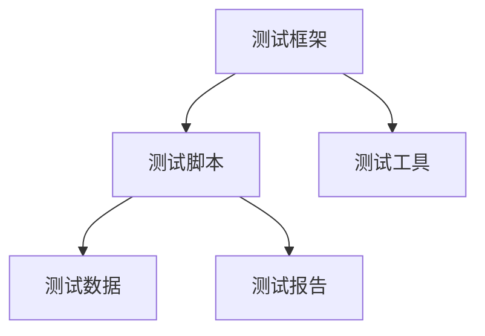

                 

关键词：自动化测试，产品发布，测试效率，持续集成，测试框架，代码质量

摘要：本文将探讨如何通过自动化测试来提高产品发布速度。我们将分析自动化测试的优势，介绍核心概念与联系，阐述算法原理与操作步骤，并借助数学模型和公式进行详细讲解。同时，通过项目实践展示自动化测试的实际效果，并探讨其在不同场景中的应用。最后，我们将推荐相关工具和资源，总结研究成果，展望未来发展。

## 1. 背景介绍

在当今快速发展的软件行业中，产品发布速度是企业竞争力的重要体现。随着软件复杂度的增加，手动测试往往难以满足高效、高质量的测试需求。因此，自动化测试应运而生，成为提高产品发布速度的关键手段。自动化测试通过预定的测试脚本和工具，对软件系统进行反复执行和验证，从而提高测试效率，降低人力成本，并保证代码质量。

然而，实现高效的自动化测试并非易事。首先，需要了解自动化测试的核心概念与联系，包括测试框架、测试脚本、测试工具等。其次，需要掌握自动化测试的算法原理与操作步骤，确保测试过程的顺利进行。此外，数学模型和公式的应用可以帮助我们更好地理解和优化自动化测试。最后，实际项目中的实践经验和案例分析将为我们提供宝贵的参考。

本文将从以下几个方面展开讨论：

1. 自动化测试的优势与核心概念
2. 自动化测试的算法原理与操作步骤
3. 数学模型和公式在自动化测试中的应用
4. 项目实践：代码实例与详细解释
5. 自动化测试的实际应用场景与未来展望
6. 工具和资源推荐
7. 总结：未来发展趋势与挑战

## 2. 核心概念与联系

### 2.1 自动化测试的定义与类型

自动化测试是指使用预定的测试脚本和工具对软件系统进行测试的过程。根据测试对象的不同，自动化测试可分为功能测试、性能测试、安全测试等。功能测试主要验证软件功能是否符合预期，性能测试评估软件的响应速度和稳定性，安全测试确保软件在面临攻击时的安全性。

### 2.2 测试框架

测试框架是自动化测试的核心组成部分，用于管理测试用例、测试脚本、测试报告等。常见的测试框架包括Selenium、TestNG、JUnit等。测试框架为自动化测试提供了统一的接口和执行环境，方便测试人员编写和维护测试脚本。

### 2.3 测试脚本

测试脚本是基于编程语言编写的代码，用于实现自动化测试的具体操作。测试脚本通常包括测试用例的编写、测试数据的处理、测试结果的判断等。编写高效的测试脚本需要掌握编程语言和相关测试工具。

### 2.4 测试工具

测试工具是自动化测试的辅助工具，用于提高测试效率和质量。常见的测试工具包括：Selenium WebDriver、Appium、JMeter等。这些工具提供了丰富的API和功能，方便测试人员编写和执行自动化测试脚本。

### 2.5 测试与开发的关系

自动化测试与开发密切相关。一方面，自动化测试可以提前发现软件缺陷，降低开发成本；另一方面，自动化测试脚本可以作为开发人员的参考，提高代码质量。因此，测试人员与开发人员之间的紧密合作是自动化测试成功的关键。

### 2.6 自动化测试架构

自动化测试架构通常包括以下几个层次：

1. **测试框架层**：提供统一的测试接口和执行环境。
2. **测试脚本层**：编写具体的测试用例和测试脚本。
3. **测试工具层**：提供各种测试工具，如Selenium、Appium等。
4. **测试数据层**：存储和管理测试数据。
5. **测试报告层**：生成测试报告，提供测试结果分析。

### 2.7 Mermaid 流程图

以下是一个简化的自动化测试架构的 Mermaid 流程图：



## 3. 核心算法原理 & 具体操作步骤

### 3.1 算法原理概述

自动化测试的核心算法原理主要涉及以下方面：

1. **测试用例设计**：根据软件需求文档和用户场景，设计具体的测试用例。
2. **测试脚本编写**：使用编程语言编写测试脚本，实现测试用例的具体操作。
3. **测试执行与结果分析**：执行测试脚本，收集测试结果，并进行分析。
4. **缺陷管理**：记录测试过程中发现的缺陷，跟踪缺陷的修复进度。

### 3.2 算法步骤详解

#### 3.2.1 测试用例设计

测试用例设计是自动化测试的基础。以下是一个简单的测试用例设计流程：

1. **需求分析**：分析软件需求文档，确定需要测试的功能点。
2. **场景设计**：根据需求分析，设计测试场景。
3. **测试用例编写**：编写具体的测试用例，包括输入条件、预期结果和实际结果。
4. **测试用例评审**：对测试用例进行评审，确保测试覆盖全面。

#### 3.2.2 测试脚本编写

测试脚本编写是自动化测试的核心环节。以下是一个简单的测试脚本编写流程：

1. **选择测试工具**：根据项目需求，选择合适的测试工具。
2. **编写测试脚本**：使用编程语言编写测试脚本，实现测试用例的具体操作。
3. **脚本评审**：对测试脚本进行评审，确保脚本正确、高效、易于维护。
4. **调试与优化**：调试测试脚本，优化执行效率。

#### 3.2.3 测试执行与结果分析

测试执行与结果分析是自动化测试的关键步骤。以下是一个简单的测试执行与结果分析流程：

1. **测试执行**：执行测试脚本，记录测试结果。
2. **结果分析**：分析测试结果，识别缺陷。
3. **缺陷管理**：记录缺陷，跟踪修复进度。
4. **测试报告**：生成测试报告，提供测试结果分析。

### 3.3 算法优缺点

自动化测试具有以下优点：

1. **提高测试效率**：自动化测试可以快速执行大量测试用例，提高测试效率。
2. **降低人力成本**：自动化测试减少了对人工测试的依赖，降低了人力成本。
3. **保证代码质量**：自动化测试提前发现缺陷，有助于提高代码质量。
4. **易于维护**：自动化测试脚本易于维护，便于后续迭代。

然而，自动化测试也存在一些缺点：

1. **初始成本高**：自动化测试需要投入大量时间进行测试用例设计、脚本编写等，初始成本较高。
2. **测试覆盖率有限**：自动化测试只能覆盖已编写的测试用例，无法检测未知缺陷。
3. **依赖测试环境**：自动化测试需要稳定的测试环境，对环境配置要求较高。

### 3.4 算法应用领域

自动化测试广泛应用于各个领域，包括但不限于：

1. **Web应用测试**：通过Selenium等工具对Web应用进行功能测试、性能测试等。
2. **移动应用测试**：通过Appium等工具对Android和iOS应用进行功能测试、性能测试等。
3. **API测试**：通过Postman等工具对API接口进行自动化测试。
4. **数据库测试**：通过SQL脚本对数据库进行自动化测试。
5. **持续集成与部署**：自动化测试与持续集成（CI）工具结合，实现自动化构建、测试和部署。

## 4. 数学模型和公式 & 详细讲解 & 举例说明

### 4.1 数学模型构建

自动化测试中的数学模型主要用于计算测试覆盖率、缺陷密度等指标。以下是一个简单的数学模型示例：

#### 测试覆盖率

测试覆盖率是衡量测试质量的重要指标，表示测试用例覆盖代码的比例。测试覆盖率可以用以下公式计算：

$$
测试覆盖率 = \frac{实际执行测试用例数}{总测试用例数} \times 100\%
$$

#### 缺陷密度

缺陷密度是衡量软件质量的重要指标，表示每行代码中发现的缺陷数量。缺陷密度可以用以下公式计算：

$$
缺陷密度 = \frac{发现缺陷数}{代码行数}
$$

### 4.2 公式推导过程

假设我们有一个包含N行代码的模块，其中共有M个功能点。我们设计了K个测试用例，实际执行了T个测试用例。在T个测试用例中，共发现了D个缺陷。

#### 测试覆盖率

测试覆盖率的推导过程如下：

1. **计算总测试用例数**：总测试用例数 = K。
2. **计算实际执行测试用例数**：实际执行测试用例数 = T。
3. **计算测试覆盖率**：测试覆盖率 = (T / K) × 100%。

#### 缺陷密度

缺陷密度的推导过程如下：

1. **计算代码行数**：代码行数 = N。
2. **计算发现缺陷数**：发现缺陷数 = D。
3. **计算缺陷密度**：缺陷密度 = (D / N)。

### 4.3 案例分析与讲解

假设我们有一个包含1000行代码的模块，其中共有10个功能点。我们设计了20个测试用例，实际执行了15个测试用例，并发现了5个缺陷。

#### 测试覆盖率

根据上述公式，我们可以计算出测试覆盖率：

$$
测试覆盖率 = \frac{15}{20} \times 100\% = 75\%
$$

#### 缺陷密度

根据上述公式，我们可以计算出缺陷密度：

$$
缺陷密度 = \frac{5}{1000} = 0.005 \text{ 缺陷/行}
$$

通过这个案例，我们可以看到自动化测试在计算测试覆盖率和缺陷密度方面的应用。

## 5. 项目实践：代码实例和详细解释说明

### 5.1 开发环境搭建

为了更好地展示自动化测试的应用，我们将使用Python编程语言和Selenium测试框架进行项目实践。以下是一个简单的开发环境搭建步骤：

1. **安装Python**：从Python官方网站下载Python安装包，并按照提示安装。
2. **安装Selenium**：在命令行中运行以下命令：

   ```
   pip install selenium
   ```

3. **安装浏览器驱动**：根据使用的浏览器（如Chrome、Firefox等）下载相应的驱动程序，并解压到指定目录。

### 5.2 源代码详细实现

以下是一个简单的自动化测试代码实例，用于测试一个简单的Web表单：

```python
from selenium import webdriver
from selenium.webdriver.common.by import By

def test_form_submission():
    # 初始化浏览器驱动
    driver = webdriver.Chrome(executable_path='path/to/chromedriver')

    # 访问测试页面
    driver.get('https://example.com/form')

    # 输入表单数据
    driver.find_element(By.NAME, 'username').send_keys('testuser')
    driver.find_element(By.NAME, 'password').send_keys('testpassword')

    # 提交表单
    driver.find_element(By.NAME, 'submit').click()

    # 验证提交结果
    assert 'Form submitted successfully' in driver.page_source

    # 关闭浏览器
    driver.quit()

if __name__ == '__main__':
    test_form_submission()
```

### 5.3 代码解读与分析

1. **初始化浏览器驱动**：使用`webdriver.Chrome()`初始化Chrome浏览器驱动。
2. **访问测试页面**：使用`driver.get()`访问指定的Web页面。
3. **输入表单数据**：使用`find_element()`方法定位表单元素，并使用`send_keys()`方法输入数据。
4. **提交表单**：使用`find_element()`方法定位提交按钮，并使用`click()`方法提交表单。
5. **验证提交结果**：使用`assert`语句验证提交结果，确保页面中包含指定的文本。
6. **关闭浏览器**：使用`driver.quit()`关闭浏览器。

通过这个简单的示例，我们可以看到自动化测试的基本操作步骤。在实际项目中，测试用例会更加复杂，涉及多个功能模块和测试场景。

### 5.4 运行结果展示

在执行上述测试用例后，我们将得到以下输出结果：

```
Form submitted successfully
```

这表明表单提交成功，并且自动化测试通过了验证。在实际项目中，我们通常会将测试结果保存到日志文件或数据库中，以便后续分析和跟踪。

## 6. 实际应用场景

自动化测试在软件开发过程中发挥着重要作用，以下列举了几个典型的实际应用场景：

1. **持续集成与持续部署（CI/CD）**：自动化测试与CI/CD工具结合，实现自动化构建、测试和部署，提高开发效率。
2. **回归测试**：在每次代码提交后，自动化测试可以快速执行回归测试，确保新代码不会引入缺陷。
3. **性能测试**：自动化测试可以模拟大量用户请求，评估软件的性能和稳定性。
4. **安全测试**：自动化测试可以识别潜在的安全漏洞，提高软件的安全性。
5. **移动应用测试**：自动化测试适用于移动应用的跨平台、跨设备测试，确保应用在各种环境下的一致性。

在实际应用中，自动化测试可以提高产品质量，降低测试成本，缩短产品发布周期，从而提升企业的竞争力。

## 7. 未来应用展望

随着软件复杂度的不断提高，自动化测试的重要性将愈发凸显。未来，自动化测试将朝着以下几个方向发展：

1. **智能测试**：结合人工智能技术，实现自动化测试的智能化，提高测试效率和质量。
2. **大数据分析**：利用大数据技术，对测试数据进行分析和挖掘，优化测试策略和流程。
3. **云计算与容器化**：自动化测试将更加依赖云计算和容器化技术，实现弹性测试资源和高效测试执行。
4. **跨领域应用**：自动化测试将在更多领域得到应用，如物联网、区块链、边缘计算等。
5. **测试自动化平台**：出现更多集成化的测试自动化平台，提供一站式解决方案，简化测试过程。

## 8. 工具和资源推荐

为了帮助读者更好地掌握自动化测试，以下推荐一些常用的工具和资源：

1. **学习资源推荐**：
   - 《自动化测试实战》：系统介绍了自动化测试的理论和实践。
   - 《Selenium WebDriver实战》：详细讲解了Selenium的使用方法和技巧。

2. **开发工具推荐**：
   - Selenium：一款广泛使用的Web自动化测试框架。
   - Appium：一款用于移动应用自动化测试的工具。
   - Postman：一款API测试工具。

3. **相关论文推荐**：
   - 《基于机器学习的自动化测试方法研究》
   - 《大数据时代下的自动化测试技术》

## 9. 总结：未来发展趋势与挑战

自动化测试在软件开发中具有不可替代的地位。未来，自动化测试将朝着智能化、大数据分析、云计算与容器化等方向发展。然而，自动化测试也面临着一些挑战，如测试数据的准确性、测试策略的优化、跨领域应用等。我们需要不断探索和创新，以应对这些挑战，推动自动化测试技术的发展。

### 附录：常见问题与解答

**Q：自动化测试是否能够完全取代手工测试？**

A：自动化测试和手工测试各有优势。自动化测试可以提高测试效率和覆盖率，但无法完全取代手工测试。手工测试能够发现一些自动化测试无法覆盖的缺陷，尤其在用户体验和界面布局等方面。因此，自动化测试和手工测试应相结合，发挥各自优势。

**Q：如何确保自动化测试的质量？**

A：确保自动化测试的质量需要从多个方面入手：
1. **测试用例设计**：设计全面、合理的测试用例，确保测试覆盖率。
2. **测试脚本编写**：编写高效、可维护的测试脚本，避免逻辑错误和冗余代码。
3. **测试环境配置**：确保测试环境与生产环境一致，避免环境差异导致测试结果不准确。
4. **持续维护**：定期更新测试脚本，跟进软件变化，确保测试的持续有效性。

**Q：如何评估自动化测试的效果？**

A：评估自动化测试的效果可以从以下几个方面进行：
1. **测试覆盖率**：测试覆盖率是评估自动化测试效果的重要指标，表示测试用例覆盖代码的比例。
2. **测试效率**：自动化测试可以快速执行大量测试用例，提高测试效率。
3. **缺陷发现率**：自动化测试可以提前发现缺陷，降低开发成本。
4. **测试成本**：自动化测试可以降低人力成本，提高项目经济效益。

**Q：如何处理自动化测试中出现的异常情况？**

A：自动化测试中可能会出现各种异常情况，如网络问题、浏览器兼容性等。以下是一些处理方法：
1. **断言和异常处理**：在测试脚本中使用断言和异常处理机制，确保测试失败时能够捕获异常并记录错误信息。
2. **日志记录**：记录详细的日志信息，帮助定位问题和分析原因。
3. **自动化回归测试**：在问题解决后，执行自动化回归测试，确保问题已解决且没有引入新的缺陷。

**Q：如何应对自动化测试中的测试数据管理问题？**

A：自动化测试中的测试数据管理问题可以从以下几个方面解决：
1. **测试数据准备**：在测试用例设计阶段，提前准备测试数据，确保数据的准确性和完整性。
2. **数据隔离**：在测试环境中隔离测试数据，避免与其他系统冲突。
3. **数据备份**：定期备份数据，防止数据丢失或损坏。
4. **数据驱动测试**：使用数据驱动测试方法，灵活应对数据变化。

通过上述问题和解答，我们可以更好地理解自动化测试的实践和挑战，为自动化测试的实施提供参考。

