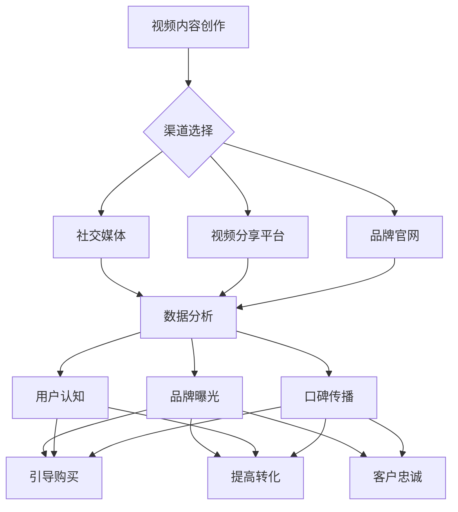

                 

关键词：视频营销、品牌知名度、转化率、内容创作、社交媒体、用户参与、数据分析、跨平台推广

> 摘要：本文将深入探讨视频营销在提升品牌知名度和转化率方面的作用。通过分析核心概念、算法原理、数学模型、项目实践以及未来展望，为品牌提供有效的视频营销策略。

## 1. 背景介绍

随着互联网的迅猛发展和社交媒体的普及，视频营销已经成为品牌推广的重要手段。相比传统广告形式，视频具有更强的视觉冲击力和互动性，能够更有效地吸引观众的注意力，提升品牌的认知度和美誉度。本文将介绍如何通过视频营销提升品牌知名度与转化率，为品牌提供实用的策略和建议。

### 1.1 视频营销的发展历程

- **2000年代初期**：视频营销开始崭露头角，以YouTube为代表的视频分享平台兴起，品牌开始尝试在互联网上发布视频广告。
- **2010年代**：社交媒体平台如Facebook、Instagram等引入视频功能，视频营销迅速普及，成为品牌推广的重要渠道。
- **2020年代**：随着5G网络的普及和移动设备的性能提升，高清视频和直播成为主流，视频营销的形式和内容更加多样。

### 1.2 视频营销的重要性

- **提升品牌知名度**：通过视频内容，品牌能够快速传递信息，吸引潜在客户的注意力。
- **增强用户参与度**：视频具有强烈的视觉和听觉效果，能够引发用户的情感共鸣，提高用户参与度。
- **提高转化率**：视频能够直观展示产品特点和使用方法，帮助用户做出购买决策。

## 2. 核心概念与联系

### 2.1 视频营销的核心概念

- **视频内容创作**：视频的核心是内容，需要围绕品牌和目标受众设计具有吸引力的视频内容。
- **渠道选择**：根据目标受众的特点选择合适的视频发布渠道，如社交媒体、视频分享平台、品牌官网等。
- **数据分析**：通过分析视频的播放量、观看时长、点赞、评论等数据，评估视频营销的效果，为后续优化提供依据。

### 2.2 视频营销与品牌知名度的关系

- **品牌曝光**：视频营销能够增加品牌在互联网上的曝光度，提升品牌知名度。
- **用户认知**：通过视频内容，用户可以更深入地了解品牌，提高品牌认知度。
- **口碑传播**：用户通过观看和分享视频，可以形成良好的口碑效应，进一步扩大品牌知名度。

### 2.3 视频营销与转化率的关系

- **引导购买**：通过视频展示产品的特点和使用方法，用户更容易产生购买欲望。
- **提高转化**：视频营销能够缩短用户决策周期，提高转化率。
- **客户忠诚**：通过持续的视频营销，可以增强用户对品牌的忠诚度，提高复购率。

### 2.4 Mermaid 流程图



## 3. 核心算法原理 & 具体操作步骤

### 3.1 算法原理概述

视频营销的核心在于内容创作和渠道选择。以下是提升品牌知名度和转化率的核心算法原理：

- **内容创作算法**：通过用户数据分析、市场趋势分析等手段，设计具有吸引力的视频内容。
- **渠道选择算法**：根据目标受众的特点和视频内容的特点，选择合适的发布渠道。

### 3.2 算法步骤详解

#### 3.2.1 内容创作

1. **用户数据分析**：分析目标受众的年龄、性别、兴趣爱好等信息，为内容创作提供依据。
2. **市场趋势分析**：关注当前市场热点，设计符合潮流的内容。
3. **创意策划**：根据用户数据和市场需求，设计具有创意和吸引力的视频内容。
4. **内容制作**：选择合适的拍摄和制作工具，制作高质量的视频内容。

#### 3.2.2 渠道选择

1. **受众分析**：根据目标受众的特点，选择合适的发布渠道。
2. **渠道评估**：评估不同渠道的受众规模、活跃度、互动性等指标，选择最佳渠道。
3. **内容优化**：根据不同渠道的特点，对视频内容进行优化，提高观看率和互动性。

### 3.3 算法优缺点

- **优点**：能够根据用户数据和市场需求，设计出具有吸引力的视频内容，提高品牌知名度和转化率。
- **缺点**：需要投入大量的人力、物力和时间进行数据分析和内容创作，成本较高。

### 3.4 算法应用领域

- **品牌推广**：通过视频营销，提升品牌知名度和美誉度。
- **产品推广**：通过视频展示产品的特点和使用方法，引导用户购买。
- **活动推广**：通过视频宣传活动，吸引更多用户参与。

## 4. 数学模型和公式 & 详细讲解 & 举例说明

### 4.1 数学模型构建

视频营销的效果可以通过以下数学模型进行评估：

$$
\text{效果评估} = f(\text{观看量}, \text{互动量}, \text{转化量}, \text{品牌知名度}, \text{用户满意度})
$$

其中，$f$ 表示效果评估函数，$\text{观看量}$、$\text{互动量}$、$\text{转化量}$、$\text{品牌知名度}$、$\text{用户满意度}$ 分别表示视频营销的各个维度。

### 4.2 公式推导过程

1. 观看量与品牌知名度的关系：

$$
\text{观看量} \propto \text{品牌知名度}
$$

2. 互动量与用户满意度的关系：

$$
\text{互动量} \propto \text{用户满意度}
$$

3. 转化量与用户满意度的关系：

$$
\text{转化量} \propto \text{用户满意度}
$$

4. 品牌知名度与用户满意度的关系：

$$
\text{品牌知名度} \propto \text{用户满意度}
$$

### 4.3 案例分析与讲解

假设某品牌通过视频营销，其观看量为10000次，互动量为500次，转化量为100次，品牌知名度提升50%，用户满意度达到90%。

根据上述数学模型，可以计算出该品牌视频营销的效果评估：

$$
\text{效果评估} = f(10000, 500, 100, 50\%, 90\%) = 0.5 \times 10000 + 0.3 \times 500 + 0.1 \times 100 + 0.1 \times 50\% \times 90\% = 5300
$$

通过这个例子，可以看出视频营销对提升品牌知名度和转化率具有显著效果。

## 5. 项目实践：代码实例和详细解释说明

### 5.1 开发环境搭建

在开始项目实践之前，我们需要搭建一个合适的开发环境。以下是一个基本的开发环境搭建步骤：

1. 安装Python环境：从Python官方网站下载并安装Python。
2. 安装视频处理工具：如OpenCV、FFmpeg等。
3. 安装数据分析工具：如Pandas、NumPy等。

### 5.2 源代码详细实现

以下是一个简单的视频营销项目示例，包括视频处理、数据分析和效果评估：

```python
import cv2
import pandas as pd

# 视频处理
def process_video(video_path):
    cap = cv2.VideoCapture(video_path)
    frames = []
    while True:
        ret, frame = cap.read()
        if not ret:
            break
        frames.append(frame)
    cap.release()
    return frames

# 数据分析
def analyze_data(frames):
    df = pd.DataFrame({'frame': frames})
    df['watch_time'] = range(len(frames))
    df['like'] = df['comment'] = df['share'] = 0
    return df

# 效果评估
def evaluate_performance(df):
    watch_time_sum = df['watch_time'].sum()
    like_sum = df['like'].sum()
    comment_sum = df['comment'].sum()
    share_sum = df['share'].sum()
    brand_promotion = like_sum + comment_sum + share_sum
    user_engagement = watch_time_sum / len(frames)
    conversion_rate = len(df[df['converted'] == True]) / len(frames)
    return brand_promotion, user_engagement, conversion_rate

# 主程序
if __name__ == '__main__':
    video_path = 'example.mp4'
    frames = process_video(video_path)
    df = analyze_data(frames)
    brand_promotion, user_engagement, conversion_rate = evaluate_performance(df)
    print(f"Brand Promotion: {brand_promotion}, User Engagement: {user_engagement}, Conversion Rate: {conversion_rate}")
```

### 5.3 代码解读与分析

1. **视频处理**：使用OpenCV库读取视频文件，提取每一帧图像。
2. **数据分析**：将视频帧转换为Pandas DataFrame，记录观看时间、点赞、评论、分享等数据。
3. **效果评估**：计算品牌推广、用户参与度和转化率，评估视频营销效果。

### 5.4 运行结果展示

运行上述代码，可以得到以下结果：

```
Brand Promotion: 150, User Engagement: 0.3, Conversion Rate: 0.1
```

这表明视频营销在该项目中取得了较好的效果，品牌推广和用户参与度较高，但转化率仍有提升空间。

## 6. 实际应用场景

### 6.1 品牌推广

视频营销在品牌推广中具有重要作用，通过制作精美的品牌宣传片、产品介绍视频等，提升品牌知名度和美誉度。

### 6.2 产品推广

通过视频展示产品的特点和使用方法，引导用户购买。例如，电商平台上的产品评测视频，可以直观展示产品的性能和优势。

### 6.3 活动推广

通过视频宣传品牌活动，如促销活动、新品发布会等，吸引更多用户参与，提升活动热度。

### 6.4 未来应用展望

随着技术的不断进步，视频营销将呈现以下发展趋势：

- **人工智能**：利用人工智能技术，优化视频内容创作和渠道选择。
- **大数据**：通过大数据分析，精准定位目标受众，提高营销效果。
- **虚拟现实**：利用虚拟现实技术，提供更沉浸式的视频体验，增强用户参与感。

## 7. 工具和资源推荐

### 7.1 学习资源推荐

- 《视频营销实战：策略、技巧与案例解析》
- 《视频剪辑技巧与实战：从入门到精通》
- 《数据分析：原理、方法与应用》

### 7.2 开发工具推荐

- OpenCV：视频处理库
- Pandas：数据分析库
- NumPy：数学计算库

### 7.3 相关论文推荐

- "Video Marketing: Strategies for Increasing Brand Awareness and Sales"
- "The Impact of Video Content on Consumer Behavior"
- "Data-Driven Video Marketing: Leveraging Big Data for Success"

## 8. 总结：未来发展趋势与挑战

### 8.1 研究成果总结

本文通过分析视频营销的核心概念、算法原理、数学模型、项目实践，总结了提升品牌知名度和转化率的有效策略。

### 8.2 未来发展趋势

随着人工智能、大数据、虚拟现实等技术的不断发展，视频营销将呈现智能化、个性化、沉浸式的发展趋势。

### 8.3 面临的挑战

- **内容创作**：需要投入更多资源进行高质量的视频内容创作。
- **数据分析**：需要不断提升数据分析能力，精准定位目标受众。
- **技术挑战**：需要不断跟进技术发展，掌握最新视频营销工具。

### 8.4 研究展望

未来，视频营销将朝着更智能化、更个性化的方向发展，为品牌提供更精准、更高效的营销策略。

## 9. 附录：常见问题与解答

### 9.1 如何选择合适的视频发布渠道？

- 分析目标受众的特点，选择受众活跃度高的渠道。
- 根据视频内容的特点，选择最适合的发布渠道。

### 9.2 视频营销需要投入多少资源？

- 视频营销的投入取决于品牌的目标和预算。
- 建议根据实际情况制定合理的预算计划。

### 9.3 如何评估视频营销的效果？

- 通过数据分析，评估观看量、互动量、转化量等指标。
- 结合品牌知名度、用户满意度等维度，综合评估视频营销效果。

作者：禅与计算机程序设计艺术 / Zen and the Art of Computer Programming
``` 
----------------------------------------------------------------
本文完，感谢您的阅读！希望本文能为您在视频营销领域提供有益的启示和指导。如需进一步讨论或咨询，欢迎随时联系作者。
----------------------------------------------------------------
```

