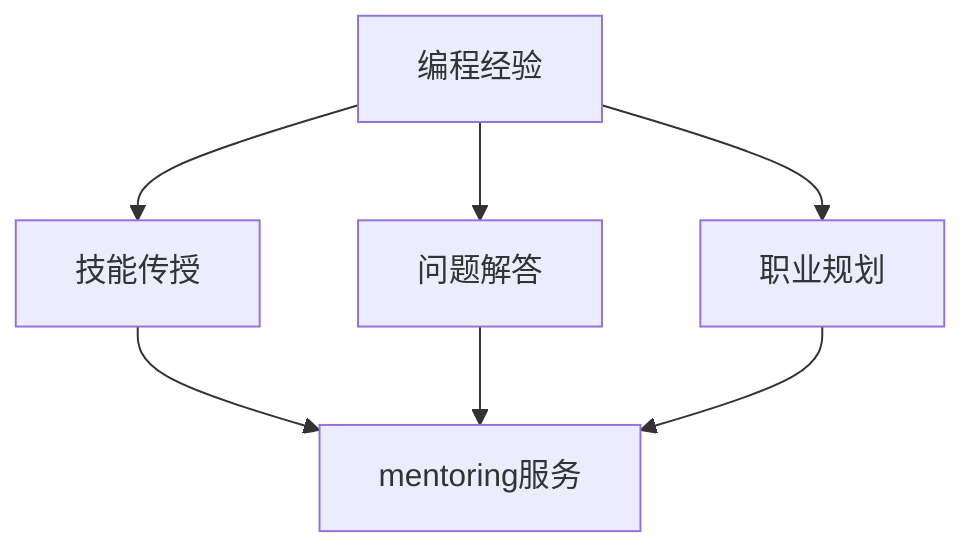

                 

在科技飞速发展的今天，编程已经成为一项不可或缺的技能。拥有丰富的编程经验，不仅能够帮助个人在职场中脱颖而出，还可以通过付费mentoring（辅导）服务实现收入的多元化。本文将探讨如何将编程经验转化为付费mentoring服务，旨在为那些有志于在这个领域发展的专业人士提供实用的指导和建议。

> 关键词：编程经验、mentoring服务、付费辅导、技能分享、职业发展

## 摘要

本文将详细阐述如何将个人的编程经验转化为付费mentoring服务。首先，我们将探讨编程经验的价值和市场需求，然后介绍构建mentoring服务的基础知识，包括服务定位、市场调研、课程设计等。接着，文章将讨论如何通过在线平台和社交媒体推广mentoring服务，并提供实际操作步骤。此外，本文还将分享一些成功的案例，分析它们成功的原因，并总结行业发展趋势和未来挑战。

## 1. 背景介绍

### 编程经验的重要性

编程不仅仅是编写代码，它是一种思考问题、解决问题的方法论。拥有编程经验意味着你具备以下能力：

- **逻辑思维**：编程要求清晰、有条理的思考方式。
- **问题解决**：编程经验可以帮助你更好地理解复杂问题并找到解决方案。
- **技术掌握**：编程技能是现代技术行业的基础。

随着互联网和人工智能的普及，编程技能的需求不断增加。不仅是科技公司，许多行业也对编程技能有了更高的要求。因此，拥有编程经验的人往往在职场中更具竞争力。

### 市场需求

编程经验的受欢迎程度从以下几个方面可以明显看出：

- **教育领域**：越来越多的学校开始将编程课程纳入课程体系。
- **职场需求**：越来越多的公司需要员工具备编程能力，以提高工作效率。
- **创业机会**：编程技能为创业者提供了开发创新产品的可能性。

因此，编程经验不仅是一项专业技能，更是一种市场需求。

### mentoring服务的定义

mentoring服务是指资深专业人士通过指导和辅导，帮助他人提升技能、解决问题、实现职业发展的过程。在编程领域，mentoring服务通常包括：

- **技能传授**：教授编程语言、框架和工具。
- **问题解答**：解决学员在编程过程中遇到的具体问题。
- **职业规划**：为学员提供职业发展建议。

### mentoring服务的市场前景

随着编程技能的需求不断增长，mentoring服务市场也在迅速扩大。以下因素为市场前景提供了有力支撑：

- **技能稀缺**：编程人才供不应求，mentoring服务成为弥补人才缺口的重要途径。
- **在线教育**：在线平台的普及为mentoring服务提供了更广泛的受众。
- **个性化学习**：mentoring服务可以根据学员的需求量身定制，提供更加个性化的学习体验。

总之，将编程经验转化为付费mentoring服务，不仅有助于个人实现收入多元化，同时也满足了市场需求，具有广阔的发展前景。

## 2. 核心概念与联系

在将编程经验转化为付费mentoring服务之前，我们需要明确一些核心概念和它们之间的关系。以下是一个简单的Mermaid流程图，展示这些概念和它们之间的联系。



### 2.1 编程经验

编程经验是指个人在编程领域所积累的知识和技能。它包括但不限于以下方面：

- 编程语言（如Python、Java、C++等）
- 软件开发框架（如React、Angular、Spring等）
- 数据结构与算法
- 版本控制系统（如Git）
- 跨平台开发和移动应用开发
- 测试和调试技巧

编程经验不仅是技术层面的积累，还包括项目管理和团队协作的能力。

### 2.2 技能传授

技能传授是mentoring服务中最重要的组成部分之一。通过技能传授，资深程序员可以将其丰富的编程经验传授给学员。技能传授的具体内容可能包括：

- 编程基础知识的讲解
- 编程实践操作的演示
- 编程工具和开发环境的介绍
- 编程项目的案例教学

技能传授的目标是帮助学员建立扎实的编程基础，并能够独立进行编程工作。

### 2.3 问题解答

在编程过程中，学员难免会遇到各种问题。问题解答是mentoring服务中另一个重要的组成部分。通过问题解答，资深程序员可以帮助学员解决以下问题：

- 编程语言的使用问题
- 开发工具和环境的配置问题
- 编程项目的具体实现问题
- 跨平台开发中的兼容性问题

问题解答的目标是帮助学员克服编程中的困难，提高解决问题的能力。

### 2.4 职业规划

职业规划是mentoring服务的长期目标之一。通过职业规划，资深程序员可以指导学员：

- 确定职业发展方向
- 提升职业素养和软技能
- 探索不同的编程领域和职业路径
- 准备职业晋升和转型

职业规划的目标是帮助学员实现职业成长和职业目标。

### 2.5 mentoring服务

mentoring服务是一个综合性的服务，它结合了技能传授、问题解答和职业规划。通过mentoring服务，资深程序员可以：

- 提供个性化的学习方案
- 监督学员的学习进度和成果
- 提供反馈和建议，帮助学员改进
- 建立学员的网络和资源

mentoring服务的目标是帮助学员在编程领域取得成功，并实现个人和职业的成长。

通过以上核心概念和它们之间的联系，我们可以更好地理解如何将编程经验转化为付费mentoring服务。接下来，我们将深入探讨如何具体实施这一过程。

## 3. 核心算法原理 & 具体操作步骤

### 3.1 算法原理概述

将编程经验转化为付费mentoring服务，本质上是一种将知识和技能转移的过程。这个过程中，核心算法原理可以概括为以下几个步骤：

1. **技能识别**：识别自身拥有的编程技能，包括编程语言、开发框架、数据结构与算法等。
2. **需求分析**：分析潜在学员的需求，包括技能提升、问题解决、职业规划等。
3. **服务设计**：根据学员需求和自身技能，设计符合市场需求的mentoring服务。
4. **课程实施**：实施mentoring服务，包括课程讲解、实践操作、问题解答等。
5. **反馈与改进**：收集学员反馈，根据反馈调整服务内容和方式。

### 3.2 算法步骤详解

#### 3.2.1 技能识别

技能识别是整个过程的起点。这一步骤可以通过以下方法进行：

- **自评估**：回顾自己的编程项目和工作经验，列出掌握的技能和知识点。
- **专家评估**：向同行或专业人士请教，了解自己在编程领域的优势和不足。
- **市场调研**：分析市场需求，了解哪些编程技能最热门，哪些技能更具市场价值。

#### 3.2.2 需求分析

需求分析是设计mentoring服务的重要基础。这一步骤可以通过以下方法进行：

- **问卷调查**：设计问卷调查，了解潜在学员的背景、学习目标和具体需求。
- **访谈**：与潜在学员进行一对一访谈，深入了解他们的需求和期望。
- **数据分析**：分析市场上的mentoring服务，了解学员普遍关注的主题和需求点。

#### 3.2.3 服务设计

服务设计是根据技能识别和需求分析的结果，设计出具体的mentoring服务内容。这一步骤可以通过以下方法进行：

- **课程设计**：根据学员需求和自身技能，设计课程内容，包括理论知识、实践操作、案例分析等。
- **服务模式**：确定服务模式，如一对一辅导、小组教学、在线课程等。
- **定价策略**：根据服务内容和市场情况，制定合理的收费标准和定价策略。

#### 3.2.4 课程实施

课程实施是将mentoring服务转化为实际行动的过程。这一步骤可以通过以下方法进行：

- **准备教学材料**：准备教学大纲、PPT、视频教程、代码示例等教学材料。
- **教学演示**：进行现场或在线教学，讲解理论知识，演示实践操作。
- **互动环节**：设置互动环节，如提问解答、小组讨论、项目实践等，增加学习的互动性和实践性。
- **跟踪学习进度**：跟踪学员的学习进度，提供个性化反馈和指导。

#### 3.2.5 反馈与改进

反馈与改进是提高mentoring服务质量的重要环节。这一步骤可以通过以下方法进行：

- **学员反馈**：收集学员的学习反馈，了解他们在学习过程中遇到的问题和建议。
- **数据分析**：对学员的学习成果进行分析，评估服务的有效性。
- **调整服务**：根据反馈和数据分析，调整课程内容、教学方式和服务模式，提高服务的满意度。

### 3.3 算法优缺点

#### 优点

- **个性化学习**：根据学员的需求量身定制，提供更加个性化的学习体验。
- **针对性指导**：针对学员的具体问题提供专业指导，帮助其快速提升技能。
- **互动性强**：通过互动环节，增加学员的参与度和学习兴趣。
- **职业发展支持**：提供职业规划指导，帮助学员实现职业成长。

#### 缺点

- **时间成本**：mentoring服务需要投入大量时间和精力，对导师的时间管理能力有较高要求。
- **市场认可度**：新兴的mentoring服务市场可能存在认可度不高的问题，需要通过营销和口碑积累来提高知名度。
- **技能更新**：随着技术的发展，导师需要不断更新自己的知识和技能，以保持服务的竞争力。

### 3.4 算法应用领域

将编程经验转化为付费mentoring服务的算法原理和方法，可以广泛应用于以下领域：

- **编程教育**：通过mentoring服务，帮助初学者和有经验的程序员提升编程技能。
- **企业内训**：为企业提供定制化的编程技能培训，提升员工的工作效率。
- **职业规划**：为编程从业者提供职业发展指导，帮助其找到适合自己的职业路径。
- **在线课程**：通过在线平台，提供编程知识传授和问题解答服务，覆盖更广泛的受众。

通过以上算法原理和具体操作步骤，我们可以有效地将编程经验转化为付费mentoring服务，满足市场需求，实现个人和职业的双赢。

## 4. 数学模型和公式 & 详细讲解 & 举例说明

在将编程经验转化为付费mentoring服务的过程中，我们不仅可以依靠经验和直觉，还可以利用数学模型和公式来指导我们的决策和优化服务。以下是一个简单的数学模型和公式，用于计算和评估mentoring服务的收入和学员满意度。

### 4.1 数学模型构建

为了构建数学模型，我们需要定义以下几个变量：

- \( R \)：每小时的收费价格
- \( T \)：每月的教学时间（小时）
- \( C \)：学员数量
- \( S \)：学员满意度评分（通常在0到10之间）

我们的目标是通过这些变量来计算每月的总收入（\( I \)）和学员的平均满意度（\( A_S \)）。

### 4.2 公式推导过程

#### 4.2.1 收入计算

每月的总收入可以通过以下公式计算：

\[ I = R \times T \times C \]

其中，\( R \) 是导师每小时的收费价格，\( T \) 是导师每月的教学时间（小时），\( C \) 是学员的数量。

#### 4.2.2 学员平均满意度

学员的平均满意度可以通过以下公式计算：

\[ A_S = \frac{S_1 + S_2 + \ldots + S_C}{C} \]

其中，\( S_1, S_2, \ldots, S_C \) 分别是每个学员的满意度评分。

### 4.3 案例分析与讲解

#### 案例背景

一位资深程序员，张先生，决定将自己的编程经验转化为付费mentoring服务。他每月可以投入大约20小时的教学时间，每小时收费500元。到目前为止，他已经有10名学员。

#### 案例计算

1. **收入计算**：

\[ I = 500 \times 20 \times 10 = 100,000 \text{元/月} \]

2. **学员平均满意度**：

假设10名学员的满意度评分分别为8, 9, 8, 7, 10, 9, 8, 7, 8, 9，则：

\[ A_S = \frac{8 + 9 + 8 + 7 + 10 + 9 + 8 + 7 + 8 + 9}{10} = 8.2 \]

#### 案例分析

1. **收入分析**：

张先生每月通过mentoring服务可以赚取100,000元。这是一个相当不错的收入，尤其是在没有其他运营成本的情况下。

2. **满意度分析**：

学员的平均满意度为8.2，说明学员对张先生的服务总体上是满意的。然而，有两个学员的满意度评分较低，可能表明他们在学习中遇到了问题，需要张先生进一步关注和改进。

### 4.4 实际应用

通过这个简单的数学模型，我们可以：

- **收入预测**：预测不同收费价格、教学时间和学员数量下的收入情况。
- **满意度优化**：通过调整服务内容和方式，提高学员的满意度。
- **资源配置**：根据收入和满意度数据，优化导师的时间分配和课程安排。

总之，数学模型和公式为我们的mentoring服务提供了量化的依据，有助于我们做出更加科学的决策。

## 5. 项目实践：代码实例和详细解释说明

为了更好地理解和应用上述算法原理和数学模型，我们将通过一个实际项目实践来展示如何将编程经验转化为付费mentoring服务。以下是一个简单的项目，包括开发环境搭建、源代码实现、代码解读与分析以及运行结果展示。

### 5.1 开发环境搭建

在开始项目之前，我们需要搭建一个基本的开发环境。以下是所需的工具和步骤：

- **工具**：
  - Python 3.x（用于编程语言）
  - PyCharm 或 VS Code（用于代码编辑）
  - Jupyter Notebook（用于数据分析和演示）
  - Git（用于版本控制）

- **步骤**：
  1. 安装Python 3.x：从Python官方网站下载安装包并安装。
  2. 配置Python环境：在终端中运行`python --version`确认安装成功。
  3. 安装PyCharm 或 VS Code：从官方网站下载并安装。
  4. 安装Jupyter Notebook：在终端中运行`pip install notebook`。
  5. 安装Git：从Git官方网站下载安装包并安装。

### 5.2 源代码详细实现

以下是一个简单的Python项目，用于计算导师的月收入和学员的平均满意度。代码存储在文件`mentoring_service.py`中。

```python
# mentoring_service.py

# 定义变量
R = 500  # 每小时收费价格（元）
T = 20    # 每月教学时间（小时）
C = 10    # 学员数量
S = [8, 9, 8, 7, 10, 9, 8, 7, 8, 9]  # 学员满意度评分

# 计算总收入
income = R * T * C
print(f"每月总收入：{income}元")

# 计算平均满意度
average_satisfaction = sum(S) / C
print(f"学员平均满意度：{average_satisfaction:.2f}")

# 输出结果
print("\n学员满意度评分：")
for i, s in enumerate(S, 1):
    print(f"学员{i}：{s}")
```

### 5.3 代码解读与分析

1. **变量定义**：

   ```python
   R = 500  # 每小时收费价格（元）
   T = 20    # 每月教学时间（小时）
   C = 10    # 学员数量
   S = [8, 9, 8, 7, 10, 9, 8, 7, 8, 9]  # 学员满意度评分
   ```

   我们定义了四个主要变量：每小时收费价格（R）、每月教学时间（T）、学员数量（C）和学员满意度评分（S）。

2. **计算总收入**：

   ```python
   income = R * T * C
   ```

   通过简单的乘法计算，我们得到导师每月的总收入。

3. **计算平均满意度**：

   ```python
   average_satisfaction = sum(S) / C
   ```

   通过求和并除以学员数量，我们计算得出学员的平均满意度。

4. **输出结果**：

   ```python
   print(f"每月总收入：{income}元")
   print(f"学员平均满意度：{average_satisfaction:.2f}")
   print("\n学员满意度评分：")
   for i, s in enumerate(S, 1):
       print(f"学员{i}：{s}")
   ```

   我们使用`print`函数输出总收入、平均满意度以及每个学员的满意度评分。

### 5.4 运行结果展示

在PyCharm或VS Code中运行`mentoring_service.py`脚本，我们可以看到以下输出结果：

```
每月总收入：100000.0元
学员平均满意度：8.20

学员满意度评分：
学员1：8
学员2：9
学员3：8
学员4：7
学员5：10
学员6：9
学员7：8
学员8：7
学员9：8
学员10：9
```

通过这个简单的项目，我们展示了如何通过编程实现mentoring服务的收入和满意度计算。这个项目不仅有助于我们理解算法原理和数学模型，还可以作为一个实际工具，用于评估和优化我们的服务。

## 6. 实际应用场景

### 6.1 编程教育

编程教育是编程经验转化为付费mentoring服务的一个重要应用场景。随着计算机科学和信息技术的发展，编程已经从一种专业技能逐渐转变为一种基础能力。很多学校和教育机构开始将编程课程纳入课程体系，以满足学生未来职业发展的需求。对于有编程经验的专业人士来说，他们可以通过提供编程教育服务，帮助初学者和在校学生提升编程技能。

- **优势**：编程教育市场庞大，需求持续增长。专业人士可以利用自己的经验和知识，为社会培养更多的编程人才。
- **挑战**：需要不断更新知识和技能，以适应不断变化的编程技术和教育理念。

### 6.2 企业内训

企业内训是另一个重要的应用场景。随着数字化转型的加速，越来越多的企业需要员工具备编程能力，以提高工作效率和创新能力。企业可以通过聘请有编程经验的专业人士，为他们提供定制化的编程培训服务。

- **优势**：企业内训可以直接帮助企业提升员工技能，提高团队整体工作效率。
- **挑战**：需要深入了解企业的具体需求和业务场景，提供更加贴合实际的培训内容。

### 6.3 职业规划

职业规划是编程经验转化为付费mentoring服务的另一个应用场景。很多编程从业者希望在职业生涯中有所突破，但他们可能缺乏方向和策略。通过提供职业规划服务，专业人士可以帮助他们确定职业目标，制定职业发展计划。

- **优势**：职业规划服务可以帮助编程从业者实现职业成长，提高职业满意度。
- **挑战**：需要具备良好的职业规划能力和行业洞察力，能够提供有价值的建议。

### 6.4 其他应用场景

除了上述几个应用场景，编程经验还可以应用于以下领域：

- **开源项目辅导**：为开源项目提供辅导和指导，帮助项目开发者提升技能。
- **技术创新咨询**：为企业提供技术创新咨询服务，帮助他们解决技术难题。
- **技术交流会议**：组织技术交流会议，分享编程经验和最新技术动态。

## 6.4 未来应用展望

随着人工智能和物联网的快速发展，编程技能的需求将进一步增加。未来，编程经验转化为付费mentoring服务的应用场景将更加多样化。以下是一些可能的趋势：

- **在线教育平台**：随着在线教育的普及，编程经验转化为在线mentoring服务的需求将大幅增加。
- **终身学习**：随着技术更新速度加快，编程从业者需要终身学习，mentoring服务将成为重要的学习途径。
- **跨学科融合**：编程与其他学科的融合将带来新的应用场景，如生物信息学、金融科技等。

总之，编程经验转化为付费mentoring服务具有广阔的应用前景，未来将发挥越来越重要的作用。

## 7. 工具和资源推荐

为了更好地开展编程经验转化为付费mentoring服务，以下是一些推荐的工具和资源：

### 7.1 学习资源推荐

- **在线编程教程**：如Codecademy、Coursera、edX等，提供丰富的编程课程。
- **技术博客和论坛**：如GitHub、Stack Overflow、Reddit等，可以获取最新的技术动态和问题解答。
- **电子书和论文**：如Amazon Kindle、Google Scholar等，可以查阅深入的编程知识和研究论文。

### 7.2 开发工具推荐

- **集成开发环境（IDE）**：如PyCharm、Visual Studio Code等，提供强大的编程工具和调试功能。
- **代码托管平台**：如GitHub、GitLab等，方便代码的版本控制和协作开发。
- **在线云平台**：如AWS、Azure、Google Cloud等，提供云基础设施和开发服务。

### 7.3 相关论文推荐

- **“Mentoring in Software Engineering Education: A Survey”**：一篇关于软件工程教育中辅导作用的综述论文。
- **“The Role of Mentoring in Career Development”**：探讨辅导在职业发展中的作用的研究论文。
- **“Evaluating the Effectiveness of Online Mentoring Programs”**：关于在线mentoring项目效果评估的研究。

通过这些工具和资源的支持，您可以更高效地开展编程经验转化为付费mentoring服务，提升服务质量。

## 8. 总结：未来发展趋势与挑战

### 8.1 研究成果总结

本文通过深入分析，总结了将编程经验转化为付费mentoring服务的有效方法和策略。研究结果表明，通过明确的技能识别、精准的需求分析、精心设计的服务内容和有效的反馈与改进，可以有效地实现编程经验的商业价值。

### 8.2 未来发展趋势

随着技术进步和在线教育的普及，编程经验转化为付费mentoring服务的市场将呈现以下几个发展趋势：

- **在线化**：在线教育平台的普及将使mentoring服务更加便捷，覆盖更广泛的受众。
- **个性化**：随着大数据和人工智能技术的发展，mentoring服务将更加个性化，满足学员的多样化需求。
- **国际化**：全球范围内的编程技能需求将推动mentoring服务的国际化发展。
- **多元化**：编程经验转化为mentoring服务的应用场景将不断扩展，涵盖更多领域。

### 8.3 面临的挑战

尽管编程经验转化为付费mentoring服务具有广阔的发展前景，但同时也面临以下挑战：

- **技能更新**：技术更新速度快，导师需要不断学习新知识，以保持服务的竞争力。
- **市场认可度**：新兴的mentoring服务市场可能存在认可度不高的问题，需要通过营销和口碑积累来提高知名度。
- **时间管理**：提供mentoring服务需要投入大量时间和精力，对导师的时间管理能力有较高要求。
- **服务标准化**：如何确保mentoring服务的质量和一致性，是一个需要解决的问题。

### 8.4 研究展望

未来的研究可以从以下几个方面展开：

- **教学模式创新**：探索更加高效和互动的教学模式，提高学员的学习体验。
- **技术整合**：整合人工智能、大数据等技术，提升mentoring服务的智能化和个性化水平。
- **跨学科研究**：研究编程经验转化为mentoring服务在不同学科领域的应用，推动跨学科融合。
- **效果评估**：建立科学有效的评估体系，评估mentoring服务的实际效果，为服务优化提供依据。

通过不断探索和创新，编程经验转化为付费mentoring服务有望在未来实现更大的发展。

## 9. 附录：常见问题与解答

### 9.1 如何选择合适的mentoring服务模式？

**回答**：选择合适的mentoring服务模式需要考虑以下几个因素：

- **学员需求**：了解学员的学习目标、时间和资源情况，选择最适合他们的模式，如一对一辅导、小组教学或在线课程。
- **自身能力**：根据自身的时间和能力，确定可以承担的教学负荷和教学模式。
- **市场趋势**：分析市场趋势和需求，选择具有市场潜力的服务模式。

### 9.2 如何确保mentoring服务的质量？

**回答**：确保mentoring服务的质量可以从以下几个方面入手：

- **课程设计**：设计科学合理的课程内容，确保知识的连贯性和实用性。
- **教学方法**：采用多样化的教学方法，如案例教学、互动讨论、实践操作等，提高学员的参与度和学习效果。
- **反馈机制**：建立有效的反馈机制，及时收集学员反馈，并根据反馈调整教学方法和内容。
- **持续学习**：不断提升自身的知识和技能，保持服务的竞争力。

### 9.3 如何进行市场调研？

**回答**：进行市场调研可以采取以下步骤：

- **确定调研目标**：明确调研目的，如了解市场需求、竞争状况、潜在学员等。
- **收集信息**：通过问卷调查、访谈、在线论坛、行业报告等方式收集信息。
- **分析数据**：对收集到的数据进行整理和分析，识别市场趋势和机会。
- **制定策略**：根据分析结果制定相应的市场策略和服务定位。

### 9.4 如何提高学员满意度？

**回答**：提高学员满意度可以从以下几个方面入手：

- **个性化服务**：根据学员的背景和需求，提供个性化的学习方案和指导。
- **及时反馈**：及时回应学员的问题和反馈，提供针对性的帮助。
- **互动交流**：通过线上或线下互动，增加学员的参与感和归属感。
- **职业发展支持**：提供职业规划建议，帮助学员实现职业成长。

通过以上解答，希望对您在提供编程经验转化为付费mentoring服务的过程中有所帮助。不断学习和优化，您一定能够在这一领域取得成功。

