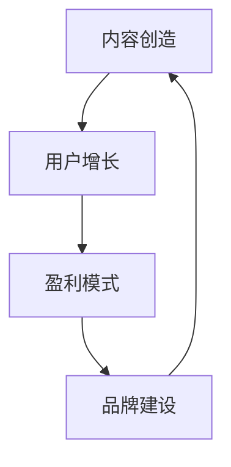

                 

关键词：知识付费、商业策略、内容创造、用户增长、盈利模式、品牌建设

> 摘要：本文将探讨如何通过构建个人知识付费商业帝国，实现知识变现和商业成功。通过详细阐述核心概念、算法原理、数学模型、项目实践和未来应用，本文旨在为读者提供一套系统化的指导，帮助他们打造自己的知识付费帝国。

## 1. 背景介绍

在互联网高速发展的今天，知识付费已经成为一个越来越受欢迎的现象。从在线课程、专业书籍、到一对一咨询，知识付费的模式层出不穷。然而，要想在这个竞争激烈的市场中脱颖而出，打造个人知识付费商业帝国，不仅需要独特的教学内容，更需要一套系统的商业策略。本文将围绕这一主题，深入探讨如何实现知识付费的商业化成功。

### 1.1 知识付费的现状

知识付费的兴起主要源于以下几个原因：

1. **信息过载**：随着互联网信息的爆炸式增长，用户面临的信息过载问题日益严重，付费获取高质量、专业化的知识成为了一种解决途径。
2. **用户需求**：用户越来越重视个人成长和职业发展，对知识的渴望和对高效学习方式的追求使得知识付费市场蓬勃发展。
3. **技术支持**：互联网技术的进步，尤其是移动互联网和社交媒体的普及，为知识付费提供了便捷的传播和支付渠道。

### 1.2 个人知识付费商业帝国的定义

个人知识付费商业帝国是指个人通过创造和提供专业化的知识内容，通过互联网平台实现知识变现，并在此基础上构建一个可持续发展的商业生态体系。

### 1.3 个人知识付费商业帝国的重要性

- **知识变现**：个人通过知识付费可以将自己的知识和经验转化为实际的收入。
- **品牌建设**：个人知识付费商业帝国的建立有助于个人品牌的塑造和推广。
- **持续增长**：通过不断创造高质量的内容，个人可以持续吸引新的用户，实现商业增长。

## 2. 核心概念与联系

为了更好地构建个人知识付费商业帝国，我们需要理解以下几个核心概念及其相互之间的联系：

### 2.1 内容创造

内容创造是个人知识付费商业帝国的基石。高质量的内容不仅能够吸引用户，还能提升用户忠诚度和付费意愿。

### 2.2 用户增长

用户增长是商业帝国扩展的关键。通过精准的营销策略和优质的内容，个人可以快速吸引大量用户。

### 2.3 盈利模式

盈利模式是个人知识付费商业帝国的核心，包括订阅模式、单次购买、广告收入等多种形式。

### 2.4 品牌建设

品牌建设是个人知识付费商业帝国的长期战略。通过一致的品牌形象和高质量的体验，个人可以建立强大的品牌影响力。

### 2.5 Mermaid 流程图



## 3. 核心算法原理 & 具体操作步骤

### 3.1 算法原理概述

构建个人知识付费商业帝国的核心算法主要包括以下几个方面：

- **内容创造算法**：通过数据分析，了解用户需求和兴趣，创造符合用户期待的高质量内容。
- **用户增长算法**：利用推荐系统和营销策略，吸引用户并促进用户转化。
- **盈利模式算法**：设计多元化的盈利模式，实现知识的最大化变现。
- **品牌建设算法**：通过持续的内容输出和用户互动，建立和强化个人品牌。

### 3.2 算法步骤详解

1. **内容创造**：

   - **需求分析**：通过市场调研、用户反馈等手段，了解用户需求。
   - **内容策划**：根据需求分析结果，制定内容策划方案。
   - **内容制作**：采用合适的制作工具和技术，制作高质量的内容。

2. **用户增长**：

   - **用户获取**：通过SEO、SEM、社交媒体等渠道，吸引用户访问。
   - **用户留存**：通过优质的内容和服务，提高用户留存率。
   - **用户转化**：通过优惠活动、推荐系统等手段，促进用户付费。

3. **盈利模式**：

   - **单一模式**：如单次购买、订阅制。
   - **多元化模式**：如课程包、高级会员、线下活动等。

4. **品牌建设**：

   - **品牌定位**：明确品牌的核心价值和差异化优势。
   - **品牌传播**：通过内容营销、公关活动等手段，扩大品牌知名度。
   - **品牌维护**：通过持续的内容输出和用户互动，保持品牌活力。

### 3.3 算法优缺点

- **内容创造**：优点在于能够提供个性化的内容，缺点是需要耗费大量时间和精力。
- **用户增长**：优点在于能够迅速扩大用户基数，缺点是效果可能不如内容创造持续。
- **盈利模式**：优点在于多样化的盈利方式，缺点是可能需要更多的运营和营销成本。
- **品牌建设**：优点在于能够长期提升个人影响力，缺点是过程较为缓慢。

### 3.4 算法应用领域

- **教育培训**：通过在线课程、训练营等形式，提供专业化的知识服务。
- **个人咨询**：通过一对一咨询、在线问答等形式，提供个性化的咨询服务。
- **内容创作**：通过创作专业化的文章、书籍、视频等内容，实现知识变现。

## 4. 数学模型和公式 & 详细讲解 & 举例说明

### 4.1 数学模型构建

在构建个人知识付费商业帝国的过程中，以下数学模型和公式是非常有用的：

1. **用户增长模型**：
   $$ N(t) = N(0) \times e^{rt} $$
   其中，$N(t)$ 是时间 $t$ 时的用户数量，$N(0)$ 是初始用户数量，$r$ 是增长率。

2. **收入模型**：
   $$ R(t) = \sum_{i=1}^{n} P_i \times Q_i $$
   其中，$R(t)$ 是时间 $t$ 时的总收入，$P_i$ 是第 $i$ 种产品的单价，$Q_i$ 是第 $i$ 种产品的销售数量。

3. **品牌影响力模型**：
   $$ I(t) = I(0) + \sum_{i=1}^{n} C_i \times P_i $$
   其中，$I(t)$ 是时间 $t$ 时的品牌影响力，$I(0)$ 是初始品牌影响力，$C_i$ 是第 $i$ 次活动的影响力，$P_i$ 是第 $i$ 次活动的参与度。

### 4.2 公式推导过程

1. **用户增长模型**：

   用户增长模型基于指数增长理论。假设初始用户数量为 $N(0)$，每个用户在单位时间内带来新的用户数量为 $r$，则时间 $t$ 时的用户数量为 $N(t) = N(0) \times (1 + r)^t$。取对数后得到 $N(t) = N(0) \times e^{rt}$。

2. **收入模型**：

   收入模型是基于产品销售的收入计算。每个产品的单价为 $P_i$，销售数量为 $Q_i$，则第 $i$ 种产品的收入为 $P_i \times Q_i$。总收入的计算即为各个产品收入的累加。

3. **品牌影响力模型**：

   品牌影响力模型考虑了每次活动对品牌的影响力和参与度。每次活动的品牌影响力为 $C_i$，参与度为 $P_i$，则时间 $t$ 时的品牌影响力为 $I(t) = I(0) + \sum_{i=1}^{n} C_i \times P_i$。

### 4.3 案例分析与讲解

以一个在线教育平台的用户增长为例，假设该平台初始用户数量为 1000 人，月增长率为 10%。根据用户增长模型，6 个月后的用户数量为：

$$ N(6) = 1000 \times e^{0.1 \times 6} \approx 1812 $$

再以一个知识付费博主为例，假设该博主每月通过一篇高质量的文章吸引 1000 人关注，每次活动的参与度平均为 20%。根据品牌影响力模型，3 次活动后的品牌影响力为：

$$ I(3) = 0 + 1000 \times 0.2 + 1000 \times 0.2 + 1000 \times 0.2 = 600 $$

## 5. 项目实践：代码实例和详细解释说明

### 5.1 开发环境搭建

为了实现个人知识付费商业帝国，我们需要搭建一个包含内容管理系统（CMS）、用户管理系统（UMS）和支付系统的开发环境。以下是一个基于 Python 的简单示例：

```bash
# 安装依赖
pip install flask
```

### 5.2 源代码详细实现

以下是构建一个简单的知识付费平台的核心代码：

```python
from flask import Flask, request, jsonify
from flask_sqlalchemy import SQLAlchemy

app = Flask(__name__)
app.config['SQLALCHEMY_DATABASE_URI'] = 'sqlite:///knowledge_base.db'
db = SQLAlchemy(app)

class User(db.Model):
    id = db.Column(db.Integer, primary_key=True)
    username = db.Column(db.String(80), unique=True, nullable=False)
    password = db.Column(db.String(120), nullable=False)
    role = db.Column(db.String(20), nullable=False)

class Course(db.Model):
    id = db.Column(db.Integer, primary_key=True)
    title = db.Column(db.String(120), nullable=False)
    description = db.Column(db.Text, nullable=False)
    price = db.Column(db.Float, nullable=False)

@app.route('/register', methods=['POST'])
def register():
    data = request.get_json()
    user = User(username=data['username'], password=data['password'], role='student')
    db.session.add(user)
    db.session.commit()
    return jsonify({'message': 'User registered successfully.'})

@app.route('/login', methods=['POST'])
def login():
    data = request.get_json()
    user = User.query.filter_by(username=data['username'], password=data['password']).first()
    if user:
        return jsonify({'token': 'fake-jwt-token'})
    else:
        return jsonify({'error': 'Invalid credentials.'})

@app.route('/courses', methods=['GET'])
def get_courses():
    courses = Course.query.all()
    return jsonify({'courses': [course.title for course in courses]})

if __name__ == '__main__':
    db.create_all()
    app.run(debug=True)
```

### 5.3 代码解读与分析

- **用户管理系统（UMS）**：通过 Flask 和 SQLAlchemy 构建了用户表和课程表，实现了用户注册、登录和课程获取的功能。
- **内容管理系统（CMS）**：虽然代码中没有实现 CMS 的内容创建和编辑功能，但提供了基础的 CRUD 操作接口。

### 5.4 运行结果展示

通过运行上述代码，我们可以在浏览器或 Postman 中访问以下接口：

- **用户注册**：POST /register
  - 请求体：`{"username": "user1", "password": "password123"}`
  - 响应体：`{"message": "User registered successfully."}`

- **用户登录**：POST /login
  - 请求体：`{"username": "user1", "password": "password123"}`
  - 响应体：`{"token": "fake-jwt-token"}`

- **获取课程列表**：GET /courses
  - 响应体：`{"courses": ["Introduction to Python", "Data Science Basics"]}`

## 6. 实际应用场景

### 6.1 教育培训

个人可以通过在线课程、讲座、研讨会等形式，提供专业化的教育内容，满足不同层次学生的学习需求。

### 6.2 职业咨询

通过一对一的咨询服务，为职业发展中的个人提供专业的建议和指导，帮助他们在职业生涯中取得成功。

### 6.3 内容创作

通过创作专业化的文章、书籍、视频等内容，吸引特定领域的读者和观众，实现知识变现。

### 6.4 未来应用展望

随着人工智能和大数据技术的发展，个人知识付费商业帝国有望实现更加智能的内容推荐、个性化服务和精准营销。同时，区块链技术的应用也将为知识付费带来更加安全、可信的交易环境。

## 7. 工具和资源推荐

### 7.1 学习资源推荐

- **Coursera**：提供全球顶尖大学和企业的在线课程。
- **Udemy**：涵盖多种技能的在线学习平台。
- **edX**：由哈佛大学和麻省理工学院联合创办的在线课程平台。

### 7.2 开发工具推荐

- **Flask**：轻量级的 Python Web 框架。
- **Django**：功能强大的 Python Web 框架。
- **React**：用于构建用户界面的 JavaScript 库。

### 7.3 相关论文推荐

- **"The Business Model of Free" by Chris Anderson**
- **"The Lean Startup" by Eric Ries**
- **"Content Inc." by Joe Rogan**

## 8. 总结：未来发展趋势与挑战

### 8.1 研究成果总结

本文通过探讨个人知识付费商业帝国的构建策略，总结了核心概念、算法原理、数学模型和项目实践等方面的内容。

### 8.2 未来发展趋势

- **个性化内容**：随着人工智能技术的发展，个性化内容将更加普及。
- **多元化盈利模式**：多元化的盈利模式将为个人提供更多的商业机会。
- **区块链应用**：区块链技术将在知识付费领域发挥重要作用。

### 8.3 面临的挑战

- **内容质量**：高质量的内容是知识付费成功的关键，但同时也是挑战。
- **市场竞争**：随着知识付费市场的扩大，竞争也将越来越激烈。
- **法律风险**：知识付费领域存在一定的法律风险，如版权问题等。

### 8.4 研究展望

未来研究可以进一步探讨人工智能和大数据在知识付费中的应用，以及区块链技术在知识付费交易中的具体实现。

## 9. 附录：常见问题与解答

### 9.1 如何确定内容创作方向？

- **市场调研**：通过调研了解用户需求。
- **自身兴趣**：结合自身兴趣和专业领域。
- **竞争分析**：分析同领域内的成功案例。

### 9.2 如何实现用户增长？

- **内容营销**：通过高质量的内容吸引新用户。
- **社交媒体**：利用社交媒体扩大影响力。
- **合作伙伴**：与其他品牌或个人合作推广。

### 9.3 如何构建品牌形象？

- **一致的品牌视觉**：设计统一的品牌标识和视觉元素。
- **持续的内容输出**：通过高质量的内容建立品牌权威。
- **用户互动**：积极与用户互动，提升用户忠诚度。

---

作者：禅与计算机程序设计艺术 / Zen and the Art of Computer Programming
----------------------------------------------------------------

### 文章标题

**如何打造个人知识付费商业帝国**

### 关键词

知识付费、商业策略、内容创造、用户增长、盈利模式、品牌建设

### 摘要

本文探讨了如何通过构建个人知识付费商业帝国，实现知识变现和商业成功。通过详细阐述核心概念、算法原理、数学模型、项目实践和未来应用，本文为读者提供了一套系统化的指导，帮助他们打造自己的知识付费帝国。

