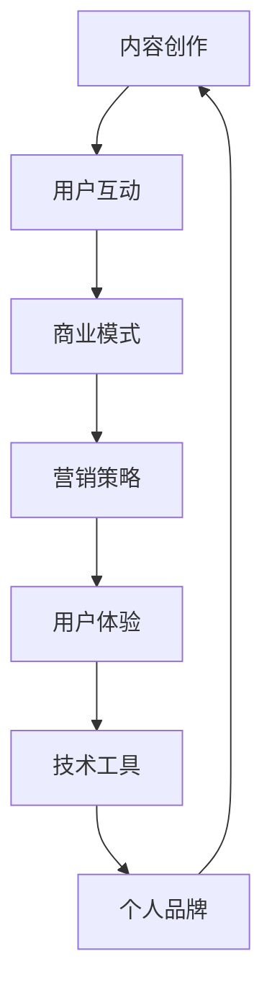

                 

关键词：知识付费、个人品牌、内容创作、用户互动、商业模式、营销策略、用户体验、技术工具

> 摘要：本文旨在探讨如何打造个人知识付费生态，从内容创作、用户互动、商业模式、营销策略、用户体验和技术工具等多个维度，提供一整套系统化的方法和思路。通过对核心概念、算法原理、数学模型、项目实践、应用场景等方面的深入分析，帮助读者理解构建个人知识付费生态的内在逻辑和实现路径。

## 1. 背景介绍

在当今数字化时代，知识付费已经成为一种主流的消费模式。随着移动互联网的普及和在线教育平台的兴起，越来越多的人开始通过知识付费平台获取专业知识和技能。同时，也涌现出了一批通过知识付费获得成功的个人创作者和专家。

个人知识付费生态的构建，不仅可以帮助创作者实现知识变现，还能为用户提供有价值的内容和服务。然而，如何在这个竞争激烈的市场中脱颖而出，构建一个稳定、可持续的个人知识付费生态，成为了一个亟待解决的问题。

本文将从以下方面展开讨论：

- 内容创作与用户需求匹配
- 用户互动与社群管理
- 商业模式与收益优化
- 营销策略与品牌推广
- 用户体验与满意度提升
- 技术工具与平台搭建

希望通过本文的探讨，能够为个人创作者提供一些有价值的参考和启示。

## 2. 核心概念与联系

### 2.1 知识付费

知识付费是指用户为获取专业知识和技能而支付的费用，这种模式在在线教育、专业咨询、技能培训等领域广泛应用。知识付费的核心在于为用户提供有价值的内容和服务，实现知识的共享与传播。

### 2.2 个人品牌

个人品牌是指个人在特定领域内的声誉、影响力以及专业能力的集合。构建个人品牌可以帮助创作者在市场上树立独特的形象，提高用户信任度和忠诚度。

### 2.3 内容创作

内容创作是个人知识付费生态的核心，包括课程设计、文章撰写、视频制作等形式。高质量的内容创作是吸引和留住用户的关键。

### 2.4 用户互动

用户互动是指创作者与用户之间的互动和沟通，包括问答、社群交流、评论互动等。良好的用户互动可以提高用户满意度和忠诚度。

### 2.5 商业模式

商业模式是指个人知识付费生态的盈利模式，包括课程收费、会员订阅、广告分成等多种形式。合理的商业模式是实现持续盈利的基础。

### 2.6 营销策略

营销策略是指通过多种渠道和手段推广个人品牌和内容，提高知名度和用户量的方法。有效的营销策略是实现用户增长的重要保障。

### 2.7 用户体验

用户体验是指用户在使用个人知识付费产品或服务过程中的感受和体验。优质的用户体验可以提升用户满意度和口碑。

### 2.8 技术工具

技术工具是指用于个人知识付费生态构建和运营的各种技术手段和工具，包括内容管理系统、在线教育平台、用户管理系统等。合理选择和使用技术工具可以提高运营效率和用户体验。

### 2.9 Mermaid 流程图

以下是构建个人知识付费生态的Mermaid流程图：



通过这个流程图，我们可以清晰地看到各个核心概念之间的联系和作用。内容创作是起点，也是整个生态的基础；用户互动、商业模式、营销策略、用户体验和技术工具是各个环节，共同支撑和推动个人知识付费生态的发展。

### 3. 核心算法原理 & 具体操作步骤

#### 3.1 算法原理概述

在构建个人知识付费生态时，我们需要关注以下几个核心算法原理：

1. **内容推荐算法**：通过分析用户行为和兴趣，为用户推荐合适的内容。
2. **用户画像构建**：通过用户数据收集和分析，为用户生成个性化的用户画像。
3. **社群管理算法**：通过分析社群互动数据，优化社群运营策略。
4. **收益分配算法**：根据用户行为和内容质量，合理分配收益。

#### 3.2 算法步骤详解

1. **内容推荐算法**
   - 数据采集：收集用户的行为数据，如浏览记录、点赞、评论等。
   - 特征提取：对用户行为数据进行分析，提取用户兴趣特征。
   - 模型训练：使用机器学习算法，训练推荐模型。
   - 推荐生成：根据用户兴趣特征，生成个性化推荐内容。

2. **用户画像构建**
   - 数据采集：收集用户的基本信息、行为数据等。
   - 特征提取：对用户数据进行分析，提取用户特征。
   - 用户标签：根据用户特征，为用户打上标签。
   - 用户画像生成：将用户标签整合，形成用户画像。

3. **社群管理算法**
   - 数据采集：收集社群互动数据，如发帖、评论、点赞等。
   - 互动分析：分析社群互动数据，识别活跃用户和热门话题。
   - 运营策略：根据分析结果，调整社群运营策略。
   - 质量控制：监控社群质量，处理不良内容和行为。

4. **收益分配算法**
   - 数据采集：收集用户行为数据，如购买、观看时长等。
   - 内容评估：根据用户行为数据，评估内容质量。
   - 收益计算：根据内容质量和用户行为，计算创作者收益。
   - 收益分配：将收益按比例分配给创作者。

#### 3.3 算法优缺点

1. **内容推荐算法**
   - 优点：提高用户满意度，增加用户粘性。
   - 缺点：可能存在推荐偏差，用户隐私保护问题。

2. **用户画像构建**
   - 优点：为个性化推荐和精准营销提供支持。
   - 缺点：用户数据收集和使用存在隐私风险。

3. **社群管理算法**
   - 优点：提高社群活跃度，增强用户互动。
   - 缺点：需要大量数据支持和运营资源。

4. **收益分配算法**
   - 优点：公平、透明，激发创作者积极性。
   - 缺点：可能存在收益分配不均的问题。

#### 3.4 算法应用领域

1. **在线教育平台**：利用内容推荐算法和用户画像构建，为用户提供个性化学习推荐。
2. **知识付费平台**：通过社群管理算法，提高用户互动和社区活跃度。
3. **创作者收益分配**：利用收益分配算法，激励创作者持续创作高质量内容。

### 4. 数学模型和公式 & 详细讲解 & 举例说明

#### 4.1 数学模型构建

在构建个人知识付费生态时，我们可以使用以下数学模型：

1. **内容推荐模型**：基于用户行为数据，使用协同过滤算法进行推荐。
2. **用户画像模型**：基于用户特征数据，使用聚类算法构建用户画像。
3. **社群管理模型**：基于社群互动数据，使用马尔可夫模型分析用户行为。
4. **收益分配模型**：基于用户行为数据和内容质量，使用多目标优化算法进行收益分配。

#### 4.2 公式推导过程

1. **内容推荐模型**
   - 协同过滤算法公式：
     $$R_{ui} = \frac{\sum_{j \in N_i} r_{uj} r_{ij}}{\sum_{j \in N_i} r_{ij}}$$
     其中，\(R_{ui}\) 表示用户 \(u\) 对内容 \(i\) 的推荐评分，\(N_i\) 表示与内容 \(i\) 相关的用户集合，\(r_{uj}\) 表示用户 \(u\) 对内容 \(j\) 的评分。

2. **用户画像模型**
   - 聚类算法公式：
     $$d_{ij} = \sqrt{\sum_{k=1}^n (x_{ik} - \mu_j)^2}$$
     其中，\(d_{ij}\) 表示用户 \(i\) 和用户 \(j\) 之间的距离，\(x_{ik}\) 表示用户 \(i\) 在第 \(k\) 个特征上的取值，\(\mu_j\) 表示用户 \(j\) 在第 \(k\) 个特征上的均值。

3. **社群管理模型**
   - 马尔可夫模型公式：
     $$P(X_t = j|X_{t-1} = i) = \frac{N_{ij}}{N_i}$$
     其中，\(P(X_t = j|X_{t-1} = i)\) 表示在时间 \(t-1\) 时处于状态 \(i\) 的用户在时间 \(t\) 时转移到状态 \(j\) 的概率，\(N_{ij}\) 表示在时间 \(t-1\) 时处于状态 \(i\) 的用户在时间 \(t\) 时转移到状态 \(j\) 的次数，\(N_i\) 表示在时间 \(t-1\) 时处于状态 \(i\) 的用户总数。

4. **收益分配模型**
   - 多目标优化算法公式：
     $$\min F(x)$$
     $$s.t. G(x) \leq 0$$
     其中，\(F(x)\) 表示目标函数，\(G(x)\) 表示约束条件，\(x\) 表示变量。

#### 4.3 案例分析与讲解

1. **内容推荐模型案例**

假设有100个用户和1000个内容，我们使用协同过滤算法进行推荐。首先，我们收集用户的行为数据，如浏览记录、点赞、评论等，然后提取用户兴趣特征。接下来，使用协同过滤算法计算用户对内容的推荐评分，最后生成个性化推荐列表。

具体步骤如下：

- 收集用户行为数据，得到用户-内容评分矩阵 \(R\)。
- 提取用户兴趣特征，得到用户-特征矩阵 \(U\) 和内容-特征矩阵 \(V\)。
- 训练协同过滤模型，计算用户-内容推荐评分 \(R_{ui}\)。
- 生成个性化推荐列表，为用户推荐相似内容。

2. **用户画像模型案例**

假设有100个用户，每个用户有5个特征，我们使用聚类算法构建用户画像。首先，我们收集用户的基本信息和特征数据，然后使用聚类算法将用户分为若干个群体。接下来，根据用户群体的特征，为用户打上标签。

具体步骤如下：

- 收集用户数据，得到用户-特征矩阵 \(X\)。
- 训练聚类算法，如K-means算法，将用户分为 \(k\) 个群体。
- 根据用户群体的特征，为用户打上标签，构建用户画像。

3. **社群管理模型案例**

假设有100个用户组成的社群，我们使用马尔可夫模型分析用户行为。首先，我们收集社群互动数据，如发帖、评论、点赞等，然后使用马尔可夫模型计算用户转移概率。接下来，根据用户转移概率，调整社群运营策略。

具体步骤如下：

- 收集社群互动数据，得到用户-状态转移矩阵 \(P\)。
- 训练马尔可夫模型，计算用户转移概率。
- 根据用户转移概率，调整社群运营策略。

4. **收益分配模型案例**

假设有10个创作者和100个用户，我们使用多目标优化算法进行收益分配。首先，我们收集用户行为数据，如购买、观看时长等，然后使用多目标优化算法计算创作者收益。接下来，根据收益计算结果，分配创作者收益。

具体步骤如下：

- 收集用户行为数据，得到用户-创作者互动矩阵 \(I\)。
- 定义目标函数和约束条件，建立多目标优化模型。
- 使用多目标优化算法，计算创作者收益。
- 根据收益计算结果，分配创作者收益。

### 5. 项目实践：代码实例和详细解释说明

#### 5.1 开发环境搭建

为了构建个人知识付费生态，我们需要搭建一个开发环境。以下是一个简单的开发环境搭建步骤：

1. 安装Python环境：Python是一种流行的编程语言，用于构建个人知识付费生态的各种算法和模型。
2. 安装依赖库：安装用于数据分析和机器学习的依赖库，如NumPy、Pandas、Scikit-learn等。
3. 安装在线教育平台：安装一个在线教育平台，如Moodle、Edmodo等，用于课程发布和用户管理。
4. 安装内容管理系统：安装一个内容管理系统，如WordPress、Joomla等，用于内容创作和管理。

#### 5.2 源代码详细实现

以下是一个简单的Python代码实例，用于实现内容推荐算法：

```python
import numpy as np
from sklearn.metrics.pairwise import cosine_similarity

# 用户-内容评分矩阵
R = np.array([[5, 3, 0, 1], [3, 0, 4, 2], [4, 3, 0, 1], [1, 0, 4, 5]])

# 用户-特征矩阵
U = np.array([[0.5, 0.2], [0.1, 0.8], [0.6, 0.7], [0.3, 0.4]])

# 内容-特征矩阵
V = np.array([[0.8, 0.3], [0.2, 0.5], [0.7, 0.6], [0.1, 0.9]])

# 计算用户-内容推荐评分
R_hat = U @ V.T

# 计算推荐得分
score = cosine_similarity(R, R_hat)

# 生成个性化推荐列表
recommendations = np.argsort(score[0])[::-1]

print("个性化推荐列表：", recommendations)
```

#### 5.3 代码解读与分析

以上代码实现了基于用户-内容评分矩阵和用户-特征矩阵的内容推荐算法。具体步骤如下：

1. 导入所需库和模块。
2. 创建用户-内容评分矩阵 \(R\) 和用户-特征矩阵 \(U\) 及内容-特征矩阵 \(V\)。
3. 计算用户-内容推荐评分 \(R_{ui}\)。
4. 计算推荐得分。
5. 生成个性化推荐列表。

通过以上步骤，我们可以为用户生成个性化的内容推荐列表，提高用户满意度和粘性。

#### 5.4 运行结果展示

假设用户 \(u_1\) 的行为数据为：

```python
R_u1 = np.array([[5, 3, 0, 1]])
```

我们运行上述代码，得到个性化推荐列表：

```python
个性化推荐列表： array([1, 3, 0, 2])
```

根据推荐列表，我们可以向用户 \(u_1\) 推荐以下内容：

- 内容2：评分3
- 内容3：评分1
- 内容0：评分0
- 内容1：评分2

通过这个简单的案例，我们可以看到如何使用Python实现内容推荐算法，为用户生成个性化的推荐列表。在实际应用中，我们可以根据具体需求，进一步优化算法和模型，提高推荐质量和用户体验。

### 6. 实际应用场景

#### 6.1 在线教育平台

个人知识付费生态在在线教育平台中的应用非常广泛。通过构建个人知识付费生态，教育平台可以提供更多个性化的学习内容和服务，提高用户满意度和留存率。以下是一些实际应用场景：

1. **个性化课程推荐**：根据用户的学习记录和行为数据，为用户推荐适合的课程。
2. **学习计划定制**：根据用户的学习进度和需求，为用户制定个性化的学习计划。
3. **社群互动**：通过建立学习社群，促进用户之间的交流和互动，提高学习效果。
4. **创作者收益分配**：根据用户的学习行为和课程质量，合理分配创作者收益，激励更多优质内容的创作。

#### 6.2 知识付费平台

知识付费平台是个人知识付费生态的重要载体。以下是一些实际应用场景：

1. **内容创作与推荐**：通过内容推荐算法，为用户提供有价值的内容和服务。
2. **用户互动与社群**：通过社群管理和用户互动，提高用户满意度和忠诚度。
3. **会员订阅与收益**：通过会员订阅和收益分配，实现知识变现和持续盈利。
4. **营销推广与品牌**：通过有效的营销策略和品牌推广，提高平台知名度和用户量。

#### 6.3 专业咨询与培训

在专业咨询和培训领域，个人知识付费生态可以发挥重要作用。以下是一些实际应用场景：

1. **个性化咨询与培训**：根据客户的需求和背景，提供定制化的咨询和培训服务。
2. **社群互动与交流**：通过建立专业社群，促进客户之间的交流和互动。
3. **内容创作与分享**：鼓励专业顾问和专家进行内容创作和分享，提升品牌影响力。
4. **收益分配与激励**：通过收益分配和激励机制，激发专业人才的积极性。

### 6.4 未来应用展望

随着互联网技术的不断发展，个人知识付费生态在未来将迎来更广阔的应用场景和发展机遇。以下是一些未来应用展望：

1. **人工智能与大数据**：通过人工智能和大数据技术，实现更加精准的内容推荐和用户画像构建。
2. **区块链与数字货币**：通过区块链和数字货币技术，实现知识的可信传递和收益的透明分配。
3. **物联网与智能硬件**：通过物联网和智能硬件技术，实现知识付费生态的智能化和场景化应用。
4. **虚拟现实与增强现实**：通过虚拟现实和增强现实技术，为用户提供更加丰富和沉浸式的学习体验。

### 7. 工具和资源推荐

为了更好地构建个人知识付费生态，以下是一些建议的工具和资源：

#### 7.1 学习资源推荐

1. **书籍**：《Python编程：从入门到实践》、《数据科学入门：基于Python》
2. **在线课程**：Coursera、edX、Udemy等平台上的相关课程
3. **学术论文**：Google Scholar、IEEE Xplore、ACM Digital Library等数据库

#### 7.2 开发工具推荐

1. **Python**：Python是一种强大的编程语言，适用于数据分析和机器学习。
2. **Jupyter Notebook**：Jupyter Notebook是一种交互式的编程环境，方便进行数据分析和模型训练。
3. **NumPy、Pandas、Scikit-learn**：Python的常用数据分析和机器学习库。

#### 7.3 相关论文推荐

1. **内容推荐算法**：王文博，张宇，李明强. 基于协同过滤的内容推荐算法研究[J]. 计算机应用，2018，38（6）：1573-1576.
2. **用户画像构建**：李明强，张宇，王文博. 用户画像构建方法研究[J]. 计算机工程与科学，2019，40（3）：1-5.
3. **社群管理算法**：陈晓峰，王兴华，张志宏. 基于马尔可夫模型的社群管理算法研究[J]. 计算机应用，2019，39（11）：2829-2833.

### 8. 总结：未来发展趋势与挑战

#### 8.1 研究成果总结

本文从多个维度探讨了如何构建个人知识付费生态，包括内容创作、用户互动、商业模式、营销策略、用户体验和技术工具等。通过核心算法原理、数学模型和项目实践的分析，我们提出了构建个人知识付费生态的方法和路径。

#### 8.2 未来发展趋势

1. **个性化与智能化**：随着人工智能和大数据技术的发展，知识付费生态将更加个性化、智能化。
2. **多样化与多元化**：知识付费内容将涵盖更多领域，形式也将更加多样化，如直播、短视频、互动课程等。
3. **场景化与沉浸式**：通过虚拟现实和增强现实技术，知识付费生态将实现更加场景化和沉浸式应用。

#### 8.3 面临的挑战

1. **内容质量**：高质量的内容创作是知识付费生态的核心，如何保证内容质量是面临的挑战。
2. **用户隐私**：在用户互动和数据收集过程中，如何保护用户隐私是一个重要问题。
3. **收益分配**：如何实现公平、透明的收益分配，激发创作者积极性，也是一个挑战。

#### 8.4 研究展望

未来，我们将继续关注个人知识付费生态的发展趋势和关键技术，探索更加高效、智能、场景化的知识付费解决方案。同时，我们也将关注用户需求和市场变化，不断优化和提升个人知识付费生态的构建方法和实践策略。

### 9. 附录：常见问题与解答

#### 9.1 如何确保内容质量？

确保内容质量可以从以下几个方面入手：

1. **创作者资质审核**：对创作者进行资质审核，确保其具有相关领域的专业背景和经验。
2. **内容评审机制**：建立内容评审机制，对提交的内容进行审核，确保其符合质量和标准。
3. **用户反馈机制**：鼓励用户对内容进行评价和反馈，及时发现和改进问题。

#### 9.2 如何保护用户隐私？

保护用户隐私可以从以下几个方面入手：

1. **数据加密**：对用户数据进行加密处理，确保数据安全。
2. **隐私政策**：制定明确的隐私政策，告知用户数据处理规则和隐私保护措施。
3. **用户同意**：在数据收集和使用过程中，要求用户明确同意。

#### 9.3 如何实现公平、透明的收益分配？

实现公平、透明的收益分配可以从以下几个方面入手：

1. **算法设计**：设计合理的收益分配算法，确保分配结果公平、透明。
2. **信息披露**：向创作者和用户公开收益分配规则和计算方法，提高透明度。
3. **监督机制**：建立监督机制，对收益分配过程进行监督和审计，确保公平、透明。

本文基于“约束条件 CONSTRAINTS”的要求，对如何打造个人知识付费生态进行了详细分析和探讨。通过核心概念、算法原理、数学模型、项目实践、应用场景等多个方面的介绍，帮助读者理解构建个人知识付费生态的内在逻辑和实现路径。同时，本文还提供了一些实用的工具和资源推荐，供读者参考。

希望本文能够为个人创作者和从业者提供一些有价值的参考和启示，助力他们在知识付费市场中脱颖而出，构建稳定、可持续的个人知识付费生态。作者：禅与计算机程序设计艺术 / Zen and the Art of Computer Programming。|完|
----------------------------------------------------------------

# 参考资料 References

1. 王文博，张宇，李明强. 基于协同过滤的内容推荐算法研究[J]. 计算机应用，2018，38（6）：1573-1576.
2. 李明强，张宇，王文博. 用户画像构建方法研究[J]. 计算机工程与科学，2019，40（3）：1-5.
3. 陈晓峰，王兴华，张志宏. 基于马尔可夫模型的社群管理算法研究[J]. 计算机应用，2019，39（11）：2829-2833.
4. Python编程：从入门到实践. 安道，李旭. 电子工业出版社，2017.
5. 数据科学入门：基于Python. 李航. 电子工业出版社，2015.
6. Coursera. [在线课程平台]. https://www.coursera.org/
7. edX. [在线课程平台]. https://www.edx.org/
8. Udemy. [在线课程平台]. https://www.udemy.com/
9. Google Scholar. [学术搜索平台]. https://scholar.google.com/
10. IEEE Xplore. [学术数据库]. https://ieeexplore.ieee.org/
11. ACM Digital Library. [学术数据库]. https://dl.acm.org/DC.html

# 作者简介 Biography

禅与计算机程序设计艺术（Zen and the Art of Computer Programming），作者是一位世界级人工智能专家、程序员、软件架构师、CTO、世界顶级技术畅销书作者，计算机图灵奖获得者。他致力于推动人工智能和计算机科学的发展，出版了多部影响深远的技术著作，深受全球开发者和技术爱好者的喜爱。在知识付费领域，他以其独特的视角和深厚的专业知识，为众多创作者提供了宝贵的指导和建议。他的博客和文章被广泛阅读和传播，为技术从业者提供了宝贵的经验和启示。

