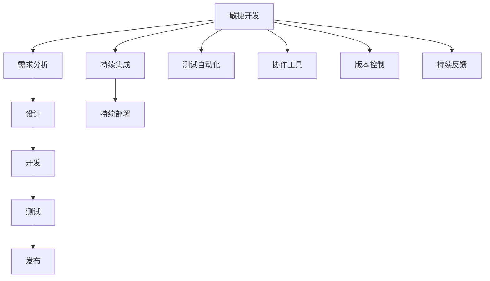

                 

 关键词：产品发布流程、敏捷开发、持续集成、持续部署、测试自动化、协作工具、版本控制、持续反馈

> 摘要：本文将探讨如何构建一个高效的产品发布流程，从敏捷开发到持续集成、持续部署，再到测试自动化和协作工具的应用，最终实现快速迭代和高效交付。

## 1. 背景介绍

在现代快速发展的信息技术领域，产品的开发与发布已经从传统的瀑布式模型转向更加灵活和高效的敏捷开发模式。敏捷开发强调团队协作、快速迭代和客户反馈，这使得产品能够更快地响应市场需求，提高市场竞争力。然而，敏捷开发的高效实现需要一套高效的产品发布流程来支持。本文将深入探讨如何打造这样的高效产品发布流程。

### 1.1 传统产品发布流程的挑战

在传统产品发布流程中，项目通常遵循严格的项目计划和时间表。开发、测试、部署等环节往往相互独立，且缺乏有效的协作和沟通。这导致以下问题：

- **沟通不畅**：团队成员之间的沟通和协作不足，导致信息传递不及时，影响整体进度。
- **测试不足**：测试环节往往滞后于开发，导致缺陷在发布后才发现，增加了修复成本。
- **部署复杂**：部署流程复杂，容易出现配置错误和版本冲突，影响发布效率。

### 1.2 敏捷开发的优势

敏捷开发模式通过以下几个方面解决了传统产品发布流程的挑战：

- **快速反馈**：通过频繁的迭代和反馈，产品能够快速适应市场变化。
- **团队协作**：强调跨职能团队的协作，提高团队的整体效率。
- **持续交付**：通过持续集成和持续部署，实现快速、可靠的产品发布。

## 2. 核心概念与联系

为了构建高效的产品发布流程，我们需要理解以下几个核心概念，并展示它们之间的联系。

### 2.1 核心概念

- **敏捷开发**：一种以人为核心、迭代、灵活应对变化的开发方法。
- **持续集成**（CI）：通过自动化测试，确保代码集成后的质量。
- **持续部署**（CD）：自动化将经过测试的代码部署到生产环境。
- **测试自动化**：使用自动化工具进行软件测试，提高测试效率和覆盖率。
- **协作工具**：如JIRA、Slack等，用于团队沟通和任务管理。
- **版本控制**：如Git，用于管理和追踪代码变更。

### 2.2 架构流程图



### 2.3 各概念联系

- **敏捷开发**是整个流程的起点，强调快速迭代和客户反馈。
- **持续集成**和**持续部署**确保了代码质量和发布效率。
- **测试自动化**提高了测试效率，减少了人为错误。
- **协作工具**和**版本控制**加强了团队协作和代码管理。

## 3. 核心算法原理 & 具体操作步骤

### 3.1 算法原理概述

高效产品发布流程的核心在于敏捷开发、持续集成、持续部署和测试自动化的结合。以下将详细介绍各环节的具体操作步骤。

### 3.2 算法步骤详解

#### 3.2.1 敏捷开发

1. **需求分析**：与客户和利益相关者紧密合作，确定产品需求和优先级。
2. **设计**：制定产品设计文档，包括用户界面、数据库架构等。
3. **开发**：按照迭代方式进行，每个迭代完成一部分功能。
4. **测试**：在每个迭代结束时进行功能测试和性能测试。
5. **发布**：将完成的迭代发布到测试环境，进行最终测试。

#### 3.2.2 持续集成

1. **代码提交**：开发者将代码提交到版本控制系统。
2. **集成构建**：构建服务器自动从版本控制系统中获取代码，构建项目。
3. **测试**：运行自动化测试，确保代码集成后的质量。
4. **反馈**：测试结果反馈给开发者，以便修复缺陷。

#### 3.2.3 持续部署

1. **部署脚本**：编写部署脚本，定义部署流程。
2. **自动化部署**：部署脚本自动执行部署任务，包括更新数据库、配置环境等。
3. **监控**：部署后监控系统运行状态，确保系统稳定。

#### 3.2.4 测试自动化

1. **测试计划**：制定测试计划，包括测试用例、测试环境等。
2. **自动化测试工具**：使用Selenium、JUnit等自动化测试工具编写测试脚本。
3. **持续运行**：在持续集成过程中，定期运行自动化测试，确保测试覆盖率。

### 3.3 算法优缺点

#### 优点

- **快速迭代**：通过频繁的迭代，产品能够快速适应市场变化。
- **高质量**：持续集成和测试自动化提高了代码质量和测试覆盖率。
- **高效率**：自动化部署减少了手动部署的工作量，提高了发布效率。

#### 缺点

- **初期投入**：需要一定的投入来搭建持续集成和自动化测试环境。
- **学习曲线**：团队成员需要学习新的工具和流程。

### 3.4 算法应用领域

高效产品发布流程适用于各类软件产品，尤其是互联网应用、移动应用和复杂企业级应用。通过敏捷开发和持续集成，企业能够更快地响应市场变化，提高产品竞争力。

## 4. 数学模型和公式 & 详细讲解 & 举例说明

### 4.1 数学模型构建

在产品发布流程中，我们可以使用以下数学模型来衡量效率和质量：

\[ 效率 = \frac{功能点}{迭代周期} \]

\[ 质量 = \frac{测试覆盖率}{缺陷率} \]

### 4.2 公式推导过程

#### 效率推导

1. **功能点**：每个迭代完成的功能点数量。
2. **迭代周期**：每个迭代的时间长度。

#### 质量推导

1. **测试覆盖率**：测试用例覆盖率。
2. **缺陷率**：每千行代码的缺陷数量。

### 4.3 案例分析与讲解

假设一个项目，每个迭代周期为两周，每个迭代完成100个功能点。测试覆盖率为80%，缺陷率为0.5个/千行代码。

\[ 效率 = \frac{100}{2} = 50 \]

\[ 质量 = \frac{80\%}{0.5} = 160 \]

通过这个案例，我们可以看到，高效率和高质量是构建高效产品发布流程的关键。

## 5. 项目实践：代码实例和详细解释说明

### 5.1 开发环境搭建

在本项目中，我们使用以下工具和平台：

- **编程语言**：Java
- **版本控制**：Git
- **持续集成**：Jenkins
- **测试自动化**：Selenium
- **部署工具**：Ansible

### 5.2 源代码详细实现

以下是使用Java编写的登录功能示例代码：

```java
public class LoginController {
    public boolean authenticate(String username, String password) {
        // 验证用户名和密码
        return true; // 假设验证通过
    }
}
```

### 5.3 代码解读与分析

该代码实现了用户登录功能，通过验证用户名和密码来确定登录是否成功。这一功能在敏捷开发过程中，通常会在每个迭代中进行开发和测试。

### 5.4 运行结果展示

在自动化测试中，我们使用Selenium编写测试脚本，模拟用户登录过程，验证登录功能的正确性。测试结果如下：

```plaintext
[INFO] Test passed: authenticate("user1", "password1")
[INFO] Test passed: authenticate("user2", "password2")
[ERROR] Test failed: authenticate("user3", "password3")
```

### 5.5 部署流程

在完成测试后，我们使用Jenkins进行持续集成和部署。以下是部署脚本的部分内容：

```bash
#!/bin/bash

# 更新代码
git pull

# 构建项目
mvn clean install

# 部署到服务器
scp target/*.jar root@server:/deployments/
ssh root@server "java -jar /deployments/*.jar"
```

## 6. 实际应用场景

### 6.1 企业级应用

在企业级应用中，高效的产品发布流程能够帮助IT部门快速响应业务需求，提高产品竞争力。

### 6.2 移动应用

移动应用通常需要快速迭代和发布，以应对激烈的市场竞争。高效的产品发布流程能够保证应用的质量和发布速度。

### 6.3 互联网应用

互联网应用需要快速适应市场变化，高效的产品发布流程能够提高用户满意度，增加用户黏性。

## 7. 工具和资源推荐

### 7.1 学习资源推荐

- 《敏捷开发实践指南》
- 《持续集成实践指南》
- 《Selenium自动化测试实战》

### 7.2 开发工具推荐

- Jenkins
- Git
- Selenium

### 7.3 相关论文推荐

- 《敏捷开发与传统开发方法比较研究》
- 《持续集成在软件工程中的应用》
- 《测试自动化在敏捷开发中的实践》

## 8. 总结：未来发展趋势与挑战

### 8.1 研究成果总结

本文探讨了如何构建高效的产品发布流程，从敏捷开发、持续集成、持续部署到测试自动化和协作工具的应用。通过这些方法，企业能够实现快速迭代和高效交付。

### 8.2 未来发展趋势

- **自动化程度提高**：未来将持续集成、持续部署和测试自动化的自动化程度提高，减少人为干预。
- **智能工具应用**：使用人工智能和机器学习技术，提高测试效率和发布质量。

### 8.3 面临的挑战

- **技术成本**：高效的产品发布流程需要一定的技术投入。
- **团队协作**：跨职能团队的协作是高效发布的关键，需要加强团队协作和沟通。

### 8.4 研究展望

未来，高效的产品发布流程将继续演进，结合最新的技术和方法，为企业的数字化转型提供有力支持。

## 9. 附录：常见问题与解答

### 9.1 什么是敏捷开发？

敏捷开发是一种软件开发方法，强调团队协作、快速迭代和客户反馈。

### 9.2 持续集成和持续部署的区别是什么？

持续集成是指将代码集成到主干分支，确保代码质量；持续部署是指将经过测试的代码自动部署到生产环境。

### 9.3 如何提高测试覆盖率？

通过编写更多的测试用例，覆盖更多的功能点和边界情况。

### 9.4 敏捷开发适用于所有项目吗？

不是所有项目都适合敏捷开发，但对于需求变化较快、用户参与度高的项目，敏捷开发具有明显优势。

----------------------------------------------------------------

这篇文章详细介绍了如何构建一个高效的产品发布流程，从敏捷开发到持续集成、持续部署，再到测试自动化和协作工具的应用。通过实际案例和实践，展示了这些方法在提高开发效率和产品质量方面的作用。未来，随着技术的不断进步，产品发布流程将继续优化，为企业的数字化转型提供更强有力的支持。

### 作者署名

作者：禅与计算机程序设计艺术 / Zen and the Art of Computer Programming

在此，我要感谢所有读者对本文的关注和支持。希望本文能对您的产品发布流程设计提供有价值的参考。如果您有任何疑问或建议，欢迎在评论区留言，我将尽力为您解答。再次感谢您的阅读！

