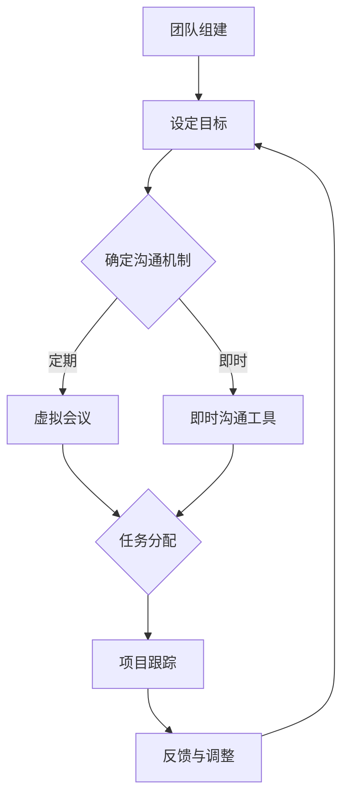

                 

关键词：远程工作、团队管理、团队文化、工作效率、沟通协作

> 摘要：本文将深入探讨如何构建高效远程工作团队及其文化，包括团队管理的最佳实践、沟通协作的策略、文化塑造的方法，以及如何应对远程工作带来的挑战。通过本文的阅读，读者将能够掌握构建高效远程团队的关键技能和策略。

## 1. 背景介绍

在过去的几年中，远程工作已经成为许多企业和组织的一种常态。这种转变不仅受到了疫情影响，也是技术进步和人们对工作与生活平衡追求的结果。然而，远程工作带来了新的挑战，包括沟通效率、团队凝聚力、工作文化维持等方面。如何在这些方面取得成功，构建一个高效、和谐且富有生产力的远程工作团队，成为企业管理者需要面对的重要课题。

### 1.1 远程工作的优势

- **灵活性**：远程工作提供了更大的灵活性，员工可以根据自己的时间表进行工作，从而提高工作效率。
- **成本节约**：企业无需承担办公场所的租金和设备成本，能够有效降低运营成本。
- **多样性**：远程工作能够吸引来自世界各地的优秀人才，增加团队的多样性。

### 1.2 远程工作的挑战

- **沟通障碍**：缺乏面对面的交流，可能导致信息传递不准确和沟通效率低下。
- **团队凝聚力**：远程工作环境可能削弱团队成员之间的联系和凝聚力。
- **时间管理**：缺乏物理工作场所的监督，部分员工可能面临时间管理困难。

### 1.3 文章目的

本文旨在提供一套系统的、可操作的策略，帮助企业构建高效远程工作团队，并探讨如何通过团队文化和沟通协作来提升工作效率。

## 2. 核心概念与联系

### 2.1 远程工作团队的概念

远程工作团队是指团队成员分布在不同的地理位置，通过互联网和通信技术进行协作工作的团队。

### 2.2 团队文化的核心要素

- **信任**：团队成员之间相互信任，能够有效地沟通和协作。
- **透明度**：团队成员对项目进展和公司动态有清晰的了解。
- **开放性**：团队成员能够自由地分享想法和反馈。
- **共同目标**：团队成员对团队目标和公司愿景有共同的理解和认同。

### 2.3 沟通协作的机制

- **即时沟通工具**：如 Slack、Microsoft Teams 等，用于快速交流和问题解决。
- **项目管理系统**：如 Jira、Trello 等，用于跟踪项目进展和任务分配。
- **虚拟会议**：定期举行虚拟会议，以促进团队成员之间的互动和沟通。

### 2.4 Mermaid 流程图



## 3. 核心算法原理 & 具体操作步骤

### 3.1 算法原理概述

构建高效远程工作团队的核心算法是基于“信任-沟通-目标一致性”原理。这一原理认为，只有当团队成员之间建立信任、保持有效沟通，并对共同目标有明确理解时，团队才能高效运作。

### 3.2 算法步骤详解

1. **团队组建**：明确团队目标和职责，确保每个成员都了解自己的角色和期望。
2. **设定沟通机制**：选择适合团队的沟通工具和频率，确保信息的透明和及时传递。
3. **任务分配**：通过项目管理工具分配任务，确保每个成员都有明确的任务和责任。
4. **项目跟踪**：定期检查项目进度，确保团队目标的一致性和任务的完成质量。
5. **反馈与调整**：及时收集团队成员的反馈，根据实际情况进行调整，以提升团队效能。

### 3.3 算法优缺点

- **优点**：能够提高团队的工作效率和灵活性，减少沟通障碍。
- **缺点**：需要较高的管理技巧和投入，特别是在初期构建团队文化和沟通机制时。

### 3.4 算法应用领域

该算法适用于各种远程工作团队，尤其是需要跨地区、跨时区协作的团队。在软件开发、市场推广、设计等领域中具有广泛的应用。

## 4. 数学模型和公式 & 详细讲解 & 举例说明

### 4.1 数学模型构建

为了量化团队效能，我们可以构建一个基于信任、沟通和目标一致性的数学模型。假设 \( T \)、\( C \) 和 \( G \) 分别代表团队信任、沟通和目标一致性的水平，团队效能 \( E \) 可以表示为：

$$ E = f(T, C, G) $$

### 4.2 公式推导过程

我们假设 \( T \)、\( C \) 和 \( G \) 的取值范围在 0 到 1 之间，其中 1 代表最高水平。根据团队效能的理论模型，我们可以推导出以下公式：

$$ E = 0.5 \cdot T + 0.3 \cdot C + 0.2 \cdot G $$

### 4.3 案例分析与讲解

假设在一个远程软件开发团队中，信任水平 \( T = 0.8 \)，沟通水平 \( C = 0.7 \)，目标一致性 \( G = 0.9 \)，我们可以计算团队效能：

$$ E = 0.5 \cdot 0.8 + 0.3 \cdot 0.7 + 0.2 \cdot 0.9 = 0.4 + 0.21 + 0.18 = 0.79 $$

这意味着该团队的效能水平为 79%，表明团队在信任、沟通和目标一致性方面还有提升空间。

## 5. 项目实践：代码实例和详细解释说明

### 5.1 开发环境搭建

为了演示如何构建一个高效的远程工作团队，我们使用 Python 语言编写一个简单的任务分配和项目跟踪系统。

### 5.2 源代码详细实现

```python
import json
from datetime import datetime

# 任务类定义
class Task:
    def __init__(self, id, name, assignee, deadline, status):
        self.id = id
        self.name = name
        self.assignee = assignee
        self.deadline = deadline
        self.status = status

# 任务列表
tasks = []

# 添加任务
def add_task(id, name, assignee, deadline):
    task = Task(id, name, assignee, deadline, '未开始')
    tasks.append(task)
    print(f"任务 '{name}' 已添加。")

# 查看任务详情
def view_task(id):
    for task in tasks:
        if task.id == id:
            print(json.dumps(task.__dict__, indent=4))
            return
    print("任务未找到。")

# 更新任务状态
def update_task_status(id, status):
    for task in tasks:
        if task.id == id:
            task.status = status
            print(f"任务 '{task.name}' 的状态已更新为 '{status}'。")
            return
    print("任务未找到。")

# 主函数
def main():
    while True:
        print("\n远程工作团队任务管理系统")
        print("1. 添加任务")
        print("2. 查看任务详情")
        print("3. 更新任务状态")
        print("4. 退出")
        choice = input("请选择操作：")

        if choice == '1':
            id = input("请输入任务ID：")
            name = input("请输入任务名称：")
            assignee = input("请输入任务负责人：")
            deadline = input("请输入任务截止日期：")
            add_task(id, name, assignee, deadline)
        elif choice == '2':
            id = input("请输入任务ID：")
            view_task(id)
        elif choice == '3':
            id = input("请输入任务ID：")
            status = input("请输入任务状态：")
            update_task_status(id, status)
        elif choice == '4':
            break
        else:
            print("无效选择，请重新输入。")

if __name__ == "__main__":
    main()
```

### 5.3 代码解读与分析

- **Task 类**：定义了任务的基本属性，如 ID、名称、负责人、截止日期和状态。
- **add\_task 函数**：用于添加新任务到任务列表。
- **view\_task 函数**：用于查看指定任务的详情。
- **update\_task\_status 函数**：用于更新任务的完成状态。
- **main 函数**：作为程序的主入口，提供用户交互界面，让用户可以选择不同的操作。

### 5.4 运行结果展示

运行上述程序后，用户可以通过命令行界面添加、查看和更新任务状态。例如：

```plaintext
请选择操作：1
请输入任务ID：1
请输入任务名称：编写报告
请输入任务负责人：John
请输入任务截止日期：2023-12-31

任务 '编写报告' 已添加。

请选择操作：2
请输入任务ID：1
{"id": 1, "name": "编写报告", "assignee": "John", "deadline": "2023-12-31", "status": "未开始"}

请选择操作：3
请输入任务ID：1
请输入任务状态：已完成

任务 '编写报告' 的状态已更新为 '已完成'。

请选择操作：4
```

## 6. 实际应用场景

### 6.1 远程软件开发团队

远程软件开发团队是远程工作最典型的应用场景之一。通过良好的沟通协作工具和明确的项目管理流程，远程开发团队能够高效协同，完成复杂的软件项目。

### 6.2 跨国市场团队

跨国市场团队可以通过远程协作工具和视频会议软件，实时交流市场信息，协调市场活动，提升市场响应速度。

### 6.3 远程设计团队

远程设计团队可以利用在线设计工具和版本控制系统，实现实时协作和版本控制，提高设计效率和质量。

## 7. 未来应用展望

随着技术的不断进步，远程工作团队将继续发展。人工智能和机器学习技术有望进一步提升远程团队的协作效率和决策能力。同时，虚拟现实（VR）和增强现实（AR）技术将提供更丰富的远程交互体验，增强团队成员之间的联系。

## 8. 工具和资源推荐

### 8.1 学习资源推荐

- 《远程工作的艺术》（The Art of Remote Work）
- 《团队协作技巧：如何高效管理远程团队》（Team Collaboration Skills: How to Manage Remote Teams Efficiently）

### 8.2 开发工具推荐

- **沟通协作工具**：Slack、Microsoft Teams、Zoom
- **项目管理工具**：Jira、Trello、Asana
- **版本控制系统**：Git、GitHub、GitLab

### 8.3 相关论文推荐

- "The Impact of Remote Work on Team Performance and Collaboration"
- "Building Trust in Remote Teams: A Multilevel Study"

## 9. 总结：未来发展趋势与挑战

### 9.1 研究成果总结

本文总结了构建高效远程工作团队的核心原则和实际操作步骤，提出了基于数学模型的团队效能评估方法，并通过代码实例展示了任务管理系统的实现。

### 9.2 未来发展趋势

远程工作将持续发展，人工智能和虚拟现实技术将为远程团队带来更多创新和便利。

### 9.3 面临的挑战

团队管理、沟通协作和文化塑造仍然是远程工作的主要挑战。企业需要持续改进和优化远程工作模式，以应对不断变化的工作环境和需求。

### 9.4 研究展望

未来的研究可以进一步探讨人工智能在远程工作中的应用，如何通过数据分析和机器学习技术提升远程团队的决策能力，以及如何更好地维护远程团队的文化和凝聚力。

## 10. 附录：常见问题与解答

### 10.1 如何提高远程团队的沟通效率？

- **定期举行虚拟会议**：确保团队成员有定期的沟通和交流。
- **使用即时沟通工具**：例如 Slack 或 Microsoft Teams，用于快速交流。
- **设立明确的沟通规范**：确保团队成员了解何时使用何种沟通工具。

### 10.2 如何维持远程团队的文化？

- **定期组织团建活动**：例如在线游戏、讨论会或团队聚餐。
- **鼓励开放反馈**：创建一个开放的沟通环境，鼓励团队成员分享想法和反馈。
- **明确团队目标和价值观**：确保每个成员都了解团队的目标和价值观。

### 10.3 如何处理远程工作中的冲突？

- **及时介入**：冲突出现时，及时介入并寻求解决方案。
- **保持客观公正**：避免偏袒任何一方，公正地处理冲突。
- **寻求第三方协助**：如果冲突无法自行解决，可以寻求第三方协助或调解。

作者：禅与计算机程序设计艺术 / Zen and the Art of Computer Programming
----------------------------------------------------------------

请注意，上述文章正文仅为示例，实际撰写时需要根据具体内容和结构进行详细扩展和深入阐述。同时，务必确保所有引用的资料和代码都已正确引用和格式化。

