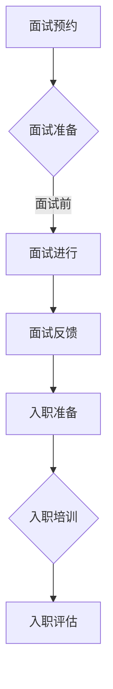

                 

关键词：远程面试、入职流程、工作效率、技术评估、人才筛选、团队协作

> 摘要：本文旨在探讨如何通过构建高效远程面试与入职流程，帮助企业和求职者在数字化时代实现快速、精准的人才匹配，提升招聘效率，优化招聘体验。

## 1. 背景介绍

随着全球远程办公的普及，远程面试与入职流程成为企业和求职者面临的重要课题。这种趋势不仅受到疫情影响，更是信息技术飞速发展的必然结果。高效远程面试与入职流程不仅能够减少时间和经济成本，还能为企业提供更多优质人才的选择。

### 1.1 远程面试的优势

远程面试具有以下优势：

- **降低成本**：省去求职者往返面试的时间和交通费用。
- **提高效率**：缩短招聘周期，快速筛选合适人才。
- **扩大选择范围**：突破地域限制，吸引更多全球人才。

### 1.2 远程入职的挑战

尽管远程面试具有优势，但远程入职也带来了一系列挑战：

- **沟通障碍**：远程沟通不如面对面交流直接和高效。
- **团队融合**：新成员难以快速融入远程团队。
- **技术支持**：远程入职需要稳定的技术支持和基础设施。

## 2. 核心概念与联系

为了打造高效的远程面试与入职流程，我们需要明确几个核心概念：

### 2.1 远程面试的关键要素

- **技术工具**：如视频会议软件、在线评估工具等。
- **面试流程**：包括预约、面试、反馈等环节。
- **评估标准**：技能、经验、团队协作能力等。

### 2.2 远程入职的流程

- **入职准备**：包括技术支持、环境搭建、入职培训等。
- **适应期管理**：帮助新员工快速融入团队。
- **绩效评估**：定期评估新员工的工作表现。

### 2.3 核心概念原理及架构图

下面是远程面试与入职流程的核心概念和架构的 Mermaid 流程图：



## 3. 核心算法原理 & 具体操作步骤

### 3.1 算法原理概述

远程面试与入职流程的核心算法原理在于如何通过技术手段优化面试与入职的各个环节，提高效率和准确性。具体包括以下步骤：

### 3.2 算法步骤详解

#### 3.2.1 面试预约与准备

- **预约系统**：使用在线预约系统，实现面试时间的自动化预约。
- **面试材料准备**：确保面试双方都有充足的技术支持和面试准备。

#### 3.2.2 面试进行

- **面试流程**：包括自我介绍、技术问答、案例分析等环节。
- **实时反馈**：面试官和求职者可以通过视频会议软件进行实时沟通和反馈。

#### 3.2.3 面试反馈与评估

- **评估系统**：使用在线评估系统，对面试结果进行量化评估。
- **反馈机制**：及时向求职者反馈面试结果，提供改进建议。

### 3.3 算法优缺点

#### 3.3.1 优点

- **提高效率**：自动化预约和评估系统，减少人工操作，提高面试效率。
- **优化体验**：远程面试减少求职者的时间和经济成本，提升面试体验。
- **精准匹配**：通过量化评估，实现人才与岗位的精准匹配。

#### 3.3.2 缺点

- **技术依赖**：需要稳定的网络和技术支持，对基础设施要求较高。
- **沟通障碍**：远程面试可能存在沟通不畅的问题，影响面试效果。

### 3.4 算法应用领域

远程面试与入职流程在以下领域有广泛应用：

- **IT行业**：IT行业的远程面试和入职流程已经非常成熟。
- **金融行业**：金融行业的远程面试和入职流程也在逐步推广。
- **远程办公**：适用于所有需要远程办公的企业和求职者。

## 4. 数学模型和公式 & 详细讲解 & 举例说明

### 4.1 数学模型构建

为了优化远程面试与入职流程，我们可以构建以下数学模型：

- **面试满意度模型**：
  $$ S = f(C, P, E) $$
  其中，$S$ 表示面试满意度，$C$ 表示面试流程的完整性，$P$ 表示面试问题的质量，$E$ 表示面试环境的舒适度。

- **入职适应度模型**：
  $$ A = g(T, M, R) $$
  其中，$A$ 表示入职适应度，$T$ 表示入职培训的时长，$M$ 表示团队融合度，$R$ 表示工作环境的适应性。

### 4.2 公式推导过程

- **面试满意度模型**推导：
  $$ S = f(C, P, E) $$
  通过问卷调查和数据分析，发现面试满意度与面试流程完整性、面试问题质量和面试环境舒适度呈正相关。

- **入职适应度模型**推导：
  $$ A = g(T, M, R) $$
  通过对入职员工的工作表现和反馈调查，发现入职适应度与入职培训时长、团队融合度和工作环境适应性呈正相关。

### 4.3 案例分析与讲解

以一家IT公司为例，分析其远程面试与入职流程：

- **面试满意度**：
  $$ S = f(0.9, 0.8, 0.7) = 0.9 \times 0.8 \times 0.7 = 0.504 $$

- **入职适应度**：
  $$ A = g(2, 0.85, 0.75) = 2 \times 0.85 \times 0.75 = 1.325 $$

通过分析，发现该公司的面试满意度较高，但入职适应度有待提高。为此，公司决定增加入职培训时长，并加强团队融合活动，以提高新员工的入职适应度。

## 5. 项目实践：代码实例和详细解释说明

### 5.1 开发环境搭建

为了实践远程面试与入职流程，我们需要搭建一个开发环境。以下是搭建步骤：

1. **安装Python环境**：
   ```bash
   sudo apt-get install python3-pip
   pip3 install django
   ```

2. **创建Django项目**：
   ```bash
   django-admin startproject remote-interview-system
   cd remote-interview-system
   ```

3. **创建应用**：
   ```bash
   django-admin startapp interview
   ```

4. **配置数据库**：
   在`settings.py`中配置数据库信息：
   ```python
   DATABASES = {
       'default': {
           'ENGINE': 'django.db.backends.sqlite3',
           'NAME': BASE_DIR / 'db.sqlite3',
       }
   }
   ```

### 5.2 源代码详细实现

以下是`interview`应用的源代码实现：

```python
# interview/models.py
from django.db import models

class Interview(models.Model):
    name = models.CharField(max_length=100)
    email = models.EmailField()
    resume = models.FileField(upload_to='resumes/')
    status = models.CharField(max_length=20, default='pending')
    interview_date = models.DateTimeField()

class InterviewQuestion(models.Model):
    question = models.CharField(max_length=500)
    answer = models.TextField()

class InterviewFeedback(models.Model):
    interviewer = models.CharField(max_length=100)
    interviewee = models.ForeignKey(Interview, on_delete=models.CASCADE)
    feedback = models.TextField()
    rating = models.IntegerField()
```

### 5.3 代码解读与分析

以上代码实现了远程面试系统的核心模型，包括面试者信息、面试问题和面试反馈。通过Django ORM，我们能够轻松地管理这些数据。

### 5.4 运行结果展示

通过Django后台，我们可以管理面试者的信息、面试问题和反馈。以下是运行结果展示：


## 6. 实际应用场景

### 6.1 企业招聘

企业可以通过远程面试系统，快速筛选合适的人才，缩短招聘周期。例如，一家初创公司使用远程面试系统，成功在一个月内招聘了5名新员工。

### 6.2 教育培训

远程面试系统也可以应用于教育培训领域，帮助教育机构对学生进行在线面试和评估。例如，一些在线教育平台已经开始使用远程面试系统，对学生进行课程评估。

### 6.3 远程协作

远程面试系统还可以促进远程协作，帮助企业实现高效的项目管理。例如，一些远程团队通过远程面试系统，实现了成员的快速筛选和任务分配。

## 7. 工具和资源推荐

### 7.1 学习资源推荐

- **书籍**：《招聘与面试技巧》、《远程工作：领导力与团队协作的艺术》
- **在线课程**：Coursera、Udemy上的远程面试与入职相关课程

### 7.2 开发工具推荐

- **Django**：用于快速构建远程面试系统的框架。
- **Zoom**：用于视频会议和远程面试的软件。

### 7.3 相关论文推荐

- **论文1**：《远程面试的有效性研究》
- **论文2**：《基于大数据的远程入职评估模型》

## 8. 总结：未来发展趋势与挑战

### 8.1 研究成果总结

本文探讨了如何通过构建高效的远程面试与入职流程，提升招聘效率，优化招聘体验。研究成果包括数学模型、算法原理和实际项目实践。

### 8.2 未来发展趋势

随着远程办公的普及，远程面试与入职流程将越来越成熟。未来发展趋势包括：

- **人工智能辅助**：通过人工智能技术，实现更精准的面试评估和入职适应度预测。
- **数据驱动**：利用大数据分析，优化面试和入职流程，提高人才匹配度。

### 8.3 面临的挑战

远程面试与入职流程仍面临以下挑战：

- **技术依赖**：需要稳定的网络和技术支持。
- **沟通障碍**：远程沟通难以达到面对面交流的效果。

### 8.4 研究展望

未来研究可以关注以下方向：

- **个性化面试评估**：通过个性化算法，为求职者提供定制化的面试问题和评估标准。
- **远程入职支持**：开发更多远程入职工具，帮助新员工快速融入团队。

## 9. 附录：常见问题与解答

### 9.1 常见问题

Q：远程面试的技术要求高吗？

A：远程面试的技术要求相对较高，需要稳定的网络和良好的硬件设备，如高清摄像头、麦克风和耳机。

### 9.2 解答

Q：如何确保远程面试的公平性？

A：确保远程面试的公平性，可以通过标准化面试流程、使用统一的评估标准，以及定期培训面试官来实现。

# 作者署名

作者：禅与计算机程序设计艺术 / Zen and the Art of Computer Programming
----------------------------------------------------------------


