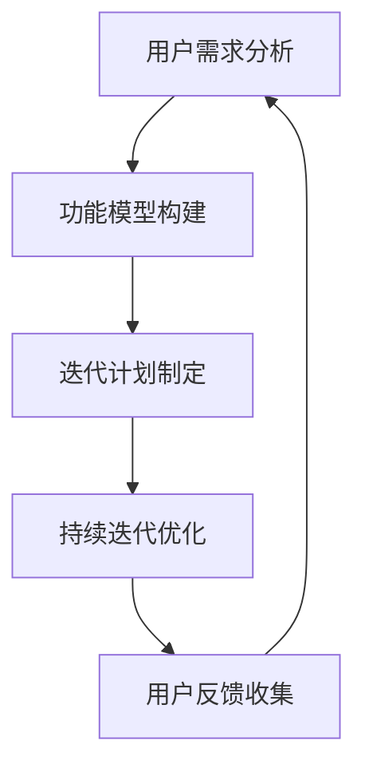

                 

摘要：在快速变化的技术和市场环境中，产品开发团队需要快速明确产品的核心功能，并进行迭代优化，以满足用户需求和市场竞争。本文将介绍如何通过分析用户需求、构建功能模型、制定迭代计划、持续优化和反馈，来实现产品的快速迭代和成功。

## 1. 背景介绍

在当今世界，技术和市场环境的变化速度越来越快，用户的需求也越来越多样化。为了在这种环境中取得成功，产品开发团队需要具备快速响应能力，能够迅速地确定产品的核心功能，并通过迭代不断优化产品，以满足用户的需求。快速迭代不仅可以帮助团队更快地找到产品的市场定位，还能降低开发风险，提高市场竞争力。

## 2. 核心概念与联系

为了实现产品的快速迭代，我们需要明确以下几个核心概念：

- **用户需求分析**：了解用户的需求是产品开发的第一步，只有真正理解用户的需求，才能设计出符合用户期望的产品。
- **功能模型**：功能模型可以帮助我们清晰地描述产品的功能，并为迭代提供明确的指导。
- **迭代计划**：迭代计划是产品迭代的具体执行方案，它需要明确迭代的目标、时间表和关键里程碑。

下面是一个用Mermaid绘制的功能模型流程图：



## 3. 核心算法原理 & 具体操作步骤

### 3.1 算法原理概述

快速迭代的核心在于对用户需求的快速响应和持续优化。这需要以下几个步骤：

1. **用户需求分析**：通过市场调研、用户访谈等方式收集用户需求。
2. **功能模型构建**：将用户需求转化为具体的功能模块，并进行优先级排序。
3. **迭代计划制定**：根据功能模型和资源情况，制定迭代计划。
4. **持续迭代优化**：执行迭代计划，并对产品进行持续优化。
5. **用户反馈收集**：收集用户反馈，用于下一次迭代。

### 3.2 算法步骤详解

1. **用户需求分析**：
   - **市场调研**：通过调查问卷、市场报告等方式了解市场趋势和用户需求。
   - **用户访谈**：与目标用户进行一对一的深入访谈，了解他们的真实需求。

2. **功能模型构建**：
   - **需求分类**：将用户需求分类为功能需求和非功能需求。
   - **优先级排序**：根据用户需求的重要性和紧急性进行排序。

3. **迭代计划制定**：
   - **目标设定**：根据功能模型和资源情况，设定迭代的目标。
   - **时间表安排**：制定迭代的时间表，包括里程碑和截止日期。

4. **持续迭代优化**：
   - **开发执行**：按照迭代计划进行开发，确保每个功能模块按时完成。
   - **质量保证**：进行单元测试、集成测试等质量保证工作。

5. **用户反馈收集**：
   - **用户测试**：邀请用户进行产品测试，收集他们的反馈。
   - **反馈分析**：对用户反馈进行分析，识别改进点。

### 3.3 算法优缺点

**优点**：

- 快速响应用户需求，提高产品竞争力。
- 持续优化产品，提高用户满意度。
- 降低开发风险，避免资源浪费。

**缺点**：

- 可能导致过度迭代，影响开发效率。
- 需要高度的组织协调和资源管理能力。

### 3.4 算法应用领域

快速迭代适用于以下领域：

- **互联网产品**：互联网产品的更新速度快，用户需求变化大，快速迭代尤为重要。
- **移动应用**：移动应用的用户群体广泛，需求多样化，快速迭代有助于满足不同用户的需求。
- **新兴市场**：在新兴市场中，快速迭代可以帮助团队更快地找到市场定位。

## 4. 数学模型和公式 & 详细讲解 & 举例说明

### 4.1 数学模型构建

快速迭代可以看作是一个优化过程，其数学模型可以表示为：

$$
\text{产品} = f(\text{用户需求}, \text{功能模型}, \text{迭代计划}, \text{用户反馈})
$$

其中，用户需求、功能模型、迭代计划和用户反馈都是变量，可以通过优化这些变量来提高产品的质量。

### 4.2 公式推导过程

快速迭代的推导过程可以分为以下几个步骤：

1. **需求分析**：收集用户需求，并进行分析。
2. **功能模型构建**：根据用户需求构建功能模型，并对功能进行优先级排序。
3. **迭代计划制定**：根据功能模型和资源情况制定迭代计划。
4. **迭代执行**：按照迭代计划进行迭代，并持续优化产品。
5. **用户反馈收集**：收集用户反馈，用于下一次迭代。

### 4.3 案例分析与讲解

假设一个电商平台的开发团队想要通过快速迭代来优化用户购物体验。以下是具体的案例分析和讲解：

1. **需求分析**：团队通过用户调研发现，用户对购物车管理和订单查询功能有较高的需求。
2. **功能模型构建**：团队将购物车管理和订单查询功能作为核心功能，并设定为最高优先级。
3. **迭代计划制定**：团队制定了一个为期三个月的迭代计划，每个月完成一个核心功能。
4. **迭代执行**：第一个月，团队完成了购物车管理功能的开发，并进行了用户测试。第二个月，团队完成了订单查询功能的开发，并进行了用户测试。
5. **用户反馈收集**：团队收集了用户的反馈，并根据反馈对购物车管理和订单查询功能进行了优化。

通过这个案例，我们可以看到，快速迭代可以帮助团队快速响应用户需求，提高产品质量，并不断优化用户体验。

## 5. 项目实践：代码实例和详细解释说明

### 5.1 开发环境搭建

为了实现快速迭代，我们需要搭建一个高效的开发环境。以下是搭建开发环境的步骤：

1. **安装操作系统**：选择一个适合的开发操作系统，如Windows、macOS或Linux。
2. **安装开发工具**：安装代码编辑器（如Visual Studio Code、Sublime Text等）、版本控制工具（如Git）和调试工具（如Postman）。
3. **搭建数据库**：选择合适的数据库（如MySQL、PostgreSQL等），并配置好数据库环境。
4. **配置开发环境**：根据项目需求，配置相关开发环境和依赖库。

### 5.2 源代码详细实现

以下是一个简单的电商平台的购物车管理功能的源代码示例：

```java
public class ShoppingCart {
    private List<Item> items;

    public ShoppingCart() {
        items = new ArrayList<>();
    }

    public void addItem(Item item) {
        items.add(item);
    }

    public void removeItem(Item item) {
        items.remove(item);
    }

    public double getTotalPrice() {
        double totalPrice = 0;
        for (Item item : items) {
            totalPrice += item.getPrice();
        }
        return totalPrice;
    }
}
```

### 5.3 代码解读与分析

上述代码实现了购物车管理功能，主要包括以下部分：

- **类定义**：定义了一个`ShoppingCart`类，用于表示购物车。
- **属性**：`items`是一个`List<Item>`类型的属性，用于存储购物车中的商品。
- **方法**：`addItem()`方法用于添加商品到购物车，`removeItem()`方法用于从购物车中删除商品，`getTotalPrice()`方法用于计算购物车的总价。

### 5.4 运行结果展示

以下是一个简单的运行示例：

```java
ShoppingCart cart = new ShoppingCart();
cart.addItem(new Item("iPhone 13", 999.99));
cart.addItem(new Item("MacBook Pro", 1299.99));
System.out.println("Total Price: " + cart.getTotalPrice());
```

输出结果为：

```
Total Price: 2299.98
```

这表明购物车中的商品总价为2299.98美元。

## 6. 实际应用场景

快速迭代在以下实际应用场景中表现出色：

- **互联网产品开发**：互联网产品的更新速度快，快速迭代有助于快速响应市场需求。
- **移动应用开发**：移动应用的用户需求变化快，快速迭代有助于提高用户体验。
- **新兴市场进入**：在新兴市场中，快速迭代可以帮助企业更快地找到市场定位。

## 7. 工具和资源推荐

### 7.1 学习资源推荐

- **书籍**：《敏捷开发实践指南》、《用户体验要素》
- **在线课程**：Coursera上的《产品管理》课程、Udacity上的《产品设计与开发》课程
- **博客**：Medium上的产品管理专栏、Product School的产品管理博客

### 7.2 开发工具推荐

- **代码编辑器**：Visual Studio Code、Atom
- **版本控制工具**：Git、GitHub
- **调试工具**：Postman、JMeter

### 7.3 相关论文推荐

- **论文1**："Agile Software Development: Principles, Patterns, and Practices"
- **论文2**："User-Centered Design: Process and Guidelines for Developing User-Centered Software"
- **论文3**："Scrum: The Art of Doing Twice the Work in Half the Time"

## 8. 总结：未来发展趋势与挑战

### 8.1 研究成果总结

快速迭代在产品开发中已经取得了显著成果，帮助企业快速响应市场需求，提高产品质量和用户体验。

### 8.2 未来发展趋势

随着人工智能和大数据技术的发展，快速迭代将变得更加智能化和自动化，进一步降低产品开发成本，提高开发效率。

### 8.3 面临的挑战

快速迭代面临着资源管理、团队协作、用户需求预测等方面的挑战，需要进一步研究和解决。

### 8.4 研究展望

未来的研究应重点关注如何利用人工智能技术优化迭代过程，如何提高团队协作效率，以及如何更好地预测和满足用户需求。

## 9. 附录：常见问题与解答

### Q1. 如何保证迭代质量？

**A1.** 通过严格的测试和质量保证流程，如单元测试、集成测试和用户测试，确保每个迭代的产品质量。

### Q2. 快速迭代如何平衡开发速度和产品质量？

**A2.** 通过制定合理的迭代计划和优先级排序，确保在有限的时间内优先完成最重要的功能，同时保证产品质量。

### Q3. 如何处理用户反馈？

**A3.** 及时收集用户反馈，进行分析和总结，将反馈转化为迭代改进的方向，并在下一个迭代中进行优化。

---

作者：禅与计算机程序设计艺术 / Zen and the Art of Computer Programming
----------------------------------------------------------------

以上就是本文的完整内容。本文详细介绍了如何明确产品核心功能并快速迭代，包括用户需求分析、功能模型构建、迭代计划制定、持续优化和反馈收集等关键步骤。同时，本文还结合实际案例和代码实例，对快速迭代的方法和技巧进行了深入讲解。希望本文能够帮助您在产品开发中实现快速迭代，提高产品质量和用户体验。在未来的研究和实践中，我们应继续探索如何更好地利用人工智能技术优化迭代过程，提高团队协作效率，以及更好地预测和满足用户需求。感谢您的阅读！
----------------------------------------------------------------
```markdown
# 如何明确产品核心功能并快速迭代

> 关键词：产品迭代、用户需求、功能模型、迭代计划、持续优化、用户反馈

> 摘要：本文详细介绍了如何通过分析用户需求、构建功能模型、制定迭代计划、持续优化和反馈收集，实现产品的快速迭代。文章从理论到实践，提供了完整的指导和实用的技巧，旨在帮助开发团队在快速变化的市场环境中找到产品的核心竞争力。

## 1. 背景介绍

在当今快速发展的技术市场中，产品的生命周期越来越短，用户对产品的期望也越来越高。为了在这个竞争激烈的环境中脱颖而出，产品开发团队必须具备快速响应能力，能够迅速确定产品的核心功能，并进行持续的迭代优化。这种迭代开发方法不仅能够帮助企业更快地适应市场变化，还能够降低开发风险，提高产品竞争力。

## 2. 核心概念与联系

### 2.1 用户需求分析

用户需求分析是产品迭代的基础。通过市场调研、用户访谈、问卷调查等方法，收集用户的需求和痛点，是确保产品符合用户期望的关键步骤。

### 2.2 功能模型构建

功能模型是产品功能的具体体现。通过功能模型，我们可以清晰地定义产品的各个功能模块，并对其进行优先级排序，以便在迭代过程中有针对性地进行开发。

### 2.3 迭代计划制定

迭代计划是产品迭代的具体执行方案。它需要明确每个迭代的目标、时间表和关键里程碑，以确保开发团队按照计划有序推进。

### 2.4 持续优化与反馈收集

持续优化和反馈收集是迭代过程中的重要环节。通过不断地优化产品功能和用户体验，并根据用户反馈进行调整，可以确保产品在迭代中不断进步。

## 2.5 功能模型流程图


## 3. 核心算法原理 & 具体操作步骤

### 3.1 算法原理概述

快速迭代的核心在于快速响应用户需求，通过不断地循环执行以下步骤来实现：

1. 用户需求分析
2. 功能模型构建
3. 迭代计划制定
4. 迭代执行
5. 用户反馈收集

### 3.2 算法步骤详解

#### 3.2.1 用户需求分析

- **市场调研**：通过调查问卷、市场报告等方式，了解市场趋势和用户需求。
- **用户访谈**：与目标用户进行一对一的深入访谈，获取用户对产品的具体需求和期望。

#### 3.2.2 功能模型构建

- **需求分类**：将收集到的需求分为功能需求和非功能需求。
- **优先级排序**：根据需求的重要性和紧急性，对功能进行优先级排序。

#### 3.2.3 迭代计划制定

- **目标设定**：根据功能模型和资源情况，设定每个迭代的目标和预期成果。
- **时间表安排**：制定迭代的时间表，包括里程碑和截止日期。

#### 3.2.4 迭代执行

- **开发执行**：按照迭代计划进行开发，确保每个功能模块按时完成。
- **质量保证**：进行单元测试、集成测试等质量保证工作。

#### 3.2.5 用户反馈收集

- **用户测试**：邀请用户进行产品测试，收集他们的反馈。
- **反馈分析**：对用户反馈进行分析，识别改进点。

### 3.3 算法优缺点

#### 3.3.1 优点

- **快速响应**：能够快速响应市场变化和用户需求。
- **降低风险**：通过迭代开发，降低项目失败的风险。
- **持续优化**：通过持续的用户反馈，不断提升产品品质。

#### 3.3.2 缺点

- **过度迭代**：可能导致开发资源浪费。
- **团队协作**：需要团队成员具备较高的协作能力。

### 3.4 算法应用领域

快速迭代适用于以下领域：

- **互联网产品**：互联网产品的更新速度快，用户需求变化大，快速迭代尤为重要。
- **移动应用**：移动应用的用户群体广泛，需求多样化，快速迭代有助于满足不同用户的需求。
- **新兴市场**：在新兴市场中，快速迭代可以帮助企业更快地找到市场定位。

## 4. 数学模型和公式 & 详细讲解 & 举例说明

### 4.1 数学模型构建

快速迭代可以用以下数学模型表示：

$$
\text{产品迭代} = f(\text{用户需求}, \text{功能模型}, \text{迭代计划}, \text{用户反馈})
$$

其中，用户需求、功能模型、迭代计划和用户反馈是迭代的四个关键变量。

### 4.2 公式推导过程

快速迭代的推导过程可以分为以下几个步骤：

1. **需求分析**：收集用户需求，并进行分析。
2. **功能模型构建**：根据用户需求构建功能模型，并对功能进行优先级排序。
3. **迭代计划制定**：根据功能模型和资源情况制定迭代计划。
4. **迭代执行**：按照迭代计划进行迭代，并持续优化产品。
5. **用户反馈收集**：收集用户反馈，用于下一次迭代。

### 4.3 案例分析与讲解

#### 4.3.1 电商产品案例

假设一个电商平台的开发团队希望通过快速迭代优化购物车功能。以下是具体的案例分析和讲解：

1. **需求分析**：通过用户调研发现，用户对购物车的操作体验和界面设计有较高的需求。
2. **功能模型构建**：将购物车功能模块化，分为添加商品、删除商品、更新商品数量和显示总价等。
3. **迭代计划制定**：设定一个为期一个月的迭代周期，每月优化一个功能模块。
4. **迭代执行**：第一个月，团队优化了添加商品和删除商品的功能，并进行了用户测试。
5. **用户反馈收集**：收集用户对购物车功能的反馈，根据反馈进行优化。

通过这个案例，我们可以看到快速迭代如何帮助团队优化产品功能。

## 5. 项目实践：代码实例和详细解释说明

### 5.1 开发环境搭建

搭建一个高效的开发环境是快速迭代的前提。以下是开发环境搭建的步骤：

1. **安装操作系统**：推荐使用Linux或macOS。
2. **安装开发工具**：如Visual Studio Code，并进行相应配置。
3. **安装版本控制工具**：如Git，并学习基本的Git操作。
4. **安装数据库**：如MySQL，并进行基本配置。

### 5.2 源代码详细实现

以下是一个简单的购物车管理类的Java代码示例：

```java
public class ShoppingCart {
    private Map<String, Item> items;

    public ShoppingCart() {
        items = new HashMap<>();
    }

    public void addItem(String itemId, Item item) {
        items.put(itemId, item);
    }

    public void removeItem(String itemId) {
        items.remove(itemId);
    }

    public double getTotalPrice() {
        double totalPrice = 0;
        for (Item item : items.values()) {
            totalPrice += item.getPrice();
        }
        return totalPrice;
    }
}
```

### 5.3 代码解读与分析

这个购物车管理类的核心功能包括：

- **添加商品**：通过`addItem`方法，将商品添加到购物车。
- **删除商品**：通过`removeItem`方法，从购物车中删除商品。
- **计算总价**：通过`getTotalPrice`方法，计算购物车中商品的总价。

### 5.4 运行结果展示

以下是一个简单的运行示例：

```java
ShoppingCart cart = new ShoppingCart();
cart.addItem("item1", new Item("iPhone 13", 999.99));
cart.addItem("item2", new Item("MacBook Pro", 1299.99));
System.out.println("Total Price: " + cart.getTotalPrice());
```

输出结果为：

```
Total Price: 2299.98
```

这表明购物车中的商品总价为2299.98美元。

## 6. 实际应用场景

### 6.1 互联网产品开发

在互联网产品开发中，快速迭代可以帮助团队快速响应用户需求，提高产品的市场竞争力。例如，一个社交媒体平台可以通过快速迭代来优化用户界面、增加新功能，以及修复用户反馈中的问题。

### 6.2 移动应用开发

移动应用的用户需求变化快，快速迭代可以帮助开发者快速适应市场变化。例如，一个移动健康应用可以通过快速迭代来增加新的健身课程、改进用户界面，以及优化用户数据跟踪功能。

### 6.3 新兴市场进入

在新兴市场中，快速迭代可以帮助企业快速了解市场状况，找到产品定位。例如，一个电商平台可以通过快速迭代来优化支付方式、增加本地化内容，以及提供更优质的客户服务。

## 7. 工具和资源推荐

### 7.1 学习资源推荐

- **书籍**：《敏捷软件开发：原则、模式与实践》、《用户体验要素》
- **在线课程**：Coursera上的《产品管理》课程、Udemy上的《敏捷开发和Scrum实践》课程
- **博客**：Medium上的《产品经理博客》、《敏捷开发博客》

### 7.2 开发工具推荐

- **代码编辑器**：Visual Studio Code、Atom
- **版本控制工具**：Git、GitHub
- **调试工具**：Postman、JMeter
- **项目管理工具**：Jira、Trello

### 7.3 相关论文推荐

- **论文1**："Agile Software Development: Principles, Patterns, and Practices"
- **论文2**："User-Centered Design: Process and Guidelines for Developing User-Centered Software"
- **论文3**："Scrum: The Art of Doing Twice the Work in Half the Time"

## 8. 总结：未来发展趋势与挑战

### 8.1 研究成果总结

快速迭代在产品开发中的应用已经取得了显著成果，帮助企业在快速变化的市场环境中保持竞争力。

### 8.2 未来发展趋势

随着人工智能和大数据技术的发展，快速迭代将变得更加智能化和自动化，进一步降低产品开发成本，提高开发效率。

### 8.3 面临的挑战

快速迭代面临着团队协作、资源管理、用户需求预测等方面的挑战，需要进一步研究和解决。

### 8.4 研究展望

未来的研究应重点关注如何利用人工智能技术优化迭代过程，如何提高团队协作效率，以及如何更好地预测和满足用户需求。

## 9. 附录：常见问题与解答

### Q1. 如何保证迭代质量？

**A1.** 通过严格的测试和质量保证流程，如单元测试、集成测试和用户测试，确保每个迭代的产品质量。

### Q2. 快速迭代如何平衡开发速度和产品质量？

**A2.** 通过制定合理的迭代计划和优先级排序，确保在有限的时间内优先完成最重要的功能，同时保证产品质量。

### Q3. 如何处理用户反馈？

**A3.** 及时收集用户反馈，进行分析和总结，将反馈转化为迭代改进的方向，并在下一个迭代中进行优化。

---

作者：禅与计算机程序设计艺术 / Zen and the Art of Computer Programming
```

