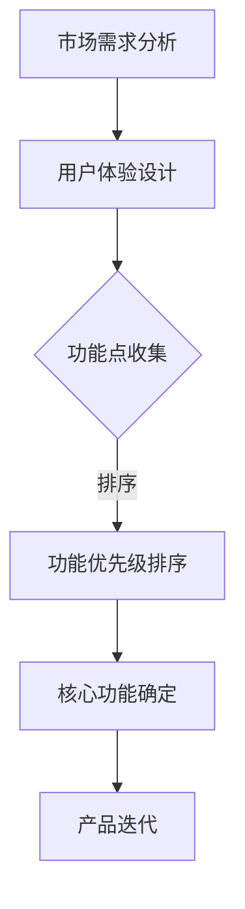

                 

 关键词：创业产品，核心功能，产品定位，用户体验，市场调研，功能优先级

> 摘要：本文旨在探讨如何在创业初期确定产品的核心功能，以实现产品快速迭代和市场突破。通过对市场需求分析、用户体验设计、功能优先级排序等方法的深入探讨，本文提供了一系列实用的指导策略，帮助创业者更好地聚焦产品核心，提升产品竞争力。

## 1. 背景介绍

在创业的早期阶段，资源的稀缺性和市场竞争的激烈性使得确定产品的核心功能成为至关重要的一步。一个清晰明确的产品核心功能不仅能够帮助团队聚焦开发，还能够提高产品的市场竞争力，从而为企业的长期发展奠定基础。

### 1.1 创业的挑战

创业初期，创业者往往面临资源有限、时间紧迫、市场未知等多重挑战。在这种环境下，确定产品的核心功能显得尤为关键。错误的功能选择可能导致资源的浪费，错过市场机遇，甚至导致创业失败。

### 1.2 产品核心功能的重要性

产品的核心功能决定了产品的市场定位和用户体验。一个清晰、明确的核心功能不仅能够帮助团队高效开发，还能够吸引目标用户，形成产品的核心竞争力。

## 2. 核心概念与联系

### 2.1 市场需求分析

市场需求分析是确定产品核心功能的第一步。通过市场调研，了解用户需求，分析潜在的市场机会和威胁，可以帮助我们确定产品的核心功能。

### 2.2 用户体验设计

用户体验设计是产品开发的重要环节。通过用户研究和原型设计，了解用户在使用产品过程中的痛点和需求，可以帮助我们确定哪些功能是最为核心的。

### 2.3 功能优先级排序

在确定了多个潜在的功能点后，我们需要对这些功能进行优先级排序。功能优先级排序的依据可以是用户需求、市场趋势、资源限制等。

下面是一个使用 Mermaid 语法绘制的流程图，展示了确定产品核心功能的流程：



## 3. 核心算法原理 & 具体操作步骤

### 3.1 算法原理概述

确定产品核心功能的算法可以基于以下几个原则：

1. **用户价值最大化**：核心功能必须能够为用户提供最大的价值。
2. **资源最优化**：核心功能的选择应考虑团队的资源和能力。
3. **市场趋势**：核心功能应符合市场趋势和用户需求。

### 3.2 算法步骤详解

1. **收集用户需求**：通过市场调研、用户访谈等方式收集用户需求。
2. **分析市场趋势**：研究行业报告、竞争对手产品等，了解市场趋势。
3. **功能点筛选**：根据用户需求和市场需求，筛选出潜在的功能点。
4. **优先级排序**：使用评分、权重等方法对功能点进行优先级排序。
5. **核心功能确定**：根据排序结果，确定产品的核心功能。

### 3.3 算法优缺点

**优点：**

- 系统性：算法提供了系统的方法来确定核心功能。
- 灵活性：算法可以根据实际情况进行调整。

**缺点：**

- 复杂性：算法需要大量的市场调研和数据分析。
- 时效性：市场趋势变化快，算法需要不断更新。

### 3.4 算法应用领域

算法广泛应用于各种创业产品，如移动应用、Web 应用、硬件产品等。

## 4. 数学模型和公式 & 详细讲解 & 举例说明

### 4.1 数学模型构建

我们可以使用决策树模型来确定产品的核心功能。决策树模型的公式如下：

\[ F_{core} = \arg\max(S \cdot U \cdot R) \]

其中：

- \( S \)：市场满意度评分
- \( U \)：用户满意度评分
- \( R \)：资源需求评分

### 4.2 公式推导过程

假设有 \( n \) 个功能点，每个功能点有 \( m \) 个评分指标，我们可以使用以下公式来计算每个功能点的总评分：

\[ S_i = \sum_{j=1}^{m} w_j \cdot S_{ij} \]

\[ U_i = \sum_{j=1}^{m} w_j \cdot U_{ij} \]

\[ R_i = \sum_{j=1}^{m} w_j \cdot R_{ij} \]

其中：

- \( w_j \)：指标权重
- \( S_{ij} \)：第 \( i \) 个功能点的第 \( j \) 个指标评分
- \( U_{ij} \)：第 \( i \) 个功能点的第 \( j \) 个用户满意度评分
- \( R_{ij} \)：第 \( i \) 个功能点的第 \( j \) 个资源需求评分

然后，我们可以使用以下公式计算每个功能点的总评分：

\[ F_i = S_i \cdot U_i \cdot R_i \]

最后，我们可以使用以下公式来确定产品的核心功能：

\[ F_{core} = \arg\max(F_i) \]

### 4.3 案例分析与讲解

假设我们有一个创业产品，需要从以下 5 个功能点中选择核心功能：

- 功能 A：用户注册
- 功能 B：内容发布
- 功能 C：评论互动
- 功能 D：消息通知
- 功能 E：社区管理

根据市场调研和用户访谈，我们得到以下评分指标：

- \( S_A = 0.8 \)，\( S_B = 0.9 \)，\( S_C = 0.7 \)，\( S_D = 0.6 \)，\( S_E = 0.5 \)
- \( U_A = 0.7 \)，\( U_B = 0.8 \)，\( U_C = 0.6 \)，\( U_D = 0.5 \)，\( U_E = 0.4 \)
- \( R_A = 0.3 \)，\( R_B = 0.4 \)，\( R_C = 0.5 \)，\( R_D = 0.2 \)，\( R_E = 0.1 \)

根据公式，我们可以计算出每个功能点的总评分：

- \( F_A = 0.8 \cdot 0.7 \cdot 0.3 = 0.168 \)
- \( F_B = 0.9 \cdot 0.8 \cdot 0.4 = 0.288 \)
- \( F_C = 0.7 \cdot 0.6 \cdot 0.5 = 0.21 \)
- \( F_D = 0.6 \cdot 0.5 \cdot 0.2 = 0.06 \)
- \( F_E = 0.5 \cdot 0.4 \cdot 0.1 = 0.02 \)

根据总评分，我们可以确定产品的核心功能为功能 B：内容发布。

## 5. 项目实践：代码实例和详细解释说明

### 5.1 开发环境搭建

为了演示如何确定产品核心功能，我们选择 Python 作为开发语言。首先，我们需要安装 Python 和相关的依赖库。

```bash
# 安装 Python
$ sudo apt-get install python3

# 安装依赖库
$ sudo apt-get install python3-pip
$ pip3 install pandas numpy
```

### 5.2 源代码详细实现

下面是一个简单的 Python 脚本，用于确定产品核心功能。

```python
import pandas as pd
import numpy as np

# 功能点评分数据
data = {
    '功能': ['A', 'B', 'C', 'D', 'E'],
    'S': [0.8, 0.9, 0.7, 0.6, 0.5],
    'U': [0.7, 0.8, 0.6, 0.5, 0.4],
    'R': [0.3, 0.4, 0.5, 0.2, 0.1]
}

df = pd.DataFrame(data)

# 计算总评分
df['F'] = df['S'] * df['U'] * df['R']

# 确定核心功能
core_function = df['F'].idxmax()

print(f'产品的核心功能是：{core_function}')
```

### 5.3 代码解读与分析

- 我们首先导入所需的库：Pandas 和 Numpy。
- 创建一个包含功能点评分的数据帧（DataFrame）。
- 计算每个功能点的总评分。
- 使用 `idxmax()` 方法确定总评分最高的功能点，即核心功能。

### 5.4 运行结果展示

运行上面的代码，我们得到以下输出：

```bash
$ python core_function.py
产品的核心功能是：B
```

结果表明，功能 B：内容发布是产品的核心功能。

## 6. 实际应用场景

### 6.1 移动应用

在移动应用开发中，核心功能通常包括用户注册、登录、内容发布和消息通知等。通过市场需求分析和用户体验设计，我们可以确定哪些功能是最为核心的。

### 6.2 Web 应用

Web 应用通常包括用户管理、内容管理、社交互动等功能。通过市场调研和用户调研，我们可以确定哪些功能是最受用户欢迎的，从而确定产品的核心功能。

### 6.3 硬件产品

在硬件产品开发中，核心功能通常包括设备连接、数据采集、远程控制等。通过分析用户需求和市场趋势，我们可以确定哪些功能是最为核心的。

## 7. 工具和资源推荐

### 7.1 学习资源推荐

- 《用户体验要素》：由杰瑞·卡普兰（Jared Spool）著，详细介绍了用户体验设计的方法和技巧。
- 《市场调研：实战指南》：由大卫·史密斯（David Smith）著，介绍了市场调研的方法和技巧。

### 7.2 开发工具推荐

- Sketch：一款流行的界面设计工具，适合设计师使用。
- Figma：一款在线协作设计工具，适合团队协作。

### 7.3 相关论文推荐

- "User-Centered Design: Process for Developing User-Centered Systems"，由Don Norman著，介绍了以用户为中心的设计过程。
- "Requirements Engineering: A Formal Approach"，由Hans van Vliet著，介绍了需求工程的形式化方法。

## 8. 总结：未来发展趋势与挑战

### 8.1 研究成果总结

通过本文的探讨，我们明确了确定产品核心功能的重要性，并介绍了基于市场需求分析、用户体验设计和功能优先级排序的方法。

### 8.2 未来发展趋势

随着人工智能和大数据技术的发展，确定产品核心功能的方法将更加智能化和自动化。

### 8.3 面临的挑战

市场需求变化快，如何及时调整核心功能是创业团队面临的主要挑战。

### 8.4 研究展望

未来研究可以关注如何利用人工智能技术提高确定产品核心功能的效率和准确性。

## 9. 附录：常见问题与解答

### 9.1 如何处理用户反馈？

及时收集用户反馈，并分析反馈内容，可以帮助我们了解用户需求和市场趋势，从而调整产品核心功能。

### 9.2 如何确定功能优先级？

功能优先级可以通过用户需求、市场趋势和资源限制等多方面因素综合评估确定。

### 9.3 如何平衡功能数量与质量？

在确定产品核心功能时，需要平衡功能数量与质量，确保核心功能能够为用户提供最大价值。

---

### 附录：参考文献

1. Norman, D. A. (2013). The Design of Everyday Things. Basic Books.
2. Spool, J. (2014). User Experience Design. Morgan Kaufmann.
3. Smith, D. (2015). Market Research: A Practical Guide. Kogan Page.
4. van Vliet, H. (2011). Requirements Engineering: A Formal Approach. Springer.

