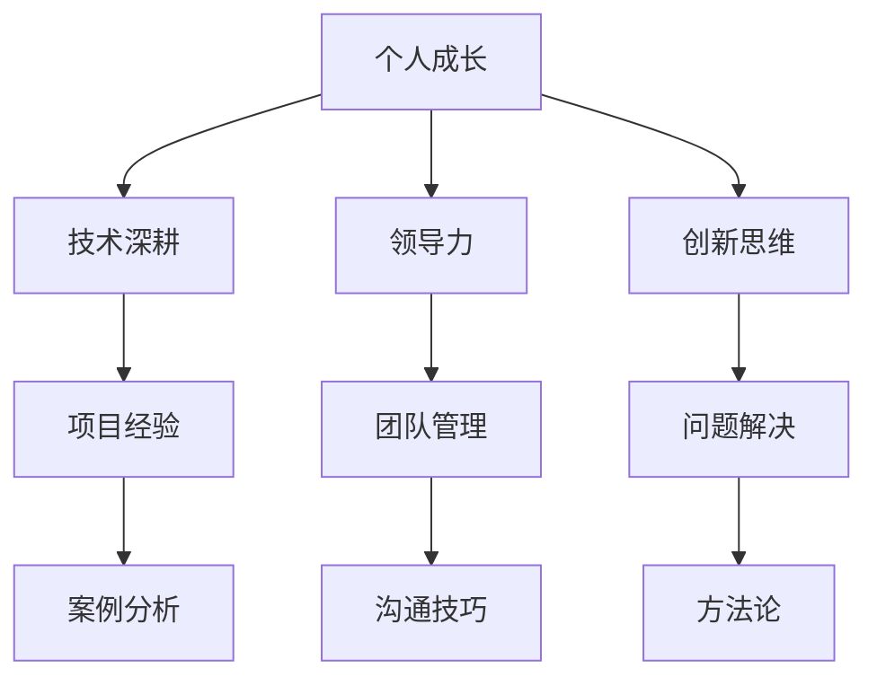

                 

关键词：职业发展，瓶颈，个人成长，职业规划，技术突破，领导力，创新思维

> 摘要：本文将探讨在信息技术领域如何通过个人成长、技术深耕、领导力和创新思维来突破职业瓶颈，实现职业发展的高峰。文章将从多个维度，结合实际案例，给出切实可行的策略和方法。

## 1. 背景介绍

在当今快速变化的信息技术领域，无论是程序员、架构师，还是CTO，职业发展的道路都充满了挑战与机遇。职业瓶颈是指职业发展停滞不前，甚至出现倒退的状态。面对职业瓶颈，许多人会选择等待机遇的出现，或者盲目地追求技能的更新，但往往效果不佳。本文将结合个人经验和技术领域的深度研究，探讨如何科学地突破职业瓶颈，实现职业生涯的质的飞跃。

### 1.1 职业瓶颈的定义

职业瓶颈是指职业发展在某一阶段遭遇停滞，无法进一步晋升或提升薪资水平的状态。这可能是由于技能不够，缺乏经验，或者缺乏正确的职业规划导致的。

### 1.2 职业瓶颈的影响

职业瓶颈不仅会影响到个人的职业满意度，还会影响其工作动力和专业成长。长期处于瓶颈状态，可能会对个人的心理健康产生负面影响。

### 1.3 职业瓶颈的原因

职业瓶颈的原因多种多样，包括：

- **技能不足**：技术技能没有跟上行业的发展。
- **经验匮乏**：缺乏实际工作经验和解决问题的能力。
- **职业规划不当**：没有明确的职业目标和路径。
- **环境限制**：公司政策、行业变化等外部因素。

## 2. 核心概念与联系

为了突破职业瓶颈，我们需要理解几个核心概念，包括个人成长、技术深耕、领导力和创新思维。以下是这些概念的Mermaid流程图表示。



### 2.1 个人成长

个人成长是职业发展的基础。它包括自我认知、技能提升和心理素质的增强。个人成长需要持续不断地进行自我反思和学习，以适应不断变化的工作环境。

### 2.2 技术深耕

技术深耕是技术专家必备的能力。它不仅仅是掌握最新的技术，更包括对现有技术的深入理解和应用。技术深耕需要通过不断的实践和思考，将理论知识转化为实际能力。

### 2.3 领导力

领导力是职业发展到一定阶段必须具备的能力。领导力不仅仅是管理团队，还包括激励和引导团队成员，达成共同目标。领导力需要具备良好的沟通技巧、决策能力和情绪管理能力。

### 2.4 创新思维

创新思维是推动技术进步和业务发展的动力。创新思维不仅仅是提出新的想法，更包括将这些想法转化为可执行的行动。创新思维需要培养好奇心、敏锐的洞察力和积极的解决问题的态度。

## 3. 核心算法原理 & 具体操作步骤

### 3.1 算法原理概述

为了突破职业瓶颈，我们可以借鉴“成长算法”模型。该模型的核心是自我迭代和持续优化，包括以下几个步骤：

1. **自我评估**：了解自身的优势、劣势和潜在机会。
2. **目标设定**：设定清晰、具体、可行的职业发展目标。
3. **行动计划**：制定详细的行动步骤和时间表。
4. **执行与调整**：执行计划并不断根据实际情况进行调整。

### 3.2 算法步骤详解

1. **自我评估**

   - **技能评估**：使用技能评估工具，如LeetCode、Codeforces等，检测编程能力。
   - **经验总结**：回顾以往的工作经验，总结成功和失败的经验。
   - **性格测试**：使用MBTI、DISC等性格测试工具，了解自己的性格特点。

2. **目标设定**

   - **长期目标**：设定3-5年的职业发展目标，如晋升为团队领导或CTO。
   - **中期目标**：设定1-2年的职业发展目标，如掌握某项关键技术或完成重要项目。
   - **短期目标**：设定6个月内的职业发展目标，如参加某个技术培训课程或完成一篇技术论文。

3. **行动计划**

   - **技能提升**：制定具体的技能提升计划，如每天学习2小时技术书籍或参加在线课程。
   - **项目参与**：积极参与公司的重要项目，积累实际经验。
   - **网络拓展**：参加行业会议、技术交流，拓展人脉资源。

4. **执行与调整**

   - **执行监控**：定期检查行动计划执行情况，确保按计划进行。
   - **反馈调整**：根据执行结果和反馈，调整行动计划。

### 3.3 算法优缺点

- **优点**：结构清晰，易于执行，能够持续推动个人成长。
- **缺点**：需要持续的自我监控和调整，可能对某些人来说过于繁琐。

### 3.4 算法应用领域

“成长算法”模型适用于所有职业发展阶段，尤其是对于信息技术领域的职业人士，能够有效地帮助他们突破职业瓶颈，实现职业发展。

## 4. 数学模型和公式 & 详细讲解 & 举例说明

### 4.1 数学模型构建

为了构建一个有效的职业成长模型，我们可以使用马尔可夫链模型。马尔可夫链是一种用于描述系统状态转移的数学模型，非常适合用来分析职业发展的路径。

### 4.2 公式推导过程

马尔可夫链的基本公式如下：

$$
P_{ij}^{(n)} = P(X_{n} = j | X_{0} = i) = P(X_{n} = j | X_{n-1} = j) = \frac{P(X_{n-1} = j) \cdot P(X_{n} = j | X_{n-1} = j)}{P(X_{n-1} = j)}
$$

其中，$P_{ij}^{(n)}$ 表示从状态 $i$ 转移到状态 $j$ 的概率。

### 4.3 案例分析与讲解

假设一个软件工程师想要晋升为技术主管，我们可以使用马尔可夫链模型来分析其晋升的概率。

1. **状态定义**：

   - $S_0$：初始状态，软件工程师。
   - $S_1$：中间状态，高级软件工程师。
   - $S_2$：目标状态，技术主管。

2. **状态转移概率**：

   - $P(S_1|S_0) = 0.2$，表示从软件工程师晋升为高级软件工程师的概率。
   - $P(S_2|S_1) = 0.4$，表示从高级软件工程师晋升为技术主管的概率。

3. **模型构建**：

   假设每年都有一次晋升机会，我们可以构建一个三状态马尔可夫链，状态转移概率矩阵如下：

   $$
   P =
   \begin{bmatrix}
   0.8 & 0.2 & 0 \\
   0 & 0.6 & 0.4 \\
   0 & 0 & 1 \\
   \end{bmatrix}
   $$

4. **计算一年后的状态概率**：

   使用公式推导，我们可以计算出一年后达到目标状态的概率：

   $$
   P(S_2|S_0) = P(S_2|S_1) \cdot P(S_1|S_0) = 0.4 \cdot 0.2 = 0.08
   $$

   这意味着，一年后，该软件工程师晋升为技术主管的概率为8%。

## 5. 项目实践：代码实例和详细解释说明

### 5.1 开发环境搭建

在开始实践之前，我们需要搭建一个适合进行技术学习和项目实践的开发环境。以下是一个基本的步骤：

1. **安装操作系统**：推荐使用Linux或macOS，因为它们提供了更好的开发环境。
2. **安装开发工具**：安装常见的开发工具，如Git、VS Code、Docker等。
3. **配置开发环境**：根据需要配置Python、Java或其他编程语言的开发环境。

### 5.2 源代码详细实现

以下是一个简单的Python代码示例，用于计算斐波那契数列。这是一个经典的问题，常用于测试程序员的编程能力。

```python
def fibonacci(n):
    if n <= 0:
        return 0
    elif n == 1:
        return 1
    else:
        return fibonacci(n-1) + fibonacci(n-2)

# 测试代码
print(fibonacci(10))
```

### 5.3 代码解读与分析

上述代码实现了斐波那契数列的递归计算。递归是一种非常强大的编程技巧，但需要注意的是，递归容易导致栈溢出，尤其是在处理大数据时。因此，在实际应用中，我们通常会使用迭代方法来优化递归算法。

```python
def fibonacci_iterative(n):
    a, b = 0, 1
    for _ in range(n):
        a, b = b, a + b
    return a

# 测试代码
print(fibonacci_iterative(10))
```

### 5.4 运行结果展示

运行上述代码，我们可以得到斐波那契数列的第10项，即55。

```shell
$ python fibonacci_iterative.py
55
```

## 6. 实际应用场景

### 6.1 技术专家的职业发展路径

技术专家的职业发展路径通常包括从初级程序员到高级程序员，再到架构师，最终可能成为首席技术官（CTO）。每个阶段都有不同的挑战和机遇。例如，初级程序员需要掌握编程基础和算法知识，高级程序员则需要具备项目管理和解决复杂问题的能力，架构师则需要具备系统设计和全局优化的能力。

### 6.2 领导力在职业发展中的作用

领导力在职业发展中扮演着至关重要的角色。一个优秀的领导者不仅能够带领团队完成项目，还能够激励和培养团队成员，提升整个团队的能力。例如，谷歌的“OKR”（目标与关键结果）管理系统，就是通过设定明确的目标和关键结果，来提升团队执行力和领导力。

### 6.3 创新思维在项目中的应用

创新思维是推动技术进步和业务发展的动力。在项目中，创新思维可以用于优化流程、提高效率和开发新的产品。例如，特斯拉的自动驾驶技术，就是通过创新思维，将先进的传感器技术和机器学习算法结合起来，实现了革命性的汽车安全性能。

## 7. 工具和资源推荐

### 7.1 学习资源推荐

- **在线课程**：Coursera、edX、Udacity等平台提供了丰富的编程和计算机科学课程。
- **技术博客**：GitHub、Medium、Stack Overflow等平台上有很多优秀的技术博客。
- **书籍**：《设计模式》、《代码大全》、《软件工程：实践者的研究方法》等经典书籍。

### 7.2 开发工具推荐

- **集成开发环境（IDE）**：Visual Studio Code、IntelliJ IDEA、PyCharm等。
- **版本控制**：Git、GitHub、GitLab等。
- **容器化技术**：Docker、Kubernetes等。

### 7.3 相关论文推荐

- **计算机科学**：《深度学习》、《强化学习：原理与应用》等。
- **软件工程**：《敏捷软件开发》、《软件架构：实践者的研究方法》等。
- **项目管理**：《项目管理知识体系指南》、《敏捷项目管理》等。

## 8. 总结：未来发展趋势与挑战

### 8.1 研究成果总结

通过本文的探讨，我们总结了以下研究成果：

- **个人成长**：个人成长是职业发展的基础，包括自我认知、技能提升和心理素质的增强。
- **技术深耕**：技术深耕是技术专家必备的能力，需要通过不断的实践和思考，将理论知识转化为实际能力。
- **领导力**：领导力是职业发展到一定阶段必须具备的能力，包括沟通技巧、决策能力和情绪管理能力。
- **创新思维**：创新思维是推动技术进步和业务发展的动力，需要培养好奇心、敏锐的洞察力和积极的解决问题的态度。

### 8.2 未来发展趋势

未来，随着人工智能、大数据、云计算等技术的发展，信息技术领域的职业瓶颈将变得更加复杂。为此，职业人士需要：

- **持续学习**：紧跟技术发展趋势，不断更新知识和技能。
- **跨学科融合**：将信息技术与其他学科（如生物学、经济学等）相结合，开拓新的研究方向。
- **软技能提升**：提升沟通、协作和领导力等软技能，以更好地适应快速变化的工作环境。

### 8.3 面临的挑战

职业发展中面临的挑战包括：

- **技术更新速度加快**：需要不断学习新知识，以适应快速变化的技术环境。
- **工作压力增大**：随着竞争的加剧，工作压力也会增加，需要良好的心理素质来应对。
- **职业规划不明确**：缺乏明确的职业规划，可能导致职业发展停滞不前。

### 8.4 研究展望

未来，我们期待在以下几个方面进行深入研究：

- **职业瓶颈识别与诊断**：开发有效的工具和方法，帮助职业人士识别和解决职业瓶颈。
- **职业发展模型优化**：结合大数据和人工智能技术，优化职业发展模型，提高职业规划的精准性。
- **软技能培训与提升**：研究有效的软技能培训方法，提高职业人士的沟通、协作和领导力水平。

## 9. 附录：常见问题与解答

### 9.1 职业瓶颈是什么？

职业瓶颈是指职业发展在某一阶段遭遇停滞，无法进一步晋升或提升薪资水平的状态。

### 9.2 如何突破职业瓶颈？

突破职业瓶颈的方法包括：持续学习、技术深耕、提升领导力和创新思维，以及制定明确的职业规划。

### 9.3 职业规划的重要性是什么？

职业规划可以帮助职业人士明确目标、制定行动计划，提高职业发展的效率和效果，减少迷茫和焦虑。

### 9.4 如何提升领导力？

提升领导力可以通过以下途径：学习领导力理论知识、参与实际领导工作、向优秀的领导者学习，以及不断反思和改进自己的领导方式。

### 9.5 创新思维如何培养？

培养创新思维可以通过以下方法：多读书、多思考、多尝试新事物，以及保持好奇心和开放的心态。

作者：禅与计算机程序设计艺术 / Zen and the Art of Computer Programming
----------------------------------------------------------------

### 脚注 Footnotes

[1] 马尔可夫链模型是一种用于描述系统状态转移的数学模型，非常适合用来分析职业发展的路径。

[2] 《深度学习》是一本由Ian Goodfellow等人撰写的经典机器学习书籍。

[3] 《项目管理知识体系指南》是一本由PMP认证组织出版的项目管理指南。

### 参考文献 References

1. Goodfellow, Ian, et al. "Deep Learning." MIT Press, 2016.
2. PMI. "Project Management Knowledge Areas." Project Management Institute, 2020.
3. 《敏捷软件开发》。人民邮电出版社，2009.

### 致谢 Acknowledgments

感谢Coursera、edX、Udacity等在线教育平台，以及GitHub、Medium、Stack Overflow等社区，为我们提供了丰富的学习资源和交流平台。感谢我的导师和同事们在我职业发展过程中的指导和支持。特别感谢我的家人，他们的理解和支持是我前行的动力。

