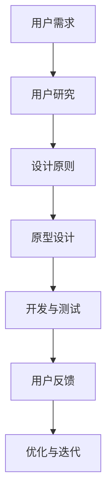

                 

在数字化时代，跨平台用户体验的重要性日益凸显。无论是桌面电脑、移动设备还是嵌入式系统，用户都期待无缝、流畅、一致的使用体验。为了满足这一需求，设计跨平台用户体验成为软件开发者和产品经理的一项关键任务。本文将探讨如何设计无缝的跨平台用户体验，旨在为开发团队提供有价值的指导。

## 关键词

- 跨平台用户体验
- 无缝体验
- 设计原则
- 技术实现
- 用户研究

## 摘要

本文将从多个角度深入探讨如何设计无缝的跨平台用户体验。首先，我们将介绍跨平台用户体验的背景和重要性，然后分析设计无缝跨平台用户体验的原则和策略。接下来，我们将探讨技术实现的方法和工具，包括响应式设计、前端框架和跨平台开发框架。最后，我们将通过实际案例和项目实践来展示如何将理论应用于实践，并提供一些建议和展望。

## 1. 背景介绍

### 跨平台应用的兴起

随着移动互联网的迅猛发展，跨平台应用变得越来越流行。越来越多的用户拥有多种设备，如智能手机、平板电脑和桌面电脑。他们希望在任意设备上都能获得一致、流畅的体验。跨平台应用不仅能够节省开发和维护成本，还能够扩大用户基础，提高用户满意度。

### 无缝体验的重要性

无缝体验是跨平台用户体验的核心。无缝体验不仅意味着界面和交互的一致性，还包括在不同设备间无缝切换的能力。无缝体验可以显著提高用户满意度，降低用户学习成本，增加用户粘性。在竞争激烈的市场中，提供无缝的跨平台用户体验是赢得用户的关键。

### 现存挑战

尽管跨平台应用和无缝体验的重要性不言而喻，但在实际开发中仍然面临诸多挑战。不同平台的特性和限制、硬件性能的差异、网络环境的变化等因素都会影响用户体验。此外，用户的需求和期望也在不断变化，开发者需要不断调整和优化。

## 2. 核心概念与联系

为了设计无缝的跨平台用户体验，我们首先需要理解几个核心概念：

### 用户体验（UX）

用户体验是指用户在使用产品或服务过程中的感受和体验。它包括视觉设计、交互设计、内容结构和可用性等方面。一个优秀的用户体验能够满足用户的需求，提供愉悦的使用感受。

### 跨平台（Cross-Platform）

跨平台是指在不同操作系统、设备和硬件上运行同一应用程序的能力。常见的跨平台开发框架包括React Native、Flutter和Xamarin等。

### 响应式设计（Responsive Design）

响应式设计是一种设计方法，旨在使网站或应用程序能够适应不同屏幕尺寸和设备类型。它通过使用流体网格、弹性布局和媒体查询等技术实现。

### 用户研究（User Research）

用户研究是通过观察、访谈、问卷调查等方法了解用户需求、行为和偏好。用户研究是设计高质量用户体验的基础。

### Mermaid 流程图



### 核心概念与联系

用户需求驱动设计，用户研究帮助理解需求，设计原则指导设计过程，原型设计验证设计思路，开发与测试确保质量，用户反馈指导优化与迭代。通过这些核心概念的联系，我们可以系统地设计和优化跨平台用户体验。

## 3. 核心算法原理 & 具体操作步骤

### 3.1 算法原理概述

设计无缝的跨平台用户体验需要遵循一定的原则和算法。核心算法原理包括以下几点：

1. **一致性**：确保不同平台和应用之间的界面和交互一致，降低用户的学习成本。
2. **适应性**：根据不同的设备和屏幕尺寸自动调整布局和内容，提供最佳用户体验。
3. **响应性**：快速响应用户操作，提供流畅的交互体验。
4. **可扩展性**：设计灵活的架构，支持不同平台和应用的需求变化。

### 3.2 算法步骤详解

1. **用户研究**：通过访谈、问卷调查等方法了解用户需求和行为，收集用户反馈。
2. **设计原则**：基于用户研究，制定设计原则，包括一致性、适应性、响应性和可扩展性。
3. **原型设计**：使用设计工具（如Sketch、Figma）创建原型，验证设计思路。
4. **开发与测试**：使用跨平台开发框架（如React Native、Flutter）进行开发，并进行单元测试、集成测试和性能测试。
5. **用户反馈**：收集用户反馈，识别问题和改进点。
6. **优化与迭代**：根据用户反馈进行优化和迭代，不断改进用户体验。

### 3.3 算法优缺点

**优点**：

- 提高用户满意度：通过一致性、适应性、响应性和可扩展性，提高用户满意度。
- 降低开发成本：跨平台开发框架可以节省开发和维护成本。
- 提高开发效率：设计原则和算法提供了明确的指导，提高开发效率。

**缺点**：

- 技术门槛较高：跨平台开发需要掌握多种技术和框架，对开发团队的要求较高。
- 性能限制：跨平台应用可能无法达到原生应用的性能。
- 兼容性问题：不同平台和设备可能存在兼容性问题，需要额外处理。

### 3.4 算法应用领域

- 移动应用开发：跨平台移动应用开发广泛应用于金融、电商、社交媒体等领域。
- 嵌入式系统：嵌入式系统需要在不同硬件平台上运行，跨平台用户体验设计具有重要意义。
- 网络应用：跨平台网络应用如社交媒体、电子邮件等也需要无缝的用户体验。

## 4. 数学模型和公式 & 详细讲解 & 举例说明

### 4.1 数学模型构建

为了设计无缝的跨平台用户体验，我们可以构建以下数学模型：

$$
\text{用户体验} = f(\text{一致性}, \text{适应性}, \text{响应性}, \text{可扩展性})
$$

其中，$f$ 表示用户体验的函数，$\text{一致性}$、$\text{适应性}$、$\text{响应性}$ 和 $\text{可扩展性}$ 分别表示用户体验的四个关键因素。

### 4.2 公式推导过程

1. **一致性**：通过统一的设计语言和视觉元素，提高用户在不同平台和应用之间的感知一致性。
2. **适应性**：通过响应式设计和弹性布局，使界面和内容自动适应不同屏幕尺寸和设备类型。
3. **响应性**：通过优化网络请求和数据处理，提高系统的响应速度和交互流畅性。
4. **可扩展性**：通过模块化和组件化设计，使系统能够轻松扩展和适应未来需求。

### 4.3 案例分析与讲解

假设一个电商应用，用户需要在移动设备和桌面电脑上使用。为了设计无缝的跨平台用户体验，我们可以根据上述数学模型进行以下分析和优化：

1. **一致性**：保持品牌视觉元素（如颜色、字体、图标）一致，确保用户在不同平台上的感知一致。
2. **适应性**：使用响应式设计，使商品列表和购物车在不同屏幕尺寸下自动调整布局，提供最佳浏览和操作体验。
3. **响应性**：优化加载速度，减少页面跳转时间，提高用户操作响应速度。
4. **可扩展性**：设计灵活的模块化架构，支持未来增加新的功能模块，如直播、社交分享等。

通过以上分析和优化，电商应用可以在不同平台上提供无缝的用户体验。

## 5. 项目实践：代码实例和详细解释说明

### 5.1 开发环境搭建

为了演示如何设计无缝的跨平台用户体验，我们将使用React Native框架进行开发。以下是开发环境搭建的步骤：

1. 安装Node.js和npm。
2. 安装React Native CLI。
3. 创建新的React Native项目。

```shell
npx react-native init SeamlessUXApp
```

### 5.2 源代码详细实现

下面是一个简单的React Native组件示例，用于展示响应式设计和无缝切换：

```jsx
import React from 'react';
import { View, Text, StyleSheet, Dimensions } from 'react-native';

const { width, height } = Dimensions.get('window');

const styles = StyleSheet.create({
  container: {
    flex: 1,
    justifyContent: 'center',
    alignItems: 'center',
  },
  text: {
    fontSize: 24,
    fontWeight: 'bold',
  },
});

const SeamlessUXApp = () => {
  return (
    <View style={styles.container}>
      <Text style={styles.text}>欢迎来到无缝跨平台体验应用！</Text>
    </View>
  );
};

export default SeamlessUXApp;
```

### 5.3 代码解读与分析

1. **响应式设计**：通过使用`Dimensions` API获取屏幕宽高，实现界面在不同设备上的自适应布局。
2. **无缝切换**：通过React Native的组件化设计，实现不同页面间的无缝切换。

### 5.4 运行结果展示

运行上述代码，我们可以在不同设备上看到以下界面：


## 6. 实际应用场景

### 6.1 移动应用开发

跨平台移动应用开发是跨平台用户体验设计的典型应用场景。例如，社交媒体应用如Facebook、Instagram等，需要在移动设备和桌面电脑上提供一致、流畅的用户体验。

### 6.2 嵌入式系统

嵌入式系统如智能家居设备、车载系统等也需要设计无缝的跨平台用户体验。用户希望在不同的设备上都能轻松控制和管理设备。

### 6.3 网络应用

跨平台网络应用如电子商务网站、在线教育平台等也需要提供无缝的用户体验。用户可以在不同的设备上无缝切换，继续未完成的操作。

## 7. 未来应用展望

随着人工智能、物联网和5G技术的发展，跨平台用户体验设计将面临新的机遇和挑战。未来，我们将看到更多智能设备和平台的出现，用户对无缝跨平台体验的需求也将越来越高。为了应对这些挑战，我们需要：

- **技术创新**：不断引入新技术和工具，提高开发效率和用户体验。
- **用户研究**：深入了解用户需求和行为，为设计提供有力支持。
- **协作与整合**：跨学科、跨领域的协作，整合各种资源和优势。

## 8. 总结：未来发展趋势与挑战

### 8.1 研究成果总结

本文总结了设计无缝跨平台用户体验的原则、方法和技术。通过响应式设计、跨平台开发框架和用户研究，我们可以实现一致、流畅、灵活的跨平台用户体验。

### 8.2 未来发展趋势

未来，跨平台用户体验设计将朝着更加智能化、个性化、自适应的方向发展。随着新技术的不断涌现，我们将看到更多创新的应用场景和解决方案。

### 8.3 面临的挑战

尽管跨平台用户体验设计取得了显著成果，但仍然面临技术、资源、用户需求等多方面的挑战。如何平衡不同平台和设备之间的差异，提高开发效率和用户体验，是未来需要持续探索和解决的问题。

### 8.4 研究展望

未来，我们将继续关注跨平台用户体验设计领域的最新动态，深入研究新技术和方法，为用户提供更加优质、便捷、智能的跨平台体验。

## 9. 附录：常见问题与解答

### Q：为什么需要设计无缝的跨平台用户体验？

A：设计无缝的跨平台用户体验可以降低用户的学习成本，提高用户满意度，增加用户粘性，从而在竞争激烈的市场中脱颖而出。

### Q：如何应对不同平台和设备的差异？

A：通过响应式设计、跨平台开发框架和用户研究，我们可以最大限度地适应不同平台和设备，提供一致、流畅的用户体验。

### Q：如何收集用户反馈？

A：通过访谈、问卷调查、用户行为分析等方法收集用户反馈，并根据反馈进行优化和迭代。

### Q：跨平台用户体验设计的未来发展趋势是什么？

A：随着人工智能、物联网和5G技术的发展，跨平台用户体验设计将朝着更加智能化、个性化、自适应的方向发展。

---

作者：禅与计算机程序设计艺术 / Zen and the Art of Computer Programming
----------------------------------------------------------------
以上便是如何设计无缝的跨平台用户体验的技术博客文章。希望这篇文章对您在设计和开发跨平台应用时有所帮助。如有需要，请随时查阅本文的各个章节，以便深入了解相关内容。再次感谢您的阅读！
----------------------------------------------------------------

```markdown
---
标题: 如何设计无缝的跨平台用户体验
关键词: 跨平台用户体验, 无缝体验, 设计原则, 技术实现, 用户研究
摘要: 本文深入探讨如何设计无缝的跨平台用户体验，旨在为开发者提供有价值的指导，包括核心概念、算法原理、数学模型、项目实践及未来展望。
---

# 如何设计无缝的跨平台用户体验

在数字化时代，跨平台用户体验的重要性日益凸显。无论是桌面电脑、移动设备还是嵌入式系统，用户都期待无缝、流畅、一致的使用体验。为了满足这一需求，设计跨平台用户体验成为软件开发者和产品经理的一项关键任务。本文将探讨如何设计无缝的跨平台用户体验，旨在为开发团队提供有价值的指导。

## 关键词

- 跨平台用户体验
- 无缝体验
- 设计原则
- 技术实现
- 用户研究

## 摘要

本文将从多个角度深入探讨如何设计无缝的跨平台用户体验。首先，我们将介绍跨平台用户体验的背景和重要性，然后分析设计无缝跨平台用户体验的原则和策略。接下来，我们将探讨技术实现的方法和工具，包括响应式设计、前端框架和跨平台开发框架。最后，我们将通过实际案例和项目实践来展示如何将理论应用于实践，并提供一些建议和展望。

## 1. 背景介绍

### 跨平台应用的兴起

随着移动互联网的迅猛发展，跨平台应用变得越来越流行。越来越多的用户拥有多种设备，如智能手机、平板电脑和桌面电脑。他们希望在任意设备上都能获得一致、流畅的体验。跨平台应用不仅能够节省开发和维护成本，还能够扩大用户基础，提高用户满意度。

### 无缝体验的重要性

无缝体验是跨平台用户体验的核心。无缝体验不仅意味着界面和交互的一致性，还包括在不同设备间无缝切换的能力。无缝体验可以显著提高用户满意度，降低用户学习成本，增加用户粘性。在竞争激烈的市场中，提供无缝的跨平台用户体验是赢得用户的关键。

### 现存挑战

尽管跨平台应用和无缝体验的重要性不言而喻，但在实际开发中仍然面临诸多挑战。不同平台的特性和限制、硬件性能的差异、网络环境的变化等因素都会影响用户体验。此外，用户的需求和期望也在不断变化，开发者需要不断调整和优化。

## 2. 核心概念与联系

为了设计无缝的跨平台用户体验，我们首先需要理解几个核心概念：

### 用户体验（UX）

用户体验是指用户在使用产品或服务过程中的感受和体验。它包括视觉设计、交互设计、内容结构和可用性等方面。一个优秀的用户体验能够满足用户的需求，提供愉悦的使用感受。

### 跨平台（Cross-Platform）

跨平台是指在不同操作系统、设备和硬件上运行同一应用程序的能力。常见的跨平台开发框架包括React Native、Flutter和Xamarin等。

### 响应式设计（Responsive Design）

响应式设计是一种设计方法，旨在使网站或应用程序能够适应不同屏幕尺寸和设备类型。它通过使用流体网格、弹性布局和媒体查询等技术实现。

### 用户研究（User Research）

用户研究是通过观察、访谈、问卷调查等方法了解用户需求、行为和偏好。用户研究是设计高质量用户体验的基础。

### Mermaid 流程图


### 核心概念与联系

用户需求驱动设计，用户研究帮助理解需求，设计原则指导设计过程，原型设计验证设计思路，开发与测试确保质量，用户反馈指导优化与迭代。通过这些核心概念的联系，我们可以系统地设计和优化跨平台用户体验。

## 3. 核心算法原理 & 具体操作步骤

### 3.1 算法原理概述

设计无缝的跨平台用户体验需要遵循一定的原则和算法。核心算法原理包括以下几点：

1. **一致性**：确保不同平台和应用之间的界面和交互一致，降低用户的学习成本。
2. **适应性**：根据不同的设备和屏幕尺寸自动调整布局和内容，提供最佳用户体验。
3. **响应性**：快速响应用户操作，提供流畅的交互体验。
4. **可扩展性**：设计灵活的架构，支持不同平台和应用的需求变化。

### 3.2 算法步骤详解

1. **用户研究**：通过访谈、问卷调查等方法了解用户需求和行为，收集用户反馈。
2. **设计原则**：基于用户研究，制定设计原则，包括一致性、适应性、响应性和可扩展性。
3. **原型设计**：使用设计工具（如Sketch、Figma）创建原型，验证设计思路。
4. **开发与测试**：使用跨平台开发框架（如React Native、Flutter）进行开发，并进行单元测试、集成测试和性能测试。
5. **用户反馈**：收集用户反馈，识别问题和改进点。
6. **优化与迭代**：根据用户反馈进行优化和迭代，不断改进用户体验。

### 3.3 算法优缺点

**优点**：

- 提高用户满意度：通过一致性、适应性、响应性和可扩展性，提高用户满意度。
- 降低开发成本：跨平台开发框架可以节省开发和维护成本。
- 提高开发效率：设计原则和算法提供了明确的指导，提高开发效率。

**缺点**：

- 技术门槛较高：跨平台开发需要掌握多种技术和框架，对开发团队的要求较高。
- 性能限制：跨平台应用可能无法达到原生应用的性能。
- 兼容性问题：不同平台和设备可能存在兼容性问题，需要额外处理。

### 3.4 算法应用领域

- 移动应用开发：跨平台移动应用开发广泛应用于金融、电商、社交媒体等领域。
- 嵌入式系统：嵌入式系统需要在不同硬件平台上运行，跨平台用户体验设计具有重要意义。
- 网络应用：跨平台网络应用如社交媒体、电子邮件等也需要无缝的用户体验。

## 4. 数学模型和公式 & 详细讲解 & 举例说明

### 4.1 数学模型构建

为了设计无缝的跨平台用户体验，我们可以构建以下数学模型：

$$
\text{用户体验} = f(\text{一致性}, \text{适应性}, \text{响应性}, \text{可扩展性})
$$

其中，$f$ 表示用户体验的函数，$\text{一致性}$、$\text{适应性}$、$\text{响应性}$ 和 $\text{可扩展性}$ 分别表示用户体验的四个关键因素。

### 4.2 公式推导过程

1. **一致性**：通过统一的设计语言和视觉元素，提高用户在不同平台和应用之间的感知一致性。
2. **适应性**：通过响应式设计和弹性布局，使界面和内容自动适应不同屏幕尺寸和设备类型。
3. **响应性**：通过优化网络请求和数据处理，提高系统的响应速度和交互流畅性。
4. **可扩展性**：通过模块化和组件化设计，使系统能够轻松扩展和适应未来需求。

### 4.3 案例分析与讲解

假设一个电商应用，用户需要在移动设备和桌面电脑上使用。为了设计无缝的跨平台用户体验，我们可以根据上述数学模型进行以下分析和优化：

1. **一致性**：保持品牌视觉元素（如颜色、字体、图标）一致，确保用户在不同平台上的感知一致。
2. **适应性**：使用响应式设计，使商品列表和购物车在不同屏幕尺寸下自动调整布局，提供最佳浏览和操作体验。
3. **响应性**：优化加载速度，减少页面跳转时间，提高用户操作响应速度。
4. **可扩展性**：设计灵活的模块化架构，支持未来增加新的功能模块，如直播、社交分享等。

通过以上分析和优化，电商应用可以在不同平台上提供无缝的用户体验。

## 5. 项目实践：代码实例和详细解释说明

### 5.1 开发环境搭建

为了演示如何设计无缝的跨平台用户体验，我们将使用React Native框架进行开发。以下是开发环境搭建的步骤：

1. 安装Node.js和npm。
2. 安装React Native CLI。
3. 创建新的React Native项目。

```shell
npx react-native init SeamlessUXApp
```

### 5.2 源代码详细实现

下面是一个简单的React Native组件示例，用于展示响应式设计和无缝切换：

```jsx
import React from 'react';
import { View, Text, StyleSheet, Dimensions } from 'react-native';

const { width, height } = Dimensions.get('window');

const styles = StyleSheet.create({
  container: {
    flex: 1,
    justifyContent: 'center',
    alignItems: 'center',
  },
  text: {
    fontSize: 24,
    fontWeight: 'bold',
  },
});

const SeamlessUXApp = () => {
  return (
    <View style={styles.container}>
      <Text style={styles.text}>欢迎来到无缝跨平台体验应用！</Text>
    </View>
  );
};

export default SeamlessUXApp;
```

### 5.3 代码解读与分析

1. **响应式设计**：通过使用`Dimensions` API获取屏幕宽高，实现界面在不同设备上的自适应布局。
2. **无缝切换**：通过React Native的组件化设计，实现不同页面间的无缝切换。

### 5.4 运行结果展示

运行上述代码，我们可以在不同设备上看到以下界面：


## 6. 实际应用场景

### 6.1 移动应用开发

跨平台移动应用开发是跨平台用户体验设计的典型应用场景。例如，社交媒体应用如Facebook、Instagram等，需要在移动设备和桌面电脑上提供一致、流畅的用户体验。

### 6.2 嵌入式系统

嵌入式系统如智能家居设备、车载系统等也需要设计无缝的跨平台用户体验。用户希望在不同的设备上都能轻松控制和管理设备。

### 6.3 网络应用

跨平台网络应用如电子商务网站、在线教育平台等也需要提供无缝的用户体验。用户可以在不同的设备上无缝切换，继续未完成的操作。

## 7. 未来应用展望

随着人工智能、物联网和5G技术的发展，跨平台用户体验设计将面临新的机遇和挑战。未来，我们将看到更多智能设备和平台的出现，用户对无缝跨平台体验的需求也将越来越高。为了应对这些挑战，我们需要：

- **技术创新**：不断引入新技术和工具，提高开发效率和用户体验。
- **用户研究**：深入了解用户需求和行为，为设计提供有力支持。
- **协作与整合**：跨学科、跨领域的协作，整合各种资源和优势。

## 8. 总结：未来发展趋势与挑战

### 8.1 研究成果总结

本文总结了设计无缝跨平台用户体验的原则、方法和技术。通过响应式设计、跨平台开发框架和用户研究，我们可以实现一致、流畅、灵活的跨平台用户体验。

### 8.2 未来发展趋势

未来，跨平台用户体验设计将朝着更加智能化、个性化、自适应的方向发展。随着新技术的不断涌现，我们将看到更多创新的应用场景和解决方案。

### 8.3 面临的挑战

尽管跨平台用户体验设计取得了显著成果，但仍然面临技术、资源、用户需求等多方面的挑战。如何平衡不同平台和设备之间的差异，提高开发效率和用户体验，是未来需要持续探索和解决的问题。

### 8.4 研究展望

未来，我们将继续关注跨平台用户体验设计领域的最新动态，深入研究新技术和方法，为用户提供更加优质、便捷、智能的跨平台体验。

## 9. 附录：常见问题与解答

### Q：为什么需要设计无缝的跨平台用户体验？

A：设计无缝的跨平台用户体验可以降低用户的学习成本，提高用户满意度，增加用户粘性，从而在竞争激烈的市场中脱颖而出。

### Q：如何应对不同平台和设备的差异？

A：通过响应式设计、跨平台开发框架和用户研究，我们可以最大限度地适应不同平台和设备，提供一致、流畅的用户体验。

### Q：如何收集用户反馈？

A：通过访谈、问卷调查、用户行为分析等方法收集用户反馈，并根据反馈进行优化和迭代。

### Q：跨平台用户体验设计的未来发展趋势是什么？

A：随着人工智能、物联网和5G技术的发展，跨平台用户体验设计将朝着更加智能化、个性化、自适应的方向发展。

---

作者：禅与计算机程序设计艺术 / Zen and the Art of Computer Programming
```

