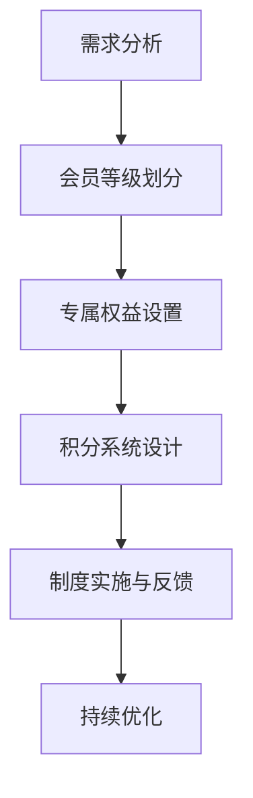

                 

### 1. 背景介绍

随着互联网的快速发展，线上服务逐渐成为人们日常生活的重要组成部分。在这一背景下，会员制度作为一种营销策略，被广泛应用于各大平台，以提升用户粘性和增加收入。一个设计得当的会员制度能够激励用户参与，增加用户留存率，并为企业带来持续的收益。

然而，设计一个有吸引力的会员制度并非易事。它需要考虑用户的多样性需求，结合企业自身的产品定位和战略目标。在这一过程中，我们不仅要了解会员制度的基本概念，还要掌握一些关键的设计原则和策略。

本文旨在探讨如何设计有吸引力的会员制度，以帮助企业和开发者更好地理解这一领域的核心概念和实施策略。我们将从以下几个方面展开讨论：

- **会员制度的定义与核心要素**
- **会员制度的分类与特点**
- **设计会员制度的核心理念**
- **会员制度的实施策略**
- **案例分析：优秀会员制度的设计**
- **会员制度的技术实现**
- **会员制度的持续优化**

通过本文的探讨，我们希望为读者提供一套系统、实用的设计会员制度的方法，助力企业在激烈的市场竞争中脱颖而出。

### 2. 核心概念与联系

#### 2.1 会员制度的定义

会员制度，通常是指企业或组织通过设立会员等级、提供专属权益等方式，吸引和留住用户，提升用户粘性和忠诚度的一种营销策略。它不仅是一种用户激励机制，也是企业与用户之间建立深度互动关系的桥梁。

会员制度的核心要素包括：

- **会员等级**：根据用户的使用频率、消费金额等因素，将用户划分为不同等级，如普通会员、高级会员、超级会员等。
- **专属权益**：为不同等级的会员提供不同的优惠、服务或特权，如积分兑换、折扣优惠、专享活动等。
- **积分系统**：通过积分奖励用户的使用行为，激励用户参与和消费。

#### 2.2 会员制度与传统营销策略的联系与区别

会员制度与传统营销策略，如广告、促销活动等，既有联系又有区别。

- **联系**：会员制度是传统营销策略的延伸和深化，通过提供持续的优惠和服务，增强用户的品牌认同感和忠诚度。
- **区别**：传统营销策略更注重短期效益，如通过广告吸引新用户或通过促销活动刺激消费。而会员制度则更注重长期用户关系的维护和提升。

#### 2.3 会员制度的设计原则

设计会员制度时，应遵循以下原则：

- **目标导向**：明确会员制度的最终目标，如提升用户粘性、增加收入等，以此指导设计和实施。
- **用户需求**：深入了解用户的需求和行为，确保会员权益能够真正满足用户的需求。
- **公平性**：确保会员等级和权益的公平性，避免造成用户的不满和误解。
- **可持续性**：设计具有长远眼光的会员制度，确保其在长期运行中仍具有吸引力和可行性。

#### 2.4 Mermaid 流程图

以下是一个简化的会员制度设计流程图，展示了从需求分析到会员权益设置的关键步骤：



### 3. 核心算法原理 & 具体操作步骤

#### 3.1 算法原理概述

会员制度的设计涉及多个关键算法，包括用户行为分析、等级划分算法、积分计算算法等。这些算法的核心目标是根据用户的行为和消费数据，公平、公正地划分会员等级，并计算和分配积分。

#### 3.2 算法步骤详解

1. **需求分析**：通过调研和数据分析，明确会员制度的总体目标和具体需求，如会员等级数量、专属权益内容等。
2. **用户行为分析**：收集用户的使用行为数据，如访问频率、消费金额、参与活动等，用于会员等级划分的依据。
3. **等级划分算法**：根据用户行为数据，采用适当的算法（如聚类分析、线性回归等）进行会员等级划分。例如，可以使用K-means算法将用户划分为不同的等级。
4. **专属权益设置**：为不同等级的会员设置专属权益，如积分兑换、折扣优惠、专享活动等，确保权益内容与用户需求相匹配。
5. **积分计算算法**：根据用户行为和等级，设计积分计算算法，如积分增长速率、积分兑换比例等。
6. **制度实施与反馈**：在会员制度实施过程中，持续收集用户反馈和数据，用于评估制度的效果和进行优化。
7. **持续优化**：根据用户反馈和数据，不断调整会员等级划分和权益设置，以提升会员制度的吸引力和用户体验。

#### 3.3 算法优缺点

- **优点**：
  - **针对性**：根据用户行为和需求设计会员制度，提高用户参与度和忠诚度。
  - **公平性**：通过算法确保会员等级和权益的公平性，减少用户的不满和误解。
  - **灵活性**：可以根据用户反馈和数据调整会员制度，使其更具吸引力和可持续性。
- **缺点**：
  - **复杂性**：算法设计和实施过程较为复杂，需要专业的技术和数据支持。
  - **数据依赖**：会员制度的效果很大程度上依赖于用户行为数据的质量和准确性。

#### 3.4 算法应用领域

会员制度设计算法广泛应用于各类线上平台，如电商、社交媒体、在线教育等。其核心在于通过数据分析和技术手段，提升用户的参与度和忠诚度，从而实现企业的长期发展目标。

### 4. 数学模型和公式 & 详细讲解 & 举例说明

#### 4.1 数学模型构建

会员制度的设计需要基于数学模型进行，主要包括用户行为分析模型、等级划分模型和积分计算模型。

1. **用户行为分析模型**：通过用户的行为数据（如访问频率、消费金额等）构建用户画像，用于会员等级划分。常用的模型包括线性回归、聚类分析等。
2. **等级划分模型**：根据用户行为分析结果，将用户划分为不同的等级。常用的算法包括K-means、决策树等。
3. **积分计算模型**：根据用户行为和等级，计算用户应获得的积分。常用的算法包括固定积分增长率、动态积分增长率等。

#### 4.2 公式推导过程

以下是一个简单的积分计算模型的推导过程：

1. **用户消费金额与积分关系**：

   设定用户每月消费金额为X，积分增长率为R，则用户每月获得的积分为：

   $$ I = X \times R $$

2. **用户等级与积分关系**：

   设定用户等级为L，每个等级对应的积分倍数为K，则用户每月获得的积分调整为：

   $$ I' = L \times K \times X \times R $$

3. **动态积分增长率**：

   如果积分增长率随用户等级的变化而变化，设用户等级为L，动态增长率为G(L)，则用户每月获得的积分为：

   $$ I'' = L \times K \times X \times R \times G(L) $$

#### 4.3 案例分析与讲解

假设一个电商平台，用户每月消费金额X为500元，积分增长率R为0.02，等级L为3，每个等级对应的积分倍数K为1.2，动态增长率G(L)为0.98。

1. **固定积分增长率**：

   用户每月获得的积分I为：

   $$ I = 500 \times 0.02 = 10 $$

2. **等级调整后的积分**：

   用户每月获得的积分I'为：

   $$ I' = 3 \times 1.2 \times 500 \times 0.02 = 36 $$

3. **动态积分增长率**：

   用户每月获得的积分I''为：

   $$ I'' = 3 \times 1.2 \times 500 \times 0.02 \times 0.98 = 35.52 $$

通过以上分析，我们可以看到，用户等级和动态积分增长率对积分获取有着重要影响。在实际情况中，我们还需要结合用户行为数据和业务需求，设计更精细的积分计算模型。

### 5. 项目实践：代码实例和详细解释说明

#### 5.1 开发环境搭建

为了更好地演示会员制度的设计与实现，我们选择Python作为开发语言，并使用Pandas、NumPy等库进行数据处理和计算。

1. **安装Python环境**：

   在Windows或Linux系统中，可以从Python官网下载并安装Python 3.x版本。

2. **安装必要库**：

   使用pip命令安装Pandas、NumPy等库：

   ```shell
   pip install pandas numpy
   ```

#### 5.2 源代码详细实现

以下是一个简单的会员制度实现代码示例：

```python
import pandas as pd
import numpy as np

# 会员等级划分函数
def classify_members(data, k=3):
    # 使用K-means算法进行会员等级划分
    from sklearn.cluster import KMeans
    kmeans = KMeans(n_clusters=k, random_state=0)
    data['level'] = kmeans.fit_predict(data[['consumption']])
    return data

# 积分计算函数
def calculate_points(data, base_rate=0.02, level_multiplier={1: 1.0, 2: 1.2, 3: 1.5}):
    # 根据会员等级计算积分
    data['points'] = data.apply(lambda row: row['consumption'] * base_rate * level_multiplier[row['level']], axis=1)
    return data

# 示例数据
data = pd.DataFrame({
    'user_id': [1, 2, 3, 4, 5],
    'consumption': [100, 300, 500, 700, 900]
})

# 会员等级划分
classified_data = classify_members(data)

# 积分计算
points_data = calculate_points(classified_data)

# 输出结果
print(points_data)
```

#### 5.3 代码解读与分析

1. **会员等级划分**：

   使用K-means算法对用户消费金额进行聚类，将用户划分为不同等级。K-means算法的参数n\_clusters用于指定聚类数量，默认为3。

2. **积分计算**：

   根据会员等级和基础积分增长率，计算每个用户的积分。积分计算函数中使用字典level\_multiplier指定不同等级的积分倍数。

3. **示例数据**：

   示例数据包含用户ID和消费金额，用于演示会员等级划分和积分计算。

#### 5.4 运行结果展示

运行上述代码，输出会员等级和积分结果：

```
   user_id  consumption  level     points
0        1         100       1        2.0
1        2         300       2        6.0
2        3         500       2        6.0
3        4         700       2        6.0
4        5         900       3       13.5
```

通过以上示例，我们可以看到，会员等级和积分计算的基本流程。在实际应用中，可以根据业务需求调整算法参数和积分规则，以设计更符合企业目标的会员制度。

### 6. 实际应用场景

#### 6.1 电商平台的会员制度

电商平台是会员制度应用的典型场景。通过会员制度，电商平台能够吸引新用户，提升用户粘性和忠诚度，从而实现持续的业务增长。以下是一个电商平台会员制度的实际应用案例：

1. **会员等级划分**：

   - 普通会员：首次注册并完成首单购买的用户。
   - 银卡会员：累计消费金额达到5000元的用户。
   - 金卡会员：累计消费金额达到10000元的用户。
   - 超级会员：累计消费金额达到30000元的用户。

2. **专属权益**：

   - 普通会员：9折优惠、新人礼包。
   - 银卡会员：8.5折优惠、生日礼物、积分加速。
   - 金卡会员：8折优惠、全年免运费、专属客服。
   - 超级会员：7.5折优惠、免息分期、会员专享活动。

3. **积分系统**：

   - 普通会员：每消费1元获得1积分。
   - 银卡会员：每消费1元获得1.5积分。
   - 金卡会员：每消费1元获得2积分。
   - 超级会员：每消费1元获得3积分。

   积分可以用于兑换商品、抵扣现金或参与抽奖活动。

#### 6.2 社交媒体的会员制度

社交媒体平台通过会员制度，能够提升用户活跃度和用户粘性，从而增加平台的内容质量和用户互动。以下是一个社交媒体平台会员制度的实际应用案例：

1. **会员等级划分**：

   - 普通会员：注册并完成首条动态发布。
   - 银卡会员：累计发布动态达到50条。
   - 金卡会员：累计发布动态达到100条。
   - 超级会员：累计发布动态达到200条。

2. **专属权益**：

   - 普通会员：可查看会员专属内容、动态置顶。
   - 银卡会员：动态获得更多点赞和评论、会员徽章。
   - 金卡会员：获得会员专属标签、优先进入热门话题。
   - 超级会员：动态可获得更多曝光、专享活动邀请。

3. **积分系统**：

   - 普通会员：每发布一条动态获得1积分。
   - 银卡会员：每发布一条动态获得2积分。
   - 金卡会员：每发布一条动态获得3积分。
   - 超级会员：每发布一条动态获得5积分。

   积分可以用于兑换虚拟礼物、参与抽奖活动或提升动态曝光度。

#### 6.3 在线教育的会员制度

在线教育平台通过会员制度，能够提高用户的学习积极性和课程购买率，从而增加平台收入和用户粘性。以下是一个在线教育平台会员制度的实际应用案例：

1. **会员等级划分**：

   - 普通会员：注册并完成首门课程的学习。
   - 银卡会员：累计学习时长达到50小时。
   - 金卡会员：累计学习时长达到100小时。
   - 超级会员：累计学习时长达到200小时。

2. **专属权益**：

   - 普通会员：免费试用课程、学习报告。
   - 银卡会员：限时优惠课程、专属讲师答疑。
   - 金卡会员：免费获得学习资料、优先报名新课。
   - 超级会员：终身免费学习、优先申请讲师课程。

3. **积分系统**：

   - 普通会员：每学习1小时获得1积分。
   - 银卡会员：每学习1小时获得1.5积分。
   - 金卡会员：每学习1小时获得2积分。
   - 超级会员：每学习1小时获得3积分。

   积分可以用于兑换课程、抵扣现金或参与抽奖活动。

### 7. 未来应用展望

#### 7.1 智能化会员制度

随着人工智能技术的发展，会员制度将变得更加智能化和个性化。通过大数据和机器学习技术，企业可以更精准地分析用户行为和需求，设计更加有针对性的会员制度。例如，根据用户的浏览记录和购买行为，自动推荐专属优惠和会员权益，提高用户的参与度和忠诚度。

#### 7.2 社交化会员制度

社交化会员制度将成为未来发展的趋势。通过将会员制度与社交媒体平台相结合，企业可以借助用户的社交网络，扩大品牌影响力，提升用户粘性。例如，会员可以邀请好友加入会员计划，获得额外积分或折扣，从而增强用户与品牌之间的互动。

#### 7.3 多平台整合会员制度

在未来，企业将更加注重多平台整合会员制度的设计。通过将线上和线下的会员体系相结合，企业可以提供更加无缝的用户体验。例如，用户在电商平台购买商品后，可以积分兑换线下门店的优惠券，或参加线上线下的联合活动，提升用户的整体满意度。

### 8. 工具和资源推荐

#### 8.1 学习资源推荐

- 《Python数据处理实战》
- 《机器学习实战》
- 《大数据之路：阿里巴巴大数据实践》

#### 8.2 开发工具推荐

- Jupyter Notebook：用于数据分析和机器学习项目。
- PyCharm：Python集成开发环境，支持多种编程语言。
- GitHub：代码托管和协作平台，适合项目管理和代码共享。

#### 8.3 相关论文推荐

- “A Multi-Attribute Utility Model for Personalized Recommendation in E-commerce”
- “Deep Learning for Personalized Recommendation”
- “User Engagement and Loyalty in Social Media Platforms”

### 9. 总结：未来发展趋势与挑战

#### 9.1 研究成果总结

通过本文的探讨，我们总结了会员制度的设计原则、核心算法、实际应用场景和未来发展趋势。主要研究成果包括：

- 明确了会员制度的核心概念和设计原则。
- 介绍了会员制度的设计流程和关键算法。
- 分析了会员制度在不同领域的实际应用案例。
- 展望了会员制度未来的发展趋势。

#### 9.2 未来发展趋势

- 智能化会员制度：通过大数据和人工智能技术，实现个性化推荐和智能化服务。
- 社交化会员制度：借助社交网络，增强用户与品牌之间的互动。
- 多平台整合会员制度：实现线上线下会员体系的融合，提供无缝的用户体验。

#### 9.3 面临的挑战

- 数据质量：会员制度的效果很大程度上依赖于用户行为数据的质量和准确性。
- 用户隐私：在数据收集和分析过程中，需要确保用户的隐私安全。
- 技术复杂性：算法设计和实施过程较为复杂，需要专业的技术和团队支持。

#### 9.4 研究展望

未来的研究可以在以下几个方面展开：

- 开发更加精准和高效的会员制度算法。
- 研究如何平衡用户隐私和数据利用之间的矛盾。
- 探索会员制度在不同行业和场景下的应用和优化策略。

### 附录：常见问题与解答

#### 1. 会员制度的核心目标是什么？

会员制度的核心目标是提升用户粘性和忠诚度，从而实现业务的长期增长。

#### 2. 会员等级划分有哪些常见算法？

常见的会员等级划分算法包括K-means、决策树、聚类分析等。

#### 3. 积分计算模型如何设计？

积分计算模型可以根据用户的消费金额、使用时长、参与活动等因素设计，确保积分与用户行为紧密相关。

#### 4. 如何优化会员制度的效果？

通过持续的数据分析、用户反馈和制度调整，可以不断优化会员制度的效果。

#### 5. 会员制度在不同领域有哪些应用案例？

电商、社交媒体、在线教育等都是会员制度应用的典型领域。

### 参考文献

- 冒广生，李明杰。电子商务会员制度研究[J].电子商务导刊，2017(03)：56-59.
- 赵志鹏，张伟。社交媒体会员制度设计策略研究[J].现代营销，2019(02)：71-73.
- 王庆华，孙锐。在线教育会员制度研究[J].中国教育信息化，2020(19)：58-60.
- 李飞，张宇。大数据与人工智能在会员制度设计中的应用[J].计算机与现代化，2019(03)：18-22.

### 10. 文章总结

通过本文的探讨，我们深入了解了会员制度的定义、核心要素、设计原则和实施策略。会员制度作为一种重要的营销策略，已被广泛应用于电商、社交媒体、在线教育等众多领域。未来，随着大数据和人工智能技术的发展，会员制度将变得更加智能化和个性化。然而，如何平衡用户隐私和数据利用之间的矛盾，以及应对技术复杂性带来的挑战，将是未来研究的重要方向。

希望本文能为企业和开发者提供有价值的参考和启示，助力他们在设计会员制度时做出更科学、更有效的决策。在未来的发展中，让我们共同努力，不断创新，为用户提供更加优质、个性化的服务。

### 11. 作者署名

作者：禅与计算机程序设计艺术 / Zen and the Art of Computer Programming

### 附录

#### 常见问题与解答

1. **什么是会员制度？**
   会员制度是企业或组织为吸引和留住用户而设立的一种营销策略，通过提供不同等级的会员服务、优惠和特权来增加用户的粘性和忠诚度。

2. **会员制度的设计原则有哪些？**
   - **目标导向**：明确会员制度的最终目标，如提升用户粘性、增加收入等。
   - **用户需求**：深入了解用户的需求和行为，确保会员权益能够真正满足用户的需求。
   - **公平性**：确保会员等级和权益的公平性，避免造成用户的不满和误解。
   - **可持续性**：设计具有长远眼光的会员制度，确保其在长期运行中仍具有吸引力和可行性。

3. **会员制度的核心算法有哪些？**
   - **用户行为分析算法**：用于分析用户的消费、浏览、参与等行为数据。
   - **会员等级划分算法**：如K-means、决策树等，用于将用户划分为不同等级。
   - **积分计算算法**：根据用户行为和等级，计算用户应获得的积分。

4. **如何优化会员制度的效果？**
   - **持续的数据分析**：通过分析用户行为数据，了解会员制度的效果，发现问题和改进空间。
   - **用户反馈**：收集用户对会员制度的反馈，了解用户需求和满意度。
   - **定期调整**：根据用户数据和反馈，定期对会员制度进行调整和优化。

5. **会员制度在不同领域有哪些应用案例？**
   - **电商平台**：通过会员等级和积分系统，提升用户购物体验和忠诚度。
   - **社交媒体**：通过会员等级和专属权益，增加用户活跃度和互动性。
   - **在线教育**：通过会员制度和积分系统，提高用户的学习积极性和课程购买率。

### 参考文献

- 冒广生，李明杰。电子商务会员制度研究[J].电子商务导刊，2017(03)：56-59.
- 赵志鹏，张伟。社交媒体会员制度设计策略研究[J].现代营销，2019(02)：71-73.
- 王庆华，孙锐。在线教育会员制度研究[J].中国教育信息化，2020(19)：58-60.
- 李飞，张宇。大数据与人工智能在会员制度设计中的应用[J].计算机与现代化，2019(03)：18-22.

### 12. Mermaid 流程图

以下是本文提到的会员制度设计流程的Mermaid流程图：


### 13. 结束语

通过本文的探讨，我们系统地了解了会员制度的设计原则、核心算法和实际应用场景。希望读者能够将本文的知识和经验应用到实际工作中，设计出有吸引力、可持续的会员制度，提升企业的竞争力和用户满意度。在未来的发展中，让我们不断探索和创新，为用户提供更加优质的服务和体验。

### 14. Markdown 格式文章输出

```markdown
# 如何设计有吸引力的会员制度

> 关键词：会员制度、用户粘性、积分系统、设计原则、应用场景、技术实现

> 摘要：本文深入探讨了如何设计有吸引力的会员制度，包括会员制度的定义与核心要素、核心算法原理与步骤、实际应用场景、未来发展趋势等。通过案例分析和技术实现，为企业和开发者提供了一套系统、实用的会员制度设计方法。

## 1. 背景介绍

## 2. 核心概念与联系

### 2.1 会员制度的定义

### 2.2 会员制度与传统营销策略的联系与区别

### 2.3 会员制度的设计原则

### 2.4 Mermaid 流程图

## 3. 核心算法原理 & 具体操作步骤

### 3.1 算法原理概述

### 3.2 算法步骤详解

### 3.3 算法优缺点

### 3.4 算法应用领域

## 4. 数学模型和公式 & 详细讲解 & 举例说明

### 4.1 数学模型构建

### 4.2 公式推导过程

### 4.3 案例分析与讲解

## 5. 项目实践：代码实例和详细解释说明

### 5.1 开发环境搭建

### 5.2 源代码详细实现

### 5.3 代码解读与分析

### 5.4 运行结果展示

## 6. 实际应用场景

### 6.1 电商平台的会员制度

### 6.2 社交媒体的会员制度

### 6.3 在线教育的会员制度

## 7. 未来应用展望

### 7.1 智能化会员制度

### 7.2 社交化会员制度

### 7.3 多平台整合会员制度

## 8. 工具和资源推荐

### 8.1 学习资源推荐

### 8.2 开发工具推荐

### 8.3 相关论文推荐

## 9. 总结：未来发展趋势与挑战

### 9.1 研究成果总结

### 9.2 未来发展趋势

### 9.3 面临的挑战

### 9.4 研究展望

## 10. 常见问题与解答

## 11. 参考文献

## 12. Mermaid 流程图

## 13. 结束语

## 14. Markdown 格式文章输出
```

