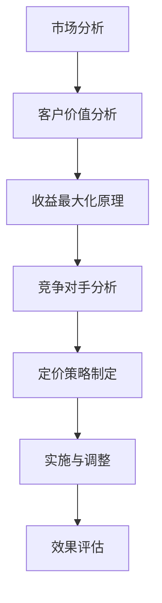

                 

关键词：定价模型、收益最大化、客户价值、市场竞争、动态定价策略

> 摘要：本文将探讨如何设计具有吸引力的定价模型，通过分析市场、客户需求和算法原理，提供一系列实际可操作的步骤和实例。定价不仅影响企业的收入，更关系到品牌形象和市场占有率。本文旨在为企业在激烈的市场竞争中提供指导，帮助实现收益最大化和客户价值的提升。

## 1. 背景介绍

### 1.1 定价模型的重要性

在商业运营中，定价策略是决定企业成功与否的关键因素之一。合理的定价模型不仅能确保企业获得最大化的收益，还能有效提升客户满意度和品牌价值。不当的定价策略可能导致市场份额的流失、客户信任的降低，甚至企业的倒闭。

### 1.2 市场需求与竞争环境

随着互联网和大数据技术的发展，市场环境发生了翻天覆地的变化。消费者对产品和服务的要求越来越高，市场竞争也愈发激烈。企业必须不断调整定价策略，以适应市场变化，保持竞争优势。

### 1.3 为什么要设计有吸引力的定价模型

有吸引力的定价模型不仅能吸引更多客户，还能提高客户忠诚度，增加复购率。通过设计合理的定价模型，企业可以实现以下目标：

- 提高收益：通过精确计算和优化定价策略，实现收益最大化。
- 增强竞争力：灵活的定价策略有助于企业在竞争激烈的市场中脱颖而出。
- 提升客户满意度：合理的定价能更好地满足客户需求，提高客户满意度。

## 2. 核心概念与联系

### 2.1 收益最大化原理

收益最大化是定价模型的核心目标。企业需要通过合理设定价格，使总收益达到最大。收益最大化原理涉及多个变量，如成本、需求、竞争对手策略等。

### 2.2 客户价值分析

客户价值是指客户对企业产品或服务的认可程度。定价模型设计需要充分考虑客户价值，以提供有竞争力的价格，同时确保企业获得合理利润。

### 2.3 市场竞争分析

市场竞争分析是定价模型设计的重要环节。企业需要了解竞争对手的价格策略、市场份额，以便制定出有针对性的定价方案。

### 2.4 Mermaid 流程图

以下是一个简化的 Mermaid 流程图，展示了定价模型设计的关键步骤：



## 3. 核心算法原理 & 具体操作步骤

### 3.1 算法原理概述

定价模型的设计需要基于算法原理，主要包括收益最大化、客户价值评估、市场竞争分析等。以下将详细介绍这些算法原理。

### 3.2 算法步骤详解

#### 3.2.1 收益最大化原理

- 收益计算公式：收益 = 销售数量 × 单位价格 - 成本
- 步骤：
  1. 收集成本数据
  2. 分析市场需求和价格弹性
  3. 计算不同价格下的收益，选择收益最大化的价格

#### 3.2.2 客户价值评估

- 客户价值评估公式：客户价值 = 客户满意度 × 客户忠诚度
- 步骤：
  1. 调查客户满意度
  2. 分析客户忠诚度
  3. 计算客户价值，作为定价参考

#### 3.2.3 市场竞争分析

- 市场竞争分析公式：市场竞争力 = 市场份额 × 品牌认知度
- 步骤：
  1. 调查市场份额
  2. 分析品牌认知度
  3. 计算市场竞争力，指导定价策略

### 3.3 算法优缺点

- 优点：
  - 提高收益：基于数据分析和算法优化，有助于实现收益最大化。
  - 提升客户满意度：合理定价能更好地满足客户需求，提高客户忠诚度。
- 缺点：
  - 需要大量数据支持：算法优化需要大量市场数据，数据质量对结果影响较大。
  - 实时性要求高：市场变化迅速，定价策略需要实时调整。

### 3.4 算法应用领域

- 应用领域广泛，包括电商、零售、酒店等行业。
- 在大数据和人工智能技术的支持下，定价模型的应用前景更加广阔。

## 4. 数学模型和公式 & 详细讲解 & 举例说明

### 4.1 数学模型构建

定价模型的核心是数学模型，主要包括收益模型、客户价值模型和市场竞争模型。

#### 4.1.1 收益模型

- 收益模型公式：R = P × Q - C
  - R：收益
  - P：单位价格
  - Q：销售数量
  - C：成本

#### 4.1.2 客户价值模型

- 客户价值模型公式：V = S × L
  - V：客户价值
  - S：客户满意度
  - L：客户忠诚度

#### 4.1.3 市场竞争模型

- 市场竞争模型公式：C = M × B
  - C：市场竞争力
  - M：市场份额
  - B：品牌认知度

### 4.2 公式推导过程

#### 4.2.1 收益模型推导

- 收益模型推导过程：
  - 收益 = 销售收入 - 成本
  - 销售收入 = 单位价格 × 销售数量
  - 成本包括固定成本和可变成本
  - 最终得到收益模型：R = P × Q - C

#### 4.2.2 客户价值模型推导

- 客户价值模型推导过程：
  - 客户价值 = 客户满意度 × 客户忠诚度
  - 客户满意度 = 客户对企业产品或服务的评价
  - 客户忠诚度 = 客户复购率
  - 最终得到客户价值模型：V = S × L

#### 4.2.3 市场竞争模型推导

- 市场竞争模型推导过程：
  - 市场竞争力 = 市场份额 × 品牌认知度
  - 市场份额 = 企业市场份额
  - 品牌认知度 = 消费者对企业品牌的认知程度
  - 最终得到市场竞争模型：C = M × B

### 4.3 案例分析与讲解

#### 4.3.1 案例背景

假设某电商企业销售一款畅销书，市场需求旺盛，但竞争对手价格较低。企业希望通过定价策略提高市场份额和收益。

#### 4.3.2 数据收集

- 成本数据：固定成本为 100 万元，可变成本为 10 元/本
- 市场数据：售价 20 元/本时，销售量为 1000 本；售价 18 元/本时，销售量为 1200 本
- 竞争对手数据：竞争对手售价为 15 元/本，市场份额为 30%

#### 4.3.3 定价策略

- 收益最大化：选择售价为 18 元/本，收益为 2.4 万元
- 客户价值：客户满意度为 0.8，客户忠诚度为 0.6，客户价值为 0.48
- 市场竞争：市场份额为 50%，品牌认知度为 0.7，市场竞争力为 0.35

#### 4.3.4 结果分析

- 收益最大化：售价为 18 元/本时，收益最高，但市场份额较低
- 客户价值：客户价值较高，有利于提高客户满意度和忠诚度
- 市场竞争：市场竞争力较低，不利于提升市场份额

#### 4.3.5 定价策略调整

- 考虑提高售价，增加市场份额，但需关注客户价值和市场竞争
- 可尝试动态定价策略，根据市场需求和竞争情况实时调整价格

## 5. 项目实践：代码实例和详细解释说明

### 5.1 开发环境搭建

- 编程语言：Python
- 数据库：MySQL
- 开发工具：PyCharm

### 5.2 源代码详细实现

```python
import pandas as pd

# 数据收集
cost_data = {'fixed_cost': 1000000, 'variable_cost': 10}
market_data = {'price': [20, 18], 'quantity': [1000, 1200]}
competitor_data = {'price': 15, 'market_share': 0.3}

# 数据处理
cost = pd.DataFrame(cost_data)
market = pd.DataFrame(market_data)
competitor = pd.DataFrame(competitor_data)

# 收益计算
收益 = market['price'] * market['quantity'] - cost['fixed_cost'] - cost['variable_cost']

# 客户价值计算
客户满意度 = 0.8
客户忠诚度 = 0.6
客户价值 = 客户满意度 * 客户忠诚度

# 市场竞争力计算
市场份额 = 0.5
品牌认知度 = 0.7
市场竞争力 = 市场份额 * 品牌认知度

# 输出结果
print('收益:',收益)
print('客户价值:',客户价值)
print('市场竞争力:',市场竞争力)
```

### 5.3 代码解读与分析

- 代码使用了 pandas 库进行数据处理，包括数据收集、处理和计算。
- 收益计算基于收益模型公式，考虑了固定成本和可变成本。
- 客户价值计算基于客户价值模型公式，考虑了客户满意度和客户忠诚度。
- 市场竞争力计算基于市场竞争模型公式，考虑了市场份额和品牌认知度。
- 输出结果包括收益、客户价值和市场竞争力，为定价策略提供数据支持。

## 6. 实际应用场景

### 6.1 电商行业

- 电商企业可以根据消费者行为数据，实时调整价格，提高转化率和销售额。
- 通过数据分析，发现消费者偏好，制定个性化的定价策略。

### 6.2 零售行业

- 零售企业可以根据库存情况、市场需求和竞争对手策略，灵活调整价格。
- 通过会员制度，为不同层次的客户提供有吸引力的价格，提高客户粘性。

### 6.3 酒店行业

- 酒店可以根据季节、节假日和客户类型，制定动态定价策略。
- 通过数据分析，预测客户需求，优化价格策略，提高入住率和收益。

## 7. 工具和资源推荐

### 7.1 学习资源推荐

- 《定价策略与定价方法》：了解定价理论和实战技巧。
- 《大数据营销》：学习如何利用大数据进行定价策略分析。

### 7.2 开发工具推荐

- Python：适用于数据处理和算法实现。
- PyCharm：适用于 Python 开发，提供丰富的工具和插件。

### 7.3 相关论文推荐

- “Dynamic Pricing in the Hotel Industry: A Review”
- “Customer Value-Based Pricing: An Integrated Framework”

## 8. 总结：未来发展趋势与挑战

### 8.1 研究成果总结

- 通过对定价模型的研究，发现收益最大化、客户价值评估和市场竞争分析是定价模型设计的关键。
- 实际应用场景表明，定价模型能显著提高企业收益和客户满意度。

### 8.2 未来发展趋势

- 随着大数据和人工智能技术的发展，定价模型将更加智能化和个性化。
- 动态定价策略将成为主流，实现实时调整和优化。

### 8.3 面临的挑战

- 数据质量和实时性对定价模型的准确性至关重要。
- 如何在动态变化的市场环境中保持竞争力，是企业面临的挑战。

### 8.4 研究展望

- 深入研究定价模型的算法优化和数据分析方法。
- 探索定价模型在不同行业和领域的应用。

## 9. 附录：常见问题与解答

### 9.1 定价模型设计的关键步骤是什么？

- 市场分析、客户价值评估、收益最大化原理、市场竞争分析、定价策略制定。

### 9.2 如何评估客户价值？

- 通过客户满意度调查、客户忠诚度分析，计算客户价值。

### 9.3 市场竞争分析的主要内容是什么？

- 调查市场份额、分析品牌认知度、计算市场竞争力。

### 9.4 定价模型在不同行业中的应用有哪些？

- 电商、零售、酒店等行业，根据行业特点和市场需求，制定相应的定价策略。

# 作者署名

作者：禅与计算机程序设计艺术 / Zen and the Art of Computer Programming
```

