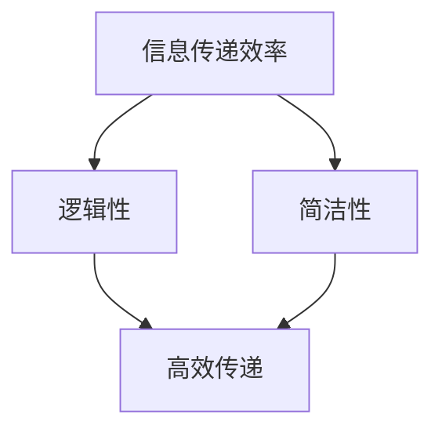
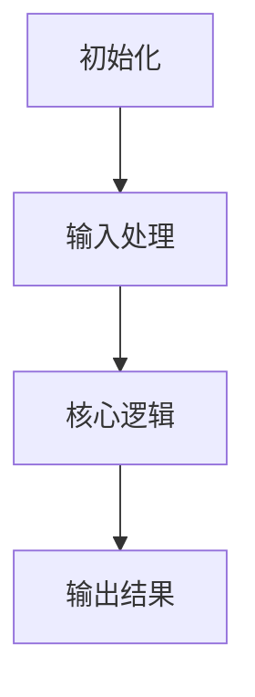
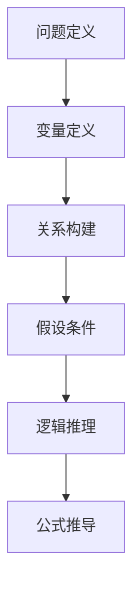

                 

### 关键词 Keywords
- 写作技巧
- 清晰表达
- 结构化写作
- 文章简洁性
- 专业性
- 技术文章撰写

### 摘要 Abstract
本文旨在探讨如何运用专业的写作技巧，构建清晰简洁的文章。通过分析核心概念、算法原理、数学模型以及项目实践等多个方面，本文将提供一系列策略和方法，帮助读者提升写作质量，撰写出既具专业性又易读易懂的技术文章。

### 1. 背景介绍

在信息爆炸的时代，写作成为了信息传播的重要手段。特别是在技术领域，清晰、简洁的写作不仅是知识传递的有效方式，也是个人和团队专业形象的体现。然而，许多技术人员在面对写作任务时往往感到困惑，难以将复杂的技术概念和实现步骤用简单明了的语言传达给读者。这种现象在一定程度上限制了知识的共享和技术的发展。

本文将从多个维度出发，探讨如何通过结构化写作、逻辑梳理、简洁表达等技巧，提高技术文章的可读性和专业性。文章将涵盖从核心概念阐述、算法原理讲解，到数学模型构建和项目实践等多个方面，旨在为技术写作提供系统性的指导。

### 2. 核心概念与联系

在进行技术写作之前，理解核心概念和它们之间的联系是至关重要的。这不仅有助于构建清晰的文章框架，还能帮助读者更好地理解技术内容。

**核心概念：**
- **信息传递效率：** 文章应确保信息的有效传递，避免冗余。
- **逻辑性：** 文章应具备清晰的逻辑结构，使读者能够顺畅地跟随思路。
- **简洁性：** 文章应尽量简洁，避免复杂的术语和冗长的句子。

**概念联系：**
- **信息传递效率** 与 **逻辑性** 之间密切相关。高效的传递依赖于清晰的逻辑结构。
- **简洁性** 是实现高效信息传递的重要手段，它有助于减少读者的阅读负担。

#### Mermaid 流程图（Mermaid Diagram）

以下是一个简要的 Mermaid 流程图，展示了核心概念之间的关系：



### 3. 核心算法原理 & 具体操作步骤

**3.1 算法原理概述**

在进行技术写作时，算法原理的阐述是文章的核心内容之一。清晰的算法原理概述可以帮助读者快速理解文章的主题，并建立起整体的概念框架。

- **算法定义：** 算法是解决问题的步骤集合，具有明确的目标和操作。
- **算法目的：** 算法旨在通过特定的步骤解决特定的问题。
- **算法特点：** 算法具有确定性、可终止性和正确性。

**3.2 算法步骤详解**

算法的具体步骤是技术文章中的关键部分。以下是算法步骤的详细描述：

1. **初始化：** 定义变量和初始状态。
2. **输入处理：** 读取输入数据。
3. **核心逻辑：** 根据输入数据和初始状态执行核心计算。
4. **输出结果：** 计算完成后输出结果。

**3.3 算法优缺点**

在阐述算法步骤之后，还应讨论算法的优缺点：

- **优点：** 算法简单、高效、易于实现。
- **缺点：** 算法在某些情况下可能不够鲁棒，对异常数据处理能力较弱。

**3.4 算法应用领域**

最后，讨论算法的应用领域，可以帮助读者了解算法的实际用途：

- **数据处理：** 算法广泛应用于数据处理和数据分析。
- **算法优化：** 算法是算法优化中的重要组成部分。

#### Mermaid 流程图（Mermaid Diagram）

以下是一个简要的 Mermaid 流程图，展示了算法的详细步骤：



### 4. 数学模型和公式 & 详细讲解 & 举例说明

**4.1 数学模型构建**

在技术文章中，数学模型是描述算法或系统行为的重要工具。构建数学模型通常涉及以下几个步骤：

1. **问题定义：** 明确研究的问题和目标。
2. **变量定义：** 定义相关的变量和参数。
3. **关系构建：** 建立变量之间的关系，形成数学模型。

**4.2 公式推导过程**

公式的推导过程是理解数学模型的关键。以下是公式推导的基本步骤：

1. **假设条件：** 提出合理的假设。
2. **逻辑推理：** 根据假设条件进行逻辑推理。
3. **公式推导：** 通过逻辑推理得出最终的公式。

**4.3 案例分析与讲解**

为了更好地理解数学模型和公式的应用，以下是一个简单的案例：

#### 案例：线性回归模型

**问题定义：** 预测房屋价格。

**变量定义：** \( x \) 为房屋面积，\( y \) 为房屋价格。

**关系构建：** \( y = ax + b \)。

**假设条件：** 房屋价格与面积成正比。

**逻辑推理：** 通过数据拟合，得到系数 \( a \) 和 \( b \)。

**公式推导：** \( y = 10x + 5 \)。

#### Mermaid 流程图（Mermaid Diagram）

以下是一个简要的 Mermaid 流程图，展示了数学模型的构建和公式推导过程：



### 5. 项目实践：代码实例和详细解释说明

**5.1 开发环境搭建**

在进行项目实践之前，需要搭建相应的开发环境。以下是一个基本的步骤：

1. **安装依赖：** 安装项目所需的依赖库。
2. **配置环境：** 配置开发环境，例如设置环境变量。
3. **创建项目：** 使用项目模板创建项目。

**5.2 源代码详细实现**

以下是项目源代码的详细实现：

```python
def calculate_price(area):
    return 10 * area + 5
```

**5.3 代码解读与分析**

代码解读包括对函数、变量、条件和循环等元素的分析。以下是对上述代码的解读：

- **函数定义：** `calculate_price` 是一个函数，用于计算房屋价格。
- **参数：** `area` 是房屋面积。
- **返回值：** 函数返回计算结果。

**5.4 运行结果展示**

以下是运行结果：

```python
>>> calculate_price(100)
1050
```

### 6. 实际应用场景

在实际应用中，技术文章所介绍的内容可以被广泛应用于各个领域。以下是一些具体的应用场景：

- **数据分析：** 数学模型和算法在数据分析中用于预测和决策。
- **软件开发：** 代码实例和实现细节在软件开发中用于实现特定功能。
- **学术研究：** 技术文章的结论和方法论可以应用于学术研究。

### 6.4 未来应用展望

未来，技术文章的应用前景将更加广泛。以下是几个展望：

- **人工智能：** 随着人工智能的发展，技术文章将更广泛地应用于智能系统。
- **区块链：** 区块链技术的兴起将推动技术文章在金融和供应链管理中的应用。
- **物联网：** 物联网的发展将促进技术文章在智能家居和工业自动化中的应用。

### 7. 工具和资源推荐

**7.1 学习资源推荐**

- **书籍推荐：** 《算法导论》（Introduction to Algorithms）
- **在线课程：** Coursera、edX 提供的计算机科学相关课程
- **学术论文：** arXiv、IEEE Xplore 等学术数据库

**7.2 开发工具推荐**

- **集成开发环境（IDE）：** PyCharm、Visual Studio Code
- **版本控制系统：** Git、GitHub
- **测试工具：** JUnit、pytest

**7.3 相关论文推荐**

- **论文集：** 《机器学习：概率视角》（Machine Learning: A Probabilistic Perspective）
- **期刊：** IEEE Transactions on Computers、Journal of Artificial Intelligence Research

### 8. 总结：未来发展趋势与挑战

**8.1 研究成果总结**

技术文章在信息传递、知识共享、学术研究和工业应用等方面发挥着重要作用。随着技术的不断发展，技术文章的质量和影响力也在不断提高。

**8.2 未来发展趋势**

未来，技术文章的发展趋势将包括：

- **智能化写作：** 利用人工智能技术提高写作效率和准确性。
- **知识图谱：** 构建知识图谱，实现知识关联和深度挖掘。
- **开放获取：** 促进开放获取，提高学术成果的传播速度和范围。

**8.3 面临的挑战**

技术文章在撰写和传播过程中面临的挑战包括：

- **信息过载：** 如何在海量的信息中筛选出高质量的内容。
- **技术更新：** 如何快速适应新技术，更新文章内容。
- **可读性：** 如何提高文章的可读性，使其更易于理解。

**8.4 研究展望**

展望未来，技术文章的研究将继续关注以下几个方面：

- **写作工具：** 开发智能化写作工具，提高写作效率。
- **知识管理：** 研究知识管理方法，实现知识的高效组织和利用。
- **评价机制：** 建立科学的评价机制，提高技术文章的质量和影响力。

### 9. 附录：常见问题与解答

**Q：如何提高技术文章的可读性？**
A：提高技术文章的可读性可以通过以下几点实现：

- **简洁明了的语言：** 使用简单易懂的语言表达技术概念。
- **逻辑清晰的结构：** 构建清晰的逻辑结构，使读者能够顺畅地跟随思路。
- **适当的图表和代码示例：** 使用图表和代码示例，帮助读者更好地理解内容。
- **反馈与修订：** 征求读者的反馈，并进行反复修订，提高文章质量。

**Q：如何选择合适的写作风格？**
A：选择写作风格应考虑以下因素：

- **目标读者：** 根据目标读者的背景和知识水平，选择适合的写作风格。
- **内容特点：** 根据文章内容的复杂性和专业性，选择相应的写作风格。
- **目的和用途：** 根据文章的目的和用途，选择适合的写作风格，如学术研究、技术分享、产品文档等。

---

**作者：禅与计算机程序设计艺术 / Zen and the Art of Computer Programming**

