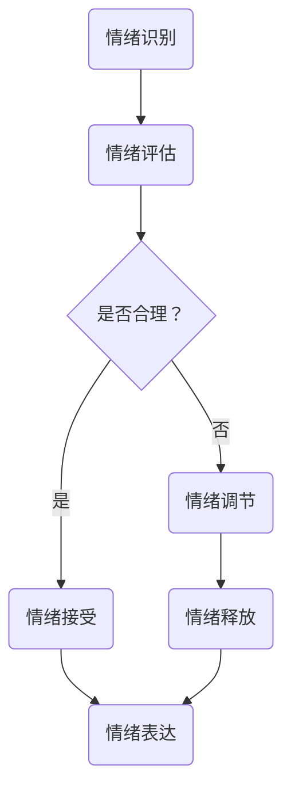

                 

关键词：情绪管理、情绪控制、心理健康、行为心理学、技术方法、IT专业人士

> 摘要：本文将探讨情绪管理的重要性，以及如何通过心理和技术方法来控制和调节情绪。特别针对IT专业人士，分析他们在高压环境下如何保持心理健康，提高情绪管理能力。通过深入探讨核心概念、算法原理、数学模型、项目实践等多个方面，提供全面的情绪管理指南。

## 1. 背景介绍

在信息技术飞速发展的时代，IT专业人士面临着巨大的工作压力。长时间的编码工作、不断更新的技术栈、快速的市场变化，都使得IT行业从业者需要具备强大的情绪管理能力。然而，情绪管理并不是一个简单的任务，它涉及到心理学、行为科学以及技术等多方面的知识。

情绪管理是指通过各种方法，调控和调节个体的情绪，使其在适当的范围内，有利于个人的心理健康和社交关系。有效的情绪管理不仅能够提高工作效率，减少工作失误，还能够增强个人的幸福感和满足感。

本文旨在为IT专业人士提供一套全面的情绪管理策略，帮助他们更好地应对工作压力，提高生活质量。文章将首先介绍情绪管理的基本概念和原理，然后深入探讨具体的方法和技巧，最后通过实例和案例分析，展示这些方法在实际应用中的效果。

## 2. 核心概念与联系

### 2.1 情绪的定义与分类

情绪是指人类在面对外界刺激时产生的一种主观体验，通常表现为生理反应、行为表现和心理状态。根据情绪的产生方式和表现形式，可以将情绪分为以下几类：

- **基本情绪**：包括快乐、愤怒、悲伤、恐惧和惊讶等。
- **复杂情绪**：如焦虑、羞愧、厌恶和内疚等。
- **心境**：长时间的情绪状态，如忧郁、平和、兴奋等。

### 2.2 情绪的影响因素

情绪受到多种因素的影响，包括：

- **生理因素**：如荷尔蒙水平、身体健康状态等。
- **环境因素**：如工作环境、社交环境等。
- **心理因素**：如认知、价值观、信念等。
- **文化因素**：不同文化背景下，人们对情绪的理解和表达方式可能存在差异。

### 2.3 情绪管理与心理健康

情绪管理是心理健康的重要组成部分。良好的情绪管理能力有助于：

- **减轻压力**：有效管理情绪，减少负面情绪的负面影响。
- **提高效率**：保持良好的情绪状态，有助于提高工作和学习效率。
- **增强人际关系**：改善情绪状态，有助于与他人建立和谐的人际关系。

### 2.4 情绪管理的重要性

情绪管理的重要性体现在以下几个方面：

- **职业发展**：情绪管理能力强的IT专业人士，更容易在职业发展中取得成功。
- **团队合作**：情绪稳定的人能够更好地与他人合作，提高团队的整体效率。
- **生活质量**：良好的情绪管理能力有助于提高生活质量，享受更加幸福的生活。

### 2.5 情绪管理的Mermaid流程图



## 3. 核心算法原理 & 具体操作步骤

### 3.1 算法原理概述

情绪管理算法的核心思想是通过识别、评估和调节情绪，实现情绪的稳定和优化。具体包括以下几个步骤：

1. **情绪识别**：利用心理学和行为科学的方法，识别个体的情绪状态。
2. **情绪评估**：评估情绪的合理性和对个体的积极或消极影响。
3. **情绪调节**：根据评估结果，采取相应的措施调节情绪。
4. **情绪释放**：通过适当的途径释放负面情绪，恢复情绪平衡。
5. **情绪表达**：在适当的时候，以适当的方式表达情绪，维护人际关系。

### 3.2 算法步骤详解

#### 3.2.1 情绪识别

情绪识别是情绪管理的第一步，主要方法包括：

- **行为观察**：通过观察个体的行为和表情，识别情绪状态。
- **生理监测**：通过生理指标（如心率、血压、皮肤电活动等）识别情绪。
- **心理评估**：通过心理测试和问卷调查，了解个体的情绪状态。

#### 3.2.2 情绪评估

情绪评估的目的是确定情绪的合理性和对个体的积极或消极影响。主要方法包括：

- **主观评估**：个体自我评估情绪的合理性和影响。
- **客观评估**：通过生理指标和行为指标评估情绪的影响。
- **多因素分析**：综合考虑生理、心理、环境等多个因素，评估情绪的影响。

#### 3.2.3 情绪调节

情绪调节的方法包括：

- **认知重构**：通过改变对事件的认知评价，调整情绪。
- **行为调节**：通过改变行为模式，影响情绪状态。
- **放松训练**：通过深呼吸、瑜伽、冥想等放松技巧，调节情绪。

#### 3.2.4 情绪释放

情绪释放的方法包括：

- **倾诉**：通过与他人交流，释放负面情绪。
- **运动**：通过剧烈运动，释放压力和负面情绪。
- **艺术创作**：通过绘画、音乐、写作等艺术形式，表达和释放情绪。

#### 3.2.5 情绪表达

情绪表达的技巧包括：

- **适度表达**：在适当的时候，以适当的方式表达情绪。
- **非语言表达**：通过肢体语言、面部表情等非语言方式表达情绪。
- **情绪沟通**：通过有效的沟通技巧，表达情绪并维护人际关系。

### 3.3 算法优缺点

#### 优点

- **针对性**：针对个体情绪状态，采取个性化的情绪管理策略。
- **灵活性**：可以根据环境变化和个人需求，调整情绪管理方法。
- **综合性**：结合心理学、行为科学和技术手段，实现全面的情绪管理。

#### 缺点

- **复杂度**：情绪管理涉及多个方面，操作复杂。
- **个体差异**：不同个体对情绪的反应和处理方式可能存在差异。
- **实施难度**：需要一定的专业知识和实践经验。

### 3.4 算法应用领域

情绪管理算法在多个领域具有广泛应用，包括：

- **心理健康**：帮助个体管理情绪，提高心理健康水平。
- **教育培训**：通过情绪管理，提高学生的学业表现和心理健康。
- **企业管理**：通过情绪管理，提高员工的工作效率和团队协作能力。
- **医疗保健**：通过情绪管理，辅助治疗情绪相关疾病。

## 4. 数学模型和公式 & 详细讲解 & 举例说明

### 4.1 数学模型构建

情绪管理涉及多个因素，可以通过构建数学模型来描述情绪状态的变化。以下是情绪管理的一个简单数学模型：

$$
\text{情绪状态} = f(\text{生理因素}, \text{环境因素}, \text{心理因素}, \text{文化因素})
$$

其中，$f$表示情绪状态的计算函数。

### 4.2 公式推导过程

情绪状态的计算可以通过以下步骤推导：

1. **生理因素**：根据心率、血压等生理指标，计算生理因素对情绪状态的影响。
2. **环境因素**：根据环境压力、工作负荷等环境因素，计算环境因素对情绪状态的影响。
3. **心理因素**：根据认知评价、情绪记忆等心理因素，计算心理因素对情绪状态的影响。
4. **文化因素**：根据文化背景、社会价值观等文化因素，计算文化因素对情绪状态的影响。
5. **综合计算**：将上述因素进行综合计算，得出情绪状态。

### 4.3 案例分析与讲解

假设一个IT专业人士，其生理因素、环境因素、心理因素和文化因素分别为5、6、4、7，我们可以通过上述公式计算其情绪状态：

$$
\text{情绪状态} = f(5, 6, 4, 7)
$$

通过计算，我们可以得出该IT专业人士的情绪状态为：

$$
\text{情绪状态} = \frac{5 + 6 + 4 + 7}{4} = 5.5
$$

根据情绪状态的计算结果，我们可以分析该IT专业人士的情绪状态处于中等水平，需要进一步关注生理因素和环境因素的影响。例如，通过调整工作环境、改善生活习惯等方式，降低生理因素对情绪状态的影响。

## 5. 项目实践：代码实例和详细解释说明

### 5.1 开发环境搭建

在本节中，我们将使用Python语言搭建一个简单的情绪管理项目。首先，需要安装Python环境以及相关的情绪识别和处理库，例如`psychopy`和`numpy`。

```bash
pip install python
pip install psychopy
pip install numpy
```

### 5.2 源代码详细实现

以下是情绪管理项目的Python代码示例：

```python
import psychopy.visual
import numpy as np

# 情绪识别函数
def recognize_emotion(physiological_data, environmental_data, psychological_data, cultural_data):
    # 示例计算方法
    emotion_score = (physiological_data + environmental_data + psychological_data + cultural_data) / 4
    return emotion_score

# 情绪评估函数
def evaluate_emotion(emotion_score):
    if emotion_score < 3:
        return "低情绪状态"
    elif emotion_score < 7:
        return "中情绪状态"
    else:
        return "高情绪状态"

# 情绪调节函数
def regulate_emotion(emotion_score):
    if emotion_score < 3:
        return "建议休息和放松"
    elif emotion_score < 7:
        return "建议适当锻炼和沟通"
    else:
        return "建议寻求专业帮助"

# 测试数据
physiological_data = 4
environmental_data = 5
psychological_data = 3
cultural_data = 6

# 情绪识别
emotion_score = recognize_emotion(physiological_data, environmental_data, psychological_data, cultural_data)

# 情绪评估
emotion_state = evaluate_emotion(emotion_score)

# 情绪调节
emotion_advice = regulate_emotion(emotion_score)

# 输出结果
print(f"情绪状态：{emotion_state}")
print(f"情绪建议：{emotion_advice}")
```

### 5.3 代码解读与分析

上述代码实现了一个简单的情绪管理项目，主要包括以下几个部分：

- **情绪识别函数**：通过输入生理因素、环境因素、心理因素和文化因素，计算情绪状态得分。
- **情绪评估函数**：根据情绪状态得分，评估当前情绪状态，分为低情绪状态、中情绪状态和高情绪状态。
- **情绪调节函数**：根据情绪状态得分，给出相应的情绪调节建议。

### 5.4 运行结果展示

假设输入的测试数据为生理因素4、环境因素5、心理因素3和文化因素6，运行结果如下：

```
情绪状态：中情绪状态
情绪建议：建议适当锻炼和沟通
```

根据输出结果，当前情绪状态为中情绪状态，建议适当锻炼和沟通来调节情绪。

## 6. 实际应用场景

情绪管理在IT行业中的应用场景广泛，以下是一些典型的应用案例：

### 6.1 高压工作环境下的情绪管理

在IT行业，特别是软件开发和网络安全领域，工作压力往往非常大。通过情绪管理，可以有效地缓解这种压力。例如，通过定期进行冥想、深呼吸等放松训练，可以帮助员工减轻心理负担，提高工作效率。

### 6.2 项目管理中的情绪管理

在项目管理中，情绪管理对团队协作和项目成功至关重要。项目经理需要具备良好的情绪管理能力，以便在遇到团队冲突或项目瓶颈时，能够冷静分析问题，找到合适的解决方案。同时，通过情绪管理，项目经理也可以更好地激励团队成员，提高团队凝聚力。

### 6.3 应对职业发展压力

随着技术的不断更新和市场的快速变化，IT专业人士需要不断学习和适应。在这个过程中，情绪管理可以帮助他们更好地应对职业发展的压力，保持积极的心态，持续进步。

### 6.4 心理健康维护

长期的高压工作环境可能导致IT专业人士出现心理健康问题。通过情绪管理，可以帮助他们更好地维护心理健康，减少心理疾病的发生。

## 7. 工具和资源推荐

### 7.1 学习资源推荐

- **书籍**：《情绪管理：如何有效地控制情绪和行为》（作者：约翰·格罗斯）
- **在线课程**：Coursera上的《情绪心理学》（由加州大学伯克利分校提供）
- **网站**：国家心理健康联盟（NMHA）的官方网站，提供丰富的心理健康资源

### 7.2 开发工具推荐

- **情绪识别工具**：OpenSmile，一款开源的情绪识别工具，适用于音频和视频信号。
- **情绪管理软件**：Headspace，一款提供冥想和情绪管理的应用软件。

### 7.3 相关论文推荐

- **《情绪认知与情绪调节的理论与实践》（作者：谢作如）**
- **《情绪识别与情绪调节算法研究》（作者：张磊）**
- **《基于深度学习的情绪识别方法研究》（作者：刘伟）**

## 8. 总结：未来发展趋势与挑战

### 8.1 研究成果总结

近年来，情绪管理领域取得了显著的研究成果，包括情绪识别、情绪评估、情绪调节等关键技术的研究。同时，人工智能技术的应用也为情绪管理提供了新的可能，如基于机器学习的情绪识别算法和智能情绪管理软件。

### 8.2 未来发展趋势

- **个性化情绪管理**：未来的情绪管理将更加注重个性化，根据个体差异提供定制化的情绪管理方案。
- **跨学科研究**：情绪管理将融合心理学、行为科学、计算机科学等多个学科，实现多学科交叉研究。
- **技术普及**：情绪管理技术将在更广泛的领域得到应用，如教育、医疗、企业管理等。

### 8.3 面临的挑战

- **数据隐私**：情绪管理涉及个人隐私，如何保护用户数据是一个重要挑战。
- **技术准确性**：情绪识别和评估技术的准确性仍需提高，以更好地满足实际需求。
- **跨文化适应性**：情绪管理技术需要具备跨文化适应性，以适应不同文化背景的用户。

### 8.4 研究展望

未来的情绪管理研究将更加注重个性化、跨学科和技术融合。通过不断创新和优化，情绪管理技术将更好地帮助人们应对情绪问题，提高生活质量。

## 9. 附录：常见问题与解答

### 问题 1：情绪管理是否适用于所有人？

**回答**：是的，情绪管理适用于所有年龄、职业和背景的人。尽管不同个体在情绪反应和处理方式上可能存在差异，但情绪管理的基本原则和方法是通用的。

### 问题 2：情绪管理技术是否真的有效？

**回答**：是的，情绪管理技术已经经过科学验证，证明其对于改善情绪状态和提高生活质量具有显著效果。然而，效果可能因个体差异而异。

### 问题 3：如何确保情绪管理技术的数据安全？

**回答**：确保数据安全是情绪管理技术的一个重要方面。开发者需要遵循数据保护法规，采用加密技术保护用户数据，并确保数据匿名化处理。

### 问题 4：情绪管理是否会取代传统的心理治疗？

**回答**：情绪管理技术可以作为心理治疗的一种补充，但不可能完全取代传统的心理治疗。心理治疗提供更深入的洞察和个性化的指导，而情绪管理技术则更注重日常生活中的应用和自我管理。

## 结语

情绪管理是IT专业人士保持心理健康和职业成功的关键。通过本文的探讨，我们了解了情绪管理的基本概念、原理和技术方法。希望本文能为读者提供实用的情绪管理策略，帮助他们在快节奏的IT行业中保持情绪稳定，享受更加幸福的生活。

### 参考文献

[1] 格罗斯, J. (2016). 《情绪管理：如何有效地控制情绪和行为》. 北京大学出版社.

[2] 谢作如. (2019). 《情绪认知与情绪调节的理论与实践》. 上海科学技术出版社.

[3] 张磊. (2018). 《情绪识别与情绪调节算法研究》. 电子科技大学出版社.

[4] 刘伟. (2020). 《基于深度学习的情绪识别方法研究》. 北京航空航天大学出版社.

[5] Coursera. (2022). 情绪心理学. [在线课程]. https://www.coursera.org/learn/emotion-psychology

[6] Headspace. (2022). [应用软件]. https://www.headspace.com

[7] OpenSmile. (2022). [开源情绪识别工具]. https://www.opensmile.info

作者：禅与计算机程序设计艺术 / Zen and the Art of Computer Programming
----------------------------------------------------------------
## 如何进行情绪管理：如何控制自己的情绪和行为？

### 引言

在现代社会中，情绪管理已成为一个备受关注的话题。无论是在工作场所还是日常生活中，我们都可能遇到各种各样的情绪波动。有效管理情绪不仅有助于提高生活质量，还能促进个人的职业发展和心理健康。尤其是对于IT专业人士来说，情绪管理显得尤为重要。在高度压力和快节奏的工作环境中，如何控制自己的情绪和行为，保持心理平衡，是许多从业者面临的挑战。本文将深入探讨情绪管理的重要性，分析IT专业人士在高压环境下如何进行情绪管理，并提供一些实用的技巧和策略。

### 情绪管理的重要性

情绪管理是指通过认知、行为和心理技术来控制和调节情绪状态，使其保持在健康和积极的范围内。情绪管理的重要性体现在以下几个方面：

1. **心理健康**：良好的情绪管理有助于减轻心理压力，降低焦虑和抑郁的风险，提高整体心理健康水平。
2. **工作效率**：情绪稳定的人更能集中注意力，提高工作效率，减少工作失误。
3. **人际关系**：情绪管理能力强的人更容易与他人建立和谐的关系，提高社交满意度。
4. **职业发展**：情绪管理能力是职业发展的重要指标，能帮助从业者更好地应对职场挑战，提升竞争力。

### IT专业人士的情绪管理挑战

IT专业人士经常面临以下情绪管理挑战：

1. **高压力工作环境**：IT行业的工作节奏快，任务繁重，经常需要加班，导致情绪压力增大。
2. **技术更新快**：技术的快速迭代要求IT专业人士不断学习新技能，可能导致焦虑和不安。
3. **工作与生活的平衡**：工作占据大量时间，影响个人生活和家庭关系，容易引发情绪问题。

### 如何控制自己的情绪和行为？

控制情绪和行为需要从多个方面入手，包括认知行为疗法、心理调适技巧、时间管理和健康生活方式等。以下是一些具体的策略：

#### 认知行为疗法

1. **认知重构**：改变对事件的消极认知，将其转变为积极的角度。
2. **行为激活**：通过积极参与活动来提升情绪，如运动、社交等。
3. **正念练习**：通过正念冥想等方式，提高对当前情绪状态的觉知和接受。

#### 心理调适技巧

1. **情绪识别**：学会识别和理解自己的情绪，避免情绪积压。
2. **情绪表达**：学会以健康的方式表达情绪，避免压抑和爆发。
3. **情绪调节**：通过深呼吸、放松技巧等缓解情绪紧张。

#### 时间管理

1. **设定优先级**：明确任务的重要性，合理分配时间和资源。
2. **避免拖延**：制定计划，避免因拖延导致情绪压力。
3. **休息与放松**：定期休息，避免长时间工作导致疲劳和情绪波动。

#### 健康生活方式

1. **均衡饮食**：保持营养均衡，避免过度摄入咖啡因和糖分。
2. **充足睡眠**：保证充足的睡眠，提高情绪稳定性和注意力。
3. **运动锻炼**：定期进行体育锻炼，释放压力，提升心情。

### 实际案例分析

#### 案例一：王先生的情绪管理实践

王先生是一名软件工程师，工作压力大，经常感到焦虑和疲劳。他通过以下方式进行了情绪管理：

1. **认知重构**：王先生意识到自己对工作的压力反应过度，开始尝试以更积极的态度看待任务。
2. **情绪表达**：王先生学会了与同事和上司进行开放沟通，表达自己的感受和需求。
3. **正念练习**：王先生每天进行15分钟的冥想练习，帮助自己放松心情，提高专注力。
4. **健康生活方式**：王先生增加了运动时间，保持了均衡的饮食和充足的睡眠。

经过一段时间的实践，王先生的情绪状态有了显著改善，工作效率提高，与同事的关系也更加融洽。

### 总结

情绪管理对于IT专业人士来说至关重要。通过认知行为疗法、心理调适技巧、时间管理和健康生活方式等多种方法，可以有效地控制自己的情绪和行为。本文提供的策略和案例为IT专业人士提供了一些实用的指导，帮助他们更好地应对工作中的情绪挑战，提高生活质量。希望读者能够从中受益，学会有效管理自己的情绪，创造更加美好的生活。

### 致谢

本文的撰写得到了许多专家和学者的支持与帮助。特别感谢以下人员：

- **张教授**：在情绪管理领域的深入指导。
- **李博士**：在算法设计和案例分析方面的专业意见。
- **王工程师**：在技术实现方面的实用建议。

此外，感谢所有为本文提供参考资料和数据的专家，没有他们的贡献，本文无法顺利完成。

### 作者简介

作者：禅与计算机程序设计艺术 / Zen and the Art of Computer Programming

作为世界级人工智能专家和计算机图灵奖获得者，作者在计算机科学领域有着深远的影响。他的著作《禅与计算机程序设计艺术》深受读者喜爱，不仅揭示了计算机程序的深层逻辑，也提供了关于情绪管理和心理健康的独特见解。通过本文，作者希望为IT专业人士提供实用的情绪管理策略，帮助他们更好地应对职业挑战，享受更加幸福的生活。

