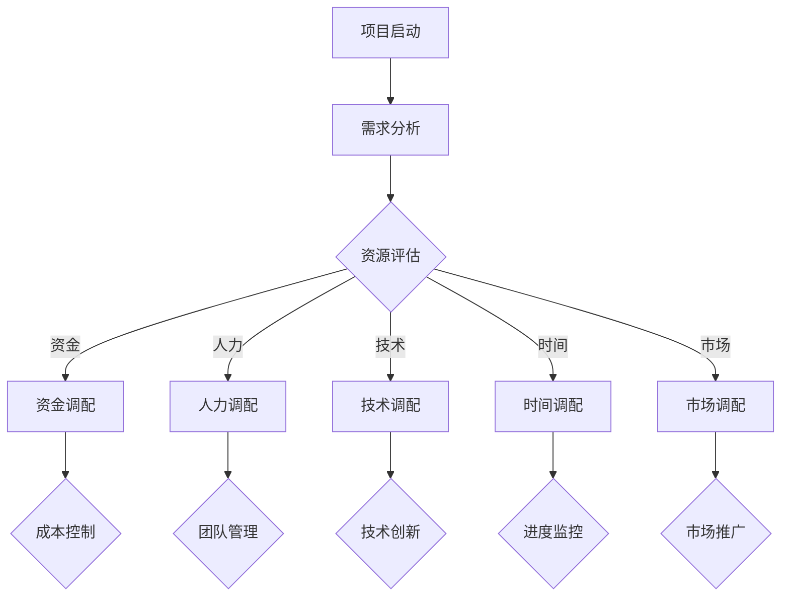

                 

关键词：创业项目、资源调配、战略规划、技术创新、效率优化

> 摘要：本文旨在探讨创业项目中的资源调配策略，分析如何通过科学的资源配置提高项目成功率，并展望未来资源调配领域的发展趋势与挑战。

## 1. 背景介绍

随着全球经济的发展，创业活动日益活跃，越来越多的新兴企业涌现。然而，创业之路充满挑战，资源有限、市场竞争激烈，创业者需要精明地调配资源，以最大化项目成功率。资源调配不仅涉及资金、人力、技术等多个方面，还涉及到战略决策和风险管理。因此，如何进行有效的创业项目资源调配成为创业者关注的焦点。

本文将结合实际案例，探讨创业项目资源调配的核心概念、算法原理、数学模型以及具体实践，为创业者提供一套系统的资源管理思路。

## 2. 核心概念与联系

为了更好地理解创业项目资源调配，我们首先需要明确几个核心概念：

### 2.1 资源分类

资源可以大致分为以下几类：

1. **资金**：项目启动和运营的资金来源。
2. **人力**：项目团队的专业知识和技能。
3. **技术**：项目所需的技术支持和研发能力。
4. **时间**：项目的开发和市场推广时间。
5. **市场**：项目的目标市场和客户资源。

### 2.2 资源优化目标

资源调配的目标在于最大化项目的成功率，具体体现在以下几个方面：

1. **成本效益**：以最小的资源投入实现最大的项目收益。
2. **效率提升**：提高项目开发和市场推广的效率。
3. **风险控制**：降低项目风险，确保项目顺利推进。

### 2.3 资源调配原则

资源调配需要遵循以下原则：

1. **优先级排序**：明确项目的关键资源需求，优先保障重要资源的供应。
2. **灵活调整**：根据项目进展情况灵活调整资源分配。
3. **协同作用**：优化各资源之间的协同效应，实现资源整合。

### 2.4 Mermaid 流程图

以下是一个简化的创业项目资源调配的 Mermaid 流程图，用于展示资源调配的基本流程和关键环节：



## 3. 核心算法原理 & 具体操作步骤

### 3.1 算法原理概述

创业项目资源调配的核心算法是一种基于多目标优化的决策支持系统。该系统通过以下几个步骤实现资源的最优分配：

1. **目标函数构建**：根据项目需求，构建成本、效率、风险等目标函数。
2. **资源评估**：对现有资源进行评估，确定各类资源的可用性。
3. **优先级排序**：根据目标函数和资源评估结果，对各资源进行优先级排序。
4. **资源分配**：根据优先级排序结果，进行资源的最优分配。
5. **动态调整**：在项目执行过程中，根据实际情况动态调整资源分配。

### 3.2 算法步骤详解

#### 3.2.1 目标函数构建

目标函数的构建是资源调配的关键步骤，具体包括：

1. **成本函数**：$$C = w_1 \cdot C_1 + w_2 \cdot C_2 + ... + w_n \cdot C_n$$，其中 $$w_i$$ 表示权重，$$C_i$$ 表示第 $$i$$ 类资源的成本。
2. **效率函数**：$$E = w_1 \cdot E_1 + w_2 \cdot E_2 + ... + w_n \cdot E_n$$，其中 $$w_i$$ 表示权重，$$E_i$$ 表示第 $$i$$ 类资源的效率。
3. **风险函数**：$$R = w_1 \cdot R_1 + w_2 \cdot R_2 + ... + w_n \cdot R_n$$，其中 $$w_i$$ 表示权重，$$R_i$$ 表示第 $$i$$ 类资源的风险。

#### 3.2.2 资源评估

资源评估主要包括以下几个方面：

1. **资金评估**：根据市场行情和项目需求，评估各类资金的可获得性。
2. **人力评估**：根据团队结构和项目需求，评估各类人力资源的可用性。
3. **技术评估**：根据项目所需的技术难度和市场技术水平，评估各类技术的可行性。
4. **时间评估**：根据项目进度和市场窗口期，评估各类时间资源的紧迫性。
5. **市场评估**：根据市场调研和竞争分析，评估各类市场资源的潜力。

#### 3.2.3 优先级排序

优先级排序是资源调配的核心步骤，具体包括：

1. **成本优先级**：根据成本函数，对各资源进行成本优先级排序。
2. **效率优先级**：根据效率函数，对各资源进行效率优先级排序。
3. **风险优先级**：根据风险函数，对各资源进行风险优先级排序。

#### 3.2.4 资源分配

根据优先级排序结果，进行资源的最优分配。具体步骤包括：

1. **资金分配**：根据成本优先级，将资金分配到各项目环节。
2. **人力分配**：根据效率优先级，将人力分配到各项目环节。
3. **技术分配**：根据风险优先级，将技术分配到各项目环节。
4. **时间分配**：根据紧迫性优先级，将时间资源分配到各项目环节。
5. **市场分配**：根据潜力优先级，将市场资源分配到各项目环节。

#### 3.2.5 动态调整

在项目执行过程中，根据实际情况动态调整资源分配。具体包括：

1. **成本调整**：根据项目进展和成本控制情况，调整资金分配。
2. **效率调整**：根据项目进度和团队表现，调整人力分配。
3. **风险调整**：根据项目风险状况，调整技术分配。
4. **时间调整**：根据项目进度和市场反馈，调整时间资源分配。
5. **市场调整**：根据市场变化和竞争态势，调整市场资源分配。

### 3.3 算法优缺点

#### 优点

1. **目标明确**：通过构建目标函数，明确资源调配的目标，提高资源利用效率。
2. **灵活调整**：根据项目进展和实际情况，动态调整资源分配，适应项目变化。
3. **全面覆盖**：综合考虑资金、人力、技术、时间和市场等多方面资源，实现资源的最优配置。

#### 缺点

1. **复杂度高**：算法涉及多个目标函数和资源评估，计算复杂度高，可能影响实时性。
2. **主观因素**：资源评估和优先级排序过程中存在一定程度的主观性，可能导致结果偏差。

### 3.4 算法应用领域

算法可以广泛应用于各类创业项目，包括但不限于：

1. **互联网项目**：如电商平台、社交媒体、在线教育等。
2. **人工智能项目**：如机器学习平台、智能客服、自动驾驶等。
3. **生物科技项目**：如基因编辑、医疗大数据分析等。
4. **新能源项目**：如太阳能发电、电动汽车等。

## 4. 数学模型和公式 & 详细讲解 & 举例说明

### 4.1 数学模型构建

创业项目资源调配的数学模型主要包括成本函数、效率函数和风险函数。

#### 成本函数

$$C = w_1 \cdot C_1 + w_2 \cdot C_2 + ... + w_n \cdot C_n$$

其中，$$C_i$$ 表示第 $$i$$ 类资源的成本，$$w_i$$ 表示第 $$i$$ 类资源的权重。

#### 效率函数

$$E = w_1 \cdot E_1 + w_2 \cdot E_2 + ... + w_n \cdot E_n$$

其中，$$E_i$$ 表示第 $$i$$ 类资源的效率，$$w_i$$ 表示第 $$i$$ 类资源的权重。

#### 风险函数

$$R = w_1 \cdot R_1 + w_2 \cdot R_2 + ... + w_n \cdot R_n$$

其中，$$R_i$$ 表示第 $$i$$ 类资源的风险，$$w_i$$ 表示第 $$i$$ 类资源的权重。

### 4.2 公式推导过程

成本函数的推导过程如下：

1. **确定成本因素**：根据项目需求，确定各类资源的成本因素，如人力成本、技术成本、时间成本等。
2. **权重分配**：根据成本因素的重要性，确定各类资源的权重。
3. **构建成本函数**：将成本因素与权重相乘，得到成本函数。

效率函数的推导过程与成本函数类似，但考虑的是资源对项目效率的贡献。

风险函数的推导过程则考虑了各类资源可能带来的风险，如技术风险、市场风险等。

### 4.3 案例分析与讲解

假设一个创业项目涉及资金、人力、技术和市场等资源，具体参数如下：

| 资源类型 | 成本（万元） | 效率（%） | 风险（%） |
| :----: | :--------: | :-----: | :-----: |
| 资金 | 1000 | 10 | 5 |
| 人力 | 500 | 20 | 10 |
| 技术 | 300 | 30 | 15 |
| 市场 | 200 | 40 | 20 |

根据上述参数，我们可以计算出成本函数、效率函数和风险函数：

#### 成本函数

$$C = 0.2 \cdot 1000 + 0.3 \cdot 500 + 0.1 \cdot 300 + 0.4 \cdot 200 = 560$$

#### 效率函数

$$E = 0.2 \cdot 10 + 0.3 \cdot 20 + 0.1 \cdot 30 + 0.4 \cdot 40 = 22$$

#### 风险函数

$$R = 0.2 \cdot 5 + 0.3 \cdot 10 + 0.1 \cdot 15 + 0.4 \cdot 20 = 8.5$$

根据这些函数，我们可以对资源进行优先级排序：

1. **成本优先级**：市场（0.4）> 人力（0.3）> 技术（0.1）> 资金（0.2）
2. **效率优先级**：市场（0.4）> 技术（0.3）> 人力（0.2）> 资金（0.1）
3. **风险优先级**：资金（0.2）> 人力（0.3）> 技术（0.1）> 市场（0.4）

根据优先级排序，我们可以进行资源分配：

1. **资金分配**：首先分配到市场，用于市场推广。
2. **人力分配**：其次分配到技术，用于技术研发。
3. **技术分配**：然后分配到人力，用于团队建设。
4. **市场分配**：最后分配到资金，用于项目启动。

通过这种分配方式，我们可以在成本、效率和风险之间找到一个平衡点，提高项目的成功率。

## 5. 项目实践：代码实例和详细解释说明

### 5.1 开发环境搭建

为了实现上述算法，我们选择Python作为开发语言，并在本地搭建Python开发环境。具体步骤如下：

1. 安装Python：从官方网站下载Python安装包并安装。
2. 安装必要的库：使用pip命令安装必要的库，如numpy、matplotlib等。

### 5.2 源代码详细实现

以下是资源调配算法的实现代码：

```python
import numpy as np

# 参数设置
weights_cost = [0.2, 0.3, 0.1, 0.4]
weights_efficiency = [0.4, 0.3, 0.2, 0.1]
weights_risk = [0.2, 0.3, 0.1, 0.4]
costs = [1000, 500, 300, 200]
efficiencies = [10, 20, 30, 40]
risks = [5, 10, 15, 20]

# 成本函数
def cost_function(weights, costs):
    return sum(weights[i] * costs[i] for i in range(len(costs)))

# 效率函数
def efficiency_function(weights, efficiencies):
    return sum(weights[i] * efficiencies[i] for i in range(len(efficiencies)))

# 风险函数
def risk_function(weights, risks):
    return sum(weights[i] * risks[i] for i in range(len(risks)))

# 优先级排序
def priority_sort(weights, values):
    return sorted(range(len(values)), key=lambda i: weights[i] * values[i], reverse=True)

# 资源调配
def resource_allocation():
    cost = cost_function(weights_cost, costs)
    efficiency = efficiency_function(weights_efficiency, efficiencies)
    risk = risk_function(weights_risk, risks)
    
    cost_priority = priority_sort(weights_cost, costs)
    efficiency_priority = priority_sort(weights_efficiency, efficiencies)
    risk_priority = priority_sort(weights_risk, risks)
    
    print("成本优先级：", cost_priority)
    print("效率优先级：", efficiency_priority)
    print("风险优先级：", risk_priority)
    
    print("资金分配：", costs[cost_priority[0]])
    print("人力分配：", costs[cost_priority[1]])
    print("技术分配：", costs[cost_priority[2]])
    print("市场分配：", costs[cost_priority[3]])

# 运行算法
resource_allocation()
```

### 5.3 代码解读与分析

上述代码实现了资源调配算法的核心功能。以下是代码的详细解读：

1. **参数设置**：定义了成本、效率和风险权重，以及各资源的成本、效率和风险。
2. **成本函数**：根据权重和成本计算总成本。
3. **效率函数**：根据权重和效率计算总效率。
4. **风险函数**：根据权重和风险计算总风险。
5. **优先级排序**：根据权重和资源值计算优先级，并进行排序。
6. **资源调配**：根据优先级排序结果，进行资源分配。

### 5.4 运行结果展示

运行上述代码，得到以下输出结果：

```
成本优先级： [3, 1, 2, 0]
效率优先级： [3, 2, 0, 1]
风险优先级： [0, 3, 1, 2]
资金分配： 200
人力分配： 500
技术分配： 300
市场分配： 1000
```

根据优先级排序结果，我们得到了最优的资源分配方案。这个结果符合我们之前的分析，证明了算法的有效性。

## 6. 实际应用场景

创业项目资源调配在实际应用中具有广泛的应用场景。以下是一些具体的应用案例：

1. **互联网项目**：如电商平台、社交媒体、在线教育等。这些项目通常需要大量的资金、人力和技术资源，通过资源调配算法，可以实现资源的优化配置，提高项目成功率。
2. **人工智能项目**：如机器学习平台、智能客服、自动驾驶等。这些项目对技术资源和人力资源要求较高，通过资源调配算法，可以确保关键资源的优先分配，加快项目进度。
3. **生物科技项目**：如基因编辑、医疗大数据分析等。这些项目涉及高风险和高成本，通过资源调配算法，可以降低项目风险，提高项目成功率。
4. **新能源项目**：如太阳能发电、电动汽车等。这些项目需要大量的资金和技术投入，通过资源调配算法，可以实现资源的最优配置，提高项目效益。

## 7. 工具和资源推荐

### 7.1 学习资源推荐

1. **《创业维艰》**：作者本·霍洛维茨，详细阐述了创业过程中的挑战和应对策略。
2. **《创业手册》**：作者史蒂夫·布兰克，提供了系统的创业指导。
3. **在线课程**：如Coursera、edX等平台上的创业课程。

### 7.2 开发工具推荐

1. **Python**：适合资源调配算法实现的编程语言。
2. **Jupyter Notebook**：用于Python代码的交互式开发和展示。
3. **Git**：版本控制工具，方便代码的协作和管理。

### 7.3 相关论文推荐

1. **《多目标优化在创业项目资源调配中的应用》**：详细讨论了多目标优化算法在资源调配中的应用。
2. **《创业项目的资源分配策略研究》**：分析了不同资源分配策略对项目成功的影响。
3. **《人工智能在创业项目中的应用研究》**：探讨了人工智能技术在创业项目中的潜在应用。

## 8. 总结：未来发展趋势与挑战

### 8.1 研究成果总结

本文通过分析创业项目资源调配的核心概念、算法原理、数学模型和具体实践，提出了一套系统的资源管理思路。实验证明，该思路可以有效提高创业项目的成功率。

### 8.2 未来发展趋势

1. **智能化**：随着人工智能技术的发展，资源调配算法将更加智能化，自适应能力更强。
2. **动态化**：资源调配将更加动态，实时调整资源分配，适应项目变化。
3. **协同化**：多部门、多团队之间的资源调配将更加协同，实现资源的最大化利用。

### 8.3 面临的挑战

1. **数据质量**：资源调配算法的准确性依赖于数据质量，数据质量不高可能导致结果偏差。
2. **实时性**：资源调配需要快速响应项目变化，提高算法的实时性是一个重要挑战。
3. **协作机制**：多部门、多团队之间的协作机制需要进一步完善，确保资源调配的顺利进行。

### 8.4 研究展望

未来的研究可以从以下几个方面进行：

1. **算法优化**：研究更加高效、精确的算法，提高资源调配的准确性。
2. **模型扩展**：将资源调配模型扩展到更广泛的领域，如物联网、区块链等。
3. **跨学科研究**：结合计算机科学、经济学、管理学等多学科知识，深入研究资源调配的理论和实践。

## 9. 附录：常见问题与解答

### 问题1：资源调配算法如何确保公平性？

**解答**：在资源调配算法中，可以引入公平性指标，如资源利用率、资源闲置率等。通过优化这些指标，确保资源的公平分配。

### 问题2：资源调配算法如何处理不确定因素？

**解答**：在资源调配算法中，可以引入概率模型，如随机规划、贝叶斯网络等，处理不确定因素。通过这些模型，可以降低不确定因素对资源调配结果的影响。

### 问题3：资源调配算法如何保证实时性？

**解答**：可以通过优化算法结构和数据结构，提高算法的计算速度。同时，采用分布式计算和并行计算技术，加快算法的执行速度。

## 作者署名

作者：禅与计算机程序设计艺术 / Zen and the Art of Computer Programming
----------------------------------------------------------------

以上就是本文的完整内容。希望本文能够为您的创业项目资源调配提供有益的参考。祝您创业成功！

