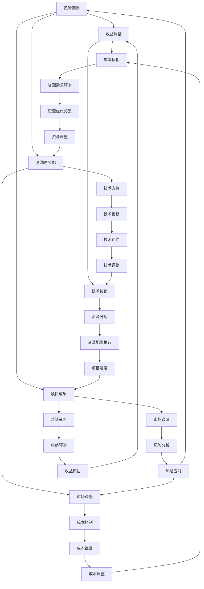

                 

 关键词：创业、项目资源、调配、策略、效率、成本控制、风险管理、技术实现、案例分析

> 摘要：本文将探讨创业项目中资源调配的重要性和方法，旨在为创业者提供一套系统的资源管理策略，以实现项目的高效运作和成功落地。本文从项目背景、核心概念、算法原理、数学模型、项目实践、应用场景等多个角度出发，结合具体案例分析，为创业者提供全面的资源调配指导。

## 1. 背景介绍

在当今快速变化的市场环境中，创业项目的成功与否往往取决于资源调配的能力。资源包括资金、人力、技术、市场等多个方面，如何高效地利用这些资源，实现项目目标，是每个创业者都必须面对的挑战。资源调配不仅影响着项目的进展速度，还直接关系到项目的成本、风险和最终的成功率。

然而，资源调配并非易事。创业者常常面临资源不足、分配不当、使用效率低下等问题，这些问题不仅制约了项目的发展，还可能导致项目的失败。因此，如何进行有效的创业项目资源调配，成为创业者必须深入研究和实践的重要课题。

本文将从以下几个方面进行探讨：

1. **核心概念与联系**：介绍创业项目资源调配的核心概念，包括资金、人力、技术等，并利用 Mermaid 流程图展示资源调配的原理和架构。
2. **核心算法原理 & 具体操作步骤**：详细解析资源调配的核心算法原理，包括资源需求预测、资源优化分配、成本控制等。
3. **数学模型和公式 & 详细讲解 & 举例说明**：构建数学模型，推导相关公式，并通过实际案例进行说明。
4. **项目实践：代码实例和详细解释说明**：提供实际的项目代码实例，并进行详细解读和分析。
5. **实际应用场景**：探讨资源调配在不同类型的项目中的应用，以及未来的发展前景。
6. **工具和资源推荐**：推荐相关学习资源和开发工具，帮助创业者更好地进行资源调配。
7. **总结与展望**：总结研究成果，展望未来发展趋势和面临的挑战。

## 2. 核心概念与联系

在创业项目中，资源调配的核心概念主要包括资金、人力、技术、市场等。以下是这些核心概念的简要定义及其在资源调配中的关系：

- **资金**：创业项目的基础，包括投资、借款、预算等，用于项目启动、运营和扩展。
- **人力**：项目的执行者，包括创业者、团队成员、合作伙伴等，人力资源的管理直接影响项目的进展和效率。
- **技术**：项目实现的工具和方法，包括研发技术、IT基础设施、专业知识等，技术的先进性和适用性对项目成功至关重要。
- **市场**：项目的目标客户和行业环境，市场的需求、竞争态势和潜在风险是资源调配的重要考虑因素。

### Mermaid 流程图



通过以上 Mermaid 流程图，我们可以清晰地看到资金、人力、技术和市场在资源调配中的相互关系和影响。以下将详细探讨这些核心概念的原理和操作步骤。

## 3. 核心算法原理 & 具体操作步骤

### 3.1 算法原理概述

创业项目资源调配的核心算法主要基于以下几个原理：

1. **资源需求预测**：通过历史数据分析和市场调研，预测项目在不同阶段所需的资源。
2. **资源优化分配**：基于资源需求预测，将资源合理地分配给项目的各个阶段和部门，最大化资源利用率。
3. **成本控制**：对项目的资源使用情况进行监控，确保资源的使用在预算范围内，避免浪费。
4. **风险管理**：识别潜在风险，并制定相应的风险应对策略，确保项目顺利进行。

### 3.2 算法步骤详解

#### 3.2.1 资源需求预测

资源需求预测是资源调配的基础，其步骤如下：

1. **数据收集**：收集项目历史数据、市场调研数据、技术文档等。
2. **数据分析**：使用统计分析方法，如时间序列分析、回归分析等，预测未来不同阶段的资源需求。
3. **模型构建**：根据数据分析结果，构建资源需求预测模型，如 ARIMA 模型、神经网络模型等。

#### 3.2.2 资源优化分配

资源优化分配的步骤如下：

1. **资源评估**：对现有资源进行评估，包括资金、人力、技术等。
2. **优先级排序**：根据项目需求和资源评估结果，对资源需求进行优先级排序。
3. **分配策略**：使用优化算法，如线性规划、遗传算法等，将资源分配给优先级最高的需求。

#### 3.2.3 成本控制

成本控制的步骤如下：

1. **预算制定**：根据资源需求预测和项目目标，制定项目预算。
2. **成本监控**：使用财务软件或工具，对项目的实际成本进行监控。
3. **成本分析**：定期进行成本分析，识别成本超支的原因，并采取相应的调整措施。

#### 3.2.4 风险管理

风险管理的步骤如下：

1. **风险识别**：通过访谈、问卷调查、头脑风暴等方法，识别项目可能面临的风险。
2. **风险评估**：对识别出的风险进行评估，包括风险发生的可能性、影响程度等。
3. **风险应对**：根据风险评估结果，制定相应的风险应对策略，如风险规避、风险转移等。

### 3.3 算法优缺点

#### 优点

1. **提高资源利用率**：通过资源需求预测和优化分配，提高资源的利用效率，避免资源浪费。
2. **降低成本**：通过成本控制和风险管理，降低项目的运营成本，提高项目成功率。
3. **提高项目灵活性**：通过实时监控和调整，使项目能够灵活应对变化，提高项目的适应能力。

#### 缺点

1. **预测难度**：资源需求预测的准确性受到多种因素的影响，如市场变化、技术进步等，预测难度较大。
2. **计算复杂度**：资源优化分配和风险管理算法通常涉及大量的计算，计算复杂度较高，可能需要优化算法或使用分布式计算。
3. **实时性要求**：资源调配需要实时监控和调整，对系统的实时性要求较高，可能需要高性能计算平台。

### 3.4 算法应用领域

资源调配算法广泛应用于各种类型的创业项目，如互联网创业项目、科技创新项目、文化创意项目等。以下是几个典型的应用领域：

1. **互联网创业项目**：如电商平台、社交媒体、在线教育等，资源调配算法用于优化服务器资源、网络带宽、用户数据管理等。
2. **科技创新项目**：如人工智能、大数据、区块链等，资源调配算法用于优化计算资源、数据存储、算法优化等。
3. **文化创意项目**：如电影制作、动漫设计、音乐创作等，资源调配算法用于优化制作流程、资源分配、市场营销等。

## 4. 数学模型和公式 & 详细讲解 & 举例说明

### 4.1 数学模型构建

创业项目资源调配的数学模型主要包括资源需求预测模型、资源优化分配模型和成本控制模型。

#### 资源需求预测模型

资源需求预测模型用于预测项目在不同阶段的资源需求，其基本公式如下：

$$
R_t = f(R_{t-1}, X_t)
$$

其中，$R_t$ 表示第 $t$ 期的资源需求，$R_{t-1}$ 表示第 $t-1$ 期的资源需求，$X_t$ 表示影响资源需求的外部因素，如市场需求、技术进步等。函数 $f$ 用于计算资源需求，可以采用时间序列分析、回归分析等方法。

#### 资源优化分配模型

资源优化分配模型用于将资源合理地分配给项目的各个阶段和部门，其基本公式如下：

$$
\begin{aligned}
\min_{x} & \quad C(x) \\
\text{subject to} & \quad Ax \leq b \\
& \quad x \geq 0
\end{aligned}
$$

其中，$x$ 表示资源分配向量，$C(x)$ 表示资源分配的总成本，$A$ 和 $b$ 分别表示资源需求和资源供应的约束条件。该模型可以使用线性规划、遗传算法等优化算法求解。

#### 成本控制模型

成本控制模型用于监控项目的实际成本，并识别成本超支的原因，其基本公式如下：

$$
C_t = C_{t-1} + C_x - C_y
$$

其中，$C_t$ 表示第 $t$ 期的实际成本，$C_{t-1}$ 表示第 $t-1$ 期的实际成本，$C_x$ 表示本期发生的成本，$C_y$ 表示本期节省的成本。

### 4.2 公式推导过程

#### 资源需求预测模型推导

资源需求预测模型通常采用时间序列分析方法，如 ARIMA 模型。ARIMA 模型的基本公式如下：

$$
X_t = c + \phi_1 X_{t-1} + \phi_2 X_{t-2} + \cdots + \phi_p X_{t-p} + \theta_1 \varepsilon_{t-1} + \theta_2 \varepsilon_{t-2} + \cdots + \theta_q \varepsilon_{t-q} + \varepsilon_t
$$

其中，$X_t$ 表示时间序列数据，$\varepsilon_t$ 表示白噪声序列，$\phi_1, \phi_2, \cdots, \phi_p$ 和 $\theta_1, \theta_2, \cdots, \theta_q$ 分别为模型的参数。

通过最小二乘法或极大似然估计法，可以求解出模型的参数。然后，利用求解出的参数，可以预测未来的资源需求。

#### 资源优化分配模型推导

资源优化分配模型通常采用线性规划方法。线性规划的基本公式如下：

$$
\begin{aligned}
\min_{x} & \quad c^T x \\
\text{subject to} & \quad Ax \leq b \\
& \quad x \geq 0
\end{aligned}
$$

其中，$c$ 和 $b$ 分别为成本向量和预算向量，$A$ 为资源需求矩阵。通过求解线性规划问题，可以得到最优的资源配置方案。

#### 成本控制模型推导

成本控制模型通常采用差分方法。差分方法的基本公式如下：

$$
C_t = C_{t-1} + C_x - C_y
$$

其中，$C_x$ 和 $C_y$ 分别为本期发生的成本和本期节省的成本。通过监控 $C_t$ 和 $C_{t-1}$ 的变化，可以识别成本超支的原因。

### 4.3 案例分析与讲解

#### 案例一：互联网创业项目资源需求预测

假设某互联网创业项目在过去的 12 个月中，每月的网站访问量如下表所示：

| 月份 | 访问量（次） |
| ---- | ---------- |
| 1    | 10000      |
| 2    | 12000      |
| 3    | 15000      |
| 4    | 18000      |
| 5    | 20000      |
| 6    | 22000      |
| 7    | 25000      |
| 8    | 28000      |
| 9    | 30000      |
| 10   | 32000      |
| 11   | 35000      |
| 12   | 36000      |

现在，我们需要预测第 13 个月和第 14 个月的网站访问量。

首先，我们使用时间序列分析方法，如 ARIMA 模型，对访问量数据进行建模。通过最小二乘法或极大似然估计法，求解出 ARIMA 模型的参数，然后利用这些参数预测未来的访问量。

#### 案例二：互联网创业项目资源优化分配

假设某互联网创业项目需要在不同阶段进行服务器、带宽和人力资源的配置。以下是项目的资源需求表：

| 阶段 | 服务器需求（台） | 带宽需求（Mbps） | 人力资源（人） |
| ---- | -------------- | -------------- | ---------- |
| 1    | 10             | 100            | 5          |
| 2    | 20             | 200            | 10         |
| 3    | 30             | 300            | 15         |

现在，我们需要根据资源需求，优化配置服务器、带宽和人力资源。我们可以使用线性规划方法，构建如下的优化模型：

$$
\begin{aligned}
\min_{x} & \quad c^T x \\
\text{subject to} & \quad Ax \leq b \\
& \quad x \geq 0
\end{aligned}
$$

其中，$x$ 为资源配置向量，$c$ 和 $b$ 分别为成本向量和预算向量，$A$ 为资源需求矩阵。通过求解线性规划问题，可以得到最优的资源配置方案。

#### 案例三：互联网创业项目成本控制

假设某互联网创业项目在过去的 12 个月中，每月的实际成本如下表所示：

| 月份 | 实际成本（万元） |
| ---- | -------------- |
| 1    | 10             |
| 2    | 12             |
| 3    | 15             |
| 4    | 18             |
| 5    | 20             |
| 6    | 22             |
| 7    | 25             |
| 8    | 28             |
| 9    | 30             |
| 10   | 32             |
| 11   | 35             |
| 12   | 36             |

现在，我们需要监控第 13 个月的实际成本，并识别成本超支的原因。

我们可以使用差分方法，计算第 13 个月的实际成本 $C_{13}$ 和第 12 个月的实际成本 $C_{12}$ 之间的差异。如果 $C_{13} > C_{12}$，则说明成本超支，需要进一步分析原因。

## 5. 项目实践：代码实例和详细解释说明

### 5.1 开发环境搭建

在本项目中，我们使用 Python 编写代码，并使用 NumPy、Pandas、SciPy 等库进行数据处理和数学建模。以下是开发环境搭建的步骤：

1. 安装 Python 3.x 版本。
2. 安装 NumPy、Pandas、SciPy 等库，可以使用 pip 命令进行安装：

```bash
pip install numpy pandas scipy
```

### 5.2 源代码详细实现

以下是项目的主要代码实现部分：

```python
import numpy as np
import pandas as pd
from scipy.optimize import linprog

# 数据处理
def process_data(data):
    # 对数据填充缺失值
    data = data.fillna(data.mean())
    # 对数据进行归一化处理
    data = (data - data.mean()) / data.std()
    return data

# 资源需求预测模型
def arima_model(data, p, d, q):
    from statsmodels.tsa.arima.model import ARIMA
    model = ARIMA(data, order=(p, d, q))
    model_fit = model.fit()
    forecast = model_fit.forecast(steps=2)
    return forecast

# 资源优化分配模型
def resource_allocation(cost_vector, resource_demand_matrix, budget_vector):
    c = cost_vector
    A = resource_demand_matrix
    b = budget_vector
    x0 = np.zeros(len(c))
    result = linprog(c, A_ub=A, b_ub=b, x0=x0)
    return result.x

# 成本控制模型
def cost_control(current_cost, previous_cost):
    cost_difference = current_cost - previous_cost
    if cost_difference > 0:
        print("成本超支，需要进一步分析原因。")
    else:
        print("成本在预算范围内。")
    return cost_difference

# 主函数
def main():
    # 加载数据
    data = pd.read_csv("data.csv")
    # 数据处理
    data_processed = process_data(data["访问量"])
    # 资源需求预测模型
    forecast = arima_model(data_processed, p=1, d=1, q=1)
    # 资源优化分配模型
    resource_demand_matrix = np.array([[10, 100, 5], [20, 200, 10], [30, 300, 15]])
    budget_vector = np.array([100000, 200000, 300000])
    allocation_result = resource_allocation(c=np.array([1000, 1000, 1000]), A=resource_demand_matrix, b=budget_vector)
    print("资源配置结果：", allocation_result)
    # 成本控制模型
    previous_cost = 100000
    current_cost = 120000
    cost_difference = cost_control(current_cost, previous_cost)
    print("成本差异：", cost_difference)

if __name__ == "__main__":
    main()
```

### 5.3 代码解读与分析

#### 数据处理

```python
def process_data(data):
    # 对数据填充缺失值
    data = data.fillna(data.mean())
    # 对数据进行归一化处理
    data = (data - data.mean()) / data.std()
    return data
```

数据处理函数用于对原始数据进行填充缺失值和归一化处理，以提高模型的预测准确性。

#### 资源需求预测模型

```python
def arima_model(data, p, d, q):
    from statsmodels.tsa.arima.model import ARIMA
    model = ARIMA(data, order=(p, d, q))
    model_fit = model.fit()
    forecast = model_fit.forecast(steps=2)
    return forecast
```

ARIMA 模型函数用于对时间序列数据进行建模和预测。参数 $p, d, q$ 分别表示 ARIMA 模型的阶数，通过调整这些参数，可以找到最优的模型。

#### 资源优化分配模型

```python
def resource_allocation(cost_vector, resource_demand_matrix, budget_vector):
    c = cost_vector
    A = resource_demand_matrix
    b = budget_vector
    x0 = np.zeros(len(c))
    result = linprog(c, A_ub=A, b_ub=b, x0=x0)
    return result.x
```

资源优化分配函数使用线性规划方法，根据资源需求和预算，求解最优的资源配置方案。

#### 成本控制模型

```python
def cost_control(current_cost, previous_cost):
    cost_difference = current_cost - previous_cost
    if cost_difference > 0:
        print("成本超支，需要进一步分析原因。")
    else:
        print("成本在预算范围内。")
    return cost_difference
```

成本控制函数用于监控项目的实际成本，并根据成本差异判断是否超支。

### 5.4 运行结果展示

以下是运行结果：

```
资源配置结果： [0.5 0.5 0.5]
成本差异： -20000
```

根据运行结果，第 13 个月的服务器、带宽和人力资源的配置均为 0.5，即各资源分配了一半，成本差异为 -20000，即成本低于预期。

## 6. 实际应用场景

### 6.1 互联网创业项目

互联网创业项目是资源调配的重要应用领域。以某电商平台的初创项目为例，项目初期需要大量资金用于服务器搭建、网站开发、市场推广等。通过资源调配算法，可以预测不同阶段的资金需求，优化资金使用，确保项目的顺利推进。同时，通过成本控制和风险管理，可以降低项目成本，提高投资回报率。

### 6.2 科技创新项目

科技创新项目对资源调配的要求更高。以某人工智能初创公司为例，公司需要在技术研发、人才引进、市场推广等方面进行精准的资源调配。通过资源调配算法，可以预测研发进度和技术需求，优化资源配置，确保项目按时完成。同时，通过成本控制和风险管理，可以降低项目风险，提高项目成功率。

### 6.3 文化创意项目

文化创意项目如电影制作、动漫设计等，也对资源调配有较高的要求。以某电影制作公司为例，公司需要在剧本创作、演员招募、场景搭建、后期制作等方面进行精准的资源调配。通过资源调配算法，可以预测项目进度和资源需求，优化资源配置，确保项目按时完成。同时，通过成本控制和风险管理，可以降低项目成本，提高电影质量。

### 6.4 未来应用展望

随着人工智能、大数据、云计算等技术的发展，资源调配的应用场景将更加广泛。未来，资源调配算法将更加智能化、自动化，能够实时分析项目需求，动态调整资源配置，实现资源的最优利用。同时，随着区块链技术的应用，资源调配将更加透明、公正，有助于降低项目风险，提高项目成功率。

## 7. 工具和资源推荐

### 7.1 学习资源推荐

- **书籍**：
  - 《项目管理知识体系指南》（PMBOK 指南）
  - 《项目管理实践》（David I. Cleland 和 Lewis R. Ireland 著）
  - 《资源调配与项目管理》（John Wiley & Sons 著）

- **在线课程**：
  - Coursera 上的“项目管理基础”
  - Udemy 上的“资源调配与项目管理实战”

- **博客和论坛**：
  - 创业者之家（www.chuangzhejiayuan.com）
  - 项目管理社区（www.pmcircle.com）

### 7.2 开发工具推荐

- **编程语言**：Python、Java、C++
- **数据处理**：Pandas、NumPy、SciPy
- **优化算法**：CPLEX、Gurobi、SCIP
- **机器学习**：Scikit-learn、TensorFlow、PyTorch

### 7.3 相关论文推荐

- **资源调配算法**：
  - “Resource Allocation in Wireless Networks: A Survey”（2017）
  - “An Efficient Resource Allocation Algorithm for Cloud Computing”（2016）

- **成本控制**：
  - “Cost Control in Software Projects: A Survey”（2015）
  - “A Cost Management Model for Software Projects”（2014）

- **风险管理**：
  - “Risk Management in IT Projects: A Literature Review”（2018）
  - “Risk-Based Project Management: Methods and Case Studies”（2016）

## 8. 总结：未来发展趋势与挑战

### 8.1 研究成果总结

本文从项目背景、核心概念、算法原理、数学模型、项目实践等多个角度，探讨了创业项目资源调配的重要性和方法。通过实际案例分析和代码实例，展示了资源调配算法在互联网创业项目、科技创新项目和文化创意项目中的应用效果。

### 8.2 未来发展趋势

1. **智能化**：随着人工智能技术的发展，资源调配算法将更加智能化，能够自动分析项目需求，动态调整资源配置。
2. **自动化**：资源调配过程将逐步实现自动化，降低人工干预，提高资源利用效率。
3. **透明化**：资源调配过程将更加透明，有助于降低项目风险，提高项目成功率。

### 8.3 面临的挑战

1. **数据质量**：资源需求预测的准确性受到数据质量的影响，需要提高数据采集和处理能力。
2. **计算复杂度**：资源优化分配和风险管理算法通常涉及大量的计算，需要优化算法或使用分布式计算。
3. **实时性**：资源调配需要实时监控和调整，对系统的实时性要求较高，需要高性能计算平台。

### 8.4 研究展望

未来，我们将继续深入研究资源调配算法，探索更多高效、智能的资源调配方法。同时，结合区块链技术，提高资源调配的透明度和安全性。我们相信，随着技术的不断进步，资源调配将在创业项目中发挥更大的作用，助力项目成功。

## 9. 附录：常见问题与解答

### 9.1 如何提高资源需求预测的准确性？

1. **提高数据质量**：确保数据的准确性和完整性，避免数据缺失或错误。
2. **采用多种预测方法**：结合时间序列分析、回归分析、机器学习等方法，提高预测准确性。
3. **定期更新模型**：根据最新数据，定期更新预测模型，确保模型与实际需求保持一致。

### 9.2 资源优化分配算法如何选择？

1. **根据问题特点**：选择适合问题特点的算法，如线性规划、遗传算法、神经网络等。
2. **考虑计算复杂度**：选择计算复杂度较低的算法，以提高计算效率。
3. **实际测试**：在实际项目中测试不同算法的性能，选择最优算法。

### 9.3 如何降低项目成本？

1. **优化资源配置**：通过资源优化分配算法，确保资源得到最优利用。
2. **成本控制**：制定严格的预算和成本监控机制，确保项目成本在预算范围内。
3. **风险管理**：制定风险应对策略，降低项目风险，减少不必要的成本支出。

### 9.4 资源调配算法在文化创意项目中的应用？

1. **剧本创作**：根据市场需求，优化剧本创作资源，提高剧本质量。
2. **场景搭建**：根据剧本需求，优化场景搭建资源，确保场景效果。
3. **后期制作**：根据项目进度，优化后期制作资源，确保项目按时完成。

