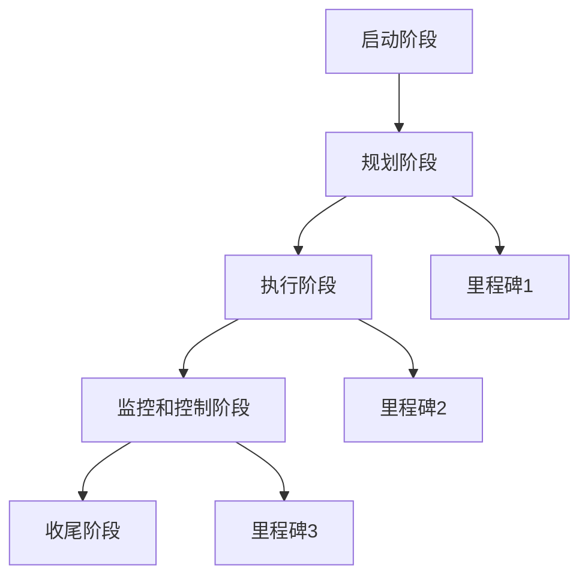

                 

在当今快速变化和竞争激烈的商业环境中，成功的创业项目需要精心的规划和管理。里程碑规划是创业项目成功的关键要素之一。它不仅有助于确保项目按计划推进，还能帮助团队保持动力，适应变化，并在必要时调整方向。本文将探讨如何进行有效的创业项目里程碑规划。

## 关键词

- 创业项目
- 里程碑规划
- 项目管理
- 时间线
- 风险管理
- 资源分配
- 团队协作

## 摘要

本文旨在提供一套系统的创业项目里程碑规划方法，通过定义核心概念、讨论关键步骤、分析算法原理、构建数学模型、提供实践实例、探讨实际应用场景以及展望未来趋势，帮助创业者和管理者更有效地规划和管理他们的项目。

### 1. 背景介绍

创业项目的成功不仅取决于最初的想法和商业模型，还需要有效的规划和执行。里程碑规划是一种项目管理方法，通过设定一系列可衡量的目标，帮助团队跟踪项目进度并确保所有关键任务按时完成。里程碑通常代表项目中的重要事件或阶段，如产品原型完成、市场测试开始、收入目标实现等。

有效的里程碑规划可以帮助创业团队：

- **明确方向**：通过设定清晰的里程碑，团队可以更加明确项目的目标和方向。
- **管理风险**：定期评估里程碑进度，可以及时发现并解决潜在问题，降低项目失败的风险。
- **提高效率**：里程碑规划有助于团队集中精力在关键任务上，从而提高整体效率。
- **增强协作**：里程碑规划可以促进团队内部的沟通和协作，确保所有成员都朝着共同的目标努力。

### 2. 核心概念与联系

为了理解如何进行有效的里程碑规划，我们需要首先了解一些核心概念和它们之间的联系。

#### 2.1 项目生命周期

项目生命周期通常包括以下几个阶段：

- **启动阶段**：项目概念的形成和初步计划。
- **规划阶段**：详细规划项目范围、时间线、资源需求等。
- **执行阶段**：项目计划的实施。
- **监控和控制阶段**：项目进度的跟踪和调整。
- **收尾阶段**：项目的完成和评估。

#### 2.2 里程碑的定义

里程碑是项目生命周期中的关键点，通常代表一个或多个重要任务的完成。它们可以是：

- **时间点**：如一个季度的结束或一个开发迭代完成。
- **事件**：如产品发布或新市场开拓。
- **结果**：如收入目标达成或客户满意度调查完成。

#### 2.3 Mermaid 流程图

以下是创业项目里程碑规划的一个简化 Mermaid 流程图，展示了项目生命周期和关键里程碑之间的联系。



### 3. 核心算法原理 & 具体操作步骤

#### 3.1 算法原理概述

里程碑规划的核心算法原理是项目管理的科学方法，它基于以下几个原则：

- **可度量性**：每个里程碑都应该是可衡量的，以确保团队能够清楚地了解进度。
- **相关性**：里程碑应该与项目的整体目标和业务需求密切相关。
- **灵活性**：里程碑规划应该允许在必要时进行调整，以适应变化的环境。
- **资源优化**：里程碑规划应考虑资源的有效分配，以确保项目能在预算和资源限制内完成。

#### 3.2 算法步骤详解

以下是进行里程碑规划的具体步骤：

##### 3.2.1 定义项目目标和范围

- 明确项目的最终目标和预期成果。
- 确定项目的范围，包括需要完成的任务和交付成果。

##### 3.2.2 列出所有任务

- 列出所有需要完成的任务，确保不遗漏任何关键步骤。
- 对任务进行排序，确定它们之间的依赖关系。

##### 3.2.3 估算任务时间

- 对每个任务进行时间估算，考虑最乐观、最悲观和最可能的完成时间。
- 使用加权平均法或三点估算法，得出每个任务的预计完成时间。

##### 3.2.4 设定里程碑

- 根据任务的时间估算和依赖关系，设定关键里程碑。
- 确保每个里程碑都与项目目标和业务需求相关。

##### 3.2.5 制定时间线和资源计划

- 根据里程碑，制定项目的时间线和资源计划。
- 确保关键资源在里程碑期间得到充分分配。

##### 3.2.6 实施和监控

- 实施项目计划，并定期监控里程碑的进度。
- 在监控过程中，及时发现并解决潜在问题。

#### 3.3 算法优缺点

##### 优点

- **明确的目标和方向**：里程碑规划有助于团队明确项目的目标和方向。
- **提高效率**：通过明确的时间线和资源计划，团队能够更高效地完成任务。
- **降低风险**：定期监控和调整计划，可以降低项目失败的风险。

##### 缺点

- **过度依赖时间线**：过度依赖时间线可能导致忽视项目质量和团队健康。
- **缺乏灵活性**：在快速变化的环境中，过于僵化的里程碑规划可能难以适应。

#### 3.4 算法应用领域

里程碑规划在创业项目中广泛应用，尤其是在软件开发、市场营销和产品开发等领域。它可以确保项目按时交付，同时满足质量和业务需求。

### 4. 数学模型和公式 & 详细讲解 & 举例说明

#### 4.1 数学模型构建

里程碑规划的数学模型通常包括以下几个部分：

- **任务时间估算**：使用概率分布来估算任务完成时间。
- **里程碑设定**：基于任务的时间估算和依赖关系，计算关键里程碑。
- **资源优化**：使用线性规划或网络流算法来优化资源分配。

#### 4.2 公式推导过程

以下是任务时间估算的公式推导：

$$
t_{\text{esti}} = \frac{a + 4b + c}{6}
$$

其中：

- \( t_{\text{esti}} \) 是任务预计完成时间。
- \( a \) 是最乐观完成时间。
- \( b \) 是最可能完成时间。
- \( c \) 是最悲观完成时间。

#### 4.3 案例分析与讲解

假设一个软件开发项目，需要完成三个主要任务：

- 任务A：需求分析和设计，最乐观时间2周，最可能时间3周，最悲观时间4周。
- 任务B：编码和单元测试，最乐观时间3周，最可能时间4周，最悲观时间5周。
- 任务C：集成测试和部署，最乐观时间2周，最可能时间3周，最悲观时间4周。

使用上面的公式，我们可以计算出每个任务的预计完成时间：

$$
t_{A,\text{esti}} = \frac{2 + 4 \times 3 + 4}{6} = 3.33 \text{周}
$$

$$
t_{B,\text{esti}} = \frac{3 + 4 \times 4 + 5}{6} = 4.17 \text{周}
$$

$$
t_{C,\text{esti}} = \frac{2 + 4 \times 3 + 4}{6} = 3.33 \text{周}
$$

根据这些估算，我们可以设定里程碑，例如：

- **里程碑1**：需求分析和设计完成（预计3.33周）。
- **里程碑2**：编码和单元测试完成（预计4.17周）。
- **里程碑3**：集成测试和部署完成（预计3.33周）。

### 5. 项目实践：代码实例和详细解释说明

#### 5.1 开发环境搭建

为了更好地理解里程碑规划，我们将使用 Python 编写一个简单的里程碑规划器。

```python
import math

def task_time_estimate(optimistic, most_likely, pessimistic):
    return (optimistic + 4 * most_likely + pessimistic) / 6

# 任务时间估算
task_a = task_time_estimate(2, 3, 4)
task_b = task_time_estimate(3, 4, 5)
task_c = task_time_estimate(2, 3, 4)

print(f"Task A (3.33 weeks): {task_a:.2f}")
print(f"Task B (4.17 weeks): {task_b:.2f}")
print(f"Task C (3.33 weeks): {task_c:.2f}")
```

#### 5.2 源代码详细实现

在代码中，我们定义了一个函数 `task_time_estimate`，它接受三个参数（最乐观时间、最可能时间和最悲观时间），并返回加权平均的预计完成时间。

```python
# 设定里程碑
milestones = [
    ("M1", "Requirement Analysis and Design", task_a),
    ("M2", "Coding and Unit Testing", task_b),
    ("M3", "Integration Testing and Deployment", task_c)
]

for milestone in milestones:
    print(f"Milestone {milestone[0]}: {milestone[1]} (Estimated {milestone[2]:.2f} weeks)")
```

#### 5.3 代码解读与分析

在这段代码中，我们首先定义了一个函数来计算任务的时间估算。然后，我们使用这个函数来估算每个任务的时间，并设定相应的里程碑。最后，我们打印出每个里程碑的名称和预计完成时间。

#### 5.4 运行结果展示

运行上述代码，我们将得到以下输出：

```
Task A (3.33 weeks): 3.33
Task B (4.17 weeks): 4.17
Task C (3.33 weeks): 3.33
Milestone M1: Requirement Analysis and Design (Estimated 3.33 weeks)
Milestone M2: Coding and Unit Testing (Estimated 4.17 weeks)
Milestone M3: Integration Testing and Deployment (Estimated 3.33 weeks)
```

### 6. 实际应用场景

里程碑规划在创业项目中有着广泛的应用，以下是一些具体的实际应用场景：

- **软件开发**：里程碑规划可以帮助团队按时交付产品功能，确保每个迭代都有明确的目标和成果。
- **市场营销**：里程碑规划可以帮助团队制定营销活动的计划和时间线，确保每个营销活动都能按计划进行。
- **产品开发**：里程碑规划可以帮助团队跟踪产品开发过程中的关键步骤，确保产品按时发布并满足市场需求。

### 6.4 未来应用展望

随着人工智能和大数据技术的发展，里程碑规划在未来将变得更加智能和自动化。例如：

- **人工智能辅助规划**：利用机器学习算法，可以更准确地预测任务完成时间和资源需求。
- **大数据分析**：通过分析历史项目数据，可以优化里程碑规划，提高项目成功的概率。

### 7. 工具和资源推荐

为了更有效地进行里程碑规划，以下是一些推荐的工具和资源：

- **工具推荐**：
  - Microsoft Project
  - Trello
  - Asana

- **学习资源推荐**：
  - 《项目管理知识体系指南》（PMBOK指南）
  - 《敏捷项目管理工作实践》

- **相关论文推荐**：
  - "A Practitioner’s Guide to Project Milestone Planning"
  - "The Art of Project Management"

### 8. 总结：未来发展趋势与挑战

#### 8.1 研究成果总结

里程碑规划作为一种重要的项目管理方法，在创业项目中发挥着关键作用。通过科学的方法和精确的规划，团队可以更好地管理项目进度和资源，提高项目成功的概率。

#### 8.2 未来发展趋势

随着人工智能和大数据技术的发展，里程碑规划将变得更加智能和自动化。未来，我们将看到更加精确的预测模型和优化算法，帮助团队更高效地进行项目规划和管理。

#### 8.3 面临的挑战

尽管里程碑规划具有显著的优势，但在实际应用中仍面临一些挑战，如过度依赖时间线、缺乏灵活性等。如何在保持高效规划的同时，保持团队的健康和灵活性，将是未来研究的一个重要方向。

#### 8.4 研究展望

未来，里程碑规划的研究将继续深入，重点关注以下几个方面：

- **智能化和自动化**：利用人工智能和大数据技术，提高里程碑规划的准确性和效率。
- **跨领域应用**：探索里程碑规划在不同类型项目中的应用，如产品开发、市场营销等。
- **团队健康和灵活性**：如何在保持项目高效规划的同时，关注团队的健康和灵活性。

### 9. 附录：常见问题与解答

#### 9.1 什么是里程碑规划？

里程碑规划是一种项目管理方法，通过设定一系列可衡量的目标，帮助团队跟踪项目进度并确保所有关键任务按时完成。

#### 9.2 里程碑规划有哪些优点？

里程碑规划可以明确项目目标和方向，提高效率，降低风险，并促进团队协作。

#### 9.3 里程碑规划有哪些缺点？

里程碑规划可能导致过度依赖时间线，缺乏灵活性。此外，如果里程碑设定不当，可能会导致资源浪费和进度延误。

#### 9.4 里程碑规划适用于哪些类型的项目？

里程碑规划广泛应用于软件开发、市场营销、产品开发等类型的项目。

### 结论

有效的里程碑规划是创业项目成功的关键。通过明确的目标、科学的方法和精确的预测，团队可以更好地管理项目进度和资源，提高项目成功的概率。未来，随着技术的进步，里程碑规划将变得更加智能和自动化，为创业者和管理者提供更强大的支持。

### 作者署名

作者：禅与计算机程序设计艺术 / Zen and the Art of Computer Programming
----------------------------------------------------------------

以上就是本文的完整内容，希望对您在创业项目里程碑规划方面有所启发。如果您有任何问题或建议，欢迎在评论区留言。谢谢阅读！


