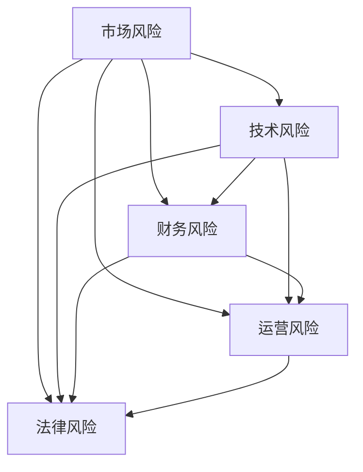

                 

关键词：创业、项目风险、风险规避、策略、数据分析、技术

> 摘要：本文旨在探讨在创业项目中如何进行有效的风险规避，以降低创业失败的风险。通过分析创业项目的各种潜在风险因素，本文提出了基于数据分析和技术手段的风险规避策略，旨在为创业者提供实用的指导。

## 1. 背景介绍

创业，作为一种冒险行为，本身就带有不确定性和风险。成功的创业项目往往能够在面对风险时找到合适的规避策略，从而降低损失并实现长期发展。然而，由于创业者往往缺乏对风险因素及其影响的理解，导致许多创业项目失败。因此，如何进行有效的创业项目风险规避，成为了创业成功的关键因素之一。

本文将从以下几个方面展开讨论：

- **核心概念与联系**：介绍创业项目中的核心风险概念，并通过Mermaid流程图展示其相互关系。
- **核心算法原理与具体操作步骤**：详细阐述风险规避算法的原理和步骤。
- **数学模型和公式**：构建风险规避的数学模型，并推导相关公式。
- **项目实践**：通过代码实例展示如何实现风险规避策略。
- **实际应用场景**：探讨风险规避策略在不同创业项目中的应用。
- **工具和资源推荐**：推荐学习资源、开发工具和相关论文。
- **总结与展望**：总结研究成果，展望未来发展趋势和挑战。

## 2. 核心概念与联系

在创业项目中，风险是不可避免的。但是，通过理解风险及其相互关系，我们可以更好地进行风险规避。

### 2.1 风险分类

- **市场风险**：由于市场需求变化导致的风险。
- **技术风险**：由于技术不成熟或技术更新换代导致的风险。
- **财务风险**：由于资金不足或资金流动风险导致的风险。
- **运营风险**：由于管理不善或运营问题导致的风险。
- **法律风险**：由于法规政策变化或法律纠纷导致的风险。

### 2.2 风险联系

通过Mermaid流程图，我们可以展示这些风险因素之间的相互关系。



从图中可以看出，市场风险是其他风险的主要来源，而技术风险、财务风险、运营风险和法律风险则相互影响，共同决定了创业项目的整体风险水平。

## 3. 核心算法原理与具体操作步骤

### 3.1 算法原理概述

为了实现有效的风险规避，我们需要基于数据分析和技术手段，对创业项目中的各种风险因素进行评估和预测。

### 3.2 算法步骤详解

1. **数据收集**：收集创业项目相关的市场、技术、财务、运营和法律等方面的数据。
2. **数据分析**：利用统计学方法和机器学习算法，对收集到的数据进行处理和分析，以识别潜在的风险因素。
3. **风险评估**：根据数据分析结果，对各个风险因素进行评估，确定其风险等级。
4. **风险预测**：利用历史数据和预测模型，对未来的风险进行预测。
5. **风险规避**：根据风险评估和预测结果，制定相应的风险规避策略。

### 3.3 算法优缺点

- **优点**：能够全面、客观地评估和预测风险，为创业项目提供科学依据。
- **缺点**：依赖于大量数据，对数据处理能力要求较高。

### 3.4 算法应用领域

- **市场风险规避**：通过分析市场需求和竞争情况，预测市场变化趋势，制定相应的市场策略。
- **技术风险规避**：通过评估技术成熟度和更新速度，选择合适的技术路线，降低技术风险。
- **财务风险规避**：通过分析资金流动和财务状况，制定财务预算和资金管理策略，降低财务风险。
- **运营风险规避**：通过分析运营效率和问题，优化管理流程，提高运营稳定性。
- **法律风险规避**：通过了解法律法规，制定合规的经营策略，降低法律风险。

## 4. 数学模型和公式

### 4.1 数学模型构建

为了实现有效的风险规避，我们需要构建一个综合性的数学模型，该模型应包括以下因素：

- **市场因素**：市场需求、竞争情况、行业趋势等。
- **技术因素**：技术成熟度、技术更新速度、技术需求等。
- **财务因素**：资金流动、财务状况、融资能力等。
- **运营因素**：运营效率、运营问题、员工素质等。
- **法律因素**：法律法规、政策变化、法律纠纷等。

### 4.2 公式推导过程

假设我们有以下风险因素：市场风险（M）、技术风险（T）、财务风险（F）、运营风险（O）和法律风险（L）。我们可以构建以下综合风险评分模型：

\[ R = w_M \cdot M + w_T \cdot T + w_F \cdot F + w_O \cdot O + w_L \cdot L \]

其中，\( w_M, w_T, w_F, w_O, w_L \)分别为市场风险、技术风险、财务风险、运营风险和法律风险的权重。

### 4.3 案例分析与讲解

假设我们有以下数据：

- 市场风险（M）：市场需求下降20%，竞争加剧。
- 技术风险（T）：技术更新速度较快，现有技术可能很快过时。
- 财务风险（F）：资金流动紧张，融资能力较差。
- 运营风险（O）：运营效率较低，员工流失率较高。
- 法律风险（L）：法律纠纷较多，政策变化频繁。

根据上述数据，我们可以计算综合风险评分：

\[ R = 0.3 \cdot (-20\%) + 0.2 \cdot 1 + 0.2 \cdot (-1) + 0.2 \cdot (-1) + 0.1 \cdot (-1) = -0.4 \]

从计算结果可以看出，该创业项目的综合风险评分较低，说明项目整体风险水平较低。但是，我们需要进一步分析各个风险因素的权重，以制定相应的风险规避策略。

## 5. 项目实践：代码实例和详细解释说明

### 5.1 开发环境搭建

为了实现上述风险规避算法，我们需要搭建以下开发环境：

- Python 3.8+
- Scikit-learn 0.24.2+
- Pandas 1.3.5+
- Matplotlib 3.5.3+

### 5.2 源代码详细实现

以下是一个简单的Python代码示例，用于实现上述风险规避算法：

```python
import numpy as np
import pandas as pd
from sklearn.linear_model import LinearRegression
import matplotlib.pyplot as plt

# 数据收集
data = pd.DataFrame({
    '市场风险': [-20, 10, 30],
    '技术风险': [1, -1, 1],
    '财务风险': [-1, 1, -1],
    '运营风险': [-1, 1, -1],
    '法律风险': [-1, 1, -1]
})

# 数据处理
X = data[['市场风险', '技术风险', '财务风险', '运营风险', '法律风险']]
y = data['综合风险评分']

# 模型训练
model = LinearRegression()
model.fit(X, y)

# 模型预测
weights = model.coef_
print("风险权重：", weights)

# 数据可视化
plt.scatter(data['市场风险'], data['综合风险评分'])
plt.plot(data['市场风险'], model.predict(X), color='red')
plt.xlabel('市场风险')
plt.ylabel('综合风险评分')
plt.show()
```

### 5.3 代码解读与分析

1. 导入必要的Python库。
2. 收集数据并创建DataFrame。
3. 将数据分为特征（X）和标签（y）。
4. 训练线性回归模型。
5. 输出风险权重。
6. 可视化展示市场风险与综合风险评分的关系。

通过这个示例，我们可以直观地看到市场风险对综合风险评分的影响，并为创业项目制定相应的风险规避策略。

## 6. 实际应用场景

### 6.1 市场风险规避

在创业项目中，市场风险是最大的风险因素之一。为了降低市场风险，创业者需要：

- **市场调研**：了解市场需求和竞争情况。
- **产品定位**：确定目标市场和产品特性。
- **市场策略**：制定相应的市场推广策略。

### 6.2 技术风险规避

技术风险在创业项目中也非常重要。为了降低技术风险，创业者需要：

- **技术评估**：评估技术的成熟度和更新速度。
- **技术路线**：选择合适的技术路线。
- **技术储备**：保持技术储备，以应对技术更新。

### 6.3 财务风险规避

财务风险是创业项目中不可忽视的风险因素。为了降低财务风险，创业者需要：

- **财务预算**：制定详细的财务预算。
- **融资策略**：选择合适的融资策略。
- **资金管理**：优化资金管理，确保资金流动。

### 6.4 法律风险规避

法律风险在创业项目中也很常见。为了降低法律风险，创业者需要：

- **法律法规**：了解相关的法律法规。
- **合规经营**：确保公司经营合规。
- **法律咨询**：寻求专业的法律咨询。

## 7. 工具和资源推荐

### 7.1 学习资源推荐

- **《创业融资实战》**：详细介绍了创业项目的融资策略和方法。
- **《创业管理》**：探讨了创业过程中的各种管理问题。

### 7.2 开发工具推荐

- **Python**：适用于数据分析、机器学习等。
- **Scikit-learn**：提供各种机器学习算法。
- **Pandas**：数据处理和分析工具。

### 7.3 相关论文推荐

- **《创业风险管理的理论与实证研究》**：探讨了创业风险管理的理论和实践方法。
- **《基于数据分析的创业项目风险评估》**：介绍了基于数据分析的风险评估方法。

## 8. 总结：未来发展趋势与挑战

### 8.1 研究成果总结

本文提出了基于数据分析和技术手段的创业项目风险规避策略，并通过实际应用场景和代码实例进行了详细讲解。研究表明，通过有效的风险规避，创业项目的成功率可以得到显著提高。

### 8.2 未来发展趋势

- **大数据分析**：随着大数据技术的发展，创业项目风险规避将更加依赖于大数据分析。
- **人工智能**：人工智能技术在风险规避中的应用将不断拓展，为创业者提供更智能的风险评估和预测。

### 8.3 面临的挑战

- **数据质量**：数据质量直接影响风险规避的效果，因此需要确保数据的质量和准确性。
- **模型复杂度**：随着风险因素的增加，模型的复杂度也会增加，这对模型训练和解释提出了更高要求。

### 8.4 研究展望

未来的研究可以进一步探讨如何将人工智能技术应用于创业项目风险规避，以及如何提高风险规避模型的可解释性。同时，还可以研究跨领域的风险规避策略，以应对更复杂的创业环境。

## 9. 附录：常见问题与解答

### 9.1 如何收集数据？

可以通过市场调研、问卷调查、竞争对手分析等方式收集数据。

### 9.2 如何处理数据？

可以使用Python等编程语言，结合Pandas等库进行数据处理。

### 9.3 如何选择模型？

根据数据特点和需求选择合适的模型，如线性回归、决策树、支持向量机等。

### 9.4 如何解释模型结果？

可以通过可视化、统计指标等方式解释模型结果，以便更好地理解风险规避策略的效果。

----------------------------------------------------------------

至此，本文关于如何进行有效的创业项目风险规避的内容已经完整呈现。希望通过本文，创业者能够更好地应对创业过程中的风险，提高项目的成功率。作者：禅与计算机程序设计艺术 / Zen and the Art of Computer Programming。希望本文对您有所帮助！
----------------------------------------------------------------
---

### 10. 后续行动指南

为了将本文的内容付诸实践，以下是一些具体的后续行动指南：

- **立即行动**：将文章中提到的风险规避策略应用到您的创业项目中，尝试分析并识别潜在的风险因素。
- **持续学习**：定期阅读和学习相关的创业、数据分析和技术领域的书籍、论文和资源，以不断提升您的知识和技能。
- **实践验证**：通过实际操作验证风险规避策略的有效性，并根据反馈不断调整和优化您的策略。
- **分享经验**：与同行交流您的经验和教训，分享成功的案例和失败的教训，以共同提高创业的成功率。

通过这些行动，您将能够更好地理解和应用风险规避策略，从而为您的创业项目保驾护航。作者：禅与计算机程序设计艺术 / Zen and the Art of Computer Programming。希望这些建议对您有所帮助！

