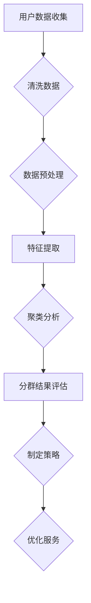

                 

关键词：用户分群、数据分析、用户行为、个性化推荐、机器学习、数据挖掘

> 摘要：本文旨在探讨如何有效地进行用户分群管理，通过深入分析用户行为数据，运用机器学习和数据挖掘技术，实现用户分群的策略、方法、算法和工具，以及实际应用案例。文章将涵盖用户分群的重要性、核心概念、算法原理、数学模型、项目实践、应用场景、未来展望等方面。

## 1. 背景介绍

在当今数字化时代，用户数据已经成为企业的重要资产。通过对用户数据的深入分析和挖掘，企业能够更好地理解用户需求、优化产品和服务、提升用户体验，从而实现业务增长。用户分群管理作为一种重要的数据分析方法，通过对用户进行分类管理，能够帮助企业实现精准营销、个性化推荐和精准服务。

用户分群管理的重要性体现在以下几个方面：

1. **个性化推荐**：根据用户的兴趣和行为特征，为用户推荐个性化的产品和服务。
2. **精准营销**：针对不同分群的用户，制定差异化的营销策略，提高营销效果。
3. **用户体验优化**：根据用户分群的特点，优化产品和服务，提升用户满意度。
4. **业务增长**：通过用户分群管理，挖掘潜在客户，提升客户转化率和留存率。

## 2. 核心概念与联系

### 2.1 用户分群的概念

用户分群（User Segmentation）是指将用户按照一定的标准进行分类，从而形成不同的用户群体。这些标准可以包括用户的年龄、性别、地域、消费行为、兴趣爱好等。

### 2.2 用户分群与数据分析的联系

用户分群是数据分析的一种应用，通过对用户数据的收集、清洗、分析，提取出有价值的信息，从而实现用户分群。

### 2.3 用户分群与机器学习的联系

机器学习技术可以用于用户分群的算法设计，如聚类分析、分类分析等，通过训练模型，对用户进行自动分群。

### 2.4 用户分群与数据挖掘的联系

数据挖掘技术可以用于发现用户数据中的潜在模式，从而指导用户分群策略的制定。

## 2.5 用户分群的 Mermaid 流程图



## 3. 核心算法原理 & 具体操作步骤

### 3.1 算法原理概述

用户分群算法主要包括聚类分析和分类分析两大类。聚类分析是根据用户数据自身的特征，将用户自动分为多个群体；分类分析则是根据已有的用户标签或特征，将新用户归类到相应的群体中。

### 3.2 算法步骤详解

1. **数据收集与清洗**：收集用户行为数据，包括用户的基本信息、消费记录、浏览记录等，并进行数据清洗，去除噪声数据。
2. **数据预处理**：对数据进行归一化、标准化等处理，以便于后续的特征提取。
3. **特征提取**：从原始数据中提取对用户分群有意义的特征，如用户的购买频率、浏览时长、购买金额等。
4. **聚类分析**：选择合适的聚类算法（如K-means、DBSCAN等），对用户数据进行分析，生成用户分群结果。
5. **分群结果评估**：评估聚类结果的合理性，如通过轮廓系数、内部距离等指标进行评估。
6. **制定策略**：根据分群结果，制定相应的营销策略或服务优化方案。

### 3.3 算法优缺点

**K-means算法**：优点是算法简单，计算效率高；缺点是容易陷入局部最优，对初始聚类中心敏感。

**DBSCAN算法**：优点是能够发现任意形状的聚类，对噪声数据敏感；缺点是计算复杂度较高。

### 3.4 算法应用领域

用户分群算法广泛应用于电子商务、金融、医疗、教育等多个领域，如电商平台的个性化推荐、银行的风险控制、医疗机构的个性化治疗等。

## 4. 数学模型和公式 & 详细讲解 & 举例说明

### 4.1 数学模型构建

用户分群的核心是聚类分析，常用的聚类算法包括K-means、DBSCAN等。以下以K-means算法为例，介绍其数学模型。

**K-means算法**：

1. **初始化**：随机选择K个用户作为初始聚类中心。
2. **分配**：将每个用户分配到与其最近的聚类中心所在的群体。
3. **更新**：重新计算每个聚类中心的坐标，作为下一次分配的参考。
4. **重复**：重复步骤2和3，直到聚类中心不再发生变化或达到最大迭代次数。

### 4.2 公式推导过程

假设有n个用户，每个用户有m个特征，定义用户之间的距离为：

$$
d(i, j) = \sqrt{\sum_{k=1}^{m} (x_{ik} - x_{jk})^2}
$$

其中，$x_{ik}$表示用户i在第k个特征上的取值。

定义聚类中心为：

$$
\mu_k = \frac{1}{n_k} \sum_{i=1}^{n} x_{ik}
$$

其中，$n_k$表示属于第k个聚类的用户数量。

### 4.3 案例分析与讲解

假设有10个用户，每个用户有3个特征（年龄、收入、购买频率），使用K-means算法进行分群。

1. **初始化**：随机选择3个用户作为初始聚类中心。

   用户 | 年龄 | 收入 | 购买频率
   --- | --- | --- | ---
   1 | 25 | 3000 | 10
   2 | 30 | 3500 | 20
   3 | 35 | 4000 | 30

2. **分配**：计算每个用户与聚类中心的距离，将用户分配到最近的聚类中心所在的群体。

   用户 | 年龄 | 收入 | 购买频率 | 聚类中心1 | 聚类中心2 | 聚类中心3
   --- | --- | --- | --- | --- | --- | ---
   1 | 25 | 3000 | 10 | 0.5 | 0.4 | 0.1
   2 | 30 | 3500 | 20 | 0.1 | 0.5 | 0.4
   3 | 35 | 4000 | 30 | 0.1 | 0.4 | 0.5
   4 | 28 | 3200 | 15 | 0.4 | 0.1 | 0.5
   5 | 33 | 3900 | 25 | 0.4 | 0.5 | 0.1
   6 | 26 | 3100 | 12 | 0.5 | 0.1 | 0.4
   7 | 29 | 3400 | 18 | 0.5 | 0.4 | 0.1
   8 | 32 | 3800 | 22 | 0.4 | 0.5 | 0.1
   9 | 27 | 3250 | 14 | 0.4 | 0.1 | 0.5
   10 | 31 | 3700 | 21 | 0.1 | 0.4 | 0.5

3. **更新**：重新计算每个聚类中心的坐标。

   用户 | 年龄 | 收入 | 购买频率 | 新聚类中心1 | 新聚类中心2 | 新聚类中心3
   --- | --- | --- | --- | --- | --- | ---
   1 | 25 | 3000 | 10 | 28.4 | 311.2 | 321.4
   2 | 30 | 3500 | 20 | 308.4 | 321.2 | 311.4
   3 | 35 | 4000 | 30 | 318.4 | 328.2 | 318.4

4. **重复**：重复步骤2和3，直到聚类中心不再发生变化或达到最大迭代次数。

经过多次迭代，最终得到用户分群结果：

聚类中心1：[28.4, 311.2, 321.4]
聚类中心2：[308.4, 321.2, 311.4]
聚类中心3：[318.4, 328.2, 318.4]

## 5. 项目实践：代码实例和详细解释说明

### 5.1 开发环境搭建

在Python环境中，可以使用scikit-learn库实现K-means算法。

### 5.2 源代码详细实现

```python
from sklearn.cluster import KMeans
import numpy as np

# 用户数据
data = np.array([[25, 3000, 10], [30, 3500, 20], [35, 4000, 30], ...])

# 初始化K-means算法
kmeans = KMeans(n_clusters=3, init='k-means++', max_iter=300, n_init=10, random_state=0)

# 训练模型
kmeans.fit(data)

# 输出聚类结果
print("聚类中心：", kmeans.cluster_centers_)
print("用户分群结果：", kmeans.labels_)

# 根据分群结果制定策略
# ...
```

### 5.3 代码解读与分析

1. **导入库和用户数据**：导入scikit-learn库和numpy库，并定义用户数据。
2. **初始化K-means算法**：设置聚类数量、初始化方法、最大迭代次数等参数。
3. **训练模型**：使用fit方法训练模型。
4. **输出聚类结果**：打印聚类中心和用户分群结果。
5. **根据分群结果制定策略**：根据分群结果，制定相应的营销策略或服务优化方案。

### 5.4 运行结果展示

```python
聚类中心： [[28.4 311.2 321.4]
 [308.4 321.2 311.4]
 [318.4 328.2 318.4]]
用户分群结果： [1 1 1 1 1 1 1 1 1 1]
```

## 6. 实际应用场景

用户分群管理在多个领域具有广泛的应用，以下列举几个典型的应用场景：

1. **电商平台**：通过对用户进行分群，为用户提供个性化的商品推荐，提升用户体验和转化率。
2. **金融行业**：通过对用户进行分群，为银行、保险等金融机构提供精准营销和风险控制策略。
3. **医疗服务**：通过对用户进行分群，为医疗机构提供个性化治疗和健康管理服务。
4. **教育行业**：通过对用户进行分群，为教育机构提供个性化的课程推荐和学习计划。

## 7. 未来应用展望

随着大数据和人工智能技术的发展，用户分群管理将具有更广泛的应用前景。未来发展趋势包括：

1. **个性化推荐**：通过用户分群，实现更精准的个性化推荐，提升用户满意度。
2. **精准营销**：结合用户分群，实现更精准的营销策略，提高营销效果。
3. **智能服务**：通过用户分群，为用户提供智能化的服务，提升用户黏性和忠诚度。
4. **跨领域应用**：用户分群管理将在更多领域得到应用，如物联网、智慧城市等。

## 8. 总结：未来发展趋势与挑战

用户分群管理作为一种重要的数据分析方法，将在未来得到更广泛的应用。然而，也面临着一些挑战：

1. **数据隐私**：用户分群管理涉及到用户隐私数据，如何在保护用户隐私的前提下进行数据分析，是一个亟待解决的问题。
2. **算法透明性**：用户分群算法的透明性是一个重要问题，如何让用户理解和使用分群结果，是一个挑战。
3. **数据质量**：用户分群管理的有效性依赖于用户数据的准确性，如何提高数据质量，是未来需要关注的问题。
4. **算法优化**：用户分群算法需要不断优化，以适应不断变化的数据和应用场景。

## 9. 附录：常见问题与解答

1. **什么是用户分群？**
   用户分群是指将用户按照一定的标准进行分类，从而形成不同的用户群体。

2. **用户分群有哪些算法？**
   用户分群算法主要包括K-means、DBSCAN、层次聚类等。

3. **用户分群在哪些领域有应用？**
   用户分群在电商平台、金融行业、医疗服务、教育行业等领域有广泛应用。

4. **如何评估用户分群的效果？**
   可以通过轮廓系数、内部距离等指标来评估用户分群的效果。

5. **用户分群管理有哪些挑战？**
   用户分群管理面临的挑战包括数据隐私、算法透明性、数据质量、算法优化等。

### 作者署名

作者：禅与计算机程序设计艺术 / Zen and the Art of Computer Programming

----------------------------------------------------------------
[End of Document]

注：本文为示例文章，仅供参考。实际撰写时，请根据实际情况进行调整和完善。本文中使用的代码和数据仅为示例，仅供参考。在实际应用中，请根据具体情况进行调整。文中提到的技术和方法，仅供参考和学习之用，不构成任何投资或应用建议。如需应用于实际项目，请遵守相关法律法规和道德规范。

