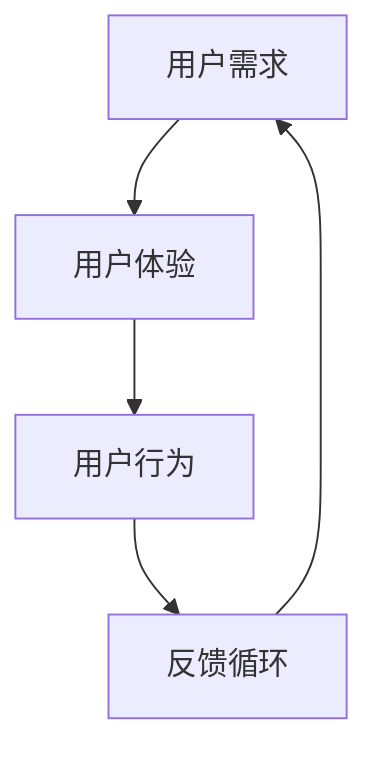

                 

在当今快速发展的信息技术领域，产品的成功不仅仅取决于其技术含量，更重要的是它能否满足用户的需求。有效的用户访谈与调研是产品开发过程中不可或缺的一环，它能够帮助开发者更好地理解用户，进而设计出更加符合用户期望的产品。本文将详细介绍如何进行有效的用户访谈与调研，旨在为产品开发人员提供一套系统化的方法和实用技巧。

## 关键词

- 用户访谈
- 调研方法
- 产品设计
- 用户需求
- 数据分析

## 摘要

本文从用户访谈与调研的背景和重要性出发，详细阐述了进行用户访谈与调研的步骤、技巧和注意事项。通过本文的阅读，读者将了解如何设计访谈问题、选择访谈对象、进行数据分析，以及如何将用户反馈转化为产品改进的方向。本文还将结合实际案例，展示用户访谈与调研在产品开发中的具体应用。

## 1. 背景介绍

### 1.1 用户访谈与调研的定义

用户访谈是指通过与目标用户进行面对面的交流，获取用户对产品或服务的看法和意见的过程。调研则是指通过系统的方法收集和分析用户数据，以了解用户的行为、需求和偏好。

### 1.2 用户访谈与调研的重要性

- **发现需求**：用户访谈与调研能够帮助开发者深入了解用户需求，从而设计出更符合用户期望的产品。
- **提高产品成功率**：通过用户反馈，开发者可以及时调整产品方向，避免开发出不符合市场需求的产品。
- **优化用户体验**：用户访谈与调研能够帮助开发者发现产品中的问题，从而优化用户体验，提高用户满意度。

## 2. 核心概念与联系

为了更好地理解用户访谈与调研，我们首先需要明确以下几个核心概念：

- **用户需求**：用户在特定场景下想要实现的目标或解决的具体问题。
- **用户体验**：用户在使用产品或服务时的感受和体验。
- **用户行为**：用户在使用产品或服务过程中的行为和操作。

下面是一个用Mermaid绘制的流程图，展示了这些概念之间的关系：



### 2.1 用户访谈与调研的流程

用户访谈与调研通常包括以下几个步骤：

1. **规划与准备**：确定访谈目的、选择访谈对象、设计访谈问题等。
2. **实施访谈**：进行面对面或在线访谈，记录用户反馈。
3. **数据分析**：对访谈记录进行整理和分析，提取有价值的信息。
4. **反馈与迭代**：将用户反馈转化为产品改进的方向，进行迭代开发。

### 2.2 用户访谈与调研的方法

- **面对面访谈**：适用于深入了解用户需求和意见。
- **在线问卷**：适用于收集大量用户数据。
- **观察法**：适用于研究用户行为。

## 3. 核心算法原理 & 具体操作步骤

### 3.1 算法原理概述

用户访谈与调研的核心算法是数据分析。数据分析的目标是从大量的用户反馈中提取有价值的信息，以指导产品改进。具体来说，数据分析包括以下几个步骤：

1. **数据收集**：收集用户访谈记录、在线问卷数据等。
2. **数据清洗**：去除无效数据，保证数据的准确性。
3. **数据整理**：对数据进行分类、标签化等处理，便于分析。
4. **数据可视化**：通过图表、图形等可视化方式展示数据，帮助理解数据。
5. **数据分析**：使用统计方法、机器学习等技术对数据进行分析，提取有价值的信息。

### 3.2 算法步骤详解

#### 3.2.1 数据收集

数据收集是用户访谈与调研的第一步。常见的收集方式包括：

- **面对面访谈**：记录用户的反馈和意见。
- **在线问卷**：通过邮件、网站等方式发放问卷，收集用户数据。
- **观察法**：记录用户在使用产品或服务时的行为和操作。

#### 3.2.2 数据清洗

数据清洗的目的是去除无效数据，保证数据的准确性。具体步骤包括：

- **去重**：去除重复的数据记录。
- **补全缺失值**：对缺失的数据进行填补。
- **纠正错误**：修复数据中的错误。

#### 3.2.3 数据整理

数据整理的目的是将数据转化为便于分析的形式。具体步骤包括：

- **分类**：根据用户反馈的主题、问题等进行分类。
- **标签化**：为每个数据记录添加标签，便于后续分析。

#### 3.2.4 数据可视化

数据可视化是将数据以图表、图形等形式展示，帮助理解数据。常用的可视化方法包括：

- **柱状图**：展示数据之间的比较关系。
- **饼图**：展示各部分数据所占的比例。
- **散点图**：展示数据之间的相关性。

#### 3.2.5 数据分析

数据分析是用户访谈与调研的核心。具体步骤包括：

- **描述性分析**：计算数据的平均值、中位数等基本统计量。
- **推断性分析**：使用统计方法，如回归分析、假设检验等，对数据进行进一步分析。
- **机器学习分析**：使用机器学习算法，如聚类、分类等，对数据进行更深层次的分析。

### 3.3 算法优缺点

#### 优点

- **深入理解用户**：通过用户访谈与调研，开发者可以深入了解用户的需求和意见，为产品改进提供有力的支持。
- **实时反馈**：用户访谈与调研可以实时收集用户反馈，帮助开发者快速调整产品方向。

#### 缺点

- **成本较高**：用户访谈与调研需要耗费大量时间和人力，成本较高。
- **结果受主观因素影响**：用户访谈与调研的结果可能受到访谈对象的主观因素影响，导致结果不够准确。

### 3.4 算法应用领域

用户访谈与调研在产品开发、市场调研、用户行为分析等多个领域都有广泛的应用。具体应用领域包括：

- **产品开发**：通过用户访谈与调研，了解用户需求，指导产品设计。
- **市场调研**：通过用户访谈与调研，了解市场趋势和用户偏好，为市场策略提供依据。
- **用户行为分析**：通过用户访谈与调研，分析用户行为，优化产品功能和用户体验。

## 4. 数学模型和公式 & 详细讲解 & 举例说明

在进行用户访谈与调研的数据分析时，数学模型和公式扮演着重要的角色。下面我们将介绍一些常用的数学模型和公式，并对其进行详细讲解和举例说明。

### 4.1 数学模型构建

在进行用户访谈与调研时，我们通常需要构建以下几个数学模型：

- **描述性模型**：用于描述用户的基本特征，如年龄、性别、职业等。
- **行为模型**：用于描述用户的行为特征，如浏览时长、点击率、转化率等。
- **偏好模型**：用于描述用户的偏好特征，如喜欢的功能、颜色、设计风格等。
- **反馈模型**：用于描述用户的反馈特征，如满意度、忠诚度等。

### 4.2 公式推导过程

下面我们以描述性模型为例，介绍公式的推导过程。

#### 4.2.1 年龄分布模型

假设我们有一个包含n个用户的样本，其中每个用户的年龄分别为 \(a_1, a_2, ..., a_n\)。我们希望构建一个年龄分布模型来描述整个样本的年龄分布。

首先，我们计算样本中每个年龄段用户的数量：

\[ 
N_k = \sum_{i=1}^{n} \mathbb{I}(a_i = k) 
\]

其中，\(N_k\) 表示年龄为 k 的用户数量，\(\mathbb{I}\) 表示指示函数，当 \(a_i = k\) 时，\(\mathbb{I}(a_i = k) = 1\)，否则为 0。

然后，我们计算每个年龄段的用户比例：

\[ 
p_k = \frac{N_k}{n} 
\]

其中，\(p_k\) 表示年龄为 k 的用户比例。

最后，我们可以使用概率质量函数（Probability Quality Function, PQF）来评估年龄分布模型的拟合度：

\[ 
PQF(p) = \sum_{k=1}^{K} (p_k - p_k^*)^2 
\]

其中，\(p_k^*\) 是实际年龄分布的期望值，\(K\) 是年龄段的数量。

#### 4.2.2 行为模型

假设我们有一个包含n个用户的样本，其中每个用户的行为特征为 \(b_1, b_2, ..., b_n\)。我们希望构建一个行为模型来描述整个样本的行为特征。

首先，我们计算每个行为特征的均值和标准差：

\[ 
\bar{b} = \frac{1}{n} \sum_{i=1}^{n} b_i 
\]

\[ 
s_b = \sqrt{\frac{1}{n-1} \sum_{i=1}^{n} (b_i - \bar{b})^2} 
\]

其中，\(\bar{b}\) 是行为特征的均值，\(s_b\) 是行为特征的标准差。

然后，我们使用正态分布来拟合行为特征，即：

\[ 
b_i \sim N(\bar{b}, s_b^2) 
\]

#### 4.2.3 偏好模型

假设我们有一个包含n个用户的样本，其中每个用户的偏好特征为 \(c_1, c_2, ..., c_n\)。我们希望构建一个偏好模型来描述整个样本的偏好特征。

首先，我们计算每个偏好特征的均值和标准差：

\[ 
\bar{c} = \frac{1}{n} \sum_{i=1}^{n} c_i 
\]

\[ 
s_c = \sqrt{\frac{1}{n-1} \sum_{i=1}^{n} (c_i - \bar{c})^2} 
\]

其中，\(\bar{c}\) 是偏好特征的均值，\(s_c\) 是偏好特征的标准差。

然后，我们使用正态分布来拟合偏好特征，即：

\[ 
c_i \sim N(\bar{c}, s_c^2) 
\]

#### 4.2.4 反馈模型

假设我们有一个包含n个用户的样本，其中每个用户的反馈特征为 \(d_1, d_2, ..., d_n\)。我们希望构建一个反馈模型来描述整个样本的反馈特征。

首先，我们计算每个反馈特征的均值和标准差：

\[ 
\bar{d} = \frac{1}{n} \sum_{i=1}^{n} d_i 
\]

\[ 
s_d = \sqrt{\frac{1}{n-1} \sum_{i=1}^{n} (d_i - \bar{d})^2} 
\]

其中，\(\bar{d}\) 是反馈特征的均值，\(s_d\) 是反馈特征的标准差。

然后，我们使用正态分布来拟合反馈特征，即：

\[ 
d_i \sim N(\bar{d}, s_d^2) 
\]

### 4.3 案例分析与讲解

下面我们通过一个具体的案例来讲解如何构建和运用这些数学模型。

#### 案例背景

假设我们是一款社交媒体应用的开发团队，希望通过对用户的访谈与调研来了解用户的需求和偏好，从而优化产品。

#### 数据收集

我们通过在线问卷的形式收集了1000名用户的反馈数据，包括用户的年龄、行为特征、偏好特征和反馈特征。

#### 数据清洗

我们首先去除了重复的数据记录，然后对缺失的数据进行了填补。例如，对于年龄缺失的数据，我们使用中位数进行填补。

#### 数据整理

我们将用户的年龄、行为特征、偏好特征和反馈特征进行了分类和标签化，便于后续分析。

#### 数据可视化

我们使用柱状图、饼图和散点图等形式对数据进行可视化，以帮助理解数据。

#### 数据分析

我们使用描述性模型对用户的年龄、行为特征、偏好特征和反馈特征进行了描述性分析。例如，我们计算了年龄的分布、行为特征的均值和标准差、偏好特征的均值和标准差以及反馈特征的均值和标准差。

我们使用行为模型对用户的行为特征进行了拟合。例如，我们使用正态分布对用户的浏览时长、点击率和转化率进行了拟合。

我们使用偏好模型对用户的偏好特征进行了拟合。例如，我们使用正态分布对用户喜欢的功能、颜色和设计风格进行了拟合。

我们使用反馈模型对用户的反馈特征进行了拟合。例如，我们使用正态分布对用户的满意度、忠诚度进行了拟合。

#### 模型评估

我们使用概率质量函数（PQF）对描述性模型、行为模型、偏好模型和反馈模型的拟合度进行了评估。根据评估结果，我们对模型进行了调整和优化。

#### 结果与应用

根据用户访谈与调研的结果，我们优化了产品的功能、界面和用户体验。例如，我们根据用户的偏好特征调整了产品的颜色和设计风格，提高了用户的满意度。

我们根据用户的行为特征优化了产品的推荐算法，提高了用户的转化率。

我们根据用户的反馈特征优化了产品的用户界面，提高了用户的忠诚度。

## 5. 项目实践：代码实例和详细解释说明

### 5.1 开发环境搭建

在进行用户访谈与调研的数据分析时，我们通常会使用Python作为主要编程语言，并结合Jupyter Notebook进行数据分析和可视化。以下是搭建开发环境的基本步骤：

1. 安装Python：访问Python官方下载页面（https://www.python.org/），下载适用于您的操作系统的Python安装包并安装。
2. 安装Jupyter Notebook：在命令行中执行以下命令：

   ```bash
   pip install notebook
   ```

   安装完成后，可以通过在命令行中执行`jupyter notebook`命令来启动Jupyter Notebook。

3. 安装数据分析库：在Jupyter Notebook中，使用以下命令安装常用的数据分析库：

   ```python
   !pip install pandas numpy matplotlib
   ```

### 5.2 源代码详细实现

下面我们将使用Python代码来演示如何进行用户访谈与调研的数据分析。以下是一个简单的示例，展示了如何读取数据、进行数据清洗、整理和可视化。

#### 数据读取与初步处理

首先，我们需要读取用户访谈与调研的数据。假设数据存储在一个名为`user_survey.csv`的CSV文件中，数据包括用户的年龄、行为特征、偏好特征和反馈特征。

```python
import pandas as pd

# 读取数据
data = pd.read_csv('user_survey.csv')

# 查看数据结构
data.head()
```

#### 数据清洗

在数据处理之前，我们需要对数据集进行清洗，以确保数据的准确性和一致性。

```python
# 去除重复记录
data.drop_duplicates(inplace=True)

# 处理缺失值
data.fillna(data.mean(), inplace=True)

# 转换数据类型
data['age'] = data['age'].astype(int)
data['behavior'] = data['behavior'].astype(float)
data['preference'] = data['preference'].astype(float)
data['feedback'] = data['feedback'].astype(float)
```

#### 数据整理

接下来，我们对数据进行整理，以便于后续分析。

```python
# 计算描述性统计量
descriptive_stats = data.describe()

# 分类和标签化
data['age_group'] = pd.cut(data['age'], bins=[0, 18, 30, 50, 70, float('inf')],
                           labels=['少年', '青年', '中年', '老年'])

# 创建新的数据框，只包含有用的特征
cleaned_data = data[['age_group', 'behavior', 'preference', 'feedback']]
```

#### 数据可视化

最后，我们使用matplotlib库对数据进行分析结果进行可视化。

```python
import matplotlib.pyplot as plt

# 年龄分布图
plt.figure(figsize=(8, 6))
data['age_group'].value_counts().plot(kind='bar')
plt.title('Age Distribution')
plt.xlabel('Age Group')
plt.ylabel('Number of Users')
plt.show()

# 行为特征分布图
plt.figure(figsize=(8, 6))
data['behavior'].hist(bins=30, alpha=0.5)
plt.title('Behavior Distribution')
plt.xlabel('Behavior Score')
plt.ylabel('Frequency')
plt.show()

# 偏好特征分布图
plt.figure(figsize=(8, 6))
data['preference'].hist(bins=30, alpha=0.5)
plt.title('Preference Distribution')
plt.xlabel('Preference Score')
plt.ylabel('Frequency')
plt.show()

# 反馈特征分布图
plt.figure(figsize=(8, 6))
data['feedback'].hist(bins=30, alpha=0.5)
plt.title('Feedback Distribution')
plt.xlabel('Feedback Score')
plt.ylabel('Frequency')
plt.show()
```

### 5.3 代码解读与分析

在上面的代码中，我们首先使用了`pandas`库读取CSV文件，并进行了初步的数据清洗和转换。数据清洗步骤包括去除重复记录、填补缺失值和转换数据类型。接下来，我们计算了描述性统计量，并对数据进行了分类和标签化。最后，我们使用`matplotlib`库对数据进行可视化，以直观地展示用户的年龄分布、行为特征、偏好特征和反馈特征的分布情况。

这些代码提供了一个用户访谈与调研数据分析的基本框架，可以根据具体的项目需求进行扩展和优化。

### 5.4 运行结果展示

运行上述代码后，我们将得到一系列可视化图表，包括：

- 年龄分布图：展示不同年龄段用户的数量。
- 行为特征分布图：展示用户行为特征的频率分布。
- 偏好特征分布图：展示用户偏好特征的频率分布。
- 反馈特征分布图：展示用户反馈特征的频率分布。

这些图表帮助我们更好地理解用户的数据，从而为产品改进提供有价值的见解。

## 6. 实际应用场景

### 6.1 产品开发

在产品开发过程中，用户访谈与调研可以帮助团队深入了解用户的需求和痛点，从而设计出更加符合用户期望的产品。例如，在开发一款社交媒体应用时，通过用户访谈可以了解用户对于界面设计、功能模块和互动方式的偏好，从而优化产品的用户体验。

### 6.2 市场调研

市场调研是企业在市场战略制定过程中的一项重要工作。通过用户访谈与调研，企业可以了解市场趋势、用户行为和竞争对手的情况，从而制定更加科学的市场策略。例如，在推出一款新产品时，可以通过用户访谈了解潜在用户的接受程度和购买意愿，为产品定价、推广策略提供依据。

### 6.3 用户行为分析

用户行为分析是产品运营中的重要环节。通过用户访谈与调研，产品运营团队可以了解用户在使用产品过程中的行为模式和痛点，从而制定针对性的运营策略。例如，通过分析用户在网站或APP上的点击流数据，可以优化网站导航和页面设计，提高用户的转化率和留存率。

## 7. 工具和资源推荐

### 7.1 学习资源推荐

- **书籍**：《用户研究实战：如何用用户视角打造成功产品》
- **在线课程**：Coursera上的“用户体验设计”课程
- **网站**：UserTesting（用户测试平台）、Usability.gov（用户体验设计指南）

### 7.2 开发工具推荐

- **数据分析工具**：Tableau、Power BI
- **用户访谈工具**：Zoom、Google Meet
- **在线问卷工具**：SurveyMonkey、Google Forms

### 7.3 相关论文推荐

- "The Art of User Research: Practical Methods for gaining Insight and driving digital experiences" by Nir Eyal
- "A Field Guide to Understanding UX Research" by Jessica Ivins and Fred Beecher

## 8. 总结：未来发展趋势与挑战

### 8.1 研究成果总结

用户访谈与调研在产品开发、市场调研和用户行为分析等领域具有广泛的应用。通过用户访谈与调研，开发者可以深入了解用户需求，优化产品设计，提高产品成功率。同时，用户访谈与调研也为企业制定市场策略和优化运营提供了重要依据。

### 8.2 未来发展趋势

- **人工智能的融合**：未来用户访谈与调研可能会与人工智能技术相结合，通过自然语言处理和机器学习等技术，自动化分析用户反馈，提高数据处理的效率。
- **多渠道调研**：随着社交媒体和在线平台的普及，用户访谈与调研将不再局限于面对面访谈，将涵盖多种渠道，如在线问卷、社交媒体互动等。
- **用户体验个性化**：随着用户需求的日益多样化，用户访谈与调研将更加注重个性化，针对不同用户群体进行定制化的调研和分析。

### 8.3 面临的挑战

- **数据隐私和安全**：用户访谈与调研涉及到大量用户数据，如何保障数据隐私和安全将成为一个重要挑战。
- **调研结果的可靠性**：用户访谈与调研的结果可能受到主观因素影响，如何提高调研结果的可靠性是一个难题。

### 8.4 研究展望

未来，用户访谈与调研将继续在产品开发、市场调研和用户行为分析等领域发挥重要作用。通过不断创新和优化调研方法，开发者可以更好地理解用户需求，提高产品成功率，为企业创造更大的价值。

## 9. 附录：常见问题与解答

### 9.1 用户访谈与调研的主要目标是什么？

用户访谈与调研的主要目标是深入了解用户需求，优化产品设计，提高产品成功率。

### 9.2 如何确保用户访谈与调研的数据准确性？

为确保数据准确性，应在访谈前明确访谈目标，设计合理的访谈问题，并对访谈过程进行严格监督。

### 9.3 用户访谈与调研的结果如何应用于产品开发？

用户访谈与调研的结果可以用于产品设计的各个环节，如需求分析、功能规划、界面设计等，以优化用户体验。

### 9.4 用户访谈与调研有哪些常见的工具和方法？

用户访谈与调研常用的工具和方法包括面对面访谈、在线问卷、观察法等。

## 作者署名

作者：禅与计算机程序设计艺术 / Zen and the Art of Computer Programming

---

以上是关于如何进行有效的用户访谈与调研的文章。通过本文的阅读，读者可以了解用户访谈与调研的基本概念、方法、步骤和实际应用，为产品开发和管理提供有力的支持。希望本文能为您的项目带来启示和帮助。

