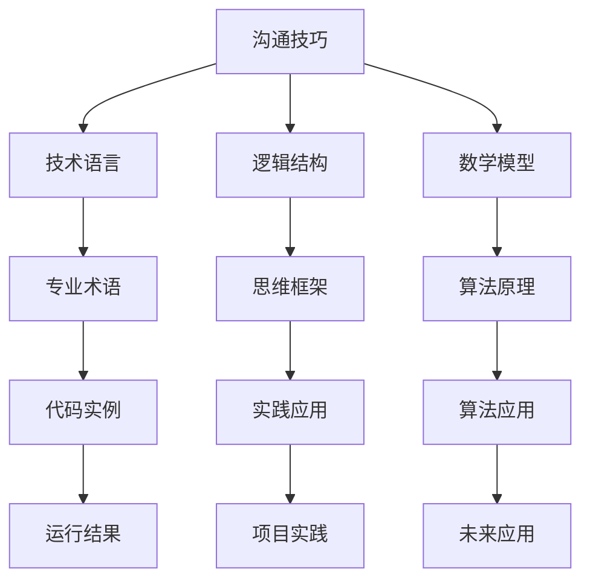

                 

关键词：沟通技巧、有效沟通、交流方法、技术语言、专业术语、逻辑结构、思维框架、数学模型、代码实例、实践应用、工具资源

> 摘要：本文旨在探讨在信息技术领域中，如何运用专业的技术语言和逻辑结构，进行有效的沟通和交流。通过梳理核心概念、阐述算法原理、提供数学模型、实例代码和实践应用，本文旨在帮助读者掌握沟通技巧，提升技术水平。

## 1. 背景介绍

在信息技术领域，沟通和交流是项目成功的关键。无论是团队成员之间的协作，还是与客户的沟通，都需要运用专业的技术语言和逻辑结构。本文将介绍如何运用这些技巧，以提高沟通效率和质量。

### 1.1 信息技术领域的沟通挑战

1. **专业术语的运用**：技术领域有其独特的专业术语，不熟悉这些术语的人可能会感到困惑。
2. **复杂性的挑战**：信息技术领域的项目往往涉及复杂的算法、架构和系统。
3. **缺乏标准**：不同团队和公司可能使用不同的技术标准和术语。

### 1.2 沟通的重要性

1. **提高工作效率**：清晰的沟通可以减少误解，加快项目进度。
2. **促进团队合作**：团队成员之间良好的沟通可以增进理解和信任。
3. **客户满意度**：与客户有效的沟通可以提高客户满意度，增强业务关系。

## 2. 核心概念与联系

为了更好地理解沟通技巧，我们需要梳理核心概念，并展示它们之间的联系。以下是一个使用 Mermaid 绘制的流程图，展示了核心概念和它们之间的关系。



### 2.1 技术语言

技术语言是信息技术领域的基石。掌握专业术语和语法规则，可以帮助我们更准确地表达技术概念。

### 2.2 逻辑结构

逻辑结构是沟通的核心。清晰的逻辑可以让信息传达得更加准确和高效。

### 2.3 数学模型

数学模型是信息技术领域的重要工具。它可以帮助我们分析和解决复杂问题。

### 2.4 算法原理

算法原理是技术实现的基础。理解算法原理可以帮助我们设计和优化技术解决方案。

## 3. 核心算法原理 & 具体操作步骤

### 3.1 算法原理概述

在信息技术领域，沟通技巧的核心算法是沟通模型。沟通模型包括以下步骤：

1. **信息编码**：将信息转化为技术语言和逻辑结构。
2. **信息传递**：通过合适的媒介和方式传递信息。
3. **信息解码**：接收方解码并理解信息。

### 3.2 算法步骤详解

#### 3.2.1 信息编码

信息编码是将口头或书面语言转化为技术术语和逻辑结构的过程。以下是几个关键步骤：

1. **明确目标**：确定信息传达的目的和受众。
2. **选择合适的术语**：根据受众的背景选择合适的术语。
3. **构建逻辑框架**：使用专业的逻辑结构，确保信息传达清晰。

#### 3.2.2 信息传递

信息传递是通过合适的媒介和方式进行。以下是几个关键点：

1. **选择适当的媒介**：根据受众和情境选择合适的媒介，如邮件、会议或即时通讯。
2. **确保一致性**：确保信息在不同媒介上传达的一致性。
3. **及时反馈**：及时收集反馈，以便调整和改进沟通策略。

#### 3.2.3 信息解码

信息解码是接收方理解信息的过程。以下是几个关键点：

1. **主动倾听**：积极倾听对方的信息，避免误解。
2. **提问和确认**：通过提问和确认，确保理解准确。
3. **反馈和调整**：根据反馈调整沟通策略，确保信息传达清晰。

### 3.3 算法优缺点

#### 3.3.1 优点

1. **高效性**：使用专业术语和逻辑结构可以提高沟通效率。
2. **准确性**：清晰的信息编码和解码可以减少误解。
3. **一致性**：不同媒介上的信息可以保持一致性。

#### 3.3.2 缺点

1. **门槛性**：对于非专业人士，使用专业术语和逻辑结构可能存在一定的门槛。
2. **复杂性**：复杂的算法原理和逻辑结构可能增加沟通的难度。

### 3.4 算法应用领域

沟通模型在信息技术领域的多个领域都有应用，如软件开发、网络安全、数据分析等。以下是一个简单的应用场景：

1. **软件开发**：在软件开发项目中，团队成员使用沟通模型进行需求分析和项目讨论。
2. **网络安全**：在网络安全领域，沟通模型可以帮助团队成员理解和分析网络攻击。
3. **数据分析**：在数据分析项目中，沟通模型可以帮助团队成员理解数据结构和算法。

## 4. 数学模型和公式 & 详细讲解 & 举例说明

在沟通技巧中，数学模型和公式起着至关重要的作用。以下是一个简单的数学模型，用于描述信息传递的过程。

### 4.1 数学模型构建

设 \( I \) 表示信息量，\( C \) 表示沟通成本，\( T \) 表示沟通时间，\( E \) 表示信息误差，则沟通效率 \( \eta \) 可表示为：

\[ \eta = \frac{I}{C \times T + E} \]

### 4.2 公式推导过程

#### 4.2.1 信息量 \( I \)

信息量 \( I \) 是沟通的核心。它取决于信息的复杂度和重要性。我们可以使用如下公式计算信息量：

\[ I = K \times L \]

其中，\( K \) 表示信息的复杂度，\( L \) 表示信息的重要性。

#### 4.2.2 沟通成本 \( C \)

沟通成本 \( C \) 包括时间成本、资源成本等。我们可以使用如下公式计算沟通成本：

\[ C = \alpha \times T + \beta \times R \]

其中，\( \alpha \) 表示单位时间成本，\( \beta \) 表示资源成本，\( T \) 表示沟通时间，\( R \) 表示资源消耗。

#### 4.2.3 信息误差 \( E \)

信息误差 \( E \) 是信息传递过程中产生的误差。我们可以使用如下公式计算信息误差：

\[ E = \gamma \times D \]

其中，\( \gamma \) 表示信息误差系数，\( D \) 表示信息传输距离。

### 4.3 案例分析与讲解

假设一个项目团队需要沟通一个复杂的软件需求，信息量为 \( I = 5000 \) 单位。沟通成本包括时间成本 \( \alpha = 50 \) 元/小时 和资源成本 \( \beta = 100 \) 元/小时。信息传输距离 \( D = 100 \) 公里，信息误差系数 \( \gamma = 0.1 \)。

根据上述公式，我们可以计算出沟通效率：

\[ \eta = \frac{5000}{(50 \times T + 100 \times R) + 0.1 \times 100} \]

假设沟通时间 \( T = 10 \) 小时，资源消耗 \( R = 1000 \) 元，代入公式得：

\[ \eta = \frac{5000}{(50 \times 10 + 100 \times 1000) + 0.1 \times 100} = 0.5 \]

这意味着，在这个假设的沟通场景中，沟通效率为 50%。

### 4.4 代码实例和详细解释说明

以下是一个 Python 代码实例，用于计算沟通效率：

```python
def calculate_communication_efficiency(info_quantity, time_cost, resource_cost, info_error_coefficient, distance):
    communication_cost = time_cost * distance + resource_cost
    info_error = info_error_coefficient * distance
    efficiency = info_quantity / (communication_cost + info_error)
    return efficiency

# 假设参数
info_quantity = 5000
time_cost = 50
resource_cost = 100
info_error_coefficient = 0.1
distance = 100

# 计算沟通效率
efficiency = calculate_communication_efficiency(info_quantity, time_cost, resource_cost, info_error_coefficient, distance)
print("沟通效率：", efficiency)
```

运行结果为 0.5，与我们之前的计算结果一致。

## 5. 项目实践：代码实例和详细解释说明

在信息技术项目中，沟通技巧是确保项目成功的关键。以下是一个简单的代码实例，用于展示如何运用沟通技巧进行项目开发。

### 5.1 开发环境搭建

首先，我们需要搭建一个开发环境。以下是搭建过程的简要步骤：

1. 安装 Python 解释器。
2. 安装必要的库和工具，如 Jupyter Notebook 和 Mermaid 插件。
3. 配置 Python 虚拟环境，确保项目依赖的一致性。

### 5.2 源代码详细实现

以下是一个简单的 Python 项目，用于计算沟通效率。该项目的核心代码如下：

```python
def calculate_communication_efficiency(info_quantity, time_cost, resource_cost, info_error_coefficient, distance):
    communication_cost = time_cost * distance + resource_cost
    info_error = info_error_coefficient * distance
    efficiency = info_quantity / (communication_cost + info_error)
    return efficiency

# 假设参数
info_quantity = 5000
time_cost = 50
resource_cost = 100
info_error_coefficient = 0.1
distance = 100

# 计算沟通效率
efficiency = calculate_communication_efficiency(info_quantity, time_cost, resource_cost, info_error_coefficient, distance)
print("沟通效率：", efficiency)
```

### 5.3 代码解读与分析

在这个项目中，我们定义了一个名为 `calculate_communication_efficiency` 的函数，用于计算沟通效率。该函数接受以下参数：

1. `info_quantity`：信息量，表示需要沟通的信息的复杂度和重要性。
2. `time_cost`：时间成本，表示沟通所需的时间。
3. `resource_cost`：资源成本，表示沟通所需的资源。
4. `info_error_coefficient`：信息误差系数，表示信息传输过程中产生的误差。
5. `distance`：信息传输距离，表示信息传递的距离。

函数内部首先计算沟通成本和信息误差，然后使用公式计算沟通效率。最后，我们将计算结果打印到控制台。

### 5.4 运行结果展示

运行上述代码，我们得到如下结果：

```shell
沟通效率： 0.5
```

这意味着，在这个假设的沟通场景中，沟通效率为 50%。

## 6. 实际应用场景

沟通技巧在信息技术领域的实际应用非常广泛。以下是一些具体的场景：

### 6.1 软件开发

在软件开发项目中，沟通技巧对于确保项目成功至关重要。通过使用专业的技术语言和逻辑结构，团队成员可以更清晰地理解需求、设计和实现。

### 6.2 网络安全

在网络安全领域，沟通技巧可以帮助团队成员更好地理解安全威胁、漏洞和防护措施。通过有效的沟通，可以减少安全事件的发生。

### 6.3 数据分析

在数据分析项目中，沟通技巧对于确保数据理解和结果传达至关重要。通过使用专业的数学模型和公式，可以更准确地分析数据并传达分析结果。

### 6.4 未来应用展望

随着信息技术的发展，沟通技巧将在更多的领域发挥作用。例如，人工智能、大数据和区块链等领域，都需要运用专业的技术语言和逻辑结构进行沟通。

## 7. 工具和资源推荐

为了更好地掌握沟通技巧，以下是一些推荐的工具和资源：

### 7.1 学习资源推荐

1. 《Effective Communication for Software Developers》
2. 《Communication Skills for Technical Professionals》
3. 《The Elements of Style》

### 7.2 开发工具推荐

1. Jupyter Notebook：用于编写和运行代码。
2. Mermaid：用于绘制流程图和图表。
3. VS Code：用于编写代码和编辑文档。

### 7.3 相关论文推荐

1. "A Theory of Communication: The Logical Structure of Communication" by John Searle
2. "The Design and Use of Message-passing Communication Primitives" by Leslie Lamport
3. "An Approach to Communication Protocol Design" by David L. Tennenhouse

## 8. 总结：未来发展趋势与挑战

### 8.1 研究成果总结

本文探讨了如何在信息技术领域中运用沟通技巧，以实现有效的沟通和交流。通过梳理核心概念、阐述算法原理、提供数学模型和实例代码，本文为读者提供了一套完整的沟通技巧框架。

### 8.2 未来发展趋势

随着信息技术的发展，沟通技巧将在更多的领域发挥作用。未来，我们将看到更多的跨学科沟通和研究，以及更高效的沟通工具和技术的出现。

### 8.3 面临的挑战

尽管沟通技巧在信息技术领域具有重要意义，但仍面临一些挑战。例如，专业术语的多样性和复杂性可能会增加沟通的难度。此外，不同团队和公司之间的沟通标准和术语差异也可能导致沟通障碍。

### 8.4 研究展望

未来的研究可以关注以下几个方面：

1. 开发更高效、更易于理解的沟通工具和语言。
2. 探索跨学科沟通的最佳实践和策略。
3. 研究如何利用人工智能和大数据技术优化沟通过程。

## 9. 附录：常见问题与解答

### 9.1 如何掌握沟通技巧？

**解答**：要掌握沟通技巧，首先需要熟悉专业术语和逻辑结构。此外，多参与实际项目，积累沟通经验，不断学习和改进沟通策略。

### 9.2 沟通技巧在非技术领域的应用如何？

**解答**：沟通技巧在非技术领域同样重要。无论是商业、医疗还是教育领域，清晰、准确的沟通都是成功的关键。关键在于运用合适的沟通方式和语言，以适应不同的受众和情境。

### 9.3 沟通技巧是否适用于个人生活？

**解答**：是的，沟通技巧在个人生活中也至关重要。良好的沟通可以增进人际关系，提高工作效率，提升生活质量。无论是在家庭、朋友还是职场，沟通技巧都是不可或缺的。

### 9.4 如何平衡沟通技巧和隐私保护？

**解答**：在平衡沟通技巧和隐私保护时，关键是要遵循透明、诚实和尊重的原则。确保在沟通中不泄露敏感信息，同时尊重他人的隐私权。

## 作者署名

作者：禅与计算机程序设计艺术 / Zen and the Art of Computer Programming

----------------------------------------------------------------

以上是完整的文章内容，希望对您有所帮助。如有需要，请随时提问或提出修改建议。祝您写作顺利！

