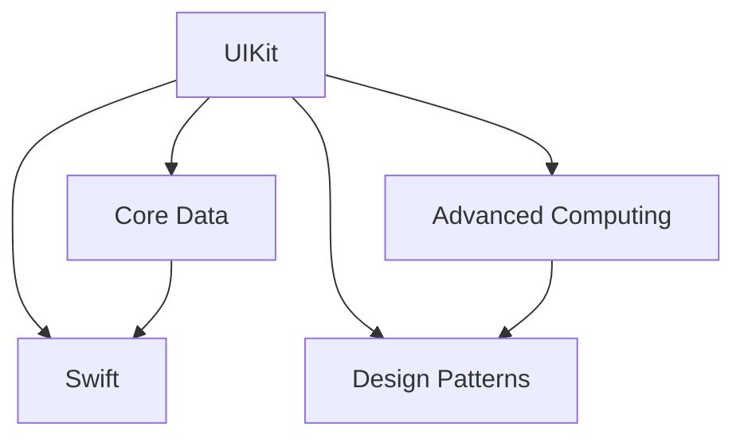

                 

  
## 1. 背景介绍

随着移动互联网的快速发展，iOS平台成为了开发者和用户的重要战场。每年，字节跳动都会在全球范围内招募大量优秀的iOS开发工程师，以满足其业务快速增长的需求。2024年的校招面试，更是对于iOS开发技术的要求达到了一个新的高度。本文旨在通过对字节跳动2024校招iOS开发工程师面试题的解析，帮助广大考生更好地准备面试，提高通过率。

## 2. 核心概念与联系

在iOS开发中，核心概念与联系的理解至关重要。以下是一个简化的Mermaid流程图，展示了一些重要的核心概念及其相互关系：



### 2.1. UIKit

UIKit是iOS应用程序的主要框架，提供了丰富的用户界面组件，如按钮、文本框、表视图等。理解UIKit的布局机制、响应式UI和动画是iOS开发的基础。

### 2.2. Core Data

Core Data是一个对象图映射和持久化框架，用于在应用程序中管理数据。它提供了高效的CRUD操作，并且支持与多种数据库的集成。

### 2.3. Swift

Swift是苹果推出的新一代编程语言，以其安全性、性能和易用性受到开发者喜爱。掌握Swift的基本语法、类型系统、内存管理（ARC）等是必要的。

### 2.4. Advanced Computing

高级计算技术如多线程、异步编程、网络编程和性能优化在iOS开发中应用广泛。理解这些技术对于提高应用程序的性能和用户体验至关重要。

### 2.5. Design Patterns

设计模式是解决常见软件设计问题的经验总结。在iOS开发中，熟悉常用的设计模式（如单例模式、观察者模式等）能够帮助开发者写出更高效、更可维护的代码。

## 3. 核心算法原理 & 具体操作步骤

### 3.1 算法原理概述

在面试中，算法题是考察编程能力和思维能力的重要环节。以下是一个常见的排序算法——快速排序（Quick Sort）的原理概述：

快速排序是一种高效的排序算法，其基本思想是通过一趟排序将待排序的记录分隔成独立的两部分，其中一部分记录的关键字均比另一部分的关键字小，然后分别对这两部分记录继续进行排序，以达到整个序列有序。

### 3.2 算法步骤详解

1. **选择基准**：从待排序的序列中选择一个元素作为基准元素。
2. **分区**：将序列划分为两部分，所有比基准元素小的元素放在其左侧，所有比基准元素大的元素放在其右侧。
3. **递归排序**：递归地应用上述步骤到左侧和右侧的子序列。

### 3.3 算法优缺点

**优点**：
- **时间复杂度**：平均情况下，快速排序的时间复杂度为O(nlogn)。
- **空间复杂度**：快速排序是原地排序算法，空间复杂度为O(logn)。

**缺点**：
- **稳定性**：快速排序是不稳定的排序算法。
- **最坏情况**：如果每次选择的基准元素都是最小或最大的元素，快速排序的时间复杂度将退化为O(n^2)。

### 3.4 算法应用领域

快速排序广泛应用于各种数据处理场景，如数据库排序、数据分析等。

## 4. 数学模型和公式 & 详细讲解 & 举例说明

在iOS开发中，数学模型的应用十分广泛，以下是一个简单的线性回归模型的公式推导和举例说明。

### 4.1 数学模型构建

线性回归模型假设数据之间存在线性关系，其数学模型为：

\[ y = \beta_0 + \beta_1 \cdot x + \epsilon \]

其中，\( y \) 为因变量，\( x \) 为自变量，\( \beta_0 \) 和 \( \beta_1 \) 分别为模型的参数，\( \epsilon \) 为误差项。

### 4.2 公式推导过程

为了求解线性回归模型的参数 \( \beta_0 \) 和 \( \beta_1 \)，我们通常使用最小二乘法（Least Squares Method）。其目标是使得实际观测值与模型预测值之间的误差平方和最小。

\[ \min_{\beta_0, \beta_1} \sum_{i=1}^{n} (y_i - (\beta_0 + \beta_1 \cdot x_i))^2 \]

通过对 \( \beta_0 \) 和 \( \beta_1 \) 分别求偏导数并令其等于零，可以得到：

\[ \beta_0 = \frac{1}{n} \sum_{i=1}^{n} (y_i - \beta_1 \cdot x_i) \]
\[ \beta_1 = \frac{\sum_{i=1}^{n} (x_i - \bar{x})(y_i - \bar{y})}{\sum_{i=1}^{n} (x_i - \bar{x})^2} \]

其中，\( \bar{x} \) 和 \( \bar{y} \) 分别为 \( x \) 和 \( y \) 的平均值。

### 4.3 案例分析与讲解

假设我们有一组数据如下：

| x | y |
|---|---|
| 1 | 2 |
| 2 | 4 |
| 3 | 6 |
| 4 | 8 |

根据上述数据，我们可以使用线性回归模型来预测 \( y \) 值。首先计算平均值：

\[ \bar{x} = \frac{1+2+3+4}{4} = 2.5 \]
\[ \bar{y} = \frac{2+4+6+8}{4} = 5 \]

然后计算 \( \beta_0 \) 和 \( \beta_1 \)：

\[ \beta_0 = \frac{1}{4} \sum_{i=1}^{4} (y_i - \beta_1 \cdot x_i) \]
\[ \beta_1 = \frac{\sum_{i=1}^{4} (x_i - 2.5)(y_i - 5)}{\sum_{i=1}^{4} (x_i - 2.5)^2} \]

经过计算，我们得到：

\[ \beta_0 = 0.5 \]
\[ \beta_1 = 1 \]

因此，线性回归模型为：

\[ y = 0.5 + 1 \cdot x \]

根据这个模型，我们可以预测当 \( x = 5 \) 时，\( y \) 的值为：

\[ y = 0.5 + 1 \cdot 5 = 5.5 \]

## 5. 项目实践：代码实例和详细解释说明

### 5.1 开发环境搭建

在进行iOS开发之前，我们需要搭建一个合适的工作环境。以下是在macOS上搭建iOS开发环境的步骤：

1. 安装Xcode：从macOS的App Store下载并安装Xcode。
2. 安装CocoaPods：CocoaPods是一个依赖管理工具，可以帮助我们管理项目中的库。安装命令为 `sudo gem install cocoapods`。
3. 配置Xcode命令行工具：在终端中运行 `xcode-select --install`。

### 5.2 源代码详细实现

以下是一个简单的iOS应用程序，用于实现一个计算器。源代码如下：

```swift
import UIKit

class ViewController: UIViewController {

    var displayValue: Double = 0
    var pendingOperation: String = ""

    @IBOutlet weak var displayLabel: UILabel!

    @IBAction func numberPressed(_ sender: UIButton) {
        let number = Double(sender.titleLabel!.text!)!
        if pendingOperation.isEmpty {
            displayValue *= 10
            displayValue += number
        } else {
            displayValue = number
        }
        updateDisplay()
    }

    @IBAction func operationPressed(_ sender: UIButton) {
        pendingOperation = sender.titleLabel!.text!
    }

    @IBAction func equalPressed(_ sender: UIButton) {
        let result = calculateResult()
        displayValue = result
        updateDisplay()
    }

    func updateDisplay() {
        displayLabel.text = String(displayValue)
    }

    func calculateResult() -> Double {
        switch pendingOperation {
        case "+":
            return displayValue + Double(displayLabel.text!)!
        case "-":
            return displayValue - Double(displayLabel.text!)!
        case "×":
            return displayValue * Double(displayLabel.text!)!
        case "÷":
            return displayValue / Double(displayLabel.text!)!
        default:
            return displayValue
        }
    }
}
```

### 5.3 代码解读与分析

在这个计算器应用程序中，我们使用了几个关键概念：

- **IBOutlet**：用于连接UI组件和代码。
- **IBAction**：用于响应按钮点击事件。
- **变量**：`displayValue` 用于存储当前显示的数值，`pendingOperation` 用于存储待执行的操作。
- **函数**：`updateDisplay` 用于更新显示，`calculateResult` 用于计算结果。

### 5.4 运行结果展示

当我们在界面中输入数字并点击操作符，计算器会更新显示。点击"="后，计算器会显示计算结果。

## 6. 实际应用场景

iOS开发的应用场景非常广泛，从简单的计算器到复杂的社交媒体应用程序，iOS开发者都在不断地创新和突破。以下是一些常见的应用场景：

- **社交媒体**：如Facebook、Instagram等，使用户可以轻松地分享内容和互动。
- **电子商务**：如淘宝、京东等，为用户提供在线购物体验。
- **娱乐**：如Netflix、Spotify等，为用户提供丰富的视听内容。
- **健康与健身**：如MyFitnessPal、Fitbit等，帮助用户追踪健康和健身数据。

## 7. 工具和资源推荐

为了更好地进行iOS开发，以下是一些推荐的工具和资源：

### 7.1 学习资源推荐

- **官方文档**：苹果官方提供了丰富的文档和教程，是学习iOS开发的最佳资源。
- **在线课程**：如Udemy、Coursera等平台提供了大量的iOS开发课程。
- **技术博客**：如Medium、GitHub等平台上有很多优秀的iOS开发者分享技术心得和代码实例。

### 7.2 开发工具推荐

- **Xcode**：苹果官方的开发环境，提供了丰富的工具和框架。
- **CocoaPods**：用于管理项目依赖的第三方库。
- **Simulator**：用于在电脑上模拟iOS设备，方便进行测试。

### 7.3 相关论文推荐

- **"A View of the iOS Ecosystem"**：介绍了iOS生态系统的发展历程和技术趋势。
- **"iOS Performance Guidelines"**：提供了iOS应用程序性能优化的最佳实践。

## 8. 总结：未来发展趋势与挑战

随着技术的不断进步，iOS开发领域也在不断演变。未来，iOS开发将面临以下几个发展趋势和挑战：

- **安全性**：随着隐私保护意识的增强，iOS开发者需要更加注重应用程序的安全性。
- **性能优化**：在性能方面，开发者需要不断探索新的技术和工具来提高应用程序的效率。
- **跨平台开发**：随着Flutter、React Native等跨平台框架的流行，iOS开发者也需要掌握这些技术。

## 9. 附录：常见问题与解答

### 9.1 什么是iOS开发？

iOS开发是指使用Swift或Objective-C语言，结合苹果提供的Xcode开发工具和框架，为iPhone、iPad等iOS设备开发应用程序的过程。

### 9.2 iOS开发的主要框架有哪些？

主要框架包括UIKit、Core Data、Swift等。UIKit用于构建用户界面，Core Data用于数据存储和访问，Swift则是苹果推出的新一代编程语言。

### 9.3 如何优化iOS应用程序的性能？

优化iOS应用程序的性能可以从以下几个方面入手：
- 减少视图层级
- 使用异步编程
- 优化数据库操作
- 避免在主线程进行耗时操作

## 作者署名

本文作者：禅与计算机程序设计艺术 / Zen and the Art of Computer Programming
----------------------------------------------------------------

[End of Article]
<|assistant|>

